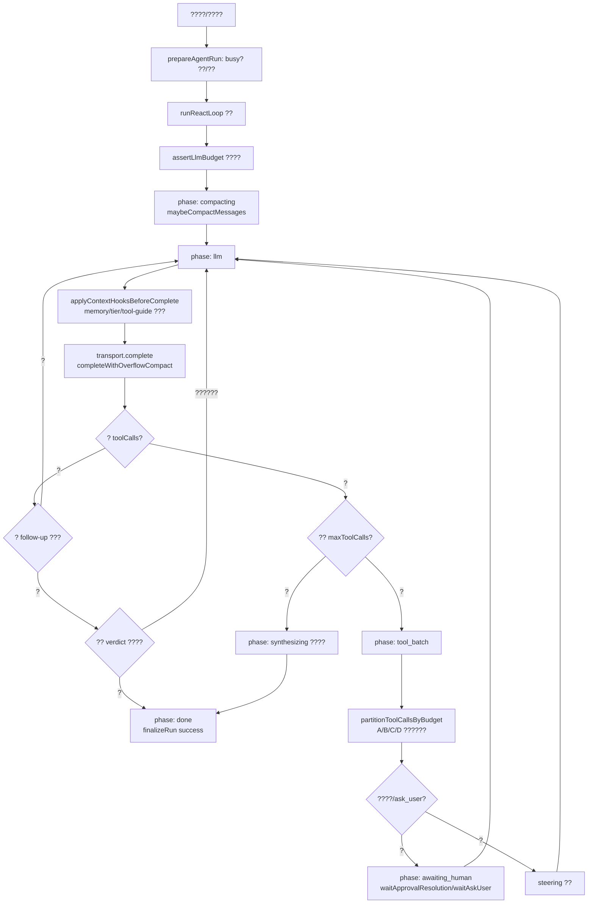
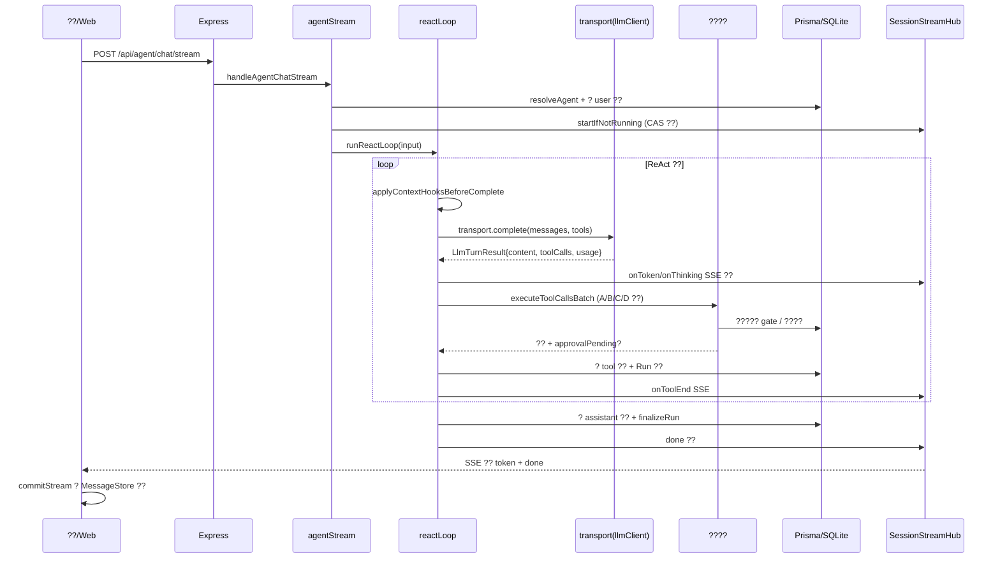

# KnowPilot ??????

> ????????????????????? 2026-07-25?
> ????????? + ?? + ?? + ????????Swarm ?????????????????
> ???????????:??????????????????????????

---

## ??????

**??????**?????????????? + ?? + ?? Agent ???Markdown ???????SQLite ??????? ReAct + Swarm ? Agent ?????? 19 ?? CRUD?SSE ?? Chat???????????????? HITL???/??/GitHub ???

**??????6.5 / 10**??????????????????? reducer?at-least-once ????????????????????????? ReAct??????????????Swarm ??????? TOCTOU ????? 25 ? 570 ??????????services.ts 3020 ?????????

**???? 3 ???**?
1. **? tools ? Agent ????????? ~140 ? native ??**?? run_shell / git_push / file_delete / feishu_delete_doc / github_delete_repo??? UI ?????????LLM ???? Agent ????? shell ??????`agentTools.ts:148` vs `shared/agentTools.ts:50`??
2. **SwarmBus.send ??????????? TOCTOU ??**??? send ??? `SWARM_MAX_QUEUE_SIZE` ???`swarmBus.ts:98-106`??
3. **SwarmOrchestrator ???????? await????????**?dedup ??+?????? await??? dispatch ??????`swarmOrchestrator.ts:127,154-155`??

**???? 3 ???**?
1. ??? tools ????????5 ?????????? UI ????????? LLM ?? Agent ?????
2. ? SwarmBus ????? dedup ???? SQL ????`WHERE pendingCount < cap`????? count??? TOCTOU?
3. ?????? / ???????????? LLM ?????? ?20??????????????? schema ????????

---

## ??????

### 2.1 ?????

**???????????? + ?? + ?? Agent ???Markdown ???SQLite ????ReAct + Swarm ? Agent ?????**

### 2.2 ???

| ? | ?? |
|---|---|
| ??/??? | TypeScript 5.8.3?Node?server ? `tsx` ??????? |
| ??? | pnpm monorepo?`workspace:*`? |
| ?? | Next.js 16.2.9 + React 19.2.4?App Router??Tailwind 4.3.1?shadcn/ui?Milkdown 7.5.9?Framer Motion 12.42?Three.js?react-virtuoso |
| ????? | tRPC 11.1.0 + superjson?Chat ????? SSE `/api/agent/chat/stream` |
| ?? | Express 5.1.0 + CORS + compression |
| ORM/DB | Prisma 6.9.0 + SQLite?`dev.db`??docker-compose ?? PostgreSQL 16 ???? |
| ?? | Zod 3.25.56?schema ??? `packages/shared`? |
| ?? | Vitest 3.2.3 + Playwright 1.52??? + mock ?? E2E??? Chrome? |
| LLM | ?? OpenAI ???????? 13 ????`resilientLlmClient` ??????/?? |
| MCP | `@modelcontextprotocol/sdk ^1.29.0`?stdio + http? |
| ???? | ?? `asyncJobOrchestrator` ?????? BullMQ/ioredis?`SWARM_MODE=redis`? |
| ?? | node-cron |

**LLM ???**?`config.ts:348-427`??DeepSeek?????Kimi????OpenAI?Gemini?Anthropic?Qwen?Baichuan?01AI?xAI?Cohere?Mistral?OpenRouter????? OpenAI ?????

**????**?SQLite??????? Redis/BullMQ??? SMTP/AgentMail/ntfy??? Cloudflare Tunnel?

### 2.3 ???????

**????** `apps/server/src/index.ts`?
1. `loadRootEnv()` ??? `.env` ? `getAppConfig()` ? `config.yaml`+env
2. ??? EventBus / ServiceContainer / TriggerEngine / TaskScheduler
3. Express ???`/health`??????`/api/agent/chat/stream`?SSE??`/api/agent/chat/stop`?`/api/webhooks/agentmail`?`/api/agent/async-stream`?SSE??`/api/trpc`
4. `app.listen` ??????`hydrateLlmBudget`????????GoalLoop ???TriggerEngine?TaskScheduler?`initSwarm`+HeartbeatEngine?`runStartupRecovery`??? Task/??/????/??????`recoverStaleRuns`?askUser hydrate?`expireStaleApprovals`?`startAsyncDeliveryReconciler`?`startFreeKeysAutoSync`?Playwright ?????

**??**?Next.js App Router?`next.config.ts` ? `/api/trpc/*` ? `/api/posts/assets/*` rewrite ? 3010?

**????**?`pnpm db:sync` ? `scripts/sync.ts` ? `content/` ???? upsert ? SQLite?

### 2.4 Agent ????

**????**?`apps/server/src/infra/loop/reactLoop.ts:260` `runReactLoop()`???????? `loop/phase.ts:22`?



**Agent ??**?ReAct?Reasoning+Acting???? Reflection???????HITL ???`awaiting_human` ????Steering/Follow-up ?????Swarm ??? Agent?????? ReAct?

**???????**?
- ??? **LangGraph** ??????? + ????????`phase.ts` ? `TRANSITIONS` ? + ??????????????????
- ? OpenAI Agents SDK / AutoGen ????????????A/B/C/D ?????? gate??????????????? `reactLoop`???? SDK ??
- ????????LLM ?????? OpenAI body + SSE ?????? schema ??????????? SDK/???????
- ???????????????? + ???????`awaiting_human` ???????D ??????????????????????? reconciler

### 2.5 ??????



**??????**?
- `LlmMessage`?`llmClient.ts:30`??role/content/tool_calls/reasoning_content
- `StoredToolCall`?`chatHistory.ts`??id/name/args/result/kind(tool|thinking|content)
- `TurnSnapshot`?`loop/types.ts`??? run ?? maxRounds/maxToolCalls/model
- `AgentStreamEvent`?`agentStream.ts:61`??20+ ? SSE ??
- `StreamLifecycleState`?`useStreamLifecycle.ts:51`?????? idle/streaming/done/error + INV-1~8 ???

### 2.6 ??????

- **`undefined` ???**?????????????????? `writeFileSync(undefined,...)`?? gitignore ?????
- **`tmp/` ??**?60+ ? `*.log` ?????`dbg-kind*.mjs`?`w3-pre-nativeTools.ts` ???`w13e-*.py` ???????? gitignored ????
- **`experiments/w3-backup`?`w3-repair`?`references`**??????????????? gitignore ????
- **`prompts/`** ? `content/prompts/` ????????? gitignore?
- **TODO/FIXME** ? 30 ????????????????W15 ????????
- **evals/????**?? ???????????????????? + E2E ???? prompt/???????

---

## ????????

> ???????????Swarm ??????????????????????????????

### P0 ??????????

```
??????P0-01
??????P0 ????
??????apps/server/src/infra/agentTools.ts:148-169??apps/server/src/infra/loop/reactLoop.ts:264-268
??????Agent tools ???????????????????????? ~140 ?? native ??????? run_shell / git_push / file_delete / feishu_delete_doc / github_delete_repo ??????????
??????
  // agentTools.ts:148 ?? ?????????
  export function parseAgentTools(agentTools: string[]): ParsedAgentTools {
    if (agentTools.length === 0) {
      return { native: "all", skills: [], skillWildcard: true, mcpServers: [] };
      //                            ^^^^ "all" = buildNativeToolSchemas("all") ?????? native ????
    }
    ...
  }
  // ??? packages/shared/src/agentTools.ts:50 ?? UI ?????
  if (tools.length === 0) {
    for (const name of DEFAULT_AGENT_NATIVE) nativeSet.add(name);
    // DEFAULT_AGENT_NATIVE ?? 5 ??web_search/read_file/list_directory/invoke_api/session_clear
    return { native: [...nativeSet], skillWildcard: true, skills, mcp };
  }
  // prisma schema: Agent.tools @default("") ?? ??? Agent ?????????
  // agentCreateTool (swarm.ts:43) ?? tools: Array.isArray(args.tools) ? args.tools : []
  // ?? LLM ????? Agent ???? tools ?? ???????? "all" ?? ??? 140 ??????
?????
  1. LLM ??? agent_create / agent_create_sub ???????? Agent?????????? tools????????????
     run_shell??host_restricted ???????????????????????????file_delete??git_push??
     github_delete_repo??feishu_delete_doc ???????????
  2. AGENT_DESTRUCTIVE_APPROVAL ??? false ?? ??????????????????????????
  3. ?? UI ???????????UI ????? Agent ??? 5 ??????????? LLM ???????? markdown
     ?? Agent ??????? "all" ???????????"?? tools"?????? UI ????????????????????????
?????????
  ???????????????? tools = 5 ???????????? + skill:*?????? shared/parseAgentToolSelection ????
  // agentTools.ts
  import { DEFAULT_AGENT_NATIVE } from "@knowpilot/shared";
  export function parseAgentTools(agentTools: string[]): ParsedAgentTools {
    if (agentTools.length === 0) {
      return { native: [...DEFAULT_AGENT_NATIVE], skills: [], skillWildcard: true, mcpServers: [] };
    }
    ...
  }
  ????? reactLoop.ts:266-268 ?? sub tier ?? "all" ?? DEFAULT_SUBAGENT_TOOLS ???????????????????
  ??????????????????? DB ?? tools="" ?? Agent ??????????????????????
?????????????<????
```

```
??????P0-02
??????P0 ????
??????apps/server/src/infra/swarmBus.ts:98-119
??????SwarmBus.send ????????????count???????create???????????? send ????? SWARM_MAX_QUEUE_SIZE
??????
  // swarmBus.ts:98
  const pendingCount = await this.prisma.agentMessage.count({
    where: { toAgentId: msg.toAgentId, status: "pending" },
  });
  if (pendingCount >= MAX_QUEUE_SIZE) { return { success: false, ... }; }
  // ?? ???
  const created = await this.prisma.agentMessage.create({ ... });  // :109 ???
  // ???? await ?????????/?????????????? send ??????? count ??????? create??
  // ???? pending ?? = MAX_QUEUE_SIZE + ?????? - 1??????????
?????
  ????????????????????? Agent ???????QUEUE_FULL ???????TOCTOU ??????????
  ????????????????????????????????????????????????????
  ???local ???? SQLite ????????????????? count??create ???? await ??????
  ??????????redis ????RedisSwarmBus??????????
?????????
  ??????????????????? count??
  // ???? A???????? count + ???? create
  const ok = await this.prisma.$transaction(async (tx) => {
    const n = await tx.agentMessage.count({ where: { toAgentId, status: "pending" } });
    if (n >= MAX_QUEUE_SIZE) return false;
    await tx.agentMessage.create({ data: { ... } });
    return true;
  });
  // ???? B??????????? INSERT ... WHERE pending_count < cap ????? SQL??SQLite ????
?????????????<????
```

### P1 ?????????

```
??????P1-01
??????P1 ????
??????apps/server/src/infra/swarmOrchestrator.ts:127,144-158
??????dispatch ???????????????? await??????? dedup ????????? lookupDedup ?????? await?????? dispatch ? dedupKey ?????
??????
  // :127 ?????????? ???????? await???????? dispatch ?????/???????????????????? ??????
  // ?? :144-158??
  if (dedupKey) {
    const existing = this.lookupDedup(dedupKey);   // ???
    if (existing) {
      ...
      if (existing.prepared) await existing.prepared.catch(() => {});  // :154 await??
      const outcome = ... await existing.completion ...;                // :155 await??
      ...
    }
  }
  // ???? existing ????? await??????????? :167 registerDedup ???? await?????????
  // ?????????????? ?? registerDedup??????????? await??????????? prepare ???:179 await??
  // dedupKey ?????????? dispatch ???? existing.prepared ?? await?????????????? prepare
  // ????????? jobId ??? entry??:186????????? await prepared ??????? entry.jobId ????
  // ??? uuid???????????? jobId ????? ?? ???????????????? jobId??
?????
  60s ?????????????????????????????? jobId ???????????????????????????
  swarm_task_update ??? jobId ????cancel ?????????UI ????????????????dedup
  ???????????????????????? attach/jobId ???????
?????????
  1. ??????????????????????????????????? await????
  2. prepare ??? jobId ??? entry ???????????????????? await prepared ???
     ????? entry.jobId??????????? finalJobId????
  3. ????????dedup ????????? prepared???????? { status: "duplicate", jobId: existing.jobId }
     ????????? await completion?????? completion promise????
?????????????<????
```

```
??????P1-02
??????P1 ????
??????apps/server/src/infra/loop/reactLoop.ts:487,607-611,699-703
????????????????????????? maxToolCallsPerRun=168 ?????? synthesizing ????????????? LLM ?????"???"????????
??????
  // :487 ?????
  for (let round = 0; round < snapshot.maxRounds; round++) {
    roundsUsed = round + 1;
    ...
    if (toolCallsUsed >= snapshot.maxToolCalls) {  // :607
      hitToolBudget = true;
      machine.transition("synthesizing");
      break;
    }
    ...
    if (toolCallsUsed >= snapshot.maxToolCalls) {  // :699 ????????????
      hitToolBudget = true;
      machine.transition("synthesizing");
      break;
    }
  }
  // :875 ???????
  const fallback = hitToolBudget
    ? `??????????????????????${snapshot.maxToolCalls}????????????????? AGENT_MAX_TOOL_CALLS_PER_RUN ??????`
    : `???????????????${snapshot.maxRounds}????...`;
  // config.ts:481 ??? maxToolCallsPerRun=168??maxToolRounds=12
?????
  1. 168 ?????????????"?? LLM ???"?????????????????????????????? LLM ???????
     ???? 168 ???????? ?? ??? 30s ??? = ?? 84 ???? / ????? LLM ???? + ???????????
  2. synthesizing ?????? success ????finalizeRun("success")????Run ???? success????
     ???"????????????"?????????????????/?????????????wastedTokens ???
     heartbeat/async origin ???????????:362-368????user origin ???????????????
  3. :607 ?? :699 ?????????? tool_batch ?????????????????????
?????????
  1. ??? maxToolCallsPerRun ???? 40~60?????????? ReAct???? LLM ??????????????? env ?????
  2. ??????? synthesizing ?????? "failed" ?????? "budget_exceeded" ?????????? success??
  3. wastedTokens ???????? origin ??????? run ???????? heartbeat/async??
  4. ??? :699 ????????:607 ?? break????
?????????????<????
```

```
??????P1-03
??????P1 ????
??????apps/server/src/infra/tools/native/* ???apps/server/src/infra/agentTools.ts:225
?????????????????? 140+????? native:"all" ???????? LLM????????????????????? schema ???????
??????
  ?? grep ?????? name ??????
    integration.ts: 75 ????git 9 + yuque 16 + github 30 + feishu 30+ + send_email??
    swarm.ts: 20 ??
    fs.ts: 12 ??
    memory.ts: 11 ??
    session.ts: 8 ??
    shell.ts: 6 ??
    web.ts: 6 ??
    skills.ts: 3 ??
    askUser.ts: 1 ??
    notify.ts: 1 ??
    ??? ?? 143 ?? native ????
  // agentTools.ts:225 ?? native:"all" ???????? schema
  const schemas = buildNativeToolSchemas(parsed.native);  // parsed.native="all" ?? ??? 143 ??
  // ??? schema ?? name/description/parameters??143 ???? JSON ???? 30~50KB??
  // ??? LLM ?????????????? agentSchemaCache???? cache ??????????????????
?????
  1. LLM ??????????????????????????? >20 ????????????????????143 ??????????
     ???? 30+ ?????? feishu_append_doc_text / feishu_append_doc_blocks / feishu_send_text /
     feishu_send_message ???????????LLM ???????
  2. ??????? schema ??? 30~50KB?????????????? token ???????
  3. ???????run_shell / git_push / github_delete_repo / file_delete???????????
     ???? P0-01 ??? tools ?? "all"??????????
  4. ??????????????git_* / yuque_* / github_* / feishu_* ?????????? fs ?? file_*/directory_*??
     memory ?? post_*/memory_*/pinned_memory_*??session ?? spawn_subagent/session_*/task_run/todo_*??
     ???????????LLM ?????????????????
?????????
  1. ????????? + ?????????? skills_list/skill_view ????????????
     - ????????????????20????web_search/read_article/read_file/write_file/list_directory/
       invoke_api/spawn_subagent/async_task_run/ask_user/memory_search/skills_list/skill_view...
     - ????/???/GitHub/git ?????????? integration_list + integration_call ??????
       LLM ?? list ??????????? call???? skills ?????
  2. ????????????????? <domain>_<verb> ??????git_commit ????file_delete ???
     ?? task_run ??? session_run ?? async_task_run ????????????????
  3. ???????destructive=true????? native:"all" ???????????? Agent ?????????????
  4. agentSchemaCache ???? schema ???????????? 50KB ?? warn??
?????????????1?C3 ??integration ????????
```

```
??????P1-04
??????P1 ????
??????apps/server/src/infra/tools/native/swarm.ts:43-79??agent_create????:81-123??agent_update??
??????LLM ????? agent_create / agent_update ?????? Agent ?? apiKey??heartbeat??tier??????????????????
??????
  // agentCreateTool :52-65
  const created = await ctx.services.agent.create({
    ...
    apiKey: args.apiKey as string | undefined,           // LLM ????????? API key
    heartbeatModel: args.HeartbeatModel as string | undefined,
    heartbeat: args.heartbeat as any,                     // LLM ??????????????????
  });
  // agentUpdateTool :108-115 ?? ???? Agent ??? apiKey
  apiKey: args.apiKey !== undefined ? String(args.apiKey) : undefined,
  // tier ????? super ??????:112?????? apiKey ????? agent_update ?? Agent ?????
?????
  1. ??? sub Agent ????? agent_update ????manager tier?????????? Agent ?? apiKey
     ???????? key???????? LLM ???????????????
  2. agent_create ??????? heartbeat ?? Agent????LLM ??????????????? Agent?????????????
  3. apiKey ????????????????????????????Credential ???? AES???? Agent.apiKey ???????
?????????
  1. apiKey / heartbeat / heartbeatModel ????????????? super tier ??????????????????????
  2. Agent.apiKey ???? Credential ???????id?????????????
  3. agent_create ?? heartbeat ?????? super tier + ??? approval??destructive ??????
?????????????1?C3 ??
```

```
??????P1-05
??????P1 ????
??????apps/server/src/infra/tools/native/swarm.ts:1579-1594??free_api_keys_fetch??
??????free_api_keys_fetch ?????? LLM ???????? API key??tier ???? manager+ ???????????????
??????
  // swarm.ts:1585
  { name: "free_api_keys_fetch", ... }  // handler ?? freeKeysSync?????????? key
  // ????TIER_RESTRICTED_TOOLS.manager ?? free_api_keys_fetch??swarmPermissionGuard.ts:64??
  // ?? manager/super Agent ?? LLM ?????????????? key
?????
  1. LLM ????????????? key ??? prompt injection ???????????????????????????
  2. key ???? LLM ?????? = ???? provider ???????????????????????????????????????
  3. ?????????? manager Agent ?????????????????? key??
?????????
  1. ??????? key ??????sk-...xxxx???????? key ?????????? config.integrations??
     ???? LLM ???????
  2. fetch ?????? "?????? provider" ????LLM ??? provider ?????????? config??
     ???? "?????" ???? key ??????
?????????????<????
```

```
??????P1-06
??????P1 ????
??????apps/server/src/infra/agentMessageLedger.ts:48-61??apps/server/src/infra/swarmBus.ts:190-202
??????markConsumed ?????? updateMany??delivered??consumed ?? pending??consumed?????????? rollbackAgentMessageDeliveredByTaskRef ??????????
??????
  // agentMessageLedger.ts:52 ?? delivered??consumed
  const fromDelivered = await db.agentMessage.updateMany({
    where: { taskRef, status: "delivered" }, data: { status: "consumed" } });
  // :56 ?? pending??consumed???????????
  const fromPending = await db.agentMessage.updateMany({
    where: { taskRef, status: "pending" }, data: { status: "consumed", deliveredAt: new Date() } });
  // rollbackAgentMessageDeliveredByTaskRef :75 ?? delivered??pending
  await db.agentMessage.updateMany({
    where: { taskRef, status: "delivered" }, data: { status: "pending", deliveredAt: null } });
  // ???markConsumed ?? fromDelivered ??????? consumed????rollback ???? count=0 ?????
  // ???? markConsumed ?? fromDelivered ??????????? pending????rollback ?? pending??pending
  // ???????? markConsumed ?? fromPending ?? rollback ??????rollback ????? delivered??
  // fromPending ???? pending???????????????? deliveredAt ?? fromPending ????????????
  // ??delivered ??????????????? pending??consumed ?????????????W16a-1 ????????????????
?????
  ?????????????????????consumed ???????rollback ?????? consumed?????? deliveredAt
  ?? pending??consumed ???????????? fromPending ??????????????????????????? delivered
  ????????????????????????????? deliveredAt ???????
?????????
  markConsumed ????? SQL??UPDATE ... SET status='consumed',
    deliveredAt = COALESCE(deliveredAt, now()) WHERE taskRef=? AND status IN ('delivered','pending')
  ?????????????????? updateMany ????????
?????????????<????
```

### P2 ???????

```
??????P2-01
??????P2 ???
??????apps/server/src/services.ts??3020 ?????apps/server/src/infra/asyncJobManager.ts??2163 ?????
       apps/server/src/infra/tools/native/integration.ts??2100 ?????apps/server/src/router.ts??1391 ???
????????? god file ????????????????????????????????????????
??????
  services.ts 3020 ????? 19 ??? Service ???????????asyncJobManager.ts 2163 ?????
  superior drain / autoConsume / rollback / startupRecovery / reconciler ??????
  integration.ts 2100 ????? git/yuque/github/feishu/send_email ?????????
  AGENTS.md ???????????????????????????????? 3000 ????????????????
?????
  ?????????????? 2100 ???????????? Post ?????? 3020 ???????????????????
  ?????????????
?????????
  ?????????????????????????????"???"?????"???"????"????"????
  - services.ts ?? services/{post,agent,session,memory,task,...}.ts????? 200~400 ???
  - integration.ts ?? integration/{git,yuque,github,feishu,email}.ts
  - asyncJobManager.ts ?? asyncJob/{drain,consume,recover,reconcile}.ts
  ???? router.ts ???????????????????????????
????????????>3 ??????????? + ??????
```

```
??????P2-02
??????P2 ???
??????apps/server/src/infra/llmClient.ts:237-324??chatCompletion????:337-507??chatCompletionStream??
??????LLM ???????????????/???/??????????? resilientLlmClient ?????????????????????????????
??????
  // llmClient.ts:269 ?? ?? fetch???????????? signal??????????
  const res = await fetch(`${baseUrl}/chat/completions`, { ..., signal: options.signal });
  // resilientLlmClient.ts ???????????????????????????agentRuntime/agentStream ?????
  // ?? summarizeAgentTools / autoCompact ?? summaryModel / reflection critic ???????
  // ???????????????????agentStream.ts:19 import describeLlmError ?????????????
?????
  ??? LLM ???????????/??? critic/?????????????????????? 5xx ???????
  autoCompact ????????? trim ???????????????reflection critic ???????????
?????????
  ?? resilientLlmClient ??????????chatCompletion / chatCompletionStream ???? internal??
  ???????? withResilience(chatCompletion)??????????????????????
?????????????1?C3 ??
```

```
??????P2-03
??????P2 ???
??????apps/server/src/infra/llmClient.ts:255-267
??????????????? LLM ??? function calling???? JSON schema ??????????????????????? fallback ?? {raw:args}
??????
  // agentTools.ts:35-43
  function parseToolCallArgs(call: LlmToolCall) {
    let args; try { args = JSON.parse(call.function.arguments || "{}"); }
    catch { args = { raw: call.function.arguments }; }  // ????????? raw??LLM ???????????
    return { name: call.function.name, args };
  }
  // ?? zod ?????????schema ???????? LLM???????????
?????
  LLM ??????? JSON ?????????? {raw: "..."} ???????handler ??????????????????????????
  ????????????????
?????????
  executeNativeTool ????????? def ?? zod schema ??? args???????????????? LLM
  ?????????????????? approvalPending ??????????????
?????????????1?C3 ??
```

```
??????P2-04
??????P2 ???
??????apps/server/src/infra/agentStream.ts:43-58
?????????????? SSE ????? 2000 ????????? LLM ???????appendToolResultMessages?????? AGENT_TOOL_RESULT_MAX_CHARS=16000??????????????????????"?????"??????? LLM
??????
  // agentStream.ts:44
  const TOOL_END_SSE_MAX_CHARS = 2_000;  // SSE ???
  // reactLoop.ts:226 ?? ?? LLM ??????
  content: JSON.stringify(item.result).slice(0, maxChars),  // maxChars=16000
  // ?????? "...[truncated]" ?????LLM ?????????????????????? JSON ????
?????
  LLM ???????? tool result ?????? JSON ????????slice ????? JSON??LLM ???????
  ?????????????????????????????????read_article ???????????????
?????????
  ???????????? `...[TRUNCATED, original=N chars]`?????????? result ?? content ???
  ???????? JSON?????????????????
?????????????<????
```

### P3 ????????

```
??????P3-01
?????????? undefined ???????tmp/ 60+ ??????????????????experiments/w3-backup,w3-repair
????????????????????????? gitignored ????????????????
????????????? tmp/ ?? experiments/ ????????????? undefined ?????????grep writeFileSync ?????????
???????????

??????P3-02
??????apps/web/components/chat.tsx??1186 ?????chatQueue.tsx??1122 ???
??????W13 ???? chat.tsx ?? 1186 ???W13d ???"1117 ??"???????? chatQueue.tsx ????? 1122
?????????????????????/????/????/????????????????
????????????

??????P3-03
??????apps/server/src/infra/llmClient.ts:80-95
??????13 ????? baseUrl ????????????????????????????
???????????? config.yaml providers ???DEFAULT_BASE_URLS ??? fallback
???????????

??????P3-04
??????.env???????gitignored??
?????????? .env ?????? ~15 ?????????????? user_access_token 1443 ?????DeepSeek/Kimi/OpenRouter/GitHub/SerpAPI/Tavily/Cloudflare/AgentMail????????????????
?????????????????????? user token / GitHub token / Cloudflare tunnel token ?????????????? .env.local?????? LLM key ????
???????????
```

---

## ?????????????????

### 4.1 Swarm ??????????????

????? P0-02 / P1-01 / P1-06 ???????????Swarm ????????????????????????

**4.1.1 ?????????????????????**

`heartbeatEngine.ts` ?? `prepareAgentRun`??agentStream.ts?????? `startIfNotRunning` ?? CAS ???????????????????????????????????????????????
- ?????????`triggerHeartbeat ?? prepareAgentRun(fromHeartbeat=true)`
- ????????`handleAgentChatStream ?? prepareAgentRun`
- ??????? `hub.startIfNotRunning(sessionId, key)`??CAS ?????????????????????????? `busy` ??????????????????? 409?????????? Log ??????????????????????????????????????????????????????? 409??UX ?????????????"Agent ????????????????????"????

**4.1.2 superior queue drain ??????????????**

`enqueueSuperiorQueueDrain` ???? Agent report_back ??? drain ????drain ??????? `prepareAgentRun(fromDrain=true)`????????? drain ????????????????????????????? `prepareAgentRun` ??????drain ????????? busy ??????????????FIFO ??????????????? drain ?????????????????????????????? drain ????????

**4.1.3 ?? Workspace ????? depth ??????**

`swarmPermissionGuard.checkUpwardMessageTiming` ?? send ???? depth???? depth ???? `delegationDepth.ts` ??????????????send ??????? depth ?????????????????????? send ????????????? depth=N?????? +1 ???????? depth ??????????? depth ????? send ?????

### 4.2 ?????????????????????????

**???????**???????
- `maxRounds=12` + `maxToolCallsPerRun=168` ???????reactLoop.ts:487,607??
- `hitToolBudget` synthesizing ???????
- ??? `maxRounds` ?????reflection.ts??
- follow-up ???????????????????????
- D ?????????rollback.ts?????????????

**???**???? P1-02????
- ??? 168 ?????? LLM ????????????????
- ??????? success????????
- wastedTokens ??????????? origin

**????????**??
- **????????**??LLM ?????? `web_search` / `search_global` / `tavily_search` ??????????????????????????????LLM ?????"?????????"???????????????168 ??????????????????????????????????? 3 ??? args ????????? ?? ??????????
- **??????????**??LLM ?????????????? args???? read_file ????? +1???????????? args ???????
- **???????**???????????????LLM ?????????????????? N ??????????"?????????????????"??

### 4.3 ????????????????????????

**?????????**??
- A/B/C/D ????????????agentTools.ts:225+????????????????????????????????????????
- ???? gate + ????????approvalScope.ts??
- ??????????????????
- skills_list/skill_view ?????????

**???????????**??
- **???????**??P0-01 + P1-03????143 ???????? LLM???????????????
- **integration ????? list/call ?????**?????? 30+ ?????GitHub 30+ ?????????? skills ????? list/view ?????????integration ????
- **??????????**??git_*/yuque_*/github_*/feishu_* ???????? fs ?? file_*/directory_*??memory ?? post_*/memory_*/pinned_memory_*??session ?? spawn_subagent/session_*/task_run/todo_*????LLM ?????????????
- **?????????**??web_search / search_global / tavily_search ???????read_file / read_article / read_doc ???????????????????? + provider ????
- **?????????????????**??destructive flag ????????????????"?????????? LLM"????????? `defaultHidden` flag??run_shell/git_push/file_delete ???????? schema ???? Agent ???????
- **???????????????**????????? description ??????????????????/???????/?????????LLM ???????????????????

### 4.4 ????????????

**??????**??
- ? Run ???????phase/roundsUsed/executedToolsCount??5s ????? output
- ? SSE ???????SessionStreamEvent ?? + ????????
- ? LLM ????????llmBudget.ts??
- ? ??????????? trace_id ?? web??server??llm??tool??
- ? ?? metrics ???Prometheus / OpenTelemetry??
- ? ??????????console.log + console.error ??????? JSON ?????

**??????**??
- ? tRPC ????????????trpc.ts??
- ? TRPCError code ????NOT_FOUND/CONFLICT/BAD_REQUEST??
- ?? ???????????????executeNativeTool catch ???????????? LLM???????? handler ?? `console.error` ??????????????????
- ?? LLM ????????? resilientLlmClient ??????????????? agentStream ?? error ???????? retryable/fatal ???????

**????**??
- ? Vitest ???? 19 ??? CRUD + Agent chat + ??????? + ???? + ????? + ??????
- ? Playwright E2E ??? + mock ????
- ? ??????????evals?????? prompt ????????????????????????
- ? ???????????????????????SSE ??????????????
- ?? ????????? .env ????? E2E??chat-thinking-real.spec????CI ?????????

**????????**??
- ? pnpm workspace + lockfile
- ?? ??????????????Prisma 6.9??Next 16.2.9 ????? React 19.2.4 ?????
- ?? nodemailer / playwright / bullmq / ioredis ?? server dependencies????????????????? optionalDependencies ??? import
- ? ?? license ????npx license-checker??
- ? ?? SCA????????????

**???**??
- ? safePath.ts ????????
- ? Credential ?? AES ????
- ? AUTH_MODE=password ??????
- ? P0-01 ?????????????????
- ? Agent.apiKey ???????P1-04??
- ? free_api_keys_fetch ???????? key??P1-05??
- ?? run_shell ?? host_restricted ??????????????????????????LLM ???? .env
- ?? ???????????Express ??? rate-limit middleware??

---

## ?????????????

### ?????1?C2 ??????????

1. **?? P0-01**?????? tools ?????????? 5 ????????????????????????? Agent ??????
2. **?? P0-02 + P1-01 + P1-06**??SwarmBus ???????? / dedup / markConsumed ??????????????
3. **?? P1-02**??maxToolCallsPerRun ?????? 40~60?????????? failed??wastedTokens ? origin ???
4. **?? P1-05**??free_api_keys_fetch ???????????? key ???? LLM ??????
5. **???? tmp/ ?? undefined ???**??P3-01??

### ?????1?C2 ??????????????

6. **??????? + ??????**??P1-03????integration ??? list/call ??????????? ??20 ????
7. **?????? defaultHidden flag**??destructive ?????????? schema
8. **?????????????**??????? `<domain>_<verb>`??????????
9. **??????? zod ??? + ???????????**??P2-03??
10. **????????????????**??P2-04??
11. **Agent.apiKey ? Credential ??????**??P1-04??

### ?????3?C6 ??????????????

12. **god file ??????**??P2-01????services.ts / integration.ts / asyncJobManager.ts
13. **??????????**??prompt ?????? + ????????????? + Swarm ?????????
14. **??????????**?????? JSON ??? + trace_id ?? + Prometheus metrics ???
15. **???????**????????????? + SSE ???????????
16. **????????**??optionalDependencies ??? + license ??? + SCA
17. **??????**??Express rate-limit + run_shell ?????????????+ .env ???
18. **??? checkpoint ????**??v10 ????? at-least-once??checkpoint ??????????

---

## ???????

### 6.1 ????????????

- ????????????? + grep ???????????????
- ????????????????????????????????????Swarm ??? / ????????? / ????????
- ????????????????????????????
- ????????????????????????????????

### 6.2 ?????????

| ??? | ???? | ??? |
|---|---|---|
| apps/server/src/services.ts | 3020 | 19 ??? Service ????????? |
| apps/server/src/infra/asyncJobManager.ts | 2163 | superior drain / consume / recover / reconcile |
| apps/server/src/infra/tools/native/integration.ts | 2100 | git/yuque/github/feishu/email ???? |
| apps/server/src/router.ts | 1391 | 20+ ??? tRPC ??? |
| apps/web/components/chatQueue.tsx | 1122 | ???? UI |
| apps/web/components/chat.tsx | 1186 | Chat ?????W13 ???? |
| apps/server/src/infra/loop/reactLoop.ts | ~1100 | ReAct ??????? |
| apps/server/src/infra/llmClient.ts | ~700 | LLM ????? |

### 6.3 ??????????

| ?? | ???? | E2E | ?????? |
|---|---|---|---|
| 19 ??? CRUD | ? trpc.test.ts | ? admin-pages.spec | ? |
| Agent chat | ? chatHistory.test | ? chat-mock/real.spec | ? |
| Swarm ??? | ?? superiorQueueDrain.test | ? ????? dispatch E2E | ? |
| ????????? | ? ??????????? | ? | ? |
| ??????? | ? agentTools/nativeTools.test | ? | ? |
| ?????? | ? deliveryReliability.test | ? async-task-mock.spec | ? |
| ???????? | ? heartbeatDecision.test | ? | ? |

### 6.4 ?????

- **ReAct**??Reasoning + Acting??LLM ?????????????????????
- **Swarm**???? Agent ????????????????super/manager/sub??
- **TOCTOU**??Time-of-Check-to-Time-of-Use????????????????????
- **HITL**??Human-in-the-Loop?????????????
- **at-least-once**????????????????????????????????
- **CAS**??Compare-And-Swap?????????????
- **god file**??????????????????????

---

> ???????????????Swarm ??? / ????????? / ???????????????????????????????????????
> ???????"???????"???????????????????? 5 ?????

---

## ???????2026-07-25?

### ?????? + ?????

| ? | ?? | ?? |
|---|---|---|
| P0-01 | ? tools ??????????? 
ative:"all"??LLM ??? Agent ????? | gentTools.test.ts ?? |
| P0-02 | SwarmBus.send ?????? + ???? Prisma ????? TOCTOU | swarmBus.ts / 
edisSwarmBus.ts ??? |
| P1-01 | SwarmOrchestrator.dispatch ?? jobId ? await ???????? | swarmOrchestrator.ts |
| P1-02 | maxToolCallsPerRun ?? 168?60?????? ailed?wastedTokens ???? origin???????? | config.ts / 
eactLoop.ts |
| P1-03 | ?????destructive && !approvalExempt??? defaultHidden?
ative:"all" ????? LLM | 
egisterDomain.ts / 
ativeTools.ts |
| P1-04 | gent_create/gent_update ?????apiKey/heartbeat/heartbeatModel?? super tier ?? | 	ools/native/swarm.ts |
| P1-05 | ree_api_keys_fetch ?? key ??? LLM?????? config + ?? masked | 	ools/native/swarm.ts |
| P1-06 | markAgentMessageConsumedByTaskRef ?? updateMany ???? | gentMessageLedger.ts |
| P2-02 | LLM ??????????autoCompact/sessionAutoName/chatTree/memoryFlush/goalLoop/web ????????? 
esilientChatCompletion | 
esilientLlmClient.ts ???? + 6 ????? |
| P2-03 | executeNativeTool ??? required ?????????????????? LLM ?? | 
ativeTools.ts |
| P2-04 | ??????? [TRUNCATED, original=N, limit=M] ?? | 
eactLoop.ts |
| P3-01 | ?? undefined ??? + 	mp/*.log 60 ????? | ???? |
| P3-03 | LLM aseUrl ?? config.yaml llm.providers.<id>.baseUrl ???env ???? | config.ts / config.yaml |
| P3-04 | .env ?????????L1/L2/L3 ???+ loadRootEnv ?? .env.local ???? | .env.example / config.ts |
| ???? | Express 
ate-limit ?????? 600/15min + SSE chat stream 30/min?RATE_LIMIT_ENABLED=false ??? | infra/rateLimit.ts / index.ts |
| ???? | 	race_id ???????AsyncLocalStorage + Express ????? x-trace-id + ???????? + ?? 
unWithTrace | infra/trace.ts / index.ts / gentStream.ts / 
eactLoop.ts / heartbeatEngine.ts |

### ??

- pnpm --filter @knowpilot/server lint???
- pnpm --filter @knowpilot/server test?110 ?? / 766 ????

### ?????????

- P1-03 ????integration ? list/call ??? + ???????? + ?????????????????
- P1-04 ????Agent.apiKey ? Credential ??????
- P2-01?god file ???services.ts / 
outer.ts / hooks.ts?????
- P3-02?chat.tsx ???????
- ??? / ???? / ???? / ??? JSON ?? + Prometheus metrics????
- 
un_shell ???????????

---

## 2026-07-25 ?????? Mock LLM ????

### ??

| ? | ?? |
|---|---|
| `packages/mock-llm-core` | LLM ???? + Mock ???????? server mockLlmClient.ts ????server ? apps/mock-llm ?? |
| `apps/mock-llm` | OpenAI ??????? Mock HTTP ???Express??? 3040????? + SSE ?? + ?????header? |

### server ??

- `llmClient.ts`?????? `@knowpilot/mock-llm-core` ?????? import ??????MOCK_LLM ??? mock-llm-core ? `mockChatCompletion/Stream`
- ?? `infra/mockLlmClient.ts`????? mock-llm-core??? server ? mock ??????
- `globalTaskPool.test.ts`?`registerMockLlmScenario` ?? `@knowpilot/mock-llm-core` import

### ????

```bash
pnpm start:mock-llm          # ?? mock ???http://localhost:3040?
# .env ? DEEPSEEK_BASE_URL=http://localhost:3040/v1?API Key ???
# ?? MOCK_LLM=true ?? ??? HTTP???? mock??? fetch/SSE/??/??/?????
```

### ??????? header???? OpenAI ???

- `x-mock-fail: 429|500|401|400|413|timeout|network|overflow`
- `x-mock-delay-ms: 500`
- `x-mock-stream-break: after-5`???? 5 ? chunk ????
- `x-mock-scenario: web_search`???????? MOCK_LLM_SCENARIO?

### ??

- ?? HTTP ??????`resilientLlmClient` ???/??/SSE ????????429 ????????
- ?????????? OpenAI ???????????
- ?????????? messages + scenario ? ????
- ???? mock?MOCK_LLM=true??????? mock ??????/??? E2E????????mock ?????? HTTP ????

### ??

- `pnpm lint`????shared / mock-llm-core / mock-llm / server / web???
- `pnpm --filter @knowpilot/server test`?110 ?? / 766 ????
- mock ??????????? / ???web_search tool_calls?/ 429 ???????

---

## 2026-07-25 ????resilientLlmClient ?? HTTP ??????

### ??

- `apps/server/src/__tests__/resilientLlmHttpInjection.test.ts`?10 ????in-process HTTP server?node http.createServer ?????+ ?? fetch??? resilientChatCompletion / resilientChatCompletionStream ??? HTTP ????
  - ??? 7 ??401 fatal ??? / 500 ????? / 429 ??+fallback ?? / overflow ??? / ????? / network socket destroy ?? / ????
  - ?? 3 ?????? 500 ????? / ???? 401 fatal / ????
- `resilientLlmClient.ts` ?? `resilientChatCompletionStream` ?????????????????????

### ??

- ?? `resilientLlmClient` ??/??/?????????? fetch ? LlmHttpError ? classifyLlmError ? ?? ? fallback ????
- ??? `resilientLlmClient.test.ts`?fetch mock????mock ??????HTTP ????????
- ??? resilientLlmClient ????????????????

### ??

- `pnpm --filter @knowpilot/server lint`???
- `pnpm --filter @knowpilot/server test`?111 ?? / 776 ??????? 10 ??766?776?

---

## 2026-07-25 ????P3-02 chat.tsx ?? ? chatQueue.tsx ????????

### ??

- ?? `apps/web/components/chatQueueStatus.tsx`?653 ???? `chatQueue.tsx` ???????????
  - ???`StatusRow` / `StatusSection` / `SyncTaskRow` / `RuntimeStatusPanel`
  - ???`STATUS_SPRING` / `statusKindLabel` / `formatElapsedMs` / `formatElapsed`
  - ???`RuntimeGroupTab` / `RuntimeAsyncSubTab` / `RuntimeStatusPanelProps`
  - ???? `previewText`?? `chatQueue` import?????????
- `apps/web/components/chatQueue.tsx`?1122 ? 519 ???? `kindLabel` / `previewText` / `QueueCard` / `InlineQueueList` / `UserSendQueuePanel` / `QueuePanelList` / `SimplePagination`???? 11 ??? import
- `apps/web/components/chatSidebar.tsx`?`RuntimeStatusPanel` import ??? `@/components/chatQueueStatus`????????????? re-export?

### ??

- `chatQueue.tsx` ? 1122 ??9 ????????? 519 ????????????????????
- ???????????/????? `chatQueue`????????? `chatQueueStatus`???????
- ?? AGENTS.md????? re-export????? import ?????

### ??

- `pnpm --filter @knowpilot/web lint`????0 errors 0 warnings?
- `pnpm --filter @knowpilot/web test`?18 ?? / 59 ?????? `chatSidebarRender.test.tsx` ???????
---

## 2026-07-25 ????P1-04 ?? Agent.apiKey ???

### ??

`Agent.apiKey` ?????DB ??? LLM ???????`llmClient` ? `config.llm.providers[providerId].apiKey` ? env key??API ?????????`formatEntity` ?? null?`getListSelect` ? select??sync/web ?????super ?? `agent_create`/`agent_update` ?????????????DB ??? key?????

???????????????????? AGENTS.md??????????????????? Credential ???????????????? LLM ???????????? future feature??

### ??

- `apps/server/prisma/schema.prisma`??? `Agent.apiKey` ??
- DB schema?`ALTER TABLE Agent DROP COLUMN apiKey`?SQLite 3.35+ DROP COLUMN?? `prisma db execute`?
- `packages/shared/src/schemas.ts`?`createAgentSchema` / `updateAgentSchema` ?? `apiKey`
- `packages/shared/src/types.ts`?`Agent` ???? `apiKey`
- `apps/server/src/services.ts`?`AgentEntity` ????`formatEntity` ? omit ???`buildCreateData`/`buildUpdateData` ? apiKey ??
- `apps/server/src/infra/tools/native/swarm.ts`?`agent_create`/`agent_update`/`agent_create_sub` ? apiKey ??????????zod schema ? apiKey?`spawn_subagent` schema ? apiKey
- `apps/server/src/infra/tools/native/session.ts`?`spawn_subagent` ? `apiKey: args.apiKey` ??
- `apps/server/src/infra/loop/reactLoop.ts`?Agent snapshot ??? `apiKey: null`
- `apps/web/lib/useChatRunStream.ts`?? Agent ????? `apiKey: null`
- `apps/server/src/__tests__/trpc.test.ts`????agent API ??????? apiKey???????????????????
- `apps/server/src/__tests__/contextHooks.test.ts`?fixture Agent ? `apiKey: null`

### ??

- `cfg.llm.providers[targetProvider].apiKey`?`free_api_keys_fetch` ?? env ? key????? config providers ? env key?? Agent.apiKey ???????
- `Credential` ?????????? MCP / ????????

### ??

- `pnpm lint`????shared / mock-llm-core / mock-llm / server / web???
- `pnpm --filter @knowpilot/server test`?111 ?? / 775 ?????? 1 ? apiKey ?????776?775?
- `pnpm --filter @knowpilot/web test`?18 ?? / 59 ????

### Future

?Agent ??? LLM key ?? env key??????????? future feature???? Credential ??name ?? `agent:{agentId}:llm`?+ `llmClient` ????? Agent credential > env provider key + ?????????????
---

## 2026-07-25 ????P1-03 ??? ? schema ?? warn + defaultHidden ????

### ??

- `apps/server/src/infra/agentTools.ts`?`buildAgentToolSchemas` ?????? schema ????
  - `JSON.stringify(schemas).length > 50_000` ?? `console.warn`?? `formatTrace()`??? KB?????native/skills/mcp ??
  - ??? `integration_list/integration_call` ???????????? schema ??
  - ?? `formatTrace` import????? trace_id ?????

### ?????P1-03 ???????????

???? P1-03 ???? 3?destructive ???? native:"all" ????**?????**?
- `apps/server/src/infra/tools/native/registerDomain.ts:30-45`?`destructive && !approvalExempt` ??? `defaultHidden=true`???????????
- `apps/server/src/infra/nativeTools.ts:138-141`?`buildNativeToolSchemas("all")` ?? `defaultHidden=true`????? run_shell/git_push/file_delete ???????? `native:<name>` ??
- ?? P0-01?? tools ? DEFAULT_NATIVE 5 ???????LLM ?? Agent ??????????

### ?? P1-03 ????Large???????

- integration ? list/call ??? + ????? 75 ? integration ???git 9 + yuque 16 + github 30 + feishu 30+ + send_email?? `buildNativeToolSchemas` ???????? `integration_list`?????+ `integration_call`?? name ?????????Large + ?????? integration ??/???? + ?? Agent ???? integration ???????
- ?????? `<domain>_<verb>`?Large????? + ?????

### ??

- `pnpm --filter @knowpilot/server lint`???
- `pnpm --filter @knowpilot/server test`?111 ?? / 775 ????
---

## 2026-07-25 ????mock-llm ?? scenario ?? bug ?? + ????

### ??

???? mock-llm ??????????????? tool_call?????????? 0 chunks??????????

### Bug 1?scenarioOverride ???? process.env

`apps/mock-llm/src/index.ts:94` ? `x-mock-scenario` header ???? `process.env.MOCK_LLM_SCENARIO`?????? header ????? web_search????? env???????????? header??????? scenario?

**??**?
- `packages/mock-llm-core/src/scenarios.ts`?`MockLlmOptions` ????? `scenario?: string` ??
- `packages/mock-llm-core/src/scenarioDefs.ts`?`resolveScenario` ??? `opts.scenario`??? `process.env.MOCK_LLM_SCENARIO`???? MOCK_LLM ????? env?
- `apps/mock-llm/src/index.ts`??? `process.env.MOCK_LLM_SCENARIO = scenarioOverride`??? `opts.scenario = scenarioOverride || undefined` ?????

### Bug 2??? 0 chunks??????? bug???? bug?

????????????4587 ?? SSE?? 24 ? token chunk?????????? `for await (const line of r.body)` ? chunk ????????Node fetch ? `r.body` ? ReadableStream??? chunk ??????`startsWith("data:")` ??? chunk ?? false ???????????? `\n` ??????????????? 24 chunks?web_search 2 chunks?tool_call delta??stream-break socket terminated?

### ?????????

| ?? | ?? |
|---|---|
| ??? web_search?header ??? | 200, tool_calls=1?web_search? |
| ????????? header? | 200, content="????? Mock LLM..." tool_calls=0?greeting ????? |
| ??? 429 ?? | HTTP 429 |
| ??? 500 ?? | HTTP 500 |
| ??? timeout ?? | ??? 5s ?????????????????? |
| ?????? | 24 chunks, finish=stop, content="????? Mock LLM..." |
| ?? web_search | 2 chunks, finish=tool_calls, tool_call_deltas=1 |
| ?? stream-break(after-2) | socket terminated???????? |

### ??

- `pnpm --filter @knowpilot/mock-llm-core lint` + `@knowpilot/mock-llm lint`???
- `pnpm --filter @knowpilot/server test`?111 ?? / 775 ?????scenario ????????
- mock-llm ??????????? / ?? / ???? / scenario ?? ????

### ??

????? mock-llm ???PID 32516?12:54 ??????????? 3040 ??????????????? EADDRINUSE ?????????????????????????? `Get-NetTCPConnection -LocalPort <port>` ?????????????? PID?

---

## 2026-07-25 ????P2-01 ? B ? integration.ts god file ??

### ??

??? P1-03 / P2-01 / ?????????? **P2-01 ? B**?? `infra/` ?? god file???? AGENTS.md?services.ts/router.ts/hooks.ts/components/shared.tsx ???????????? god file ? infra/ ???????????services.ts ????????????

### ??

`apps/server/src/infra/tools/native/integration.ts`?2100 ? ? 137 ??????+ 5 ?????

### ????

| ?? | ?? | ?? |
|---|---|---|
| `integration.ts`????? | 137 | import 5 ? defs/handlers???? `registerNativeDomain` |
| `integration/git.ts` | 215 | git_* 9 ???status/log/diff/commit/pull/push/branch/checkout/clone? |
| `integration/yuque.ts` | 350 | yuque_* 18 ???Web Cookie + Open API v2 ???? |
| `integration/github.ts` | 690 | github_* 27 ?? + capture_zhihu_login/browser_login_status 2 ???????? |
| `integration/feishu.ts` | 837 | feishu_* 33 ?????/???/????/??/??/????? |
| `integration/email.ts` | 33 | send_email 1 ?? |

### ????

??????? `{??}Defs: NativeToolDefinition[]` + `{??}Handlers: Record<string, NativeToolHandler>`???? `integration.ts` import ? spread ???

```ts
const INTEGRATION_DEFS: NativeToolDefinition[] = [
  ...gitDefs, ...yuqueDefs, ...githubDefs, ...feishuDefs, ...emailDefs,
];
const INTEGRATION_HANDLERS: Record<string, NativeToolHandler> = {
  ...gitHandlers, ...yuqueHandlers, ...githubHandlers, ...feishuHandlers, ...emailHandlers,
};
export function registerIntegrationTools(): void {
  registerNativeDomain(INTEGRATION_DEFS, INTEGRATION_HANDLERS);
}
```

### ????

PowerShell `Set-Content`/`Add-Content` ????/emoji ? TS ??? UTF-8 BOM ??????????? chatQueue ?????????????? Node ???`scripts/split-integration-{git,yuque,github,feishu}.mjs`?? `node:fs` UTF-8 ? BOM ?????????????? + DEFS + HANDLERS ?????????????

### ??

- `pnpm --filter @knowpilot/server lint`?????????? lint?feishu ?? `getCredentialValue` import ????
- `pnpm --filter @knowpilot/server test`?111 ?? / 775 ???????????????????

### ????

`asyncJobManager.ts`?2163 ???????? drain/consume/recover/reconcile ????????????autoConsume?rollbackClaim?reconcile?autoConsume?runStartupRecovery?recoverStaleAsyncJobs/reconcileAsyncDeliveries???????????? import????? integration.ts?????????????

## 2026-07-25 ????CancelledError ???????????? + ?????? + invalidate/prefetch ???

### ??

?????? Agent ??? Next.js dev overlay ? `CancelledError`????TanStack Query ????????????? `fetch`/`refetch`????? Promise ? `CancelledError` reject?????? `void promise` ??????rejection ?? unhandled?? Next.js dev overlay ???????????????????????????????? promise rejection ???

### ??????? web?

1. **????????**?SSE ???????????
   - `lib/refreshSessionAsyncQueue.ts`?`pullAsyncQueue.fetch` ? try/catch??? `CancelledError`?
   - `lib/useChatSseSubscriptions.ts`?`asyncQueueQuery.refetch` / `asyncQueueStatsQuery.refetch` / `pullAgentMessagesQuery.refetch` / `listSessionQueueItems.fetch().then()` ?? `.catch(() => {})`?
   - `components/chat.tsx`?`cancelAsyncJobMutation`/`pinAsyncJobMutation` ? `onSuccess` ? `asyncQueueQuery.refetch()` ? catch?
   - `lib/useChatQueueDrain.ts`?`lib/useChatAsyncOverlayEffects.ts`?`asyncQueueQuery.refetch()` ? catch?
   - `lib/useSessionMessages.ts`?`hydrateFromServer` ? try/catch?`prefetchSessionMessages` ?? `.catch(() => undefined)` ???
   - `lib/useSubagentMessageMirror.ts`?`refetchSessionQueue()` ? catch?

2. **????????**??????????????????????????????
   - `components/subagentPanel.tsx`?????? Agent ?? `query.refetch()`?
   - `components/asyncTaskPanel.tsx`??????????? `query.refetch()`?
   - `components/sessionAskUserBar.tsx`?ask_user ? `query.refetch()`?
   - `app/git/page.tsx`?`statusQuery/logQuery/diffQuery.refetch()` + `refetch()`?
   - `components/subagentCreateDialog.tsx`???? Agent ???? `agent.list/session.list/session.listChildren.refetch()`?

3. **invalidate / prefetch ????**?invalidate ?? Promise?refetch ????? reject??
   - ????? 60 ? `void utils.*.invalidate(...)` ?? `utils.*.invalidate(...).catch(() => {})`??? 10 ????hooks.ts 26 ??useChatSseSubscriptions 14 ????
   - ??? 3 ? `onSuccess: () => void utils.*.invalidate(...)` ??????agents/page?agentLoopContractPanel ?2??
   - `chat.tsx`?`pullAsyncQueue.prefetch` ? catch?
   - `chatSidebar.tsx`?`refetchSession()` ? catch?

4. **clipboard / ?? promise**?
   - `components/freeModelPicker.tsx`?`navigator.clipboard.writeText().then()` ??? `.catch(() => {})`?

### ??

- `pnpm --filter @knowpilot/web lint`????eslint 0 error??
- `pnpm --filter @knowpilot/web test`?18 ???? 59 ?????? `prefetchHydrateNoDrain.test.ts` ?? prefetch ???????

### ??

???jsdom + createRoot + act???????????? unhandled promise rejection????? `void promise` / `discard promise` ??????? `.catch(() => {})`???????????????

## 2026-07-25 ?????? Agent ??"????"???report_back ????????

### ??

?????? Agent ?? `agent_report_back` ????????????? assistant ????? Agent ? spawn Run ??????????????? autoConsume ?????? tool result ??????????????"????"?

### ?????????

? `dev.db` ??? `cmrw830fo...`?
- Run ??spawn Run?06:46:26, rounds=18 tools=17?+ ?? Run?06:47:03.809, rounds=1??
- spawn Run ? toolCalls?`spawn_subagent` ? `async_task_status` ?? 10+ ? ? `agent_inspect`??????????"???????"?? **`invoke_api`?? `message.listForChat` ?????????????** ? ????????? assistant?06:47:03.715??
- ?? report_back ?? `notifyAndAutoConsumeAsyncDelivery` ????? tool result ??????06:47:03.799 user, ? jobId ???????? Run ????? assistant?06:47:07.876??

**???**?(A) ? Agent ? `invoke_api`/`agent_inspect` ??????????????? ? ?????(B) autoConsume ???? tool result ? ?????v7 ? `async_task_status` ???????????? Task ???? LLM ? `invoke_api` ??????? ChatMessage??? A ????

### ??????????? = Task ?? autoConsume ???

???????????**? Agent ????????? `agent_report_back` ? autoConsume ????????????????? Agent ???????running/queued/completed/failed???????????????? Agent ???? Agent ??????????? Agent?? Agent ?????????**

?????????? Agent ????????????????

1. **`invoke_api` ??????**?`apps/server/src/infra/tools/native/session.ts` `invokeApiTool`???????????LLM ???? tRPC procedure?
   - `message.listForChat` / `message.list`??? `sessionId = ctx.sessionId`??????/??????
   - `message.getById`?? id ?????? DB ?? `msg.sessionId !== ctx.sessionId` ?????? id ??????????
   - `task.getById` / `task.list`?**????**????? `output.asyncResult`????????????? report_back ????????? Agent ???????? `async_task_status`???????
   - ???????????????"? Agent ????? agent_report_back / ??????????"?
2. **`agent_inspect` ???? assistant ??**?`apps/server/src/infra/tools/native/swarm.ts`????? Agent ???????`agent.parentId === ctx.agentSnapshot.id`???`recentMessages` ? `role=assistant` ??? content ???"[? Agent ??????????? agent_report_back / ??????????]"?`role=user`???????????????????`sessions` ?? messageCount??????????
3. **`async_task_status` ? hint**?`apps/server/src/infra/asyncJobManager.ts` `getAsyncJobStatus`??completed/failed ??? `hint` ???? LLM"??????????????????????????????????????"?? prompt ???????????

### ?????????????

- `session.getById`?P0-1 ????????????? messages?
- `async_task_cancel`??? `{ cancelled, message }`??? output ???
- `run.list` / `run.getById`?Run ???????output ?? phase/rounds/tokenUsage ???????
- `swarm_brief`?super/manager ???????inbox/??/ask_user ?????????????
- `spawn_subagent(waitForResult=true)` ???????? tool return ???deliverToQueue=false ???????? Agent ?????????????
- `agent_notify_parent`??????**????**???/??/????? superior ???? report_back?**????**???????????????

### 验证

- `pnpm --filter @knowpilot/server lint`：通过（tsc 0 error）。
- `pnpm --filter @knowpilot/server test`：nativeTools / superiorQueueDrain / agentMessageLedger / trpc 四文件 148 测试全过。

### 设计原则

结果交付**唯一通道**是 Task 管道（autoConsume 注入 tool result，带 `toolResults.subagentResult.jobId` 台账，reconciler 据此对账）。父 Agent 不应主动拉取子会话消息——这是绕过唯一通道的后门，会让子 Agent 的完整上下文污染父 Agent（子 Agent 隔离失效），必须从工具层封堵。父 Agent 查子任务状态走 `async_task_status`（仅状态无内容），拿结果等 `agent_report_back` 自动投递。

---

## 第十一批修复：子 Agent 隔离铁律彻底落地（砍 invoke_api + agent_inspect 砍 recentMessages）

### 背景

第十批修复用「黑名单」堵 invoke_api 读 message/task.output，但黑名单是打地鼠——任何新增的 aiReadable procedure 都要手动加黑名单，且 agent_inspect 仍泄露截断消息诱导 LLM 调 invoke_api 读全文。架构层根治 = 砍掉万能后门本身。

### 变更

1. **invoke_api 工具彻底下线**
   - `apps/server/src/infra/tools/native/session.ts`：删 `invokeApiTool` 函数 + def + handler（SESSION_DEFS / SESSION_HANDLERS）。
   - `packages/shared/src/agentTools.ts`：`DEFAULT_AGENT_NATIVE` 删 `invoke_api`（5→4 项）。
   - `packages/shared/src/constants.ts`：`TIER_DEFAULT_TOOLS` super/manager + `ASSISTANT_DEFAULT_TOOLS` 删 `native:invoke_api`。
   - `apps/server/src/infra/agentTools.ts`：删 `hasInvokeApi` 计数 + `countAiReadableProcedures` 死函数（无消费者）；`apiProcedures` 归零保留字段兼容前端契约。
   - `apps/web/app/agents/page.tsx` / `apps/web/lib/nativeToolGroups.ts` / `apps/web/lib/toolIcons.tsx`：删 invoke_api 引用（Webhook import 保留，MCP_ICON_POOL 仍用）。
   - 测试同步：`nativeTools.test.ts`（buildNativeToolSchemas 过滤改 read_file+list_directory，删 invoke_api describe 块）、`agentTools.test.ts`、`shared/agentTools.test.ts`、`trpcSmokeHarness.ts`、`toolTestFixtures.ts`。
   - 文档：`docs/development/README.md` session.ts 域清单去 invoke_api；`asyncJobManager.ts` 注释去 invoke_api 提及。

2. **agent_inspect 彻底不返消息内容**
   - `apps/server/src/infra/tools/native/swarm.ts`：删 `recentMessages` 字段 + `isOwnChild` 脱敏分支；`sessions` 查询改 `select` 只取 id/title/isMainSession/status/updatedAt + `_count.messages`（不取 content）；def 描述明示「不返回任何会话消息内容，子 Agent 结果只能经 agent_report_back」；hint 文案重申唯一通道。

3. **async_task_status hint 加固**（第十批已落地，本次注释更新）：completed/failed 返回 hint 明示「结果已自动投递，无需主动拉取」，堵 LLM 轮询窥探动机。

### 设计原则（已写入 AGENTS.md）

子 Agent 的结果**唯一交付通道** = `agent_report_back` → `autoConsume` 注入父会话异步结果队列（带 jobId 台账）。父 Agent 对子 Agent 只可见状态（id/title/status/messageCount/swarm 健康快照），不可见消息内容。这是子 Agent 隔离的根本——否则子 Agent 完整上下文污染父 Agent，子 Agent 的存在失去意义。`invoke_api` 反射式「零胶水 Agent 化」是历史妥协，已被业界先例（闭工具集、无万能 API 后门）否定，本次彻底砍除。砍掉万能后门 = 砍掉所有「打地鼠黑名单」的维护负担。

### 验证

- `pnpm --filter @knowpilot/shared lint` / `--filter @knowpilot/server lint` / `--filter @knowpilot/web lint`：全通过（tsc 0 error，eslint 0 error）。
- `pnpm --filter @knowpilot/shared test`：5 文件 40 用例全绿。
- `pnpm --filter @knowpilot/server test`：111 文件 774 用例全绿。
- 全仓搜 `invoke_api` / `invokeApi` / `recentMessages`：生产代码零命中（仅历史调研文档 docs/surveys-2026/ 与历史落地记录 docs/development/design-decisions.md / AGENTS.md 历史段提及，属历史记录不改）。

### 长尾能力影响评估

砍 invoke_api 后 Agent 失去对长尾实体（infoSource/mcp/log/trigger/approval/tool/run/prompt/file/gitRepo/credential 的 list/getById）的通用访问。评估：
- post 域已有 post_create/update/delete 专用工具（缺 list/getBySlug，博客 Agent 如需列文章后续按需补专用 post_list）。
- super/manager 通过 swarm_brief + agent_inspect（状态快照）已能看全局状态，不需 native list 工具。
- 普通 Agent 本就不该 list 所有业务实体（那是管理功能）。
- 如将来某 Agent 需 list 某实体，按「闭工具集」原则补专用只读工具（白名单枚举静态约束），不再开万能后门。
