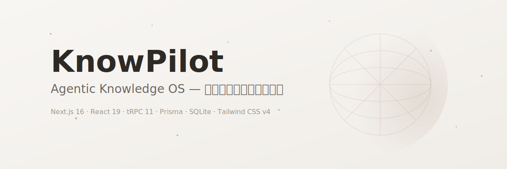

<div align="center">
  

  <p align="center">
    <strong>智能知识管理与博客平台</strong><br>
    以 Markdown 为原子、AI 为引擎的本地优先数字花园。
  </p>

  <p align="center">
    
    
    
    
    
    
    
  </p>

  <p align="center">
    <a href="#快速开始">快速开始</a> ·
    <a href="#核心能力">核心能力</a> ·
    <a href="#技术栈">技术栈</a> ·
    <a href="#项目结构">项目结构</a> ·
    <a href="#架构亮点">架构亮点</a> ·
    <a href="#路线图">路线图</a> ·
    <a href="docs/development/README.md">开发文档</a>
  </p>
</div>

---

## 项目简介

KnowPilot 是一个**单用户、本地优先**的智能知识管理与博客平台，定位为「以 Markdown 为原子、AI 为引擎的数字花园」。

它把博客、AI 对话和自主 Agent 收拢在同一张桌面：文章以本地 Markdown 文件为唯一事实源，SQLite 只作查询与缓存层；Agent 不仅能聊天，还能读文章、调技能、记记忆、跑工作流，并通过三层 Swarm 层级自主协作。所有数据落盘在你自己的机器上，Git 可跟踪、可离线编辑，没有云端锁定。

> 本文件面向新接触项目的开发者。背景与规范另见 [`AGENTS.md`](AGENTS.md)、[`MIGRATION_PLAN.md`](MIGRATION_PLAN.md)、[`docs/development/`](docs/development/)。

---

## 命名候选清单（中文名已定：见微）

> 项目中文名定为「**见微**」，取「见微知著」——从细微处洞察全局，恰是知识管理的本意。
> 以下 51 个英文名候选按意象分组，⭐ 为推荐项。选定后本节移除，并统一替换 `KnowPilot` / `@knowpilot/*`。

### A. 微尘系 —— 取「微」

| # | 名字 | 意象 | 备注 |
|---|---|---|---|
| 1 | ⭐ **Mote** | 微尘（a mote of dust） | 4 字母，语义直译，简洁好打 |
| 2 | Speck | 微粒、细点 | 口语化，略轻 |
| 3 | Iota | 希腊最小字母，「一丝一毫」 | 程序员友好；撞 Go 的 iota / IOTA 币 |
| 4 | ⭐ **Scintilla** | 拉丁语「火花」，一丝微光/证据 | 优雅偏长；撞 Scintilla 编辑器组件 |
| 5 | Quark | 夸克，最小粒子 | 撞 KDE 编辑器、出版软件 |
| 6 | Morsel | 一小口、一小片 | 温润，知识「碎片」感 |
| 7 | Crumb | 碎屑 | 双关面包屑导航 |
| 8 | Shard | 碎片，折射整体 | 冷峻；撞数据库分片术语 |
| 9 | Sliver | 细薄片 | 轻巧 |
| 10 | Granule | 颗粒 | 平淡 |
| 11 | Droplet | 一滴水，见沧海 | 撞 DigitalOcean Droplet |
| 12 | Ripple | 涟漪，小波动见大水面 | 撞 Ripple 币 |
| 13 | ⭐ **Spore** | 孢子，微小却藏着整个生命 | 有机、生长感，数字花园绝配 |
| 14 | Pollen | 花粉，传播知识的微粒 | 数字花园意象 |
| 15 | Kernel | 谷粒 / 内核 | 撞 OS kernel |
| 16 | Atom | 原子，不可再分 | 撞 Atom 编辑器 |
| 17 | Flicker | 微闪 | 撞 Flickr |
| 18 | Tinge | 一丝色泽 | 小众 |
| 19 | Whiff | 一缕气息 | 口语 |
| 20 | Vestige | 遗迹、残余线索 | 由残迹推全貌，略忧郁 |

### B. 看见系 —— 取「见」

| # | 名字 | 意象 | 备注 |
|---|---|---|---|
| 21 | ⭐ **Glimpse** | 一瞥 | 动作感强，偏「见」丢「微」 |
| 22 | Gleam | 微光、一闪的察觉 | 短、亮、正面 |
| 23 | Glint | 一瞬闪光 | 比 Gleam 更锐利 |
| 24 | Glance | 一掠 | 太常用 |
| 25 | Espy | 瞥见（文学词） | 古雅，难读 |
| 26 | Descry | 远远望见（文学词） | 古雅 |
| 27 | ⭐ **Loupe** | 珠宝匠放大镜 | 「见微的器具」，工具感最贴切 |
| 28 | ⭐ **Prism** | 棱镜，一束光分解出全部色彩 | 「由一见全」的科学隐喻，撞名较多 |
| 29 | Lens | 透镜 | 撞 Snap Lens 等 |
| 30 | Vista | 由近及远的全景 | 撞 Windows Vista |

### C. 知著系 —— 取「知著」

| # | 名字 | 意象 | 备注 |
|---|---|---|---|
| 31 | ⭐ **Augur** | 预兆、预言者 | 冷峻独特，你原本就喜欢 |
| 32 | ⭐ **Fathom** | 彻底参透 + 水深单位 | 一词两意，程序员圈辨识度高 |
| 33 | Divine | 凭直觉参悟（动词） | 双关「神圣」 |
| 34 | Omen | 征兆 | 略阴森 |
| 35 | Portent | 庄重的预兆 | 书面 |
| 36 | Presage | 预示 | 书面 |
| 37 | Harbinger | 先驱、前兆 | 略长 |
| 38 | Inkling | 隐约的察觉 | 灵动可爱 |
| 39 | Hunch | 直觉预感 | 口语 |
| 40 | Surmise | 从蛛丝马迹推测 | 动词感 |
| 41 | Oracle | 神谕 | 撞 Oracle 公司，硬伤 |
| 42 | Sibyl | 古希腊女预言者 | 独特但生僻 |
| 43 | Seer | 见者、先知 | 太短，难检索 |
| 44 | Sage | 智者 | 撞 Sage 数学软件 |
| 45 | Intuit | 直觉 | 撞 Intuit 公司，硬伤 |

### D. 合体造词 —— 零撞名，域名友好

| # | 名字 | 构成 | 意象 |
|---|---|---|---|
| 46 | ⭐ **Augmote** | Augur + Mote | 「见微知著」的压缩包：微尘中的预兆 |
| 47 | Motescope | Mote + -scope | 微尘之镜，观察微粒的仪器 |
| 48 | Glimmote | Glimpse + Mote | 一瞥微尘 |
| 49 | Fathomote | Fathom + Mote | 参透微尘 |
| 50 | Omote | Omen + Mote | 短促独特（注意日语「表」同形） |
| 51 | ⭐ **PrismWeave** | Prism + Weave | 棱镜析微光 + 经纬织知识：「由一见全」与「数字花园」双意象，你亲选 |

**我的前三**：Augmote（语义完整 + 零撞名）、Mote（极简直译）、Loupe（工具隐喻最贴知识管理）。
**你的首选**：PrismWeave。

### D2. PrismWeave 风格二词复合（追加 20）

> 公式：前半取「见微」（光/镜/微尘），后半取「知著」（织机/经纬/典籍）。⭐ 为本组推荐。

| # | 名字 | 构成 | 意象 / 备注 |
|---|---|---|---|
| 52 | ⭐ **MoteLoom** | Mote + Loom | 微尘 + 织机；loom 双关「隐约浮现」（loom on the horizon）——见微知著的压缩包，比 Augmote 更温润 |
| 53 | ⭐ **PrismLoom** | Prism + Loom | 棱镜 + 织机/预兆浮现；与你首选同源，「织」感更强 |
| 54 | ⭐ **IrisWeave** | Iris + Weave | 虹膜（看见）+ 鳶尾花（花园）+ 编织，一词三意，极贴本项目 |
| 55 | ⭐ **GlyphWeave** | Glyph + Weave | 字符/符文 + 编织，知识感最强的一组 |
| 56 | MoteWeave | Mote + Weave | 微尘编织，直译「见微」+ 织，最朴素的对仗 |
| 57 | LumenWeave | Lumen + Weave | 光通量单位 + 编织，流畅好读；撞 Laravel Lumen 框架 |
| 58 | WarpWeft | Warp + Weft | 经线 + 纬线，「经纬」直译，全头韵；丢了「微」但格局大 |
| 59 | LoupeLoom | Loupe + Loom | 珠宝镜 + 织机，全头韵，工具感 |
| 60 | GlimmerWeave | Glimmer + Weave | 微光编织，柔和 |
| 61 | SpectraWeave | Spectra + Weave | 光谱编织，学术感 |
| 62 | OpalWeave | Opal + Weave | 蛋白石变彩效应 + 编织，华美 |
| 63 | KaleidoWeave | Kaleido + Weave | 万花筒编织，绚丽但偏长 |
| 64 | LensWeave | Lens + Weave | 透镜编织，最短平快 |
| 65 | HaloWeave | Halo + Weave | 光晕编织；撞游戏 Halo |
| 66 | RefractLoom | Refract + Loom | 折射 + 织机，物理感 |
| 67 | SporeWeave | Spore + Weave | 孢子 + 编织，数字花园生长感 |
| 68 | CodexWeave | Codex + Weave | 古抄本 + 编织；撞 OpenAI Codex |
| 69 | FolioWeave | Folio + Weave | 对开本 + 编织，书卷气 |
| 70 | QuillWeave | Quill + Weave | 羽毛笔 + 编织；撞 Quill.js 编辑器 |
| 71 | AtlasWeave | Atlas + Weave | 地图集 + 编织，「织出全局地图」；撞 MongoDB Atlas |

**本组前三**：MoteLoom（loom 的「预兆浮现」双关是神来之笔）、IrisWeave（虹膜+鳶尾+编织三意叠加）、GlyphWeave（知识感最直给）。

---

## 核心能力

| 能力 | 说明 |
|------|------|
|  **Markdown 原生** | 文章以 `.md` 文件为单一事实来源，Git 可跟踪。支持 GFM、代码高亮、数学公式、HTML 嵌入、脚注。Milkdown 所见即所得编辑，粘贴/拖拽上传图片。 |
|  **AI 核心** | Agent、Skill、MCP Server、Memory、Prompt 全部内置。ReAct + SSE 流式 `/chat`，思考时间线、工具同步/异步标识；三段式 auto-compact（micro → memory flush → macro），`/compact` 与侧栏按钮经 Agent `session_compact` 统一执行。 |
|  **Swarm 三层 Agent** | 超级 / 管理 / 子 Agent 三层层级，权限硬拦截、Agent 间消息总线、心跳自主运行、`spawn_subagent` 异步派生与 `report_back`。 |
|  **莫兰迪星河设计** | 暖灰莫兰迪色系 + 玻璃拟态 + Three.js 星空 Hero + Bento 网格。100 个几何 SVG Agent 头像按 id 稳定分配，深浅主题切换。 |
|  **本地优先** | 内容先落盘到本地文件，再同步到 SQLite。19 实体 CRUD + 管理页，Markdown ↔ SQLite 双向写回，`db:sync` 支持 `--watch`。 |
|  **自动化流** | Trigger 事件触发 + Approval 审批拦截 + Agent Loop。异步任务队列 `async_task_run/status/wait`，后台运行结果自动回流对话。 |
|  **全局搜索** | FTS5 全文索引 `search.global`，跨文章 / Agent / Skill / Memory / Prompt 统一检索。 |
|  **可选鉴权与部署** | `AUTH_MODE=none/password` 本地或远程部署。Docker + CI + `db:backup` 一键备份。 |

---

## 快速开始

### 环境要求

- Node.js 20+
- pnpm（包管理器，monorepo `workspace:*` 协议）

### 安装与启动

```bash
# 1. 克隆仓库
git clone <repository-url>
cd KnowPilot

# 2. 安装依赖
pnpm install

# 3. 同步 Markdown 文章到 SQLite
pnpm db:sync

# 4. 启动开发服务（并行启动 server + web）
pnpm dev
```

- 前端：<http://localhost:3000>
- 后端：<http://localhost:3010>
- tRPC 端点：<http://localhost:3010/api/trpc>

### 环境变量

复制 `.env.example` 为 `.env`，按需配置：

```env
# 后端端口（默认 3010）
SERVER_PORT=3010

# SQLite 数据库路径
DATABASE_URL="file:./dev.db"

# 凭据加密主密钥（AES-256-GCM 加密 Credential 表）
# 生成：node -e "console.log(require('crypto').randomBytes(32).toString('hex'))"
CREDENTIAL_MASTER_KEY=

# LLM API Key（至少一个）
DEEPSEEK_API_KEY=
OPENAI_API_KEY=
ANTHROPIC_API_KEY=

# 可选鉴权：none（默认，本地）/ password（远程部署）
AUTH_MODE=none
```

> `CREDENTIAL_MASTER_KEY` 是凭据库的加密主密钥，不是 LLM API Key。开发模式不设则凭据明文落库（启动告警）；生产模式必须配置，否则拒绝启动。丢失后已加密凭据无法解密。

### 常用命令

```bash
pnpm dev            # 同步文章 + 并行启动 server / web
pnpm dev:web        # 单独启动前端
pnpm dev:server     # 单独启动后端

pnpm db:sync        # content/ → SQLite 同步（支持 --watch）
pnpm db:backup      # dev.db 备份到 backups/
pnpm db:migrate     # Prisma migrate dev
pnpm db:studio      # 打开 Prisma Studio

pnpm lint           # 全仓 lint（server/shared 用 tsc，web 用 eslint）
pnpm test           # Vitest 全 package
pnpm test:e2e       # Playwright E2E（web:3002 + server:3010）
pnpm build          # Next.js 生产构建
pnpm validate       # lint → test → build → e2e 一键验收
```

---

## 技术栈

| 层级 | 技术 |
|---|---|
| 语言 / 运行时 | TypeScript 5.8、Node.js（server 通过 `tsx` 运行） |
| 包管理 | pnpm monorepo（`workspace:*`） |
| 前端 | Next.js 16 + React 19（App Router） |
| 样式 | Tailwind CSS 4 + shadcn/ui + `@tailwindcss/typography` + Framer Motion + Three.js |
| 编辑器 | Milkdown 7（Markdown WYSIWYG） |
| 通信 | tRPC 11 + `@trpc/react-query` + superjson |
| 数据获取 | TanStack React Query 5 |
| 后端 | Express 5 + CORS |
| ORM / 数据库 | Prisma 6 + SQLite |
| 校验 / 共享类型 | Zod 3，集中定义在 `packages/shared` |
| 测试 | Vitest 3（server / shared）+ Playwright（web Chat E2E） |

---

## 项目结构

```text
KnowPilot/
├── apps/
│   ├── web/                 # Next.js 16 前端（App Router）
│   └── server/              # Express + tRPC + Prisma 后端
│       ├── prisma/schema.prisma   # 19 实体模型
│       └── src/
│           ├── router.ts          # 唯一 API 路由文件（20 业务路由）
│           ├── services.ts        # 唯一业务服务层
│           └── infra/             # agentTools / nativeTools / mcpClient /
│                                 # agentStream / sessionStreamHub / heartbeatEngine /
│                                 / swarmBus / swarmPermissionGuard / asyncJobManager ...
├── packages/
│   └── shared/              # 前后端共享 Zod schema + TS 类型 + 常量
├── content/                 # Git 跟踪的文本数据源
│   ├── posts/               # 文章 Markdown 源文件
│   ├── agents/ skills/ memories/ prompts/   # Agent / Skill / Memory / Prompt 配置
│   ├── tasks/               # Task 配置（JSON + db:sync）
│   ├── mcp/                 # MCP Server 配置（YAML）
│   └── uploads/             # 上传文件
├── docs/
│   ├── development/        # L1-L5 阶段开发文档与 API 规范
│   └── surveys-2026/       # 2026 记忆 / Harness / Agent 综述与 KnowPilot 对比分析
├── config.yaml              # 运行时业务参数（stream / compact 等）
└── README.md                # 本文件
```

> 项目遵循「单文件逻辑收拢」原则：后端业务层合并到 `services.ts`、路由层合并到 `router.ts`；前端 hooks 合并到 `lib/hooks.ts`、通用组件合并到 `components/shared.tsx`。禁止创建零散的 `services/`、`trpc/routers/`、`hooks/`、`components/shared/` 子目录。

---

## 架构亮点

### 本地优先：Markdown 是事实源，SQLite 是缓存

文章、Agent、Skill、Memory、Prompt 等内容首先以本地 Markdown/YAML 文件存在，受 Git 跟踪；`pnpm db:sync` 把它们 upsert 到 SQLite 作为查询与缓存层。`create` / `update` / `delete` 会同步写回 `content/` 文件。数据永远属于你。

### Swarm：三层 Agent 层级 + 心跳自主运行

| 层级 | tier | 权限 | 说明 |
|---|---|---|---|
| 超级 Agent | `super` | 全局 CRUD + 跨 Workspace | 首次启动自动创建，心跳自主运行 |
| 管理 Agent | `manager` | Workspace 内 CRUD 子 Agent | 每个 Workspace 一个，自动创建主 session |
| 子 Agent | `sub` | 执行任务 + report_back | 由管理 Agent 或用户创建 |

权限硬拦截（`swarmPermissionGuard`）、Agent 间消息总线（`swarmBus`）、node-cron 心跳引擎、向上发消息时机与 depth 防循环都在 `infra/` 内闭环。

### Chat 状态架构：三层 Store + 不变量

为根治聊天界面「闪烁 / 错位 / 需刷新」的整类 bug，前端采用三层 Store 设计并显式声明不变量：

- **MessageStore** — 持久化消息的唯一事实源（DB 驱动，经 SSE `message_upserted` 更新）
- **StreamLifecycle** — 显式状态机（`idle → streaming → done → idle`）管理流式 UI
- **Compose Store** — 瞬态 UI（输入队列、乐观气泡、异步任务覆盖层）

七条不变量（INV-1 ~ INV-7）覆盖流提交、渲染单一所有权、挂接进度一致性、消息持久化广播一致性、切会话即对账等。详见 [`docs/development/chat-state-architecture.md`](docs/development/chat-state-architecture.md)。

### Auto-Compact：摘要单源，防重复暴露

对标 Claude Code 的 `compact_boundary` + `getMessagesAfterCompactBoundary` 实践，压缩后摘要**只经一条路径**进入 LLM：

| 存储 / 通道 | 作用 |
|---|---|
| `ChatSession.contextSummary` | 摘要唯一权威源 |
| `maybeCompactMessages` | 每轮最多注入一份摘要 + 最近消息 |
| 边界消息 `__context_compact__` | UI 时间线与元数据，**不含**完整摘要正文 |
| `session_compact` 工具返回值 | 仅 `success` / 条数，**无** `summaryPreview` |
| Agent 确认回复 | 代码层强制「压缩已完成」，禁止复述摘要 |

手动压缩：`/compact`、侧栏「立即压缩」→ 普通用户消息 → Agent → `session_compact`。程序化调用可走 tRPC `session.compact`（`aiReadable`，不经 Agent 回合）。详见 [`docs/development/开发心路历程.md`](docs/development/开发心路历程.md) 与 [`docs/surveys-2026/对比分析-记忆-Harness-Agent.md`](docs/surveys-2026/对比分析-记忆-Harness-Agent.md)。

### 100 个几何 SVG Agent 头像

每个 Agent 按 cuid 稳定哈希到 100 个预设之一（20 套莫兰迪配色 × 5 种几何 motif），纯 SVG 渲染、零图片资源、任意尺寸清晰。见 [`apps/web/components/agentAvatar.tsx`](apps/web/components/agentAvatar.tsx)。

---

## 路线图

项目按 **L1 ~ L5** 五个阶段演进，详细设计见 [`docs/development/`](docs/development/)。

| 阶段 | 主题 | 状态 |
|---|---|---|
| **L1** | 博客基建：首页、文章、编辑器、Markdown ↔ SQLite 同步 |  已封板 |
| **L2** | AI 核心：Agent / Skill / MCP / Memory / Chat |  已完成 |
| **L3** | 内容运维：File / Git / Task / Log / Workspace |  已完成 |
| **L4** | 自动化流：Trigger / Approval / Agent Loop |  已完成 |
| **L5** | 打磨与规模化：搜索、鉴权、统计、部署 |  已完成 |

后续规划见 [`docs/development/future-features.md`](docs/development/future-features.md)。

---

## 部署

```bash
# Docker 一键起
docker compose up --build

# 生产构建前先同步
pnpm db:sync && pnpm build

# 备份
pnpm db:backup    # dev.db → backups/
```

> 远程部署请设 `AUTH_MODE=password` 并增加反向代理与限流。SQLite 文件不进 Git，但 `content/posts/` 下的 Markdown 源文件受 Git 跟踪，是数据的持久化真相源。

---

## 安全与敏感信息

- `.env` 被 `.gitignore` 忽略，不得提交。`.env.example` 仅含占位值。
- `CREDENTIAL_MASTER_KEY` 用于 AES-256-GCM 加密 Credential 表，丢失后已加密凭据无法解密。
- 默认 `AUTH_MODE=none` 无鉴权，仅适合本地。暴露公网必须启用鉴权。
- `apps/server/prisma/dev.db` 不进 Git；数据持久化依赖 `content/` 下的 Markdown 源文件。

---

## 许可证

[MIT](LICENSE)
