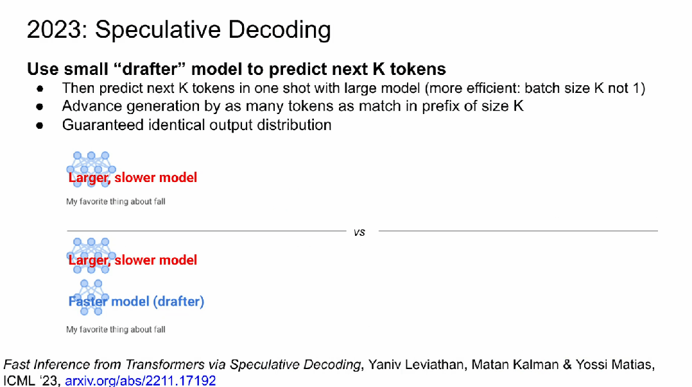

# Jeff Dean演讲回顾LLM发展史,Transformer、蒸馏、MoE、思维链等技术都来自谷歌

**作者: 机器之心**

**原文: **[**https://zhuanlan.zhihu.com/p/1896577727781385217**](https://zhuanlan.zhihu.com/p/1896577727781385217)

机器之心报道,**编辑：Panda. **

4 月 14 日,谷歌首席科学家 Jeff Dean 在苏黎世联邦理工学院举办的信息学研讨会上发表了一场演讲,主题为「**AI 的重要趋势：我们是如何走到今天的,我们现在能做什么,以及我们如何塑造 AI 的未来？**」

在这场演讲中,Jeff Dean 首先以谷歌多年来的重要研究成果为脉络,展现了 AI 近十五年来的发展轨迹,之后又分享了 Gemini 系列模型的发展历史,最后展望了 AI 将给我们这个世界带来的积极改变. 

机器之心将在本文中对 Jeff Dean 的演讲内容进行总结性梳理,其中尤其会关注演讲的第一部分,即谷歌过去这些年对 AI 领域做出的奠基性研究贡献. 我们将看到,Transformer、蒸馏、MoE 等许多在现代大型语言模型(LLM)和多模态大模型中至关重要的技术都来自谷歌. 正如 网友 @bruce_x_offi 说的那样,你将在这里看到 AI 的进化史. 

下面我们就来具体看看 Jeff Dean 的分享. 

- 源地址：[https://video.ethz.ch/speakers/d-infk/2025/spring/251-0100-00L.html](https://link.zhihu.com/?target=https%3A//video.ethz.ch/speakers/d-infk/2025/spring/251-0100-00L.html)- 幻灯片：[https://drive.google.com/file/d/12RAfy-nYi1ypNMIqbYHjkPXF_jILJYJP/view](https://link.zhihu.com/?target=https%3A//drive.google.com/file/d/12RAfy-nYi1ypNMIqbYHjkPXF_jILJYJP/view)

首先,Jeff Dean 分享了他得到的一些观察：

- 近年来,机器学习彻底改变了我们对计算机可能性的期望; - 增加规模(计算、数据、模型大小)可带来更好的结果; - 算法和模型架构的改进也带来了巨大的提升; - 我们想要运行的计算类型以及运行这些计算的硬件正在发生巨大的变化. 

**机器学习十五年**

首先,**神经网络**！

神经网络的概念是在上个世纪提出的,而现在 AI 的各种能力基本上都是某种基于神经网络的计算. 我们可以粗略地将神经网络视为真实神经元行为的非常不完美的复制品. 它还有很多我们不理解的地方,但它们是 AI 的基本构建模块之一. 

**反向传播**是另一个关键构建模块,这是一种优化神经网络权重的方法. 通过反向传播误差,可让模型的输出逐渐变成你想要的输出. 这种方法能有效地用于更新神经网络的权重,以最小化模型在训练数据上的误差. 并且由于神经网络的泛化特性,得到的模型也具有泛化能力. 

神经网络和反向传播是深度学习革命的两大关键. 

2012 年时,Jeff Dean 与其他一些研究者开始研究：如果训练真正的大型神经网络,它们会比小型神经网络表现更好. 在这一假设基础上,他们决定训练一个非常大的神经网络,并且他们使用了无监督学习算法. 

这个大型神经网络比 2012 年已知的最大神经网络还大 60 倍,使用了 16,000 个 CPU 核心. 

Jeff Dean 说：「当时,我们的数据中心还没有 GPU. 我们有很多普通的旧 CPU 计算机. 我们看到的是,这个无监督的训练目标再加上一些监督训练,将 AI 在 ImageNet 22K 上的最佳性能提高了 70% 左右. 」

这是一个相当大的进步,也证明了我们的假设,即**如果投入足够的训练计算,更大模型的能力会更强**. 

作为这项工作的一部分,谷歌开发了他们第一个神经网络大规模基础设施系统,称为 **DistBelief**. 这是一个分布式计算系统,分散在许多机器上,而且我们许多同事并不认为它能其作用. 但实际上,当模型很大时,本就不适合仅使用单台计算机. 

在分摊计算时,有几种不同的方法. 第一种是垂直或水平地切分神经网络中的神经元. 这样一来,每台计算机上都只有神经网络的一部分,然后你需要想办法让这些不同部分之间互相通信. 这叫做**模型并行化**. 

另一种方法是**数据并行化**,即在许多不同的机器上都有底层模型的副本,然后将训练数据划分给不同的模型副本. 

模型并行化与数据并行化可以同时使用. 

在 DistBelief 中,实际上还有一个中心系统,可以接收来自模型不同副本的梯度更新,并将它们应用于参数. 但 Jeff Dean 表示他们的做法实际上在数学上并不正确,因为这个过程是完全异步的. 不同的模型副本将获得参数的新副本,在一些数据上进行计算,再将基于这些参数和该批次训练数据的梯度发送回参数服务器. 但这时候,参数已经有变化了,因为其他模型副本在此期间应用了它们的梯度. 因此,根据梯度下降算法,这在数学上可以看出是不正确的,但它是有效的. 所以这就是个好方法. 

这就是使我们能够真正将模型扩展到非常大的原因 —— 即使只使用 CPU. 

在 2013 年,谷歌使用该框架扩展了一个扩大了词的密集表示的训练,这还用到了一个词嵌入模型 [Word2Vec](https://zhida.zhihu.com/search?content_id=256574486&content_type=Article&match_order=1&q=Word2Vec&zhida_source=entity). 

基于此,谷歌发现,通过使用高维向量表示词,如果再用特定的方式训练,就能得到两个很好的属性：

一、在训练大量数据后,这个高维空间中的近邻词往往是相关的,比如所有与猫、美洲狮和老虎相关的词都汇集到了一个高维空间的同一部分. 

二、方向在这种高维空间中是有意义的. 举个例子,为了将一个男性版本的词转化为女性版本,比如 king → queen、man→woman,都要朝着大致相同的方向前进. 

2014 年,我的三位同事 Ilya Sutskever、Oriol Vinyals、Quoc V. Le 开发了一个神经网络,名为**序列到序列学习模型**. 这里的想法是,对于一个输入序列,或许可以根据它预测出一个输出序列. 

一个非常经典的例子是翻译. 比如如果源句子是英语,可以一个词一个词地处理输入的英语句子来构建表示,得到一个密集表示,然后你可以将这个表示解码成法语句子. 如果有大量的英语 - 法语对,就可以学习得到一个语言翻译系统. 整个过程都是使用这种序列到序列的神经网络. 

Jeff Dean 表示自己在 2013 年左右开始担心：由于模型越来越大,语音识别等方面也开始出现一些好用的应用,用户量可能有很多,那么该如何提供所需计算呢？

因此,谷歌开始尝试改进硬件,并决定为神经网络推理构建更定制的硬件. 这就是**张量处理单元(TPU)** 的起源. 

第一个版本的 TPU 只专门用于推理,所以它使用了非常低的精度 —— 它的乘法器只支持 8 位整数运算. 但他们真正的目标是构建一种非常擅长低精度线性代数的硬件,它将能服务于许多不同类型的基于神经网络的模型. 这个硬件也不需要现代 CPU 中那些花哨复杂的功能,例如分支预测器或各种缓存. 相反,他们的做法是尽力以更低的精度构建最快和最小的密集线性代数硬件. 

不出所料,最终生产出的 TPU 在这些任务上比当时的 CPU 和 GPU 快 15 到 30 倍,能源效率高 30 到 80 倍. 顺便说一下,**这是 ISCA 50 年历史上被引用最多的论文**. 这很了不起,因为它 2017 年才发表. 

之后,谷歌开始研发专用于训练神经网络的专用型超级计算机 —— 大量芯片用高速网络连接起来. 现在谷歌 **TPU pod** 在推理和训练方面都适用,并且连接的 TPU 也越来越多. 最早是 256 台,然后是 1000,之后是 4000,最近已经来到了八九千. 而且谷歌使用了定制的高速网络来连接它们. 

上周,[谷歌宣布了新一代的 TPU](https://link.zhihu.com/?target=https%3A//mp.weixin.qq.com/s%3F__biz%3DMzA3MzI4MjgzMw%3D%3D%26mid%3D2650964063%26idx%3D2%26sn%3Dfae1953e7bd488ebb976b91c51ba334b%26scene%3D21%23wechat_redirect),名为 **Ironwood**. Jeff Dean 表示谷歌不会继续再用数字来命名 TPU. Ironwood 的 pod 非常大：它有 9216 块芯片,每块芯片可以执行 4614 TFLOPS 的运算. 

TPU 的能源效率也在快速提升. 

另一个非常重要的趋势是开源. 这能吸引更广泛的社区参与并改进这些工具. Jeff Dean 认为,[**TensorFlow**](https://zhida.zhihu.com/search?content_id=256574486&content_type=Article&match_order=1&q=TensorFlow&zhida_source=entity) 和 **Jax**(都是谷歌开发的)另外再加上 PyTorch,对推动 AI 领域的发展做出了巨大的贡献. 

然后到 2017 年,**Transformer** 诞生了. 当时,他们观察到：循环模型有一个非常顺序化的过程,即一次吸收一个 token,然后在输出下一个 token 之前更新模型的内部状态. 这种固有的顺序步骤会限制从大量数据学习的并行性和效率. 因此,他们的做法是保存所有内部状态,然后使用一种名为注意力的机制去回顾经历过的所有状态,然后看它们哪些部分与当前执行的任务(通常是预测下一 token)最相关. 

这是一篇非常有影响力的论文. 部分原因是,他们最初在机器翻译任务上证明,用少 10 到 100 倍的计算量和小 10 倍的模型,就可以获得比当时最先进的 LSTM 或其他模型架构更好的性能. 注意,下图使用了对数刻度. 所以尽管箭头看起来很小,但其中差异实际非常大. 

这篇论文很重要,几乎所有现代大型语言模型都使用 Transformer 或其某种变体作为底层模型架构. 

2018 年时,一个新思潮开始流行(当然这个想法之前就有了). 也就是人们意识到**大规模语言建模可以使用自监督数据完成**. 比如对于一段文本,你可以用其中一部分来预测文本的其他部分. 这样做能够得到一些问题的答案. 实际情况也证明了这一点. 并且人们也发现,**使用更多数据可以让模型变得更好**. 

这类模型有多种训练目标. 一是自回归,即查看前面的词来预测下一个词. 今天大多数模型都采用了这种形式. 另一种则是填空. 上图中展示了一些例子. 

这两种训练目标都非常有用. 自回归式如今被用得更多,比如你在与聊天机器人对话时,模型就在根据之前的对话进行自回归预测. 

2021 年,谷歌开发了一种方法,**可将图像任务映射到基于 Transformer 的模型**. 在此之前,大多数人都在使用某种形式的卷积神经网络. 本质上讲,图像可被分解成像素块; 就像 Word2Vec 将词嵌入到密集表示中一样,也可以对像素块做类似的事情 —— 用一些高维向量来表示这些块. 然后,就可以将它们输入到 Transformer 模型,使其能够处理图像数据. 现在我们知道,图像和文本还可以组合成多模态数据. 因此,这项研究在统一文本 Transformer 和图像 Transformer 方面产生了巨大的影响. 

另外,在 2017 年,Jeff Dean 还参与开发了一种创造**稀疏模型**的方法. 本质上讲,就是对于一个很大的模型,仅激活其中一小部分,而不是针对每个 token 或样本都激活整个模型. 

在最初的论文中,实际上有相当多的专家 —— 每层有 2048 名专家. 而每次会激活其中 2 个. 这很不错,因为模型现在有了非常大的记忆能力,可以记住很多东西. 并且选择具体激活哪些专家也可以通过反向传播以端到端的方式学习. 这样一来,你可以得到擅长不同任务的专家,比如有的擅长处理时间和日期,有的擅长地理位置,有的擅长生物学. 

然后,Jeff Dean 列出了更多谷歌在稀疏模型方面的研究成果,感兴趣的读者可以参照阅读. 

2018 年,谷歌开始思考,对于这些大型分布式机器学习计算,可以有哪些更好的软件抽象. 谷歌构建了一套可扩展的软件 [**Pathways**](https://zhida.zhihu.com/search?content_id=256574486&content_type=Article&match_order=1&q=Pathways&zhida_source=entity) 来简化大规模计算的部署和运行. 

如上图所示,每一个黄点构成的框都可被视为一个 TPU Pod. 当这些 TPU Pod 在同一栋建筑内时,使用该建筑物内的数据中心网络来保证它们互相通信. 而当它们位于不同的建筑内时,可以使用建筑物之间的网络以及相同的数据中心设施. 甚至可以将不同区域的 TPU Pod 连接在一起. 

事实上,Pathways 给机器学习开发和研究人员的抽象之一是你只需要一个 Python 过程. Jax 本就有「设备(device)」的概念. 比如如果你只是在一台机器上运行,里面有 4 块 TPU 芯片,当使用 Jax 和 Pathways 训练时,整个训练过程中所有芯片都将作为 Jax 的设备进行处理. 依照这个机制,你可以用单一的 Python 进程管理成千上万个 TPU 设备. Pathways 负责将计算映射到实际的物理设备上. 而自上周开始,Pathways 已开始向谷歌云的客户提供. 

2022 年,谷歌一个团队发现,在推理时思考更长时间是非常有用的. 基于此观察,他们提出了**[思维链](https://zhida.zhihu.com/search?content_id=256574486&content_type=Article&match_order=1&q=%E6%80%9D%E7%BB%B4%E9%93%BE&zhida_source=entity)(CoT)** . 

图中举了个例子：如果给模型展示一些示例,示例中如果包含得到正确结论的思考过程,那么 LLM 更有可能得到正确答案. 

这个方法看起来很简单,而实际上却能极大提升模型的准确度,因为通过鼓励它们生成思考步骤,可以让它们以更细粒度的方式解决问题. 

可以看到,在 GSM8K(八年级一般数学水平问题)上,随着模型规模增大,如果只使用标准提示方法,解决准确度会有一些提高,但如果使用思维链提示法,解决准确度则会大幅上升. 

这正是在推理时使用更多计算的一种方式,因为模型必须在生成更多 token 之后才给出最终答案. 

下面来看蒸馏 —— 也是谷歌发明的. 2014 年,Geoffrey Hinton、Oriol Vinyals 和 Jeff Dean 最早开发出了这种名为**蒸馏(Distillation)** 的技术,可用来蒸馏神经网络中的知识. 这种方法能够将更好的大模型中的知识放入到一个更小的模型中. 

在训练小模型时,比如想要其预测下一 token,典型方法是让其先根据前面的句子进行预测,如果对了,很不错,如果错了,就反向传播误差. 

这种方法还不错,但蒸馏却能做到更好. 

教师模型不仅会给小模型正确的答案,而且还会给出它认为这个问题的好答案的分布. 也就是说,教师模型能提供更丰富的训练信号. 这种非常丰富的梯度信号可以用来为较小模型的每个训练样本注入更多知识,并使模型更快地收敛. 

如上图中表格所示. 这是一个基于语音识别的设置,其中给出了训练帧准确度和测试帧准确度. 

可以看到,当使用 100% 的训练集时,测试帧准确度为 58.9%. 而如果只使用 3% 的训练集,可以看到其训练帧准确度还提高了,但测试帧准确度下降很明显,这说明出现了过拟合现象. 但是,如果使用蒸馏方法,3% 的训练集也能让模型有很好的测试帧准确度 —— 几乎和使用 100% 训练集时一样准确. 这说明可以通过蒸馏将大型神经网络的知识转移到小型神经网络中,并使其几乎与大型神经网络一样准确. 

有意思的是,**这篇论文被 NeurIPS 2014 拒了**. 于是他们只得在研讨会上发表了这篇论文. 而现在,**这篇论文的引用量已经超过了 2.4 万**. 

另外在 2022 年,谷歌一个团队研究了一种不同的将计算映射到 TPU Pod 以执行有效推理的方法. 其中：有很多变体需要考虑,比如权重固定、X 权重聚集、XY 权重聚集、XYZ 权重聚集……

谷歌得到的一个见解是：正确的选择取决于许多不同的因素. 正如图中所示,其中的圆点虚线是最佳表现. 可以看到,随着批量大小的变化,最佳方案也会随之变化. 因此在执行推理时,可以根据实际需求选择不同的并行化方案. 

时间来到 2023 年,谷歌开发了一种名为**推测式解码(Speculative Decoding)** 的技术,可让模型推理速度更快. 这里的想法是使用一个比大模型小 10 到 20 倍的 drafter 模型,因为其实很多东西靠小模型就能预测,而小模型速度又快得多. 因此,就可以将两者结合起来提升效率：先让小模型预测 k 个 token,然后再让大模型一次性预测 k 个 token. 相比于让大模型一次预测一个 token,这种做法的效率明显更高. 

Jeff Dean 表示：「所有这些结合在一起,真正提高了人们今天看到的模型的质量. 」

从底层的 TPU 发展到高层的各种软件和技术进步,最终造就了现今强大的 Gemini 系列模型. 

这里我们就不继续整理 Jeff Dean 对 Gemini 系列模型发展历程的介绍了. 最后,他还分享了 AI 将给我们这个社会带来的一些积极影响. 

他说：「我认为随着更多投资和更多人进入这个领域,进一步的研究和创新还将继续. 你会看到模型的能力越来越强大. 它们将在许多领域产生巨大影响,并有可能让更多人更容易获得许多深度的专业知识. 我认为这是最令人兴奋的事情之一,但也会让一些人感到不安. 我认为我们有 AI 辅助的未来一片光明. 」

