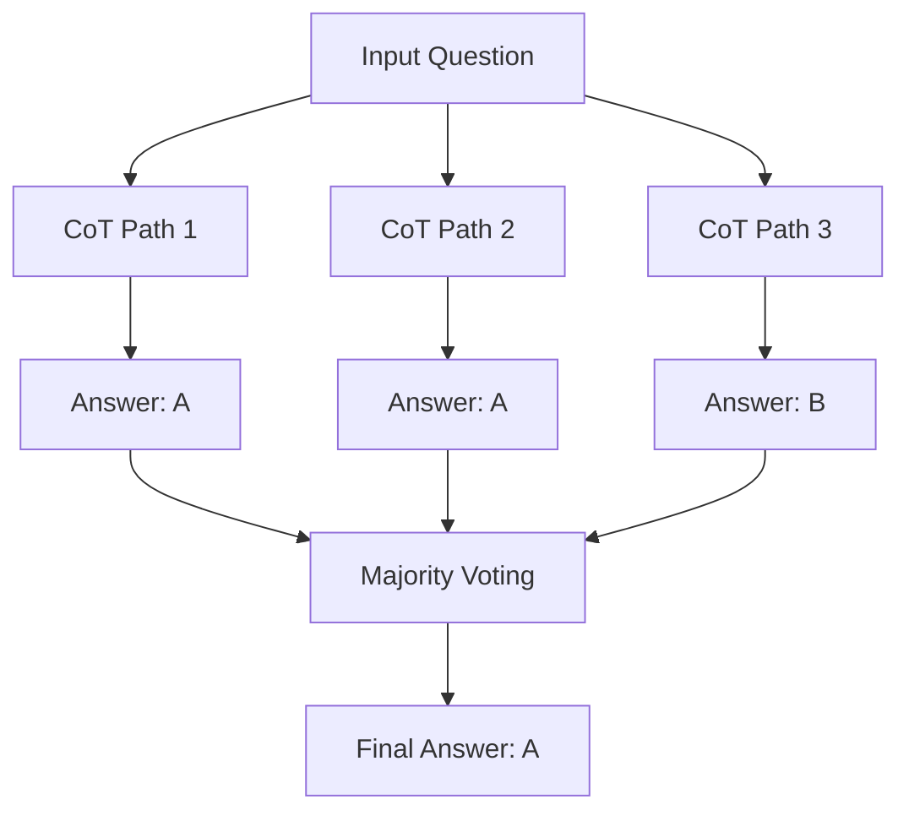
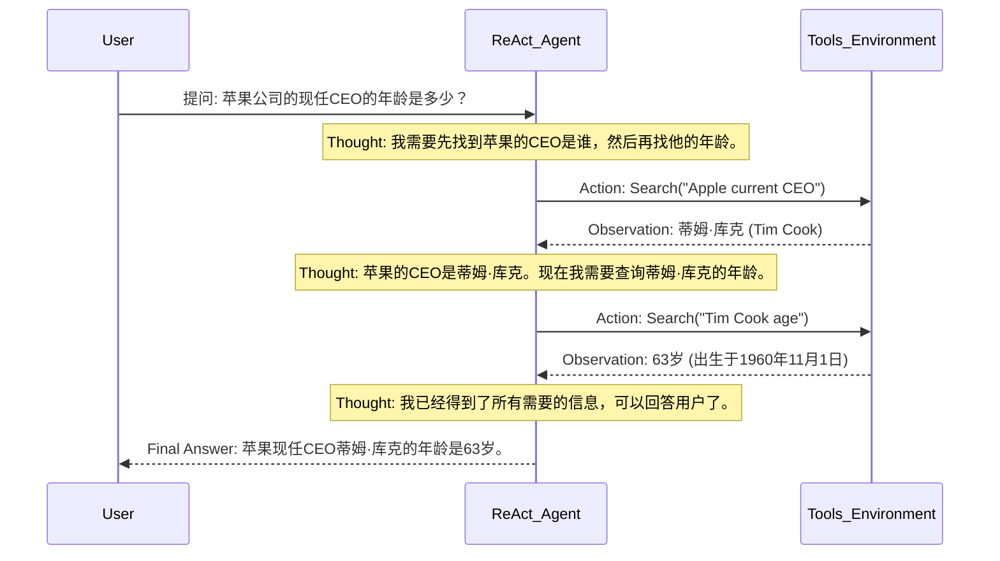
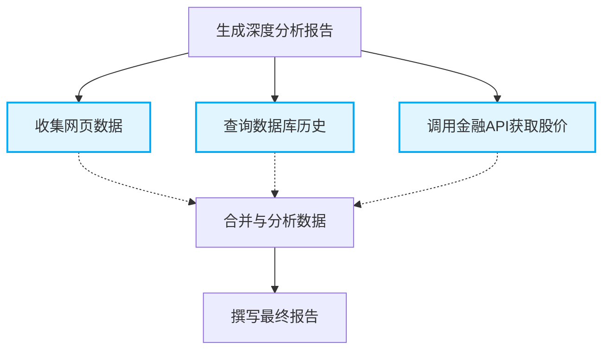
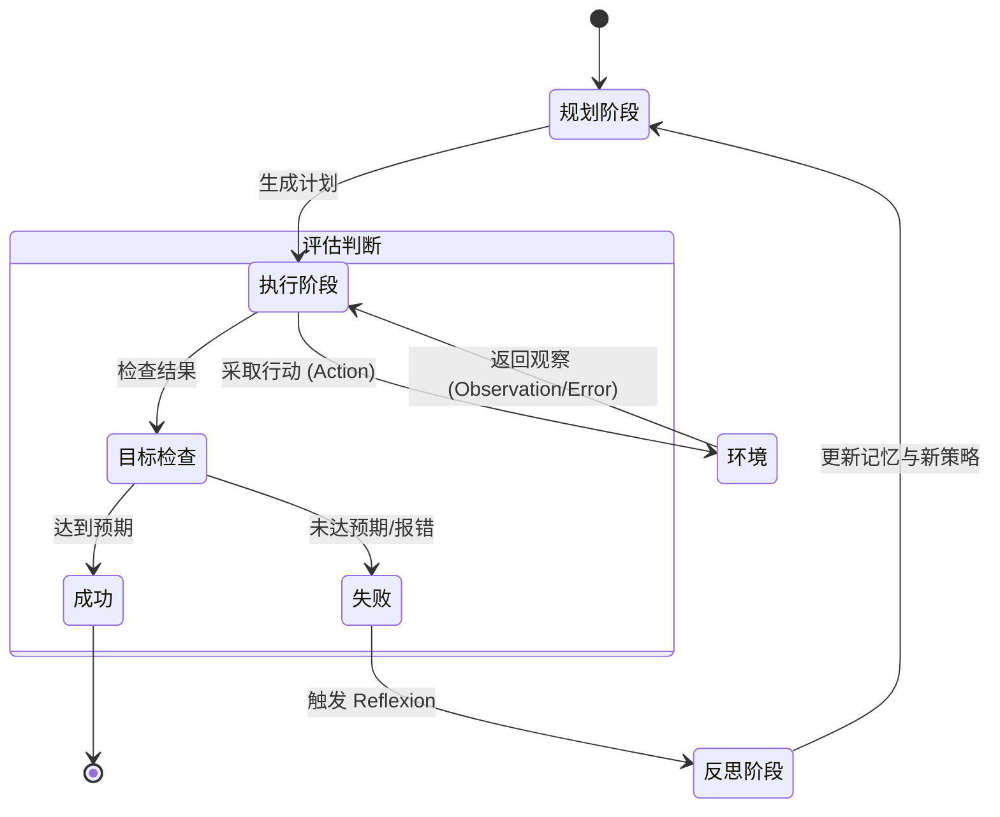

# 13.2.2 推理与规划 (Reasoning and Planning)

在以大型语言模型 (LLM) 为核心的智能体 (Agent) 架构中，**推理与规划 (Reasoning and Planning)** 是区分普通对话模型与真正具备自主解决问题能力的 Agent 的核心差异。如果说记忆系统是 Agent 的大脑存储库，工具调用是 Agent 的四肢，那么推理与规划就是 Agent 的前额叶皮层，负责制定战略、拆解任务、评估结果并进行纠错。

本文将深入探讨目前业界主流的 Agent 推理与规划架构，包括从基础的链式思考 (Chain of Thought, CoT) 到复杂的思维树 (Tree of Thoughts, ToT)，并详述规划器 (Planners)、执行器 (Executors) 以及反馈循环 (Feedback Loops) 在 Agent 认知架构中的协同作用。

<!-- image_prompt: 一张具有科技感的3D插画，展示一个发光的发条大脑，周围环绕着流程图、齿轮、工具图标(如放大镜、扳手)和分支的决策树。色彩以深蓝和霓虹青为主。 -->

---

## 1. 链式思考 (Chain of Thought, CoT)

### 1.1 CoT 的核心概念与原理

链式思考 (Chain of Thought) 是由 Wei 等人在 2022 年提出的一种 prompt 技术，旨在通过让模型在给出最终答案之前，先生成一系列中间推理步骤，从而显著提高 LLM 在复杂逻辑、数学计算和常识推理任务上的表现。

在传统的 Prompting 中，模型接收输入 $x$ 并直接预测输出 $y$：
$$ P(y | x) $$

而在 CoT 中，模型被引导先生成一个推理路径 $z$(即一系列推理步骤 $z_1, z_2, ..., z_n$)，然后再生成输出 $y$：
$$ P(y, z | x) = P(z | x) \cdot P(y | x, z) $$

这种方法的有效性在于它将复杂任务分解为了多个更容易处理的子步骤，并在自回归生成的过程中，让模型每一步都有机会把之前生成的推理作为额外的上下文。

### 1.2 Zero-Shot CoT vs Few-Shot CoT

**Few-Shot CoT**
通过在 Prompt 中提供几个包含完整推理过程的示例，让模型在上下文学习 (In-Context Learning) 中模仿这种推理模式。

```python
# Few-Shot CoT Prompt 示例
prompt = """
Q: 树上有5只鸟，打死1只，还剩几只？
A: 打死1只鸟会发出巨大的枪声。剩下的鸟会被枪声惊飞。因此，树上还剩0只鸟。

Q: 盒子里有10个苹果，我吃掉2个，又放入3个，现在有几个？
A: 首先，盒子里有10个苹果。吃掉2个后，还剩 10 - 2 = 8 个。接着，又放入3个，现在有 8 + 3 = 11 个。因此，现在有11个苹果。

Q: 约翰有50美元，他买了一辆20美元的玩具车和两个各10美元的冰淇淋，他还剩多少钱？
A: 
"""
```

**Zero-Shot CoT**
由 Kojima 等人发现，只需在 Prompt 结尾加上一句神奇的咒语：**"Let's think step by step"**，模型就能自动激活其内部的推理能力，进行链式思考。

### 1.3 进阶演进：Self-Consistency (自洽性)

单一的 CoT 推理路径可能会因为某一步的幻觉或计算错误而导致满盘皆输。Self-Consistency(Wang et al.)提出，让模型对同一个问题生成多个不同的推理路径，然后对最终答案进行多数表决 (Majority Vote)。

$$ \hat{y} = \arg\max_{y} \sum_{i=1}^{N} \mathbb{I}(y_i = y) $$



这种方法利用了 LLM 的随机采样特性 (temperature > 0)，极大地提高了推理的鲁棒性。

---

## 2. 思维树 (Tree of Thoughts, ToT)

### 2.1 突破线性思维的瓶颈

虽然 CoT 提供了一种序列化的推理方式，但对于需要探索、回溯或长远规划的问题(如 24点游戏、填字游戏、创意写作)，单向的线性推理往往不够。

思维树 (ToT, Yao et al., 2023) 将问题解决过程建模为在一棵包含多种可能推理步骤的树上的搜索。ToT 允许模型在做出关键决策时探索不同的分支，并且可以评估当前路径的前景。

<!-- image_prompt: 抽象的拓扑图，展示从根节点开始发散出多个分支的决策树，其中有些分支因为遇到红色警示符号而停止，有些分支发出绿色光芒并继续向下延伸，最终汇聚于一个发光的终点。 -->

### 2.2 ToT 的核心组件

ToT 由四个核心部分组成：
1. **Thought Decomposition (思维分解)**：将复杂问题分解为中间步骤(思维节点)。
2. **Thought Generator (思维生成器)**：给定当前状态，生成多个后续的候选思维。有两种策略：
   - 采样 (Sample)：当思维空间较大时，进行多次独立采样。
   - 提议 (Propose)：当思维空间受限时，使用特定的 Prompt 一次性生成所有候选。
3. **State Evaluator (状态评估器)**：评估当前状态到达目标的潜力。可以使用启发式 Prompt 让 LLM 打分(如 1-10 分)，或者进行分类(Sure/Likely/Impossible)。
4. **Search Algorithm (搜索算法)**：决定如何探索思维树。常用的有：
   - **广度优先搜索 (BFS)**：保持一层中最有希望的 $K$ 个状态，向下展开。
   - **深度优先搜索 (DFS)**：一直深入探索某一条路径，当发现该路径不可行 (Impossible) 时进行回溯。

### 2.3 数学建模与代码实现逻辑

假设当前状态为 $s$，生成器为 $G(s)$ 产生多个候选 $z_1, z_2, ...$，评估器为 $V(s, z_i)$。
以 BFS 为例的伪代码如下：

```python
def ToT_BFS(initial_state, steps, K):
    S = [initial_state]
    for step in range(steps):
        S_prime = []
        for s in S:
            # 1. 生成候选思维
            candidates = G(s) 
            # 2. 评估每个候选
            for z in candidates:
                score = V(s, z)
                S_prime.append((s + [z], score))
        # 3. 筛选最优的 K 个状态进入下一层
        S_prime.sort(key=lambda x: x[1], reverse=True)
        S = [item[0] for item in S_prime[:K]]
    return S[0] # 返回最优解
```

### 2.4 图思维 (Graph of Thoughts, GoT) 与算法思维 (Algorithm of Thoughts, AoT)

ToT 的进一步演进包括：
- **GoT (Graph of Thoughts)**：允许思维节点进行合并 (Aggregation) 和精炼 (Refinement)，形成图结构而不是纯粹的树结构。这在需要综合多方面信息(如合并两个部分代码)的任务中非常有效。
- **AoT (Algorithm of Thoughts)**：试图将 DFS/BFS 搜索的逻辑融合到一个 Prompt 中，让 LLM 内部进行自回归的"模拟搜索"，以减少调用 LLM 的 API 成本。

---

## 3. Agent 规划器 (Planners)

在解决复杂任务时，Agent 需要一个核心引擎来制定计划。规划器 (Planner) 的主要职责是将一个宏大的目标 (Goal) 拆解为可执行的子任务 (Sub-tasks)，并编排它们的执行顺序。

### 3.1 任务分解 (Task Decomposition)

任务分解可以通过以下几种方式实现：
1. **LLM 零样本提示**：例如，Prompt："你需要达成目标 X，请列出按顺序执行的 3-5 个步骤。"
2. **特定领域指导**：给定标准操作流程 (SOP)，让模型根据 SOP 实例化当前任务的步骤。
3. **基于当前环境状态**：每执行完一步，根据环境返回的结果动态决定下一步。

### 3.2 ReAct: 协同推理与行动

ReAct (Reason + Act, Yao et al., 2022) 是目前最经典的 Agent 规划与执行框架。它将内部推理和外部行动交织在一起。

典型的 ReAct 循环包含三个部分：
- **Thought (思考)**：Agent 观察当前环境状态，思考接下来应该做什么，或者分析上一步行动的结果。
- **Action (行动)**：Agent 决定调用某个工具或执行某个 API。
- **Observation (观察)**：环境返回行动的执行结果。



### 3.3 Plan-and-Solve 架构

虽然 ReAct 在执行过程中动态思考，但在复杂长序列任务中容易"迷失方向"。Plan-and-Solve (Wang et al., 2023) 提出了一种两阶段策略：

1. **规划阶段 (Plan)**：Agent 预先生成一个完整的计划。
2. **执行阶段 (Solve/Execute)**：按顺序执行计划中的任务，如有必要则根据环境反馈进行局部修正。

```python
# 伪代码：Plan-and-Execute 架构
plan = LLM.generate_plan(user_goal)
context = []

for sub_task in plan:
    result = execute(sub_task, context)
    context.append((sub_task, result))
    
    if is_failure(result):
        # 触发重新规划 (Re-planning)
        plan = LLM.replan(user_goal, current_plan_remaining, context)
```

这种架构更接近人类的"制定计划 -> 按部就班执行 -> 遇到困难调整计划"的逻辑。

### 3.4 任务路由与中枢调度：HuggingGPT 模式

随着工具数量的爆炸式增长(如 Hugging Face 上成千上万的模型)，传统的 ReAct 难以在一个 Prompt 中塞下所有工具的描述。HuggingGPT 提出了一种以 LLM 为大脑，将特定任务分配给专用 AI 模型(如物体检测、语音合成模型)的规划范式。

它的规划器(Task Planner)需要输出一个高度结构化的 JSON 任务流，包含：
- **Task ID**: 唯一标识符。
- **Dep**: 依赖关系(该任务是否必须等前置任务完成)。
- **Args**: 参数来源(是来自用户输入，还是来自某个 Task ID 的输出)。

```json
[
  {"task_id": 1, "task": "image-to-text", "dep": [-1], "args": {"image": "example.jpg"}},
  {"task_id": 2, "task": "text-to-speech", "dep": [1], "args": {"text": "<resource-1>"}}
]
```
这种有向无环图(DAG)式的规划能力，使得 Agent 可以像操作系统的任务调度器一样，并发现排甚至编排极其复杂的多模态工作流。

---

## 4. Agent 执行器 (Executors)

执行器 (Executor) 负责将 Planner 制定的抽象计划或者 Action 转化为现实操作。

### 4.1 工具调用与参数解析

执行器的核心能力是 **Tool Calling (工具调用)**。早期的执行器依赖于正则表达式从文本中解析 Action 和参数：

```text
Action: python_repl
Action Input: print("Hello World")
```

如今，各大模型(如 OpenAI 的 Function Calling，DeepSeek 的 Tool Use)在底层已经原生支持结构化的 JSON 输出，使得执行器不再容易出现格式解析错误。执行器会将 LLM 返回的 JSON 映射到本地的函数引用，并安全地传递参数。

### 4.2 并行执行机制 (Parallel Execution)

在某些任务中，子任务之间没有严格的依赖关系。优秀的执行器会通过依赖图 (Dependency Graph) 识别出可以并行处理的任务。



通过并行执行 T1、T2、T3，Agent 可以在极短的时间内汇总巨量信息。这就要求 Executor 具备异步事件驱动架构。

---

## 5. 反馈循环 (Feedback Loops)

没有反馈的系统是盲目的。在复杂的实际环境中，Agent 的工具调用可能会失败(如 API 超时、代码运行报错)，环境状态可能会发生意外改变。反馈循环是让 Agent 从错误中恢复、甚至自我进化的关键机制。

<!-- image_prompt: 循环箭头的3D设计，代表着迭代反馈。箭头中间有小型的机器人或AI全息影像在调整错误代码，呈现出自我修复的意象。 -->

### 5.1 环境反馈 (Environmental Feedback)

环境反馈是直接来自于外部世界的客观结果。
- **运行时错误 (Runtime Errors)**：当 Agent 写了一段 Python 代码执行失败，抛出 `IndexError` 或 `SyntaxError` 时。
- **终端输出 (Terminal Output)**：执行 CLI 命令后的 `stdout/stderr`。
- **视觉反馈**：对于 GUI Agent，执行一次点击后屏幕的截图变化。

Agent 的 Planner 必须能够接收这些环境反馈，并触发特定的 **纠错链路 (Error Recovery)**。

### 5.2 反思 (Reflection) 与 Self-Refine

反思是 Agent 的自我检视机制 (Self-Reflection)。当任务未能达成时，Agent 不是无脑重试，而是由一个专门的 反思 Prompt 来分析原因。

**Reflexion 框架 (Shinn et al., 2023)** 引入了语言反馈机制。

```
任务状态：失败
历史轨迹：执行了 A，得到了 B; 执行了 C，得到了 D，最终报错。

指令：请反思为什么你的操作失败了，你在下一次尝试中应该改变什么策略？
反思结果 (Reflection)：我因为假设网页中存在 class='main' 的元素而报错，说明网页结构不同。我应该先下载网页源码并检查 DOM 结构，再写具体的提取逻辑。
```

将这个反思结果写入 Agent 的短期记忆中，在下一次迭代 (Trial) 中注入到 Prompt 中，Agent 就会奇迹般地避开上一次的坑。

### 5.3 反馈循环架构总览



## 6. 总结

在 Agent 的认知架构中，**推理与规划** 决定了 Agent 的智力上限。
- **CoT/ToT** 赋予了模型逻辑推演的能力; 
- **Planner (ReAct/Plan-and-Solve)** 将宏大目标分解为切实可行的步骤; 
- **Executor** 作为坚实的底座，稳定高效地操作环境工具; 
- **Feedback Loops** 则是 Agent 不断纠错、迭代并最终逼近真理的保障。

在未来的探索中，多智能体协同规划、强化学习优化反馈回路等前沿技术，必将进一步推升 Agent 架构的复杂度与能力边界。
