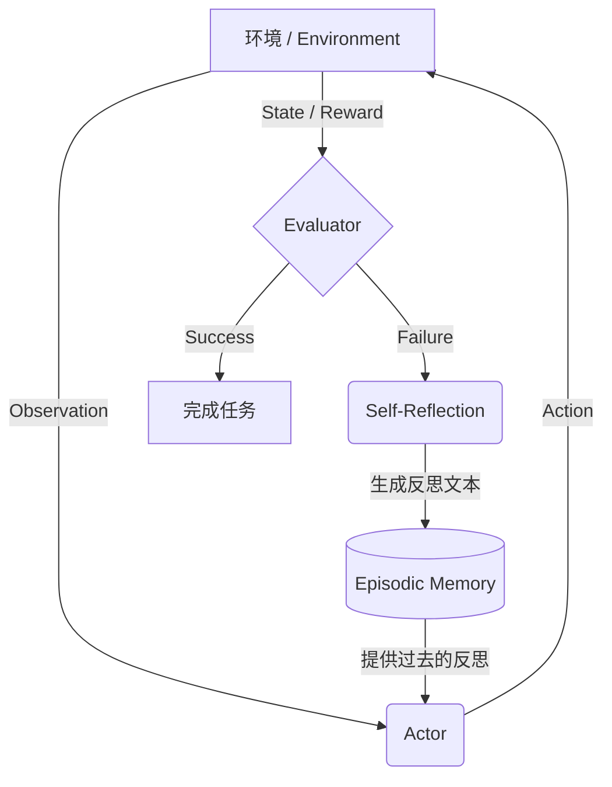
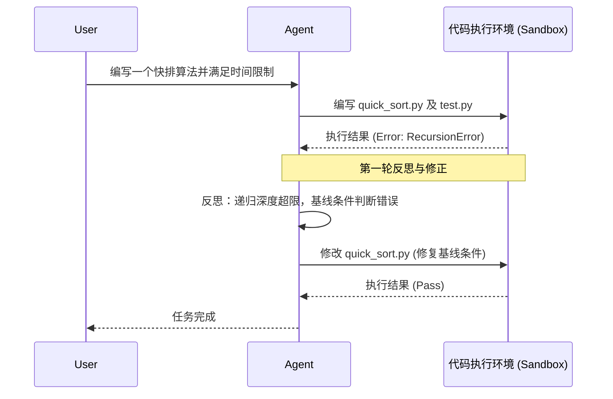
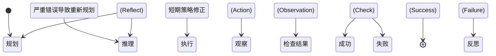

# 13.2.3 反思与自我修正 (Reflection & Self-Correction)

在大型语言模型 (LLM) 和 AI Agent 领域，**反思 (Reflection)** 与 **自我修正 (Self-Correction)** 是赋予智能体“纠错能力”并使其摆脱简单被动响应(Reactive)模式的关键机制。单纯的规划(Planning)和执行(Execution)往往难以应对开放世界中的复杂性与不确定性，特别是在遇到 API 失败、代码报错或逻辑矛盾时，Agent 需要一种能够评估自身行为、发现错误并动态调整策略的能力。

本文将深入探讨 Agent 认知架构中的反思与自我修正机制，包含理论范式、验证闭环的设计、常见的失败模式以及详尽的代码和架构实现。

<!--  -->

## 一、核心概念与原理背景

### 1.1 什么是 Agent 的反思与自我修正？

**反思(Reflection)** 是指 Agent 在执行动作(Action)并获取环境反馈(Observation)之后，不仅对下一步行动进行推理，还对其先前的思考(Thought)和动作(Action)的合理性、有效性进行元认知评估的过程。
**自我修正(Self-Correction)** 则是建立在反思基础上的行动指南，Agent 根据反思得出的结论(如：“上次 API 调用失败是因为参数类型错误”)，生成修正后的动作指令或重写中间结果。

### 1.2 为什么需要反思闭环？

传统的零样本(Zero-shot)或少样本(Few-shot)提示仅能促使 LLM 输出一次性的解答。然而，在复杂场景中，首次输出往往存在以下问题：
1. **幻觉(Hallucination)**：模型可能会虚构不存在的库函数或虚构事实。
2. **逻辑链断裂**：多步推理过程中，早期的一步错误会导致后续全面崩盘。
3. **环境动态变化**：执行工具时可能遇到网络波动、文件已被修改等意料之外的外部环境状态。

通过引入反思闭环(Verification Loop)，我们可以将 LLM 的角色从单纯的“生成器(Generator)”转变为“生成-验证-优化”复合体(Generator-Evaluator-Refiner)，显著提高任务完成的成功率(Success Rate)。

---

## 二、典型的反思范式与架构

在学术界与工业界，针对 Agent 反思已经演化出多种经典范式，每种范式在提示设计与系统架构上均有独特之处。

### 2.1 Reflexion (基于试错反思的强化学习)

**Reflexion** (Shinn et al., 2023) 是一种无需更新模型权重，仅通过自然语言形式的“语言反馈”来强化智能体的框架。它使 Agent 能够通过反思历史失败经验，在下一次试验(Trial)中表现得更好。

#### 核心机制：
1. **Actor**：生成并执行动作序列。
2. **Evaluator**：评估当前轨迹的质量(例如，是否达到了目标，或得分多少)。
3. **Self-Reflection**：当 Actor 失败时，Self-Reflection 模块会读取历史轨迹(Trajectory)，生成一段自然语言的反思(如：“在这个任务中，我不应该在未检查文件是否存在的情况下就读取它，下次我应该先执行 ls 命令”)。这些反思被存入记忆中(Memory)，并在下一次试验时作为上下文提示给 Actor。



### 2.2 Self-Refine (自我迭代优化)

**Self-Refine** 侧重于生成类任务(如代码编写、文章撰写)，无需外部环境的交互，纯依靠 LLM 自身的批判能力。
它的核心循环是：
1. 初始生成(Drafting)。
2. 提供反馈(Feedback / Critique)。
3. 根据反馈重新生成(Refining)。

#### Python 伪代码示例：

```python
def self_refine_loop(task_prompt, max_iters=3):
    draft = llm.generate(task_prompt)
    
    for i in range(max_iters):
        # 1. 批评/反思
        critique_prompt = f"针对任务：{task_prompt}\n评估以下输出的不足之处：\n{draft}"
        feedback = llm.generate(critique_prompt)
        
        # 如果模型认为已经完美，可提前终止
        if "没有不足" in feedback or "完美" in feedback:
            break
            
        # 2. 修正
        refine_prompt = f"任务：{task_prompt}\n原始输出：{draft}\n反馈意见：{feedback}\n请根据反馈改进输出。"
        draft = llm.generate(refine_prompt)
        
    return draft
```

### 2.3 CRITIC (验证性修正)

纯粹依靠 LLM 内部知识的 Self-Refine 在处理涉及外部确切事实(如数学计算、API 结构)时往往会陷入“盲目自信”的陷阱。**CRITIC**(Gou et al., 2023)引入了**外部工具**作为验证器。
当 Agent 生成一个答案后，它会自主调用外部工具(如计算器、代码解释器、搜索引擎)来验证其生成的中间结果是否正确，如果发现错误再进行修正。

<!--  -->

### 2.4 Self-RAG (自反思检索增强生成)

传统的 RAG(检索增强生成)无论用户查询什么，都会固定检索文档，这容易引入不相关的噪声。**Self-RAG** (Asai et al., 2023) 提出了一种将反思机制深度整合到生成过程中的框架。它不是在最后反思，而是在生成的**每一步 (Token-level 或 Sentence-level)** 动态自我评估。

Self-RAG 训练模型生成特殊的 **反思标记 (Reflection Tokens)**，例如：
1. `[Retrieve]`：模型判断当前回答是否需要检索外部知识。
2. `[ISREL]`：检索出的段落是否与问题相关？
3. `[ISSUP]`：当前生成的回答是否得到了检索段落的支持？
4. `[ISUSE]`：当前回答整体对用户是否有用？

如果模型生成了表明“未被支持”或“不相关”的反思标记，推理机制会自动丢弃当前的生成树分支，重新检索或重新生成，这极大地降低了 RAG 场景下的事实幻觉。

---

## 三、验证闭环(Verification Loops)的系统级构建

在真实的 Agent 框架(如 AutoGPT, LangChain, 复杂自研架构)中，我们需要从系统工程的角度构建严密的验证闭环。

### 3.1 内生验证 (Endogenous Verification)
内生验证是指依赖模型自身能力或通过多 Agent 对抗来实现验证。
- **Self-Consistency (自我一致性)**：多次采样，选择大多数支持的答案，这是一种隐式的自我验证。
- **双 Agent 对抗机制**：设置一个 `Generator_Agent` 和一个 `Reviewer_Agent`。Reviewer_Agent 的角色指令专门针对挑刺和边界情况检查。

### 3.2 外生验证 (Exogenous Verification)
外生验证依赖确定的外部环境，这是软件开发 Agent(如 Devin 类系统)成功的核心。

#### 3.2.1 基于测试驱动 (TDD) 的反思循环
对于代码生成任务，最可靠的反思反馈来源于**编译器与测试用例**。



#### 3.2.2 信号解析与错误截断
外部环境返回的错误信息(如 Java 的数百行堆栈跟踪)通常超出了 LLM 的上下文窗口，且充满了噪音。系统级别的验证闭环必须包含**反馈信号解析器**：
- **截断与精简**：只保留最顶层和最底层的报错堆栈。
- **格式化**：将报错信息包装成对 LLM 友好的格式：“你执行了命令 X，但发生了错误 Y。请思考原因并重新制定下一步计划。”

---

## 四、深入剖析失败模式与边界陷阱 (Failure Modes)

虽然反思机制赋予了 Agent 纠错能力，但在实际应用中，它常常会陷入各种失败模式(Failure Modes)。理解这些陷阱是构建鲁棒 Agent 架构的前提。

### 4.1 虚假纠错与“固执己见” (Stubbornness)
在某些情况下，即使向模型提供了明确的报错信息，模型仍可能在下一轮重试中生成**完全相同**的代码或策略。
- **根因**：模型的条件概率分布过于集中在某一种次优解上，导致无论怎么 Prompt 都会收敛回旧路径。
- **解决策略**：
  - 调整 Temperature 参数以增加采样多样性。
  - 在反思提示中强制要求：`"你上一次尝试了方案A失败了，本次请务必使用与方案A完全不同的思路。"`
  - 强制环境重置 (Resetting State)。

### 4.2 幻觉验证 (Hallucinated Verification)
当要求模型扮演 Reviewer 时，它可能会“无中生有”地挑刺，批评原本正确的代码，导致修正(Refine)阶段将正确的代码改错，这被称为**模型退化 (Degradation in Iteration)**。
- **现象**：越改越差，性能在迭代 2-3 次后断崖式下跌。
- **解决策略**：引入外部确定性验证(如前文所述的 CRITIC 模式)，禁止模型仅基于内部直觉进行无证据的代码修改。如果测试通过，则强制终止迭代。

### 4.3 死亡循环与过度反思 (Infinite Loops)
Agent 不断尝试 -> 失败 -> 反思 -> 再次尝试同样的错误，陷入死循环，耗尽 Token 资源。
- **防御机制**：
  1. **最大重试次数 (Max Iterations)**：严格限制在一个节点的最大重试次数(通常设为 3-5 次)。
  2. **状态哈希检测**：在系统层面对 Agent 生成的 Action Payload 计算哈希值。如果发现历史记录中存在相同的哈希(即 Agent 正在重复同样的动作)，立即触发硬中断(Hard Interrupt)，并提示：“检测到你在重复过去的动作，请立即改变策略”。
  3. **退避算法 (Backoff Strategy)**：连续失败后要求 Agent 从更粗的粒度重新规划，而不是纠结于当前的局部操作。

---

## 五、工程实践与代码实现 (Engineering Implementation)

在具体的工程实现中，如何在系统内部维持状态、管理记忆，并将反思逻辑优雅地集成进循环中至关重要。

### 5.1 数据结构定义

反思过程需要保存执行轨迹。以下是典型的轨迹节点定义(TypeScript 示例)：

```typescript
interface TrajectoryNode {
    step: number;
    thought: string;
    action: {
        tool: string;
        input: any;
    };
    observation: string;
    status: 'success' | 'failure' | 'error';
    reflection?: string; // 仅在出错时生成
}

class AgentMemory {
    private history: TrajectoryNode[] = [];
    private reflections: string[] = []; // 全局经验教训

    addReflection(lesson: string) {
        this.reflections.push(lesson);
    }
    
    getGuidelines(): string {
        if (this.reflections.length === 0) return "";
        return "基于之前的失败经验，请注意以下事项：\n" + 
               this.reflections.map((r, i) => `${i+1}. ${r}`).join("\n");
    }
}
```

### 5.2 反思 Prompt 的设计模板

高质量的自我修正依赖于精心设计的 System Prompt。通常需要结构化的输出来指导 LLM 思考：

```text
你是一个高级软件工程师 Agent。你刚刚尝试执行了一个动作，但失败了。
请仔细阅读以下的执行轨迹，并按照指定的 JSON 结构输出你的反思与下一步修正计划。

[历史经验]
{guidelines}

[当前轨迹]
目标: {goal}
动作: {action_json}
环境反馈(报错): {observation}

请输出以下 JSON：
{
  "analysis": "深入分析失败的根因，为什么会报错？是否是你的假设有误？",
  "failed_approaches": ["列出已经证明不可行的方案"],
  "new_plan": "基于分析，提出一个新的解决方案",
  "next_action": {
    "tool_name": "...",
    "parameters": {...}
  }
}
```

### 5.3 在 ReAct 架构中的集成

标准 ReAct (Reasoning and Acting) 架构由于往往只包含 `Thought -> Action -> Observation`，容易在错误发生时不断累积冗余信息。在 ReAct 循环中加入显式的 `Reflect` 步骤：



在系统实现中，我们通过分析 Observation 的特征来决定是继续正常循环，还是触发反思机制。例如，如果是 HTTP 500、语法错误等明确的硬性失败，优先走反思分支。

---

## 六、高级演进：多层反思与元认知 (Meta-Cognition)

随着 Agent 变得越来越复杂，其反思机制也从针对单一动作的修正，向着更高维度的“元认知”演进。

### 6.1 策略级反思 (Strategic Reflection)
不仅仅对“刚才的 API 调用为什么错”进行反思，而是对“我过去半个小时解决这个问题的**大方向**是否正确”进行反思。
这通常需要一个后台监控 Agent (Monitor Agent) 异步评估主 Agent 的进度。如果发现主 Agent 在某个文件上耗费了过多时间且毫无进展，监控 Agent 会介入并发送全局反思指令。

### 6.2 长期经验沉淀 (Long-term Experience Consolidation)
通过 Reflexion 生成的经验通常只作用于当前会话(Session)。高级架构会将反思结果转化为跨会话的知识(Skill Library 积累)。
- 成功解决某个疑难 Bug 后，Agent 自动提取泛化的“经验法则”(Heuristics)。
- 存入向量数据库中。
- 未来遇到类似特征的任务时，首先检索历史经验，将其作为 Few-shot 注入 Prompt 中。

---

## 七、总结

反思与自我修正(Reflection & Self-Correction)使得 LLM 从脆弱的单向信息流工具，变成了具备韧性(Resilience)的智能体。
构建一个有效的反思系统，关键在于：
1. **可靠的外部反馈源**(测试、工具输出)。
2. **结构化的认知流程**(明确分离生成、验证、反思步骤)。
3. **强大的系统级防呆机制**(防死循环、防状态停滞)。

未来的演进方向将是模型本身在预训练/微调阶段更深度地内化“纠错”行为模式，以及多 Agent 系统中的社会化反思(Peer Review)。

> “真正的智能，不仅在于能一次作对，更在于能在失败中找到通往正确的路径。”

---
*本文档为 13.2 节的核心组成部分，后续 13.2.4 将进一步介绍多智能体协作与社会化认知架构。*
