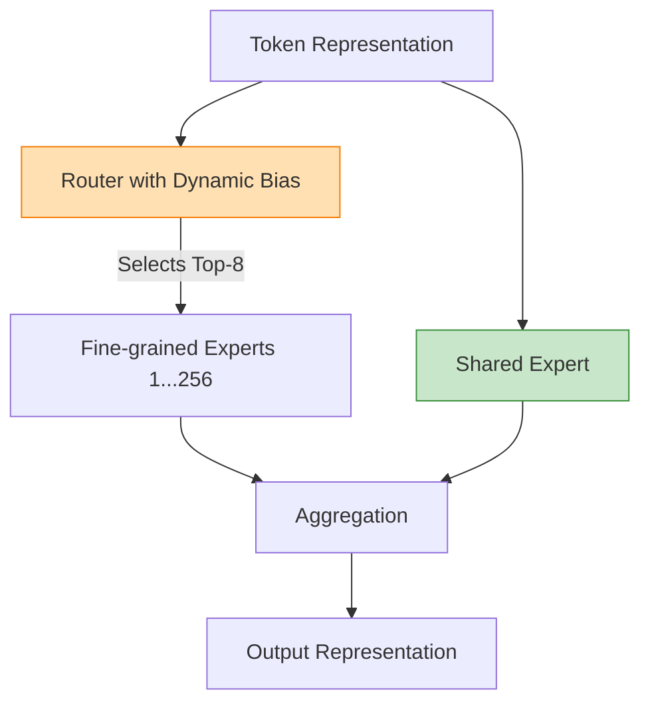

# DeepSeek-V3 核心技术专题索引

>  **[返回 14.1-DeepSeek 家族总览](../../14.1-DeepSeek.md)**

DeepSeek-V3 是 DeepSeek 家族从 V2 迈向顶级闭源对标能力的关键节点，也是 `MLA + DeepSeekMoE` 体系完成工程化放大、再叠加 `DualPipe`、`FP8`、`MTP` 与 `R1` 蒸馏的总装版本。

## 1. 技术问题定义与背景 (Technical Problem Definition)

DeepSeek-V3 试图解决 2024 年底几乎所有顶级大模型团队都面临的“不可能三角”问题：**如何在扩大模型规模(671B)提升能力的同时，将训练成本和推理成本压低到一个极其经济的水平？**

具体工程挑战包括：
1. **极限规模下的训练通信墙**：在 671B 的 MoE 架构中，数百张 GPU 之间的 All-to-All 路由通信将成为主要瓶颈。
2. **FP8 混合精度的深水区**：如何真正在超大模型预训练的全生命周期中落地 FP8 训练，而不仅是推理量化，同时避免数值下溢和梯度爆炸。
3. **KV Cache 与长文本推理**：如何在生成极长上下文时，避免内存成为卡脖子资源。
4. **后训练推理能力的迁移**：如何将 R1(专注于深度思维链)的逻辑推理能力蒸馏回标准聊天模型。

## 2. 方法论拆解 (Method Breakdown)

### 2.1 MLA (Multi-Head Latent Attention)
传统的 MHA 和 GQA 在长序列推理时 KV Cache 占用极大。V3 延续并固化了 MLA：
- **低秩压缩**：将 Key 和 Value 压缩到一个极小的隐变量空间(Latent Space)。
- **解耦 RoPE**：在低秩空间外单独处理旋转位置编码，保证了位置信息的精确传递，同时压缩了 90% 以上的 KV Cache。

$$
 c_t = W_{down} \cdot h_t, \quad k_t, v_t = W_{up\_K} \cdot c_t, W_{up\_V} \cdot c_t
$$

### 2.2 DeepSeekMoE 与无辅助损失均衡 (Auxiliary-Loss-Free Balancing)
- V3 拥有 256 个细粒度专家和 1 个共享专家。
- 为了防止传统的负载均衡损失函数(Auxiliary Loss)对主干预测能力造成干扰，V3 引入了 **Bias-based Balancing**。它通过在路由 Logits 上增加一个动态更新的偏置项(Bias)，来强制不同专家的负载均衡。

### 2.3 MTP (Multi-Token Prediction)
在主模型的输出层附加多个轻量级预测头，强制模型不仅预测下一个 Token，而是预测未来连续的 $N$ 个 Token。
这带来了两个好处：
1. 增强了训练信号密度，加快了收敛。
2. 为推理阶段的 **投机解码 (Speculative Decoding)** 提供了天然的 Draft Model 结构。

## 3. 工程实现与训练系统 (Engineering Analysis)

DeepSeek-V3 的“大招”藏在其底层训练系统工程中：

1. **DualPipe 双向流水线并行**：
   传统的流水线并行存在大量“气泡(Bubbles)”。DualPipe 让前向传播和反向传播在微批次(Micro-batches)级别完全交叠，同时隐藏了 MoE 的 All-to-All 通信延迟。
2. **完全无 TP (Tensor Parallelism)**：
   V3 抛弃了张量并行，转而采用纯粹的流水线并行(PP)与数据/专家并行(EP+DP)，从而极大降低了节点内的通信需求。
3. **FP8 训练内核**：
   定制了极其复杂的基于块(Block-wise)的 FP8 量化内核，乘法计算在 FP8 进行，累加在 FP32 进行。这是全球少数证明能在 600B+ 规模跑通全程 FP8 预训练的团队。

## 4. 边界与局限性说明 (Boundary Explanations)

- **硬件强绑定**：V3 的很多底层优化(如定制的 PTX 内核、极简的通信隐藏策略)深度依赖 Nvidia H800 的架构、IB 网络带宽和 NVLink 拓扑。在非标准硬件上复现其极高 MFU(模型算力利用率)极其困难。
- **特定语言领域限制**：由于主要语料为中英双语和代码数学，其在低资源小语种任务上的表现弱于同级别注重多语言的模型(如 Llama-3)。
- **部署门槛**：尽管是开源模型，671B 的完整参数仍需要 8x80GB 的显存节点才能支持高效推理。对于普通开发者而言，主要依赖其官方 API。

---

## 5. 文档导航

| 文档 | 说明 |
|:---|:---|
| [01-DeepSeek-V3 技术报告精译](01-DeepSeek-V3技术报告精译.md) | 技术报告全文精译 |
| [02-DeepSeek-V3 核心架构剖析](02-DeepSeek-V3核心架构剖析.md) | 核心架构深度剖析 |
| [03-DeepSeek-V3 MinerU-EN](03-DeepSeek-V3-mineru-en.md) | 原始英文 Markdown(MinerU 解析) |
| [04-DeepSeek-V3 MinerU-ZH](04-DeepSeek-V3-mineru-zh.md) | 中英对照+译者注(MinerU 解析) |
| [05-DeepSeek-V3 架构总览](05-DeepSeek-V3-Architecture-Overview.md) | 整体架构路线梳理 |
| [05-DeepSeek-V3 MLA 深度解析](05-DeepSeek-V3-MLA.md) | MLA 低秩压缩与解耦 RoPE |
| [05-DeepSeek-V3 DeepSeekMoE 深度解析](05-DeepSeek-V3-DeepSeekMoE.md) | 细粒度专家与无辅助损失均衡 |
| [05-DeepSeek-V3 DualPipe 深度解析](05-DeepSeek-V3-DualPipe.md) | 双向流水线并行与计算-通信重叠 |
| [05-DeepSeek-V3 MTP 深度解析](05-DeepSeek-V3-MTP.md) | 多 Token 预测目标与投机解码 |
| [05-DeepSeek-V3 训练系统深度解析](05-DeepSeek-V3-Training-System.md) | FP8、通信内核、部署与硬件建议 |
