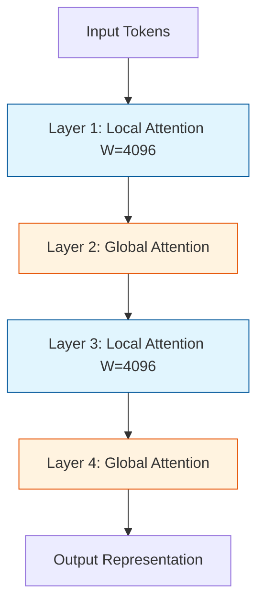

# Gemma-2 核心技术专题索引

> 🔙 **[返回 14.10-Gemma 家族总览](../../14.10-Gemma.md)**

## 1. 技术问题定义与背景 (Technical Problem Definition)

Gemma-2 的核心设计目标是在保持小尺寸模型(9B、27B 等量级)轻量级推理优势的同时, 突破传统小模型由于参数量受限导致的知识容量与推理能力天花板。在大模型(如 Gemini 1.5 Pro)不断演进的同时, 端侧与边缘侧对开源、高效且性能拔尖的小模型需求日益强烈。

Gemma-2 面临的主要技术挑战包括：
1. **模型压缩与知识蒸馏**：如何将千亿级甚至万亿级教师模型(Gemini)的深层知识(尤其是推理过程与分布特征)无损或少损地迁移到百亿级学生模型。
2. **长上下文与显存优化**：在有限的显存下(尤其是端侧设备), 如何支持更长上下文并维持注意力机制的计算效率。
3. **数值稳定性**：在深度网络中, 尤其是激活值极值问题导致量化和推理过程中的数值溢出(例如在半精度或 INT8 训练/推理时)。

## 2. 方法论拆解 (Method Breakdown)

### 2.1 基于逻辑值的深度知识蒸馏 (Logit-based Knowledge Distillation)

Gemma-2 广泛采用了教师模型的预测概率分布(Logits)来指导学生模型的训练。相比于仅使用硬标签(Hard Labels), 软标签(Soft Labels)包含了模型对不同候选词的置信度, 这在保留模型推理路径上至关重要。

$$ \mathcal{L}_{KD} = - \sum_{i} P_{teacher}(y_i | x) \log P_{student}(y_i | x) $$

此外, Gemma-2 引入了更细粒度的蒸馏策略, 结合了中间层特征对齐与分布对齐。

### 2.2 局部-全局注意力交错 (Interleaved Local-Global Attention)

为了在长上下文中平衡计算效率与信息捕捉能力, Gemma-2 采用了滑动窗口注意力(Local/Sliding Window Attention)与全局注意力(Global Attention)交错的架构。

这种设计使得：
- **局部层**：捕捉相邻上下文的细粒度依赖, 减少 $O(N^2)$ 的复杂度。
- **全局层**：确保远距离信息的有效传递, 防止上下文碎片化。

### 2.3 Logit Soft-Capping

为了防止由于极端 Logit 值导致的梯度爆炸和数值不稳定, Gemma-2 在注意力分数(Attention Scores)和最终输出层引入了 Soft-Capping 机制。

公式如下：
$$ \text{Logit} = \tau \cdot \tanh\left(\frac{x}{\tau}\right) $$
其中 $\tau$ 是一预设的缩放阈值(例如 30.0)。这种非线性约束在保证梯度的同时, 硬性限制了输出的上界, 极大增强了量化推理(如 FP8、INT8)的鲁棒性。

## 3. 工程实现与性能分析 (Engineering Analysis)

Gemma-2 在工程实现上做出了多项针对端侧和单卡部署的优化：

1. **GQA (Grouped-Query Attention)**:
   不同于传统的多头注意力, Gemma-2 全面采用 GQA, 通过共享 Key/Value 头, 大幅降低了推理阶段的 KV Cache 内存占用。
   - 内存对比：标准 MHA 在长上下文下可能占用十数 GB, 而 GQA 可将内存消耗降低至 $1/G$(其中 G 为组数)。

2. **多硬件后端的适配 (JAX / PyTorch / MLX)**:
   Gemma-2 在开源时即提供了广泛的后端支持, 特别是通过 JAX/XLA 实现的大规模训练集群高效通信。

## 4. 边界与局限性说明 (Boundary Explanations)

尽管 Gemma-2 表现出色, 但其架构也决定了部分局限性：
- **知识截断与更新难题**：作为一个蒸馏为主导的模型, 其内部知识图谱严格受限于教师模型。如果教师模型存在幻觉或知识盲点, Gemma-2 会大概率继承甚至放大。
- **特定语言的偏置**：在多语言支持上, 尤其针对低资源语言, 受限于词表的压缩率, Gemma-2 表现不如专注于多语言的专属模型。
- **交错注意力的推理适配**：局部与全局交错的注意力机制导致部分高度优化的推理引擎(如早期的 vLLM 某些分支)需要特定的算子修改才能充分释放吞吐潜力。

---

## 5. 专题列表

本文档汇总 Gemma-2 子目录下的所有 D5 核心技术专题文档.

| 编号 | 文件名 | 技术点 | 状态 |
|---|---|---|---|
| 1 | [05-Gemma-2-Knowledge-Distillation.md](./05-Gemma-2-Knowledge-Distillation.md) | 知识蒸馏原理与工程实现 | 已完成 |

## 6. 待补充专题

- 局部-全局注意力交错的工程权衡(深度对比测试数据)
- Logit Soft-Capping 的数值稳定性分析(FP8 混合精度场景)
- GQA 在端侧推理中的 KV Cache 优化与分块管理机制

> 知识库同步位置: `docs/guide/llm/distillation/gemma2-kd.md`
