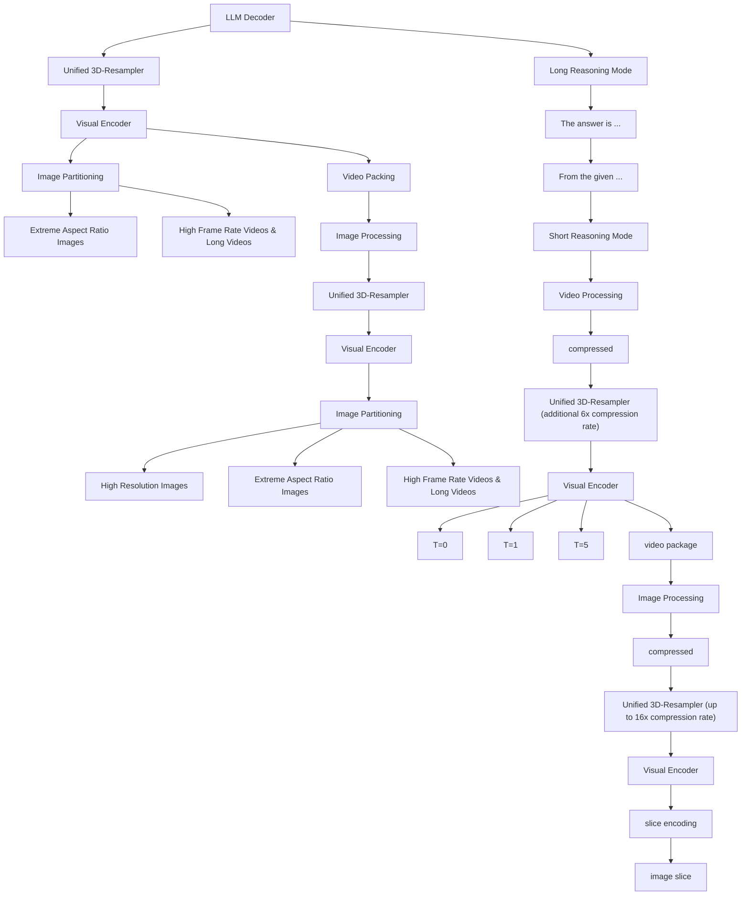

# MiniCPM-V 4.5: Cooking Efficient MLLMs via Architecture, Data, and Training Recipes

Tianyu Yu Zefan Wang Chongyi Wang Fuwei Huang Wenshuo Ma Zhihui He Tianchi Cai Weize Chen Yuxiang Huang Yuanqian Zhao Bokai Xu Junbo Cui Yingjing Xu Liqing Ruan Luoyuan Zhang Hanyu Liu Jingkun Tang Hongyuan Liu Qining Guo Wenhao Hu Bingxiang He Jie Zhou Jie Cai Ji Qi Zonghao Guo Chi Chen Guoyang Zeng Yuxuan Li Ganqu Cui Ning Ding Xu Han Yuan Yao∗ Zhiyuan Liu∗ Maosong Sun∗

MiniCPM-V Team, OpenBMB

yiranytianyu@gmail.com yaoyuanthu@gmail.com

MiniCPM-V 4.5 Code

MiniCPM-V 4.5 Model

# Abstract

Multimodal Large Language Models (MLLMs) are undergoing rapid progress and represent the frontier of AI development. However, their training and inference efficiency have emerged as a core bottleneck in making MLLMs more accessible and scalable. To address the challenges, we present MiniCPM-V 4.5, an 8B parameter model designed for high efficiency and strong performance. We introduce three core improvements in model architecture, data strategy and training method: a unified 3D-Resampler model architecture for highly compact encoding over images and videos, a unified learning paradigm for document knowledge and text recognition without heavy data engineering, and a hybrid reinforcement learning strategy for proficiency in both short and long reasoning modes. Comprehensive experimental results in OpenCompass evaluation show that MiniCPM-V 4.5 surpasses widely used proprietary models such as GPT-4o-latest, and significantly larger open-source models such as Qwen2.5-VL 72B. Notably, the strong performance is achieved with remarkable efficiency. For example, on the widely adopted VideoMME benchmark, MiniCPM-V 4.5 achieves state-of-the-art performance among models under 30B size, using just 46.7% GPU memory cost and 8.7% inference time of Qwen2.5-VL 7B.

# 1 Introduction

Multimodal Large Language Models (MLLMs) [1, 2, 3, 4, 5, 6, 7] are advancing rapidly the frontier of artificial intelligence, enabling machines to deeply understand and reason over different modalities such as text and images. However, as MLLMs evolve, the cost of data engineering, training, and inference also increases heavily. Addressing this efficiency challenge is now a central focus of both research and industry [6, 8, 9, 10, 11], essential for making capable MLLMs more accessible and scalable.

We decompose this efficiency problem into three core aspects: (1) Model Architecture. A primary efficiency bottleneck in MLLMs comes from the large number of visual tokens for high-resolution image encoding, which brings heavy computation overhead for visual encoders and LLMs. The problem is even exacerbated in video understanding, where existing models can take thousands of tokens to encode a short and low-resolution video, even when sampling at a low frame rate. For example, processing a 6-second, 2-fps video at a resolution of just 448×448 requires 1,536 tokens for Qwen2.5-VL [7], and 3,072 tokens for InternVL3 [9]. Such long visual token sequences lead to prohibitive training and inference costs in GPU memory and computation speed. (2) Training Data. As we quickly run out of new knowledge from traditional web page data, a new cornerstone of modern MLLMs is harnessing high-quality multimodal knowledge from documents [1, 2], such as scientific papers and textbooks. These documents are often stored as PDFs, containing multi-disciplinary knowledge in various domains and organized in diverse layouts of interleaved texts, images, and tables. However, most methods depend on brittle external parsing tools to convert document files into interleaved image-text sequences for training. These tools often fail in complex layouts, leading to either errors in knowledge learning or heavy data engineering efforts to fix the failure cases. (3) Training Methods. Reinforcement Learning (RL) has shown promise in improving complex reasoning capabilities by enabling a step-by-step explicit thinking process before providing the final answer [12, 1]. However, this performance gain often comes at the expense of extreme verbosity. Even for simple tasks such as identifying obvious objects, most existing thinking models produce excessively long outputs, inducing poor efficiency in both training and inference. For example, on the comprehensive Opencompass benchmark, the hybrid strategy requires only 33.3% long reasoning samples to match the peak long reasoning performance of training exclusively in single mode.

To address the challenges, MiniCPM-V 4.5 introduces three key improvements in model architecture, data strategy, and training method: (1) Unified 3D-Resampler for Compact Image and Video Encoding. Previous MiniCPM-V series models [6] exhibit high compression rates (e.g., 4× compared with most MLLMs) for high-resolution images via 2D-Resamplers [5, 13]. To further address the architectural inefficiency of video processing, we extend the 2D-Resampler to a 3D-Resampler that jointly compresses spatial-temporal information for videos. This module can encode a 6-second, 2-fps, 448×448 resolution video into only 128 visual tokens, achieving a 12×-24× reduction in token cost compared to representative MLLMs [7, 9], enabling efficient high frame rate and long video understanding, and unified encoding for images as well. (2) Unified Learning Paradigm for Document Knowledge and OCR. We propose a learning paradigm that enables the model to accurately acquire knowledge directly from document images, eliminating the need for fragile external parsers. By dynamically corrupting text regions in documents with varying noise levels and asking the model to reconstruct the text, the model learns to adaptively and properly switch between accurate text recognition (when text is roughly visible) and multimodal context-based knowledge reasoning (when text is heavily corrupted). (3) Hybrid Strategy for Post-Training. Unlike prior models that optimize for a single long reasoning mode [2, 1], we develop a hybrid RL post-training strategy to support both short reasoning mode for efficient usage and long reasoning mode for complex tasks. In RL training, we randomly alternate between the two modes during the rollout process for joint optimization. This approach not only enables flexible control over the short and long reasoning modes but also allows for mutual performance enhancement. In experiments, we can achieve better reasoning performance with fewer training samples for both modes.

Comprehensive experimental results in OpenCompass evaluation show that MiniCPM-V 4.5 outperforms widely used proprietary models such as GPT-4o-latest [4], and significantly larger opensource models such as Qwen2.5-VL 72B [7]. Notably, the strong performance is achieved with remarkable efficiency. For example, powered by the efficient unified 3D-Resampler, MiniCPM-V 4.5 achieves equivalent performance on VideoMME [14] using only 9.9% of the inference time of prior state-of-the-art MLLMs [1]. Based on the hybrid post-training strategy, MiniCPM-V 4.5 excels in both short and long reasoning modes, outperforming concurrent thinking models [3, 1] on OpenCompass evaluation while using only 42.9%-68.2% inference time.

In summary, our contributions are as follows:

• We open-source MiniCPM-V 4.5, an efficient and strong MLLM that supports efficient high frame rate and long video understanding, controllable hybrid reasoning, robust OCR, and strong document parsing capabilities.   
• We introduce three key improvements: a unified 3D-Resampler for efficient image and video encoding, a unified paradigm for document knowledge and OCR learning, and a hybrid strategy for post-training that enhances both performance and efficiency.   
• Comprehensive experiments demonstrate the effectiveness of the proposed technical improvements and the performance of MiniCPM-V 4.5.


<details>
<summary>flowchart</summary>


</details>

Figure 1: An overview of the MiniCPM-V 4.5 architecture. The model processes diverse visual inputs, such as high-resolution images and high frame rate videos. After the image partitioning and video packing processes, these inputs are encoded by a visual encoder and then fed into the unified 3D-Resampler. This module efficiently compresses both image and video features into a compact token sequence (achieving up to 16× compression rate for images and an additional 6× for videos), which is then processed by the LLM decoder. The decoder can generate responses in two distinct styles: a concise, short reasoning mode or a step-by-step, long reasoning mode.

# 2 Approach

In this section, we describe the methodology of MiniCPM-V 4.5, including the model architecture and the recipes for pre-training, SFT, and RL.

# 2.1 Architecture

As shown in Figure 1, the architecture of MiniCPM-V 4.5 comprises three main modules: (1) A lightweight visual encoder that flexibly handles high-resolution images with a special partitioning strategy. (2) A unified 3D-Resampler that encodes images and videos into compact features, exploiting temporal redundancies in visual information. (3) An LLM decoder that understands images, videos, and text, and generates text outputs.

# 2.1.1 The Unified 3D-Resampler

To tackle the image and video encoding efficiency bottleneck in MLLMs, we extend the 2D-Resampler to a 3D-Resampler that jointly compresses spatial-temporal information for videos. In this way, we achieve a 6× temporal compression rate by leveraging the temporal redundancy of consecutive multiple video frames.

Image Processing. To handle high-resolution images in any aspect ratio, we adopt the LLaVA-UHD [13] image partitioning strategy. For each image, we estimate the ideal number of slices from the input resolution and choose the partition whose per-slice resolution deviates least from the visual encoder pretraining setting. We then use learnable queries augmented with 2D spatial positional embeddings to produce a fixed-length sequence for each slice through cross-attention. Most existing MLLMs [7, 9, 1] adopt MLP and pixel unshuffle operation for visual compression, and typically require visual 256 tokens for encoding a 448×448 image. Leveraging the flexibility of resampler architecture, by choosing a small number of query tokens, MiniCPM-V can achieve a significantly higher compression rate for visual tokens (e.g., 64 tokens for a 448×448 image) while maintaining good performance.

Video Processing. To handle the significant redundancy in video data, we employ a joint spatialtemporal compression strategy for higher compression rates. For each video, we first split it into packages along the temporal dimension, where each package contains adjacent frames. Intuitively, the video frames within the same package typically share highly redundant visual information, which can be identified and compressed when jointly modeled. To this end, we resample the frame features from the visual encoder in each package into a fixed-length feature sequence through crossattention. We augment the learnable queries with both 2D spatial positional embedding, as used in image encoding, and temporal positional embedding. The final video representation is obtained by concatenating the token sequences from all packages. We sample at most 1080 frames per video at a maximum frame rate of 10. During training, the package size and frame rate are randomly augmented to improve robustness. This design also provides flexibility at inference time, allowing these hyperparameters to be adjusted to meet the demands of diverse scenarios and devices.

Based on the 3D-Resampler, MiniCPM-V 4.5 can achieve 96× compression rate for video tokens, where 6,448×448 video frames can be jointly compressed into 64 video tokens (normally 1,536- 3,072 tokens for most MLLMs). This means that the model can perceive significantly more video frames without increasing the LLM inference cost, which brings strong high-frame-rate video understanding and long video understanding capabilities.

Training Efficiency. Thanks to the flexibility of the resampler mechanism (agnostic to input shape), we can use the same 3D-Resampler for unified visual encoding over images and videos. This means that image and visual encoding share the same architecture and weights, and therefore, we can achieve the extension from 2D-Resampler to 3D-Resampler efficiently via a lightweight SFT stage. Moreover, this also facilitates efficient knowledge transfer from images to videos. For example, we observe reasonable video OCR capability in MiniCPM-V 4.5, although we did not specifically collect such training data.

# Takeaway

Joint spatial–temporal compression can enable higher visual compression rates. A unified architecture can be more efficiently adapted with minimal additional training and facilitates knowledge transfer from images to videos.

# 2.2 Pre-training

Our pre-training process aims to systematically build the model’s foundational capabilities through a progressive, multi-stage strategy. This involves a carefully curated data composition and a novel unified paradigm for document knowledge and OCR learning.

# 2.2.1 Pre-training Strategy

The pre-training comprises three progressive stages. Each stage strategically unfreezes different model components and introduces increasingly complex data to optimize learning efficiency.

Stage 1. We begin with a warm-up stage, training only the 2D-Resampler module while all other components remain frozen. This stage uses image-caption data to establish an initial alignment between visual and language modalities with minimal training cost.

Stage 2. We then unfreeze the vision encoder to enhance the perceptual foundation capability. This stage consumes OCR-rich data and image-caption data. Since the data in this stage may lack the fluency or quality required for language modeling, the LLM decoder remains frozen in this stage.

Stage 3. With the cross-modal bridge in place and the perceptual foundation set, the final stage trains all model parameters end-to-end using our highest quality data, including text-only corpora, image-text interleaved samples, videos, and a curated subset from earlier stages. At this point, we unfreeze the LLM decoder to fully exploit the knowledge and skills in data, encompassing multi-image reasoning and temporal understanding. We adopt the Warmup-Stable-Decay learning rate scheduler [15]. During the decay phase, we gradually add more high-quality instructions and knowledge-intensive data.

# 2.2.2 Pre-training Data

Image Caption Data. We combine large-scale public datasets (LAION-2B [16], COYO [17], etc.) with curated Chinese image-text pairs crawled from the web. We filter out low-resolution images and remove irrelevant image-text pairs with CLIP [18]. To enrich alt-text descriptions, we employ a Capsfusion-based [19] re-captioning process on a subset to generate fluent and factually complete captions. In this way, we formulate the valuable world knowledge in raw captions into more fluent natural language. We employ an MLLM to tag images with concept labels and ensure a balanced distribution across languages and long-tail concepts.


<details>
<summary>line</summary>

| Metric | Gaussian (σ=25) clean | Gaussian (σ=25) noisy | Poisson (λ=30) clean | Poisson (λ=30) noisy | Bernoulli (p=0,5) clean | Bernoulli (p=0,5) noisy | Convergence speed |
|--------|------------------------|------------------------|------------------------|------------------------|------------------------|------------------------|-------------------|
| Kodak | 32.50 | 32.48 | 31.82 | 31.52 | 31.50 | 29.15 | 33.01 |
| BSD300 | 31.07 | 31.06 | 30.34 | 30.18 | 30.16 | 27.56 | 31.04 |
| Set14 | 31.31 | 31.28 | 30.50 | 30.07 | 30.06 | 28.36 | 31.51 |
| Average | 31.63 | 31.61 | 30.89 | 30.59 | 30.57 | 28.36 | 31.85 |
| (a) White Gaussian, σ = 25 | 32.50 | 32.48 | 31.82 | 31.52 | 31.50 | 29.15 | 33.01 |
| (b) Brown Gaussian, σ = 25 | 32.50 | 32.48 | 31.82 | 31.52 | 31.50 | 29.15 | 31.04 |
| (c) Capture budget study (see text) | 32.50 | 32.48 | 31.82 | 31.52 | 31.50 | 29.15 | 31.51 |
| (d) Moderate Corruption for Integrated Inference | 32.50 | 32.48 | 31.82 | 31.52 | 31.50 | 29.15 | 31.04 |
| (e) For all further tests, we switch from RED30 to a shallower U-Net (Ronneberger et al., 2015) that is roughly 10× faster to train and gives similar results (~0.2 dB in Gaussian noise). The architecture and training parameters are described in the appendix. | 32.50 | 32.48 | 31.82 | 31.52 | 31.50 | 29.15 | 31.04 |
| (f) Low Corruption for Augmented OCR | 32.50 | 32.48 | 31.82 | 31.52 | 31.50 | 29.15 | 31.04 |
| (g) High Corruption for Contextual Inference | 32.50 | 32.48 | 31.82 | 31.52 | 31.50 | 29.15 | 31.04 |
</details>

Figure 2: Unified paradigm for document knowledge and OCR learning via dynamic visual corruption. We create a spectrum of training tasks through varied corruption levels: low corruption preserves readability to learn robust OCR, high corruption forces the model to perform contextual inference, and moderate corruption requires integrated inference from visual clues and context.

Image-Text Interleaved Data. Sourced from Common Crawl, OmniCorpus [20], and MINT-1T [21], image-text interleaved data is crucial for in-context learning and multi-image understanding capabilities. We apply filtering to ensure quality, removing samples with broken images or imbalanced image-text ratios. We further use relevance filtering to ensure meaningful multimodal associations, and employ knowledge density filtering to select a high-quality subset for the final decay phase of pre-training.

OCR Data. We synthesize OCR data to enhance the basic text recognition capability during the early pre-training stage. We render text on natural scenes with various combinations of color and font following [22], and also render real-world HTML sources into images.

Document Data. We collect documents, including scientific papers, academic reports, textbooks, etc., from the web. This data exhibits high knowledge density and contains visually complex layouts.

Video Caption Data. We aggregate several public datasets (WebVid [23], Vript [24], OpenVid [25]) and supplement them with detailed video captions. This diverse collection supports the development of temporal visual reasoning capabilities essential for video comprehension.

# 2.2.3 Unified Paradigm for Document Knowledge and OCR Learning

Documents, such as scientific papers, textbooks, and web pages, are vital resources for learning diverse layouts and acquiring multi-disciplinary knowledge in various domains. However, most MLLMs depend on brittle external parsers to convert document PDFs into an interleaved imagetext sequence for training. Such a noisy and inefficient process often introduces structural errors or requires heavy data engineering efforts to fix the failure cases.

Another challenge for OCR learning is that, while stronger image augmentation can create more diverse and harder samples, leading to more robust OCR capabilities, over-augmentation can make the texts indistinguishable. Forcing the model to produce the ground truth text from such indistinguishable visual input typically leads to hallucination problems. Therefore, previously, we could only afford a small and safe augmentation level.

To overcome both challenges, we propose a unified training paradigm that learns directly from document images, using their original text as ground truth. Our key insight is that the key difference between document knowledge acquisition and text recognition is the visibility of the text in images. We unify both capabilities into a single learning objective: predicting original text from corrupted document images. By dynamically corrupting text regions with varying corruption levels, the model learns to adaptively and properly switch between precise text recognition (when text is distinguishable) and multimodal context-based knowledge reasoning (when text is heavily obscured or masked), as illustrated in Figure 2. This eliminates reliance on fragile parsers and prevents hallucinations from over-augmented OCR data.

Specifically, for each document, we treat a subset of its text regions as training ground truth. We then stochastically apply different levels of corruption to each region, essentially creating different training tasks:

1. Low Corruption (Augmented OCR). When mild noise is applied to a text region, the texts are still recognizable, and the model could effectively predict them via text recognition.   
2. Moderate Corruption (Integrated Inference). When heavy noise is applied to the text region, individual characters become highly ambiguous and unreliable for recognition. The model must therefore learn to integrate the noisy visual cues from the corrupted region with the high-level document context and its internal knowledge to reconstruct the original text.   
3. High Corruption (Contextual Inference and Document Knowledge Learning). With the text region completely masked out, the model cannot rely on character-level cues to predict the missing content. Consequently, the model is forced to infer the information only from the multimodal context and its internal knowledge, including other text, layout structures, charts, tables, and images. This directly cultivates document-level understanding.

This unified approach yields a more efficient and resilient learning process. By learning directly from the document’s visual and textual structure, we avoid building complex document parsing pipelines and prevent potential noise introduced by fragile parsers. Furthermore, this paradigm allows us to fluidly combine knowledge learning and OCR objectives within the same training batch, maximizing data utility and producing a single, versatile model adept at a wide range of document understanding tasks.

# Takeaway

1. Foundation skills can be built on imperfect heterogeneous data sources by selectively freezing parameters.   
2. Simple dynamic visual corruption on document image text can effectively unify knowledge learning, robust OCR and contextual inference into a single learning objective.

# 2.3 Supervised Fine-tuning

The Supervised Fine-Tuning (SFT) stage aims to activate the model’s capability on a broad range of tasks and prepares for reinforcement learning. Moreover, we extend the 2D-Resampler to a unified 3D-Resampler at this stage to enhance the compression efficiency of video data.

# 2.3.1 Supervised Fine-tuning Strategy

We first train the general interaction abilities, and then cultivate specialized skills for advanced reasoning and temporal understanding.

Stage 1: General SFT. This stage aims to activate the broad knowledge acquired during pre-training and align it with human instructions. By fine-tuning on a diverse mixture of high-quality instructionresponse data, the model develops proficiency in multimodal interaction. To prevent degradation of text-only performance and improve training stability, we include 10% high-quality text-only data in the training mixture.

Stage 2: Long-CoT & 3D-Resampler. Building on versatile foundations from the previous stage, we then cultivate specialized skills to support long reasoning mode, high frame rate, and long video understanding. First, we unlock advanced reasoning by introducing the Long-CoT warm-up instructions into the SFT data. This encourages the model to perform an explicit step-by-step thinking process, incorporating cognitive patterns such as reflection and backtracking, which are vital for the long reasoning mode. Second, we enhance its temporal understanding by upgrading the architecture from 2D to 3D-Resampler and introducing high frame rate and long video data. Due to the unified design, we find that such an upgrade can be achieved efficiently with a small amount of high-quality video data.

# 2.3.2 Supervised Fine-tuning Data

STEM Data. To enhance STEM reasoning, we curate a dataset of high-school and higher multidisciplinary problems from online educational websites, covering physics, chemistry, biology, finance, computer science, etc. To ensure the data quality, we implement a two-stage filtering process. First, we only keep samples that exhibit high visual dependency (i.e., not solvable without image information). Second, we perform a consistency check to validate the correctness of the answers. For each remaining sample, we perform rejection sampling with a powerful MLLM to collect a clean reasoning process.

Long-tail Knowledge Data. To address the long-tail problem where models often fail on less common topics, we incorporate long-tail knowledge from Wikipedia [26] to synthesize high-quality multimodal instruction-following data. Specifically, for each entity page, we construct multimodal instructions and answers using strong MLLMs and keep samples with high visual dependency.

Long-CoT Data. Long-CoT data enables the model to acquire the necessary reasoning patterns for the long reasoning mode. Our data comes from OpenThoughts [27] and an in-house pipeline. We identify challenging prompts by filtering for those on which our early-stage models struggle. Our pilot studies show that focusing on challenging problems is the key to developing robust reasoning capabilities rather than memorizing trivial patterns. Each response then undergoes a multistage validation: we verify its correctness, assess trustworthiness with claim-level factual verification using RLAIF-V [28], and filter out meaningless repetition. Finally, validated responses are augmented through rewriting to enhance diversity.

# Takeaway

Filtering out easy prompts and focusing on challenging problems is crucial for effective Long-CoT warm-up.

# 2.4 Reinforcement Learning

The RL stage aims to enhance reasoning performance, enable controllable reasoning modes, and improve trustworthiness. To provide efficient general-domain rewards, we combine rule-verified rewards for straightforward cases with general probability-based rewards from RLPR [29] for complex answers and add a calibrated preference reward. A hybrid RL strategy is adopted to allow flexible switch between short and long reasoning modes. We further integrate RLAIF-V [28] to reduce hallucinations.

# 2.4.1 Reinforcement Learning Data

Our RL data contains high-quality samples that span four key domains. Each subset underwent a rigorous, human-in-the-loop cleaning and deduplication process.

Mathematics. We collect multimodal math problems from academic sources [30, 31, 32], which require the integration of visual perception and logical reasoning. We observe that many opensource datasets contain severe label errors and adopt a thorough cleaning process to produce the final high-quality set.

Documents, Tables, and Charts. To improve reasoning on perceptually complex scenarios, we curate a diverse mix of real-world datasets [33, 34, 35, 36, 37] and synthetic datasets [38, 39, 40] to improve the coverage of domains.

General Reasoning. To further improve general reasoning capabilities, we assemble a diverse collection of problems covering logical and multi-disciplinary reasoning tasks from VisualWebInstruct [41] and additional web resources. These data exhibit a more complex reference answer style; many of the problems have more than one sub-question.

Instruct Following. We incorporate text-only instructions from the Llama-Nemotron-Post-Training Dataset [42] and the MulDimIF dataset [43]. We observe that the instruction-following improvement generalizes well to multimodal instructions.

# 2.4.2 Reward Quality Control

The efficacy of RL is highly dependent on data quality. Thus, we implement meticulous quality control processing, focusing on two distinct aspects:

Label Accuracy. Incorrect labels can introduce flawed supervision signals. For each dataset, we maintain a small subset to inspect the label accuracy and conduct a human-in-the-loop cleaning process to keep a high label accuracy.

Rewarding Accuracy. Verifying model-generated responses in the general domain is a nontrivial challenge. Hand-crafted rules struggle to tackle the complexity of natural language. To address this, we dynamically apply the most suitable validation method for each case. For straightforward answers containing only a few tokens, we employ a rule-based verification system, achieving 98% reward accuracy. For complex natural language answers where rules are brittle $( \mathrm { e . g . }$ , those containing specific units or longer phrasing), we use the more robust probability-based rewards of RLPR [29].

Rewarding Coverage. To complement these accuracy-focused signals, we integrate a reward model to provide a dense preference-aligned signal that guides the model towards higher-quality humanlike responses. We apply the reward model to only the final answer part for the long reasoning mode to avoid the out-of-distribution problem.

# 2.4.3 Hybrid Reinforcement Learning

We adopt a controllable hybrid reasoning design for our RL model: a short reasoning mode for quick answers and a long reasoning mode that emits explicit step-by-step traces for complex problems. Mode switching is controlled by prompts. Both behaviors are initialized during SFT and then optimized jointly via hybrid RL, where rollouts randomly alternate between the two modes.

We apply GRPO [44] to optimize the model with these rollouts and remove the KL and entropy loss to improve stability. This training schedule not only preserves the efficiency of short responses while retaining complex reasoning capabilities, but also fosters cross-generalization, where reasoning capabilities learned in one mode can transfer to improve the other mode.

# 2.4.4 Reward Shaping

We design the reward shaping strategy to balance task capability, human preference, and training stability. The final reward signal is a weighted composite of four components: an accuracy reward $R _ { \mathbf { a c c } }$ , a format reward $\scriptstyle R _ { \mathbf { f o r m a t } }$ , a repetition penalty reward $R _ { \mathbf { r e p } } .$ , and a preference reward $R _ { \mathbf { r m } }$ . The preference reward is derived from an auxiliary RM trained with human preference data [45]. However, directly applying RMs in the long reasoning mode yields unsatisfactory results since standard RMs struggle to evaluate the out-of-distribution long reasoning chains, leading to worse alignment and training instability, which is also confirmed in our preliminary experiments.

To address this, we adopt a selective application strategy. The RM scores only the final answer part of the response, completely bypassing the explicit thinking steps. This provides a stable, dense reward signal that aligns with human preferences without incorrectly penalizing complex reasoning paths. The final reward is calculated as follows.

$$
R = R _ {\mathrm{acc}} + R _ {\mathrm{format}} + R _ {\mathrm{rep}} + \frac {1}{2} \tilde {R} _ {\mathrm{rm}}. \tag {1}
$$

Here, $\tilde { R } _ { \mathbf { r m } }$ is the standardized preference reward score computed using $\frac { R _ { \mathbf { r m } } - \bar { R } _ { \mathbf { r m } } } { \sigma ( R _ { \mathbf { r m } } ) }$ , where $\bar { R } _ { \mathbf { r m } }$ and $\sigma ( R _ { \mathbf { r m } } )$ represent the average and standard deviation of raw reward scores from responses sampled with the same prompt.

# 2.4.5 RLAIF-V

Visual hallucinations remain a critical limitation for MLLMs, particularly in applications requiring high reliability. To address this challenge, we integrate RLAIF-V [28] to make the responses more factually grounded to the visual input through alignment from scalable AI feedback. Notably, we extend this approach to video inputs, where hallucination problems are especially pronounced.

Response Sampling. We first sample multiple responses from the policy model under the same generation condition. This strategy ensures focused evaluation of factual accuracy, avoiding distributional mismatches between models.

Feedback Collection. We begin by decomposing complex responses into verifiable atomic claims, where each claim is independently validated. This transforms the complex long response evaluation into simpler claim-level verification, addressing the inherent challenge of holistic assessment and improving the precision of factual evaluation. Preference pairs are then constructed based on aggregated claim verification scores, where responses containing fewer factual errors are preferred.

Preference Learning. The resulting preference dataset, encompassing both image and video modalities, is used to train the model with DPO [46]. This stage proves particularly effective for visual tasks where factual accuracy is paramount, without compromising response quality or natural language fluency.

# Takeaway

1. Combining rule-based reward for simple responses and probability-based reward for complex natural language responses enables a reliable reward system for diverse tasks.   
2. Hybrid RL enables cross-mode generalization between long and short reasoning modes.

# 3 Experiments

In this section, we empirically evaluate the performance of MiniCPM-V 4.5, and the effectiveness of the proposed methods.

# 3.1 Baselines and Benchmarks

We compare with various strong baseline models: (1) state-of-the-art open-source models, represented by Qwen2.5-VL 72B [7]; (2) strong models of comparable parameter sizes, encompassing parameter-matched competitors such as InternVL3 [9] (8B), and GLM-4.1V [1] (9B); and (3) frontier proprietary models such as the latest GPT-4o [4].

Our evaluation encompasses several key areas of multimodal capabilities:

STEM includes mathematics and science-oriented benchmarks such as MMMU [47], Math-Vista [48], AI2D [49], MathVerse [50], LogicVista [51], and EMMA [52], designed to evaluate logical reasoning, mathematical problem-solving, and scientific understanding capabilities.

Document, OCR & Chart covers OCR-related tasks through OCRBench [53], ChartQA [54], TextVQA [55], DocVQA [56], and OmniDocBench [57], testing ability to extract, interpret, and reason about textual information in various visual contexts, including documents and charts.

Hallucination evaluates model reliability through HallusionBench [58], ObjHalBench [59], and MMHal-Bench [60], measuring the tendency to generate false or inconsistent information.

Multi-Image & Real-World & Instruction Following includes Mantis [61], MMT-Bench [62], RealWorldQA [63], and MM-IFEval [64], assessing performance on complex scenarios involving multiple images, real-world understanding, and instruction following.

Video Understanding encompasses Video-MME [65], LVBench [66], MLVU [67], LongVideoBench [68], MotionBench [69], and FavorBench [70], evaluating temporal reasoning and dynamic visual comprehension across various video tasks.

Comprehensive Multimodal Understanding includes benchmarks such as OpenCompass [71], MMVet [72], MMStar [73], MME [74], and MMBench V1.1 [75], which assess general visionlanguage comprehension across diverse task types. Within the OpenCompass average, we use the long reasoning mode for 5 benchmarks, including MMStar, MMVet, HallusionBench, MathVista, and MMMU.

<table><tr><td>Task</td><td>Benchmark</td><td>MiniCPM-V 4.5</td><td>Qwen2.5-VL</td><td>Qwen2.5-VL</td><td>InternVL3</td><td>GLM-4.1V</td><td>GPT-4o</td></tr><tr><td>Size</td><td></td><td>8B</td><td>7B</td><td>72B</td><td>8B</td><td>9B</td><td>-</td></tr><tr><td>Mode</td><td></td><td>hybrid</td><td>non-thinking</td><td>non-thinking</td><td>non-thinking</td><td>thinking</td><td>non-thinking</td></tr><tr><td rowspan="5">Comprehensive Multimodal</td><td>OpenCompass</td><td>77.0†</td><td>70.5</td><td>76.1</td><td>73.6</td><td>76.6</td><td>75.4‡</td></tr><tr><td>MMVet</td><td>75.5†</td><td>67.1</td><td>76.9</td><td>81.3</td><td>70.5†</td><td>76.9‡</td></tr><tr><td>MMStar</td><td>72.1†</td><td>63.9</td><td>70.5</td><td>68.2</td><td>72.9</td><td>70.2‡</td></tr><tr><td>MME</td><td>2500</td><td>2347</td><td>2483</td><td>2415</td><td>2466†</td><td>2318*</td></tr><tr><td>MMBench V1.1</td><td>84.2†</td><td>82.6</td><td>87.8</td><td>81.7</td><td>85.3</td><td>86.0‡</td></tr><tr><td rowspan="6">STEM</td><td>MMMU</td><td>67.7†</td><td>58.6</td><td>68.2</td><td>62.7</td><td>68.0</td><td>72.9‡</td></tr><tr><td>MathVista</td><td>79.9†</td><td>68.2</td><td>74.2</td><td>71.6</td><td>80.7</td><td>71.6‡</td></tr><tr><td>AI2D</td><td>86.5</td><td>83.9</td><td>88.5</td><td>85.2</td><td>87.9</td><td>86.3‡</td></tr><tr><td>MathVerse MINI</td><td>58.8†</td><td>49.2</td><td>47.3</td><td>39.8</td><td>68.4</td><td>40.6</td></tr><tr><td>LogicVista</td><td>57.0†</td><td>44.1</td><td>55.7</td><td>44.1</td><td>60.4</td><td>52.8</td></tr><tr><td>EMMA</td><td>34.8†</td><td>28.6*</td><td>-</td><td>-</td><td>35.7†</td><td>32.4</td></tr><tr><td rowspan="6">Document,OCR &amp; Chart</td><td>OCRBench</td><td>89.0</td><td>86.4</td><td>88.2</td><td>88.0</td><td>84.2</td><td>82.2‡</td></tr><tr><td>ChartQA</td><td>87.4</td><td>87.3</td><td>89.5</td><td>86.6</td><td>87.1†</td><td>86.7</td></tr><tr><td>TextVQA</td><td>82.2</td><td>84.9</td><td>83.5</td><td>80.2</td><td>79.9†</td><td>85.6*</td></tr><tr><td>DocVQA</td><td>94.7†</td><td>95.7</td><td>96.4</td><td>92.7</td><td>93.4†</td><td>93.0</td></tr><tr><td>OmniDocBench (EN) ↓</td><td>0.175</td><td>0.316</td><td>0.214</td><td>0.335*</td><td>0.460*</td><td>0.233</td></tr><tr><td>OmniDocBench (ZH) ↓</td><td>0.253</td><td>0.399</td><td>0.261</td><td>0.390*</td><td>0.573*</td><td>0.399</td></tr><tr><td rowspan="5">Hallucination</td><td>HallusionBench</td><td>61.2†</td><td>52.9</td><td>54.6</td><td>49.9</td><td>63.2</td><td>57.0‡</td></tr><tr><td>ObjHalBench (CHAIRS) ↓</td><td>9.3†</td><td>13.7*</td><td>17.0*</td><td>11.3*</td><td>12.3*</td><td>-</td></tr><tr><td>ObjHalBench (CHAIRi) ↓</td><td>5.2†</td><td>7.7*</td><td>8.9*</td><td>6.5*</td><td>6.4*</td><td>-</td></tr><tr><td>MMHal-Bench (Score)</td><td>5.0†</td><td>4.1*</td><td>4.2*</td><td>4.2*</td><td>4.6*</td><td>-</td></tr><tr><td>MMHal-Bench (Rate)↓</td><td>19.4†</td><td>31.6*</td><td>38.2*</td><td>24.3*</td><td>22.9*</td><td>-</td></tr><tr><td rowspan="4">Multi-Image &amp; Real World &amp; Instruction Following</td><td>Mantis</td><td>82.5†</td><td>74.7*</td><td>81.1*</td><td>70.1</td><td>78.8†</td><td>-</td></tr><tr><td>MMT-Bench</td><td>68.3</td><td>63.6</td><td>-</td><td>65.0</td><td>67.6</td><td>66.7*</td></tr><tr><td>RealWorldQA</td><td>72.1†</td><td>68.5</td><td>75.7</td><td>70.8</td><td>70.7†</td><td>76.8*</td></tr><tr><td>MM-IFEval</td><td>66.0</td><td>51.3*</td><td>73.8*</td><td>53.2*</td><td>58.4†</td><td>64.6</td></tr><tr><td rowspan="7">Video Understanding</td><td>Video-MME (w/o subs)</td><td>67.9</td><td>65.1</td><td>73.3</td><td>66.3</td><td>68.2</td><td>71.9</td></tr><tr><td>Video-MME (w/ subs)</td><td>73.5</td><td>71.6</td><td>79.1</td><td>68.9</td><td>73.6</td><td>77.2</td></tr><tr><td>LVBench</td><td>50.4</td><td>45.3</td><td>47.3</td><td>44.1*</td><td>44.0</td><td>48.9</td></tr><tr><td>MLVU (M-Avg)</td><td>75.1</td><td>70.2</td><td>74.6</td><td>71.4</td><td>72.5†</td><td>-</td></tr><tr><td>LongVideoBench (val)</td><td>63.9</td><td>56.0</td><td>60.7</td><td>58.8</td><td>65.7</td><td>-</td></tr><tr><td>MotionBench</td><td>59.7</td><td>53.0</td><td>58.3</td><td>58.1</td><td>59.0</td><td>58.0</td></tr><tr><td>FavorBench</td><td>56.0</td><td>42.3</td><td>48.1</td><td>45.3</td><td>51.2†</td><td>-</td></tr></table>

Table 1: Evaluation results across diverse vision-language benchmarks. The best performance is marked in bold. ∗ We evaluate officially released checkpoints by ourselves. † Reasoning mode used, where the average score of three runs is reported for robust evaluation. ‡ GPT-4o-latest evaluation results from OpenCompass. Otherwise GPT-4o-1120 is used in evaluation, since GPT-4o-latest is only accessible via Web API.

# 3.2 Main Results

As shown in Table 1, MiniCPM-V 4.5 demonstrates strong performance across a wide range of vision-language capabilities.

Comprehensive Capability. MiniCPM-V 4.5 achieves an average score of 77.0 on OpenCompass, a comprehensive evaluation of 8 popular benchmarks. With only 8B parameters, it surpasses widely

<table><tr><td>Model</td><td>Size</td><td>Avg Score ↑</td><td>Time ↓</td></tr><tr><td>GLM-4.1V-9B-thinking</td><td>10.3B</td><td>76.6</td><td>17.5h</td></tr><tr><td>MiMo-VL-7B-RL</td><td>8.3B</td><td>76.4</td><td>11.0h</td></tr><tr><td>MiniCPM-V 4.5</td><td>8.7B</td><td>77.0</td><td>7.5h</td></tr></table>

(a) OpenCompass results of thinking models

<table><tr><td>Model</td><td>Size</td><td>Score ↑</td><td>Time ↓</td><td>Mem ↓</td></tr><tr><td>Qwen2.5-VL-7B</td><td>8.3B</td><td>71.6</td><td>3.00h</td><td>60G</td></tr><tr><td>GLM-4.1V-9B-thinking</td><td>10.3B</td><td>73.6</td><td>2.63h</td><td>32G</td></tr><tr><td>MiniCPM-V 4.5</td><td>8.7B</td><td>73.5</td><td>0.26h</td><td>28G</td></tr></table>

(b) Video-MME results

Table 2: Inference efficiency on 8 A100 GPUs. Best results are marked in bold.

used proprietary models like GPT-4o-latest and strong open-source models like Qwen2.5-VL 72B for vision-language capabilities.

Video Understanding. The model achieves strong performance on high frame rate and fine-grained action dynamics video benchmarks such as MotionBench and FlavorBench. It also shows competitive performance on long video understanding benchmarks such as VideoMME, LVBench, MLVLU, LongVideoBench, etc.

OCR and Document Analysis. MiniCPM-V 4.5 achieves leading performance on OCRBench, surpassing proprietary models such as GPT-4o-latest. It also achieves state-of-the-art performance for PDF document parsing capability on OmniDocBench among general MLLMs.

Hallucination Reduction. The model shows a significant reduction in visual hallucinations, outperforming other models on ObjectHalBench and MMHal-Bench, since the RLAIF-V training stage specifically enhances the level of trustworthiness.

# 3.3 Inference Efficiency

We evaluated the inference efficiency of MiniCPM-V 4.5 in a standard configuration of 8 A100 GPUs on both image understanding and video understanding tasks. As detailed in Table 2, our model achieves competitive or superior performance while significantly reducing inference time and GPU memory consumption compared to other leading models. On OpenCompass, MiniCPM-V 4.5 not only achieves the highest average score among models under 30B, but also finishes the evaluation using 42.9% of the time of GLM-4.1V. This efficiency is enabled by the model’s flexible short and long reasoning modes. On VideoMME, the model demonstrates remarkable efficiency gains. With a strong performance of 73.6, it also reduces the inference time by nearly 10× (from 2.63h to 0.26h) and uses the least memory of 28G. This improvement is primarily due to the efficient 3D-Resampler, which compresses videos jointly considering spatial and temporal dimensions.

# 3.4 Ablations

We ablate key design choices of MiniCPM-V 4.5 in this section.

Hybrid reasoning reinforcement learning helps improve overall performance and efficiency. We evaluate the hybrid RL strategy that mixes samples from both long and short reasoning modes during training. As shown in Table 3, we observe that the hybrid strategy achieves the best multimodal understanding performance, demonstrating it effectively incentivizes strong long reasoning capability with only half of the

<table><tr><td>Method</td><td>OpenCompass</td><td>Training Tokens</td></tr><tr><td>Short reasoning only</td><td>76.0</td><td>1.6B</td></tr><tr><td>Long reasoning only</td><td>77.0</td><td>4.4B</td></tr><tr><td>Hybrid</td><td>77.1</td><td>3.1B</td></tr></table>

Table 3: Ablation of hybrid reinforcement learning. We report training token cost and performance on OpenCompass.

long reasoning samples during training. Moreover, the hybrid strategy consumes only 70.5% of the training token costs of the long reasoning only setting to achieve better performance. We hypothesize that this is because both modes share foundational perceptual and cognitive skills. The analytical depth cultivated by long reasoning appears to bolster the short reasoning, while the efficiency and directness learned from the short reasoning refine the long reasoning process.

Probability-based reward complements rule-verification reward. In addition to rule-based reward for easy-to-verify responses, MiniCPM-V 4.5 further incorporates the probability-based reward from RLPR [29] for general domain response verification. As shown in Figure 3, combining both rule-based and probability-based signals (VR + PR) consistently and substantially outperforms the rule-only approach, while also yielding stable training patterns with respect to response length and entropy. This confirms that probability-based reward provides a meaningful learning signal for the general reasoning data that rules struggle with, effectively complementing the small subset of simple data suitable for rule verification. The effectiveness becomes particularly evident as the number of training steps scales, where the robust reward signals across the full spectrum of multimodal scenarios provide essential training guidance that pure rule-based verification cannot deliver.


<details>
<summary>line</summary>

| Training Steps | VR+PR | VR   |
| -------------- | ----- | ---- |
| 100            | 74.5  | 74.8 |
| 200            | 75.2  | 75.5 |
| 300            | 75.8  | 75.7 |
| 400            | 76.7  | 76.2 |
| 500            | 76.3  | 76.0 |
| 600            | 76.8  | 76.5 |
| 700            | 77.0  | 76.4 |
</details>

(a) OpenCompass


<details>
<summary>line</summary>

| Training Steps | VR+PR | VR   |
| -------------- | ----- | ---- |
| 0              | 800   | 600  |
| 100            | 900   | 700  |
| 200            | 850   | 650  |
| 300            | 950   | 750  |
| 400            | 1000  | 800  |
| 500            | 1200  | 1000 |
| 600            | 1400  | 1600 |
| 700            | 1500  | 700  |
</details>

(b) Response Length


<details>
<summary>line</summary>

| Training Steps | VR+PR | VR   |
| -------------- | ----- | ---- |
| 0              | 0.6   | 0.6  |
| 100            | 0.4   | 0.3  |
| 200            | 0.3   | 0.25 |
| 300            | 0.25  | 0.2  |
| 400            | 0.2   | 0.15 |
| 500            | 0.3   | 0.1  |
| 600            | 0.4   | 0.05 |
| 700            | 0.5   | 0.0  |
</details>

(c) Entropy

Figure 3: Performance ablation of adding probability-based reward. We report OpenCompass scores, response length, and entropy on different training steps. 

<table><tr><td>Method</td><td>MMMU</td><td>AI2D</td><td>OCRBench</td></tr><tr><td>External Parser</td><td>49.0</td><td>74.9</td><td>576</td></tr><tr><td>Unified Learning</td><td>51.4</td><td>76.5</td><td>617</td></tr></table>

Table 4: Ablation of unified learning paradigm for document knowledge and text recognition. We report results on knowledge-intensive, document understanding, and text recognition benchmarks.

<table><tr><td>Method</td><td>w/ sub</td><td>w/o sub</td><td>tokens/frame</td></tr><tr><td>2D-Resampler</td><td>65.5</td><td>71.5</td><td>64.0</td></tr><tr><td>3D-Resampler</td><td>67.3</td><td>72.5</td><td>21.3</td></tr></table>

Table 5: Ablation of the 3D-Resampler. We report scores on VideoMME. w/ sub: using subtitles during evaluation; w/o sub: remove subtitles during evaluation

Unified learning of document knowledge and text recognition improves both capabilities. We run an ablation experiment for the proposed unified learning paradigm. Following the three stages pre-training process in § 2.2, we train the model on 1M high-quality samples, 20% of which are knowledge-intensive documents. Then we conduct a comparison against the baseline method after the same SFT pipeline. As shown in Table 4, the unified approach outperforms the baseline on both knowledge-intensive evaluations and text-recognition tasks. These gains indicate that learning directly from document images mitigates the noise introduced by fragile external parsers.

3D-Resampler enables higher performance with lower token cost. We ablate the 3D-Resampler to verify its effectiveness. To ensure a fair comparison against the 2D baseline, we fine-tuned the model ckpt after the general SFT stage for 300 steps, isolating the resampler architecture as the only variable. As demonstrated in Table 5, our 3D-Resampler achieves stronger performance, while using only one-third of the visual tokens per frame required by the 2D baseline.

# 4 Conclusion

We introduce MiniCPM-V 4.5, an MLLM designed with high efficiency at both training and inference time via architecture, data, and training recipe. With a unified 3D-Resampler, it achieves strong performance on high frame rate and long video understanding with superior encoding efficiency. Furthermore, the unified learning paradigm for document knowledge and text recognition allows the model to directly learn from document images. This approach bypasses fragile parsers and significantly reduces the data engineering complexity. Finally, the hybrid post-training strategy improves both training and inference efficiency while also facilitating generalization between short and long reasoning modes. Overall, MiniCPM-V 4.5 demonstrates a promising path toward addressing the efficiency bottlenecks in MLLM development.

# References

[1] GLM-V Team, Wenyi Hong, Wenmeng Yu, Xiaotao Gu, Guo Wang, Guobing Gan, Haomiao Tang, Jiale Cheng, Ji Qi, Junhui Ji, Lihang Pan, Shuaiqi Duan, Weihan Wang, Yan Wang, Yean Cheng, Zehai He, Zhe Su, Zhen Yang, Ziyang Pan, Aohan Zeng, Baoxu Wang, Bin Chen, Boyan Shi, Changyu Pang, Chenhui Zhang, Da Yin, Fan Yang, Guoqing Chen, Jiazheng Xu, Jiale Zhu, Jiali Chen, Jing Chen, Jinhao Chen, Jinghao Lin, Jinjiang Wang, Junjie Chen, Leqi Lei, Letian Gong, Leyi Pan, Mingdao Liu, Mingde Xu, Mingzhi Zhang, Qinkai Zheng, Sheng Yang, Shi Zhong, Shiyu Huang, Shuyuan Zhao, Siyan Xue, Shangqin Tu, Shengbiao Meng, Tianshu Zhang, Tianwei Luo, Tianxiang Hao, Tianyu Tong, Wenkai Li, Wei Jia, Xiao Liu, Xiaohan Zhang, Xin Lyu, Xinyue Fan, Xuancheng Huang, Yanling Wang, Yadong Xue, Yanfeng Wang, Yanzi Wang, Yifan An, Yifan Du, Yiming Shi, Yiheng Huang, Yilin Niu, Yuan Wang, Yuanchang Yue, Yuchen Li, Yutao Zhang, Yuting Wang, Yu Wang, Yuxuan Zhang, Zhao Xue, Zhenyu Hou, Zhengxiao Du, Zihan Wang, Peng Zhang, Debing Liu, Bin Xu, Juanzi Li, Minlie Huang, Yuxiao Dong, and Jie Tang. Glm-4.5v and glm-4.1v-thinking: Towards versatile multimodal reasoning with scalable reinforcement learning, 2025.   
[2] Kimi Team, Angang Du, Bohong Yin, Bowei Xing, Bowen Qu, Bowen Wang, Cheng Chen, Chenlin Zhang, Chenzhuang Du, Chu Wei, Congcong Wang, Dehao Zhang, Dikang Du, Dongliang Wang, Enming Yuan, Enzhe Lu, Fang Li, Flood Sung, Guangda Wei, Guokun Lai, Han Zhu, Hao Ding, Hao Hu, Hao Yang, Hao Zhang, Haoning Wu, Haotian Yao, Haoyu Lu, Heng Wang, Hongcheng Gao, Huabin Zheng, Jiaming Li, Jianlin Su, Jianzhou Wang, Jiaqi Deng, Jiezhong Qiu, Jin Xie, Jinhong Wang, Jingyuan Liu, Junjie Yan, Kun Ouyang, Liang Chen, Lin Sui, Longhui Yu, Mengfan Dong, Mengnan Dong, Nuo Xu, Pengyu Cheng, Qizheng Gu, Runjie Zhou, Shaowei Liu, Sihan Cao, Tao Yu, Tianhui Song, Tongtong Bai, Wei Song, Weiran He, Weixiao Huang, Weixin Xu, Xiaokun Yuan, Xingcheng Yao, Xingzhe Wu, Xinxing Zu, Xinyu Zhou, Xinyuan Wang, Y. Charles, Yan Zhong, Yang Li, Yangyang Hu, Yanru Chen, Yejie Wang, Yibo Liu, Yibo Miao, Yidao Qin, Yimin Chen, Yiping Bao, Yiqin Wang, Yongsheng Kang, Yuanxin Liu, Yulun Du, Yuxin Wu, Yuzhi Wang, Yuzi Yan, Zaida Zhou, Zhaowei Li, Zhejun Jiang, Zheng Zhang, Zhilin Yang, Zhiqi Huang, Zihao Huang, Zijia Zhao, and Ziwei Chen. Kimi-VL technical report, 2025.   
[3] LLM-Core Xiaomi, Zihao Yue, Zhenru Lin, Yifan Song, Weikun Wang, Shuhuai Ren, Shuhao Gu, Shicheng Li, Peidian Li, Liang Zhao, Lei Li, Kainan Bao, Hao Tian, Hailin Zhang, Gang Wang, Dawei Zhu, Cici, Chenhong He, Bowen Ye, Bowen Shen, Zihan Zhang, Zihan Jiang, Zhixian Zheng, Zhichao Song, Zhenbo Luo, Yue Yu, Yudong Wang, Yuanyuan Tian, Yu Tu, Yihan Yan, Yi Huang, Xu Wang, Xinzhe Xu, Xingchen Song, Xing Zhang, Xing Yong, Xin Zhang, Xiangwei Deng, Wenyu Yang, Wenhan Ma, Weiwei Lv, Weiji Zhuang, Wei Liu, Sirui Deng, Shuo Liu, Shimao Chen, Shihua Yu, Shaohui Liu, Shande Wang, Rui Ma, Qiantong Wang, Peng Wang, Nuo Chen, Menghang Zhu, Kangyang Zhou, Kang Zhou, Kai Fang, Jun Shi, Jinhao Dong, Jiebao Xiao, Jiaming Xu, Huaqiu Liu, Hongshen Xu, Heng Qu, Haochen Zhao, Hanglong Lv, Guoan Wang, Duo Zhang, Dong Zhang, Di Zhang, Chong Ma, Chang Liu, Can Cai, and Bingquan Xia. Mimo-vl technical report, 2025.   
[4] OpenAI. Openai platform chatgpt-4o, 2025. Accessed: 2025-08-03.   
[5] Jinze Bai, Shuai Bai, Shusheng Yang, Shijie Wang, Sinan Tan, Peng Wang, Junyang Lin, Chang Zhou, and Jingren Zhou. Qwen-vl: A versatile vision-language model for understanding, localization, text reading, and beyond, 2023.   
[6] Yuan Yao, Tianyu Yu, Ao Zhang, Chongyi Wang, Junbo Cui, Hongji Zhu, Tianchi Cai, Haoyu Li, Weilin Zhao, Zhihui He, et al. Minicpm-v: A gpt-4v level mllm on your phone. ArXiv preprint, abs/2408.01800, 2024.   
[7] Shuai Bai, Keqin Chen, Xuejing Liu, Jialin Wang, Wenbin Ge, Sibo Song, Kai Dang, Peng Wang, Shijie Wang, Jun Tang, Humen Zhong, Yuanzhi Zhu, Mingkun Yang, Zhaohai Li, Jianqiang Wan, Pengfei Wang, Wei Ding, Zheren Fu, Yiheng Xu, Jiabo Ye, Xi Zhang, Tianbao Xie, Zesen Cheng, Hang Zhang, Zhibo Yang, Haiyang Xu, and Junyang Lin. Qwen2.5-vl technical report, 2025.   
[8] Shiyin Lu, Yang Li, Yu Xia, Yuwei Hu, Shanshan Zhao, Yanqing Ma, Zhichao Wei, Yinglun Li, Lunhao Duan, Jianshan Zhao, Yuxuan Han, Haijun Li, Wanying Chen, Junke Tang, Chengkun

Hou, Zhixing Du, Tianli Zhou, Wenjie Zhang, Huping Ding, Jiahe Li, Wen Li, Gui Hu, Yiliang Gu, Siran Yang, Jiamang Wang, Hailong Sun, Yibo Wang, Hui Sun, Jinlong Huang, Yuping He, Shengze Shi, Weihong Zhang, Guodong Zheng, Junpeng Jiang, Sensen Gao, Yi-Feng Wu, Sijia Chen, Yuhui Chen, Qing-Guo Chen, Zhao Xu, Weihua Luo, and Kaifu Zhang. Ovis2.5 technical report. arXiv:2508.11737, 2025.

[9] Jinguo Zhu, Weiyun Wang, Zhe Chen, Zhaoyang Liu, Shenglong Ye, Lixin Gu, Hao Tian, Yuchen Duan, Weijie Su, Jie Shao, et al. Internvl3: Exploring advanced training and test-time recipes for open-source multimodal models. ArXiv preprint, abs/2504.10479, 2025.   
[10] Bo Zhang, Shuo Li, Runhe Tian, Yang Yang, Jixin Tang, Jinhao Zhou, and Lin Ma. Flash-vl 2b: Optimizing vision-language model performance for ultra-low latency and high throughput. arXiv preprint arXiv:2505.09498, 2025.   
[11] Google DeepMind. Gemini 2.0: Our latest, most capable ai model yet, 2024. First Gemini 2.0 Flash announced December 11, 2024; multimodal support for text, image, audio, native tool use.   
[12] DeepSeek-AI, Daya Guo, Dejian Yang, Haowei Zhang, Junxiao Song, Ruoyu Zhang, Runxin Xu, Qihao Zhu, Shirong Ma, Peiyi Wang, Xiao Bi, Xiaokang Zhang, Xingkai Yu, Yu Wu, Z. F. Wu, Zhibin Gou, Zhihong Shao, Zhuoshu Li, Ziyi Gao, Aixin Liu, Bing Xue, Bingxuan Wang, Bochao Wu, Bei Feng, Chengda Lu, Chenggang Zhao, Chengqi Deng, Chenyu Zhang, Chong Ruan, Damai Dai, Deli Chen, Dongjie Ji, Erhang Li, Fangyun Lin, Fucong Dai, Fuli Luo, Guangbo Hao, Guanting Chen, Guowei Li, H. Zhang, Han Bao, Hanwei Xu, Haocheng Wang, Honghui Ding, Huajian Xin, Huazuo Gao, Hui Qu, Hui Li, Jianzhong Guo, Jiashi Li, Jiawei Wang, Jingchang Chen, Jingyang Yuan, Junjie Qiu, Junlong Li, J. L. Cai, Jiaqi Ni, Jian Liang, Jin Chen, Kai Dong, Kai Hu, Kaige Gao, Kang Guan, Kexin Huang, Kuai Yu, Lean Wang, Lecong Zhang, Liang Zhao, Litong Wang, Liyue Zhang, Lei Xu, Leyi Xia, Mingchuan Zhang, Minghua Zhang, Minghui Tang, Meng Li, Miaojun Wang, Mingming Li, Ning Tian, Panpan Huang, Peng Zhang, Qiancheng Wang, Qinyu Chen, Qiushi Du, Ruiqi Ge, Ruisong Zhang, Ruizhe Pan, Runji Wang, R. J. Chen, R. L. Jin, Ruyi Chen, Shanghao Lu, Shangyan Zhou, Shanhuang Chen, Shengfeng Ye, Shiyu Wang, Shuiping Yu, Shunfeng Zhou, Shuting Pan, S. S. Li, Shuang Zhou, Shaoqing Wu, Shengfeng Ye, Tao Yun, Tian Pei, Tianyu Sun, T. Wang, Wangding Zeng, Wanjia Zhao, Wen Liu, Wenfeng Liang, Wenjun Gao, Wenqin Yu, Wentao Zhang, W. L. Xiao, Wei An, Xiaodong Liu, Xiaohan Wang, Xiaokang Chen, Xiaotao Nie, Xin Cheng, Xin Liu, Xin Xie, Xingchao Liu, Xinyu Yang, Xinyuan Li, Xuecheng Su, Xuheng Lin, X. Q. Li, Xiangyue Jin, Xiaojin Shen, Xiaosha Chen, Xiaowen Sun, Xiaoxiang Wang, Xinnan Song, Xinyi Zhou, Xianzu Wang, Xinxia Shan, Y. K. Li, Y. Q. Wang, Y. X. Wei, Yang Zhang, Yanhong Xu, Yao Li, Yao Zhao, Yaofeng Sun, Yaohui Wang, Yi Yu, Yichao Zhang, Yifan Shi, Yiliang Xiong, Ying He, Yishi Piao, Yisong Wang, Yixuan Tan, Yiyang Ma, Yiyuan Liu, Yongqiang Guo, Yuan Ou, Yuduan Wang, Yue Gong, Yuheng Zou, Yujia He, Yunfan Xiong, Yuxiang Luo, Yuxiang You, Yuxuan Liu, Yuyang Zhou, Y. X. Zhu, Yanhong Xu, Yanping Huang, Yaohui Li, Yi Zheng, Yuchen Zhu, Yunxian Ma, Ying Tang, Yukun Zha, Yuting Yan, Z. Z. Ren, Zehui Ren, Zhangli Sha, Zhe Fu, Zhean Xu, Zhenda Xie, Zhengyan Zhang, Zhewen Hao, Zhicheng Ma, Zhigang Yan, Zhiyu Wu, Zihui Gu, Zijia Zhu, Zijun Liu, Zilin Li, Ziwei Xie, Ziyang Song, Zizheng Pan, Zhen Huang, Zhipeng Xu, Zhongyu Zhang, and Zhen Zhang. Deepseek-r1: Incentivizing reasoning capability in llms via reinforcement learning, 2025.   
[13] Zonghao Guo, Ruyi Xu, Yuan Yao, Junbo Cui, Zanlin Ni, Chunjiang Ge, Tat-Seng Chua, Zhiyuan Liu, and Gao Huang. Llava-uhd: an lmm perceiving any aspect ratio and highresolution images. In European Conference on Computer Vision, pages 390–406. Springer, 2024.   
[14] Chaoyou Fu, Yuhan Dai, Yongdong Luo, Lei Li, Shuhuai Ren, Renrui Zhang, Zihan Wang, Chenyu Zhou, Yunhang Shen, Mengdan Zhang, Peixian Chen, Yanwei Li, Shaohui Lin, Sirui Zhao, Ke Li, Tong Xu, Xiawu Zheng, Enhong Chen, Caifeng Shan, Ran He, and Xing Sun. Video-mme: The first-ever comprehensive evaluation benchmark of multi-modal llms in video analysis, 2024.

[15] Shengding Hu, Yuge Tu, Xu Han, Chaoqun He, Ganqu Cui, Xiang Long, Zhi Zheng, Yewei Fang, Yuxiang Huang, Weilin Zhao, et al. Minicpm: Unveiling the potential of small language models with scalable training strategies. ArXiv preprint, abs/2404.06395, 2024.   
[16] Christoph Schuhmann, Romain Beaumont, Richard Vencu, Cade Gordon, Ross Wightman, Mehdi Cherti, Theo Coombes, Aarush Katta, Clayton Mullis, Mitchell Wortsman, Patrick Schramowski, Srivatsa Kundurthy, Katherine Crowson, Ludwig Schmidt, Robert Kaczmarczyk, and Jenia Jitsev. LAION-5B: an open large-scale dataset for training next generation image-text models. In Sanmi Koyejo, S. Mohamed, A. Agarwal, Danielle Belgrave, K. Cho, and A. Oh, editors, Advances in Neural Information Processing Systems 35: Annual Conference on Neural Information Processing Systems 2022, NeurIPS 2022, New Orleans, LA, USA, November 28 - December 9, 2022, 2022.   
[17] Minwoo Byeon, Beomhee Park, Haecheon Kim, Sungjun Lee, Woonhyuk Baek, and Saehoon Kim. Coyo-700m: Image-text pair dataset. https://github.com/kakaobrain/ coyo-dataset, 2022.   
[18] Alec Radford, Jong Wook Kim, Chris Hallacy, Aditya Ramesh, Gabriel Goh, Sandhini Agarwal, Girish Sastry, Amanda Askell, Pamela Mishkin, Jack Clark, Gretchen Krueger, and Ilya Sutskever. Learning transferable visual models from natural language supervision. In Marina Meila and Tong Zhang, editors, Proc. of ICML, volume 139 of Proceedings of Machine Learning Research, pages 8748–8763. PMLR, 2021.   
[19] Qiying Yu, Quan Sun, Xiaosong Zhang, Yufeng Cui, Fan Zhang, Yue Cao, Xinlong Wang, and Jingjing Liu. Capsfusion: Rethinking image-text data at scale. In IEEE/CVF Conference on Computer Vision and Pattern Recognition, CVPR 2024, Seattle, WA, USA, June 16-22, 2024, pages 14022–14032. IEEE, 2024.   
[20] Qingyun Li, Zhe Chen, Weiyun Wang, Wenhai Wang, Shenglong Ye, Zhenjiang Jin, Guanzhou Chen, Yinan He, Zhangwei Gao, Erfei Cui, et al. Omnicorpus: A unified multimodal corpus of 10 billion-level images interleaved with text. ArXiv preprint, abs/2406.08418, 2024.   
[21] Anas Awadalla, Le Xue, Oscar Lo, Manli Shu, Hannah Lee, Etash Guha, Sheng Shen, Mohamed Awadalla, Silvio Savarese, Caiming Xiong, Ran Xu, Yejin Choi, and Ludwig Schmidt. MINT-1T: scaling open-source multimodal data by 10x: A multimodal dataset with one trillion tokens. In Amir Globersons, Lester Mackey, Danielle Belgrave, Angela Fan, Ulrich Paquet, Jakub M. Tomczak, and Cheng Zhang, editors, Advances in Neural Information Processing Systems 38: Annual Conference on Neural Information Processing Systems 2024, NeurIPS 2024, Vancouver, BC, Canada, December 10 - 15, 2024, 2024.   
[22] Ankush Gupta, Andrea Vedaldi, and Andrew Zisserman. Synthetic data for text localisation in natural images. In 2016 IEEE Conference on Computer Vision and Pattern Recognition, CVPR 2016, Las Vegas, NV, USA, June 27-30, 2016, pages 2315–2324. IEEE Computer Society, 2016.   
[23] Max Bain, Arsha Nagrani, Gul Varol, and Andrew Zisserman. Frozen in time: A joint video¨ and image encoder for end-to-end retrieval. In 2021 IEEE/CVF International Conference on Computer Vision, ICCV 2021, Montreal, QC, Canada, October 10-17, 2021, pages 1708–1718. IEEE, 2021.   
[24] Dongjie Yang, Suyuan Huang, Chengqiang Lu, Xiaodong Han, Haoxin Zhang, Yan Gao, Yao Hu, and Hai Zhao. Vript: A video is worth thousands of words. In Amir Globersons, Lester Mackey, Danielle Belgrave, Angela Fan, Ulrich Paquet, Jakub M. Tomczak, and Cheng Zhang, editors, Advances in Neural Information Processing Systems 38: Annual Conference on Neural Information Processing Systems 2024, NeurIPS 2024, Vancouver, BC, Canada, December 10 - 15, 2024, 2024.   
[25] Kepan Nan, Rui Xie, Penghao Zhou, Tiehan Fan, Zhenheng Yang, Zhijie Chen, Xiang Li, Jian Yang, and Ying Tai. Openvid-1m: A large-scale high-quality dataset for text-to-video generation. ArXiv preprint, abs/2407.02371, 2024.   
[26] Wikipedia contributors. Wikipedia, the free encyclopedia, 2025. Accessed: 2025-09-14; CC BY-SA 4.0.

[27] Etash Guha, Ryan Marten, Sedrick Keh, Negin Raoof, Georgios Smyrnis, Hritik Bansal, Marianna Nezhurina, Jean Mercat, Trung Vu, Zayne Sprague, et al. Openthoughts: Data recipes for reasoning models. ArXiv preprint, abs/2506.04178, 2025.   
[28] Tianyu Yu, Haoye Zhang, Qiming Li, Qixin Xu, Yuan Yao, Da Chen, Xiaoman Lu, Ganqu Cui, Yunkai Dang, Taiwen He, Xiaocheng Feng, Jun Song, Bo Zheng, Zhiyuan Liu, Tat-Seng Chua, and Maosong Sun. Rlaif-v: Open-source ai feedback leads to super gpt-4v trustworthiness, 2024.   
[29] Tianyu Yu, Bo Ji, Shouli Wang, Shu Yao, Zefan Wang, Ganqu Cui, Lifan Yuan, Ning Ding, Yuan Yao, Zhiyuan Liu, Maosong Sun, and Tat-Seng Chua. Rlpr: Extrapolating rlvr to general domains without verifiers, 2025.   
[30] Jiahui Gao, Renjie Pi, Jipeng Zhang, Jiacheng Ye, Wanjun Zhong, Yufei Wang, Lanqing Hong, Jianhua Han, Hang Xu, Zhenguo Li, and Lingpeng Kong. G-llava: Solving geometric problem with multi-modal large language model, 2023.   
[31] Linger Deng, Yuliang Liu, Bohan Li, Dongliang Luo, Liang Wu, Chengquan Zhang, Pengyuan Lyu, Ziyang Zhang, Gang Zhang, Errui Ding, et al. R-cot: Reverse chain-of-thought problem generation for geometric reasoning in large multimodal models. ArXiv preprint, abs/2410.17885, 2024.   
[32] Adam Dahlgren Lindstrom and Savitha Sam Abraham. Clevr-math: A dataset for composi-¨ tional language, visual and mathematical reasoning, 2022.   
[33] Vivek Gupta, Maitrey Mehta, Pegah Nokhiz, and Vivek Srikumar. INFOTABS: Inference on tables as semi-structured data. In Dan Jurafsky, Joyce Chai, Natalie Schluter, and Joel Tetreault, editors, Proc. of ACL, pages 2309–2324, Online, 2020. Association for Computational Linguistics.   
[34] Pan Lu, Liang Qiu, Kai-Wei Chang, Ying Nian Wu, Song-Chun Zhu, Tanmay Rajpurohit, Peter Clark, and Ashwin Kalyan. Dynamic prompt learning via policy gradient for semi-structured mathematical reasoning. In Proc. of ICLR. OpenReview.net, 2023.   
[35] Panupong Pasupat and Percy Liang. Compositional semantic parsing on semi-structured tables. In Chengqing Zong and Michael Strube, editors, Proc. of ACL, pages 1470–1480, Beijing, China, 2015. Association for Computational Linguistics.   
[36] Wenhu Chen, Hongmin Wang, Jianshu Chen, Yunkai Zhang, Hong Wang, Shiyang Li, Xiyou Zhou, and William Yang Wang. Tabfact: A large-scale dataset for table-based fact verification. In Proc. of ICLR. OpenReview.net, 2020.   
[37] Fengbin Zhu, Wenqiang Lei, Youcheng Huang, Chao Wang, Shuo Zhang, Jiancheng Lv, Fuli Feng, and Tat-Seng Chua. TAT-QA: A question answering benchmark on a hybrid of tabular and textual content in finance. In Chengqing Zong, Fei Xia, Wenjie Li, and Roberto Navigli, editors, Proc. of ACL, pages 3277–3287, Online, 2021. Association for Computational Linguistics.   
[38] Samira Ebrahimi Kahou, Adam Atkinson, Vincent Michalski, Akos K´ ad´ ar, Adam Trischler,´ and Yoshua Bengio. FigureQA: An annotated figure dataset for visual reasoning, 2018.   
[39] Lei Li, Yuqi Wang, Runxin Xu, Peiyi Wang, Xiachong Feng, Lingpeng Kong, and Qi Liu. Multimodal ArXiv: A dataset for improving scientific comprehension of large vision-language models. In Lun-Wei Ku, Andre Martins, and Vivek Srikumar, editors, Proc. of ACL, pages 14369–14387, Bangkok, Thailand, 2024. Association for Computational Linguistics.   
[40] Kushal Kafle, Brian L. Price, Scott Cohen, and Christopher Kanan. DVQA: understanding data visualizations via question answering. In 2018 IEEE Conference on Computer Vision and Pattern Recognition, CVPR 2018, Salt Lake City, UT, USA, June 18-22, 2018, pages 5648– 5656. IEEE Computer Society, 2018.   
[41] Yiming Jia, Jiachen Li, Xiang Yue, Bo Li, Ping Nie, Kai Zou, and Wenhu Chen. Visualwebinstruct: Scaling up multimodal instruction data through web search. ArXiv preprint, abs/2503.10582, 2025.

[42] Akhiad Bercovich, Itay Levy, Izik Golan, Mohammad Dabbah, Ran El-Yaniv, Omri Puny, Ido Galil, Zach Moshe, Tomer Ronen, Najeeb Nabwani, Ido Shahaf, Oren Tropp, Ehud Karpas, Ran Zilberstein, Jiaqi Zeng, Soumye Singhal, Alexander Bukharin, Yian Zhang, Tugrul Konuk, Gerald Shen, Ameya Sunil Mahabaleshwarkar, Bilal Kartal, Yoshi Suhara, Olivier Delalleau, Zijia Chen, Zhilin Wang, David Mosallanezhad, Adi Renduchintala, Haifeng Qian, Dima Rekesh, Fei Jia, Somshubra Majumdar, Vahid Noroozi, Wasi Uddin Ahmad, Sean Narenthiran, Aleksander Ficek, Mehrzad Samadi, Jocelyn Huang, Siddhartha Jain, Igor Gitman, Ivan Moshkov, Wei Du, Shubham Toshniwal, George Armstrong, Branislav Kisacanin, Matvei Novikov, Daria Gitman, Evelina Bakhturina, Jane Polak Scowcroft, John Kamalu, Dan Su, Kezhi Kong, Markus Kliegl, Rabeeh Karimi, Ying Lin, Sanjeev Satheesh, Jupinder Parmar, Pritam Gundecha, Brandon Norick, Joseph Jennings, Shrimai Prabhumoye, Syeda Nahida Akter, Mostofa Patwary, Abhinav Khattar, Deepak Narayanan, Roger Waleffe, Jimmy Zhang, Bor-Yiing Su, Guyue Huang, Terry Kong, Parth Chadha, Sahil Jain, Christine Harvey, Elad Segal, Jining Huang, Sergey Kashirsky, Robert McQueen, Izzy Putterman, George Lam, Arun Venkatesan, Sherry Wu, Vinh Nguyen, Manoj Kilaru, Andrew Wang, Anna Warno, Abhilash Somasamudramath, Sandip Bhaskar, Maka Dong, Nave Assaf, Shahar Mor, Omer Ullman Argov, Scot Junkin, Oleksandr Romanenko, Pedro Larroy, Monika Katariya, Marco Rovinelli, Viji Balas, Nicholas Edelman, Anahita Bhiwandiwalla, Muthu Subramaniam, Smita Ithape, Karthik Ramamoorthy, Yuting Wu, Suguna Varshini Velury, Omri Almog, Joyjit Daw, Denys Fridman, Erick Galinkin, Michael Evans, Katherine Luna, Leon Derczynski, Nikki Pope, Eileen Long, Seth Schneider, Guillermo Siman, Tomasz Grzegorzek, Pablo Ribalta, Monika Katariya, Joey Conway, Trisha Saar, Ann Guan, Krzysztof Pawelec, Shyamala Prayaga, Oleksii Kuchaiev, Boris Ginsburg, Oluwatobi Olabiyi, Kari Briski, Jonathan Cohen, Bryan Catanzaro, Jonah Alben, Yonatan Geifman, Eric Chung, and Chris Alexiuk. Llama-nemotron: Efficient reasoning models, 2025.   
[43] Junjie Ye, Caishuang Huang, Zhuohan Chen, Wenjie Fu, Chenyuan Yang, Leyi Yang, Yilong Wu, Peng Wang, Meng Zhou, Xiaolong Yang, Tao Gui, Qi Zhang, Zhongchao Shi, Jianping Fan, and Xuanjing Huang. A multi-dimensional constraint framework for evaluating and improving instruction following in large language models, 2025.   
[44] Zhihong Shao, Peiyi Wang, Qihao Zhu, Runxin Xu, Junxiao Song, Xiao Bi, Haowei Zhang, Mingchuan Zhang, Y. K. Li, Y. Wu, and Daya Guo. Deepseekmath: Pushing the limits of mathematical reasoning in open language models, 2024.   
[45] Xiaokun Wang, Peiyu Wang, Jiangbo Pei, Wei Shen, Yi Peng, Yunzhuo Hao, Weijie Qiu, Ai Jian, Tianyidan Xie, Xuchen Song, Yang Liu, and Yahui Zhou. Skywork-vl reward: An effective reward model for multimodal understanding and reasoning, 2025.   
[46] Rafael Rafailov, Archit Sharma, Eric Mitchell, Christopher D. Manning, Stefano Ermon, and Chelsea Finn. Direct preference optimization: Your language model is secretly a reward model. In Alice Oh, Tristan Naumann, Amir Globerson, Kate Saenko, Moritz Hardt, and Sergey Levine, editors, Advances in Neural Information Processing Systems 36: Annual Conference on Neural Information Processing Systems 2023, NeurIPS 2023, New Orleans, LA, USA, December 10 - 16, 2023, 2023.   
[47] Xiang Yue, Yuansheng Ni, Tianyu Zheng, Kai Zhang, Ruoqi Liu, Ge Zhang, Samuel Stevens, Dongfu Jiang, Weiming Ren, Yuxuan Sun, Cong Wei, Botao Yu, Ruibin Yuan, Renliang Sun, Ming Yin, Boyuan Zheng, Zhenzhu Yang, Yibo Liu, Wenhao Huang, Huan Sun, Yu Su, and Wenhu Chen. MMMU: A massive multi-discipline multimodal understanding and reasoning benchmark for expert AGI. In IEEE/CVF Conference on Computer Vision and Pattern Recognition, CVPR 2024, Seattle, WA, USA, June 16-22, 2024, pages 9556–9567. IEEE, 2024.   
[48] Pan Lu, Hritik Bansal, Tony Xia, Jiacheng Liu, Chunyuan Li, Hannaneh Hajishirzi, Hao Cheng, Kai-Wei Chang, Michel Galley, and Jianfeng Gao. Mathvista: Evaluating mathematical reasoning of foundation models in visual contexts. In Proc. of ICLR. OpenReview.net, 2024.   
[49] Aniruddha Kembhavi, Michael Salvato, Eric Kolve, Minjoon Seo, Hannaneh Hajishirzi, and Ali Farhadi. A diagram is worth a dozen images. In European Conference on Computer Vision (ECCV), 2016.

[50] Renrui Zhang, Dongzhi Jiang, Yichi Zhang, Haokun Lin, Ziyu Guo, Pengshuo Qiu, Aojun Zhou, Pan Lu, Kai-Wei Chang, Yu Qiao, et al. Mathverse: Does your multi-modal llm truly see the diagrams in visual math problems? In European Conference on Computer Vision, pages 169–186. Springer, 2024.   
[51] Yijia Xiao, Edward Sun, Tianyu Liu, and Wei Wang. Logicvista: Multimodal llm logical reasoning benchmark in visual contexts. ArXiv preprint, abs/2407.04973, 2024.   
[52] Yunzhuo Hao, Jiawei Gu, Huichen Will Wang, Linjie Li, Zhengyuan Yang, Lijuan Wang, and Yu Cheng. Can mllms reason in multimodality? emma: An enhanced multimodal reasoning benchmark. ArXiv preprint, abs/2501.05444, 2025.   
[53] Yuliang Liu, Zhang Li, Hongliang Li, Wenwen Yu, Mingxin Huang, Dezhi Peng, Mingyu Liu, Mingrui Chen, Chunyuan Li, Lianwen Jin, and Xiang Bai. OCRBench: On the hidden mystery of OCR in large multimodal models. Science China Information Sciences, 2024.   
[54] Ahmed Masry, Xuan Long Do, Jia Qing Tan, Shafiq Joty, and Enamul Hoque. ChartQA: A benchmark for question answering about charts with visual and logical reasoning. In Smaranda Muresan, Preslav Nakov, and Aline Villavicencio, editors, Findings of the Association for Computational Linguistics: ACL 2022, pages 2263–2279, Dublin, Ireland, 2022. Association for Computational Linguistics.   
[55] Amanpreet Singh, Vivek Natarajan, Meet Shah, Yu Jiang, Xinlei Chen, Dhruv Batra, Devi Parikh, and Marcus Rohrbach. TextVQA: Towards VQA requiring reasoning about text. In Proceedings of the IEEE/CVF Conference on Computer Vision and Pattern Recognition, 2019.   
[56] Minesh Mathew, Dimosthenis Karatzas, R. Manmatha, and C. V. Jawahar. DocVQA: A dataset for VQA on document images. In Proceedings of the IEEE/CVF Winter Conference on Applications of Computer Vision, 2021.   
[57] Linke Ouyang, Yuan Qu, Hongbin Zhou, Jiawei Zhu, Rui Zhang, Qunshu Lin, Bin Wang, Zhiyuan Zhao, Man Jiang, Xiaomeng Zhao, Jin Shi, Fan Wu, Pei Chu, Minghao Liu, Zhenxiang Li, Chao Xu, Bo Zhang, Botian Shi, Zhongying Tu, and Conghui He. Omnidocbench: Benchmarking diverse pdf document parsing with comprehensive annotations, 2024.   
[58] Tianrui Guan, Fuxiao Liu, Xiyang Wu, Ruiqi Xian, Zongxia Li, Xiaoyu Liu, Xijun Wang, Lichang Chen, Furong Huang, Yaser Yacoob, Dinesh Manocha, and Tianyi Zhou. Hallusionbench: An advanced diagnostic suite for entangled language hallucination and visual illusion in large vision-language models. In IEEE/CVF Conference on Computer Vision and Pattern Recognition, CVPR 2024, Seattle, WA, USA, June 16-22, 2024, pages 14375–14385. IEEE, 2024.   
[59] Anna Rohrbach, Lisa Anne Hendricks, Kaylee Burns, Trevor Darrell, and Kate Saenko. Object hallucination in image captioning. In Ellen Riloff, David Chiang, Julia Hockenmaier, and Jun’ichi Tsujii, editors, Proc. of EMNLP, pages 4035–4045, Brussels, Belgium, 2018. Association for Computational Linguistics.   
[60] Zhiqing Sun, Sheng Shen, Shengcao Cao, Haotian Liu, Chunyuan Li, Yikang Shen, Chuang Gan, Liang-Yan Gui, Yu-Xiong Wang, Yiming Yang, et al. Aligning large multimodal models with factually augmented rlhf. ArXiv preprint, abs/2309.14525, 2023.   
[61] Dongfu Jiang, Xuan He, Huaye Zeng, Cong Wei, Max Ku, Qian Liu, and Wenhu Chen. Mantis: Interleaved multi-image instruction tuning. ArXiv preprint, abs/2405.01483, 2024.   
[62] Kaining Ying, Fanqing Meng, Jin Wang, Zhiqian Li, Han Lin, Yue Yang, Hao Zhang, Wenbo Zhang, Yuqi Lin, Shuo Liu, Jiayi Lei, Quanfeng Lu, Runjian Chen, Peng Xu, Renrui Zhang, Haozhe Zhang, Peng Gao, Yali Wang, Yu Qiao, Ping Luo, Kaipeng Zhang, and Wenqi Shao. Mmt-bench: A comprehensive multimodal benchmark for evaluating large vision-language models towards multitask AGI. In Forty-first International Conference on Machine Learning, ICML 2024, Vienna, Austria, July 21-27, 2024. OpenReview.net, 2024.   
[63] xAI. Grok-1.5 vision preview. https://x.ai/news/grok-1.5v, 2024. Connecting the digital and physical worlds with our first multimodal model.

[64] Shengyuan Ding, Shenxi Wu, Xiangyu Zhao, Yuhang Zang, Haodong Duan, Xiaoyi Dong, Pan Zhang, Yuhang Cao, Dahua Lin, and Jiaqi Wang. Mm-ifengine: Towards multimodal instruction following. ArXiv preprint, abs/2504.07957, 2025.   
[65] Chaoyou Fu, Yuhan Dai, Yondong Luo, Lei Li, Shuhuai Ren, Renrui Zhang, Zihan Wang, Chenyu Zhou, Yunhang Shen, Mengdan Zhang, et al. Video-MME: The first-ever comprehensive evaluation benchmark of multi-modal LLMs in video analysis. 2025.   
[66] Weihan Wang, Zehai He, Wenyi Hong, Yean Cheng, Xiaohan Zhang, Ji Qi, Shiyu Huang, Bin Xu, Yuxiao Dong, Ming Ding, and Jie Tang. LVBench: An extreme long video understanding benchmark. ArXiv preprint, abs/2406.08035, 2024.   
[67] Junjie Zhou, Yan Shu, Bo Zhao, Boya Wu, Zhengyang Liang, Shitao Xiao, Minghao Qin, Xi Yang, Yongping Xiong, Bo Zhang, et al. Mlvu: Benchmarking multi-task long video understanding. In Proceedings of the Computer Vision and Pattern Recognition Conference, pages 13691–13701, 2025.   
[68] Haoning Wu, Dongxu Li, Bei Chen, and Junnan Li. Longvideobench: A benchmark for long-context interleaved video-language understanding. In Amir Globersons, Lester Mackey, Danielle Belgrave, Angela Fan, Ulrich Paquet, Jakub M. Tomczak, and Cheng Zhang, editors, Advances in Neural Information Processing Systems 38: Annual Conference on Neural Information Processing Systems 2024, NeurIPS 2024, Vancouver, BC, Canada, December 10 - 15, 2024, 2024.   
[69] Wenyi Hong\*, Yean Cheng\*, Zhuoyi Yang\*, Weihan Wang, Lefan Wang, Xiaotao Gu, Shiyu Huang, Yuxiao Dong, and Jie Tang. Motionbench: Benchmarking and improving fine-grained video motion understanding for vision language models, 2024.   
[70] Chongjun Tu, Lin Zhang, Pengtao Chen, Peng Ye, Xianfang Zeng, Wei Cheng, Gang Yu, and Tao Chen. Favor-bench: A comprehensive benchmark for fine-grained video motion understanding, 2025.   
[71] OpenCompass Contributors. Opencompass: A universal evaluation platform for foundation models. https://github.com/open-compass/opencompass, 2023.   
[72] Weihao Yu, Zhengyuan Yang, Linjie Li, Jianfeng Wang, Kevin Lin, Zicheng Liu, Xinchao Wang, and Lijuan Wang. Mm-vet: Evaluating large multimodal models for integrated capabilities. In Forty-first International Conference on Machine Learning, ICML 2024, Vienna, Austria, July 21-27, 2024. OpenReview.net, 2024.   
[73] Lin Chen, Jinsong Li, Xiaoyi Dong, Pan Zhang, Yuhang Zang, Zehui Chen, Haodong Duan, Jiaqi Wang, Yu Qiao, Dahua Lin, and Feng Zhao. Are we on the right way for evaluating large vision-language models? In Amir Globersons, Lester Mackey, Danielle Belgrave, Angela Fan, Ulrich Paquet, Jakub M. Tomczak, and Cheng Zhang, editors, Advances in Neural Information Processing Systems 38: Annual Conference on Neural Information Processing Systems 2024, NeurIPS 2024, Vancouver, BC, Canada, December 10 - 15, 2024, 2024.   
[74] Chaoyou Fu, Peixian Chen, Yunhang Shen, Yulei Qin, Mengdan Zhang, Xu Lin, Jinrui Yang, Xiawu Zheng, Ke Li, Xing Sun, Yunsheng Wu, and Rongrong Ji. Mme: A comprehensive evaluation benchmark for multimodal large language models, 2023.   
[75] Yuan Liu, Haodong Duan, Yuanhan Zhang, Bo Li, Songyang Zhang, Wangbo Zhao, Yike Yuan, Jiaqi Wang, Conghui He, Ziwei Liu, et al. Mmbench: Is your multi-modal model an all-around player? In European conference on computer vision, pages 216–233. Springer, 2024.   
[76] Zhihong Shao, Peiyi Wang, Qihao Zhu, Runxin Xu, Junxiao Song, Xiao Bi, Haowei Zhang, Mingchuan Zhang, YK Li, Y Wu, et al. Deepseekmath: Pushing the limits of mathematical reasoning in open language models. ArXiv preprint, abs/2402.03300, 2024.

# A Implementation Details

Pre-training follows a WSD schedule [15] with a fixed learning rate of $5 \times 1 0 ^ { - 5 }$ in the stable phase, decaying to $1 \times 1 0 ^ { - 5 }$ . SFT applies cosine decay from $1 \times 1 0 ^ { - 5 } \mathrm { ~ t o ~ } 1 \times 1 0 ^ { - 6 }$ . The Long-CoT and 3D-Resampler stage continues from the SFT checkpoint, warming up $\mathrm { t o ~ 5 ~ } \times \mathrm { 1 0 ^ { - 6 } }$ and decaying to 1 × 10−6. $1 \times 1 0 ^ { - 6 }$

For the RL stage, we adopt GRPO [76] without entropy loss or KL penalty. Each batch consists of 128 prompts with 8 responses each, and a max response length of 8192 tokens to support detailed reasoning. Rollouts use a temperature of 1.0, with 50% of prompts assigned to long reasoning mode. We use a fixed learning rate of $1 \times 1 0 ^ { - 6 }$ throughout RL. In the RLAIF-V [28] stage, we use a global batch size of 256, learning rate of $1 \times 1 0 ^ { - 6 }$ , and $\beta = 0 . 1$ for 400 steps.

# B Qualitative Cases

# B.1 Comprehensive Instruction Following


<details>
<summary>text_image</summary>

DELAWSHIP
PRAVES 100
East Perth
Wellsport
Call 500
James St &
Wellington St
Call 100
</details>

I need to go to the nearest exit. Tell me which way should I take. And if I'm really in a hurry, what's the shortest time it would take me to get there?


# MiniCPM-V 4.5

To help you navigate, Ill analyze the road signs visible in the image to determine your nearest exit and estimate travel time based on speed limits.

Looking at the green directional signs along the highway, there are two main exits mentioned:

The first sign indicates an exit for "East Perth" and "Welshpool," which is 700 meters away.   
The second sign points towards "James St & Wellington St," with its exit being just 1 kilometer (or approximately 1000 meters) from where these signs are positioned

Since both distances refer to upcoming exits after this point of observation, we can compare them directly. A distance of 700 meters is shorter than 1000 meters. Therefore, if you're looking for the nearest exit among those clearly indicated by prominent roadside signage that's coming up soon enough to be relevant when considering a turn off the freeway, it would be the East Perth / Welshpool exit located 700 meters ahead down the road.

Regarding how quickly you could reach that specific exit: Based on standard Australian traffic regulations and common driving speeds:

There's a clear white circular sign showing a '100' inside it, indicating a maximum speed limit of 100 kilometers per hour (km/h).   
If traveling straight through without slowing significantly e hn    o other factors like congestion

At 100 km/h, converting units appropriately, one meter per second equals about 3.6 km/h. So 100 km/h divided by 3.6 km/h per meter/second gives roughly 27.78 meters per second.

To cover 700 meters at around 27.78 meters per second takes approximately 25 seconds.

So, assuming ideal conditions - no sudden stops, consistent speed near the posted limit, and immediate acceleration onto the correct lane upon approaching the end of the current section of roadway shown here - theoretically, under such circumstances only, getting safely past any remaining curves until exiting might take somewhere close to about 25 seconds more depending slightly also perhaps too on actual vehicle acceleration rates relative starting speed plus possibly slight variations inherent within real-world driving scenarios versus perfectly uniform motion though generally aiming toward efficiency while ensuring safety compliance naturally.

Figure 4: A case of comprehensive real-world reasoning.


<details>
<summary>text_image</summary>

8 GRANATE PARK OF NEW
East Perth
Wellpoint
EAST 900
James St &
Wellington St
EAST 1km
</details>

?

  
MiniCPM-V 4.5

#— W

"East Perth""Welshpool""EXT700m" E□700¥JamSt& WellinatonSt""EX1 km"100

M"East Perth"Welshpool"HF 700."JamesSt & Wellinaton St"HF1000

100/2778/ "EastPerth""Welshpool"7 2778/25 -↑

EastPerth Welshpool#t25

Figure 5: A case of comprehensive real-world reasoning in Chinese.   


<details>
<summary>natural_image</summary>

Scenic landscape with a calm lake reflecting in the sky, snow-capped mountains in the background, and a calm water body with a wooden structure (no text or symbols visible)
</details>

  
MiniCPM-V 4.5


# 1#:

Day1 # λ

Da2

Da3/

Day4

Day5:


#

1   
2. F!   
3.#-ì#

#

/##\*\* BT

#

17

\-


#


# #6-9(3\$)


# 2000

\##### # #/|\*7

Figure 6: A case of creative writing in Chinese.

# B.2 World Knowledge


<details>
<summary>natural_image</summary>

Fossilized dinosaur skeleton illustration showing full body, wings, and tail (no text or labels)
</details>

Hi, I'm really interested in fossils. Could you tell me more about the fossil in the picture?


# MiniCPM-V 4.5

Absolutely! The image shows a beautifully preserved fossil of an Archaeopteryx, often referred to as 'Urvogel' or 'first bird.' Discovered initially in 1861 in Solnhofen, Germany, it's one of the most significant finds for understanding avian evolution.

Archaeopteryx is crucial because it bridges the gap between dinosaurs and birds, showing features like feathers (both flight and body covering), wings with fingers ending in claws, and a partially toothed beak—traits that link theropod dinosaurs closely related to birds. Its discovery provided strong evidence supporting Darwin's theory of evolution by natural selection since its transitional characteristics were not found elsewhere at first but later confirmed through further discoveries globally over time.

This particular specimen appears well-preserved on limestone rock from the Jurassic period (\~150 million years ago). It helps paleontologists understand how early birds evolved complex structures enabling powered flight—a major evolutionary milestone linking terrestrial reptiles back into arboreal lifestyles eventually leading up to modern-day aerial prowess seen among various bird species today!

Isn't this fascinating? If you have any specific questions about where else such specimens might be located around the world or their scientific significance within broader evolutionary contexts just let me know—I'd love to explore those topics too!

Figure 7: A case of world knowledge understanding.   


<details>
<summary>natural_image</summary>

Fossilized dinosaur skeleton illustration showing detailed wings and body structure (no text or labels)
</details>


# MiniCPM-V 4.5

Archaeoptery

#

1   
2.   
3.#1.51# #" \$

#

I

Figure 8: A case of world knowledge understanding in Chinese.

# B.3 OCR


Extract what's shown in the image, return tables in HTML


# MiniCPM-V 4.5

When it comes to retailing industry, we often remind the both part of realistic store and internet shopping. Both of them are all have their pros and cons, but according to the picture, we can find out both of the internet sales counting and its profit are all growed up every year between twenty eighteen to twenty twenty one. The years () rate began with twenty eighteen only 10.3%, next year 14.1%, and the next 20.3%, finally finished in twenty twenty one up to 24.5%. The sales profit also began with twenty eighteen only 2517 (million), next year 2893, and the next 3456, finally finished in twenty twenty one up to 4303. Therefore, we can find out the internet shopping is growed up between the four years. Begun 2019, according my observed, () more of my friends change to internet shopping because of COVID-19. All above the results provided the picture is the realistic. In my opinion, shopping on the internet can save many times to me, so I also do it whenI

Figure 9: A case of handwritten text recognition.   


<details>
<summary>text_image</summary>

聊天解闷，订餐购物，控制智能家居
产品都可以，给生活带来了很大便捷
在内容方面，它可比语言特点稍超1000万
音乐曲库，经过100万有声图书
它还支持声纹识别，可以根据声音
区别出不同的使用音，防止已保证
其实性和秘密性，它能记住密码
成员每个人的声音(最多6名)，还可以
实现“千人千面”，能句多本题提每个人
的声喜欢进行内容设定和推荐，更重要的是，它还支持声纹，只有功能
是首不商用的声纹只向物系全意。通过
</details>

# Recognize text in images


# MiniCPM-V 4.5

#T##

\#

1000

#\$W1005##

FT

TB

714

(6T

T#

EN

Figure 10: A case of handwritten text recognition in Chinese.

<table><tr><td rowspan="2">Model</td><td colspan="2">Fine-grained Perception</td><td colspan="2">Coarse Perception</td><td colspan="2">Creative Generation</td><td colspan="2">OCR</td><td colspan="2">Relation Reasoning</td><td colspan="2">Attribute Reasoning</td><td colspan="2">Logical Reasoning</td><td colspan="2">Time series Reasoning</td><td colspan="2">Average</td></tr><tr><td>Trust.</td><td>Win</td><td>Trust.</td><td>Win</td><td>Trust.</td><td>Win</td><td>Trust.</td><td>Win</td><td>Trust.</td><td>Win</td><td>Trust.</td><td>Win</td><td>Trust.</td><td>Win</td><td>Trust.</td><td>Win</td><td>Trust.</td><td>Win</td></tr><tr><td>MiniGemini [31]</td><td>51.6</td><td>34.4</td><td>51.0</td><td>42.0</td><td>42.4</td><td>25.8</td><td>41.1</td><td>37.5</td><td>51.3</td><td>48.7</td><td>43.8</td><td>34.4</td><td>37.5</td><td>31.2</td><td>59.1</td><td>59.1</td><td>48.1</td><td>38.1</td></tr><tr><td>LLaVA 1.5 [33]</td><td>50.0</td><td>15.6</td><td>31.0</td><td>18.0</td><td>22.7</td><td>6.1</td><td>33.9</td><td>19.6</td><td>36.8</td><td>22.4</td><td>42.2</td><td>15.6</td><td>12.5</td><td>0.0</td><td>40.9</td><td>9.1</td><td>36.8</td><td>15.5</td></tr><tr><td>+ RLAIF-V</td><td>59.8</td><td>18.0</td><td>46.0</td><td>21.0</td><td>39.4</td><td>12.1</td><td>37.5</td><td>17.9</td><td>39.5</td><td>29.0</td><td>35.9</td><td>15.6</td><td>31.3</td><td>0.0</td><td>36.4</td><td>9.1</td><td>44.4</td><td>18.2</td></tr><tr><td>+ RLAIF-V BoN</td><td>66.4</td><td>20.5</td><td>51.0</td><td>25.0</td><td>47.0</td><td>12.1</td><td>35.7</td><td>16.1</td><td>38.2</td><td>25.0</td><td>37.5</td><td>18.8</td><td>37.5</td><td>0.0</td><td>54.6</td><td>0.0</td><td>48.7</td><td>18.8</td></tr><tr><td>OmniLMM [46]</td><td>54.1</td><td>15.6</td><td>56.0</td><td>25.0</td><td>43.9</td><td>6.1</td><td>33.9</td><td>14.3</td><td>35.5</td><td>25.0</td><td>48.4</td><td>17.2</td><td>6.3</td><td>0.0</td><td>36.4</td><td>0.0</td><td>45.4</td><td>16.5</td></tr><tr><td>+ RLAIF-V</td><td>65.6</td><td>26.5</td><td>55.0</td><td>29.7</td><td>54.0</td><td>18.7</td><td>32.1</td><td>16.7</td><td>56.6</td><td>39.5</td><td>55.7</td><td>25.0</td><td>29.2</td><td>6.3</td><td>63.6</td><td>21.2</td><td>54.8</td><td>25.9</td></tr><tr><td>+ RLAIF-V BoN</td><td>65.8</td><td>32.2</td><td>61.3</td><td>31.0</td><td>53.5</td><td>14.1</td><td>40.5</td><td>15.5</td><td>56.6</td><td>31.1</td><td>53.6</td><td>22.4</td><td>27.1</td><td>6.3</td><td>71.2</td><td>18.2</td><td>56.9</td><td>25.2</td></tr><tr><td>GPT-4V [43]</td><td>50.0</td><td>50.0</td><td>50.0</td><td>50.0</td><td>50.0</td><td>50.0</td><td>50.0</td><td>50.0</td><td>50.0</td><td>50.0</td><td>50.0</td><td>50.0</td><td>50.0</td><td>50.0</td><td>50.0</td><td>50.0</td><td>50.0</td><td>50.0</td></tr></table>

Table 7. The trustworthiness win rate / overall win rate of different MLLMs on eight capabilities of RefoMB test split. Trust.: trustworthiness win rate, Win.: overall win-rate.

Extract what's shown in the image, return tables in HTML.

  
MiniCPM-V 4.5

<table><tr><td rowspan="2">Model</td><td colspan="2">Fine-grained Perception</td><td colspan="2">Coarse Perception</td><td colspan="2">Creative Generation</td><td colspan="2">OCR</td><td colspan="2">Relation Reasoning</td><td colspan="2">Attribute Reasoning</td><td colspan="2">Logical Reasoning</td><td colspan="2">Time series Reasoning</td><td colspan="2">Average</td></tr><tr><td>Trust.</td><td>Win</td><td>Trust.</td><td>Win</td><td>Trust.</td><td>Win</td><td>Trust.</td><td>Win</td><td>Trust.</td><td>Win</td><td>Trust.</td><td>Win</td><td>Trust.</td><td>Win</td><td>Trust.</td><td>Win</td><td>Trust.</td><td>Win</td></tr><tr><td>MiniGemini [31]</td><td>51.6</td><td>34.4</td><td>51.0</td><td>42.0</td><td>42.4</td><td>25.8</td><td>41.1</td><td>37.5</td><td>51.3</td><td>48.7</td><td>43.8</td><td>34.4</td><td>37.5</td><td>31.2</td><td>59.1</td><td>59.1</td><td>48.1</td><td>38.1</td></tr><tr><td>LLaVA 1.5 [33]</td><td>50.0</td><td>15.6</td><td>31.0</td><td>18.0</td><td>22.7</td><td>6.1</td><td>33.9</td><td>19.6</td><td>36.8</td><td>22.4</td><td>42.2</td><td>15.6</td><td>12.5</td><td>0.0</td><td>40.9</td><td>9.1</td><td>36.8</td><td>15.5</td></tr><tr><td>+ RLAIF-V</td><td>59.8</td><td>18.0</td><td>46.0</td><td>21.0</td><td>39.4</td><td>12.1</td><td>37.5</td><td>17.9</td><td>39.5</td><td>29.0</td><td>35.9</td><td>15.6</td><td>31.3</td><td>0.0</td><td>36.4</td><td>9.1</td><td>44.4</td><td>18.2</td></tr><tr><td>+ RLAIF-V BoN</td><td>66.4</td><td>20.5</td><td>51.0</td><td>25.0</td><td>47.0</td><td>12.1</td><td>35.7</td><td>16.1</td><td>38.2</td><td>25.0</td><td>37.5</td><td>18.8</td><td>37.5</td><td>0.0</td><td>54.6</td><td>0.0</td><td>48.7</td><td>18.8</td></tr><tr><td>OmniLMM [46]</td><td>54.1</td><td>15.6</td><td>56.0</td><td>25.0</td><td>43.9</td><td>6.1</td><td>33.9</td><td>14.3</td><td>35.5</td><td>25.0</td><td>48.4</td><td>17.2</td><td>6.3</td><td>0.0</td><td>36.4</td><td>0.0</td><td>45.4</td><td>16.5</td></tr><tr><td>+ RLAIF-V</td><td>65.6</td><td>26.5</td><td>55.0</td><td>29.7</td><td>54.0</td><td>18.7</td><td>32.1</td><td>16.7</td><td>56.6</td><td>39.5</td><td>55.7</td><td>25.0</td><td>29.2</td><td>6.3</td><td>63.6</td><td>21.2</td><td>54.8</td><td>25.9</td></tr><tr><td>+ RLAIF-V BoN</td><td>65.8</td><td>32.2</td><td>61.3</td><td>31.0</td><td>53.5</td><td>14.1</td><td>40.5</td><td>15.5</td><td>56.6</td><td>31.1</td><td>53.6</td><td>22.4</td><td>27.1</td><td>6.3</td><td>71.2</td><td>18.2</td><td>56.9</td><td>25.2</td></tr><tr><td>GPT-4V [43]</td><td>50.0</td><td>50.0</td><td>50.0</td><td>50.0</td><td>50.0</td><td>50.0</td><td>50.0</td><td>50.0</td><td>50.0</td><td>50.0</td><td>50.0</td><td>50.0</td><td>50.0</td><td>50.0</td><td>50.0</td><td>50.0</td><td>50.0</td><td>50.0</td></tr></table>

Table 7. The trustworthiness win rate / overall win rate of diferent MLLMs on eight capabilities of ReFoMB test split. Trust. trustworthiness win rate, Win.: overall win-ate.   
Figure 11: A case of table content extraction.

# B.4 Problem Solving

<table><tr><td>A. 除去Cl₂中的HCl</td><td>B. 制备少量NO避免其被氧化</td></tr><tr><td></td><td></td></tr><tr><td>C. 用乙醇萃取CS₂中的S</td><td>D. 制作简易氢氧燃料电池</td></tr><tr><td></td><td></td></tr></table>


# MiniCPM-V 4.5

# <think>

7##\*\*#ì#

# </think>

H(NCI) HCIC CA

BNONO OBF

ICZFCSTESE E\$#CST( \*\*#E(#& 1ENaSO#FOHT\$ OHZn(OH&##

FEB

Figure 12: A case of chemistry problem solving in Chinese.


# Answer these questions.


# MiniCPM-V 4.5

```txt
<think>
Okay, so I need to solve this one-way ANOVA problem. Hmm, let me start by recalling the
......
</think> 
```

Answers:

QUESTION 2: 159.89

QUESTION 3: 12.05

QUESTION 4: 9.9931 (or \~9.99)

QUESTION 5; 1.206

Figure 13: A case of multi-image statistical problem solving.