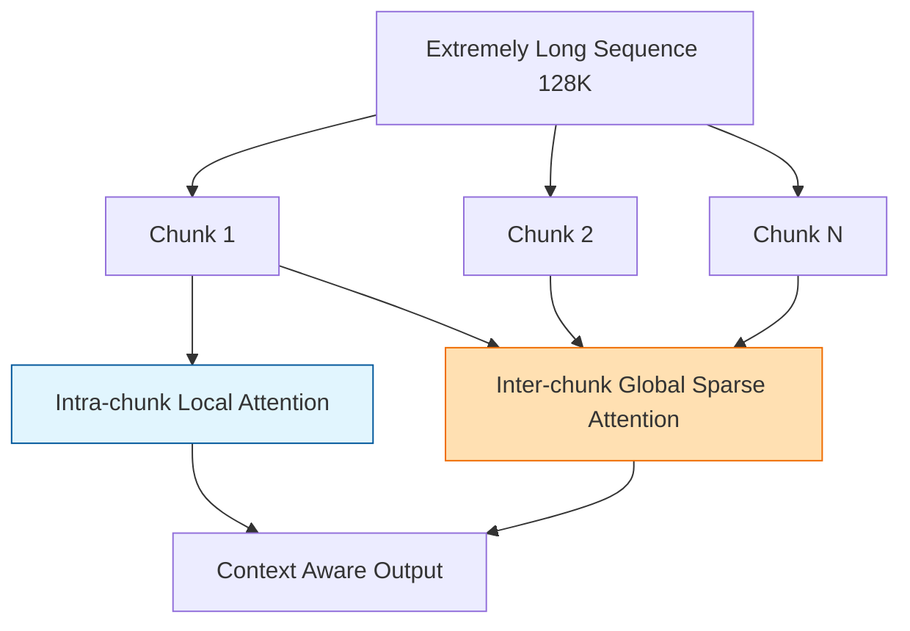

# Qwen2 核心技术专题索引

>  **[返回 14.2-Qwen 家族总览](../../14.2-Qwen.md)**

Qwen2 是阿里通义千问路线从 Qwen1.5 走向更成熟“全尺寸矩阵产品线”的关键版本。它不是用单一超大模型去冲极限，而是同时构建 0.5B 到 72B 的完整稠密模型序列，再辅以 57B-A14B 的 MoE 变体。

## 1. 技术问题定义与背景 (Technical Problem Definition)

Qwen2 解决的核心问题是**“如何构建一整套在中文、多语言、代码、数学和多尺寸部署场景中都可用的通用模型族”**。这背后的技术挑战包括：

1. **多语言与中文压缩效率**：如何在不大幅增加词表参数量的前提下，兼顾中文、拉丁语系、以及低资源小语种的编码效率。
2. **渐进式长上下文(Progressive Context Extension)**：原生用 128K 预训练成本极高，如何通过工程手段用最小的算力代价将 32K 模型外推至 128K。
3. **MoE 的冷启动与稳定性**：如何避免从零训练 MoE 的高昂试错成本(Qwen2 引入了 Upcycling)。
4. **高质量数据合成**：打破“人工标注对齐”的瓶颈，实现自动化指令合成流水线。

## 2. 方法论拆解 (Method Breakdown)

### 2.1 Tie Word Embeddings 机制

与许多模型将输入词嵌入层和输出预测层分离开来不同，Qwen2(特别是小尺寸版本)选择将 **Input Embedding** 和 **Output Projection** 的权重矩阵绑定(Weight Tying)。

这带来了明显的优势：
- 大幅缩减了词表庞大时的参数占用，使得 0.5B 和 1.5B 这种端侧模型能够装下 150K 大词表。
- 增强了词向量表示在输入输出两端的对称性。

### 2.2 DCA (Dual Chunk Attention) 与 YARN

为了解决长上下文，Qwen2 在自注意力机制中结合了 DCA。它将长序列划分为内部块(Intra-chunk)和跨块(Inter-chunk)，对不同距离的 Token 应用不同的注意力缩放。

### 2.3 Upcycling MoE 初始化策略

Qwen2-57B-A14B MoE 并没有从头开始随机初始化训练。它采用了 **Upcycling (向上循环)** 的策略：
1. 选取一个训练良好的 Dense 模型(例如 Qwen-14B)。
2. 将其 FFN 层复制多份，作为 MoE 专家的初始权重。
3. 添加 Router 门控网络。
4. 继续在此基础上进行混合专家预训练。
这极大减少了早期的训练震荡，并继承了 Dense 模型的“世界知识”。

## 3. 工程实现与污染控制 (Engineering Analysis)

1. **自动合成对齐数据**：
   Qwen2 使用强大的基座模型，配合“拒绝采样 (Rejection Sampling)”和“反向翻译”，自动化生成了包含数百万条的高质量指令和思维链(CoT)数据集，极大降低了对人类标注(RLHF)的依赖。
2. **系统性数据去污染 (De-contamination)**：
   为保证评测公正性，Qwen2 建立了一套严苛的 `n-gram + LCS (最长公共子序列)` 双层过滤系统，从预训练语料中剔除可能命中公开测试集(如 MMLU, GSM8K)的样本。

## 4. 边界与局限性说明 (Boundary Explanations)

- **MoE 的知识天花板**：虽然 Upcycling 节省了成本，但也导致 Qwen2 的 MoE 版本在知识密集型任务上未能超越同规模的纯 Dense 版本(如 72B)，MoE 的性能增益更多体现在推理成本上。
- **长文本的内部脆弱性**：DCA 等拼接外推技术虽然让模型能“读完” 128K，但在处理需要多文档交叉推理的复杂长文本任务时，仍有几率出现信息串扰。
- **与 Qwen2.5 的断代**：Qwen2 在 RL (强化学习) 对齐上停留在 DPO/KTO 阶段，未能引入纯在线 RL，这也促成了数月后迅速发布 Qwen2.5 的决策。

---

## 5. 文档导航

| 文档 | 说明 |
| :--- | :--- |
| [01-Qwen2 技术报告精译](./01-Qwen2技术报告精译.md) | 技术报告主稿精译与整体脉络 |
| [02-Qwen2 核心架构剖析](./02-Qwen2核心架构剖析.md) | tokenizer、GQA、DCA、MoE 与配置矩阵解析 |
| [05-Qwen2 Architecture Overview](./05-Qwen2-Architecture-Overview.md) | 从家族演进视角看 Qwen2 的技术定位 |
| [05-Qwen2 Training System](./05-Qwen2-Training-System.md) | 预训练、后训练和污染控制的工程拆解 |
| [03-Qwen2 MinerU-EN](./03-Qwen2-mineru-en.md) | 英文整理稿 |
| [04-Qwen2 MinerU-ZH](./04-Qwen2-mineru-zh.md) | 中文交付稿 |
