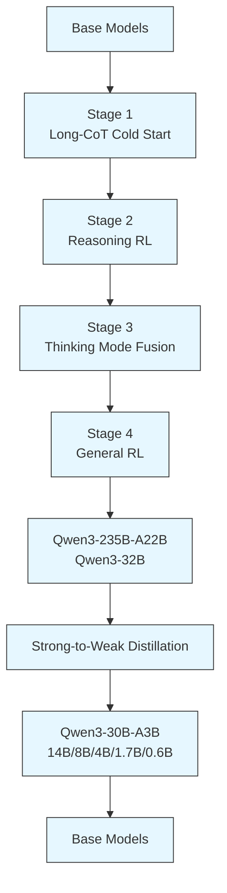

flowchart

```mermaid
graph TD
    A["Base Models"] --> B["Stage 1<br>Long-CoT Cold Start"]
    B --> C["Stage 2<br>Reasoning RL"]
    C --> D["Stage 3<br>Thinking Mode Fusion"]
    D --> E["Stage 4<br>General RL"]
    E --> F["Qwen3-235B-A22B<br>Qwen3-32B"]
    F --> G["Strong-to-Weak Distillation"]
    G --> H["Qwen3-30B-A3B<br>14B/8B/4B/1.7B/0.6B"]
    H --> I["Base Models"]
    style A fill:#e6f7ff,stroke:#333
    style B fill:#e6f7ff,stroke:#333
    style C fill:#e6f7ff,stroke:#333
    style D fill:#e6f7ff,stroke:#333
    style E fill:#e6f7ff,stroke:#333
    style F fill:#e6f7ff,stroke:#333
    style G fill:#e6f7ff,stroke:#333
    style H fill:#e6f7ff,stroke:#333
    style I fill:#e6f7ff,stroke:#333
```

