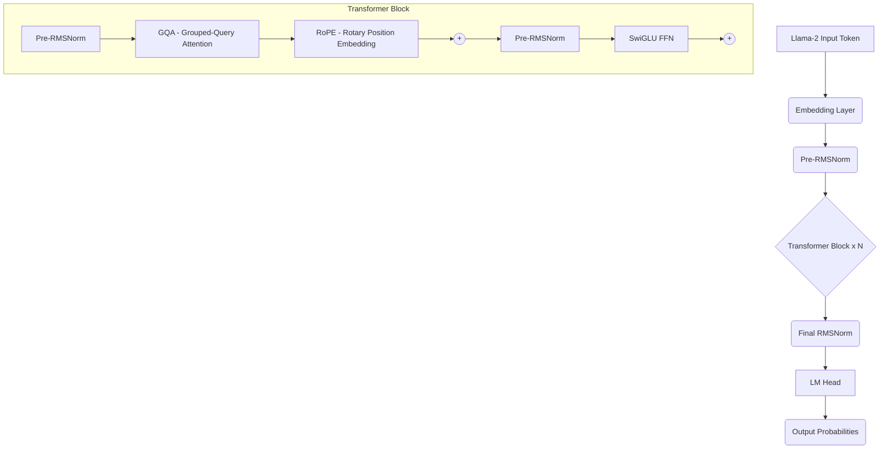
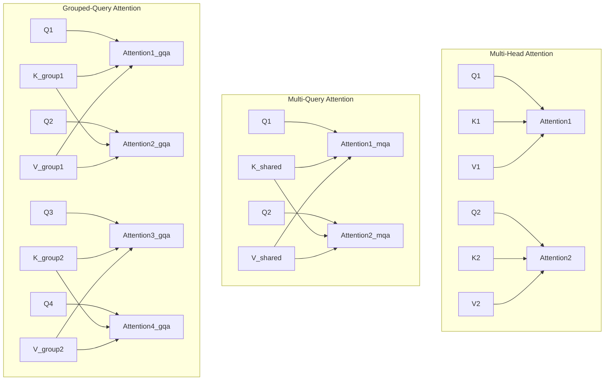

# Llama-2 核心架构剖析

>  **[返回 14.3-LLaMA 家族总览](../../14.3-LLaMA.md)**

本文档针对 Llama-2 的核心架构设计进行深度剖析，重点覆盖 Tokenizer 原理、分组查询注意力(Grouped-Query Attention, GQA)、均方根归一化(RMSNorm)、以及用于对齐的强化学习人类反馈(RLHF)接口设计等关键技术点。Llama-2 在 Llama-1 的基础上进行了多项改进，以适应更长上下文和更高的推理效率。

---

## 1. 设计动机与核心架构洞察

Llama-2 的整体架构主要沿用了主流的仅解码器(Decoder-only)Transformer 结构，但 Meta 团队在此基础上做出了几项至关重要的微调，从而在不显著增加参数量的前提下，大幅提升了模型的性能、上下文窗口(从 2048 翻倍至 4096)以及推理吞吐量。

核心设计洞察包括：
- **推理内存瓶颈**：随着序列长度和模型尺寸的增加，自回归解码时的 KV Cache 成为最大的显存与内存带宽瓶颈。传统的 Multi-Head Attention (MHA) 在推理阶段面临严重的 memory-bound 问题。
- **归一化开销**：传统 LayerNorm 需要计算均值，这一操作不仅带来了额外的计算开销，也需要在硬件层面进行更多的状态同步。
- **对齐与多轮对话控制**：为了打造安全且实用的 Llama-2-Chat，必须设计一套鲁棒的系统级 Prompt 接口，并引入 Ghost Attention (GAtt) 机制以解决多轮对话中模型"遗忘"初始设定的问题。



---

## 2. Tokenizer 机制深度解析

Llama-2 延用了基于字节对编码(Byte-Pair Encoding, BPE)的 SentencePiece 分词器。分词器的质量直接决定了模型对未见词汇(OOV)、多语言代码、数字和特殊字符的泛化能力。

### 2.1 BPE 与分词策略

BPE 的核心思想是从字符级(或字节级)开始，迭代合并语料库中出现频率最高的相邻符号对，直到达到预设的词表大小(Llama-2 词表大小为 32,000)。相较于 WordPiece，BPE 在合并时不考虑生成概率，只关注频率。

Llama-2 分词器的几个关键特性：
1. **Fallback to Bytes**：当遇到未在词表中的罕见字符或特殊符号时，模型不会将其转换为单一的 `<UNK>` token，而是将其拆解为 UTF-8 的底层字节。这使得模型理论上能够处理任何语言，即便该语言在预训练语料中占比极小。
2. **数字拆解(Split Digits)**：所有的数字通常会被拆分成单个数字(例如 `2023` -> `2`, `0`, `2`, `3`)。这对于数学计算和推理至关重要，防止了诸如 `123` 和 `12` 被映射到毫无关联的嵌入向量。
3. **前缀空格保留**：SentencePiece 会将前缀空格视为特殊的下划线符号 `_` (U+2581)。

### 2.2 Tokenizer 代码探究

在使用 HuggingFace 的 `transformers` 库加载 Llama-2 Tokenizer 时，我们可以看到其特殊 token 的定义：

```python
from transformers import LlamaTokenizer

tokenizer = LlamaTokenizer.from_pretrained("meta-llama/Llama-2-7b-hf")
print(f"Vocab size: {tokenizer.vocab_size}") # 32000
print(f"BOS Token: {tokenizer.bos_token} (ID: {tokenizer.bos_token_id})") # <s>
print(f"EOS Token: {tokenizer.eos_token} (ID: {tokenizer.eos_token_id})") # </s>
print(f"UNK Token: {tokenizer.unk_token} (ID: {tokenizer.unk_token_id})") # <unk>
```

---

## 3. GQA: Grouped-Query Attention

GQA(分组查询注意力)是 Llama-2(特别是 34B 和 70B 模型)中最为重要的架构升级之一。为了加速推理并减少显存占用，GQA 在标准的多头注意力(MHA)和多查询注意力(MQA)之间取得了完美的平衡。

### 3.1 动机与痛点

在自回归解码(Generation)阶段，每生成一个新 token，模型都需要访问之前所有 token 的 Key (K) 和 Value (V)。为了避免重复计算，这部分数据会被缓存下来，即 **KV Cache**。
- **MHA 瓶颈**：在 MHA 中，如果模型有 $H$ 个 Query 头，也会有 $H$ 个 Key 头和 $H$ 个 Value 头。对于大模型(长上下文)，KV Cache 的大小会以 GB 为单位增长，导致严重的内存带宽受限(Memory Bandwidth Bound)。
- **MQA 缺陷**：MQA 让所有 $H$ 个 Query 头共享**1个** Key 头和 1个 Value 头。虽然极大地缩小了 KV Cache，但牺牲了模型的表达能力和性能，导致质量下降。

### 3.2 GQA 原理推导

GQA 将 $H$ 个 Query 头划分为 $G$ 个组，每组共享 1 个 Key 头和 1 个 Value 头。
设注意力头数为 $H$，组数为 $G$，则每组包含 $\frac{H}{G}$ 个 Query 头。

在数学上，注意力计算如下(忽略缩放因子)：

对于第 $g$ 组($1 \le g \le G$)中的第 $h$ 个 Query 头($1 \le h \le \frac{H}{G}$)：
$$
Q_{g, h} \in \mathbb{R}^{L \times d}
$$
整个第 $g$ 组共享一对 $K_g, V_g$：
$$
K_g, V_g \in \mathbb{R}^{L \times d}
$$

注意力输出 $O_{g, h}$ 的计算公式为：
$$
\text{Attention}(Q_{g,h}, K_g, V_g) = \text{Softmax}\left(\frac{Q_{g,h} K_g^T}{\sqrt{d}}\right) V_g
$$

- 当 $G = H$ 时，GQA 等价于 MHA。
- 当 $G = 1$ 时，GQA 等价于 MQA。
- Llama-2 的超大杯通常选择 $G=8$(即 8 个 KV 头)，以不到 MHA 1/8 的显存开销，达到了极度接近 MHA 的性能。

### 3.3 架构对比图解



### 3.4 GQA 的 PyTorch 伪代码实现

```python
import torch
import torch.nn as nn

class GroupedQueryAttention(nn.Module):
    def __init__(self, d_model, num_heads, num_kv_groups):
        super().__init__()
        self.num_heads = num_heads
        self.num_kv_groups = num_kv_groups
        self.head_dim = d_model // num_heads
        
        self.q_proj = nn.Linear(d_model, num_heads * self.head_dim)
        # K 和 V 的投影维度由 num_kv_groups 决定，而非 num_heads
        self.k_proj = nn.Linear(d_model, num_kv_groups * self.head_dim)
        self.v_proj = nn.Linear(d_model, num_kv_groups * self.head_dim)
        self.o_proj = nn.Linear(num_heads * self.head_dim, d_model)

    def forward(self, x):
        B, L, D = x.shape
        
        # [B, L, num_heads, head_dim]
        q = self.q_proj(x).view(B, L, self.num_heads, self.head_dim)
        # [B, L, num_kv_groups, head_dim]
        k = self.k_proj(x).view(B, L, self.num_kv_groups, self.head_dim)
        v = self.v_proj(x).view(B, L, self.num_kv_groups, self.head_dim)
        
        # 扩展 K 和 V 以匹配 Query 头数
        # repeat_interleave 会将类似 [K1, K2] 变为 [K1, K1, K1..., K2, K2, K2...]
        num_repeats = self.num_heads // self.num_kv_groups
        k = torch.repeat_interleave(k, repeats=num_repeats, dim=2)
        v = torch.repeat_interleave(v, repeats=num_repeats, dim=2)
        
        # 转置以便于矩阵乘法 [B, num_heads, L, head_dim]
        q = q.transpose(1, 2)
        k = k.transpose(1, 2)
        v = v.transpose(1, 2)
        
        # 注意力计算
        scores = torch.matmul(q, k.transpose(-2, -1)) / (self.head_dim ** 0.5)
        attn = torch.softmax(scores, dim=-1)
        out = torch.matmul(attn, v)
        
        # 合并多头
        out = out.transpose(1, 2).contiguous().view(B, L, -1)
        return self.o_proj(out)
```

---

## 4. RMSNorm：均方根归一化

为了提高训练的稳定性和计算效率，Llama-2 继续使用了 Pre-Normalization 架构，并选用了 **RMSNorm**(Root Mean Square Normalization)替代标准的 LayerNorm。

### 4.1 LayerNorm 与 RMSNorm 的数学对比

标准的 LayerNorm 会对输入 $x$ 计算均值 $\mu$ 和方差 $\sigma^2$：
$$
\mu = \frac{1}{d} \sum_{i=1}^{d} x_i, \quad \sigma^2 = \frac{1}{d} \sum_{i=1}^{d} (x_i - \mu)^2
$$
$$
y = \gamma \frac{x - \mu}{\sqrt{\sigma^2 + \epsilon}} + \beta
$$

而 RMSNorm 认为，**均值的平移不重要，仅仅通过尺度(Scale)的缩放即可带来训练稳定性**。因此，它去掉了减去均值的步骤：
$$
\text{RMS}(x) = \sqrt{\frac{1}{d} \sum_{i=1}^{d} x_i^2}
$$
$$
y = \gamma \frac{x}{\text{RMS}(x) + \epsilon}
$$
由于无需计算均值 $\mu$，RMSNorm 在前向传播和反向传播中都节约了约 10% - 20% 的计算量。此外，RMSNorm 只有一个可学习参数(增益参数 $\gamma$)，没有偏置 $\beta$。

### 4.2 高精度实现细节

由于在大模型训练中 $x^2$ 可能会产生溢出或精度损失，Llama-2 的实现要求 RMSNorm 在计算缩放因子时必须使用 `float32` 精度，即使输入数据是 `float16` 或 `bfloat16`。

```python
class RMSNorm(nn.Module):
    def __init__(self, dim: int, eps: float = 1e-6):
        super().__init__()
        self.eps = eps
        # 唯一的可学习增益参数 gamma
        self.weight = nn.Parameter(torch.ones(dim))

    def _norm(self, x):
        # 必须显式提升精度计算以防溢出
        return x * torch.rsqrt(x.pow(2).mean(-1, keepdim=True) + self.eps)

    def forward(self, x):
        # 1. 提升至 float32 计算 norm
        output = self._norm(x.float()).type_as(x)
        # 2. 乘以可学习参数
        return output * self.weight
```

---

## 5. RLHF 与 Ghost Attention 接口设计

Llama-2 最引人注目的突破在于其 Chat 模型通过 RLHF (Reinforcement Learning from Human Feedback) 展现出的卓越对齐能力。为了处理多轮对话的上下文约束，Meta 引入了 Ghost Attention (GAtt)。

### 5.1 RLHF 奖励模型与 PPO

Llama-2 收集了海量的人类偏好数据，并训练了两个独立的奖励模型 (Reward Model)：
1. **Helpfulness RM**：评估回答的有用性。
2. **Safety RM**：评估回答的安全性(避免仇恨、暴力等)。

通过两个分离的模型，可以在 PPO (Proximal Policy Optimization) 强化学习阶段，灵活调节安全性和有用性的权重，从而打破传统的"安全惩罚导致模型变傻"(Alignment Tax)困局。

### 5.2 Llama-2 Chat 提示词格式 (Prompt Format)

Llama-2-Chat 有着极其严格的控制接口，特殊的控制符被用于分隔系统指令(System Prompt)和用户对话(User Input)：

```text
<s>[INST] <<SYS>>
You are a helpful, respectful and honest assistant.
<</SYS>>

Hi, how are you? [/INST] I am fine, thank you! </s><s>[INST] Can you write a poem? [/INST]
```
- `<s>`: BOS token，表示对话开始。
- `[INST]` 与 `[/INST]`：包裹用户的话语与指令。
- `<<SYS>>` 与 `<</SYS>>`：包裹核心系统提示词(System Prompt)。

如果模型在推理时没有严格按照该格式注入输入，性能将会呈现断崖式下跌。

### 5.3 Ghost Attention (GAtt) 机制

在长对话中，模型经常会"遗忘"最初设置的 System Prompt(例如："你必须全程用法语回答")。以往的做法是在每轮对话前面都加上这段系统指令，但这会导致冗余并耗尽上下文。

**GAtt 训练方法：**
1. **指令拼凑(Context Injection)**：在 SFT(监督微调)阶段，对于长对话，Meta 通过编程手段，人为地在每一轮 user 语句后拼接上 System Prompt。
2. **Ghosting**：但是在计算损失函数(Loss)时，不仅不计算 User prompt 的 loss(常规做法)，还要把那些后期手动拼接的 System Prompt 对应的 token 标记为 Loss 屏蔽(Masking them out)，使模型隐式地在注意力分布中将系统约束泛化到后面的轮数，如同"幽灵"一般存在于注意力权重中。

通过 GAtt，Llama-2-Chat 可以在多轮对话后依然牢记角色的语气和指令约束。

---

## 6. 与同类技术的综合对比

| 架构特性 | Llama-2 7B / 13B | Llama-2 70B | Llama 1 (全系列) | ChatGPT / GPT-4 (推测) |
| :--- | :--- | :--- | :--- | :--- |
| **位置编码** | RoPE | RoPE | RoPE | 可能为 RoPE 或 ALiBi |
| **注意力架构** | MHA | **GQA** (Group=8) | MHA | MQA / GQA 混合 |
| **归一化** | RMSNorm | RMSNorm | RMSNorm | LayerNorm / RMSNorm |
| **激活函数** | SwiGLU | SwiGLU | SwiGLU | GeGLU / SwiGLU |
| **上下文窗口** | 4096 | 4096 | 2048 | 8K - 128K |
| **对齐策略** | PPO + GAtt | PPO + GAtt | 无 | PPO / DPO |

---

## 7. 局限性与改进空间

尽管 Llama-2 是一代里程碑，但在实际工程应用中，依然暴露出了一些局限：
1. **上下文依然不够长**：虽然相比 Llama-1 提升至 4096，但在处理长文档分析、RAG(检索增强生成)场景下依然捉襟见肘。社区后续通过 NTK-aware RoPE Scaling 将其外推至 16K-32K。
2. **多语言支持薄弱**：预训练语料中超过 89% 都是英文，导致 Llama-2 在中文、日文等语言上表现不佳，常常需要在下游进行二次预训练(如 Chinese-Llama 方案)。
3. **安全对齐过度(Over-safety)**：Llama-2 的 Safety Reward Model 惩罚权重较高，导致模型容易因为过于保守而拒绝回答中性问题。

## 8. 知识库同步与参考文献

- 同步位置：`docs/sections/llm-guide/14.3-LLaMA/02-Llama-2/`
- 参考来源：[Llama 2: Open Foundation and Fine-Tuned Chat Models (Touvron et al., 2023)](https://arxiv.org/abs/2307.09288)

---
*编者注：在研读 Llama-2 的架构时，请特别关注 GQA 与 RoPE 结合的代码逻辑，这是当今主流开源大模型最通用的设计范式。*
