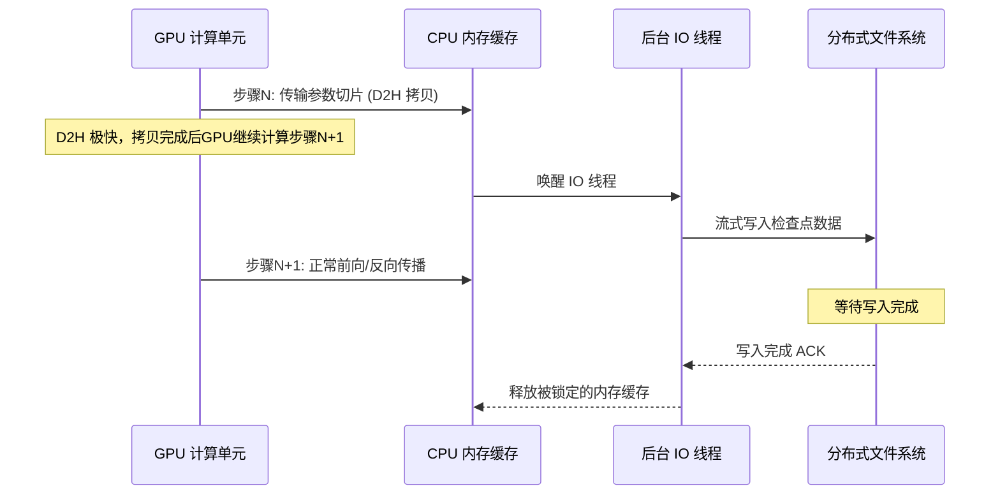

# Llama-3 集群失效分析精读

> 🔙 **[返回 14.3-LLaMA 家族总览](../../14.3-LLaMA.md)**

> 本文档基于 Llama-3 技术报告中关于 16K H100 集群训练稳定性的核心段落进行深度剖析。Llama 3 的训练首次将开源模型的基础设施推向了万卡级别(16,384张 H100 GPUs)。在这种规模下，“硬件故障不再是概率事件，而是日常发生的常态”。本文将从集群失效的统计特征、故障预测、自动容错机制、网络拥塞控制以及无缝重启等方面进行硬核解读，帮助工程师理解万卡集群训练背后的真实工程挑战。

## 1 万卡集群训练的工程痛点与核心洞察

### 1.1 规模诅咒：为什么万卡集群必然“失效”？

在大规模分布式系统中，组件失效的概率随着组件数量的增加而呈指数级增长。传统的深度学习训练往往依赖于少数节点的极高稳定性，但在 Llama 3 这样需要连续数月运行的超大规模(16K H100)训练任务中，单点故障的累积效应会直接摧毁整个训练进度。

假设单个 GPU 及其配套组件(内存、网卡、电源等)在一天内无故障运行的概率为 $p = 99.99\%$，那么在 16,384 个节点组成的集群中，整个集群在一天内无故障运行的概率将骤降至：
$$ P_{cluster} = p^N = (0.9999)^{16384} \approx 19.4\% $$

这意味着，即便单个硬件极其可靠，**集群每天也至少有 80% 的概率会遇到至少一次导致训练中断的硬件故障**。在 Llama 3 的长达 54 天的有效训练周期中，累计发生了超过 400 次意外中断。因此，工程痛点已经从**“如何购买不坏的硬件”**转移到了**“如何在硬件天天坏的情况下保证训练的高效进行”**。

### 1.2 核心洞察：从“避免故障”到“拥抱故障”

Meta 的工程团队在 Llama 3 的训练中做出了一个关键范式转变：**设计目标不再是消灭故障，而是最小化故障恢复时间和减少人工干预。**

核心 Insight 包含三个方面：
1. **故障隔离(Fault Isolation)必须是自动化的**：依赖人工定位故障节点在万卡规模下是不切实际的，必须有监控进程能够在秒级识别并隔离故障节点。
2. **状态保存(State Persistence)必须是异步和增量的**：传统的同步 Checkpoint 耗时过长，严重拉低 GPU 利用率。
3. **网络拓扑(Network Topology)必须具备自愈能力**：交换机重启或光模块损坏不应导致整个训练环路的瘫痪。

---

## 2 硬件与环境失效统计模型

### 2.1 失效类型分布

根据 Llama 3 技术报告，导致训练中断的原因大致可分为以下几类，通过统计我们可以明显看出 GPU 显存故障和网络链路故障占据了主导地位。

| 故障类别 | 发生频率 | 典型症状 | 平均恢复时间 (MTTR) | 占比分析 |
| :--- | :--- | :--- | :--- | :--- |
| **GPU HBM 失效** | 高 | ECC 错误、CUDA 内存越界、OOM | ~30 分钟 | ~45% |
| **NVLink/NVSwitch 故障** | 中-高 | NCCL Timeout、集体通信卡死 | ~45 分钟 | ~25% |
| **RDMA 网络组件故障** | 中 | 交换机丢包率激增、光模块过热损坏 | ~1-2 小时 | ~15% |
| **主机资源耗尽** | 低 | CPU OOM、文件系统挂载失败 | ~15 分钟 | ~10% |
| **机房基础设施故障** | 极低 | 冷却液泄漏、电源模块(PSU)宕机 | ~4 小时以上 | ~5% |

> [!NOTE]
> Llama 3 的训练集群经历了多次突发的机房级事件(例如环境温度过高导致部分机架自动降频)，这类事件虽然发生频率低，但影响面极广。

### 2.2 故障率模型(MTBF 计算与推导)

平均无故障时间(Mean Time Between Failures, MTBF)是衡量集群可靠性的核心指标。对于万卡集群，我们可以使用如下泊松分布模型来近似推导：

假设单个节点故障率为 $\lambda_i$，系统总故障率 $\lambda_{sys} = \sum_{i=1}^{N} \lambda_i$。
则整个集群的 MTBF 为：
$$ \text{MTBF}_{cluster} = \frac{1}{\lambda_{sys}} = \frac{\text{MTBF}_{node}}{N} $$

如果目标是将有效训练时间(Goodput)维持在 90% 以上，我们需要满足：
$$ \text{Goodput} = \frac{\text{MTBF}}{\text{MTBF} + \text{MTTR}} \ge 0.90 $$

对于 Llama 3，由于 $N=16384$，导致 $\text{MTBF}_{cluster}$ 极短(通常在几个小时左右)。如果按照传统的同步 Checkpoint 机制，每次保存需要 10 分钟，恢复需要 15 分钟，那么总的 $\text{MTTR}$ 就会达到 25 分钟，Goodput 将惨不忍睹。这从理论上证明了必须采用**亚秒级故障检测**与**异步检查点技术**。

---

## 3 自动化容错与弹性调度架构

为了应对频繁的故障，Llama 3 采用了一套高度自动化的调度和容错框架。

### 3.1 故障检测与隔离机制

系统通过多级心跳和硬件计数器(Hardware Counters)来实现故障的早期预警和精准定位。

```mermaid
graph TD
    A[监控 Agent <br/>(运行于各节点)] -->|心跳与日志| B(集群控制平面<br/>Control Plane)
    A -->|ECC错误/温度异常| C{本地故障判定}
    C -->|触发阈值| D[节点标记为 Tainted]
    C -->|未触发| A
    B -->|收不到心跳 > 5s| D
    D --> E[排干节点任务<br/>Cordon & Drain]
    E --> F[触发全局弹性调度]
    F --> G[新分配节点接管 Rank]
    G --> H[从最新的 Checkpoint 恢复]
```

**关键技术点：**
- **NCCL Watchdog**：Llama 3 训练任务中嵌套了一个轻量级的 NCCL 监控器。一旦任何一个 NCCL API 调用超过 30 秒没有返回，Watchdog 就会直接抛出 `TimeoutError` 并触发 core dump，避免全集群无限期挂起(Hang)。
- **自动化预热测试 (Pre-flight Checks)**：在节点被重新加入调度池之前，必须通过一系列密集的矩阵乘法(GEMM)压力测试和 All-Reduce 带宽测试。

### 3.2 PyTorch FSDP 容错设计代码示例

Llama 3 主要使用了 FSDP(Fully Sharded Data Parallel)架构。为了支持快速恢复，模型状态的切片必须在集群缩扩容时保持一致性。

```python
import torch
import torch.distributed as dist
from torch.distributed.fsdp import FullyShardedDataParallel as FSDP
from torch.distributed.fsdp import StateDictType, FullStateDictConfig
import threading

def save_resilient_checkpoint(model: FSDP, optimizer, step: int, save_dir: str):
    """
    异步分布式检查点保存策略 (概念演示)
    这避免了将16K个GPU上的权重先聚合成完整的模型再保存，而是各个rank独立保存其分片。
    """
    # 配置使用本地分片策略保存，避免全局聚合的通信开销
    fsdp_state_dict_type = StateDictType.LOCAL_STATE_DICT
    dist.barrier() # 确保所有进程到达保存点
    
    with FSDP.state_dict_type(model, fsdp_state_dict_type):
        local_state = model.state_dict()
        local_optim_state = FSDP.optim_state_dict(model, optimizer)
        
    # 异步写入分布式文件系统 (例如 Tectonic)
    checkpoint_file = f"{save_dir}/step_{step}_rank_{dist.get_rank()}.pt"
    
    # 生产环境中，此处会开启后台IO线程或专用进程，不阻塞主计算流
    async_io_thread = threading.Thread(
        target=torch.save, 
        args=({"model": local_state, "optim": local_optim_state}, checkpoint_file)
    )
    async_io_thread.start()
    
    # 不等待 IO 完成，立即返回继续训练
    return async_io_thread
```

> [!TIP]
> 上述代码展示了局部状态保存(Local State Dict)的核心思想。在万卡级别，绝对不能使用 `FULL_STATE_DICT`，因为仅仅是聚合数千亿参数的网络通信就会导致超时或显存直接爆炸。

---

## 4 网络拥塞与通信异常处理

Llama 3 集群使用了 400Gbps 的 RoCEv2 (RDMA over Converged Ethernet) 网络。与纯 NVLink 机箱内的通信不同，跨机架的以太网通信面临严重的丢包和微突发(Micro-bursts)问题。

### 4.1 RoCEv2 集群的拥塞控制 (DCQCN 调优)

在 All-Reduce 操作的 Reduce-Scatter 阶段，多个节点的流量会向同一个目标节点瞬间汇聚(Incast 现象)。为了解决这个问题，Llama 3 团队深度调优了 DCQCN(Data Center Quantized Congestion Notification)算法。

**数学原理：PFC 与 ECN 的协同**
交换机队列长度 $Q(t)$ 如果超过阈值 $K_{min}$，会以概率 $p$ 标记 ECN(显式拥塞通知)。发送端收到带有 ECN 标记的 ACK 后，会迅速降低发送速率 $R$：
$$ R_{new} = R_{current} \times \left(1 - \frac{\alpha}{2}\right) $$
其中 $\alpha$ 随拥塞程度动态调整。

如果 ECN 响应不够快，队列堆积达到 $K_{max}$，将触发 PFC(优先级流量控制)，发送 Pause 帧强制上游暂停发送。在 Llama 3 集群中，大量调优的重点在于**尽量避免触发 PFC**，因为大范围的 PFC 会导致“拥塞树”(Congestion Tree)扩散，甚至引发死锁。

### 4.2 动态路由与拓扑感知

由于每天都有网络交换机或链路故障，静态路由在 16K 规模下完全不可行。

1. **自动封锁劣质链路**：通过监控网卡的错误计数器(如 `rx_crc_errors`，`rx_discards`)，一旦发现某条链路丢包率超过 $10^{-6}$，即便链路未断，也会被 BGP 路由协议自动打上极高成本(Cost)，迫使流量切换到备用路径。
2. **拓扑感知调度 (Topology-Aware Scheduling)**：如果必须重启某几台机器，调度器会优先从同一个 Spine 交换机下的空闲节点中替补，以尽量保持通信环路在网络拓扑上的局部性，减少跨核心交换机的跳数。

---

## 5 Llama-3 的检查点 (Checkpoint) 系统设计

如何在大约 1 分钟内保存数百 TB 的模型状态和优化器状态？这直接决定了发生故障时的沉没成本与有效训练时间占比。

### 5.1 分层存储架构 (Tiered Storage)

Llama 3 采用了多级 Checkpoint 策略：
- **Level 1 (内存/NVMe 级)**：每 10-20 步执行一次。状态不写入远端存储，而是保留在主机的内存或本地 NVMe SSD 中。如果某个 GPU 崩溃(OOM 或内核错误)，同机的其他进程或热备节点可以迅速从内存中拉起它的状态。(应对纯软件崩溃或单 GPU 故障的场景)。
- **Level 2 (分布式闪存级)**：每隔几百步执行一次。通过专用 RDMA 网络高速写入到基于全闪存阵列的分布式文件系统中。主要应对节点整机损坏或断电。
- **Level 3 (冷存储级)**：每天执行一次。将重要节点的 Checkpoint 归档到基于 HDD 的对象存储中，用于防止灾难性的大面积数据丢失，或作为基座模型发布前的重要检查点。

### 5.2 异步 Checkpoint 时序图



通过这一机制，主训练循环的阻塞时间被严格压缩到了几十毫秒(仅限于 D2H 内存拷贝的时间)，从而极大地提升了整体吞吐量。

---

## 6 与同类技术(GPT-4/Gemini集群)对比

在公开技术报告中，我们将 Llama-3 的基础设施设计与同级别的大模型集群进行对比分析，揭示出不同的技术哲学。

| 特性 / 架构 | Llama-3 (Meta) | Gemini (Google) | GPT-4 (OpenAI/Azure, 推测) |
| :--- | :--- | :--- | :--- |
| **底层硬件架构** | 16,384 x H100 | TPU v4 / v5p 拓扑 | 10,000+ A100/H100 |
| **网络层设计** | RoCEv2 (以太网) | OCS (光路交换) + 专有网络 | InfiniBand (IB) |
| **容错粒度** | 节点级，极度依赖软件自愈 | TPU Pod 级，硬件重路由 | 容器/虚拟机级 |
| **存储后端** | Tectonic 分布式文件系统 | Colossus / GCS | Azure Blob Storage |
| **网络拥塞处理** | 深度调优的软件侧 DCQCN | OCS 动态切换拓扑结构 | IB SHARP 硬件级聚合 |
| **核心优势** | 全栈开源技术改造，极致性价比 | 硬件级光互连，极低延迟 | 成熟商业云方案，基础设施深厚 |

> [!WARNING]
> 与 Google TPU 依赖光路交换(OCS)在物理层面上瞬间实现拓扑重构不同，Meta 的方案建立在标准以太网之上，严重依赖 RoCEv2 的拥塞控制和 PyTorch 等软件层的容错。这意味着 Llama 3 方案对上层软件工程师的分布式排错和调优能力要求极高。

---

## 7 局限性与未来演进

### 7.1 当前架构的前提假设和失效场景
1. **“网络分区”灾难 (Network Partition)**：如果核心交换机组发生大规模意外掉电，导致整个集群被物理隔离成多个互不相通的子网，目前的弹性调度系统可能会陷入“脑裂”(Split-brain)，每个子网都认为对方已经下线，从而产生不可预知的资源竞争。
2. **异步 Checkpoint 的一致性风险**：在后台线程正在写入 Checkpoint 时如果发生主机断电，会导致部分节点写入成功，部分失败。虽然通过全局 Commit 机制可以检测到这种不一致，但仍需强制回退到更早的一个完整的 Checkpoint，从而浪费额外的算力。
3. **“带病工作”导致的静默数据损坏 (Silent Data Corruption)**：报告中特别提到了极少数情况下，GPU 会出现计算错误但完全不报错(例如矩阵乘法结果出现细微偏差)。这是目前硬件监控难以 100% 捕获的，往往只能依赖模型层面的 Loss 突然跳变(Spike)来反向推断并回滚。

### 7.2 未来演进方向
- **AI 驱动的故障预测**：通过收集海量的 `dmesg`、温度传感、风扇转速等日志，训练微型的日志语言模型(LogLLM)，提前在节点彻底挂掉前 30 分钟发出预警，并主动排干(Cordon)该节点。
- **更深度的软硬协同编排**：直接在智能网卡(Smart NIC)或 DPU 上卸载更多的通信协议处理和健康度检查工作，将宝贵的 CPU 资源从集群管理开销中解放出来，专注于数据加载。

---

## 8 总结

Llama 3 的万卡集群失效分析报告揭示了当今大语言模型训练中最真实、最硬核的工程底色。在算力规模决定智能涌现的今天，**集群的有效训练时间(Goodput)不再仅仅是一个衡量运维水平的指标，而是直接决定了模型研发迭代速度和最终成本的核心竞争力**。从“畏惧故障”到“基于故障常态化进行系统设计”，Meta 向业界展现了极其成熟、领先的大型分布式系统工程实践经验。

---

## 9 知识库同步与后续阅读

- **同步位置**: `docs/sections/llm-guide/14-主流开源模型全景解析与技术报告精读/14.3-LLaMA/03-Llama-3/03-Llama-3集群失效分析精读.md`
- **关联拓展模块**：深入了解其背后的分布式并行策略，请阅读 [LLM分布式训练基础架构解析](../../../distributed-training/index.md)。
