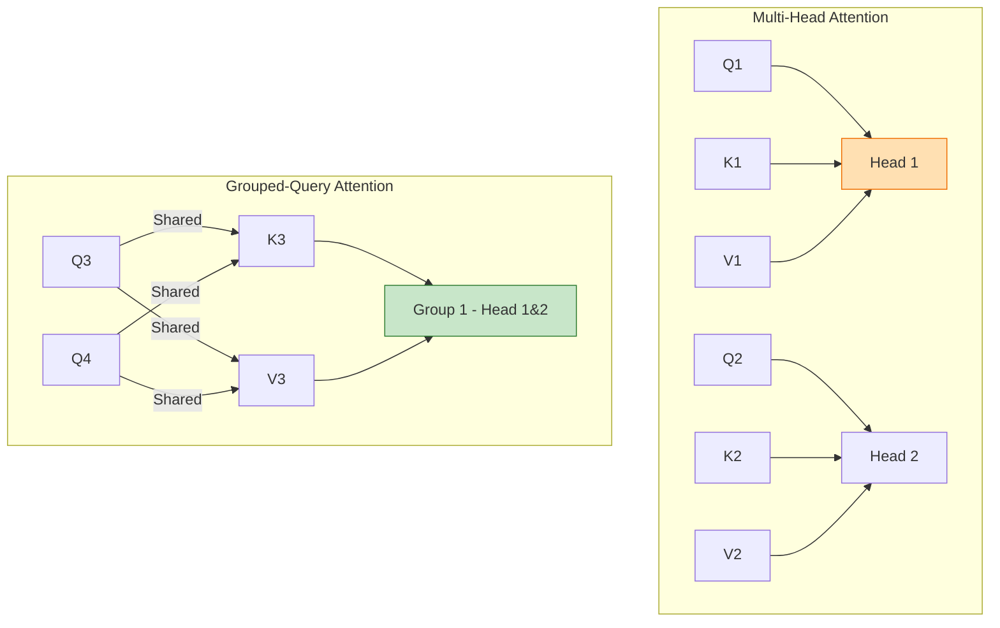

# Llama-3 核心技术专题索引

>  **[返回 14.3-LLaMA 家族总览](../../14.3-LLaMA.md)**

## 1. 技术问题定义与背景 (Technical Problem Definition)

Llama-3 是 Meta 推出的具有里程碑意义的开源基座大模型系列(包含 8B、70B 和 400B 级别)。与激进探索新架构(如 MoE 或状态空间模型)不同，Llama-3 的核心命题是：**在极其传统的标准 Transformer 架构下，通过将数据工程和扩展定律(Scaling Laws)推向极致，模型的上限到底能达到多高？**

面临的核心工程挑战：
1. **15T Tokens 的高质量数据处理**：如何构建高并发、去重、清洗的多模态(早期规划)与多语言数据流。
2. **训练稳定性与容错**：在 2.4 万张 GPU(H100集群)上进行 400B 模型的长程训练，如何对抗极高的硬件故障率。
3. **后训练对齐天花板**：从传统的 SFT+RLHF，迈向基于组偏好的 PPO 变体及高质量合成数据引导的自我对齐。

## 2. 方法论拆解 (Method Breakdown)

### 2.1 极致的数据工程(Data Engineering at Limit)

Llama-3 没有改变基础公式，但极大地改变了“数据配方”：
- **自适应数据退火(Data Annealing)**：在训练末期，使用极其高质量的数据集(如高分代码、高质量数学推导)对模型进行“退火”训练，以锐化特定领域的知识。
- **扩展的 Tokenizer (Tiktoken)**：将词表大小从 Llama-2 的 32K 扩展至 128K，大幅提升了对多语言和代码的压缩率(约 15% 效率提升)。

### 2.2 标准化架构与 GQA

架构上极为保守，完全基于标准 Decoder-only Transformer。唯一的显著改变是在所有尺寸(包括 8B)中全面引入了 **Grouped-Query Attention (GQA)**。

$$
 \text{Attention}(Q, K, V) = \text{softmax}\left(\frac{Q K^T}{\sqrt{d_k}}\right)V
$$
其中 $K, V$ 的头数减少为 $Q$ 的头数的 $1/G$。

### 2.3 RLHF 与基于偏好的拒绝采样 (Rejection Sampling)

Llama-3 在对齐阶段极度依赖**拒绝采样(Rejection Sampling, RS)**。
- 生成模型基于同一 Prompt 生成多个候选回答。
- 使用极强的 Reward Model 对候选打分，选取最优者构成 SFT 数据集。
- 再通过 PPO 进一步打磨策略，解决微小偏移问题。

## 3. 工程实现与硬件集群分析 (Engineering Analysis)

**集群故障与容错(Cluster Failure & Fault Tolerance)**是 Llama-3 报告中的重头戏。Meta 披露了在由 24,000 个 H100 构成的集群中遇到的硬件失效模式：
- **网络隔离与 HBM 故障** 是导致训练中断的最常见原因。
- Meta 采用了**异步检查点(Asynchronous Checkpointing)**和**NCCL 通信掩码**，将故障恢复时间压缩到了数分钟级别。
- **4D 并行策略**：结合了张量并行(TP=8)、流水线并行(PP=16)、数据并行(FSDP)和上下文序列并行(CP)。

## 4. 边界与局限性说明 (Boundary Explanations)

- **架构红利耗尽**：纯 Dense 架构在 400B 规模上的推理成本极其高昂。相比 MoE 架构(如 DeepSeek-V3 或 Mixtral)，Llama-3-400B 的算力性价比不再具备绝对优势。
- **上下文长度限制**：尽管后续发布了 128k 版本，但原生 Llama-3 训练时仅为 8k 上下文，其长文本能力的内在连贯性弱于原生使用极长上下文训练的模型。
- **多语言表现**：尽管词表扩展，但在小语种或低资源语言上，仍然存在严重的“英文思维翻译”现象，未达到原生的跨语言深度对齐。

---

## 5. 子文档列表

- [Llama-3核心架构剖析](./02-Llama-3核心架构剖析.md)
- [01-Llama-3 技术报告精译](./01-Llama-3技术报告精译.md)
- [05-Llama-3 架构总览](./05-Llama-3-Architecture-Overview.md)
- [05-Llama-3 集群失效分析](./05-Llama-3-Cluster-Failure-Analysis.md)
