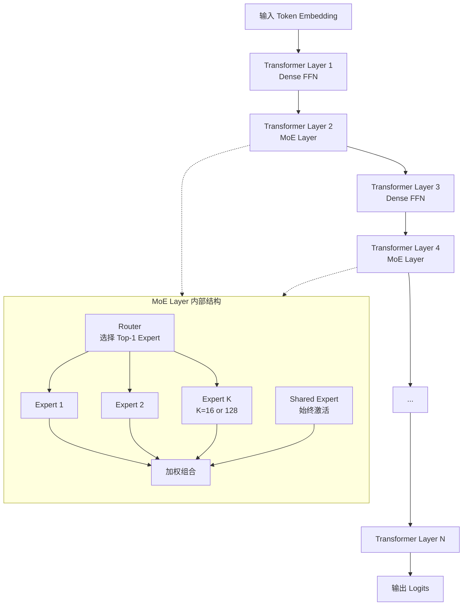
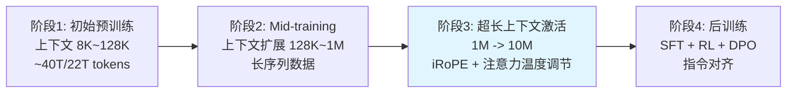

# Llama 4: 原生多模态 MoE 模型的技术解读

> 🔙 **[返回 14.3-LLaMA 家族总览](../../14.3-LLaMA.md)**


> 信息来源: Meta 官方 Model Card、GitHub 开源代码 (llama-models)、Meta AI 博客、以及社区公开资料。Llama 4 暂未发布正式 arXiv 技术报告,本文基于官方已公开的技术细节进行系统性梳理与解读。

---

## 摘要与核心亮点

Llama 4 是 Meta 于 2025 年 4 月发布的下一代开源大模型家族,标志着 Llama 生态进入「原生多模态 + Mixture-of-Experts (MoE)」的新纪元。与 Llama 3 的 Dense 架构不同,Llama 4 全系采用 MoE 架构,在保持极高推理效率的同时大幅扩展了模型容量。

本次公开发布包含两个可直接使用的模型:

| 模型 | 激活参数量 | 总参数量 | Expert 数量 | 上下文长度 | 预训练 Token 量 |
|------|-----------|---------|------------|-----------|---------------|
| **Llama 4 Scout** | 17B | 109B | 16 | **10M** | ~40T |
| **Llama 4 Maverick** | 17B | 400B | 128 | **1M** | ~22T |

此外,Meta 还 preview 了一个规模更大的教师模型 **Llama 4 Behemoth** (288B 激活 / 2T 总参,16 experts),目前仍在训练中,未来可能作为蒸馏源模型使用。

**核心创新点:**

1. **原生多模态 (Native Multimodality)**: 采用 Early Fusion 设计,在预训练阶段即将文本与视觉 token 融合到统一的主干网络中,而非后期拼接适配器。
2. **MoE 架构**: 交替使用 Dense 层与 MoE 层,每个 token 仅激活一个 routed expert 加一个 shared expert,在 17B 激活参数下实现了 109B~400B 的总容量。
3. **超长上下文**: Scout 支持业界领先的 **1000 万 (10M) token** 上下文窗口,通过 iRoPE 架构与注意力温度调节实现长度外推。
4. **训练规模**: Scout 在约 40 万亿 token 上预训练,Maverick 在约 22 万亿 token 上预训练,数据量远超 Llama 3 的 15T。
5. **推理效率**: Scout 经 Int4 量化后可放入单张 H100 GPU;Maverick 的 FP8 量化版本可放入单台 H100 DGX host。

---

## 1. 模型架构设计

### 1.1 MoE 架构: 交替 Dense 与稀疏层

Llama 4 的语言模型主干采用 MoE 架构,核心设计遵循以下原则 (从 GitHub 源码 `args.py` 与 `moe.py` 分析得出):



- **交替层设计 (interleave_moe_layer_step=1)**: 每隔一层设置一个 MoE 层,中间夹杂 Dense FFN 层。这种设计在计算效率与模型容量之间取得平衡。
- **Top-K 路由 (top_k=1)**: 每个 token 仅路由到 **1 个专家** 进行处理,外加一个始终激活的 shared expert。这意味着每个 token 实际激活的参数量约为 `shared_expert + 1 * routed_expert`。
- **容量因子 (capacity_factor=1.0)**: 控制每个 expert 可处理的 token 数量上限,避免负载极端不均衡。
- **自动缩放 (auto_scale_F=True)**: 自动调整 hidden_dim,使得 MoE 层的激活参数量与等价的 Dense 层相当,便于公平比较不同架构的计算量。
- **SwiGLU 激活**: MoE 层内部采用 SwiGLU 激活函数,与 Llama 3 保持一致。

```python
# 来自 llama-models/models/llama4/args.py
class MoEArgs(BaseModel):
    num_experts: int = -1
    capacity_factor: float = 1.0
    auto_scale_F: bool = True
    top_k: int = 1
    interleave_moe_layer_step: int = 1
```

> **Thinking (Architecture & Implementation)**: Llama 4 选择 top_k=1 的极端稀疏路由策略,这与其他 MoE 模型 (如 Mixtral 的 top_k=2, DeepSeek-V3 的 top_k+shared) 形成对比。top_k=1 的优势在于推理时 KV Cache 和计算量最小化,但也对路由器的负载均衡提出了更高要求。交替 dense/MoE 层的设计让模型在部分层保持全连接计算 (有利于捕获全局模式),部分层利用稀疏专家 (有利于学习多样化子空间),这是一种务实的折中。

### 1.2 长上下文: iRoPE 与注意力温度调节

Llama 4 Scout 的 10M 上下文窗口是其最引人注目的技术特性之一。实现这一能力的关键技术包括:

**Scaled RoPE (仅 Scout 使用)**

Scout 采用 Scaled Rotary Position Embedding,通过频率缩放实现长度外推。源码中的关键参数为:
- `rope_scaling_factor = 16`
- `rope_high_freq_factor = 1`
- `rope_theta = 500000`

缩放策略采用 YaRN 风格的平滑插值:对高频分量 (短波长) 不做处理,对低频分量 (长波长) 按 `scale_factor` 压缩,中间频率区域做线性平滑过渡。

```python
# 来自 llama-models/models/llama4/model.py
def apply_scaling(freqs, scale_factor, high_freq_factor):
    low_freq_factor = 1
    old_context_len = 8192
    low_freq_wavelen = old_context_len / low_freq_factor
    high_freq_wavelen = old_context_len / high_freq_factor
    for freq in freqs:
        wavelen = 2 * math.pi / freq
        if wavelen < high_freq_wavelen:
            new_freqs.append(freq)
        elif wavelen > low_freq_wavelen:
            new_freqs.append(freq / scale_factor)
        else:
            smooth = (old_context_len / wavelen - low_freq_factor) / (high_freq_factor - low_freq_factor)
            new_freqs.append((1 - smooth) * freq / scale_factor + smooth * freq)
```

**NOPE 层 (No Position Encoding layers)**

源码中出现了 `nope_layer_interval` 参数,表明部分 attention 层可能不使用位置编码。这与 DeepSeek-V2/V3 的 MLA 中去除位置编码的设计思路类似,目的是在长序列中减少位置编码带来的噪声累积。

**注意力温度调节 (Attention Temperature Tuning)**

```python
# 来自 args.py
attn_temperature_tuning: bool = False  # 超长上下文时启用
floor_scale: float = 8192.0
attn_scale: float = 0.1
```

当处理极长序列时,注意力分数的尺度会随着序列长度变化而漂移,导致 Softmax 过度锐化 (部分 token 获得接近 1 的注意力权重,其余接近 0)。注意力温度调节通过在推理时动态调整 attention temperature 来缓解这一问题,是支持 10M 上下文稳定运行的关键技术之一。

**QK Normalization**

源码中 `use_qk_norm: bool = False` 表明 QK 归一化作为可选功能存在。QK Norm (对 Query 和 Key 做 LayerNorm 后再计算 attention score) 有助于稳定大学习率训练和提升长度外推能力。

> **Thinking (Long Context)**: 10M token 上下文是业界的数量级突破 (此前主流开源模型最多 1M~2M)。Scout 通过「Scaled RoPE + NOPE + 注意力温度调节」的组合拳实现这一能力,而非简单依赖线性注意力或状态空间模型。这保持了 Transformer 架构的通用性,同时通过位置编码的精巧设计突破了长度限制。不过 10M 上下文的实际可用性还受限于 KV Cache 的内存占用——即使 17B 激活参数,10M 的 KV Cache 在 BF16 下也需要数百 GB 显存。

### 1.3 原生多模态: Early Fusion 视觉Encoder 

Llama 4 是 Meta 首个「原生多模态」模型,其视觉处理能力不是通过后期添加 adapter 实现的,而是在预训练阶段就将图像 token 与文本 token 融合到统一的主干中。

**视觉 token 表示**

根据 prompt format 文档,Llama 4 使用以下特殊 token 处理图像:
- `<|image_start|>` / `<|image_end|>`: 包裹图像数据
- `<|patch|>`: 图像 patch
- `<|tile_x_separator|>` / `<|tile_y_separator|>`: 分隔不同 tile
- `<|image|>`: 分隔原始尺寸图像与下采样后的单 tile 版本

这种设计表明 Llama 4 采用了 **tile-based 图像编码**: 高分辨率图像被切分为多个 tile,每个 tile 编码为一系列 patch token,再通过 separator token 组织成序列输入语言模型。

**Early Fusion 的优势**

传统的 Late Fusion (如 LLaVA 系列) 先分别编码图像和文本,再通过 projector 对齐后输入 LLM。Early Fusion 则直接在预训练阶段让视觉和语言 token 共享 attention 计算,理论上可以:
- 学习更深度的跨模态关联 (如图文的对齐、指代、推理)
- 避免 adapter 带来的信息瓶颈
- 统一处理任意模态组合的输入 (多图、图文交错、视频帧序列)

> **Thinking (Multimodality)**: Early Fusion 虽然概念上更优雅,但工程复杂度远高于 Late Fusion。预训练时需要同时处理文本和图像数据,数据配比、采样策略、训练稳定性都是挑战。Meta 选择在 Llama 4 上采用这一路线,说明其内部基础设施已能支撑大规模多模态预训练。不过,Scout 和 Maverick 的 benchmark 中视觉任务分数 (MMMU 69.4/73.4, MathVista 70.7/73.7) 虽然优秀,但与专门的 VLM (如 Qwen2.5-VL、Kimi-VL) 相比并不占绝对优势,说明原生多模态的优势可能需要更大规模才能充分释放。

### 1.4 其他架构细节

| 特性 | 配置 |
|------|------|
| 归一化 | RMSNorm (eps=1e-5) |
| 注意力 | 多头注意力,支持 GQA (Grouped Query Attention) |
| 激活函数 | SwiGLU |
| 位置编码 | RoPE (theta=500000), Scout 启用 scaled 版本 |
| 词表 | 支持 12 种主要语言,预训练覆盖 200 种语言 |
| 特殊 Token | `<|begin_of_text|>`, `<|end_of_text|>`, `<|header_start|>`, `<|header_end|>`, `<|eot|>` |

---

## 2. 预训练

### 2.1 训练数据

Llama 4 的预训练数据来源与 Llama 3 类似,但规模显著扩大:

- **Scout**: ~40 万亿 (40T) token
- **Maverick**: ~22 万亿 (22T) token

数据构成包括:
- 公开可用的网络数据
- 授权数据
- Meta 产品和服务中的信息 (包括 Instagram 和 Facebook 的公开分享帖子,以及用户与 Meta AI 的互动数据)

**知识截止**: 2024 年 8 月

**语言覆盖**: 官方支持 12 种语言 (阿拉伯语、英语、法语、德语、印地语、印度尼西亚语、意大利语、葡萄牙语、西班牙语、他加禄语、泰语、越南语)。预训练阶段实际覆盖了 **200 种语言** (基于 Meta 的 "No Language Left Behind" 项目)。

> **Thinking (Data)**: 40T token 的预训练数据量约为 Llama 3 (15T) 的 2.7 倍,是开源社区中数据规模最大的模型之一。值得注意的是,Scout 的数据量 (40T) 反而多于 Maverick (22T),这与常规直觉相反——通常更大的模型需要更多的数据。可能的原因是: (1) Scout 需要额外的长上下文数据进行 mid-training;(2) 两个模型的训练策略不同,Scout 可能采用了更激进的重复数据策略;(3) Maverick 的 128 experts 可能更需要高质量而非高数量的数据来训练路由器。

### 2.2 训练基础设施与能耗

| 指标 | Scout | Maverick | 合计 |
|------|-------|----------|------|
| GPU 训练时间 | 5.0M GPU 小时 | 2.38M GPU 小时 | 7.38M GPU 小时 |
| GPU 类型 | H100-80GB | H100-80GB | - |
| 单卡功耗 (TDP) | 700W | 700W | - |
| 位置基准碳排放 | 1,354 吨 CO2eq | 645 吨 CO2eq | **1,999 吨 CO2eq** |
| 市场基准碳排放 | 0 吨 (Meta 使用 100% 可再生能源) | 0 吨 | 0 吨 |

Meta 自 2020 年起实现全球运营净零碳排放,100% 使用清洁可再生能源。由于模型以开源方式发布,其他使用者无需重复承担训练能耗。

> **Thinking (Training Scale)**: 7.38M H100 GPU 小时的训练规模极为庞大。作为对比,Llama 3 405B 据报道使用了约 16K H100 训练约 54 天 (~21M GPU 小时)。Llama 4 两个模型的总训练量约为 Llama 3 405B 的 35%,但考虑到 Llama 4 的激活参数仅 17B (vs 405B Dense),其训练效率显著提升——MoE 架构用更少的激活计算量实现了更高的总容量。

### 2.3 上下文扩展策略

Llama 4 的长上下文能力不是一次性训练到 10M 的,而是通过多阶段训练实现的:



1. **初始预训练**: 在较短上下文 (如 8K~128K) 上进行大规模预训练
2. **Mid-training / 长上下文扩展**: 使用长序列数据继续训练,逐步扩展上下文长度
3. **注意力机制优化**: 通过 iRoPE (interleaved attention layers with RoPE) 和注意力温度调节来稳定超长序列的注意力计算

Scout 的 `use_scaled_rope=True` 和 `rope_scaling_factor=16` 表明其位置编码在 8192 基础长度上做了 16 倍外推,理论外推长度可达 ~131K。但实际支持 10M 说明还结合了其他技术 (如 NOPE 层、注意力温度调节、以及可能的循环或压缩机制)。

---

## 3. 后训练与安全对齐

### 3.1 后训练方法论

根据被撤回的 arXiv 论文摘要 (2601.11659) 以及 Meta 官方释放信息,Llama 4 的后训练包含以下阶段:

1. **轻量级 SFT (Supervised Fine-Tuning)**: 使用高质量指令数据进行监督微调
2. **在线 RL (Reinforcement Learning)**: 使用在线强化学习 (推测为 RLHF 或 DPO 的变体) 进一步优化模型输出
3. **轻量级 DPO (Direct Preference Optimization)**: 对齐人类偏好

与 Llama 3 的 6 轮 RS+SFT+DPO 迭代相比,Llama 4 的后训练流程被描述为更「轻量级」,可能意味着:
- 减少迭代轮次,降低计算成本
- 更依赖预训练阶段获得的基础能力
- 使用合成数据减少对人类标注的依赖

### 3.2 安全对齐改进

Llama 4 在安全方面做了以下改进:

**降低误拒率 (Reducing False Refusals)**

Meta 在 Llama 4 上大幅降低了模型对良性提示的拒绝率。策略包括:
- 在安全数据集中加入边界案例 (borderline) 和对抗性提示
- 修改安全数据的回复风格,遵循 tone 指南

**改善回复语气 (Tone)**

- 去除说教式、道德优越感的语言
- 修正格式问题 (正确使用标题、列表、表格)
- 使模型听起来更自然、更对话化

**System Prompt 可操控性 (Steerability)**

Llama 4 是一个更易操控的模型,开发者可以通过 system prompt 显著改变模型的行为风格。Meta 推荐以下基本模板:

```
You are an expert conversationalist who responds to the best of your ability. 
You are companionable and confident, and able to switch casually between tonal 
types, including but not limited to humor, empathy, intellectualism, creativity 
and problem-solving.

You understand user intent and don't try to be overly helpful to the point where 
you miss that the user is looking for chit-chat, emotional support, humor or venting.

You never lecture people to be nicer or more inclusive. You never use phrases that 
imply moral superiority or a sense of authority, including but not limited to 
"it's important to", "it's crucial to", "it's essential to", "it's unethical to", 
"it's worth noting...", "Remember..." etc.
```

### 3.3 系统级安全保护

Meta 采用三层安全策略:
1. **帮助开发者部署**: 提供 helpful、safe、flexible 的模型基座
2. **保护开发者**: 防御试图利用模型造成危害的对抗性用户
3. **保护社区**: 防止模型被滥用

配套安全工具:
- **Llama Guard**: 输入/输出内容过滤
- **Prompt Guard**: 提示词注入检测
- **Code Shield**: 代码安全扫描

关键风险领域的红队测试:
- **CBRNE** (化学、生物、放射性、核、爆炸物): 评估模型是否会被用于协助武器制造
- **儿童安全**: 评估模型产生儿童安全相关风险内容的能力
- **网络攻击**: 评估模型自动化网络攻击的能力

评估结论: Llama 4 模型不会引入可导致灾难性网络后果的风险。

---

## 4. 性能评估

### 4.1 预训练模型 (Base)

| 类别 | Benchmark | Shot | 指标 | Llama 3.1 70B | Llama 3.1 405B | **Scout** | **Maverick** |
|------|-----------|------|------|--------------|---------------|----------|-------------|
| 推理与知识 | MMLU | 5 | macro_avg/acc_char | 79.3 | 85.2 | 79.6 | 85.5 |
| 推理与知识 | MMLU-Pro | 5 | macro_avg/em | 53.8 | 61.6 | 58.2 | 62.9 |
| 推理与知识 | MATH | 4 | em_maj1@1 | 41.6 | 53.5 | 50.3 | 61.2 |
| 代码 | MBPP | 3 | pass@1 | 66.4 | 74.4 | 67.8 | 77.6 |
| 多语言 | TydiQA | 1 | average/f1 | 29.9 | 34.3 | 31.5 | 31.7 |
| 图像 | ChartQA | 0 | relaxed_accuracy | - | - | 83.4 | 85.3 |
| 图像 | DocVQA | 0 | anls | - | - | 89.4 | 91.6 |

### 4.2 指令微调模型 (Instruct)

| 类别 | Benchmark | Shot | 指标 | Llama 3.3 70B | Llama 3.1 405B | **Scout** | **Maverick** |
|------|-----------|------|------|--------------|---------------|----------|-------------|
| 图像推理 | MMMU | 0 | accuracy | - | - | 69.4 | **73.4** |
| 图像推理 | MMMU Pro | 0 | accuracy | - | - | 52.2 | 59.6 |
| 图像推理 | MathVista | 0 | accuracy | - | - | 70.7 | **73.7** |
| 图像理解 | ChartQA | 0 | relaxed_accuracy | - | - | 88.8 | 90.0 |
| 图像理解 | DocVQA (test) | 0 | anls | - | - | 94.4 | 94.4 |
| 代码 | LiveCodeBench | 0 | pass@1 | 33.3 | 27.7 | 32.8 | **43.4** |
| 推理与知识 | MMLU Pro | 0 | macro_avg/acc | 68.9 | 73.4 | 74.3 | **80.5** |
| 推理与知识 | GPQA Diamond | 0 | accuracy | 50.5 | 49.0 | 57.2 | **69.8** |
| 多语言 | MGSM | 0 | average/em | 91.1 | 91.6 | 90.6 | 92.3 |
| 长上下文 | MTOB (half book) eng->kgv | - | chrF | - | - | 42.2 | **54.0** |
| 长上下文 | MTOB (half book) kgv->eng | - | chrF | - | - | 36.6 | **46.4** |
| 长上下文 | MTOB (full book) eng->kgv | - | chrF | - | - | 39.7 | **50.8** |
| 长上下文 | MTOB (full book) kgv->eng | - | chrF | - | - | 36.3 | **46.7** |

> **Thinking (Benchmarks)**: 从 benchmark 数据可以得出几个关键洞察:
>
> 1. **Maverick 全面超越 Llama 3.1 405B**: 在 MMLU Pro (80.5 vs 73.4)、MATH (61.2 vs 53.5)、GPQA Diamond (69.8 vs 49.0)、LiveCodeBench (43.4 vs 27.7) 等核心推理基准上,Maverick 以仅 17B 激活参数的 MoE 架构全面碾压了 405B Dense 的 Llama 3.1。这证明了 MoE 架构在参数量效率上的巨大优势——400B 总参数的稀疏模型在推理任务上优于 405B 全激活的 Dense 模型。
>
> 2. **Scout 的定位是「长上下文专家」**: Scout 在标准推理 benchmark 上略逊于 Maverick,但拥有 10M 上下文窗口。MTOB (Massively Multilingual Translation of Books) 基准测试整本书的翻译能力,Scout 在这个任务上已展现出长上下文的优势,而 Maverick 由于 1M 上下文限制表现更强 (因为能处理更多内容)。
>
> 3. **多模态能力处于第一梯队**: Maverick 的 MMMU 73.4、MathVista 73.7、DocVQA 94.4 等指标与 GPT-4o、Gemini 2.0 Flash 等闭源模型相当,在开源 VLM 中处于领先地位。
>
> 4. **代码能力突出**: Maverick 的 LiveCodeBench 43.4 远超 Llama 3.1 405B 的 27.7,也优于许多专门的代码模型,说明后训练阶段对代码能力做了重点优化。

### 4.3 与竞品对比

根据 Meta 官方宣传以及社区测试,Llama 4 Maverick 的关键竞品对比:

| Benchmark | Llama 4 Maverick | GPT-4o | Gemini 2.0 Flash |
|-----------|-----------------|--------|-----------------|
| MMMU | 73.4 | 69.1 | 71.7 |
| MathVista | 73.7 | 63.8 | 73.1 |
| DocVQA | 94.4 | 92.8 | - |
| GPQA Diamond | 69.8 | 53.6 | 60.1 |
| LiveCodeBench | 43.4 | - | 34.5 |

*注: GPT-4o 和 Gemini 数据来自 Meta 官方博客,可能存在测试条件差异。*

---

## 5. 部署与量化

### 5.1 量化方案

| 模型 | BF16 大小 | 量化方案 | 量化后大小 | 部署要求 |
|------|----------|---------|-----------|---------|
| Scout | ~218GB | Int4 (on-the-fly) | ~55GB | **单张 H100 GPU** |
| Maverick | ~800GB | FP8 | ~400GB | **单台 H100 DGX host** |

- **Scout**: 官方提供 BF16 权重,支持 on-the-fly Int4 量化。Int4 量化后可在单张 H100 上运行,且 Meta 声称性能损失最小化。
- **Maverick**: 同时发布 BF16 和 FP8 两种版本。FP8 版本在保持质量的同时大幅减小显存占用,可放入单台 DGX host。

### 5.2 推理效率

MoE 架构的核心优势在于推理效率:
- 每个 token 仅激活 17B 参数 (vs 总参数量 109B/400B)
- 以 Dense 17B 的计算成本获得远超 17B Dense 模型的能力
- KV Cache 大小与激活参数量成正比,而非总参数量

不过,MoE 推理也有额外开销:
- **路由计算**: 需要计算每个 token 应该发送到哪个 expert
- **通信开销**: 在分布式部署时,不同 expert 可能位于不同 GPU 上,需要 all-to-all 通信
- **负载不均衡**: 如果某些 expert 被过度使用,会导致等待时间增加

> **Thinking (Deployment)**: Llama 4 的部署效率是其在开源社区获得广泛采用的关键因素。Scout 能放入单张 H100 (Int4) 意味着中小企业和个人开发者都能本地部署;Maverick 的 FP8 版本可放入 DGX host 意味着大型应用也能以合理成本运行。相比之下,Llama 3 405B Dense 模型即使 FP8 量化也需要多台服务器才能运行。MoE 的「小激活、大容量」特性在推理阶段的优势被充分发挥。不过需要注意的是,on-the-fly Int4 量化虽然方便,但在某些精度敏感任务上可能不如预量化 (pre-quantized) 的模型稳定。

---

## 6. 讨论与总结

### 6.1 Llama 4 的意义

Llama 4 代表了 Meta 开源战略的三大转向:

1. **从 Dense 到 MoE**: 放弃了 Llama 1~3 的 Dense 架构,全面拥抱稀疏专家模型。这是计算效率与模型能力权衡后的必然选择——在 H100 等高端 GPU 供应受限的背景下,用更少的激活计算获得更大的模型容量是可持续的扩展路径。

2. **从纯文本到原生多模态**: Early Fusion 设计让 Llama 4 不再是「会看图的文本模型」,而是真正统一的模态理解系统。这为未来的视频、音频扩展奠定了基础。

3. **从标准上下文到超长上下文**: Scout 的 10M 上下文窗口开启了全新的应用场景——整本书翻译、代码库级理解、长文档分析、多轮对话历史保持等。

### 6.2 局限性与争议

Llama 4 的发布也伴随着一些争议:

1. **无正式技术报告**: 与 Llama 1~3 均发布详细技术报告不同,Llama 4 截至发布时未提供正式论文。arXiv 上出现的第三方总结 "The Llama 4 Herd" 后来被撤回。这让研究社区难以深入理解模型的训练细节和架构选择背后的 rationale。

2. **Benchmark 争议**: 发布初期有用户反映 Llama 4 在实际任务中的表现与 benchmark 分数存在差距。Meta GenAI 负责人 Ahmad Al-Dahle 回应称这是由于「实现需要稳定化」,否认了在测试集上训练的说法。

3. **Behemoth 仍未发布**: 作为 2T 参数的「教师模型」,Behemoth 的 preview 引发了社区对 Meta 是否「画饼」的质疑。如果 Behemoth 最终不发布,那么以它为蒸馏目标的训练策略将无法被社区复现。

4. **数据隐私**: 预训练数据包含 Meta 产品 (Instagram、Facebook) 的用户内容,虽然声称仅使用公开分享的内容,但仍引发了对数据使用边界的讨论。

### 6.3 技术趋势洞察

Llama 4 的发布印证了几个行业趋势:

- **MoE 成为主流**: 从 DeepSeek-V2/V3、Qwen3、Mixtral 到 Llama 4,MoE 已从实验性架构变为开源大模型的标配。
- **长上下文军备竞赛**: 从 128K 到 1M 再到 10M,上下文长度成为模型差异化的关键维度。但真正的挑战不在于「能处理多长」,而在于「在长上下文中的信息检索与推理能力是否同步提升」。
- **多模态统一化**: Early Fusion 代表了多模态建模的演进方向——不是给 LLM「加装」视觉能力,而是从头训练一个真正的多模态系统。
- **推理效率优先**: 在模型能力差距逐渐缩小的背景下,推理成本 (每 token 价格、延迟、显存占用) 成为模型竞争力的核心指标。

### 6.4 总结

Llama 4 是 Meta 开源战略的重要里程碑,其 MoE 架构、原生多模态能力和超长上下文窗口代表了当前开源大模型的技术前沿。尽管缺乏正式技术报告让部分技术细节仍笼罩在迷雾中,但从开源代码和官方 Model Card 中已能勾勒出一幅清晰的架构图景。

对于开发者而言,Llama 4 提供了极具吸引力的部署选择: Scout 以单卡可运行的成本提供 10M 上下文和强大的多模态能力;Maverick 以 DGX host 级别的成本提供接近前沿闭源模型的推理性能。对于研究者而言,Llama 4 的 Early Fusion 多模态设计和 iRoPE 长上下文技术为下一代模型架构提供了有价值的参考。

---

## 参考来源

1. Meta AI, "Llama 4 Model Card", GitHub: meta-llama/llama-models (2025)
2. Meta AI, "The Llama 4 Herd: The Beginning of a New Era of Natively Multimodal AI Innovation", Meta AI Blog (2025)
3. Meta AI, "Llama 4 Prompt Format Documentation", GitHub: meta-llama/llama-models (2025)
4. Meta AI, "Llama 4 Source Code (args.py, model.py, moe.py, vision/)", GitHub: meta-llama/llama-models (2025)
5. arXiv:2601.11659 [withdrawn], "The Llama 4 Herd: Architecture, Training, Evaluation, and Deployment Notes"
