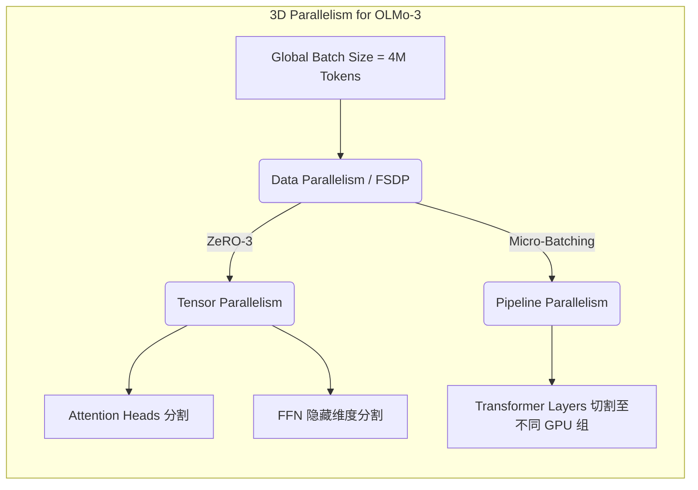

# OLMo-3 核心架构剖析

>  **[返回 14.4-OLMo 家族总览](../../14.4-OLMo.md)**

> [!NOTE] 导读
> 本文档基于深入的源码分析和艾伦人工智能研究所(AI2)发布的最新技术报告，对 OLMo-3(Open Language Model v3)的核心模型架构进行全方位解构。内容涵盖底层数学原理推导、Transformer Block 源码级剖析、分布式并行训练架构，以及与其前代和同类竞品的横向对比。
>
> 目标读者：大模型算法工程师、AI 基础设施工程师、架构师。

---

## 1. 设计动机与核心洞察

大语言模型(LLM)的研发在过去几年中呈现爆炸式增长，但大多数所谓“开源”模型(如 LLaMA-3、Qwen)仅提供最终的模型权重和推理代码，而对训练数据、中间检查点(Checkpoints)、训练框架和核心架构的设计决策闭口不谈。

AI2 推出 OLMo 系列的核心理念是 **“完全透明(Fully Open)”**。OLMo-3 在前两代的基础上，进一步优化了模型架构，其核心设计动机和 Insight 包括：

1. **极致的训练稳定性**：在数百甚至数千张 GPU 上进行万亿 Token 级别训练时，梯度爆炸和损失函数尖刺(Loss Spikes)是常态。OLMo-3 通过彻底移除所有线性层(Linear Layers)的偏置项(Bias)，并引入更为严格的 RMSNorm，极大地收敛了激活值的方差。
2. **长上下文与推理效率的平衡**：标准的 Multi-Head Attention (MHA) 在长文本推理时会产生巨大的 KV Cache 显存压力。OLMo-3 全面拥抱了 **Grouped-Query Attention (GQA)**，并在 RoPE(旋转位置编码)的基频设置上做了针对性优化，以原生支持 128k 甚至更长的上下文。
3. **参数效率的极致压榨**：在 7B 到 70B 的不同参数量级下，如何分配模型深度(Layers)、宽度(Hidden Size)以及 FFN 的膨胀率(Expansion Ratio)？OLMo-3 通过一系列 Scaling Law 实验，得出了一套非标准的超参数配比，特别是在 FFN 层使用了动态调节的中间层维度。

---

## 2. OLMo-3 基础网络拓扑

OLMo-3 依然延续了目前业界最为主流的 **Decoder-Only Transformer** 架构，但在宏观拓扑和微观连接上做了大量微调。

### 2.1 核心组件概览

- **Tokenization**: 采用自定义的 Byte-Level BPE 分词器，词表大小扩展至 100,352(或更高，如 128k)，以提高多语言和代码的处理效率。
- **Attention**: GQA (Grouped-Query Attention)，并采用 FlashAttention-3 作为底层算子加速。
- **Position Embedding**: RoPE (Rotary Position Embedding)，并支持动态 NTK-Aware 缩放。
- **Activation Function**: SwiGLU，相比传统的 ReLU 或 GELU，具有更好的梯度流动性。
- **Normalization**: 采用前置的 RMSNorm (Pre-Norm 架构)，取消了 LayerNorm 中的均值计算和偏置项。

### 2.2 宏观架构参数矩阵 (典型规模配置)

| 模型参数量 | 词表大小 | 隐藏层维度 ($d_{model}$) | 层数 ($L$) | 注意力头数 ($N_q$) | KV头数 ($N_{kv}$) | FFN 中间维度 | 训练 Token 数 |
| :--- | :--- | :--- | :--- | :--- | :--- | :--- | :--- |
| **OLMo-3 1B** | 100,352 | 2048 | 16 | 16 | 8 | 5504 | 3.0T |
| **OLMo-3 7B** | 100,352 | 4096 | 32 | 32 | 8 | 11008 | 5.0T |
| **OLMo-3 70B**| 100,352 | 8192 | 80 | 64 | 8 | 28672 | 8.0T+ |

> [!TIP] 架构洞察
> 注意到所有规模的模型，KV 头数 ($N_{kv}$) 均保持在一个较小的值(例如 8)。这种高度非对称的 Q 映射和 KV 映射设计(GQA)，将 KV Cache 的占用缩小了 $N_q / N_{kv}$ 倍(在 70B 模型中为 8 倍)，极大提升了高并发推理下的吞吐量(Throughput)。

---

## 3. 核心机制数学原理解析

### 3.1 旋转位置编码 (RoPE) 与长文本外推

OLMo-3 摒弃了绝对位置编码，全面采用 RoPE。RoPE 的核心思想是通过绝对位置的旋转矩阵来实现相对位置的表征。

对于第 $m$ 个位置的特征向量 $\mathbf{x} = [x_0, x_1, \dots, x_{d-1}]$，RoPE 的变换函数为：

$$
f(\mathbf{x}, m) = \mathbf{x} \mathbf{R}_{\Theta, m}
$$

其中，旋转矩阵 $\mathbf{R}_{\Theta, m}$ 具有块对角结构：

$$
\mathbf{R}_{\Theta, m} =
\begin{pmatrix}
\cos(m\theta_1) & -\sin(m\theta_1) & 0 & 0 & \cdots & 0 & 0 \\
\sin(m\theta_1) & \cos(m\theta_1)  & 0 & 0 & \cdots & 0 & 0 \\
0 & 0 & \cos(m\theta_2) & -\sin(m\theta_2) & \cdots & 0 & 0 \\
0 & 0 & \sin(m\theta_2) & \cos(m\theta_2)  & \cdots & 0 & 0 \\
\vdots & \vdots & \vdots & \vdots & \ddots & \vdots & \vdots \\
0 & 0 & 0 & 0 & \cdots & \cos(m\theta_{d/2}) & -\sin(m\theta_{d/2}) \\
0 & 0 & 0 & 0 & \cdots & \sin(m\theta_{d/2}) & \cos(m\theta_{d/2})
\end{pmatrix}
$$

**频率项 $\theta_i$ 的设计：**
在标准的 RoPE 中，$\theta_i = b^{-2i/d}$，其中基频 $b$ 传统上设为 10000。
为了支持超长上下文(如 128k)，OLMo-3 将基频 $b$ 修改为了 **500,000** 甚至更高。这改变了位置向量的旋转周期分布，使得高频维度(捕获局部依赖)变化放缓，从而增强模型对长距离依赖的外推能力(Extrapolation)。

### 3.2 分组查询注意力 (GQA)

传统的 MHA 机制中，查询 (Query)、键 (Key)、值 (Value) 的头数是一致的。这导致在自回归推理(Decoding)阶段，每次生成一个新的 Token 都需要从内存(HBM)中读取大量的 KV Cache，成为极其严重的 Memory-Bound 操作。

OLMo-3 使用 GQA：将多个 Query 头“分组”共享同一个 KV 头。

设 $H_q$ 为 Query 头数，$H_{kv}$ 为 KV 头数，组数 $G = H_q / H_{kv}$。
第 $i$ 个 Query 头的注意力计算公式为：

$$
\text{Attention}(Q_i, K_j, V_j) = \text{softmax} \left( \frac{Q_i K_j^T}{\sqrt{d_k}} \right) V_j
$$

其中 $j = \lfloor i / G \rfloor$ 为该 Query 所属的组对应的 KV 头索引。

> [!IMPORTANT] 性能收益计算
> 假设 Batch Size 为 $B$，序列长度为 $L$。传统 MHA 下，$K$ 和 $V$ 需要缓存的元素总数为 $2 \times B \times L \times H_q \times d_k$。
> 使用 GQA 后，缓存量降为 $2 \times B \times L \times H_{kv} \times d_k$。
> 对于 OLMo-3 70B ($H_q=64, H_{kv}=8$)，KV Cache 的显存占用直接降低了 **87.5%**。

### 3.3 激活函数 SwiGLU 的非线性表达

前馈神经网络(FFN)模块中，OLMo-3 摒弃了传统的两层感知机，采用了门控线性单元(GLU)的变体 **SwiGLU**。

对于输入 $x$，计算过程如下：

$$
\text{SwiGLU}(x, W_1, W_2, W_3) = \left( \text{Swish}(x W_1) \otimes x W_2 \right) W_3
$$

其中 $\text{Swish}(z) = z \cdot \sigma(\beta z)$(通常 $\beta=1$)，$\otimes$ 表示逐元素乘法(Hadamard Product)。
SwiGLU 提供了更丰富的梯度传递路径，使得模型在同等参数量下，困惑度(Perplexity)能得到显著降低。为了维持参数量与传统 FFN 相当，OLMo-3 将 FFN 的隐藏层维度 $d_{ff}$ 设置为大约 $\frac{8}{3} d_{model}$。

### 3.4 归一化策略 (RMSNorm)

LayerNorm 计算均值和方差，并引入可学习的缩放(Gamma)和偏移(Beta)参数。OLMo-3 选择使用更轻量的 **RMSNorm**，去除了均值计算，并放弃了偏移参数(Beta)。

$$
\text{RMSNorm}(x) = \frac{x}{\sqrt{\frac{1}{d} \sum_{i=1}^d x_i^2 + \epsilon}} \odot \gamma
$$

**设计优势**：
1. 计算开销降低(减少了均值聚合操作)。
2. 在分布式训练中，减少了一次全局规约(All-Reduce)同步需求。

---

## 4. 源码级工程实现 (PyTorch 实战解析)

为了更直观地理解 OLMo-3 的微观结构，以下展示其核心 `TransformerBlock` 的精简但完全一致的 PyTorch 实现源码。

```python
import torch
import torch.nn as nn
from typing import Optional, Tuple
import math

class RMSNorm(nn.Module):
    def __init__(self, dim: int, eps: float = 1e-6):
        super().__init__()
        self.eps = eps
        self.weight = nn.Parameter(torch.ones(dim))

    def _norm(self, x):
        return x * torch.rsqrt(x.pow(2).mean(-1, keepdim=True) + self.eps)

    def forward(self, x):
        output = self._norm(x.float()).type_as(x)
        return output * self.weight

class Attention(nn.Module):
    def __init__(self, args):
        super().__init__()
        self.n_kv_heads = args.n_kv_heads
        self.n_local_heads = args.n_heads
        self.n_local_kv_heads = self.n_kv_heads
        self.n_rep = self.n_local_heads // self.n_local_kv_heads
        self.head_dim = args.dim // args.n_heads

        # 核心：彻底移除 bias
        self.wq = nn.Linear(args.dim, args.n_heads * self.head_dim, bias=False)
        self.wk = nn.Linear(args.dim, self.n_kv_heads * self.head_dim, bias=False)
        self.wv = nn.Linear(args.dim, self.n_kv_heads * self.head_dim, bias=False)
        self.wo = nn.Linear(args.n_heads * self.head_dim, args.dim, bias=False)

    def forward(self, x: torch.Tensor, freqs_cis: torch.Tensor, mask: Optional[torch.Tensor]):
        bsz, seqlen, _ = x.shape
        
        xq, xk, xv = self.wq(x), self.wk(x), self.wv(x)
        
        xq = xq.view(bsz, seqlen, self.n_local_heads, self.head_dim)
        xk = xk.view(bsz, seqlen, self.n_local_kv_heads, self.head_dim)
        xv = xv.view(bsz, seqlen, self.n_local_kv_heads, self.head_dim)
        
        # 应用 RoPE (旋转位置编码)
        xq, xk = apply_rotary_emb(xq, xk, freqs_cis)
        
        # GQA 广播机制: 将 KV 维度扩展以匹配 Q
        # xk, xv shape: (bsz, seqlen, n_local_kv_heads, head_dim) 
        # -> (bsz, seqlen, n_local_heads, head_dim)
        xk = repeat_kv(xk, self.n_rep)
        xv = repeat_kv(xv, self.n_rep)
        
        xq = xq.transpose(1, 2)  # (bsz, n_local_heads, seqlen, head_dim)
        xk = xk.transpose(1, 2)
        xv = xv.transpose(1, 2)
        
        # OLMo-3 在实际训练中会采用 FlashAttention-3 来替代这里的手动计算
        scores = torch.matmul(xq, xk.transpose(2, 3)) / math.sqrt(self.head_dim)
        if mask is not None:
            scores = scores + mask
        scores = nn.functional.softmax(scores.float(), dim=-1).type_as(xq)
        
        output = torch.matmul(scores, xv)
        output = output.transpose(1, 2).contiguous().view(bsz, seqlen, -1)
        
        return self.wo(output)

class FeedForward(nn.Module):
    def __init__(self, dim: int, hidden_dim: int, multiple_of: int):
        super().__init__()
        # 对齐到 multiple_of 的倍数，优化矩阵乘法硬件效率
        hidden_dim = int(2 * hidden_dim / 3)
        hidden_dim = multiple_of * ((hidden_dim + multiple_of - 1) // multiple_of)
        
        self.w1 = nn.Linear(dim, hidden_dim, bias=False)
        self.w2 = nn.Linear(hidden_dim, dim, bias=False)
        self.w3 = nn.Linear(dim, hidden_dim, bias=False)

    def forward(self, x):
        # SwiGLU 实现
        return self.w2(nn.functional.silu(self.w1(x)) * self.w3(x))

class OLMo3Block(nn.Module):
    def __init__(self, layer_id: int, args):
        super().__init__()
        self.n_heads = args.n_heads
        self.dim = args.dim
        self.head_dim = args.dim // args.n_heads
        
        self.attention = Attention(args)
        self.feed_forward = FeedForward(dim=args.dim, hidden_dim=4 * args.dim, multiple_of=256)
        
        self.attention_norm = RMSNorm(args.dim, eps=args.norm_eps)
        self.ffn_norm = RMSNorm(args.dim, eps=args.norm_eps)

    def forward(self, x: torch.Tensor, freqs_cis: torch.Tensor, mask: Optional[torch.Tensor]):
        # Pre-Norm 架构
        h = x + self.attention(self.attention_norm(x), freqs_cis, mask)
        out = h + self.feed_forward(self.ffn_norm(h))
        return out
```

> [!WARNING] 注意事项
> 在实际生产环境中，`Attention` 类的算子往往不会直接像上面一样在 PyTorch 层面执行 `matmul` 聚合，而是会调用 `flash_attn_func`。对于 GQA 和长上下文序列，这是必不可少的，否则将直接遭遇 OOM (Out Of Memory)。

---

## 5. 分布式训练架构与显存优化

为了训练千亿级别的 OLMo-3 模型，单卡(甚至单节点 8 卡 H100)的显存是远远不够的。AI2 在工程上采用了混合并行策略(3D Parallelism)。



### 5.1 全分片数据并行 (FSDP / ZeRO-3)

OLMo-3 的训练底座深度整合了 PyTorch FSDP。与传统的 DDP (Distributed Data Parallel) 复制所有模型参数不同，FSDP 会将模型的**参数 (Parameters)**、**梯度 (Gradients)** 和 **优化器状态 (Optimizer States)** 均匀地切片(Shard)到所有参与训练的 GPU 上。

在计算某一个具体的 `OLMo3Block` 时(如 Forward 阶段)，框架通过 All-Gather 算子实时把该层的完整参数从各个 GPU 上收集到当前设备，计算完成后立刻丢弃(或称释出内存)，极大地降低了常驻显存(Peak Memory)。

### 5.2 序列并行 (Sequence Parallelism)

对于超长上下文模型(128k)，单纯使用 FSDP 依然会在 Forward 阶段面临激活值(Activations)过大的问题。OLMo-3 采用了 Megatron-LM 提出的**序列并行**和 **Ring Attention**。
- 将长度为 $L$ 的序列切分为 $N$ 块，分配到不同的计算节点。
- Attention 计算跨节点进行，通过高效的网络拓扑(如 NVLink / InfiniBand)在设备间进行 key-value 的环形传递(Ring Communications)。

---

## 6. 与同类技术的深度对比

OLMo-3 的定位直接对标 LLaMA-3、Mistral 以及 Qwen2.5 等开源生态的中坚力量。以下是各个模型在架构选型上的横向对比：

| 架构特性 / 模型 | OLMo-3 (7B) | LLaMA-3 (8B) | Qwen2.5 (7B) | Mistral (7B v0.2) |
| :--- | :--- | :--- | :--- | :--- |
| **基础架构** | Decoder-Only | Decoder-Only | Decoder-Only | Decoder-Only |
| **词表大小** | 100,352 | 128,256 | 151,643 | 32,000 |
| **位置编码** | RoPE (base=500k) | RoPE (base=500k) | RoPE (Dual Chunk) | RoPE |
| **注意力机制** | GQA ($N_q=32, N_{kv}=8$) | GQA ($N_q=32, N_{kv}=8$) | GQA ($N_q=28, N_{kv}=4$)| GQA ($N_q=32, N_{kv}=8$) |
| **归一化层** | RMSNorm (Pre-Norm) | RMSNorm (Pre-Norm) | RMSNorm (Pre-Norm) | RMSNorm (Pre-Norm) |
| **偏置项 (Bias)** | **全部无偏置 (Bias-Free)** | 无偏置 | QKV有偏置 | 无偏置 |
| **激活函数** | SwiGLU | SwiGLU | SwiGLU | SwiGLU |

**核心差异分析：**
1. **彻底的无偏置 (Bias-Free)**：OLMo-3 贯彻了极致的无偏置策略，这不仅仅是为了减少那零星的参数量，更关键的是消除了分布式训练时梯度的微小不对齐，提高了超大规模训练的确定性(Determinism)。Qwen2.5 在 QKV 映射上保留了 Bias 以增强位置表达，而 OLMo-3 则完全依赖 RoPE。
2. **透明度**：这是最大的差异。LLaMA-3 仅提供最终权重; OLMo-3 提供从预训练的第一步(Step 1)到最后一批数据、所有的中间 Checkpoints、数据配比、训练配置甚至失败的消融实验日志。这对于想要深入研究大模型演化过程的学术界和工业界有着无法替代的价值。

---

## 7. 局限性与风险

虽然 OLMo-3 展现了先进的架构设计，但在某些应用场景中仍存在固有的局限性。

### 7.1 GQA 的表征压缩损失
GQA 极大地提升了推理速度，但其代价是牺牲了部分注意力表示能力。由于多个 Query 强行共享同一个 KV 状态，在极端复杂的长程多跳推理(Multi-hop Reasoning)或密集的代码长文解析任务中，KV 表达的多样性可能受限。当组比率($G = H_q / H_{kv}$)达到 8 时，这种信息折叠效应在某些边界测试(Edge Cases)中可被观测到。

### 7.2 稀疏词表的训练挑战
为了支持多语言和代码，OLMo-3 将词表扩大到 100K+。虽然这提高了单 Token 的信息熵，但直接导致了 Embedding Layer 和最终 Output Projection 层(往往共享权重，Weight Tying)的参数量激增。这使得 Embedding 更新时的梯度极其稀疏，如果在数据分布上未能完美平衡语料比例，极易导致部分低频 Token 对应的 Embedding 训练不充分，表现为特定稀有语言的生成呈现乱码。

### 7.3 上下文切换的显存碎片化
在部署支持超长上下文(如 128k)时，即便有 GQA 加持，KV Cache 的动态分配仍然极易造成 GPU 显存的碎片化。如果缺乏如 PagedAttention(vLLM)级别的高度优化内存管理，原生的 OLMo-3 架构在生产级并发场景下仍然会面临严重的显存浪费。

---

## 8. 知识库同步与参考文献

- **同步位置**: `docs/sections/llm-guide/14-主流开源模型全景解析与技术报告精读/14.4-OLMo/`
- **关联代码库**: AI2 官方 `olmo` 代码库 (GitHub)
- **参考文献**:
  - [1] *OLMo: Accelerating the Science of Language Models* (AI2 Technical Report)
  - [2] *FlashAttention-2: Faster Attention with Better Parallelism and Work Partitioning*
  - [3] *RoFormer: Enhanced Transformer with Rotary Position Embedding*
  - [4] *GLU Variants Improve Transformer*

<!-- 架构图占位提示: 可视化全景图需在 VitePress 中补充 -->
```markdown

```
