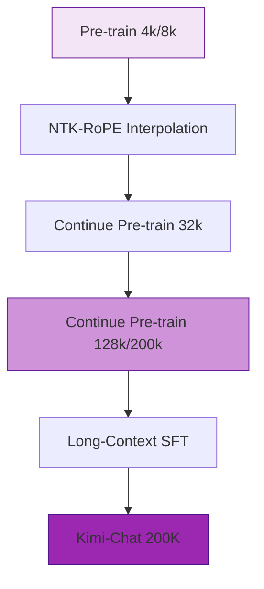

# Kimi-Chat 核心技术专题索引

>  **[返回 14.5-Kimi 家族总览](../../14.5-Kimi.md)**

Kimi-Chat(2023-10)是 Moonshot AI 首款 C 端对话产品, 以 **200,000 汉字(约 128K-200K tokens)** 超长上下文建立「Kimi = 长文档」品牌认知。

## 1. 技术问题定义与背景 (Technical Problem Definition)

Kimi-Chat 诞生于 2023 年下半年，当时业界主流开源与闭源模型的上下文窗口普遍停留在 4K 到 32K(如 Llama-2-4k，GPT-4-32k)。Moonshot AI 识别到了一个核心痛点：**基于 RAG (Retrieval-Augmented Generation) 的长文本处理存在严重的信息碎片化和检索遗漏问题**。

为了实现“将整本书、几十个 PDF 研报直接塞进模型进行多跳推理”，Kimi 需要解决：
1. **RoPE 位置编码的外推极限**：如何让在 4K 序列上预训练的模型，在不崩溃的情况下扩展到 200K。
2. **长序列的注意力显存墙**：标准 Transformer 的 $O(N^2)$ 计算和显存复杂度，在 200K 序列下会导致单卡直接 OOM(Out Of Memory)。
3. **Lost in the Middle 现象**：模型在超长上下文中往往只记得开头和结尾，遗忘中间的“大海捞针”关键信息。

## 2. 方法论拆解 (Method Breakdown)

尽管 Moonshot 早期的 Kimi-Chat 缺乏公开的技术论文，但根据业界逆向工程与后续 K2 披露，其长文本方案的核心可总结为以下路径：

### 2.1 动态 NTK-aware RoPE 插值与外推

要在不重新进行漫长预训练的前提下扩展上下文，Kimi-Chat 极大概率采用了类似 NTK-aware 的旋转位置编码(RoPE)插值技术。

其核心思想是：不统一缩放所有位置的频率，而是**根据特征频率的倒数进行非线性缩放**，高频(相邻 Token 的相对位置)保留，低频(远距离 Token 的绝对位置)插值。

$$
 \theta_d = b^{-2d/D}, \quad b' = b \cdot \left(\frac{L_{new}}{L_{old}}\right)^{\alpha}
$$

### 2.2 继续预训练与长文本 SFT

单纯的位置编码缩放无法教会模型处理“长距离依赖”。Kimi 进行了精心设计的继续预训练(Continue Pre-training)：
- **语料重构**：专门清洗并拼接了大量中英文长文档、代码库全仓代码。
- **长文本 SFT**：在对齐阶段，引入了长度跨度超过 10 万字的复杂指令，比如“阅读以上 3 份研报，找出它们对 Q3 财报预测的冲突点”。

## 3. 工程实现与推理架构 (Engineering Analysis)

支持 200K Token 在 C 端免费、高并发使用，是极其恐怖的工程挑战。Kimi-Chat 的工程亮点在于其推理集群的调度：

1. **Context Caching(上下文缓存)**：
   在 Kimi 产品中，当用户上传文件时，Kimi 并非每次对话都重新计算 200K 文本的 KV Cache，而是实现了全局的 Prefix Cache。不同对话轮次复用了庞大的历史 KV 缓存。
2. **Ring Attention / 序列并行 (Sequence Parallelism)**：
   在推理和训练端，单张 A100/H100 无法装下 200K 的 KV Cache。Kimi 使用了基于通信环(Ring)的序列切分机制，将长上下文分发到集群中的 4-8 张卡上同步计算。

## 4. 边界与局限性说明 (Boundary Explanations)

- **产品 > 架构开源**：Kimi-Chat 完全闭源，其在长上下文基准(如 LongBench、∞Bench)中主要作为行业对比的 Benchmark 存在，无法供社区直接进行微调。
- **注意力分散**：尽管解决了内存问题，但在极端压力测试下(如 200K 文本中的极其微小的单行错误检测)，仍然受到注意力被海量噪声 Token 稀释的影响。
- **推理成本**：首 Token 响应时间(TTFT)在输入极大文件时仍然面临几十秒的延迟，受限于物理显存带宽。

---

## 5. 文档导航

| 文件 | 说明 |
| --- | --- |
| [01-Kimi-Chat 长上下文技术精译](./01-Kimi-Chat长上下文技术精译.md) | 基于公开资料的中文精译主稿 |
| [03-Kimi-Chat-mineru-en](./03-Kimi-Chat-mineru-en.md) | 英文源资料整理稿 |
| [04-Kimi-Chat-mineru-zh](./04-Kimi-Chat-mineru-zh.md) | 中文交付稿(含译者注) |
| [05-Kimi-Chat 长上下文专题](./05-Kimi-Chat-长上下文扩展的技术路径与工程实践.md) | RoPE 外推、继续预训练与工程挑战深度拆解 |
