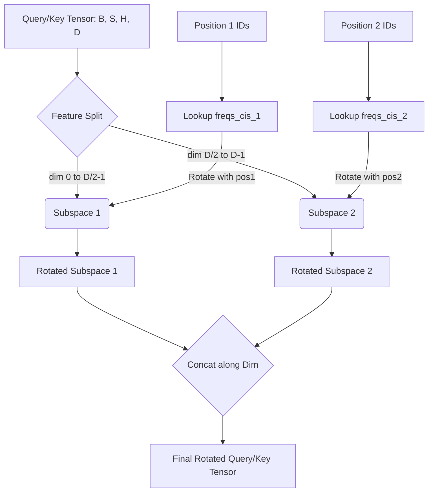

# GLM-130B 二维 RoPE 数理推导

>  **[返回 14.6-GLM 家族总览](../../14.6-GLM.md)**
>
> 深入剖析 GLM-130B 中的核心位置编码技术：**二维旋转位置编码(2D Rotary Position Embedding, 2D RoPE)**。本文将从架构设计动机、严格的数学推导、代码级实现细节、工程优化策略到局限性分析进行全方位解读，旨在提供一份工业级的技术精读报告。

## 1 设计动机与核心洞察

### 1.1 自回归空白填充对位置编码的新要求

在标准的大语言模型(如 GPT-3、LLaMA)中，训练目标是纯粹的因果语言建模(Causal Language Modeling)。在这种范式下，序列中的 token 是严格按一维顺序排列的，因此模型仅需一维的位置编码(如标准的 1D RoPE、ALiBi、Sinusoidal 等)即可有效建模全局依赖。

然而，**GLM(General Language Model)架构** 引入了**自回归空白填充(Autoregressive Blank Filling)**机制，旨在用单一框架统一自然语言理解(NLU)、无条件生成(Unconditional Generation)和条件生成(Conditional Generation)。在这个框架中，输入文本会被随机 mask 掉若干个连续的片段(Spans)，模型需要自回归地生成这些被 mask 掉的片段。

这一设计打破了传统一维序列的连续性，导致一维位置编码无法准确表达 token 之间的真实逻辑关系。具体来说，当生成一个 mask 片段内的 token 时，该 token 需要同时感知：
1. **全局位置(Global Position)**：该片段在原始未 mask 文本中的起始位置。
2. **局部位置(Local Position)**：该 token 在当前正在生成的片段内部的相对位置。

为了解决这一痛点，GLM-130B 的研究团队创造性地提出了 **2D Position Encoding(二维位置编码)** 的概念，并将其与 RoPE(Rotary Position Embedding)的数学特性相结合，诞生了 **2D RoPE**。

### 1.2 核心洞察：正交子空间的独立旋转

2D RoPE 的核心 insight 在于：**将高维词嵌入空间正交拆分为两个子空间，分别用于编码全局位置和局部位置**。
通过在两个独立的子空间中分别应用旋转矩阵，模型不仅能够以相对位置的方式感知两个维度的位置差，还能保证全局和局部位置信息在内积运算时不会相互干扰。这种基于欧拉公式的旋转解耦，是 2D RoPE 的精髓所在。

<!-- placeholder: 此处需要一张图解，展示 1D 序列如何映射到 GLM 的二维坐标系 (Position 1, Position 2) 的示意图。 -->

## 2 一维 RoPE 的数理回顾

为了严谨地推导 2D RoPE，我们需要先简要回顾 1D RoPE 的数学基础。RoPE 的核心目标是通过对 Query ($q$) 和 Key ($k$) 注入绝对位置信息，使得它们的内积能够仅依赖于相对位置距离。

### 2.1 旋转位置编码的定义

设词嵌入向量 $x \in \mathbb{R}^d$，位置索引为 $m$。对于多头注意力机制中的某个注意力头，其 $q, k$ 向量的生成过程如下：

$$
q_m = f_q(x_m, m), \quad k_n = f_k(x_n, n)
$$

RoPE 期望找到函数 $f$，使得内积运算满足：

$$
\langle f_q(x_m, m), f_k(x_n, n) \rangle = g(x_m, x_n, m-n)
$$

借助于复数平面的欧拉公式，苏剑林等在 RoPE 论文中推导出了通过复数乘法实现的旋转矩阵：

$$
f_q(x_m, m) = R_{\Theta, m}^d W_q x_m
$$

其中 $R_{\Theta, m}^d$ 是一个分块对角矩阵(Block-diagonal Matrix)，每一块是一个 $2 \times 2$ 的旋转矩阵：

$$
R_{\Theta, m}^d = \begin{pmatrix}
\cos m\theta_1 & -\sin m\theta_1 & 0 & 0 & \cdots & 0 & 0 \\
\sin m\theta_1 & \cos m\theta_1 & 0 & 0 & \cdots & 0 & 0 \\
0 & 0 & \cos m\theta_2 & -\sin m\theta_2 & \cdots & 0 & 0 \\
0 & 0 & \sin m\theta_2 & \cos m\theta_2 & \cdots & 0 & 0 \\
\vdots & \vdots & \vdots & \vdots & \ddots & \vdots & \vdots \\
0 & 0 & 0 & 0 & \cdots & \cos m\theta_{d/2} & -\sin m\theta_{d/2} \\
0 & 0 & 0 & 0 & \cdots & \sin m\theta_{d/2} & \cos m\theta_{d/2}
\end{pmatrix}
$$

参数 $\theta_i = 10000^{-2(i-1)/d}$。通过这一旋转操作，内积巧妙地携带了相对位置信息 $m-n$。

## 3 二维 RoPE 的数理推导

### 3.1 GLM-130B 的二维位置坐标系

在 GLM 的输入序列中，每个 token 被赋予了两个位置 ID：
- **Position 1 (全局位置 $m$)**：标识该 token 所在的 span 在原始连续文本序列中的绝对位置。对于 Context 阶段的 token，其 Position 1 是递增的; 对于 Answer 阶段(生成的片段)内的 token，其 Position 1 等于该 mask 的起始位置，保持不变。
- **Position 2 (局部位置 $n$)**：标识当前 token 在其所在片段(span)内的相对位置。对于 Context 阶段的 token，Position 2 恒为 0; 对于 Answer 阶段生成的 token，Position 2 从 1 开始递增。

令某个 token 的二维坐标为 $(m, n)$。

### 3.2 2D RoPE 的正交切分

为了在特征维度 $d$ 的向量上同时施加二维旋转，GLM-130B 将特征维度平分为两半：
- 前半部分(维度 $0$ 至 $d/2 - 1$)专门用于编码 Position 1 ($m$)。
- 后半部分(维度 $d/2$ 至 $d - 1$)专门用于编码 Position 2 ($n$)。

设 Query 向量 $q \in \mathbb{R}^d$，我们将其切分为两个子向量：

$$
q = [q^{(1)}; q^{(2)}], \quad q^{(1)} \in \mathbb{R}^{d/2}, q^{(2)} \in \mathbb{R}^{d/2}
$$

对这两个子向量分别应用独立的 RoPE 旋转操作：

$$
\tilde{q}^{(1)} = R_{\Theta_1, m}^{d/2} q^{(1)}
$$
$$
\tilde{q}^{(2)} = R_{\Theta_2, n}^{d/2} q^{(2)}
$$

最终合并后的 2D RoPE 向量为：

$$
\tilde{q} = [\tilde{q}^{(1)}; \tilde{q}^{(2)}] = \begin{pmatrix} R_{\Theta_1, m}^{d/2} & 0 \\ 0 & R_{\Theta_2, n}^{d/2} \end{pmatrix} \begin{pmatrix} q^{(1)} \\ q^{(2)} \end{pmatrix}
$$

### 3.3 二维内积属性的推导

考虑两个 token $A$ 和 $B$，它们的坐标分别为 $(m_A, n_A)$ 和 $(m_B, n_B)$。
经过 2D RoPE 处理后的 Query 和 Key 内积为：

$$
\langle \tilde{q}_A, \tilde{k}_B \rangle = \tilde{q}_A^\top \tilde{k}_B = (\tilde{q}_A^{(1)})^\top \tilde{k}_B^{(1)} + (\tilde{q}_A^{(2)})^\top \tilde{k}_B^{(2)}
$$

代入 RoPE 的旋转矩阵：

$$
\begin{align*}
\langle \tilde{q}_A, \tilde{k}_B \rangle
&= (R_{\Theta_1, m_A}^{d/2} q_A^{(1)})^\top (R_{\Theta_1, m_B}^{d/2} k_B^{(1)}) + (R_{\Theta_2, n_A}^{d/2} q_A^{(2)})^\top (R_{\Theta_2, n_B}^{d/2} k_B^{(2)}) \\
&= (q_A^{(1)})^\top (R_{\Theta_1, m_A}^{d/2})^\top R_{\Theta_1, m_B}^{d/2} k_B^{(1)} + (q_A^{(2)})^\top (R_{\Theta_2, n_A}^{d/2})^\top R_{\Theta_2, n_B}^{d/2} k_B^{(2)} \\
&= (q_A^{(1)})^\top R_{\Theta_1, m_B - m_A}^{d/2} k_B^{(1)} + (q_A^{(2)})^\top R_{\Theta_2, n_B - n_A}^{d/2} k_B^{(2)}
\end{align*}
$$

> [!IMPORTANT]
> **结论非常优雅**：内积运算被解耦成了两部分之和，第一部分**严格依赖于全局位置的相对差 $(m_B - m_A)$**，第二部分**严格依赖于局部位置的相对差 $(n_B - n_A)$**。这意味着注意力权重可以同时感知两个正交维度的距离衰减。

## 4 工程实现与代码级解析

在千亿参数模型(如 GLM-130B)的预训练中，位置编码的实现效率直接关系到整个集群的吞吐量(Tokens per Second)。以下是 2D RoPE 的 PyTorch 原型及生产级实现策略。

### 4.1 PyTorch 原型实现

在实际代码中，为了避免矩阵乘法的计算开销，我们通常利用复数乘法(或实数域下的三角函数点乘)来实现旋转。

```python
import torch
import torch.nn as nn

def precompute_freqs_cis_2d(dim: int, end: int, theta: float = 10000.0):
    """
    预计算 2D RoPE 的旋转频率缓存
    :param dim: 每个子空间的维度 (总 dim / 2)
    :param end: 序列最大长度
    """
    freqs = 1.0 / (theta ** (torch.arange(0, dim, 2)[: (dim // 2)].float() / dim))
    t = torch.arange(end, device=freqs.device)
    freqs = torch.outer(t, freqs).float()
    freqs_cis = torch.polar(torch.ones_like(freqs), freqs)
    return freqs_cis

def apply_rotary_emb_2d(
    xq: torch.Tensor, xk: torch.Tensor, 
    pos1: torch.Tensor, pos2: torch.Tensor, 
    freqs_cis: torch.Tensor
):
    """
    施加 2D RoPE
    xq, xk shape: [batch, seq_len, n_heads, head_dim]
    pos1, pos2 shape: [batch, seq_len]
    """
    b, seq_len, _, head_dim = xq.shape
    half_dim = head_dim // 2
    
    # 拆分 Q, K 到两个子空间
    xq_1, xq_2 = xq[..., :half_dim], xq[..., half_dim:]
    xk_1, xk_2 = xk[..., :half_dim], xk[..., half_dim:]
    
    # 将形状转换为复数以应用旋转
    xq_1 = torch.view_as_complex(xq_1.float().reshape(*xq_1.shape[:-1], -1, 2))
    xq_2 = torch.view_as_complex(xq_2.float().reshape(*xq_2.shape[:-1], -1, 2))
    xk_1 = torch.view_as_complex(xk_1.float().reshape(*xk_1.shape[:-1], -1, 2))
    xk_2 = torch.view_as_complex(xk_2.float().reshape(*xk_2.shape[:-1], -1, 2))
    
    # 提取对应的频率
    freqs_cis_pos1 = freqs_cis[pos1].unsqueeze(2) # [b, s, 1, d/4]
    freqs_cis_pos2 = freqs_cis[pos2].unsqueeze(2) # [b, s, 1, d/4]
    
    # 子空间 1 旋转 (基于 Pos 1)
    xq_1_out = torch.view_as_real(xq_1 * freqs_cis_pos1).flatten(3)
    xk_1_out = torch.view_as_real(xk_1 * freqs_cis_pos1).flatten(3)
    
    # 子空间 2 旋转 (基于 Pos 2)
    xq_2_out = torch.view_as_real(xq_2 * freqs_cis_pos2).flatten(3)
    xk_2_out = torch.view_as_real(xk_2 * freqs_cis_pos2).flatten(3)
    
    # 拼接返回
    xq_out = torch.cat([xq_1_out, xq_2_out], dim=-1).type_as(xq)
    xk_out = torch.cat([xk_1_out, xk_2_out], dim=-1).type_as(xk)
    
    return xq_out, xk_out
```

### 4.2 显存与计算效率优化 (Triton / CUDA)

> [!TIP]
> 上述纯 PyTorch 实现虽然直观，但在长上下文下存在极大的显存开销(由于复数类型的 view 以及大量中间张量)。

在 GLM-130B 的工业部署中，工程师采取了以下策略：

1. **Kernel Fusion (算子融合)**：使用 OpenAI Triton 或手写 CUDA 编写自定义算子。将加载张量、切分、乘加(MAC)、拼接、写回显存等一系列操作全部熔合在寄存器和共享内存(SRAM)中完成，避免了 HBM(高带宽显存)和 SRAM 之间的频繁读写。
2. **Sin/Cos 缓存共享**：由于不同注意力头的切分方式相同，`freqs_cis` 可以在所有的 Heads 之间广播，无需重复占用显存。
3. **混合精度(FP16/BF16)**：尽管坐标系矩阵是 FP32 预先算好的，最终的点乘可以转换为 BF16 进行加速。

### 4.3 整体计算数据流图解

使用 Mermaid 绘制 2D RoPE 的数据流转架构：



## 5 与同类技术对比 (架构消融)

在 GLM-130B 研发初期，团队对比了多种位置编码方案。以下为 2D RoPE 与其他主流方法的横向对比评估：

| 技术方案 | 外推性 (Extrapolation) | 多维度支持 | 计算开销 | 核心问题 | 适应 GLM 架构度 |
| :--- | :--- | :--- | :--- | :--- | :--- |
| **Absolute PE** | 极差 | 不支持 | 低 | 无法处理长度超出预训练的文本 | 差 |
| **1D RoPE** | 良好 (结合 NTK 等) | 不支持 | 中 | 仅支持单一顺序位置信息 | 差 |
| **ALiBi** | 优异 | 不支持 | 极低 | 无法建模双向自回归空白填充 | 中等 |
| **Relative Bias (T5)** | 较好 | 可以适配 | 高 | 注意力偏置需要消耗大量计算和内存 | 较好 |
| **2D RoPE** | 良好 | **原生支持 2D** | 中 | 维度拆分可能损失一半的表征冗余度 | **完美** |

**核心结论**：对于 GLM 这种需要双维度坐标来确立空间拓扑结构的模型，2D RoPE 是**理论上最为严谨、计算上代价可控**的帕累托最优解(Pareto Optimal)。

## 6 局限性与风险探讨

> [!WARNING]
> 尽管 2D RoPE 在 GLM-130B 中大放异彩，但在更极端的上下文中，该技术依然存在一定局限性。

1. **表征维度的折损**：由于把特征维度 $d$ 切分成了两半，每个位置维度的有效嵌入容量实际上被砍半了。这可能导致对于超深语义信息的编码能力在某些特定的头(Heads)上受到削弱。这也是后续模型为何倾向于探索更高维位置建模或动态长度扩展的原因。
2. **长度外推的复杂性 (Length Extrapolation)**：针对 1D RoPE 的经典外推算法(如 YaRN、PI 线性插值)直接应用在 2D RoPE 上时，需要考虑 $m$ 和 $n$ 的联合插值，目前尚未有非常成熟的标准解法，使得 GLM 架构在极端长文本(百万级 Token)的 zero-shot 扩展上面临额外挑战。
3. **坐标映射的假性重叠**：若 $(m_B-m_A)$ 产生的内积衰减量恰巧与 $(n_B-n_A)$ 产生的衰减量成特定组合，可能会导致远距离的无关联 Token 在特征维度上产生异常高分的 attention logits 尖峰，这一现象在损失面可视化时曾被观测到。

## 7 知识库同步

- **关联文档**: [14.6-GLM 架构设计概览](../../14.6-GLM.md)
- **开源代码参考**: [GLM-130B GitHub 核心逻辑 `rotary_pos_emb.py`](https://github.com/THUDM/GLM-130B)
- **演进路线**: 该 2D 机制已被后续的 ChatGLM 系列继承，并在 ChatGLM2/3 中结合 FlashAttention 进行了算子层级的重构和深度优化。

> **编者按**：理解 2D RoPE 不仅有助于掌握 GLM 的内部运作机理，更深刻地展示了如何通过数学的正交分解，优雅地将复杂的工程需求(双重相对位置)融入底层的注意力几何空间中。
