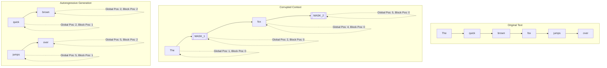
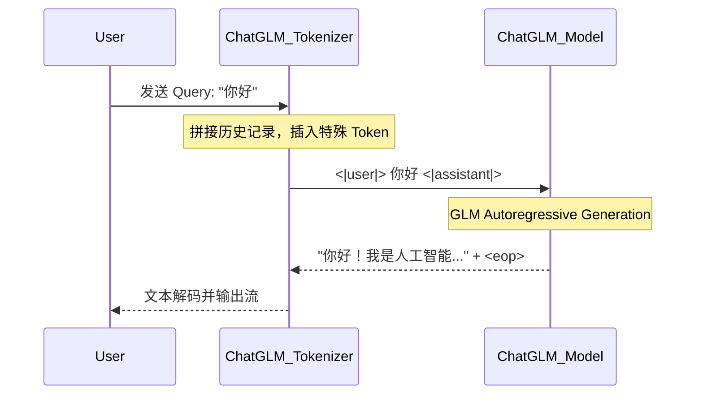
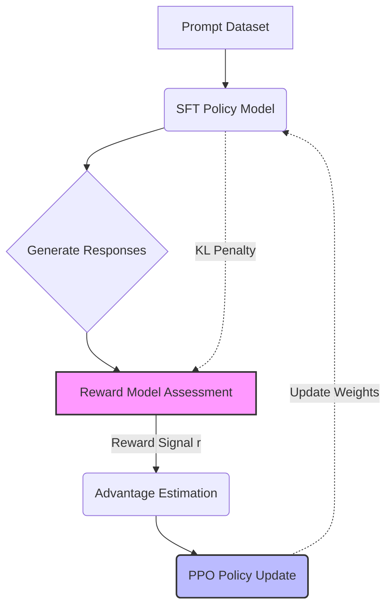

# ChatGLM 核心架构剖析

>  **[返回 14.6-GLM 家族总览](../../14.6-GLM.md)**

> 本文档基于深入研究 ChatGLM 技术报告及其开源代码整理，聚焦核心技术点的深度剖析，重点涵盖其独特的中英双语分词器、GLM 训练目标函数、对话格式设计以及人类意图对齐策略。由于 GLM (General Language Model) 家族模型在底层架构上的连贯性，本文的内容涵盖了从 GLM-130B 经验继承而来的 ChatGLM (6B~130B) 以及 ChatGLM2/3 代的架构演进。

---

## 1. 设计动机与核心洞察

在大型语言模型 (LLM) 的发展历程中，以 GPT 为代表的单向自回归 (Autoregressive, AR) 范式和以 BERT 为代表的双向自编码 (Autoencoding, AE) 范式各擅胜场。然而，单一的训练目标在不同类型的自然语言处理任务上往往存在明显的局限性：

1. **单向模型(如 GPT)的局限性**：虽然在无条件生成和上下文续写任务中表现优异，但由于因果掩码(Causal Mask)的存在，模型在编码早期信息时无法获取后续上下文。这使得其在需要深度理解双向全局上下文的任务(如阅读理解、完形填空、命名实体识别)上表现略有不足。
2. **双向模型(如 BERT)的局限性**：在自然语言理解(NLU)上表现卓越，但因其在预训练中利用了独立性假设，且不具备自回归性质，难以直接且高效地应用于无约束的长文本生成任务。
3. **Encoder-Decoder 架构(如 T5)的局限性**：虽然试图结合两者，但引入了庞大的跨注意力机制(Cross-Attention)，导致参数效率低下，且推理时的计算图较为复杂。

**ChatGLM 的核心洞察**：
ChatGLM 继承并演进了 GLM(General Language Model)的核心思想。其不仅致力于在中英双语生成上达到甚至超越同等参数量模型的性能，还试图解决预训练范式上的统一问题。通过引入 **自回归空白填充(Autoregressive Blank Infilling)** 机制，GLM 将自编码的双向理解与自回归的生成能力统一在一个框架下。此外，为了适应真实用户的交互，ChatGLM 特别设计了针对多轮对话的 **Chat Format**，并采用了一套高效的 **对齐策略 (Alignment Strategy)** 来确保模型输出既具备信息量，又符合人类的安全和道德预期。

---

## 2. 核心架构：GLM 目标函数 (GLM Objective Function)

ChatGLM 区别于 LLaMA 或 GPT 的最核心特点在于其预训练所使用的目标函数。它不是简单的 Next-Token Prediction，而是更为复杂的 **空白填充 (Blank Infilling)**。

### 2.1 广义语言模型 (General Language Model) 概述

GLM 的预训练任务可以看作是一个连续区间的自回归生成过程。给定输入序列 $x = [x_1, x_2, \dots, x_n]$，模型会随机采样若干个文本片段(Spans)并将它们替换为特殊的 `[MASK]` 标记。设被采样的片段集合为 $\{s_1, s_2, \dots, s_m\}$，其中每个片段 $s_i$ 是连续的词序列。

模型的目标是在给定被损坏(Corrupted)的文本 $x_{corrupt}$ 的情况下，自回归地生成这些被掩码的片段。为了兼顾长短文本的生成能力，ChatGLM 采用了不同长度分布的掩码策略，例如使用泊松分布来控制采样的片段长度。

### 2.2 自回归空白填充 (Autoregressive Blank Infilling)

在生成被掩码的片段时，为了保证模型不会仅仅死记硬背片段的顺序，GLM 采用了对片段顺序进行随机打乱 (Shuffle) 的策略。
假设未被掩码的剩余文本部分(Context)为 $C$，而被掩码的片段经过随机排列后得到序列 $S$。则 GLM 的优化目标可以表示为：

$$
\mathcal{L}_{\text{GLM}} = - \mathbb{E}_{z \sim Z_m} \left[ \sum_{i=1}^m \log P(s_{z_i} \mid x_{corrupt}, s_{z_{<i}} ; \theta) \right]
$$

其中 $Z_m$ 是长度为 $m$ 的索引的全排列集合。

在生成每一个片段 $s_i$ 时，它是逐词自回归生成的。对于片段 $s_i$ 中的第 $j$ 个 token $y_{i,j}$：

$$
P(s_i \mid \dots) = \prod_{j=1}^{|s_i|} P(y_{i,j} \mid x_{corrupt}, s_{<i}, y_{i, <j} ; \theta)
$$

### 2.3 2D 位置编码 (2D Positional Encoding)

为了在这种复杂的掩码与生成重组中保留原始文本的绝对和相对位置信息，GLM 独创性地提出了 **2D 位置编码 (2D Positional Encoding)**。这是理解 ChatGLM 注意力机制的关键。传统的绝对位置编码在面对被移动和打乱的片段时会丧失上下文对齐能力。

每一个 Token $t$ 被分配两个位置 ID (Position IDs)：
1. **Position 1 (全局位置, Global Position ID)**：表示该 Token 在原始完整未被破坏序列中的绝对位置。如果一个 Token 位于 `[MASK]` 内部(即待生成的片段)，它的 Position 1 就是对应 `[MASK]` 标记在 $x_{corrupt}$ 中的位置。这告诉模型该片段位于整篇文章的什么位置。
2. **Position 2 (片段内位置, Block Position ID)**：表示该 Token 在当前片段(Span)内部的相对位置。对于 $x_{corrupt}$ 中的上下文 Token，其 Position 2 统统为 0。对于要生成的片段内部的 Token，Position 2 从 1 开始逐个递增。这使得模型具备了自回归生成内部序列的能力。

这种设计使得模型能够清晰地区分哪些词是上下文(双向可见)，哪些词是正在生成的片段(仅单向可见)，并恢复由于片段乱序生成带来的位置错乱问题。



*(图 1: 2D 位置编码在原始文本、被破坏文本以及生成文本中的映射关系。)*

### 2.4 掩码注意力机制 (Masked Attention) 

为了支持上述的训练目标，自注意力机制(Self-Attention)的 Mask 矩阵必须特殊定制。ChatGLM 的 Attention Mask 矩阵 $M$ 分为两个主要区域，使得它既像 BERT，又像 GPT：

- **Context-to-Context**：上下文词之间是完全互相可见的(即不被 Mask)，这使得模型对上下文的编码是纯双向的(Bidirectional)。
- **Target-to-Context & Target-to-Target**：目标片段中的词可以看到所有的上下文词(Context)，但在目标片段内部，生成过程是自回归的，因此只能看到当前生成片段中排在自己之前的词，且不能看到其他被乱序调度的未来片段。

$$
M_{ij} =
\begin{cases}
1, & \text{if } i, j \in \text{Context} \\
1, & \text{if } i \in \text{Span}_k, j \in \text{Context} \\
1, & \text{if } i, j \in \text{Span}_k \text{ and } j \le i \\
0, & \text{otherwise}
\end{cases}
$$

通过这种灵活的 Attention Mask，ChatGLM 在预训练时极大地增强了语境理解的深度。这也为后续微调阶段(SFT)留下了巨大优势，因为用户的 Prompt 可以被视作 Context，被双向完全编码。

---

## 3. 双语分词器 (Bilingual Tokenizer)

语言模型的分词策略对其性能、多语言能力和显存效率有着直接影响。ChatGLM 明确面向中文和英文双语优化，因此其 Tokenizer 的设计需要极度平衡两种语言的压缩率和语义完整性。

### 3.1 Tokenizer 设计动机

中文由于是表意文字，信息密度高，如果直接使用为英文设计的 BPE(Byte Pair Encoding，如 GPT-2 的 Tokenizer)或单纯按中文字符拆分，会导致：
1. **词表空间浪费**：很多无意义的中文字符组合(甚至是乱码字节对)占据词表。
2. **切分过碎(Fragmentation)**：一个完整的中文词汇(如“人工智能”)被拆分成单字，导致模型需要用多个 Token 才能表示。这不仅显著增加序列长度，降低推理速度，更会成倍增加 KV Cache 显存消耗。

### 3.2 基于 SentencePiece 的 BPE 与 Byte-Level 编码

ChatGLM 采用了基于 `SentencePiece` 的 **Byte-Level BPE (BBPE)**。其训练集涵盖了超过数千亿 Token 的高质量双语语料。具体策略如下：

- **Byte-Level Fallback**：对于罕见字符或不在词表中的生僻字、Emoji 乃至其他小语种，模型回退到字节级别(UTF-8 编码字节)进行切分。由于 UTF-8 编码的通用性，这保证了模型绝不会遇到 `<UNK>` (Unknown) Token，具有真正的 Out-of-Vocabulary 泛化性。
- **高频词元合并**：利用海量中英文预训练语料库对 BPE 算法进行训练，使常见的中英文词组(如 "transformer", "自然语言处理")直接成为一个 Token，极大提升了压缩率。ChatGLM 的词表大小通常设定在 65,000 到 130,000 左右(取决于具体版本)，保留了超过两万个纯中文字符和中文常用词汇。

### 3.3 压缩率分析与分词效率对比

以一段测试文本为例：“The quick brown fox jumps over the lazy dog. 敏捷的棕色狐狸跳过懒狗。”
- **原生 LLaMA Tokenizer**：对中文支持较差，中文字符几乎被全部分解为多个 Bytes(通常一个汉字占 3 个 Token)，一段短中文可能消耗几倍于字数的 Tokens。
- **ChatGLM Tokenizer**：针对双语进行了针对性优化，通常一个常用中文词汇仅需 1 个 Token，平均中文字符数与 Token 数的比例在 1.5 : 1 到 2 : 1 之间(即每生成 1.5-2 个汉字才消耗 1 个 Token)。

```python
# ChatGLM Tokenizer 使用示例与分词长度对比 (基于 HuggingFace API)
from transformers import AutoTokenizer

# 加载 ChatGLM2 的 Tokenizer
tokenizer = AutoTokenizer.from_pretrained("THUDM/chatglm2-6b", trust_remote_code=True)

text = "ChatGLM 是一个支持中英双语的语言模型，旨在提供流畅的对话体验。"
tokens = tokenizer.encode(text)
decoded_text = tokenizer.decode(tokens)

print(f"原始文本长度: {len(text)}") # 35 个字符
print(f"Token 数量: {len(tokens)}") # 通常在 20 左右，远小于单字拆分的 35
print(f"分词结果: {tokenizer.convert_ids_to_tokens(tokens)}")
# 分词结果展示了类似 'Chat', 'GL', 'M', ' 是一', '个支持', '中英', '双语' 的切分方式
```

### 3.4 针对代码与特殊结构的优化

为了增强在编程问答和结构化输出(如 JSON, Markdown, YAML)方面的表现，ChatGLM Tokenizer 对连续空格和常见缩进进行了特殊合并。
例如，四个连续空格 `    ` 将被编码为一个单独的特殊 Token `<|blank_4|>`，这使得代码生成的上下文长度大幅缩短，不仅加快了代码生成速度，还提升了代码上下文的连贯性感知。

---

## 4. 对话格式与上下文管理 (Chat Format)

将基础语言模型 (Base Model) 转化为优秀的对话助理，需要定义严格的 **Chat Format**，以此来指引模型在 System Prompt、User Query 和 Assistant Response 之间自由切换。

### 4.1 Chat Format 的设计原则

早期的一些模型采用了简单的纯文本拼接(如 `User: xxx \n Assistant: yyy`)，这种方式极易引发提示词注入(Prompt Injection)攻击，用户可以通过在文本中输入 `\n Assistant: ` 来强行中断并越权指导模型。
ChatGLM 摒弃了这种做法，采用了注入特殊控制标记(Special Tokens)的结构化方式。

### 4.2 Multi-Turn 对话的组织方式

在 ChatGLM 内部，一次多轮对话被严格构建为包含角色标签的序列结构：

```text
[gMASK] <sop> <|system|>
You are ChatGLM, a large language model trained by Zhipu.AI.
<|user|>
Hello!
<|assistant|>
Hi! How can I help you today?
<|user|>
Explain quantum computing.
<|assistant|>
```

在推理时，上述文本序列会被 Tokenizer 转化为连续的 Token IDs。训练中，模型被约束只有在遇到 `<|assistant|>` 标签之后才开始自回归生成回复，直到生成特定的结束标记 `<eop>` (End of Paragraph) 或 `<eos>` (End of Sentence)。

### 4.3 角色嵌入与特殊 Token

ChatGLM 的词表中预留了大量控制标记：
- `[gMASK]` / `[MASK]`：指示生成任务的类型。`[gMASK]` 通常用于无条件长文本生成，而 `[MASK]` 用于特定长度的完形填空。
- `<sop>` (Start of Piece)：指示待生成片段的开始。
- `<eop>` (End of Piece)：指示片段生成的结束。
- `<|system|>`、`<|user|>`、`<|assistant|>`：明确的角色隔离符。对于 ChatGLM3，更引入了 `<|observation|>` 以支持工具调用 (Tool Use) 和 Agent 流程。



*(图 2: Tokenizer 介入的对话请求与响应完整生命周期)*

### 4.4 上下文截断与 KV Cache 管理

在进行极长多轮对话时，当序列长度逼近最大上下文窗口(例如 ChatGLM2 提升到了 32K，ChatGLM3 提升到了 128K)时，必须执行左侧截断策略 (Left-Truncation)。
为了保持对话一致性，截断并非在 Token 级别盲目进行。ChatGLM 的推断框架实现了基于轮次(Turn-based)的截断：
1. 始终保留顶部的 `<|system|>` Block。
2. 从最早的 `User - Assistant` 轮次开始整轮丢弃。
3. 确保留存的对话片段其结构标记依然完整对称，防止模型因遇到残缺的控制符而崩溃。

---

## 5. 模型对齐策略 (Alignment Strategy)

基础预训练模型 (Base Model) 仅具备续写文本的能力，为了使其听从指令、不胡言乱语，并符合人类的价值观，ChatGLM 经历了一套严密的对齐流程 (Alignment Pipeline)。这主要包括 SFT 和 RLHF(基于 RM + PPO / DPO)。

### 5.1 有监督微调 (Supervised Fine-Tuning, SFT)

第一阶段是利用大量高质量的人工撰写和改写的对话样本进行微调。这些样本被格式化为 $(x, y)$ 数据对，其中 $x$ 是带有 System Prompt 的用户请求，$y$ 是理想的助手回复。

$$
\mathcal{L}_{\text{SFT}} = - \sum_{t=1}^{|y|} \log P(y_t \mid x, y_{<t}; \theta_{\text{SFT}})
$$

在 SFT 阶段，ChatGLM 的工程团队特别注重 **指令的多样性 (Instruction Diversity)**。数据集不仅包含了常规问答，还大比例融入了：
- **多语言混合指令**：强迫模型在中英切换时不丢失上下文。
- **逻辑推理与代码生成**：使用 Chain-of-Thought (CoT) 格式的数据，提升逻辑推演能力。
- **格式化输出指令**：训练模型遵循 JSON、Markdown 表格等苛刻的输出格式。
同时，采用 `Packing` 技术将多条短对话用 `<eos>` 拼接拼满一个 Sequence Length，提高 GPU 并发利用率。

### 5.2 奖励模型 (Reward Model, RM)

由于单纯的 SFT 容易产生“幻觉” (Hallucination)，且有时会生成长篇大论但信息量低的回复，ChatGLM 引入了基于人类偏好 (Human Preference) 的奖励模型。
给定一个输入 $x$，两个模型生成的候选回复 $y_1, y_2$。人类标注员给出偏好 $y_w \succ y_l$($y_w$ 优于 $y_l$)。
奖励模型 $R(x, y; \phi)$ 通常由相同架构的基座模型修改最终的投影层为标量输出构成，通过 Bradley-Terry (BT) 模型进行优化：

$$
\mathcal{L}_{\text{RM}} = - \log \sigma( R(x, y_w; \phi) - R(x, y_l; \phi) )
$$

### 5.3 从人类反馈中强化学习 (RLHF) 与 PPO

使用训练好的 RM 作为奖励信号源，采用 PPO (Proximal Policy Optimization) 算法微调 SFT 模型。在优化策略时，必须加入 KL 散度惩罚 (KL Divergence Penalty)，以防止策略模型为了获取高分而过度迎合(Hack)奖励模型的漏洞，导致语言分布崩溃(例如输出乱码但 RM 给出高分)。

奖励函数被修正在每一步输出：
$$
\text{Reward}(x, y) = R(x, y) - \beta D_{\text{KL}}(\pi_{\text{RL}}(y \mid x) \parallel \pi_{\text{SFT}}(y \mid x))
$$



*(图 3: 基于 PPO 的 ChatGLM 强化学习对齐循环)*

### 5.4 偏好对齐的进化：DPO (Direct Preference Optimization)

在后期的优化迭代和更新版本中，ChatGLM 团队也积极探索了 DPO。DPO 省去了繁琐的 RM 训练和 PPO 复杂的采样优化过程，直接将偏好数据带入策略模型的优化中。

通过闭式解的数学变换，DPO 将强化学习目标等效转化为可以直接用来训练策略模型的对比监督学习目标：

$$
\mathcal{L}_{\text{DPO}} = - \log \sigma \left( \beta \log \frac{\pi_\theta(y_w \mid x)}{\pi_{\text{ref}}(y_w \mid x)} - \beta \log \frac{\pi_\theta(y_l \mid x)}{\pi_{\text{ref}}(y_l \mid x)} \right)
$$

这极大地简化了 ChatGLM 后期迭代和对齐过程中的系统复杂性，降低了显存开销(无需同时加载 Policy, Reference, Value, Reward 四个模型)，并显著提高了训练的稳定性。

---

## 6. 工程实现细节与前沿优化

ChatGLM 能够在消费级显卡上大面积普及，离不开其出色的底层工程优化。

### 6.1 RoPE (Rotary Position Embedding) 在 GLM 中的变体演进

最初的 GLM 采用的是固定的 2D 位置编码，但在后续的 ChatGLM 系列演进中(尤其是 ChatGLM2/3)，为了支持无限长(或极长)上下文窗口的外推，团队融合了 **旋转位置编码 (RoPE)**。
不同于传统的绝对位置编码，RoPE 通过在复数空间中旋转 Query 和 Key 向量来实现相对位置的注入。在结合 GLM 特有的 2D Block Position 时，ChatGLM 进行了改造：
在 Q、K 点积之前，分别对其应用对应 Global Position 和 Block Position 叠加计算后的 RoPE 旋转矩阵。这种做法让模型既保留了填空生成的能力，又获得了 RoPE 带来的线性缩放 (Linear Scaling) 和动态 NTK (Neural Tangent Kernel) 外推的优势。

### 6.2 混合精度与显存优化机制

为了使得原本需要庞大显存的 6B/130B 参数模型能够在单张 RTX 3060/4090 等消费级显卡上运行，ChatGLM 团队提供了一流的模型量化支持：
- **权重分组量化 (Group-wise Quantization)**：对 Transformer 的线性层(Linear Layers)权重进行 INT8 甚至 INT4 的极低比特量化。由于保留了 FP16 的激活值(Activation)，这被称为 W4A16 量化，极大地缩小了模型体积而性能下降甚微。
- **KV Cache 量化与 Multi-Query Attention (MQA)**：
  - 在生成长文本时，KV Cache 会占用海量显存。ChatGLM 引入了 MQA 技术，让多个 Attention Head 共享同一组 Key 和 Value，显存占用降低到原来的 $1/h$。
  - 结合 PagedAttention 等技术，ChatGLM 有效消除了推理过程中的显存碎片化。

<!-- placeholder: 插入描述 ChatGLM 推理阶段显存优化(如不同量化精度下占用对比)的柱状图/折线图 -->
```markdown
<!-- 
图表占位提示：
此处应当生成一张柱状对比图。
X轴: Batch Size (1, 4, 16, 64)
Y轴: 显存占用 (VRAM in GB)
数据系列: 
 - FP16 (Baseline, 显存占用随 Batch Size 剧烈上升)
 - INT8 量化 (显存占用显著下降)
 - INT4 量化 (显存占用最低，6B模型在Batch=1时仅需约 4-5GB)
-->
```

---

## 7. 总结与局限性分析

**优势总结**：
1. **GLM 框架的统一性**：自回归空白填充使得模型在双向上下文理解和单向续写生成中取得了罕见的平衡，从预训练目标上超越了传统因果模型。
2. **卓越的双语处理效率**：得益于定制化的高压缩率 Tokenizer，中文处理效率远高于许多单纯从英文开源模型魔改而来的产品，降低了推理成本。
3. **极佳的工程易用性**：官方原生支持的量化机制和低显存部署方案，使其成为国内开源社区乃至个人开发者极具生命力的首选模型之一。

**局限性与风险探讨**：
1. **推理开销与框架复杂度**：GLM 特殊的 2D 位置编码与掩码机制使得其 Transformer 结构较为独特，不能直接零成本复用标准的 LLaMA 代码库。这给第三方推理加速生态(如 vLLM, TensorRT-LLM 早期版本)的适配带来了一定开发成本。
2. **长尾知识覆盖不足**：尽管在双语和日常对话上表现优异，但在部分极端小语种、特殊冷门专业领域的长尾知识记忆上，受限于特定语料比例和 6B 的参数规模，仍可能出现性能衰退或幻觉。

---

## 8. 知识库同步与拓展阅读

- **同步位置**: `docs/sections/llm-guide/14-主流开源模型全景解析与技术报告精读/14.6-GLM/02-ChatGLM/`
- **关联论文资源**: 
  - 《GLM: General Language Model Pretraining with Autoregressive Blank Infilling》
  - 《GLM-130B: An Open Bilingual Pre-trained Model》
- **代码库参考**: `THUDM/ChatGLM-6B`, `THUDM/ChatGLM2-6B`, `THUDM/ChatGLM3` 官方 GitHub 仓库
