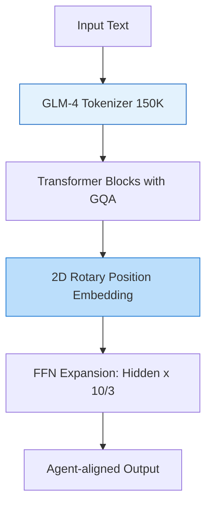

# GLM-4 核心技术专题索引

>  **[返回 14.6-GLM 家族总览](../../14.6-GLM.md)**

## 1. 技术问题定义与背景 (Technical Problem Definition)

从 ChatGLM 时代开始，智谱 AI(Zhipu AI)主导的 GLM 系列一直是国内开源/闭源模型的中坚力量。GLM-4 作为第四代旗舰模型，不再仅仅追求单一的对话生成，而是致力于打造一个**全能型通用智能体(All-Tools Agent)**基座。

它面临的核心技术挑战包括：
1. **中文原生的深度对齐**：如何在保证英文 Benchmark 不掉队的情况下，将中文知识、逻辑和指令遵循做到极致，而非仅仅是英文模型的“汉化版”。
2. **多工具协同计算(All-Tools)**：如何让模型自主规划任务，并在代码解释器(Code Interpreter)、网页浏览(Web Browsing)、文生图和外部 API 之间自由切换并传递状态。
3. **百万级上下文(1M Context)与显存控制**：把上下文从 32K 扩展到 128K 甚至 1M 时，如何解决长程注意力带来的灾难性内存暴涨。

## 2. 方法论拆解 (Method Breakdown)

### 2.1 广义自回归预训练 (GLM Architecture)

GLM 家族有别于标准的 Llama Decoder-only 架构。它在底层使用的是**广义自回归预训练(General Language Model)**机制，通过二维位置编码(2D RoPE)来实现自回归填空任务。

在 GLM-4 中，架构全面引入了 **Grouped-Query Attention (GQA)** 并结合 **SwiGLU** 激活函数。为了补偿 GQA 带来的参数减少，GLM-4 增加了 FFN(前馈神经网络)的隐藏层维度。

### 2.2 AgentTuning 与 All-Tools 训练范式

GLM-4 不是简单地在 SFT 阶段加入工具调用指令，而是通过 **AgentTuning** 框架进行系统性后训练：
- 构造了一个包含多步推理、错误纠正和跨工具通信的高质量轨迹(Trajectory)数据集。
- 使用 Reward Model 对 Agent 探索的轨迹进行打分，并采用 RLHF 进一步强化。

$$
 R(s, a) = R_{task}(s, a) + \lambda \cdot R_{tool\_efficiency}(s, a) - \gamma \cdot R_{hallucination}(s, a)
$$
(奖励函数不仅考虑任务是否完成，还惩罚无效的工具调用和幻觉)

### 2.3 LongAlign 长文本对齐

为了解决 1M 上下文，GLM-4 团队提出了 LongAlign，针对超长数据的微调进行了优化。它打包了不同长度的指令，平衡了长短文本在 batch 中的分布，防止模型在 SFT 阶段遗忘短上下文能力。

## 3. 工程实现与性能分析 (Engineering Analysis)

1. **词表扩展(Tokenizer Expansion)**：
   将词表扩大到 150K，大幅提高了多语言与代码的压缩率。这意味着在相同的 128K 窗口下，GLM-4 能塞入比 32K 词表模型多出 20%-30% 的实际中文信息。
2. **显存与推理优化**：
   通过 GQA 技术，128K 序列下的 KV Cache 大幅缩小，使得 GLM-4-9B 能够在单张 24GB 显存(如 RTX 3090/4090)的消费级显卡上流畅部署。

## 4. 边界与局限性说明 (Boundary Explanations)

- **非标准架构的适配摩擦**：GLM 的二维位置编码和特有的 Mask 机制导致其在接入某些通用推理框架(如早期版本的 vLLM 或 TGI)时，需要等待专门的算子支持，社区适配速度略慢于 Llama 系。
- **Agent 规划的幻觉**：在执行多步(超过 5 步)且涉及复杂网页解析的 All-Tools 任务时，GLM-4 仍会偶尔陷入“死循环调用”或提取错误网页元素的问题，这受限于当前纯文本 RLHF 的局限。
- **与闭源 MoE 的差距**：GLM-4 的 Dense 版本在算力转化率上，已逼近 Dense 的极限，面对后续多模态和万亿 MoE 的竞争，依然需要持续架构演进(这在后续的 GLM-4V 和 GLM-5 中得到体现)。

---

## 5. 子文档导航

- [GLM-4 技术报告精译](./01-GLM-4技术报告精译.md)
- [GLM-4 核心架构剖析](./02-GLM-4核心架构剖析.md)
- [GLM-4 技术报告 MinerU 逐段翻译](./04-GLM-4-mineru-zh.md)
- [GLM-4 核心架构与中文对齐设计剖析](./05-GLM-4-Architecture-Overview.md)

## 6. 附加资源

- [images](./images/images.md)
- [pdfs](./pdfs/pdfs.md)
