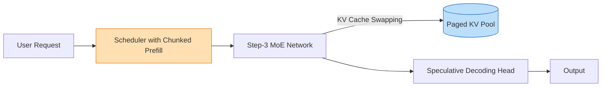

# Step-3 核心技术专题索引

> 🔙 **[返回 14.7-StepFun 家族总览](../../14.7-StepFun.md)**

## 1. 技术问题定义与背景 (Technical Problem Definition)

Step-3 是阶跃星辰(StepFun)推出的千亿参数级 MoE 语言模型。在国内大模型创业公司中，StepFun 以“模型-系统协同设计(Co-design)”著称。

Step-3 需要解决的核心问题是：在极其有限且异构的算力资源下，如何设计一个千亿参数级别的 MoE 模型，既能在能力上逼近国际一线，又能在端到端的解码与服务成本上实现极致压缩？
1. **异构集群下的长序列扩展**：如何在算力波动的智算中心完成极大规模的预训练。
2. **MoE 路由坍塌问题**：千亿模型在专家分配时极易出现“旱的旱死，涝的涝死”导致算力闲置。
3. **极高并发下的解码成本瓶颈**：如何缓解生成首字时间(TTFT)和每个 token 生成时间(TPOT)之间的矛盾。

## 2. 方法论拆解 (Method Breakdown)

### 2.1 高效 MoE 与 层次化负载均衡

Step-3 采用了细粒度专家和共享专家的混合架构，但在负载均衡上进行了自研改进。通过分层路由机制，保证在不同 Token 尺度上专家的激活概率趋于平稳。

$$ L_{balance} = \alpha \sum_{i=1}^{E} f_i P_i + \beta \text{KL}(P_{router} || P_{uniform}) $$

### 2.2 模型-系统协同设计 (Algorithm-System Co-design)

阶跃星辰的特色在于算法设计不仅仅为了跑分，而是为了契合底层的分布式系统特征：
- 算子层面的前向与反向重写。
- 动态 KV Cache 换入换出机制。

### 2.3 解码成本优化 (Decoding Cost Optimization)

采用多种并行解码技术，将自回归生成的延时大幅降低，极大拉低了商业 API 调用的成本。结合投机解码(Speculative Decoding)，不仅减少了主模型的激活次数，更在内存带宽受限的情况下提升了算力利用率(MFU)。

## 3. 工程分析与边界局限 (Engineering & Boundaries)

**工程亮点**：
- Step-3 展示了国内初创团队在缺乏无限算力的背景下，如何通过压榨系统层面的性能(定制 Cuda/Triton 内核、改进 Megatron 框架)来弥补算力差距。

**局限性**：
- **学术透明度**：相较于完全开源的 Qwen 或 DeepSeek，StepFun 的技术细节披露较少，部分协同设计的底层数据难以复现。
- **多语言生态**：专注于中文与英文，在国际化多语言测试集中的泛化能力边界仍未彻底探明。

---

## 4. 子文档与资源

### 核心解析
- [Step-3 技术报告精译](./01-Step-3技术报告精译.md)
- [Step-3核心架构剖析](./02-Step-3核心架构剖析.md)
- [Step-3模型-系统协同设计与解码成本优化剖析](./02-Step-3模型-系统协同设计与解码成本优化剖析.md)

### 附加资源
- [images](./images/images.md)
- [pdfs](./pdfs/pdfs.md)
