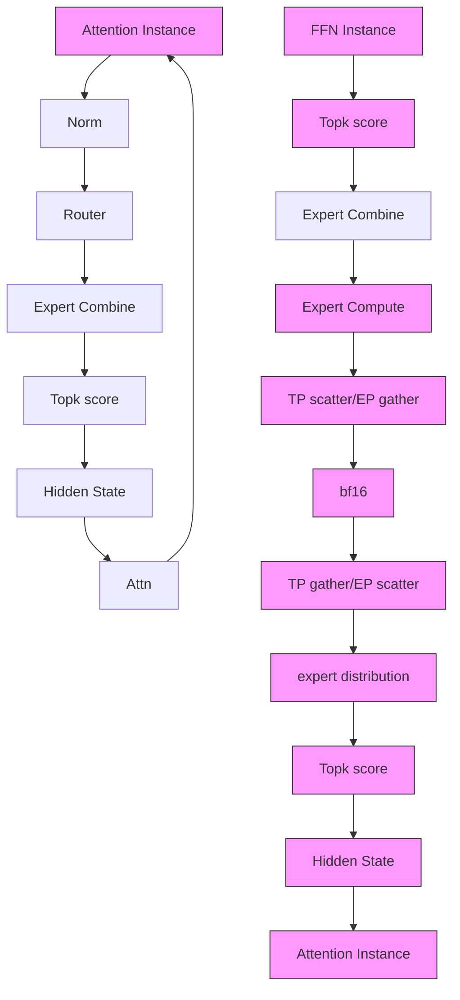
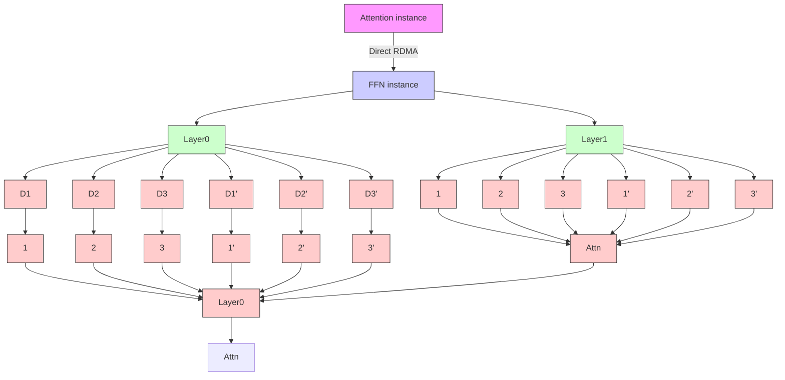
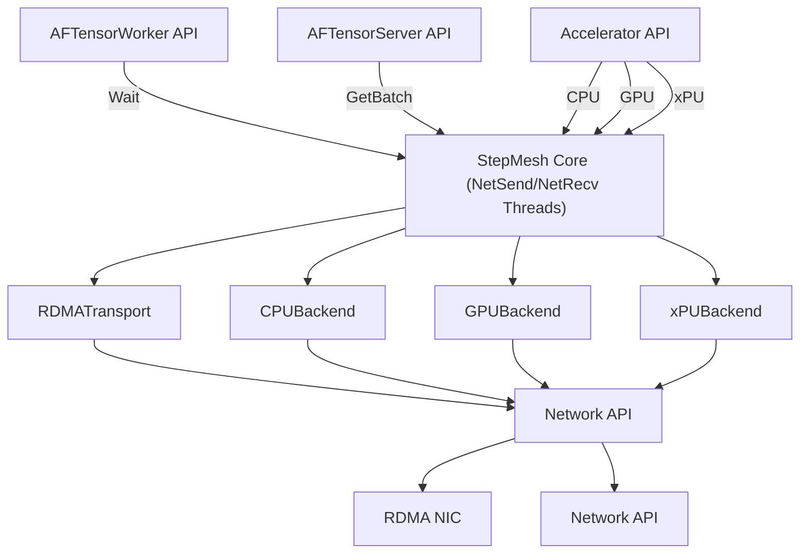

# Step-3 is Large yet Affordable: Model-system Co-design for Cost-effective Decoding

StepFun Inc.

# Abstract

Large language models (LLMs) face low hardware efficiency during decoding, especially for long-context reasoning tasks. This paper introduces Step-3, a 321B-parameter VLM with hardware-aware model-system co-design optimized for min imizing decoding costs. Step-3 innovates in two key dimensions: (1) A novel Multi-Matrix Factorization Attention (MFA) mechanism that significantly reduces both KV cache size and computation while maintaining high attention expressiveness, and (2) Attention-FFN Disaggregation (AFD), a distributed inference system that decouples attention and Feed-Forward Network (FFN) layers into specialized subsystems. This co-design achieves unprecedented cost efficiency: Step-3 significantly reduces theoretical decoding costs compared with models like DeepSeek-V3 and Qwen3 MoE 235B, with the gains widening at longer context. Step-3 achieves low cost while activating 38B parameters per token (more than DeepSeek-V3 and Qwen3 MoE 235B), demonstrating that hardware-aligned attention arithmetic intensity, MoE spar sity, and AFD are critical to cost-effectiveness. We perform a head-to-head comparison with DeepSeek-V3 in its favorable scenarios. Our implementation on Hopper GPUs achieves a decoding throughput of up to 4,039 tokens per second per GPU under 50ms TPOT SLA (4K context, FP8, no MTP). It is higher than DeepSeek-V3’s 2,324 in the same setup and sets a new Pareto frontier for LLM decoding.

# 1 Introduction

This paper presents the model-system co-design of Step-3, specifically engineered for the test-time scaling paradigm with the primary optimization objective of minimizing decoding costs. Step-3 has 321 billion total parameters, while for each text token, 38B parameters are activated. We will demonstrate that, although Step-3 is in the multi-hundred billion parameter range and the activated parameters are slightly larger than representative open-weight models like DeepSeek V3 (DSv3) [4], we achieve significantly lower decoding costs with model-system co-design.

We focus on optimizing decoding because 1) it is the most


<details>
<summary>scatter</summary>

| Model           | Theoretical decoding cost (USD), 8K context | Activated parameters |
| --------------- | ------------------------------------------- | -------------------- |
| Step-3          | 0.055                                       | 38                   |
| DMv3            | 0.068                                       | 37                   |
| Kimi K2         | 0.065                                       | 32                   |
| Qwen3 MoE       | 0.062                                       | 22                   |
| Pangu Pro       | 0.057                                       | 17                   |
| Llama 4 Maverick | 0.067                                       | 17                   |
| ERNIE4.5        | 0.085                                       | 48                   |
| Qwen3 32B       | 0.083                                       | 32                   |
| MM M1           | 0.095                                       | 46                   |
</details>

Figure 1: The Pareto frontier of recent models regarding activated parameters and decoding costs. The darker area is GQA models’ Pareto frontier. Note: Step-3 also has the highest attention effective rank [7], the same as DSv3 and doubling some other models like Qwen3 MoE 235B and Kimi K2.

expensive per token (because of low MFU) compared with training and prefill. 2) For reasoning models, longer thinking leads to higher intelligence, so lowering decoding costs can translate to higher intelligence for fixed-budget scenarios. 3) Faster and cheaper decoding also speeds up the RL training. 4) There is a large room for optimization and is therefore more technically interesting.

Recently, there emerged several large open-weight models. Some of them explored novel architecture changes on top of traditional Transformers. The innovations focus on the two main Transformer components – there are new attention designs to reduce KV cache overhead during inference, and there are Mixture-of-Experts (MoE) structures to enhance FFN while limiting the growth of computation requirements.

We also started to work on model architecture exploration, e.g., through MoE model development (Step-2 [20]) since late 2023 and MFA [7], a new attention architecture released in late 2024. In the process, observing the recent open-weight models, we identify two common suboptimal practices:

• For attention, some are overly emphasizing on reducing KV cache sizes, at excessive cost of computation load. It makes the model less cost-effective to run on more affordable but weaker hardware. Meanwhile, it limits the room for other acceleration techniques like quantization and speculative decoding.

• For FFN, some are overly emphasizing on pursuing sparser architectures without considering whether they fit today’s hardware. It either harms the hardware efficiency, or lowering model performance without gaining cost advantages.

Hoping to inspire more discussion and rethinking about the above trends, we report our recent progress, Step-3, and the analysis and rationale behind its design. The outcome is promising – in Figure 1, we show the best theoretical decoding costs of Step-3 and recent models. For each model, we searched for the best deployment strategy based on Attention FFN Disaggregation (AFD, §3), which we advocate, and any combination of H800, H20, A800 or Ascend 910B.1 Step-3 largely improves the Pareto frontier of activated parameters and decoding costs. Though not shown in the figure, its advantage continues to widen with longer context.

Our work is based on the assumption of deploying prior work of Prefill-Decoding (PD) disaggregation [18, 31]. With it, we can focus only on optimizing decoding, without worrying about the impact on prefill. Readers will see similar benefits of deploying AFD, i.e., how it allows us to divideand-conquer attention and FFN designs. It leads to a model architecture whose both parts are more cost-effective. We implement the inference system and show that Step-3 indeed achieves much lower decoding costs compared with other multi-billion parameter models.

Below is a summary of our findings.

• Decoding costs go beyond parameter count: Neither the total parameter count or activated parameter count is a good indicator for decoding costs.

– For example, Qwen-3 MoE 235B exhibits only 10% lower theoretical decoding cost (on H20, the best hardware for it) than DSv3 (on H800, the best hardware for DSv3) despite having 65% fewer total parameters and 40% fewer activated parameters.

– Step-3 achieves ∼ 40% decoding cost reduction versus both models despite its total parameter count being be tween the two models and having the highest activation parameters.

• The attention design dominates decoding costs: With AFD, we decouple the cost analysis of attention and FFN because we can run them in the most cost-effective way, respectively. Then it becomes apparent that the attention design has a larger impact on decoding costs than (total or

activated) parameter count.

• KV cache size is not the single factor impacting attention costs: We find that some attention designs requires too much computation (too high arithmetic intensity) for lowercost hardware platforms. More importantly, we are the first to show this problem indeed affects the final decoding costs and thus leaves large room for Step-3 to achieve significant cost savings.   
• MoE needs hardware-aware design: The degree of MoE sparsity must joinly consider hardware’s computation power, memory bandwidth and network bandwidth. Overly sparse models may have small activated parameters on paper, but run inefficiently on today’s hardware.   
• For decoding acceleration, the devil is in the details: Linear attention, quantization, and MTP are all promising directions to accelerate decoding. However, some design points that may seem nuance can remove most of the benefits in decoding.   
• AFD deployment: We believe it is the superior decoding system design compared with existing solutions, because of the following unique advantages:

– Facilitating divide-and-conquer model design.   
– Easy scaling of attention instances to handle dynamic context length.   
– Always keeping an ideal batch size for FFN to achieve high MFU, independent from attention.   
– Overlapping communication overhead with a perfectly balanced pipeline.   
– Reducing the scale requirement compared with DeepEP [30], and getting better reliability and less EP imbalance.   
– Allowing the use of heterogeneous hardware to further reduce decoding costs.

# 2 Step-3 Model Card

Before diving into the model-system co-design details, we briefly describe Step-3.

Step-3 is built upon the Transformer architecture [24], with each Transformer block comprising an attention module and a Feed-Forward Network (FFN). For the attention mechanism, we introduce Multi-Matrix Factorization Attention (MFA) [7], which leverages low-rank matrix factorization in the Query-Key (QK) circuit [5]. This design enables parameter-efficient scaling of both the number and dimensionality of attention heads while minimizing KV cache overhead. For FFNs, we adopt a shared expert design inspired by DeepSeekMoE, incorporating Mixture-of-Experts (MoE) layers. Our configuration includes 61 Transformer layers with a hidden dimension of 7168. For MFA, we configure 64 query heads and they share a Key and a Value head, all with a dimension of 256. The query dimension is down-projected from 7168 to a lower-rank of 2048, followed by a normalization, and then up-projected to 64\*256. MoE layers are applied to all FFNs except the first four and the last layer. Under this setup, Step-3 comprises

316 billion parameters, with 38 billion activated per token. There is an additional vision encoder of 5 billion parameters, which we do not discuss in this paper because it is irrelevant to decoding.

In the future, we will release more details on the model side for Step-3.

<table><tr><td></td><td>Step-3</td></tr><tr><td># Layers</td><td>61</td></tr><tr><td>Hidden Dimension</td><td>7168</td></tr><tr><td>Attention Mechanism</td><td>MFA</td></tr><tr><td>Low-rank Query Dimension</td><td>2048</td></tr><tr><td># Query Heads</td><td>64</td></tr><tr><td>Head Dimension</td><td>256</td></tr><tr><td># Shared Experts</td><td>1</td></tr><tr><td>MoE Layer Configuration</td><td>All layers except the first four and last layer</td></tr><tr><td>Total Parameters (LLM)</td><td>316 Billion</td></tr><tr><td>Activated Params per Token</td><td>38 Billion</td></tr><tr><td>Total Parameters (VLM)</td><td>321 Billion</td></tr></table>

Table 1: Model card for Step-3.

# 3 Attention-FFN Disaggregation

We start by describing Step-3 inference system, which may be one of the first production quality serving systems that leverages the Attention-FFN Disaggregation (AFD) idea and achieves high-throughput decoding under strict SLO con straints. First, we elaborate on the rationale behind the AFD design.

Rationale. LLMs are typically composed of interleaved attention and Feed-Forward Network (FFN) layers, each exhibiting distinct computational and memory access patterns. For example, attention layers typically have a smaller num ber of parameters, but require storing the key-value cache (KV-cache) for each token, which is memory-intensive during inference. In contrast, FFN layers generally take up a much larger parameter count, especially for MoE models, yet do not require storing intermediate computation results. We will dive into the operational characteristics and inference costs of attention and FFN layers in §4.

Existing serving systems often treat these layers as mono lithic blocks and overlook their intrinsic differences, leading to suboptimal GPU utilization. Hence, by disaggregating the attention and FFN components, we can better exploit their respective hardware affinities and optimize throughput. In addition, the disaggregation provides us with an opportunity to make an assumption: Both the attention and FFN parts can operate under ideal hardware conditions and can achieve high MFU, respectively.

This idea is based on the Prefill-Decoding (PD) disaggregation approach [31], which advocates separating the prefill and decoding stages to optimize resource utilization. Hence, we focus on the decoding stage with AFD without worrying about the impact on prefill. The analysis will become much simpler with this divide-and-conquer approach.

# 3.1 Design Goals

AFD deploys the attention and FFN layers onto separate sets of GPUs. This architectural separation allows each subsystem to adopt different parallelism strategies that best suit their computational characteristics. During layer-wise decoding, hidden states are transmitted between the attention and FFN subsystems through high-speed network communication. This interleaved communication pattern forms a tightly coupled pipeline, where attention and FFN act as upstream and downstream stages for each other.

Furthermore, network transmission latency must also be taken into account. In such fine-grained scenarios, its magnitude is comparable to the computation time of both attention and FFN stages. This means that the communication stage should also be considered when orchestrating the pipeline.

To achieve optimal overall performance, the processing la tency of both sides must be precisely matched; any imbalance leads to pipeline stalls or under-utilized resources. Therefore, it is essential to jointly orchestrate the performance of A/F and communication stages.

We summarize the design goals of AFD as follows, which will be discussed in detail later:

• Performance target: 50ms time per output token (TPOT, ≥ 20 tokens/sec) via a 3-stage pipeline, with 16.6ms per stage for A/F/communication, respectively. Here the time is accumulated across all model layers.3   
• Pipeline optimization: Resource allocation and performance tuning that enable perfect A/F/communication multistages pipelining, hiding communication latency.   
• Independent design of A/F: With AFD, we can independently analyze the operational characteristics of attention and FFN. This separation not only enables optimal optimization for each subsystem, but also allows for flexible architectural modifications to the model itself.   
• Hardware selection: Independent hardware selection for attention and FFN subsystems based on their operational characteristics.

# 3.2 Comparisons with Related Work

DeepSeek EP. Large Expert Parallelism (EP) architecture is introduced in DeepSeek-V3 [4] to improve serving efficiency. Although EP also facilitates batch size amplification by distributing expert weights to multiple devices, we argue that this approach exhibits fundamental limitations compared to AFD.

• Deployment scale: A key advantage of AFD is its ability to operate efficiently at a smaller deployment scale. As mentioned before, DSv3 requires 320 GPUs for a decoding instance, while Step-3 only uses 32 GPUs (§7.3). If the deployment scale expands significantly, network congestion becomes a critical issue [29], resulting in increased and unpredictable latency. This heightened latency can severely impact the serving system’s ability to meet inference SLA.

• Context-length efficiency: Long-context processing dispro portionately burdens EP’s attention layers, causing FFN under-utilized due to fixed expert-node allocation. AFD re solves this via decoupled scaling of attention and FFN. We will present quantitative results on different context lengths in §4.

• Load imbalance issue: EP suffers from the well-known workload imbalanced issue [13, 14]. DeepSeek-V3 allevi ates this issue using duplicated experts that can balance each GPU’s workload in an ad-hoc manner. But this ap proach incurs additional memory overhead, and is inflexi ble to dynamic workload changes, especially when the data distribution shifts significantly. On the other hand, AFD can easily leverage hybrid TP-EP strategy to strike a balance between computation efficiency, communication traffic, and load balancing.

• Heterogeneous hardware constraints: AFD enables more flexible hardware deployment, in that attention and FFN instances can be mapped to heterogeneous hardware tai lored to their respective compute and memory requirements, while EP forces homogeneous hardware deployment, limit ing specialization benefits.

• Performance modeling: Our following analytical frame work leverages the architectural disaggregation of attention and FFN. This separation provides methodological clarity due to their divergent computational profiles, which enables more accurate modeling of performance ceilings while sub stantially narrowing the gap between theoretical projections and empirical measurements. Contrarily, EP-only architec ture lacks this divide-and-conquer clarity, suffering from inherent analytical ambiguity when modeling coupled sub systems.

In particular, we note that AFD is not a replacement for EP, but rather a complementary approach. In fact, Step-3 can be combined with the TP-EP strategy to achieve better perfor mance and cost-effectiveness. The above analysis is against the EP-only architecture that does not employ AFD, which is commonly used in existing serving systems [4, 33].

Megascale-Infer. To our knowledge, Megascale-Infer [32] is the first to build a disaggregated serving system leveraging the AFD idea. However, it focuses on high throughput rather than providing a practical implementation to achieve the low latency target (i.e., 50ms TPOT) simultaneously. In fact, ac cording to [32], the reported latency per token of Megascale Infer is 150ms, which is significantly higher than ours. Such high latency is not applicable for real-time applications like chatbots. Moreover, the core of Step-3 is in model-system co-design, and we use the AFD idea to design Step-3’s model architecture for attention and FFN layers, while Megascale-Infer primarily only focuses on system-level optimizations. We believe the co-design brings more opportunities to thoroughly exploit the hardware capabilities.

# 4 Cost Analysis for LLM Decoding

Given the important assumption that, with AFD, the attention part and the FFN part can operate near hardware limitations, we will now delve into the theoretical costs of each model. We compare Step-3 with several recently released models, namely DSv3 [4], Kimi K2 [17], Qwen3-235B-A22B [8] (Qwen3- MoE for brevity), Qwen3-32B [25], Llama 4 Maverick [15], MiniMax M1 [16] (MM M1), ERNIE 4.5 [22], and Pangu Pro MoE [21].

# 4.1 Theoretical Flops and Memory Access

We begin by examining the overall memory access and computational operations required for decoding each token.

Given that various quantization methods directly impact memory access and the type of floating point computation, we select widely used quantized versions for each model:

• MLA family: The official implementation of DSv3 uses BF16 for attention, with other parts in FP8. However, recognizing the existence of an FP8 quantized version of MLA within the open-source community, we adopt FP8 quantization for the whole model. The same quantization is applied to Kimi K2.

• GQA family: The official release of Qwen3 includes full FP8 quantization, which we will use. For other models like ERNIE 4.5 and Pangu Pro MoE, to align with Qwen3, we also use the same quantization. We believe the risk of losing model accuracy is low given our own experience with GQA models.

• Hybrid models: The official quantization of Llama 4 Maverick and MiniMax M1 is conservative, especially for attention. As hybrid attention model’s quantization remains largely unexplored for us, we mostly follow the official setup, i.e., BF16 KV for full attention layers because they are critical for long context tasks. We use FP32 for Mini-Max M1’s Lightning Attention states, the same as its official setup. We give Llama 4 Maverick a favor for using FP8 for its chunked GQA attention, again based on our experience with GQA. For all the other parts we adopt the same aggressive FP8 quantization like all other evaluated models, to have a fair comparison.

• Step-3: we have successfully quantized Step-3 to be a full FP8 model without losing model accuracy. So we use full FP8 quantization, which aligns with MLA and GQA faimly.

If the hardware does not support FP8 quantization, we assume the use of INT8 weights and INT8 KV cache instead of FP8, so the memory access remains the same. The computa-

<table><tr><td>Model</td><td>KV/State Memory Access (bytes)</td><td>Attention Computation w/o Linear (FLOPs)</td><td>Linear before and after Attention (FLOPs)</td><td>FFN Computation (FLOPs)</td></tr><tr><td>DSv3</td><td> $2.88 \times 10^{8}$ </td><td> $1.47 \times 10^{11}$ </td><td> $2.28 \times 10^{10}$ </td><td> $4.84 \times 10^{10}$ </td></tr><tr><td>Kimi K2</td><td> $2.88 \times 10^{8}$ </td><td> $7.37 \times 10^{10}$ </td><td> $1.23 \times 10^{10}$ </td><td> $4.84 \times 10^{10}$ </td></tr><tr><td>Qwen3 MoE</td><td> $7.89 \times 10^{8}$ </td><td> $2.52 \times 10^{10}$ </td><td> $1.34 \times 10^{10}$ </td><td> $2.84 \times 10^{10}$ </td></tr><tr><td>Qwen3 32B</td><td> $1.07 \times 10^{9}$ </td><td> $1.72 \times 10^{10}$ </td><td> $1.21 \times 10^{10}$ </td><td> $5.03 \times 10^{10}$ </td></tr><tr><td>Llama 4 M</td><td> $1.01 \times 10^{9}$ </td><td> $8.05 \times 10^{9}$ </td><td> $6.04 \times 10^{9}$ </td><td> $2.42 \times 10^{10}$ </td></tr><tr><td>MM M1</td><td> $9.23 \times 10^{8}$ </td><td> $3.42 \times 10^{9}$ </td><td> $3.75 \times 10^{10}$ </td><td> $5.44 \times 10^{10}$ </td></tr><tr><td>ERNIE 4.5</td><td> $9.06 \times 10^{8}$ </td><td> $1.45 \times 10^{10}$ </td><td> $1.63 \times 10^{10}$ </td><td> $7.61 \times 10^{10}$ </td></tr><tr><td>Pangu Pro</td><td> $8.05 \times 10^{8}$ </td><td> $8.05 \times 10^{9}$ </td><td> $6.04 \times 10^{9}$ </td><td> $2.38 \times 10^{10}$ </td></tr><tr><td>Step-3</td><td> $2.56 \times 10^{8}$ </td><td> $3.27 \times 10^{10}$ </td><td> $2.07 \times 10^{10}$ </td><td> $5.33 \times 10^{10}$ </td></tr></table>

Table 2: Theoretical computation and memory access per decoding token at 8K context length.

<table><tr><td>Model</td><td>KV/State Memory Access (bytes)</td><td>Attention Computation w/o Linear (FLOPs)</td><td>Linear before and after Attention (FLOPs)</td><td>FFN Computation (FLOPs)</td></tr><tr><td>DSv3</td><td> $1.15 \times 10^{9}$ </td><td> $5.89 \times 10^{11}$ </td><td> $2.28 \times 10^{10}$ </td><td> $4.84 \times 10^{10}$ </td></tr><tr><td>Kimi K2</td><td> $1.15 \times 10^{9}$ </td><td> $2.95 \times 10^{11}$ </td><td> $1.23 \times 10^{10}$ </td><td> $4.84 \times 10^{10}$ </td></tr><tr><td>Qwen3 MoE</td><td> $3.15 \times 10^{9}$ </td><td> $1.01 \times 10^{11}$ </td><td> $1.34 \times 10^{10}$ </td><td> $2.84 \times 10^{10}$ </td></tr><tr><td>Qwen3 32B</td><td> $4.29 \times 10^{9}$ </td><td> $6.87 \times 10^{10}$ </td><td> $1.21 \times 10^{10}$ </td><td> $5.03 \times 10^{10}$ </td></tr><tr><td>Llama 4 M</td><td> $2.21 \times 10^{9}$ </td><td> $1.41 \times 10^{10}$ </td><td> $6.04 \times 10^{9}$ </td><td> $2.42 \times 10^{10}$ </td></tr><tr><td>MM M1</td><td> $1.93 \times 10^{9}$ </td><td> $1.15 \times 10^{10}$ </td><td> $3.75 \times 10^{10}$ </td><td> $5.44 \times 10^{10}$ </td></tr><tr><td>ERNIE 4.5</td><td> $3.62 \times 10^{9}$ </td><td> $5.80 \times 10^{10}$ </td><td> $1.63 \times 10^{10}$ </td><td> $7.61 \times 10^{10}$ </td></tr><tr><td>Pangu Pro</td><td> $3.22 \times 10^{9}$ </td><td> $3.22 \times 10^{10}$ </td><td> $6.04 \times 10^{9}$ </td><td> $2.38 \times 10^{10}$ </td></tr><tr><td>Step-3</td><td> $1.02 \times 10^{9}$ </td><td> $1.31 \times 10^{11}$ </td><td> $2.07 \times 10^{10}$ </td><td> $5.33 \times 10^{10}$ </td></tr></table>

Table 3: Theoretical computation and memory access per decoding token at 32K context length.

tion will be in BF16 or FP16.

The results are listed in Table 2 and 3. With the assumption of AFD, we divide the model costs into three parts: attention (without linear projection), the linear projection before and after attention, and FFN. For the first part, we consider the KV cache size and the computation simultaneously, since they grow linearly with batch size and context length.

For the linear projection before and after attention, we assume they can achieve compute-bound performance with sufficient batching. In this case, the memory access of the weights is amortized, and the costs will be determined by FLOPs. There is an exception where the $q / k / \nu .$ \_pro j of MLA and MFA may not be able to run in H800’s compute-bound area, due to those parts not being TP-friendly and may not have a large enough batch size for H800. This means we slightly underestimate MLA and MFA costs on H800. However, this is a relatively small part of the total costs and specific to H800, so we omit it for simplicity.

For FFN, we focus only on the activated computation volume because, using AFD for not-too-sparse MoE, sufficient batching can always be accumulated for FFN to reach high MFU and amortize the memory access for weights. Further details on MoE sparsity are discussed in the §5. In the worst case, over-sparse models like DSv3, Kimi K2 and Llama 4 Marverick may see their FFN cost doubling or even tripling on H800 in real deployment. For now, we omit it for simplicity and give them a favor.

We also omit the embedding table and the final output linear layer since they consume relatively small $( < 5 \% )$ memory access and computation for these models, and they are not too different across different models.

# 4.2 Theoretical Decoding Cost in USD

Next, we can calculate the theoretical decoding costs of the models on different accelerators. Table 4 shows the accelerator specifications and their estimated prices on public clouds.

Suppose, in the theoretically ideal case, accelerators constantly at their peak FLOPs and maximum memory bandwidth, we derive the unit costs of a floating-point operation $( U _ { F L O P } )$ and a byte of memory access $( U _ { b y t e } )$ , in Table 5.

The theoretical cost of the attention part is the larger of the attention’s core computation and memory access costs, plus the linear computation before and after:

$$
\max \left(F L O P _ {\text { Attn }} U _ {F L O P}, \text { Byte } _ {K V} U _ {\text { byte }}\right) + F L O P _ {\text { Linear }} U _ {F L O P}
$$

Assuming, with AFD, we can keep the FFN part in the compute-bound region, the theoretical cost of the FFN part is simply the computation cost $F L O P _ { F F N } U _ { F L O P }$ .

<table><tr><td>Accelerator</td><td>Price per card per hour (USD)</td><td>BF16/FP16 FLOPs</td><td>FP8 FLOPs</td><td>Memory bandwidth (B/s)</td><td>Compute-bandwidth ratio (roofline)</td></tr><tr><td>NVIDIA H800</td><td>2</td><td> $9.89 \times 10^{14}$ </td><td> $1.98 \times 10^{15}$ </td><td> $3.35 \times 10^{12}$ </td><td>591</td></tr><tr><td>NVIDIA H20</td><td>0.8</td><td> $1.48 \times 10^{14}$ </td><td> $2.96 \times 10^{14}$ </td><td> $4.00 \times 10^{12}$ </td><td>74</td></tr><tr><td>NVIDIA A800</td><td>0.75</td><td> $3.12 \times 10^{14}$ </td><td>N/A</td><td> $2.00 \times 10^{12}$ </td><td>156</td></tr><tr><td>Ascend 910B</td><td>0.67*</td><td> $2.80 \times 10^{14}$ </td><td>N/A</td><td> $1.60 \times 10^{12}$ </td><td>175</td></tr></table>

Table 4: Comparison of accelerator specifications. \*We do not have publicly available 910B pricing. We estimate its price proportionally based on its FLOPs and A800’s. As far as we know, there are multiple versions of 910B. We show the weakest and (presumably) most affordable one that we know.

<table><tr><td>Accelerator</td><td>Cost per FLOP</td><td>Cost per byte of memory access</td></tr><tr><td>H800</td><td> $2.80 \times 10^{-19}$ </td><td> $1.66 \times 10^{-16}$ </td></tr><tr><td>H20</td><td> $7.51 \times 10^{-19}$ </td><td> $5.56 \times 10^{-17}$ </td></tr><tr><td>A800</td><td> $6.68 \times 10^{-19}$ </td><td> $1.04 \times 10^{-16}$ </td></tr><tr><td>910B</td><td> $6.65 \times 10^{-19}$ </td><td> $1.16 \times 10^{-16}$ </td></tr></table>

Table 5: The unit cost of different accelerators assuming full utilization for the whole month. For FLOP costs, we consider FP8 for H800 and H20, BF16/FP16 for A800 and 910B.

Combining the attention and FFN parts, we obtain Table 6. The final costs of different deployment choices can be directly computed. For example, we can add the attention and FFN parts together for different context on each hardware. For AFD, we choose the cheapest hardware for attention cost and FFN cost, respectively, and then sum them up. We assume all communication time on network can be overlapped by computation in a multi-batch pipeline, so the communication costs are ignored.

For brevity, we only show the results of Qwen family (representative for GQA models), DSv3 (representative for MLA models), and Step-3 in Figure 2. With all the results shown, we make the following observations:

Observation 1: Step-3 has the lowest decoding costs. When at 8K context length, Step-3 is the most cost-effective at 0.055 per 1M decoding tokens (with AFD, H800 and H20), lower than DSv3’s 0.068 (with EP and H800) and Qwen MoE’s 0.062 (with AFD, H800 and H20). The advantage is larger at 32K context, with Step-3 at 0.129, significantly lower than DSv3’s 0.211 and Qwen-3 MoE’s 0.193.

Observation 2: Total and activated parameter numbers are bad indicator for decoding costs. Qwen3 32B has much less total parameters than DSv3 and Step-3, and also slightly less activated parameters. However, the decoding cost of Qwen3 32B is the highest among all models in Figure 2.

Observation 3: The cost of attention is dominating the

total decoding cost. It is clear in Table 6, at 8K context length, attention is already significantly more expensive than FFN. The gap grows quickly with longer context, given that FFN’s cost is irrelevant to context length. This means the attention design matters much more than activated number of parameters – that’s the reason for Observation 2.

Observation 4: Hardware friendliness. DSv3’s MLA is quite unfriendly to hardware other than H800, resulting in multi-fold increase when running on hardware weaker than H800. GQA models like Qwen3 are quite unfriendly to hardware other than H20, because of large KV sizes. In contrast, Step-3’s MFA is more hardware-friendly, with minimal cost differences for weaker hardware. We show this in Figure 2.

# 4.3 Demystifying Model Design Choices

In this section, we discuss some ongoing model design trends in the community. We especially focus on the decoding phase.

Linear attention and hybrid models. Linear attention is a promising direction but still faces challenges in long context tasks. A practical workaround is “hybrid models”, which consist of two types of attention layers; most are linear attention, while the rest are traditional full attention. For example, MM M1, using a hybrid architecture with 70 layers of linear attention and 10 layers of GQA full attention, exhibits significantly slower KV growth with context length compared to full-GQA models like Qwen3. The design of Llama 4 Maverick is similar except for the layer numbers.

However, such hybrid models have two additional challenges for inference systems.

First, while the number of full attention layers seems small, they may still ruin the point of using linear attention for saving KV cache. MM M1 and Llama 4 Maverick’s full attention part alone (based on the official quantization scheme) has a larger KV cache volume than Step-3’s entire model. No matter how much the rest of the linear attention layers save, no matter how long the context is, the total memory access will be larger than Step-3, as shown in Figure 3.

Second, the time spent on each layer will be largely unbalanced – when running with long context, the full GQA layers consume much more time than the linear attention layers. This may not be a problem for single-node inference deployment, but can be quite troublesome for distributed inference deploy ment (especially AFD) when one tries to build a pipeline to hide communication time. The imbalance of layer times can cause significant pipeline bubbles.

<table><tr><td rowspan="2">Model</td><td colspan="4">Attention cost per 1M tokens (8k)</td><td colspan="4">Attention cost per 1M tokens (32k)</td><td colspan="4">FFN cost per 1M tokens</td></tr><tr><td>H800</td><td>H20</td><td>A800</td><td>910B</td><td>H800</td><td>H20</td><td>A800</td><td>910B</td><td>H800</td><td>H20</td><td>A800</td><td>910B</td></tr><tr><td>DSv3</td><td>0.054</td><td>0.128</td><td>0.114</td><td>0.113</td><td>0.197</td><td>0.460</td><td>0.409</td><td>0.407</td><td>0.014</td><td>0.036</td><td>0.032</td><td>0.032</td></tr><tr><td>Kimi K2</td><td>0.051</td><td>0.065</td><td>0.057</td><td>0.057</td><td>0.194</td><td>0.231</td><td>0.205</td><td>0.204</td><td>0.014</td><td>0.036</td><td>0.032</td><td>0.032</td></tr><tr><td>Qwen3 MoE</td><td>0.135</td><td>0.054</td><td>0.091</td><td>0.101</td><td>0.527</td><td>0.185</td><td>0.338</td><td>0.376</td><td>0.008</td><td>0.021</td><td>0.019</td><td>0.019</td></tr><tr><td>Qwen3 32B</td><td>0.181</td><td>0.069</td><td>0.120</td><td>0.133</td><td>0.716</td><td>0.248</td><td>0.455</td><td>0.508</td><td>0.014</td><td>0.038</td><td>0.034</td><td>0.033</td></tr><tr><td>Llama 4 M</td><td>0.169</td><td>0.060</td><td>0.109</td><td>0.121</td><td>0.369</td><td>0.128</td><td>0.235</td><td>0.262</td><td>0.007</td><td>0.018</td><td>0.016</td><td>0.016</td></tr><tr><td>MM M1</td><td>0.164</td><td>0.079</td><td>0.121</td><td>0.132</td><td>0.330</td><td>0.135</td><td>0.226</td><td>0.249</td><td>0.015</td><td>0.041</td><td>0.036</td><td>0.036</td></tr><tr><td>ERNIE 4.5</td><td>0.155</td><td>0.063</td><td>0.105</td><td>0.116</td><td>0.606</td><td>0.214</td><td>0.388</td><td>0.432</td><td>0.021</td><td>0.057</td><td>0.051</td><td>0.051</td></tr><tr><td>Pangu Pro MoE</td><td>0.135</td><td>0.049</td><td>0.088</td><td>0.098</td><td>0.536</td><td>0.183</td><td>0.340</td><td>0.379</td><td>0.007</td><td>0.018</td><td>0.016</td><td>0.016</td></tr><tr><td>Step-3</td><td>0.048</td><td>0.040</td><td>0.040</td><td>0.043</td><td>0.176</td><td>0.114</td><td>0.120</td><td>0.133</td><td>0.015</td><td>0.040</td><td>0.036</td><td>0.035</td></tr></table>

Table 6: Theoretical decoding cost analysis for each model on each hardware, in USD. As a reminder, these models have different number of activated parameters: DSv3 37B, Qwen3 MoE 22B, Qwen3 32B, MM M1 46B, ERNIE 4.5 47B, Pangu Pro MoE 16.5B and Step-3 38B.


<details>
<summary>bar</summary>

| Deployment setup | DSv3  | Qwen3 MoE | Qwen3 32B | Step-3 |
| ---------------- | ----- | --------- | --------- | ------ |
| H800             | 0.07  | 0.14      | 0.195     | 0.065  |
| H20              | 0.165 | 0.075     | 0.105     | 0.08   |
| A800             | 0.145 | 0.11      | 0.155     | 0.078  |
| 910B             | 0.145 | 0.12      | 0.165     | 0.08   |
| AFD              | 0.07  | 0.065     | 0.085     | 0.055  |
</details>


<details>
<summary>bar</summary>

| Deployment setup | DSv3  | Qwen3 MoE | Qwen3 32B | Step-3 |
| ---------------- | ----- | --------- | --------- | ------ |
| H800             | 0.21  | 0.54      | 0.73      | 0.19   |
| H20              | 0.50  | 0.21      | 0.29      | 0.16   |
| A800             | 0.44  | 0.36      | 0.49      | 0.16   |
| 910B             | 0.44  | 0.40      | 0.54      | 0.17   |
| AFD              | 0.21  | 0.19      | 0.27      | 0.13   |
</details>

Figure 2: Decoding costs (per 1M tokens) of different models and inference configurations. For AFD, we combine the lowest costs on different hardware for attention and FFN, respectively. Reminder: Step-3 has the most activated parameters among them.

In Figure 3, we compare MM M1 and Llama 4 Maverick with Step-3 using a single hardware (H800) setup. Due to the reason above, they always have higher decoding costs than Step-3 despite most of their layers being linear attention. Admittedly, using hardware with cheaper memory bandwidth (like H20) can largely narrow the gap. But fundamentally, they require more KV cache access than Step-3 in the end.

We call for hybrid model designs that are more friendly to inference systems. One should design the full attention part carefully so that it does not ruin the cost saving from linear attention. Also, try to make every layer hybrid so that the time for each layer is balanced, instead of having a few slow layers that may limit the potentials of running in a distributed pipeline.

“Hardware-optimized design” – for training or decoding?

Designing a model that is optimized for a given hardware is


<details>
<summary>line</summary>

| Context length (K tokens) | Llama 4 M | MM M1 | Step-3 |
| ------------------------- | --------- | ----- | ------ |
| 8                         | 1.0       | 1.0   | 0.5    |
| 32                        | 2.5       | 2.0   | 1.0    |
| 128                       | 7.0       | 6.0   | 4.0    |
</details>


<details>
<summary>line</summary>

| Context length (K tokens) | Llama 4 M | MM M1 | Step-3 |
| ------------------------- | --------- | ----- | ------ |
| 8                         | 0.2       | 0.2   | 0.1    |
| 32                        | 0.4       | 0.4   | 0.2    |
| 128                       | 1.0       | 1.0   | 0.7    |
</details>

Figure 3: Total KV cache size and decoding cost comparison on H800 with hybrid linear attention models like MiniMax M1 and Llama 4 Maverick.

not a new concept. In this paper, we include Pangu Pro MoE, a model claimed to be specifically optimized for Huawei’s own accelerator, 910B.

However, in our analysis, the decoding cost of Pangu Pro MoE on 910B is not low – it is theoretically much larger than


<details>
<summary>bar</summary>

| Different scenarios on 910B | Pangu MoE | Step-3 |
|---|---|---|
| Decoding, 8K | 0.114 | 0.078 |
| Decoding, 32K | 0.395 | 0.168 |
| Training, 8K | 0.076 | 0.213 |
</details>

Figure 4: Step-3 and Pangu Pro MoE have very different trends of decoding cost and training cost.

Step-3 (Figure 4). Remember, Pangu Pro MoE has only 16.5B activated parameters, less than half of Step-3’s! It is evident that Pangu Pro MoE’s decoding on 910B is not cost-effective at all.

To be fair, the main focus of Pangu Pro MoE was not about decoding cost, it was about training. We also show a rough estimation of training cost per 1M token assuming 100% MFU,4 purely based on the theoretical FLOPs. We see that Pangu Pro MoE indeed is more than 50% cheaper than Step-3 to train, reflecting the difference in activated parameters.

The lesson is, be clear about the goal during model-system co-design. Training and inference can be vastly different. Training costs are largely tied to the number of activated parameters, while lowering decoding costs requires additional model-system co-design. We will discuss the co-design points immediately.

# 5 Model-System Co-design

# 5.1 Matching Attention Arithmetic Intensity with Hardware

Readers paying attention (pun intended) may notice that in Tables 2 and 3, Step-3 ’s MFA exhibits only a 10% reduction in KV memory access volume compared with DSv3’s MLA. Yet in Table 6, Step-3 ’s attention cost is reduced by half or more in many cases. Why? The result stems from the design of MFA.

As pointed out in prior work [26, 27], each attention design has an inherent property called arithmetic intensity. It is the ratio of the arithmetic operations needed for each byte of KV accessed from memory. Different batch sizes or context lengths do not change the arithmetic intensity.

The better the match between attention’s arithmetic intensity and a hardware’s “computation-bandwidth ratio” (or referred to as roofline) (see Table 4), the more likely it is to achieve good efficiency on that hardware. Otherwise, significant bottlenecks may occur, either compute-bound or memorybound.


<details>
<summary>line</summary>

| Memory access (GB) | Compute (GFLOPs) | Hardware     |
| ------------------ | ---------------- | ------------ |
| 0.3                | 150              | H800         |
| 1.0                | 600              | DSv3, 8K-32K |
| 1.0                | 130              | Step-3, 8K-32K |
| 0.8                | 20               | Qwen3 MoE, 8K-32K |
| 3.2                | 100              | 910B         |
</details>

Figure 5: The compute and memory access of different attention designs during decoding, including DSv3’s MLA, Qwen3 MoE’s GQA and Step-3’s MFA. The compute-memorybandwidth ratios of different hardware are also plotted.

With Step-3’s MFA design, its arithmetic intensity is 128 (assuming 8-bit quantization of KV). It is much closer to A800 (roofline is 156) and 910B (roofline is 175) than DSv3’s MLA (arithmetic intensity is 512). On H20 (roofline is 74), Step-3’s gap is also not too large compared with Qwen3 MoE (arithmetic intensity is 32). To better illustrate, we show the above models and hardware in Figure 5. We show how compute and memory access grows with context length, from 8K to 32K, for each model. Correspondingly, we also plot a line for each hardware with the slope based on their computationbandwidth ratio.

In Figure 5, it is also clear that Step-3’s MFA achieves low computation and memory access simultaneously. Namely, its required computation is one-fourth of DSv3’s, and its required memory access is one-third of Qwen3’s. This enables Step-3 to maintain low costs even on accelerators whose roofline does not match Step-3 well.

Step-3’ MFA achieves the more balanced arithmetic intensity and low overhead without cutting corners. In fact, its attention effective rank [7] is 16,384, the same as DSv3’s MLA and larger than Qwen3 MoE’s 8,192.

Step-3 chooses slightly lower arithmetic intensity than most of the hardware’s roofline, to leave room for future optimizations like quantization and MTP, as discussed next.

# 5.2 Discussion: Quantization and MTP

Quantization: All models can adopt more aggressive quantization strategies than those we have assumed. A particularly noteworthy quantization approach is low-bit storage with high-bit computation, e.g., storing KV in 4-bit but performing attention calculation in 8-bit. This effectively doubles the arithmetic intensity of each attention design. Such a change has different meanings for different attention designs. We still use DSv3, Qwen3, and Step-3 as examples:

• Implications for DSv3: Because DSv3’s arithmetic intensity is already close to H800’s roofline and much higher than other hardware, such quantization scheme will not improve efficiency.   
• Implications for Qwen3: It might enable GQA-family models to get closer to or surpass H20’s roofline. It can benefit on all hardware listed.   
• Implications for Step-3: This could potentially turn arithmetic intensity to exceed the roofline of A800 and 910B, but still not far off. There should be moderate performance gain. It may benefit a lot on H800 with higher roofline.

For quantization schemes that use the same format for KV storage and attention computation (assuming the hardware has native support), we anticipate that those will not significantly alter the overall trends of different models.

Regarding hybrid models like MM M1, many (including ourselves) may wonder if aggressive KV quantization is feasible. However, given that there are only 8 layers of full atten tion and they might be more sensitive to quantized KV, we adopt a more conservative approach – using the official setup – in this paper. We look forward to more in-depth research on this topic.

Multi-Token Prediction (MTP): MTP and the "low-bit storage, high-bit computation" quantization scheme have similar effects on arithmetic intensity – doubling (or even multiply ing) it. Therefore, similar to the previous discussion, DSv3 is the least MTP-friendly model. GQA and MFA (Step-3) models can leverage MTP to enhance throughput on various hardware.

However, MTP’s impact is global – enabling MTP also alters the computation load of FFN. Under the assumption of AFD, where FFN can always get enough batch to run with high MFU (see the next section), MTP could actually incur additional costs. MTP is not 100% accurate in predicting additional tokens, yet FFN’s cost is always increased regardless of prediction accuracy. One must be very careful in deciding whether to enable MTP.

Summary: Step-3’s MFA design and its arithmetic intensity allows applying further KV quantization or enabling MTP to gain further cost savings than the results in Table 6. In principle, Qwen3 and other GQA-based models could benefit from similar mechanisms. However, due to the high arithmetic intensity of its MLA, DSv3 may not see substantial benefits from further KV storage quantization or enabling MTP in large-batch, high-throughput scenarios.

# 5.3 FFN’s Batch Requirement for High MFU

Next, we discuss the costs of the Feed-Forward Network (FFN). The majority of FFN computation involves matrix multiplications, with a very small portion for activation functions. Most memory accesses are for model weights, with a very smaller portion for input and output hidden features. For simplicity, we will focus on matrix multiplications and model weight accesses.

For the matrix multiplication in FFN computation, the num ber of floating-point operations (FLOPs) is given by:

$$
2 \times N _ {\text { token }} \times W _ {\text { FFN }}
$$

where $N _ { \mathrm { t o k e n } }$ represents the number of tokens processed in a batched FFN computation. In decoding, it is equivalent to the batch size B entering the FFN (without MTP). WFFN denotes the number of model weights in the FFN. Clearly, the computation-to-memory access ratio (assuming 8-bit weight storage) is $2 \times N _ { \mathrm { t o k e n } } , \mathrm { o r } 2 \times B .$

In the roofline model, to achieve good MFU, the computation-to-memory access ratio should at least match the hardware’s roofline, as shown in Table 4. The corresponding ideal batch size, denoted as $B _ { \mathrm { d e n s e } }$ , should at least be:

$$
2 \times B _ {\text { dense }} \geq \frac {\text { FLOPs }}{\text { Bandwidth }}
$$

With a batch size that activates all experts, MoE increases the proportion between memory accesses and computation. We define the sparsity of MoE as S. For example: - If 2 experts are chosen from 8, then $S = { \frac { 1 } { 4 } } . - \operatorname { I f } 8$ experts are chosen from 256 plus one shared expert, then S = 9256 . $\begin{array} { r } { S = \frac { 9 } { 2 5 6 } } \end{array}$

For MoE models, the ideal batch size for high MFU is:

$$
B _ {\mathrm{MoE}} = \frac {B _ {\mathrm{dense}}}{S}
$$

which can be several to tens of times larger than in dense models. Combined with the above equations, we get:

$$
B _ {\mathrm{MoE}} \geq \frac {\text { FLOPs }}{2 \times S \times \text { Bandwidth }}
$$

# 5.4 Optimal MoE Sparsity vs. Hardware

For contemporary models with hundreds of billions of parameters and long sequence inference, the memory capacity of a single machine often cannot support the appropriate batch size, necessitating distributed deployment. Whether using EP deployment [30] or AFD in this paper, the hardware running FFN computations needs to receive input hidden features (with dimension H) via the network and transmit the FFN computation results back via the network. Assuming 8-bit precision dispatch and 16-bit precision combine, and a batch size that meets high MFU requirements, the total transmission volume is:

$$
3 \times H \times B _ {\mathrm{MoE}}
$$

With AFD and an ideal three-stage pipeline and the TPOT target of 50ms, we need to keep the network communication time below 50ms/3 = 16.6ms. We denote network bandwidth as Net, distinguished from memory bandwidth Bandwidth, we get:

$$
\frac {3 \times H \times B _ {\mathrm{MoE}}}{\mathrm{Net}} \leq \frac {1 6 . 6 \mathrm{ms}}{L}
$$

where L is the number of model layers. Substituting the expression for $B _ { \mathrm { M o E } }$ , we obtain:

$$
\frac {H \times \text { FLOPs } \times L}{\text { Net } \times S \times \text { Bandwidth }} \leq \frac {1 6 . 6 \mathrm{ms} \times 2}{3} = 1 1. 1 \mathrm{ms}
$$

We can derive the "optimal MoE sparsity" acceptable by the hardware, referring to the sparsest MoE configuration that the hardware can support to achieve ideal MFU while perfectly hiding network communication:

$$
S \geq \frac {H \times \text { FLOPs } \times L}{\text { Net } \times \text { Bandwidth } \times 1 1 . 1 \text { ms }}
$$

Next, we use Step-3’s MoE architecture as an example. Its hidden feature size is 7168 and the number of layers L is 61. Those numbers are identical to DSv3. We substitute the hardware parameters for each accelerator. We assume H800 and H20 use 400Gbps × 8 NICs, while A800 and 910B use $2 0 0 G b p s \times 8 \mathrm { N I C s } ^ { 5 }$ . Table 7 shows the results.

<table><tr><td>Accelerator</td><td>H800</td><td>H20</td><td>A800</td><td>910B</td></tr><tr><td>Minimum S</td><td>0.058</td><td>0.007</td><td>0.031</td><td>0.034</td></tr></table>

Table 7: Minimum MoE sparsity for different hardware plat forms to achieve good MFU, where $H = 7 1 6 8 , L = 6 1$ .

It is clear that the optimal MoE sparsity varies significantly across hardware platforms. H20 can accommodate the sparsest MoE configuration due to its lower computational power and higher memory bandwidth, allowing it to achieve high MFU with a smaller batch size and better tolerate MoE spar sity. H800 is the least friendly to very sparse MoE. However, H800 has the most affordable unit cost per FLOP (Table 5).

To ensure that Step-3 can leverage high-roofline hardware like H800, we make sure Step-3 is not sparser than 0.058. In contrast, DSv3, for example, would require (256 + 1) × 0.058 − 1 = 14 MoE experts6 to be activated to achieve good MFU on H800, which is much larger than the official 8 activated experts. In other words, if DSv3 activates more experts, the decoding costs may not rise much. It means it may be leaving extra model performance on the table.

Even worse, unideal hardware efficiency may exaggerate the problem. For example, on the H800 platform with DeepEP [30], the measured average throughput per network card is 40GB/s instead of 50GB/s, which can lead to a 25% increase in the optimal sparsity, e.g., 0.073 for H800. Considering all these, Step-3 chooses a sparsity of around 0.08 (including shared expert).

Being even sparser, Llama 4 Maverick and Kimi K2 will be even further from the high MFU region when running on H800.

To clarify, all the theoretical cost analysis in §4 ignores the network bottleneck by assuming all network communication can be overlapped and all FFNs can run in high MFU states. The network bottleneck and MoE sparsity problems discussed in this section will further increase the actual costs of oversparse models like DSv3, Kimi K2, and Llama 4 Maverick.

# 5.5 Discussion: Workaround for Over-sparsity

The above analysis regarding sparsity S is based on AFD’s deployment philosophy – using just enough FFN instances and accumulating a large batch size for high MFU. In a relatively small TP or EP deployment, the MoE sparsity S on each FFN instance is the same as the whole model. For example, two FFN instances running DSv3’s 8-in-256 with $E P = 2$ (in terms of servers) mean each instance runs 4-in-128. S remains the same for each server.

However, there are workarounds that may increase S, to alleviate the network bottleneck, but at the cost of other aspects.

Workaround 1: Large EP. When EP (in terms of servers) is sufficiently large, especially exceeding K (the number of activated experts), the network traffic volume required by each FFN (or EP) server is reduced. This is the case for DSv3’s official deployment that uses more than 10 servers as a giant EP deployment.

Workaround 2: MoE Routing Restrictions. Limiting token routing to adjacent experts can also make each local portion of the model not as sparse as the entire model.

DSv3 employs both methods to mitigate the issue of its over-sparsity for the H800 platform. Kimi K2 follows DSv3 on Workaround 1, but removes Workaround 2. This may make the network bottleneck even worse than DSv3.

We must note that both approaches come with costs: 1) Workaround 1 is more susceptible to expert imbalance issues, reducing actual efficiency. 2) Workaround 2 adversely affects the model’s expressiveness. The impact on model performance has not been well studied yet.

Step-3’s design avoids this sparsity issue, allowing it to use small TP, EP or TP + EP hybrid approaches during AFD. This minimizes the performance impact of expert imbalance and eliminates the need for any routing restrictions.

# 6 Non-Flagship Hardware Support

With AFD, both the attention and FFN components can be easily scaled, respectively. This creates more opportunities to leverage non-flagship hardware for the attention part, or FFN part, or both.

For example, Step-3’s MFA workload running on H800 is memory bandwidth bound. It can be replaced by four L20s, on which MFA is still memory bandwidth bound. L20’s memory bandwidth is more than 25% of H800’s, so in theory, with a 25% batch size on each L20, four L20s can run as fast as an H800 in a DP manner. Thanks to AFD, we do not need to worry about the FFN part – it can remain unchanged when we discuss the attention part. For network communication, an L20 server needs 25% of bandwidth compared with an H800 server, $i . e . , 4 \times 2 0 0 G b p s$ vs. $8 \times 4 0 0 G b p s$ . It is also easy to satisfy.

The main limitation is that, for both attention and FFN servers, weaker hardware must still meet the latency requirements for AFD’s three or four-stage pipeline to meet SLA. For instance, a three-stage pipeline requires both attention and FFN computations to be kept within $\frac { 1 6 . 6 \mathrm { m s } } { 6 1 \ \mathrm { l a y e r s } } \approx 2 7 2 \mu \mathrm { s }$ for Step-3. We illustrate this with L20.

Attention: We consider the memory access requirement as a necessary condition for satisfying the latency requirement. One L20 can access 864 $\mathrm { G B } / \mathrm { s } \times 2 7 2 \mu \mathrm { s } = 2 3 5$ MB within $2 7 2 \mu \mathrm { s }$ . The linear parts7 require memory access of 67 MB in total. Thus, kvcache cannot exceed $2 3 5 - 6 7 = 1 6 8 \mathrm { M B }$ With each token’s KV being 512 bytes, the total inference context length cannot exceed approximately 328K tokens. This means that if the average context length is 8K tokens, keeping the batch size below 41 is sufficient. The maximum context length for a single request is up to 328K, which is still reasonable. Of course, the hardware cannot always run at its peak memory bandwidth, and there is inter-GPU communication overhead we omit. But we think L20 in general is capable of running Step-3’s attention part.

However, using even weaker accelerators like L4 with a memory bandwidth of 300 GB/s would spend most of the $2 7 2 \mu \mathrm { s }$ timeframe just to access the linear part’s 67 MB. Consequently, L4 is unlikely usable for Step-3’s attention. We recommend accelerators that are at least as powerful as L20.

Given that Step-3’s MFA has the smallest KV volume and moderate arithmetic intensity, it is relatively hardware friendly for weaker hardware than other recent models with similar sizes.

FFN: Similarly to attention, each FFN layer must complete within 272µs. Both computation and memory access must finish within this timeframe. Computation scales with batch size, and we aim to maximize batch size to push FFN into the compute-bound (high MFU) region. For convenience, we assume an appropriate batch size pushes FFN into the compute-bound region, utilizing only 50% of the memory bandwidth. Real-world scenarios might vary, but we use this for illustration.

For an L20, this means it can support FFN up to 864 GB/s× $5 0 \% \times 2 7 2 \mu \mathrm { s } = 1 1 7 \mathrm { M B }$ . For 61 layers in Step-3, this totals 7.1 GB. There are eight L20s per server, which can accommodate 56.8 GB of FFN weights. For the size of Step-3 (around 300 GB FFN weights), we need six L20 servers, or 48 cards, to run in EP to meet the performance requirements. We consider this number reasonable, especially as it is still much smaller than DSv3’s deployment.

Again, we consider a weaker card L4, whose memory band width is only one third of L20. It means we need 144 cards to meet the FFN latency requirement for Step-3. At this scale, we start to be concerned about other issues like expert imbalance, stability, etc.


<details>
<summary>flowchart</summary>


</details>

Figure 6: Module disaggregation in AFD architecture. FFN can be deployed in TP-only, EP-only, or a hybrid TP+EP way, depending on hardware and model architecture.

The primary influencing factor here is the total number of FFN parameters. The larger the total parameters, the less friendly it is to weaker hardware. Step-3 strikes a good balance at the level of L20 cards.

Summary: For models with hundreds of billions of parameters, using at least L20 or stronger cards is recommended. Stronger cards reduce the number of required FFN servers, benefiting system reliability and MoE load balancing.

# 7 Implementation and Results

# 7.1 System Workflow and Optimizations

We describe our AFD system implementation details in this section. As shown in Figure 6, the AFD architecture is composed of two main components: (1) Attention instances: responsible for computing the attention modules, managing the KV cache, and performing the non-expert computation operations in MoE modules (e.g., routers). For Step-3, we employ a local DP attention mechanism in which each GPU handles a batch of independent data. (2) FFN instances: directly handle the pure MoE computation and multi-GPU communication necessary for TP or EP. Since FFN can be deployed in TPonly, or EP-only, or a hybrid TP+EP manner, the FFN instance is designed and implemented to be flexible and can be configured accordingly. We use TP-only FFN as an example, where the weights of all MoE experts are sharded in a tensor parallelism manner. As an FFN instance receives data from attention instances, it first performs an all-gather operation to collect the data from the TP region. After computation, it performs a reduce-scatter operation to aggregate and scatter the results back to the original GPUs, followed by the token transmission back to the attention instances.


<details>
<summary>flowchart</summary>


</details>

Figure 7: Communication topology and the multi-stages pipeline of the AFD architecture.

The system can be configured to support multiple attention and FFN instances simultaneously. During communication, the attention instances broadcast the FP8 tokens (quantized from the BF16 activation after the upstream normalization) to the FFN instances; conversely, the FFN instances return BF16 output to the attention instances to preserve high residual precision. For Step-3, since the FFN instances spans multiple machines in a hybrid EP+TP way, the attention instances introduce a reduction module to combine all partial EP results from multiple FFN nodes. In addition, the attention instances also need to transfer some small metadata, such as the expert distribution and FP8 tensor scale factors, to the FFN. The expert distribution is then used to dispatch the tokens and form an organized input for efficient expert computation. The metadata is typically small compared to the hidden state, and hence can be transferred with negligible overhead.

The design of our AFD system is simple, allowing for easy integration of different models and serving frameworks. For example, our attention instances are developed based on vLLM [12] with minimal changes, while FFN instances are implemented merely on top of a lightweight C++ communica tion library (will be introduced in §7.2) and simple PyTorch interfaces with no special dependencies.

Multi-stages Pipeline. Step-3 adopts a multi-stages pipeline to hide communication overhead and thus maximize overall throughput. Figure 7 illustrates the data flow in the multi stages pipeline. Starting from the attention instance, the system receives three input samples (D1, D2, D3). These sam ples are processed sequentially and then transmitted over the network to the FFN instance for computation. With careful workload orchestration, the computation time for each com putation stage is made nearly identical, enabling efficient pipelining and minimizing idle periods. The communication topology enables direct RDMA between GPUs, allowing data to be streamed in parallel with minimal latency, which can be easily hidden by the computation. Note that the figure distin guishes A→F and F→A communication paths for simplicity. However, they represent two independent communication and do not compete for network bandwidth, allowing them to execute concurrently in practice. As (D1, D2, D3) returns to the attention instance sequentially, the system can start processing the next layer in a streaming way, noted as (D1’, D2’, D3’) in Figure 7. This design allows the system to achieve high throughput while maintaining low latency, as the critical path does not delay the processing of each sample.

Other Implementation Details. We place the embedding and the LM head layers together with the attention instances since they incur small computation overhead. We develop tailored kernel optimizations for most kernels in the critical path, such as the FP8 GEMM and Flash Attention. For efficient NVLink communication for TP or EP within a single node, we leverage the NVLS APIs to implement the all-gather and reduce-scatter operations that not only can saturate NVLink bandwidth, but also can significantly reduce the GPU SM usage (particularly, our all-gather op is SM-free). The low SM usage is crucial for efficient communication-computation overlap, as revealed in previous work [2, 28].

# 7.2 StepMesh: AFD Communication Library

AFD presents stringent performance challenges for communi cation libraries. For a 3-stage pipeline, AFD demands to complete transmission of FP8 tokens, scales, expert distribution, and BF16 activation between all attention and FFN instances within 272 µs (§6). Existing communication libraries struggle to consistently meet the requirement. Moreover, current libraries like NCCL and DeepEP introduce additional GPU SM usage dedicated to communication, inherently compromising the computation speed of attention and FFN. AFD also introduces a novel communication pattern, distinct from existing collectives and not well-supported. While workarounds like ncclSend/ncclRecv can be employed, they inevitably sacrifice performance. Addressing these challenges, we develop StepMesh, a specialized communication library for AFD based on GPUDirect RDMA, offering ultra-low latency, zero SM usage, and flexible communication.

Communication Workflow Tailored for AFD Pipelines. Figure 8 illustrates the design choices of StepMesh to optimally align with the AFD pipeline stages. 1) Asynchronous APIs and dedicated threads: StepMesh offers asynchronous APIs and utilizes independent threads for network receiving and sending. The CPU latency of each thread is meticulously designed to meet stringent latency requirements, ensuring smooth and efficient data flow. 2) CPU-Based operation execution: To avoid contention for GPU SM resources with computation threads, StepMesh executes all communication operations—such as RDMA PostSend—on CPUs. It leverages NUMA-aware CPU core binding to minimize processing jitters and ensure stable performance. However, we continue to observe certain jitters originating from GPU APIs, such as the GPU kernel synchronization API (cudaEventSync). In future iterations, we plan to explore IBGDA [9] to eliminate GPU kernel synchronization on CPUs, thereby further reducing communication latency. 3) Pre-registered tensors for efficient communication: StepMesh supports direct memory transmission for GPU tensors, eliminating the need for serialization/deserialization or memory copying. StepMesh requires users to register tensors, identified by unique tensor keys, before initiating communication. This registration process is flexible and can remove some time-consuming operations. For instance, FFN does not need to concatenate tensors from different attention instances. Instead, these ten sors can be directly sliced from contiguous GPU memory that has been pre-registered, streamlining the communication process and improving efficiency.


<details>
<summary>flowchart</summary>

```mermaid
graph TD
    subgraph_AttentionInstances["Attention Instances"]
        A["NetRecv Thread"] --> B["CPU"]
        B --> C["NetSend Thread"]
        C --> D["Main Thread"]
        D --> E["Wait"]
        E --> F["Launch Attention"]
        F --> G["PushPull"]
        G --> H["Next Layer"]
        H --> I["RDMA POLICQ"]
        J["Recv Tensors"] --> B
        K["Kernel Sync"] --> L["RDMA PostSend"]
        M["RDMA NIC"] --> B
    end

    subgraph_FFNInstances["FFN Instances"]
        N["GPU"] --> O["Token Tensors"]
        O --> P["FFN Kernel"]
        P --> Q["Activation Tensors"]
        Q --> R["Token Tensors"]
        R --> S["Attention Kernel"]
        S --> T["Token Tensors"]
        T --> U["Read"]
        U --> V["GetBatch"]
        V --> W["Launch FFN"]
        W --> X["Respond"]
        X --> Y["Kernel Sync"]
        Y --> Z["RDMA PostSend"]
        Z --> AA["Recv Tensors"]
        AB["RFN"] --> AC["RFN"]
        AD["RFN"] --> AE["RFN"]
        AF["RFN"] --> AG["RFN"]
        AH["RFN"] --> AI["RFN"]
    end

    B -->|Prev. Layer| E
    C -->|Prev. Layer| E
    D -->|Prev. Layer| E
    E -->|Launch Attention| F
    F -->|PushPull| G
    G -->|Next Layer| H
    H -->|Next Layer| I
    I -->|Next Layer| J
    J -->|Next Layer| K
    K -->|Next Layer| L
    L -->|Next Layer| M
    M -->|Next Layer| N
    N -->|Next Layer| O
    O -->|Next Layer| P
    P -->|Next Layer| Q
    Q -->|Next Layer| R
    R -->|Next Layer| S
    S -->|Next Layer| T
    T -->|Next Layer| U
    U -->|Next Layer| V
    V -->|Next Layer| W
    W -->|Next Layer| X
    X -->|Next Layer| Y
    Y -->|Next Layer| Z
    Z -->|Next Layer| AA
    AA -->|Next Layer| AB
    AB -->|Next Layer| AC
    AC -->|Next Layer| AD
    AD -->|Next Layer| AF
    AF -->|Next Layer| AH
```
</details>

Figure 8: StepMesh communication workflow tailored for AFD.


<details>
<summary>flowchart</summary>


</details>

Figure 9: StepMesh framework for multiple accelerators. AF TensorWorker and AFTensorServer APIs are for attention and FFN instances respectively.

Support Heterogeneous Accelerators. Figure 9 presents the StepMesh framework, designed to be highly extensible and capable of integrating new types of accelerators. This framework treats accelerators as backends and establishes a set of backend interfaces that are crucial for AFD communication. These interfaces encompass essential functionalities such as memory allocation and stream synchronization. By adhering to these well-defined interfaces, new accelerators can be effortlessly integrated into the StepMesh framework. This streamlined and future-proof integration process allows for the rapid adoption of emerging hardware technologies, ensur ing that the system remains at the cutting edge of performance and efficiency. StepMesh enables seamless communication be tween heterogeneous accelerators, fostering an environment where different types of hardware can collaborate effectively. This capability is essential for building cost-effective AFD systems that leverage a mix of accelerators to achieve optimal performance and resource utilization.

Co-evolution with Networks. Our AFD system operates on a Rail-Optimized RoCE network. The following optimizations have been implemented for deploying AFD over RoCE. 1) Topology-aware deployment: Attention and FFN instances are strategically connected to the same Top-of-Rack (ToR) switches. This deployment ensures that communication between any attention and FFN instance experiences uniform network latency, resulting in balanced communication costs and mitigating straggling issues, where certain nodes lag behind others, causing bottlenecks. 2) PFC-Only Transport: We disable congestion control and rely solely on ToR-NIC Priority Flow Control (PFC). PFC maintains a lossless network environment, crucial for the high-performance and low-latency requirements of AFD pipelines. 3) Balancing traffic between NIC ports: In our network, each GPU connects to the network through two NIC ports configured with link aggregation. To fully leverage the available bandwidth, for every communication pair (e.g., between an attention and FFN instance), we establish two RDMA Queue Pairs and assign them to the respective ports. This setup effectively balances traffic across both ports, optimizing data transmission efficiency and ensuring that the combined bandwidth is utilized effectively.

StepMesh is developed based on [10], and we also make it available as an open-source project. Interested developers can access, contribute to, and utilize the library by visiting https: //github.com/stepfun-ai/StepMesh.

# 7.3 Performance Results

End-to-End Performance. We compare Step-3 with DSv3, since it proposed the most representative distributed inference solution. Its official blog reports sustained average decoding throughput of 1,850 tokens/GPU/s (TGS) on H800, with 4,989 context on average. A higher peak performance in profiling is reported in [3], at 2,324 TGS with 4,096 context length on H800. Both numbers are obtained under 20 tokens/s decoding SLA. 8

<table><tr><td>Model</td><td>Context Len (avg)</td><td># Hopper GPUs</td><td>Peak TGS</td></tr><tr><td>DSv3-blog [1]</td><td>4989</td><td>144</td><td>1850</td></tr><tr><td>DSv3-profile [3]</td><td>4096</td><td>128</td><td>2324</td></tr><tr><td>Step-3 (BF16 attention)</td><td>4096</td><td>40 (3A2F)</td><td>3321</td></tr><tr><td>Step-3 (FP8 attention)</td><td>4096</td><td>32 (2A2F)</td><td>4039</td></tr><tr><td>Step-3 (FP8 attention)</td><td>8192</td><td>48 (4A2F)</td><td>2643</td></tr></table>

Table 8: Performance comparison with reported number of DSv3 under 20 tokens/s decoding SLA. TGS: Tokens/GPU/s.

To have a direct comparison, we also test Step-3’s decoding with 4,096 average context length on latest Hopper GPUs. GEMM runs in FP8 precision. While adhering to 20 tokens/s decoding SLA, Step-3 achieves 3,910 TGS on long-term average and 4,039 TGS (with FP8 attention) in a peak minute, around 74% higher than DSv3. We summarize the results in Table 8. We acknowledge that there is room for further improving DSv3 with more quantization, kernel optimizations, or better Hopper GPUs. However, we are confident that with the same level of optimizations and hardware, Step-3 can still achieve significantly higher throughput than DSv3.

We are still working on a few implementation details to reduce jitter and bring the average throughput closer to the peak throughput. Those numbers are obtained without MTP. As §5.2 explained, Step-3 can benefit from MTP significantly on accelerators other than H20. A rough estimate is a 50% (or more, for longer context) improvement, given that the attention efficiency can double with MTP while FFN remains the same (MFU is already high without MTP).

For the above 4K context length case, we use “2A2F” de ployment, which means two attention instances plus two FFN instances, in total 32 GPUs. The total batch size is 6144, di vided into three micro batches of 2,048 to fill the 3-stage pipeline. For different average context lengths, we can simply scale attention instances. For example, for 8K average context length, we can use “4A2F” and keep the same total batch size as 6144. The latency and MFU for each component and the total network traffic will remain the same, so the SLA still holds and total throughput remains the same. The peak TGS will fall to around 4039 × (2 + 2)/(4 + 2) = 2693. Readers can extrapolate the deployment solution and performance numbers for longer context, e.g., “16A2F” for average 32K context length with 898 TGS, etc.

Note that the above scenarios are where Step-3 has the least advantage in cost saving compared with DSv3 using EP deployment. Step-3’s advantage will widen with longer context and on cheaper hardware than H800 (§4).

Ablation: Attention Quantization. Our previous results on Step-3 are with FP8 attention. We also test BF16 attention to Table 9: Performance comparison of MFA/MLA/GQA. For MLA, we use FlashMLA which does not have official SM80 implementation, so its A800 number is not tested. We use FA3 (SM90) and FA2 (SM80) for MFA/GQA. Here the attention layer includes the linear projection before and after the core attention op. Each experiment uses 4 GPUs and a total batch size of 256. Both MFA and MLA use DP attention, while GQA uses TP attention. GEMM runs with FP8 (SM90) or INT8 (SM80) while attention runs with BF16.

<table><tr><td rowspan="2">Context Length</td><td rowspan="2">Attention Type</td><td colspan="3">Time Per Attention Layer (us)</td></tr><tr><td>H800</td><td>H20</td><td>A800</td></tr><tr><td rowspan="3">8k</td><td>MFA-Step3</td><td>281</td><td>438</td><td>531</td></tr><tr><td>MLA-DSv3</td><td>372</td><td>1252</td><td>-</td></tr><tr><td>GQA-Qwen3</td><td>382</td><td>812</td><td>791</td></tr><tr><td rowspan="3">32k</td><td>MFA-Step3</td><td>791</td><td>1452</td><td>1484</td></tr><tr><td>MLA-DSv3</td><td>1125</td><td>4817</td><td>-</td></tr><tr><td>GQA-Qwen3</td><td>1391</td><td>3042</td><td>3010</td></tr></table>

understand the gain from quantization. Since the attention cost increases, we use “3A2F” with a total batch size of 6048, close to the previous 6144. Each attention instance then processes 6048/3/3=672 samples for each micro batch. As shown in Table 8, the result is 3,321 TGS, around 18% lower than FP8 attention. But it still outperforms DSv3 by a large margin.

Ablation: MFA. To further understand the performance gain, we conduct an ablation study on the attention layer of Step-3, DSv3 and Qwen3-235B. They represent three different attention designs – MFA, MLA and GQA, respectively. Since we only test the attention layer, the number also indicates the performance of an attention instance in real AFD deployment. As shown in Table 9, MFA-Step3 achieves the lowest latency, followed by MLA-DSv3 and GQA-Qwen3. The performance gap is widened on H20 and A800, indicating that MFA is more efficient on lower-end accelerators. Also, the gap is larger on longer context lengths, which aligns with our analysis in §5.

Ablation: Scaling Step-3 to > 600B. Readers may wonder how much Step-3’s advantage is due to having fewer total parameters than DSv3. We consider the case to upcycle [6,11] Step-3’s MoE FFN into the 600B parameters region, a similar size to DSv3. Since FFN is doubled, we will need “4F” instead of “2F” to keep per-token latency the same. However, suppose we do not increase activated parameters per token, upcycled Step-3 will have the same over-sparse problem as DSv3 and face network bandwidth limit. Calculation shows the 400Gbps × 8 network can only sustain a micro batch of 3,072 (8-bit dispatch, 16-bit combine) for each FFN instance. Thus, the final solution is “3A4F” running three micro batches of 3,072. Each A and F has the same or less load than the original Step-3, so the 50ms TPOT SLA still holds. In this case, the TGS is 3,291. It shows the impact of over-sparsity (§5.4), compared with the original Step-3’s 4,039. Nevertheless, it is still much higher than DSv3’s 2,324 with DeepEP. If we further align with the official DSv3 on running attention with BF16, based on profiling we estimate such upcycled Step-3 will run at around 2,880 TGS – it shows the advantage of AFD over pure EP.

# 8 Conclusion and Future Work

This paper presents Step-3, and how its model-system co design achieves state-of-the-art level of decoding efficiency among LLMs of similar sizes. Meanwhile, we also explain how we leverage AFD for analysis and realize Step-3’s po tentials. The immediate next step for us is to enable MTP and evaluate its performance gain for decoding. In the future, we will work on exploring new attention variants that continue to push the Pareto frontier of model volume and system costs. We also analyzed that today’s interconnect limits the sparsity of MoE FFN if the goal is efficient decoding. To mitigate this problem, we are working with hardware vendors on novel high bandwidth domain designs [19]. With appropriate interconnect, we will pursue more sparsity for FFN.

# References

[1] DeepSeek AI. Deepseek-v3 inference system. https://github.com/deepseek-ai/open-infra index/blob/main/202502OpenSourceWeek/, 2025.   
[2] Li-Wen Chang, Wenlei Bao, Qi Hou, Chengquan Jiang, Ningxin Zheng, Yinmin Zhong, Xuanrun Zhang, Zuquan Song, Chengji Yao, Ziheng Jiang, Haibin Lin, Xin Jin, and Xin Liu. Flux: Fast software-based communication overlap on gpus through kernel fusion, 2024.   
[3] DeepSeek. Profiling data in deepseek infra. https:// github.com/deepseek-ai/profile-data/, 2025.   
[4] DeepSeek-AI. Deepseek-v3 technical report, 2025.   
[5] Nelson Elhage, Neel Nanda, Catherine Olsson, Tom Henighan, Nicholas Joseph, Ben Mann, Amanda Askell, Yuntao Bai, Anna Chen, Tom Conerly, Nova DasSarma, Dawn Drain, Deep Ganguli, Zac Hatfield-Dodds, Danny Hernandez, Andy Jones, Jackson Kernion, Liane Lovitt, Kamal Ndousse, Dario Amodei, Tom Brown, Jack Clark, Jared Kaplan, Sam McCandlish, and Chris Olah. A mathematical framework for transformer circuits. Transformer Circuits Thread, 2021. https://transformercircuits.pub/2021/framework/index.html.   
[6] Ethan He, Abhinav Khattar, Ryan Prenger, Vijay Ko rthikanti, Zijie Yan, Tong Liu, Shiqing Fan, Ashwath Aithal, Mohammad Shoeybi, and Bryan Catanzaro. Up cycling large language models into mixture of experts. arXiv preprint arXiv:2410.07524, 2025.   
[7] Jingcheng Hu, Houyi Li, Yinmin Zhang, Zili Wang, Shuigeng Zhou, Xiangyu Zhang, Heung-Yeung Shum,

and Daxin Jiang. Multi-matrix factorization attention, 2025.   
[8] Alibaba Inc. Qwen3: Think deeper, act faster, 2025.   
[9] Nvidia Inc. Improving network performance of hpc systems using nvidia magnum io nvshmem and gpudirect async, 2025.   
[10] Yimin Jiang, Yibo Zhu, Chang Lan, Bairen Yi, Yong Cui, and Chuanxiong Guo. A unified architecture for accelerating distributed {DNN} training in heterogeneous {GPU/CPU} clusters. In 14th USENIX Symposium on Operating Systems Design and Implementation (OSDI 20), pages 463–479, 2020.   
[11] Aran Komatsuzaki, Joan Puigcerver, James Lee-Thorp, Carlos Riquelme Ruiz, Basil Mustafa, Joshua Ainslie, Yi Tay, Mostafa Dehghani, and Neil Houlsby. Sparse upcycling: Training mixture-of-experts from dense checkpoints. In ICLR, 2023.   
[12] Woosuk Kwon, Zhuohan Li, Siyuan Zhuang, Ying Sheng, Lianmin Zheng, Cody Hao Yu, Joseph E. Gonzalez, Hao Zhang, and Ion Stoica. Efficient memory management for large language model serving with pagedattention, 2023.   
[13] Jiamin Li, Yimin Jiang, Yibo Zhu, Cong Wang, and Hong Xu. Accelerating distributed MoE training and inference with lina. In 2023 USENIX Annual Technical Conference (USENIX ATC 23), pages 945–959, 2023.   
[14] Juncai Liu, Jessie Hui Wang, and Yimin Jiang. Janus: A unified distributed training framework for sparse mixture-of-experts models. In Proceedings of the ACM SIGCOMM 2023 Conference, pages 486–498, 2023.   
[15] Meta. Llama 4. https://www.llama.com/models/ llama-4/, 2025.   
[16] MiniMax. Minimax-m1: Scaling test-time compute efficiently with lightning attention, 2025.   
[17] Moonshoot-AI. Kimi k2: Open agentic intelligence. https://moonshotai.github.io/Kimi-K2/, 2025.   
[18] Pratyush Patel, Esha Choukse, Chaojie Zhang, Íñigo Goiri, Aashaka Shah, Saeed Maleki, and Ricardo Bianchini. Splitwise: Efficient generative llm inference using phase splitting, 2023.   
[19] Chenchen Shou, Guyue Liu, Hao Nie, Huaiyu Meng, Yu Zhou, Yimin Jiang, Wenqing Lv, Yelong Xu, Yuanwei Lu, Zhang Chen, et al. Infinitehbd: Building datacenter-scale high-bandwidth domain for llm with optical circuit switching transceivers. arXiv preprint arXiv:2502.03885, 2025.

[20] StepFun. Step 2. https://platform.stepfun.com/ docs/llm/text, 2025.   
[21] Yehui Tang, Xiaosong Li, Fangcheng Liu, Wei Guo, Hang Zhou, Yaoyuan Wang, Kai Han, Xianzhi Yu, Jinpeng Li, Hui Zang, Fei Mi, Xiaojun Meng, Zhicheng Liu, Hanting Chen, Binfan Zheng, Can Chen, Youliang Yan, Ruiming Tang, Peifeng Qin, Xinghao Chen, Dacheng Tao, and Yunhe Wang. Pangu pro moe: Mixture of grouped experts for efficient sparsity, 2025.   
[22] ERNIE Team. Ernie 4.5 technical report, 2025.   
[23] The SGLang Team. Deploying deepseek with pd disaggregation and large-scale expert parallelism on 96 h100 gpus. https://lmsys.org/blog/ 2025-05-05-large-scale-ep/, 2025.   
[24] Ashish Vaswani, Noam Shazeer, Niki Parmar, Jakob Uszkoreit, Llion Jones, Aidan N Gomez, Łukasz Kaiser, and Illia Polosukhin. Attention is all you need. Neural Information Processing Systems, 2017.   
[25] An Yang, Anfeng Li, Baosong Yang, Beichen Zhang, Binyuan Hui, Bo Zheng, Bowen Yu, Chang Gao, Chengen Huang, Chenxu Lv, Chujie Zheng, Dayiheng Liu, Fan Zhou, Fei Huang, Feng Hu, Hao Ge, Haoran Wei, Huan Lin, Jialong Tang, Jian Yang, Jianhong Tu, Jianwei Zhang, Jianxin Yang, Jiaxi Yang, Jing Zhou, Jingren Zhou, Junyang Lin, Kai Dang, Keqin Bao, Kexin Yang, Le Yu, Lianghao Deng, Mei Li, Mingfeng Xue, Mingze Li, Pei Zhang, Peng Wang, Qin Zhu, Rui Men, Ruize Gao, Shixuan Liu, Shuang Luo, Tianhao Li, Tianyi Tang, Wenbiao Yin, Xingzhang Ren, Xinyu Wang, Xinyu Zhang, Xuancheng Ren, Yang Fan, Yang Su, Yichang Zhang, Yinger Zhang, Yu Wan, Yuqiong Liu, Zekun Wang, Zeyu Cui, Zhenru Zhang, Zhipeng Zhou, and Zihan Qiu. Qwen3 technical report, 2025.   
[26] Songlin Yang, Bailin Wang, Yikang Shen, Rameswar Panda, and Yoon Kim. Gated linear attention transformers with hardware-efficient training, 2024.   
[27] Jingyang Yuan, Huazuo Gao, Damai Dai, Junyu Luo, Liang Zhao, Zhengyan Zhang, Zhenda Xie, Y. X. Wei, Lean Wang, Zhiping Xiao, Yuqing Wang, Chong Ruan, Ming Zhang, Wenfeng Liang, and Wangding Zeng. Native sparse attention: Hardware-aligned and natively trainable sparse attention, 2025.

[28] Zili Zhang, Yinmin Zhong, Ranchen Ming, Hanpeng Hu, Jianjian Sun, Zheng Ge, Yibo Zhu, and Xin Jin. Disttrain: Addressing model and data heterogeneity with disaggregated training for multimodal large language models, 2024.   
[29] Chenggang Zhao, Chengqi Deng, Chong Ruan, Damai Dai, Huazuo Gao, Jiashi Li, Liyue Zhang, Panpan Huang, Shangyan Zhou, Shirong Ma, Wenfeng Liang, Ying He, Yuqing Wang, Yuxuan Liu, and Y.X. Wei. Insights into deepseek-v3: Scaling challenges and reflections on hardware for ai architectures. In Proceedings of the 52nd Annual International Symposium on Computer Architecture, ISCA ’25, page 1731–1745, 2025.   
[30] Chenggang Zhao, Shangyan Zhou, Liyue Zhang, Chengqi Deng, Zhean Xu, Yuxuan Liu, Kuai Yu, Jiashi Li, and Liang Zhao. Deepep: an efficient expertparallel communication library. https://github. com/deepseek-ai/DeepEP, 2025.   
[31] Yinmin Zhong, Shengyu Liu, Junda Chen, Jianbo Hu, Yibo Zhu, Xuanzhe Liu, Xin Jin, and Hao Zhang. {DistServe}: Disaggregating prefill and decoding for goodput-optimized large language model serving. In 18th USENIX Symposium on Operating Systems Design and Implementation (OSDI 24), pages 193–210, 2024.   
[32] Ruidong Zhu, Ziheng Jiang, Chao Jin, Peng Wu, Cesar A. Stuardo, Dongyang Wang, Xinlei Zhang, Huaping Zhou, Haoran Wei, Yang Cheng, Jianzhe Xiao, Xinyi Zhang, Lingjun Liu, Haibin Lin, Li-Wen Chang, Jianxi Ye, Xiao Yu, Xuanzhe Liu, Xin Jin, and Xin Liu. Megascale-infer: Serving mixture-of-experts at scale with disaggregated expert parallelism, 2025.   
[33] Pengfei Zuo, Huimin Lin, Junbo Deng, Nan Zou, Xingkun Yang, Yingyu Diao, Weifeng Gao, Ke Xu, Zhangyu Chen, Shirui Lu, Zhao Qiu, Peiyang Li, Xianyu Chang, Zhengzhong Yu, Fangzheng Miao, Jia Zheng, Ying Li, Yuan Feng, Bei Wang, Zaijian Zong, Mosong Zhou, Wenli Zhou, Houjiang Chen, Xingyu Liao, Yipeng Li, Wenxiao Zhang, Ping Zhu, Yinggang Wang, Chuanjie Xiao, Depeng Liang, Dong Cao, Juncheng Liu, Yongqiang Yang, Xiaolong Bai, Yi Li, Huaguo Xie, Huatao Wu, Zhibin Yu, Lv Chen, Hu Liu, Yujun Ding, Haipei Zhu, Jing Xia, Yi Xiong, Zhou Yu, and Heng Liao. Serving large language models on huawei cloudmatrix384, 2025.

# All author lists are in alphabetical order.

# Core System Contributors

Bin Wang

Bojun Wang

Changyi Wan

Guanzhe Huang

Hanpeng Hu

Haonan Jia

Hao Nie

Mingliang Li

Nuo Chen

Siyu Chen

Song Yuan

Wuxun Xie

Xiaoniu Song

Xing Chen

Xingping Yang

Xuelin Zhang

Yanbo Yu

Yaoyu Wang

Yibo Zhu

Yimin Jiang

Yu Zhou

Yuanwei Lu

# Core Model Architecture Contributors

Houyi Li

Jingcheng Hu

Ka Man Lo

# Contributors (Pretrain, Post-train, Multi-modal, System, Data)

Ailin Huang

Binxing Jiao

Bo Li

Boyu Chen

Changxin Miao

Chao Lou

Chen Hu

Chen Xu

Chenfeng Yu

Chengyuan Yao

Daokuan Lv

Dapeng Shi

Deshan Sun

Ding Huang

Dingyuan Hu

Dongqing Pang

Enle Liu

Fajie Zhang

Fanqi Wan

Gulin Yan

Han Zhang

Han Zhou

Hanghao Wu

Hangyu Guo

Hanqi Chen

Hanshan Zhang

Hao Wu

Haocheng Zhang

Haolong Yan

Haoran Lv

Haoran Wei

Hebin Zhou

Heng Wang

Heng Wang

Hongxin Li

Hongyu Zhou

Hongyuan Wang

Huiyong Guo

Jia Wang

Jiahao Gong

Jialing Xie

Jian Zhou

Jianjian Sun

Jiaoren Wu

Jiaran Zhang

Jiayu Liu

Jie Cheng

Jie Luo

Jie Yan

Jie Yang

Jieyi Hou

Jinguang Zhang

Jinlan Cao

Jisheng Yin

Junfeng Liu

Junhao Huang

Junzhe Lin

Kaijun Tan

Kaixiang Li

Kang An

Kangheng Lin

Kenkun Liu

Lei Yang

Liang Zhao

Liangyu Chen

Lieyu Shi

Liguo Tan

Lin Lin

Lin Zhang

Lina Chen

Liwen Huang

Liying Shi

Longlong Gu

Mei Chen

Mengqiang Ren

Ming Li

Mingzhe Chen

Na Wang

Nan Wu

Qi Han

Qian Zhao

Qiang Zhang

Qianni Liu

Qiaohui Chen

Qiling Wu

Qinglin He

Qinyuan Tan

Qiufeng Wang

Qiuping Wu

Qiuyan Liang

Quan Sun

Rui Li

Ruihang Miao

Ruosi Wan

Ruyan Guo

Shangwu Zhong

Shaoliang Pang

Shengjie Fan

Shijie Shang

Shilei Jiang

Shiliang Yang

Shiming Hao

Shuli Gao

Siming Huang

Siqi Liu

Tiancheng Cao

Tianhao Cheng

Tianhao Peng

Wang You

Wei Ji

Wen Sun

Wenjin Deng

Wenqing He

Wenzhen Zheng

Xi Chen

Xiangwen Kong

Xianzhen Luo

Xiaobo Yang

Xiaojia Liu

Xiaoxiao Ren

Xin Han

Xin Li

Xin Wu

Xu Zhao

Yanan Wei

Yang Li

Yangguang Li

Yangshijie Xu

Yanming Xu

Yaqiang Shi

Yeqing Shen

Yi Yang

Yifei Yang

Yifeng Gong

Yihan Chen

Yijing Yang

Yinmin Zhang

Yizhuang Zhou

Yuanhao Ding

Yuantao Fan

Yuanzhen Yang

Yuchu Luo

Yue Peng

Yufan Lu

Yuhang Deng

Yuhe Yin

Yujie Liu

Yukun Chen

Yuling Zhao

Yun Mou

Yunlong Li

Yunzhou Ju

Yusheng Li

Yuxiang Yang

Yuxiang Zhang

Yuyang Chen

Zejia Weng

Zhe Xie

Zheng Ge

Zheng Gong

Zhenyi Lu

Zhewei Huang

Zhichao Chang

Zhiguo Huang

Zhirui Wang

Zidong Yang

Zili Wang

Ziqi Wang

Zixin Zhang

Sponsors

Binxing Jiao

Daxin Jiang

Heung-Yeung Shum

Xiangyu Zhang

Yibo Zhu