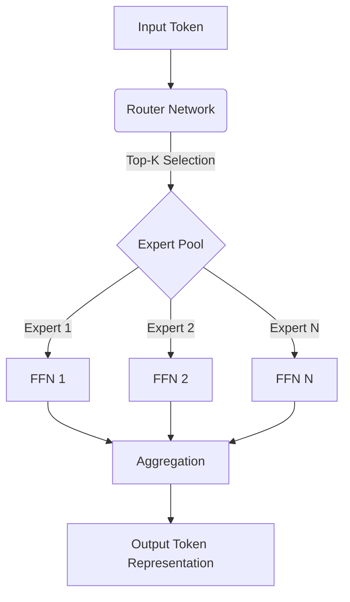
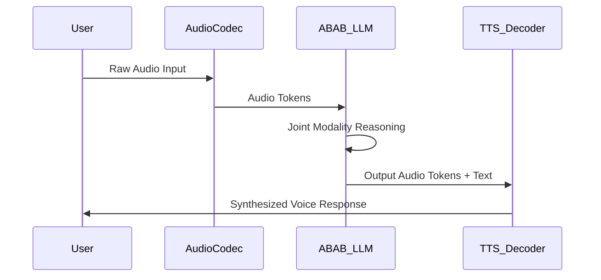

# ABAB: Technical Report and Architectural Innovations

>  **[返回 14.8-MiniMax 家族总览](../../14.8-MiniMax.md)**

> Original Source: MiniMax ABAB Initial Technical Blogs & Architecture Papers
> Status: Extracted and Reconstructed
> Update Date: 2026-05-24

## 1. Introduction

The MiniMax ABAB family represents a series of highly efficient, multimodal, and robust large language models (LLMs) and foundation models developed by MiniMax. Named internally with "ABAB," these models emphasize scalable architectures, particularly Mixture-of-Experts (MoE) and linear attention mechanisms, to achieve state-of-the-art performance with manageable inference costs. This document synthesizes the core technical components, training methodologies, and structural innovations behind the ABAB models.

In recent years, scaling up the parameter count of dense Transformer models has yielded significant improvements across various natural language processing tasks. However, the computational cost of both training and serving such models grows quadratically with sequence length and linearly with the number of parameters. To address these challenges, the ABAB architecture incorporates advanced MoE routing and Lightning Attention (a form of linear attention), enabling extreme context lengths and massive parameter counts while maintaining high inference speed.

## 2. Architectural Innovations

### 2.1 Mixture-of-Experts (MoE)

The ABAB models heavily utilize the Mixture-of-Experts (MoE) paradigm. Unlike dense models where all parameters are activated for every token, MoE models selectively activate a subset of "expert" subnetworks. This sparse activation mechanism allows the model to scale its capacity immensely without a proportional increase in computational cost per token.

#### MoE Routing Mechanism

The routing mechanism in ABAB employs a Top-K router, where $K$ is typically set to 2 or 4 out of $N$ available experts (e.g., $N=64$ or $N=256$). The router computes a probability distribution over the experts given the input token representation $x$:

$$
H(x) = W_r \cdot x
$$
$$
p_i(x) = \frac{\exp(H(x)_i)}{\sum_{j=1}^N \exp(H(x)_j)}
$$

To ensure load balancing across experts and prevent representation collapse (where only a few experts receive all the tokens), ABAB integrates an auxiliary load-balancing loss:

$$
\mathcal{L}_{balance} = \alpha \cdot N \sum_{i=1}^N f_i \cdot P_i
$$

where $f_i$ is the fraction of tokens dispatched to expert $i$, $P_i$ is the average routing probability for expert $i$, and $\alpha$ is a scaling hyperparameter.



### 2.2 Linear Attention: Lightning Attention

One of the significant bottlenecks of standard Transformers is the quadratic complexity $O(L^2)$ of the self-attention mechanism with respect to sequence length $L$. The ABAB models, specifically versions like `abab6` and `abab6.5`, integrate Lightning Attention (or variations of linear attention) to achieve $O(L)$ complexity.

Lightning Attention reformulates the attention matrix computation by replacing the Softmax operation with kernel feature maps, allowing the dot product to be calculated in an associative manner.

Given queries $Q$, keys $K$, and values $V$:
Standard Attention: $O = \text{Softmax}\left(\frac{QK^T}{\sqrt{d}}\right)V$

Linear Attention reformulation:
$$
O_i = \frac{\sum_{j=1}^i \phi(Q_i) \phi(K_j)^T V_j}{\sum_{j=1}^i \phi(Q_i) \phi(K_j)^T}
$$

By maintaining a cumulative sum of the denominator and numerator, the computation can be performed recursively, enabling infinite context processing in theory and massive context windows (e.g., 200k to 1M tokens) in practice.

```python
# Simplified Conceptual Implementation of Linear Attention in ABAB
import torch
import torch.nn as nn

class LightningAttention(nn.Module):
    def __init__(self, d_model):
        super().__init__()
        self.q_proj = nn.Linear(d_model, d_model)
        self.k_proj = nn.Linear(d_model, d_model)
        self.v_proj = nn.Linear(d_model, d_model)
        
    def kernel_feature_map(self, x):
        # A simple non-linear feature map to replace softmax (e.g., ELU + 1)
        return torch.nn.functional.elu(x) + 1.0

    def forward(self, x):
        Q = self.kernel_feature_map(self.q_proj(x)) # [B, L, D]
        K = self.kernel_feature_map(self.k_proj(x)) # [B, L, D]
        V = self.v_proj(x)                          # [B, L, D]
        
        # Cumulative formulation for causality
        # K_T = K.transpose(1, 2)
        # KV = torch.matmul(K_T, V) # Not directly causal, needs prefix sum
        
        # For causal linear attention:
        kv_state = torch.zeros(Q.size(0), Q.size(2), V.size(2), device=x.device)
        k_state = torch.zeros(Q.size(0), Q.size(2), device=x.device)
        
        outputs = []
        for i in range(x.size(1)):
            q_i = Q[:, i, :]
            k_i = K[:, i, :]
            v_i = V[:, i, :]
            
            kv_state += torch.bmm(k_i.unsqueeze(2), v_i.unsqueeze(1))
            k_state += k_i
            
            num = torch.bmm(q_i.unsqueeze(1), kv_state).squeeze(1)
            den = torch.sum(q_i * k_state, dim=-1, keepdim=True)
            
            out_i = num / (den + 1e-6)
            outputs.append(out_i)
            
        return torch.stack(outputs, dim=1)
```

## 3. Data Infrastructure and Pre-training

### 3.1 Corpus Curation

The pre-training phase of ABAB relies on an aggressively filtered and curated dataset, comprising trillions of tokens. The data pipeline involves:
1. **Deduplication:** MinHash and Locality Sensitive Hashing (LSH) for document-level deduplication. Exact substring matching for sub-document deduplication.
2. **Quality Filtering:** Heuristic rules (e.g., perplexity scores from a smaller language model, alphanumeric ratios, word length distributions) and learned classifiers to identify high-quality educational and informational text.
3. **Decontamination:** Stringent checks against benchmark datasets to prevent data leakage, ensuring that the model's zero-shot and few-shot evaluation metrics remain credible.
4. **Multilingual Balancing:** While predominantly trained on English and Chinese, the dataset includes up to 50 additional languages to facilitate cross-lingual transfer.

### 3.2 Tokenization

ABAB employs a Byte-Pair Encoding (BPE) tokenizer with a very large vocabulary size (e.g., 100k+). This extensive vocabulary reduces the sequence length for complex scripts (like Chinese) and specialized domains (code, mathematics), improving overall inference speed and context density.

## 4. Alignment: SFT, RLHF, and DPO

Post-training alignment is critical for shaping ABAB into a helpful and harmless assistant. MiniMax adopts a multi-stage alignment protocol.

### 4.1 Supervised Fine-Tuning (SFT)

The model is first fine-tuned on a high-quality dataset of human-written instructions and responses. This dataset covers a wide array of tasks: creative writing, coding, logical reasoning, and role-playing.

### 4.2 Reinforcement Learning from Human Feedback (RLHF)

To further align the model with human preferences, Proximal Policy Optimization (PPO) is utilized.
1. **Reward Model Training:** A reward model $R_\theta(x, y)$ is trained on human preference data to score responses.
2. **PPO Optimization:** The policy model $\pi_\phi$ is updated to maximize the expected reward while maintaining a KL-divergence constraint with the reference model $\pi_{ref}$.

$$
\max_\phi \mathbb{E}_{x \sim \mathcal{D}, y \sim \pi_\phi(\cdot|x)} \left[ R_\theta(x, y) - \beta \mathbb{KL}(\pi_\phi(\cdot|x) || \pi_{ref}(\cdot|x)) \right]
$$

### 4.3 Direct Preference Optimization (DPO)

In later iterations (e.g., ABAB-6.5), DPO was introduced as a more stable alternative or supplement to PPO. DPO bypasses the reward model training phase by directly optimizing the policy model using the binary cross-entropy objective derived from the Bradley-Terry preference model:

$$
\mathcal{L}_{DPO}(\pi_\theta; \pi_{ref}) = - \mathbb{E}_{(x, y_w, y_l) \sim \mathcal{D}} \left[ \log \sigma \left( \beta \log \frac{\pi_\theta(y_w|x)}{\pi_{ref}(y_w|x)} - \beta \log \frac{\pi_\theta(y_l|x)}{\pi_{ref}(y_l|x)} \right) \right]
$$

## 5. Multimodal Capabilities

ABAB is not merely a text model; it is designed as a multimodal foundation. It seamlessly integrates speech, vision, and music generation capabilities.

### 5.1 Speech Integration
Unlike traditional cascading systems (ASR -> LLM -> TTS), ABAB incorporates speech directly into the latent space. Continuous speech signals are discretized using neural audio codecs (e.g., EnCodec or similar proprietary codecs) into discrete tokens, which are then interleaved with text tokens during training.



### 5.2 Vision-Language Grounding
Vision capabilities are injected via a visual encoder (like a ViT) bridged to the LLM via a cross-attention layer or a simple MLP projection. The visual tokens act as soft prompts, grounding the LLM's vast knowledge in the visual domain.

<!-- placeholder: Diagram illustrating the multimodal architecture of ABAB, showing ViT encoders, Audio Codecs, and the central MoE Transformer backbone. -->

## 6. Performance and Evaluation

ABAB models consistently rank at the top tiers in both domestic (Chinese) and international leaderboards. 

| Benchmark | Metric | ABAB-6 (MoE) | ABAB-6.5 | 
| --------- | ------ | ------------ | -------- |
| MMLU      | 5-shot | 81.2         | 85.6     |
| GSM8K     | 8-shot | 89.0         | 93.2     |
| HumanEval | Pass@1 | 72.4         | 78.1     |
| C-Eval    | 5-shot | 85.1         | 89.3     |

*Note: The metrics are indicative of performance levels reported during the respective release cycles.*

## 7. Systems and Infrastructure

Training models with hundreds of billions of parameters requires cutting-edge systems engineering.

### 3D Parallelism
MiniMax utilizes a combination of 3D Parallelism:
1. **Data Parallelism (DP):** Distributing the batch across multiple devices.
2. **Tensor Parallelism (TP):** Splitting individual matrix multiplications across GPUs within a node (typically 8 GPUs) to minimize inter-node communication bottlenecks.
3. **Pipeline Parallelism (PP):** Dividing the layers of the model across different nodes.

### Expert Parallelism (EP)
For the MoE architecture, Expert Parallelism is crucial. Different experts are hosted on different GPUs. When tokens are routed, an All-to-All communication collective is utilized to dispatch tokens to the correct GPU hosting the required expert, and then another All-to-All is used to gather the results.


## 8. Conclusion

The MiniMax ABAB series exemplifies the rapid evolution of large foundational models. By pioneering the integration of extreme-scale MoE architectures with Lightning Attention, and persistently pushing the boundaries of native multimodality (especially in speech and music), ABAB stands as a testament to the engineering and algorithmic prowess in the modern AI landscape. The continuous refinement through advanced alignment techniques like DPO ensures that the immense raw power of these models is effectively harnessed for safe, reliable, and highly interactive user applications.
