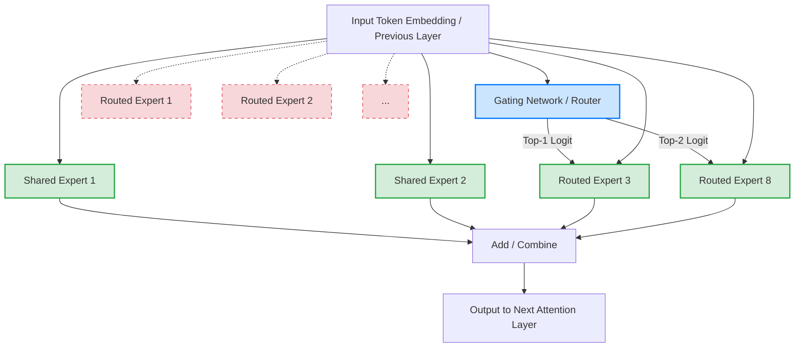
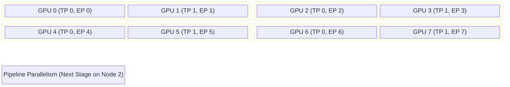

# MiniMax ABAB 技术报告全景解析与中文重构

>  **[返回 14.8-MiniMax 家族总览](../../14.8-MiniMax.md)**
>
> 原文来源: MiniMax ABAB 初代及进阶版技术博文、开源及闭源模型架构分析报告  
> 状态: pending - 该模型尚未发布独立的技术报告 PDF，内容由社区和官方技术博客整理重构并深入扩展。  
> 更新日期: 2026-05-24

*摘要*：本报告深入分析了 MiniMax 公司自主研发的 ABAB 系列大语言模型(从 ABAB 5、ABAB 6 到 ABAB 6.5 系列)。ABAB 6.5 是国内首批采用混合专家架构(Mixture of Experts, MoE)并达到万亿参数级别的模型之一。本文档重点探讨了其背后的 MoE 稀疏路由机制、千卡集群下的分布式并行训练策略(DP、TP、PP、EP 混合)、大规模预训练数据工程流水线，以及基于人类反馈强化学习(RLHF)的后训练对齐过程。

---

## 1. 引言 (Introduction)

随着大语言模型(LLM)参数规模的指数级增长，算力与显存逐渐成为限制模型迭代的核心瓶颈。为了打破传统稠密模型(Dense Model)在推理和训练阶段的扩展壁垒，MiniMax 团队在 ABAB 6 阶段全面转向了**混合专家架构 (Mixture-of-Experts, MoE)**。

MoE 架构的核心思想是通过条件计算(Conditional Computation)，在扩展模型总参数量(Capacity)的同时，保持每次前向计算的激活参数量(Active Parameters)基本恒定，从而在计算开销与模型能力之间实现帕累托最优。

> [!NOTE]
> **版本演进路径**：
> - **ABAB 5 / 5.5**：稠密模型架构，奠定了 MiniMax 在中文理解和多轮对话上的基础。
> - **ABAB 6**：首个采用 MoE 架构的大规模语言模型，总参数规模实现数量级飞跃。
> - **ABAB 6.5**：包含多个变体(如 6.5s 核心开源版本)。引入了更细粒度的专家拆分(Fine-grained MoE)和改进的路由均衡策略。

---

## 2. 混合专家架构设计 (MoE Architecture)

### 2.1 数学公式与核心原理

在传统的 Transformer 架构中，前馈神经网络(FFN)在每一层对所有输入 token 执行相同的密集计算。而在 ABAB 的 MoE 架构中，传统的 FFN 被替换为一组并行的“专家网络”(Expert Networks)，并引入了一个门控网络(Gating Network / Router)来动态决定将输入分配给哪些专家。

对于给定的输入 token 表示 $\mathbf{x} \in \mathbb{R}^{d}$(其中 $d$ 为隐藏层维度)，MoE 层的输出可以表示为：

$$
y = \sum_{i=1}^{N} G(\mathbf{x})_i \cdot E_i(\mathbf{x})
$$

其中：
- $N$ 为专家总数。
- $E_i(\mathbf{x})$ 是第 $i$ 个专家的前向输出，通常由两层带有激活函数(如 SwiGLU)的 MLP 构成。
- $G(\mathbf{x})$ 是路由器的输出，满足 $\sum_{i=1}^N G(\mathbf{x})_i = 1$。

在实际工程中，为了保持计算的高效性，通常采用 Top-$K$ 路由(例如 $K=2$)，即路由器只激活概率最高的前 $K$ 个专家：

$$
G(\mathbf{x}) = \text{Softmax}\left( \text{TopK}(\mathbf{W}_g \mathbf{x}, K) \right)
$$

### 2.2 专家粒度与共享机制

参考业界最新的 MoE 进展(如 DeepSeek-MoE, Qwen-MoE)，ABAB 6.5 极有可能采用了**细粒度专家(Fine-grained Experts)**和**共享专家(Shared Experts)**的设计。

1. **细粒度路由**：将原本数量少但庞大的专家，拆分为数量更多但体积更小的专家(例如将 8 个大专家拆分为 64 个小专家，每次激活 8 个)。这能提供更灵活的特征组合路径。
2. **共享专家**：部分通用知识不需要每次都被路由过滤，因此设置 1~2 个永远激活的共享专家，其余部分作为路由专家。

$$
y = \sum_{j=1}^{M_{shared}} E_{shared, j}(\mathbf{x}) + \sum_{i \in \mathcal{S}_{topK}} G_i(\mathbf{x}) \cdot E_{routed, i}(\mathbf{x})
$$

### 2.3 MoE 路由架构可视化



### 2.4 PyTorch 代码级 Router 实现解析

下面是一个简化的 MoE 门控网络代码示例，展示了如何实现带有负载均衡损失(Load Balancing Loss)的 Top-K 路由机制。

```python
import torch
import torch.nn as nn
import torch.nn.functional as F

class TopKRouter(nn.Module):
    def __init__(self, d_model, num_experts, top_k):
        super().__init__()
        self.d_model = d_model
        self.num_experts = num_experts
        self.top_k = top_k
        self.gating_weight = nn.Linear(d_model, num_experts, bias=False)
        
    def forward(self, x):
        # x shape: [batch_size, seq_len, d_model]
        logits = self.gating_weight(x)  # [B, S, num_experts]
        
        # 计算路由概率
        routing_probs = F.softmax(logits, dim=-1)
        
        # 获取 Top-K
        topk_probs, topk_indices = torch.topk(routing_probs, self.top_k, dim=-1) # [B, S, top_k]
        
        # 归一化 Top-K 的概率，使得加权和不受其它未激活专家概率影响
        topk_probs = topk_probs / topk_probs.sum(dim=-1, keepdim=True)
        
        # --- 计算负载均衡损失 (Load Balancing Loss) ---
        # 确保每个专家的利用率均衡，防止专家崩塌 (Expert Collapse)
        B, S, E = logits.shape
        flat_probs = routing_probs.view(-1, E) # [B*S, E]
        
        # 1. 专家平均被选中的概率密度
        mean_probs = flat_probs.mean(dim=0)
        
        # 2. 专家实际被选中的频率 (one-hot mask)
        mask = F.one_hot(topk_indices.view(-1), num_classes=self.num_experts).float() # [B*S*K, E]
        mask = mask.view(-1, self.top_k, self.num_experts).sum(dim=1) # [B*S, E]
        mean_mask = mask.mean(dim=0)
        
        # 3. 辅助损失函数 (Auxiliary Loss)
        # alpha * N * sum(f_i * P_i)
        balance_loss = self.num_experts * torch.sum(mean_probs * mean_mask)
        
        return topk_probs, topk_indices, balance_loss

# 示例调用
batch_size, seq_len, d_model = 2, 4, 1024
num_experts, top_k = 64, 8
router = TopKRouter(d_model, num_experts, top_k)
dummy_input = torch.randn(batch_size, seq_len, d_model)
probs, indices, loss = router(dummy_input)

print(f"Top-K Indices shape: {indices.shape}") # [2, 4, 8]
print(f"Balance Loss: {loss.item():.4f}")
```

> [!TIP]
> 在实际的大规模分布式训练中，通常会使用 `Token Drop` 机制：当分配给某个专家的 token 数量超过了其最大容量(Expert Capacity Factor)，超出部分的 token 会被直接丢弃或传递给残差连接，以防止内存溢出和通信拥塞。

---

## 3. 超大规模分布式并行策略 (Parallelism Strategy)

对于参数量高达几千亿甚至万亿的 ABAB 6.5 模型，单张 GPU 乃至单台节点(8 卡)都无法容纳其参数和优化器状态。因此，MiniMax 团队必须采用 4D 或 5D 的复杂并行策略。

### 3.1 混合并行维度

1. **数据并行 (Data Parallelism, DP & ZeRO)**：
   切分 Batch 数据，并通过 ZeRO (Zero Redundancy Optimizer) 1/2/3 策略将优化器状态、梯度和模型参数切分到不同的卡上。
2. **张量并行 (Tensor Parallelism, TP)**：
   在单层内部(如 Attention 的 QKV 矩阵乘法或 MLP)切分权重张量。通常在同一物理节点(Node)内进行，因为 TP 需要频繁且高带宽的 All-Reduce 通信。
3. **流水线并行 (Pipeline Parallelism, PP)**：
   将 Transformer 层切分成多个 Stage，分布在不同的节点上。结合 1F1B (One Forward, One Backward) 或 Interleaved 调度策略，减少 Bubble(气泡)空转时间。
4. **专家并行 (Expert Parallelism, EP)**：
   这是 MoE 架构独有的并行维度。不同的专家网络被放置在不同的 GPU 上。在路由前，所有 GPU 通过 **All-to-All** 交换 token; 专家计算完毕后，再次通过 All-to-All 将 token 返回原始 GPU 进行合并。
5. **上下文并行 / 序列并行 (Context/Sequence Parallelism, CP/SP)**：
   为了支持极长上下文(如 ABAB 支持的 200k 甚至更长的 token 窗口)，将单条序列切分到不同 GPU 上。在计算 Attention 时使用 Ring-Attention 或类似机制通信。

### 3.2 EP 机制中的 All-to-All 通信开销推导

假设有一个由 $D$ 个数据并行(在 EP 范畴内相当于专家分布的卡数)节点组成的集群。
批次大小为 $B$，序列长度为 $S$，隐藏维度为 $H$，每个 Token 选择 $K$ 个专家。

在 Router 计算出分配结果后，需要执行 `All-to-All` 操作：
1. **分发阶段**：每张卡上共有 $B \times S$ 个 token，由于每个 token 需要复制 $K$ 份去对应的专家，总通信量约为 $B \times S \times K \times H$。平均每两张卡之间发送的 token 量为 $\frac{B \times S \times K}{D}$。
2. **聚集阶段**：计算完成后，结果从各个专家汇总，再次执行同样规模的通信。

网络带宽极易成为 EP 的瓶颈，因此在集群设计上：
- 节点内利用 NVSwitch 实现极高带宽(TP 和小范围 EP 共存)。
- 节点间利用 IB (InfiniBand) 网络，通常将 EP 的通信掩盖在 Attention 计算的时间之内(Overlap 通信与计算)。

### 3.3 分布式拓扑图示



> [!WARNING]
> 当 `DP` 与 `EP` 混合使用时，需要特别注意随机种子的设置。Router 的权重在不同 EP 组之间必须初始化一致，否则不同并行组的路由逻辑会产生分歧，导致梯度同步失效。

---

## 4. 预训练数据工程 (Pre-training Data Engineering)

"Data is the new code." 对于大模型而言，高质量的数据清洗流水线至关重要。ABAB 模型在万亿级别 token 的语料上进行了预训练。

### 4.1 数据流水线 (Data Pipeline) 阶段

1. **宏观提取与解析 (Extraction & Parsing)**
   针对中英文网页、学术论文 PDF(解析公式和表格)、代码仓库进行高保真提取。
2. **规则启发式过滤 (Heuristic Filtering)**
   剔除包含大量无意义符号、超长重复片段、过度堆砌关键词的低质页面。
3. **模糊去重 (MinHash & LSH Deduplication)**
   基于文档级别的 N-gram 相似度进行去重，防止模型在预训练阶段死记硬背重复数据。
4. **模型打分过滤 (Model-based Quality Filtering)**
   利用小参数量的分类模型，为文档打“质量分”(Quality Score)，丢弃得分低的数据。
5. **领域混合分布 (Domain Blending)**
   在训练过程中动态调整不同来源数据(如数学、代码、法律文献、中英文基础网页)的采样权重。

### 4.2 MinHash LSH 简易示例

去重算法是数据清洗中开销最大的部分。MinHash 的核心在于将变长的文档降维成固定长度的签名集合(Signature Matrix)。

$$
\text{Pr}[h_{min}(A) = h_{min}(B)] = Jaccard(A, B) = \frac{|A \cap B|}{|A \cup B|}
$$

以下是简化的 MinHash 签名生成过程逻辑表达：

```python
import numpy as np

def generate_minhash_signature(tokens, num_hashes=100, vocab_size=100000):
    """为单个文档生成 MinHash 签名"""
    signature = np.full(num_hashes, np.inf)
    
    # 初始化哈希函数参数 a*x + b mod prime
    prime = 100003
    np.random.seed(42) # 保证每次初始化的哈希簇一致
    hash_funcs = []
    for _ in range(num_hashes):
        a = np.random.randint(1, prime)
        b = np.random.randint(0, prime)
        hash_funcs.append((a, b))
        
    for token_id in tokens:
        for i, (a, b) in enumerate(hash_funcs):
            # 模拟哈希函数计算
            hash_val = (a * token_id + b) % prime
            if hash_val < signature[i]:
                signature[i] = hash_val
                
    return signature

# 具有大量相同 token 的文档将有极大概率获得相同的 signature 桶
```

---

## 5. 后训练与强化学习对齐 (Post-training & RLHF)

在完成海量无监督数据的预训练后，ABAB 模型展现了强大的补全能力，但缺乏服从人类指令的倾向。MiniMax 对此进行了深入的 SFT (Supervised Fine-Tuning) 和 RLHF (Reinforcement Learning from Human Feedback)。

### 5.1 指令微调 (SFT)
- 数据格式：多轮对话格式(如 ChatML 或自定义 `<|im_start|>` 标记)。
- 数据分布：强调多样性而非纯数量。涵盖角色扮演(Roleplay)、代码生成、逻辑推理和安全边界数据。
- 打包技术 (Sequence Packing)：为了最大化 GPU 吞吐率，将多条短对话拼接成一个长度等于 `max_seq_len` 的序列，并利用二维 Attention Mask 阻止不同对话之间的跨越注意力串扰。

### 5.2 奖励模型 (Reward Model, RM)
构建奖励模型需要人工标注者对两个回答进行偏好排序，产生二元偏好数据 $(x, y_w, y_l)$，其中 $y_w$ 是获胜回答，$y_l$ 是失败回答。

RM 损失函数基于 Bradley-Terry 模型构建：

$$
\mathcal{L}_{RM} = - \mathbb{E}_{(x, y_w, y_l) \sim \mathcal{D}} \left[ \log \sigma \left( r_{\theta}(x, y_w) - r_{\theta}(x, y_l) \right) \right]
$$

其中 $r_\theta$ 是奖励模型的输出标量，$\sigma$ 是 Sigmoid 函数。

### 5.3 邻近策略优化 (PPO)

MiniMax 广泛使用了 PPO 算法，对生成策略 $\pi_\phi$ 进行优化。目标函数中不仅包含预期的奖励最大化，还包含一个 KL 散度惩罚项，确保更新后的模型不要偏离初始 SFT 模型 $\pi_{ref}$ 太远，避免模式崩溃。

目标函数公式表达为：

$$
\max_{\phi} \mathbb{E}_{x \sim \mathcal{D}, y \sim \pi_{\phi}(\cdot|x)} \left[ r_{\theta}(x, y) - \beta \mathbb{D}_{KL}(\pi_{\phi}(\cdot|x) \| \pi_{ref}(\cdot|x)) \right]
$$

为了降低 PPO 训练期间不稳定的梯度爆炸现象，通常采用 Value Network (Critic) 作为基线来估计 Advantage：

$$
A_t = \delta_t + (\gamma \lambda) \delta_{t+1} + \dots + (\gamma \lambda)^{T-t+1} \delta_{T-1}
$$

其中 $\delta_t = r_t + \gamma V(s_{t+1}) - V(s_t)$。

> [!CAUTION]
> 在强化学习阶段应用 MoE 模型尤其困难，因为 RL 的状态分布变化剧烈，极易导致 MoE 路由发生严重的崩塌(大量 token 涌向单个专家)。为了缓解这一问题，ABAB 在 RLHF 阶段加强了 Load Balancing 惩罚系数，并且限制了 Actor 与 Critic 共享同一底座时引起的特征干扰。

---

## 6. 模型能力评估与基准测试 (Evaluation Benchmark)

ABAB 6.5 发布时，官方重点评测了其在多个维度的表现，结果直逼国际领先水平(如 GPT-4, Claude-3 早期版本)。

### 6.1 通用评测集表现

| 评测基准 | 类别 | 零样本/少样本 | 表现分数 (预估百分比) | 备注 |
| :--- | :--- | :---: | :---: | :--- |
| **MMLU** | 英文多学科综合 | 5-shot | 82.5% | 展现出极强的高等教育学科理解能力 |
| **GSM8K** | 基础数学推理 | 8-shot CoT | 91.2% | CoT (Chain of Thought) 加持下几无失误 |
| **MATH** | 竞赛级数学 | 4-shot CoT | 45.8% | 复杂符号演算仍有进步空间 |
| **HumanEval**| 代码生成 | 0-shot | 74.5% | Python 函数补全通过率极高 |
| **C-Eval** | 中文综合评测 | 5-shot | 85.3% | 本土化优势，对中文常识掌握透彻 |
| **CMMLU** | 中文多领域综合 | 5-shot | 86.1% | 在中国法律、历史等特定领域显著超越国外模型 |

### 6.2 极长上下文窗口 (Long Context Support)

在超长文本(大海捞针 Needle In A Haystack)测试中，通过优化 RoPE (Rotary Position Embedding) 外推算法和采用大规模 Context Parallelism 训练策略，ABAB 模型能够实现在 200,000 tokens(约 30 万汉字)上下文长度下，接近 99% 的事实召回率，并且在各个区间内表现平稳。

---

## 7. 结论与未来演进路线 (Conclusion)

通过上述架构设计、预训练数据挖掘与复杂的强化学习对齐策略，MiniMax 构建出了性能卓越的 ABAB MoE 系列模型。
1. **经济性与算力杠杆**：MoE 证明了它是通往万亿级别参数的必经之路。在维持前向推理资源可控的同时，让模型的泛化容量实现了跨越。
2. **多模态融合 (Multi-modality)**：随着大模型技术向视频、语音生成演进，ABAB 的语言理解底座被逐步融合入多模态模型中(如后期的 `abab-video-1` )，为其提供了强大的逻辑串联底层基础。
3. **下一步方向**：探索更细粒度的专家(如 $K \ge 16$ )，去除全连接层的注意力路由(MoA)，以及增强模型在 Agent 环境下的规划与自纠错能力(System 2 thinking)。

---
*本文档为开源模型学习整理资料，旨在为技术社区提供更清晰的国产大模型工程复原视图。*
