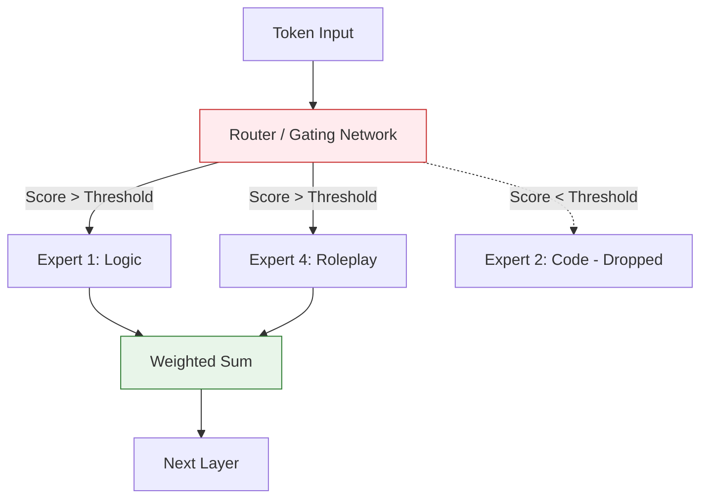

# ABAB-初代 核心技术专题索引

>  **[返回 14.8-MiniMax 家族总览](../../14.8-MiniMax.md)**

## 1. 技术问题定义与背景 (Technical Problem Definition)

MiniMax 是国内最早一批跑通万亿参数 MoE 和多模态(语音、文本并重)的大模型创业公司。其初代的 ABAB 模型在发布时面临的技术挑战与同期其他国产大模型有显著不同，其最大的差异化在于**拟人化交互(Character AI)与高表现力语音合成的底层绑定**。

核心需要解决的问题：
1. **多模态与人格化对齐**：如何让语言模型不仅仅输出冷冰冰的知识，而是具备角色扮演能力，并能生成带有情绪标签的输出以供后端的 TTS(Text-to-Speech)引擎使用。
2. **早期 MoE 的工程探索**：在缺乏开源成熟框架的早期，如何自研一套能够有效调度的混合专家系统，使得百亿甚至千亿级别的参数能够在云端低延迟并发。

## 2. 方法论拆解 (Method Breakdown)

### 2.1 高度拟人化指令微调 (Character-aligned SFT)

ABAB 初代的后训练(Post-Training)极度侧重于人类风格的对话和情绪注入。它采用了大规模的人类情感标注数据集：
- 模型不仅生成文本内容，还在生成的同时预测出隐含的“情绪标签”和“语速/语调提示”。
- 配合 RLHF 机制，让模型学会根据 System Prompt 中的设定维持稳定的人设。

### 2.2 早期 MoE 路由架构

ABAB 系列早期即采用了 MoE 架构。与 DeepSeek 的无辅助损失策略不同，早期的 ABAB 采用了较为经典的 Top-2 门控机制，并对专家容量(Expert Capacity)进行了严格的截断限制。

### 2.3 文本-语音联合推断延迟优化 (Text-to-Speech Joint Optimization)

为了服务于其核心产品(如星野)，ABAB 模型的生成不仅追求 TPOT(每 Token 耗时)短，更追求与自研 TTS 的流水线对接。
- **Chunked Streaming**：语言模型输出的 Token 会按照语法和语义意群(而非按个字)进行 Chunk 打包，第一时间送入语音合成，实现极其平滑的语音对话体验。

## 3. 工程分析与边界局限 (Engineering & Boundaries)

**工程亮点**：
- ABAB 初代证明了“应用驱动模型”的价值。在模型绝对逻辑能力尚未登顶时，通过极强的人设对齐和工程化的流式 TTS 结合，依然能打造出护城河极深的消费级应用。

**局限性**：
- **技术透明度极低**：初代 ABAB 几乎没有发布任何严谨的技术报告或论文，大量技术细节依赖外部评测与猜测。
- **严重偏科**：在偏向代码、高阶数学和严肃长文档推理的场景下，初代 ABAB 经常表现出幻觉或逻辑链条断裂。其过度拟人化的 SFT 在某些客观事实类 Benchmark 上起到了反效果。

---

## 4. 子文档与资源

### 核心解析
- [ABAB初代技术博文分析](./01-ABAB初代技术博文分析.md)
- [ABAB初代核心架构剖析](./02-ABAB初代核心架构剖析.md)

### 附加资源
- [images](./images/images.md)
- [pdfs](./pdfs/pdfs.md)
