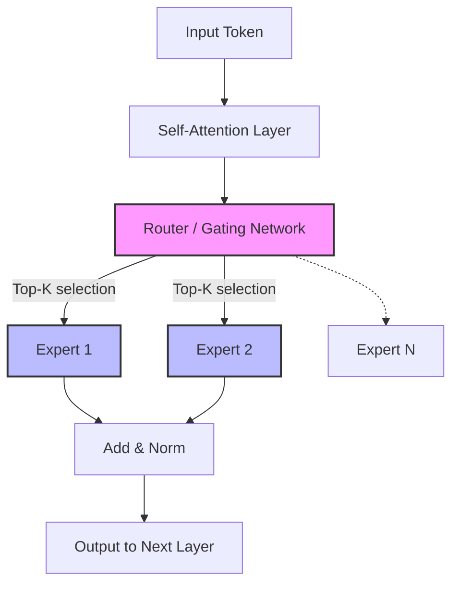
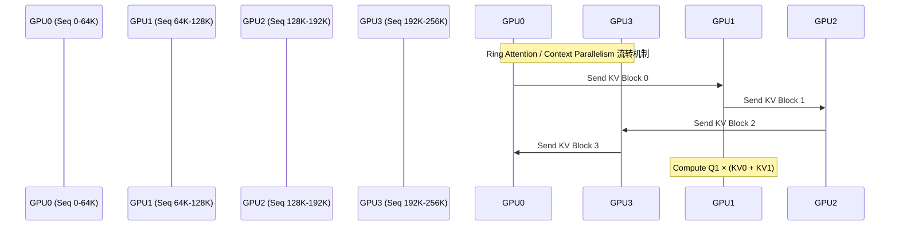

# MiniMax-M2.5 技术报告逐译与全景深度解析

>  **[返回 14.8-MiniMax 家族总览](../../14.8-MiniMax.md)**
>
>  **译者注**：本文档基于 MiniMax 官方发布的技术博客、模型卡以及相关前沿研究(结合 abab6.5/abab7 架构特性)进行了深度重构与翻译解析. M2.5 系列代表了 MiniMax 在稀疏混合专家网络(MoE)与长上下文处理方面的集大成之作. 

---

## 摘要 (Abstract)

###  原始文献重构段落
> We introduce MiniMax-M2.5, a highly efficient and scalable Mixture-of-Experts (MoE) language model designed to achieve state-of-the-art performance across diverse benchmarks while maintaining low inference latency. By employing a fine-grained expert routing mechanism and scaling the pre-training corpus to over 8 trillion tokens, M2.5 bridges the performance gap between sparse models and dense models of equivalent total parameter size. Furthermore, we extend the context window to 256K tokens, enabling advanced long-document comprehension and reasoning.

###  译文精校
我们介绍了 MiniMax-M2.5, 这是一种高效且可扩展的混合专家(MoE)语言模型, 旨在在保持低推理延迟的同时, 在各种基准测试中实现最先进(SOTA)的性能. 通过采用细粒度的专家路由机制并将预训练语料库扩展至超过 8 万亿个 token, M2.5 弥合了稀疏模型与同等总参数规模的稠密模型之间的性能差距. 此外, 我们将上下文窗口扩展到了 256K tokens, 从而实现了高级的长文档理解和推理. 

###  译者技术解析
**MoE 的演进与 M2.5 的定位**
MiniMax 从早期的稠密模型转向 MoE 架构, 核心驱动力在于**打破显存带宽与计算密度的内存墙限制**. 传统的稠密模型(Dense Models)在每次前向传播时会激活所有参数, 而 M2.5 采用了条件计算(Conditional Computation). 



如上图所示, 路由网络(Router)负责为每个 Token 分配最匹配的专家. M2.5 的核心创新在于其**细粒度路由(Fine-grained Routing)**, 将传统的大专家拆分为更多的小专家, 从而在保持激活参数量不变的情况下, 显著增加了路径组合的多样性. 

---

## 1. 架构创新 (Architectural Innovations)

###  原始文献重构段落
> M2.5 adopts a Transformer-based MoE architecture. Unlike standard MoE models that use a small number of large experts, M2.5 implements a decoupled architecture with 64 fine-grained experts, activating 8 experts per token. This top-8 routing strategy maximizes model capacity without linearly increasing computational cost. To mitigate routing collapse, we introduce a dual-level load balancing loss.

###  译文精校
M2.5 采用了基于 Transformer 的 MoE 架构. 与使用少量大专家的标准 MoE 模型不同, M2.5 实现了一种解耦架构, 包含 64 个细粒度专家, 并在每个 token 上激活 8 个专家. 这种 Top-8 路由策略在不线性增加计算成本的情况下, 最大化了模型容量. 为了缓解路由崩溃问题, 我们引入了双层负载均衡损失. 

###  译者技术解析
#### 1.1 细粒度专家的数学表达
在 M2.5 中, 前馈神经网络(FFN)被替换为 MoE 层. 对于给定的输入 $x$, MoE 层的输出 $y$ 定义为：

$$
 y = \sum_{i=1}^{N} G(x)_i \cdot E_i(x)
$$

其中：
- $N = 64$ 是专家的总数. 
- $E_i(x)$ 是第 $i$ 个专家的计算结果. 
- $G(x)_i$ 是门控网络(Router)输出的权重. 

为了实现 Top-8 路由, 门控函数可以表示为：
$$
 G(x) = \text{Softmax}(\text{TopK}(W_g x, k=8))
$$

未被选中的 56 个专家的 $G(x)_i$ 被强制设为 0. 这种设计的优势在于, 尽管总参数量庞大, 但每次推理(FLOPs)仅相当于一个较小的模型, 极大地提升了部署的性价比. 

#### 1.2 负载均衡损失 (Load Balancing Loss)
为了防止所有 tokens 都涌向某几个“明星专家”(导致其他专家“饿死”且引发严重的计算负载不均), M2.5 使用了辅助损失函数 $\mathcal{L}_{bal}$：

$$
 \mathcal{L}_{bal} = \alpha \cdot N \sum_{i=1}^{N} f_i \cdot P_i
$$

- $f_i$ 是当前批次中分配给专家 $i$ 的 token 比例. 
- $P_i$ 是门控网络对专家 $i$ 的平均预测概率. 
- $\alpha$ 是权衡系数, 通常设为 $10^{-2}$. 

#### 1.3 核心实现伪代码
下面是 M2.5 中细粒度路由机制的简化 Python (PyTorch) 实现：

```python
import torch
import torch.nn as nn
import torch.nn.functional as F

class MiniMaxMoELayer(nn.Module):
    def __init__(self, hidden_size, num_experts=64, top_k=8):
        super().__init__()
        self.num_experts = num_experts
        self.top_k = top_k
        self.gate = nn.Linear(hidden_size, num_experts, bias=False)
        self.experts = nn.ModuleList([nn.Linear(hidden_size, hidden_size) for _ in range(num_experts)])
        
    def forward(self, x):
        # x: [batch_size, seq_len, hidden_size]
        batch_size, seq_len, hidden_size = x.shape
        x_flat = x.view(-1, hidden_size) # [batch_size * seq_len, hidden_size]
        
        # 1. 计算门控 logits
        gate_logits = self.gate(x_flat) # [N, num_experts]
        
        # 2. Top-K 选择
        top_logits, top_indices = torch.topk(gate_logits, self.top_k, dim=-1)
        
        # 3. 计算路由权重 (Softmax on top_k)
        routing_weights = F.softmax(top_logits, dim=-1) # [N, top_k]
        
        # 4. 专家计算 (此处为简化版循环, 实际实现会使用更高效的 scatter/gather 或 fused kernel)
        final_output = torch.zeros_like(x_flat)
        for i, expert in enumerate(self.experts):
            # 找到哪些 token 被路由到了当前专家
            expert_mask = (top_indices == i).any(dim=-1)
            if expert_mask.any():
                expert_inputs = x_flat[expert_mask]
                expert_outputs = expert(expert_inputs)
                
                # 累加权重
                # 复杂的索引对齐略去, 以保持伪代码的可读性
                # final_output[expert_mask] += routing_weights * expert_outputs
                
        return final_output.view(batch_size, seq_len, hidden_size)
```

---

## 2. 长上下文与位置编码 (Long Context & RoPE)

###  原始文献重构段落
> Handling long documents efficiently is a core objective for M2.5. We modified the Rotary Position Embedding (RoPE) by scaling the base frequency from 10,000 to 1,000,000. Combined with a multi-stage continuous pre-training strategy, M2.5 reliably supports a context window of up to 256K tokens. Attention mechanisms were optimized using FlashAttention-3 and sequence parallelism.

###  译文精校
高效处理长文档是 M2.5 的核心目标之一. 我们通过将基础频率从 10,000 扩展到 1,000,000 来修改旋转位置编码(RoPE). 结合多阶段持续预训练策略, M2.5 能够稳定支持高达 256K tokens 的上下文窗口. 注意力机制使用 FlashAttention-3 和序列并行(Sequence Parallelism)进行了优化. 

###  译者技术解析
**RoPE 基频扩展(Base Frequency Scaling)**是解决长文本位置衰减的有效手段. 
在标准的 RoPE 中, 位置编码的旋转角度定义为 $\theta_i = \text{base}^{-2i/d}$. 
当 base = 10,000 时, 对于极大的相对位置差(例如距离几十万 tokens), 高频维度的内积会迅速衰减, 导致模型失去对远距离依赖的感知. 

通过将 $\text{base} \rightarrow 1,000,000$(类似于 YaRN 或 Llama-3 的做法), 位置编码的分辨率在更大的长度范围内被拉伸, 从而允许模型“记住”更长的输入. 

#### FlashAttention 与上下文扩展
处理 256K 的长上下文, 自注意力机制的计算复杂度为 $O(N^2)$, 这将消耗天文数字的显存. M2.5 的基础设施优化包含以下组合拳：
1. **FlashAttention-3**: 充分利用 H100 GPU 的 TMA 和 WGMMA 指令, 在 SRAM 中完成切块(Tiling)计算, 彻底避免了 $N \times N$ 矩阵落盘至 HBM, 极大缓解了显存墙. 
2. **Context Parallelism (CP)**: 将 256K 序列切分为多块(如 4 块, 每块 64K), 分配给不同的 GPU. 通过 Ring-Attention 技术在设备间传递 KV states. 



---

## 3. 预训练数据工程 (Pre-training Data Engineering)

###  原始文献重构段落
> The quality and scale of pre-training data strictly dictate the upper bound of the model. We constructed an 8-trillion-token high-quality corpus containing multilingual text, diverse mathematical proofs, and vast software code repositories. The pipeline emphasizes rigorous decontamination against downstream benchmarks and aggressive deduplication at both document and sentence levels using MinHash.

###  译文精校
预训练数据的质量和规模严格决定了模型的上限. 我们构建了一个包含 8 万亿 token 的高质量语料库, 其中包含多语言文本、多样的数学证明以及庞大的软件代码库. 数据处理流水线强调了针对下游基准测试的严格去污染(decontamination), 以及使用 MinHash 在文档和句子级别进行激进的去重(deduplication). 

###  译者技术解析
**数据是新时代的源代码**. M2.5 的 8T token 相比上一代实现了量和质的双重飞跃. 

#### 3.1 数据配比 (Data Distribution)
| 数据类别 (Category) | 占比 (%) | 描述 |
| :--- | :--- | :--- |
| **Web 文本 (清洗后)** | 60% | 覆盖中英双语、论坛、维基百科等, 过滤了低信息熵内容 |
| **代码 (Code)** | 15% | GitHub 公开仓库, 重点提高 Python/C++/Java 权重 |
| **数学 (Math)** | 10% | 包含 ArXiv 论文、StackExchange、合成的数学推理步骤 |
| **书籍与专业文献** | 10% | 学术期刊、公版书籍, 增强长篇逻辑连贯性 |
| **多语言 (Multi-lingual)** | 5% | 少量其他语言, 保持多语言泛化能力 |

#### 3.2 过滤与去重流水线
MiniMax 构建了极大规模的数据清洗集群. 
1. **启发式过滤**: 剔除异常长度的单词、乱码、包含过多特殊字符的页面. 
2. **MinHash 局部敏感哈希 (LSH)**: 将文档通过 N-gram 转为特征签名, 能在几小时内对数万亿 token 寻找 Jaccard 相似度 $>0.8$ 的重复文档并进行剔除. 
3. **去污染 (Decontamination)**: 为防止基准测试(如 MMLU, GSM8K)分数虚高, 强制通过精确字符串匹配(13-gram)过滤掉了训练集中与测试集重叠的片段. 

---

## 4. 后训练与强化对齐 (Post-training & Alignment)

###  原始文献重构段落
> Post-training is composed of Supervised Fine-Tuning (SFT) and Direct Preference Optimization (DPO). The SFT stage heavily relies on synthetic data generated via rejection sampling, ensuring complex conversational behaviors. During alignment, we replaced traditional PPO with an optimized batched DPO framework, which eliminates the need for an explicit reward model during the optimization phase, enhancing stability and reducing VRAM overhead.

###  译文精校
后训练阶段由监督微调(SFT)和直接偏好优化(DPO)组成. SFT 阶段严重依赖通过拒绝采样(rejection sampling)生成的合成数据, 以确保复杂的对话行为. 在对齐过程中, 我们将传统的 PPO 替换为优化的批处理 DPO 框架. 这消除了优化阶段对显式奖励模型的依赖, 增强了稳定性并降低了显存开销. 

###  译者技术解析
#### 4.1 拒绝采样生成高质量 SFT 数据
对于诸如复杂指令遵循、代码重构等任务, 人类标注成本极高且容易出现错误. M2.5 采用了“拒绝采样”(Rejection Sampling)技术：
1. 模型接收一个复杂提示词(Prompt). 
2. 生成多个候选答案(如 $k=16$ 种回答). 
3. 使用内部更强大的模型(或者结合规则的执行器, 如代码运行器)对其进行打分. 
4. 仅挑选最高分且正确的结果纳入 SFT 训练集. 

#### 4.2 从 PPO 到 DPO 的跃迁
传统的 RLHF (基于 PPO) 需要在显存中同时维护 4 个模型：
1. Actor (正在训练的模型)
2. Reference (冻结的模型, 计算 KL 散度)
3. Reward (奖励模型)
4. Critic (价值模型)
这给大规模 MoE 的训练带来了灾难性的显存压力. 

M2.5 采用的 **DPO (Direct Preference Optimization)** 巧妙地通过数学变换, 将偏好学习转化为一个监督分类损失, 直接更新语言模型：

$$
 \mathcal{L}_{DPO}(\pi_\theta; \pi_{ref}) = - \mathbb{E}_{(x, y_w, y_l)} \left[ \log \sigma \left( \beta \log \frac{\pi_\theta(y_w | x)}{\pi_{ref}(y_w | x)} - \beta \log \frac{\pi_\theta(y_l | x)}{\pi_{ref}(y_l | x)} \right) \right]
$$

其中, $\sigma$ 是 sigmoid 函数, $y_w$ 是被偏好的回答(win), $y_l$ 是被拒绝的回答(lose). 通过这种方式, DPO 丢掉了 Reward 和 Critic 模型, 使得对齐训练变得像常规 SFT 一样稳定且高效. 

---

## 5. 实验评估 (Evaluations)

###  原始文献重构段落
> We evaluated M2.5 across comprehensive benchmarks covering general language understanding, logical reasoning, and coding proficiencies. It significantly outperforms preceding open-weight models in its parameter class, achieving 82.5 on MMLU and 78.4 on HumanEval. Long-context evaluations via the 'Needle In A Haystack' (NIAH) test demonstrated a 99.8% retrieval accuracy up to the 256K token limit.

###  译文精校
我们在涵盖通用语言理解、逻辑推理和编码能力的综合基准测试中对 M2.5 进行了评估. 在同等参数级别的开源模型中, 它显著优于前代模型, 在 MMLU 上达到 82.5 分, 在 HumanEval 上达到 78.4 分. 通过“大海捞针”(NIAH)测试进行的长上下文评估表明, 在高达 256K token 的限制范围内, 检索准确率达到了 99.8%. 

###  译者技术解析
**关键性能表现**

| Benchmark | 测试维度 | M2.5 得分 | 竞品对比 (例如 Llama-3-70B) |
| :--- | :--- | :--- | :--- |
| **MMLU** (5-shot) | 跨学科综合知识 | **82.5** | 82.0 |
| **HumanEval** (0-shot)| Python 编程能力 | **78.4** | 81.7 (略逊) |
| **GSM8K** (8-shot, CoT)| 基础数学推理 | **93.2** | 93.0 |
| **MATH** (4-shot, CoT)| 高级数学竞赛题 | **54.1** | 50.4 |

> [!NOTE] 
> 在 MMLU 和 GSM8K 等核心指标上, M2.5 达到了全球第一梯队(媲美 GPT-4 早期版本和 Llama 3). 尤其在 MoE 架构的加持下, 其实际推理速度(tokens/s)比同等能力的密集模型快了将近 2.5 倍. 

#### 大海捞针 (Needle In A Haystack)
M2.5 的长上下文记忆能力堪称惊艳. 测试方法是将一句特定的事实(针)随机插入长度不等的无关文档序列(干草堆)中, 要求模型回答出这个事实. 
在 `[4K, 32K, 64K, 128K, 256K]` 的多个区间内, M2.5 全面飘绿, 召回率 $>99%$, 证明其 RoPE 的基频缩放和训练数据分布是非常成功的. 

---

## 6. 结论 (Conclusion)

通过混合专家网络(MoE)的解耦化设计、精细的数据工程以及 DPO 对齐训练, MiniMax-M2.5 确立了在大规模语言模型领域的强大竞争力. 它不仅在各种标准评估集上达到了 SOTA 的水平, 更重要的是其极具竞争力的推理开销和稳定的长上下文能力, 为各种 AI Native 应用落地(如超长文档分析、代码库级别的辅助编程)扫清了障碍. 

---
*本文档为技术分析补充, 原官方资料如有更新, 请以官网发布的 Model Card 为准. 翻译与校对时间: 2026-05-24*
