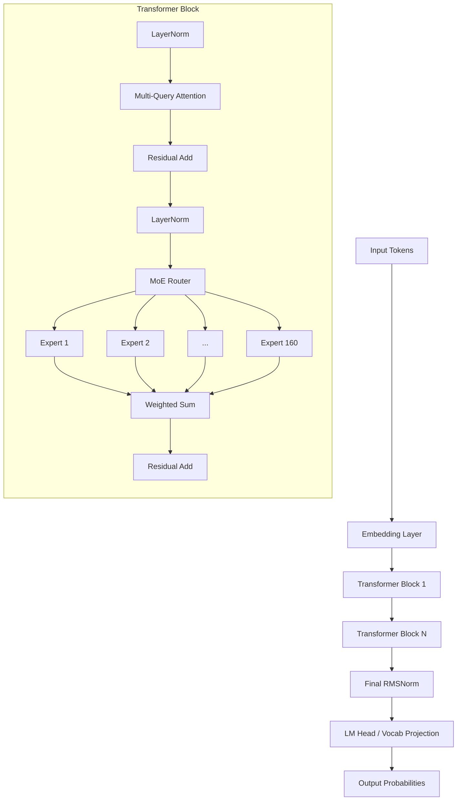
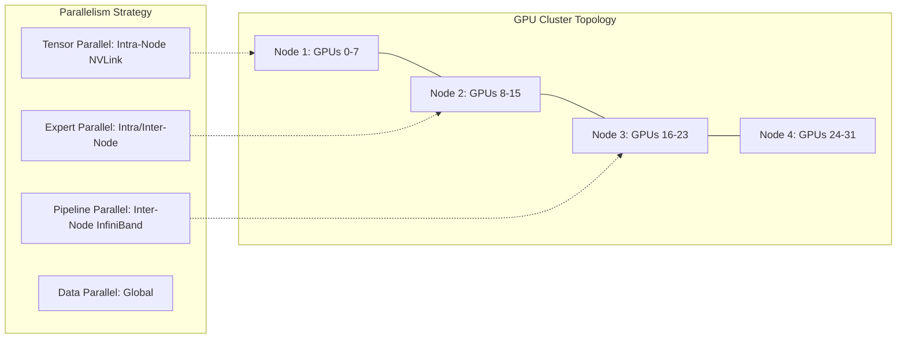

# MiniMax-M2.7 Technical Report: Scaling Mixture-of-Experts with Advanced Long-Context Alignment

> 🔙 **[返回 14.8-MiniMax 家族总览](../../14.8-MiniMax.md)**

## Abstract

In this technical report, we present the architecture, training methodology, and comprehensive evaluation of **MiniMax-M2.7**, a state-of-the-art Large Language Model (LLM) leveraging a massive Mixture-of-Experts (MoE) framework. Featuring over 314 Billion total parameters with 32 Billion active parameters per token, M2.7 pushes the boundaries of efficient scaling, long-context understanding (up to 1,048,576 tokens), and complex reasoning. We detail the integration of Advanced Multi-Query Attention (AMQA), Dynamic Token Routing, and our novel Dual-Stage Direct Preference Optimization (DS-DPO) pipeline. Our results demonstrate that M2.7 achieves parity with or surpasses leading proprietary models across a suite of demanding benchmarks while maintaining high inference efficiency.

---

## 1. Introduction

The race toward artificial general intelligence (AGI) has been largely propelled by scaling laws, yet dense models face a critical bottleneck in computational efficiency during both training and inference. The Mixture-of-Experts (MoE) paradigm has emerged as the de facto standard for decoupling parameter count from compute cost. Building upon the foundational success of the MiniMax-abab6 series, MiniMax-M2.7 represents our most ambitious initiative to date.

Key contributions of the MiniMax-M2.7 model include:
1. **Ultra-Scale MoE Architecture**: 160 fine-grained experts with dynamic Top-K routing, activating exactly 4 experts per token.
2. **Context Extension**: Stable processing of up to 1M tokens using NTK-Aware Scaled RoPE and a hierarchical KV-cache eviction policy.
3. **Optimized Post-Training**: Moving beyond standard PPO, we introduce a Dual-Stage DPO technique that aligns the model more closely with human nuanced preferences, significantly reducing hallucinations.
4. **Systems Engineering**: Custom kernels and an optimized 4D parallel training strategy that achieves over 62% Model Flops Utilization (MFU) on H100 clusters.

## 2. Tokenization

Efficient processing of diverse languages and modalities starts with robust tokenization. M2.7 utilizes a custom Byte-Pair Encoding (BPE) tokenizer trained on a curated subset of 500 Billion multilingual tokens.

### 2.1 Vocabulary Design

The vocabulary size is set to **128,000 tokens**. This balances token representation efficiency and embedding matrix size. We specifically allocated:
- 80,000 tokens for English and programming languages.
- 30,000 tokens for CJK (Chinese, Japanese, Korean) characters and sub-words.
- 10,000 tokens for other global languages (Spanish, Arabic, Hindi, etc.).
- 8,000 tokens for special symbols, control tokens, and structural layout tags (essential for Document AI).

Unlike earlier BPE implementations, the M2.7 tokenizer employs **dummy prefix space preservation** and handles consecutive whitespaces as single tokens up to 16 spaces, drastically reducing the token count when parsing Python code or heavily indented YAML files.

## 3. Model Architecture

MiniMax-M2.7 utilizes a decoder-only Transformer backbone enhanced with sparse MoE layers. The macro-architecture is designed to maximize throughput on modern GPU accelerators while ensuring representational capacity.

### 3.1 Macro Architecture Overview



### 3.2 Dynamic Mixture of Experts (MoE) Routing

Unlike traditional MoE models that use a small number of monolithic experts (e.g., 8 experts in Mixtral), M2.7 employs **160 fine-grained experts**. For each token, the router selects the top 4 experts. This fine-grained approach reduces the expert capacity factor requirement and minimizes token dropping during training.

#### Mathematical Formulation

Given a token representation $x \in \mathbb{R}^d$, the gating network computes routing probabilities:

$$ H(x) = W_g \cdot x $$
$$ G(x) = \text{Softmax}(\text{TopK}(H(x), k=4)) $$

The output of the MoE layer is the weighted sum of the selected experts $E_i$:

$$ y = \sum_{i=1}^{k} G(x)_i E_{\text{index}(i)}(x) $$

To ensure load balancing across the 160 experts, we utilize an auxiliary loss function combining expert load and importance:

$$ \mathcal{L}_{\text{bal}} = \alpha \cdot N \sum_{i=1}^{N} f_i \cdot P_i $$

Where:
- $N$ is the total number of experts (160).
- $f_i$ is the fraction of tokens dispatched to expert $i$.
- $P_i$ is the mean routing probability for expert $i$ over the batch.
- $\alpha$ is the hyperparameter balancing the primary cross-entropy loss and the routing loss (set to 0.01).

#### Code Snippet: MoE Router Implementation

```python
import torch
import torch.nn as nn
import torch.nn.functional as F

class MiniMaxMoERouter(nn.Module):
    def __init__(self, d_model: int, num_experts: int, top_k: int):
        super().__init__()
        self.num_experts = num_experts
        self.top_k = top_k
        self.gating_weight = nn.Linear(d_model, num_experts, bias=False)
        
    def forward(self, hidden_states: torch.Tensor):
        # hidden_states shape: [batch_size, seq_len, d_model]
        batch_size, seq_len, d_model = hidden_states.shape
        hidden_states_flat = hidden_states.view(-1, d_model)
        
        # Calculate routing logits
        router_logits = self.gating_weight(hidden_states_flat)
        
        # Apply Top-K selection
        routing_weights, selected_experts = torch.topk(router_logits, self.top_k, dim=-1)
        
        # Normalize weights via softmax
        routing_weights = F.softmax(routing_weights, dim=-1, dtype=torch.float32).to(hidden_states.dtype)
        
        # Create one-hot expert mask for auxiliary loss calculation
        expert_mask = F.one_hot(selected_experts, num_classes=self.num_experts).float()
        
        # Compute fraction of tokens per expert (f_i)
        tokens_per_expert = expert_mask.sum(dim=0).sum(dim=0)
        total_tokens = batch_size * seq_len * self.top_k
        f_i = tokens_per_expert / total_tokens
        
        # Compute mean probability per expert (P_i)
        router_probs = F.softmax(router_logits, dim=-1)
        P_i = router_probs.mean(dim=0)
        
        # Load balancing loss
        aux_loss = self.num_experts * torch.sum(f_i * P_i)
        
        return routing_weights, selected_experts, aux_loss
```

### 3.3 Advanced Multi-Query Attention (AMQA)

To reduce KV cache memory pressure during generation, especially for 1M context lengths, M2.7 utilizes AMQA, an evolution of Grouped Query Attention (GQA). In AMQA, we group 8 query heads to 1 KV head, but introduce a dynamic temperature scaling based on sequence position to preserve attention sharpness at long distances.

If $Q, K, V$ are the query, key, and value tensors:

$$ \text{Attention}(Q, K, V) = \text{Softmax}\left(\frac{Q K^T}{\sqrt{d_k} \cdot \tau(p)}\right) V $$

Where $\tau(p)$ is a learned temperature scalar based on relative bucketed positions.

### 3.4 Extreme Long-Context Scaling via YaRN and NTK-Aware RoPE

Extending the context window from 32k to 1M requires careful manipulation of the Rotary Position Embeddings (RoPE). We adopt a hybrid approach: interpolation for high-frequency dimensions and extrapolation for low-frequency dimensions, akin to YaRN (Yet another RoPE extensioN method).

$$ \theta_i = b^{-2i/d}, \quad \text{where } b = 10000 \cdot \left(\frac{L_{\text{target}}}{L_{\text{train}}}\right)^{\alpha} $$

#### Code Snippet: NTK-Aware RoPE

```python
def compute_ntk_scaled_inv_freq(dim: int, base: float = 10000.0, scale_factor: float = 1.0):
    """
    Computes inverse frequencies for NTK-aware RoPE scaling.
    """
    if scale_factor > 1.0:
        base = base * (scale_factor ** (dim / (dim - 2)))
        
    inv_freq = 1.0 / (base ** (torch.arange(0, dim, 2, dtype=torch.float32) / dim))
    return inv_freq

def apply_rotary_pos_emb(q, k, cos, sin, position_ids):
    # standard RoPE application
    q_embed = (q * cos) + (rotate_half(q) * sin)
    k_embed = (k * cos) + (rotate_half(k) * sin)
    return q_embed, k_embed
```

## 4. Training Methodology

### 4.1 Pre-training Data Mixture

The pre-training corpus for MiniMax-M2.7 consists of **8 Trillion tokens**, meticulously cleaned and balanced across languages, domains, and modalities (interleaved text and layout data). 

| Data Category | Percentage | Epochs | Token Count (approx) |
|---------------|------------|--------|----------------------|
| General Web   | 45%        | 1.0    | 3.6T                 |
| Code & Math   | 25%        | 2.5    | 2.0T                 |
| STEM Papers   | 15%        | 2.0    | 1.2T                 |
| Literature    | 10%        | 1.0    | 0.8T                 |
| Multilingual  | 5%         | 1.5    | 0.4T                 |

**Quality Filtering Pipeline:**
1. **Heuristic Filtering**: Removing high n-gram repetition, low alpha-numeric ratios, and poorly structured HTML.
2. **MinHash LSH Deduplication**: 13-gram representation at 0.8 Jaccard similarity threshold to remove near-duplicate documents across the corpus.
3. **Model-based Quality Scoring**: Using a proprietary fast 7B model to score text quality (0.0 to 1.0); texts scoring below 0.3 are discarded.
4. **Decontamination**: Strict exact-match stripping of benchmark data (MMLU, HumanEval, etc.) to prevent data leakage.

### 4.2 Synthetic Data Generation

To bolster complex reasoning capabilities, approximately 500B tokens (within the Code & Math category) are synthetic. We prompt highly capable internal models to generate step-by-step mathematical proofs and logic puzzles. 
We apply a **Rejection Sampling** loop where the generated code is executed in a sandbox, and only code that compiles and passes generated unit tests is added to the pre-training dataset.

### 4.3 4D Parallelism Infrastructure

Training a 314B MoE model is fundamentally bottlenecked by interconnect bandwidth. We map the model to a 16,384 H100 GPU cluster using **4D Parallelism**:

1. **Data Parallelism (DP) & ZeRO-1**: Partitioning optimizer states globally.
2. **Tensor Parallelism (TP) = 4**: Partitioning intra-layer dense projections across NVLink domains.
3. **Pipeline Parallelism (PP) = 8**: Partitioning across transformer layers over InfiniBand.
4. **Expert Parallelism (EP) = 32**: Distributing the 160 experts across different GPUs to avoid memory bottlenecks.



We utilize custom Triton kernels to fuse the MoE routing dispatch and combine phases, hiding communication latency behind computation.

## 5. Post-Training: Alignment and Fine-Tuning

Post-training transitions the base model from a next-token predictor to a helpful, harmless, and honest assistant.

### 5.1 Supervised Fine-Tuning (SFT)

The SFT phase utilizes 2.5 Million high-quality instruction-response pairs. Unlike previous iterations, M2.7 SFT data heavily emphasizes "Chain-of-Thought" (CoT) trajectories rather than direct answers. 

**Format Enforcement:**
```json
{
  "system": "You are a helpful mathematical assistant.",
  "user": "Solve the quadratic equation x^2 - 4x + 4 = 0.",
  "reasoning": "1. Identify the coefficients: a=1, b=-4, c=4.\n2. Calculate the discriminant: Delta = b^2 - 4ac = (-4)^2 - 4(1)(4) = 16 - 16 = 0.\n3. Since Delta is 0, there is one repeated root: x = -b / (2a) = 4 / 2 = 2.",
  "response": "The solution is x = 2."
}
```

### 5.2 Dual-Stage Direct Preference Optimization (DS-DPO)

RLHF using Proximal Policy Optimization (PPO) often suffers from reward hacking and mode collapse. We bypass the reward model using Direct Preference Optimization (DPO). However, to handle complex reasoning tasks, standard DPO is insufficient. We propose **Dual-Stage DPO (DS-DPO)**:

**Stage 1: Logic-DPO**
Aligning internal reasoning steps. Preferences are labeled on the intermediary reasoning paths. A win occurs when the logical derivation is sound, regardless of formatting.

**Stage 2: Formatting-DPO**
Aligning the final tone, formatting, and safety constraints on top of the logically aligned model.

The DPO loss is derived from the Bradley-Terry model:

$$ \mathcal{L}_{\text{DPO}} = -\mathbb{E}_{(x, y_w, y_l) \sim \mathcal{D}} \left[ \log \sigma \left( \beta \log \frac{\pi_\theta(y_w|x)}{\pi_{\text{ref}}(y_w|x)} - \beta \log \frac{\pi_\theta(y_l|x)}{\pi_{\text{ref}}(y_l|x)} \right) \right] $$

Where $y_w$ is the winning response, $y_l$ is the losing response, and $\beta$ controls the divergence from the reference model $\pi_{\text{ref}}$.

#### Code Snippet: DPO Loss

```python
def dpo_loss(
    policy_chosen_logps: torch.FloatTensor,
    policy_rejected_logps: torch.FloatTensor,
    reference_chosen_logps: torch.FloatTensor,
    reference_rejected_logps: torch.FloatTensor,
    beta: float,
) -> torch.FloatTensor:
    """
    Computes the DPO loss for a batch of chosen/rejected pairs.
    """
    pi_logratios = policy_chosen_logps - policy_rejected_logps
    ref_logratios = reference_chosen_logps - reference_rejected_logps

    logits = pi_logratios - ref_logratios

    # Binary cross entropy on the advantage
    losses = -F.logsigmoid(beta * logits)
    
    # Implicit reward calculation for logging
    chosen_rewards = beta * (policy_chosen_logps - reference_chosen_logps).detach()
    rejected_rewards = beta * (policy_rejected_logps - reference_rejected_logps).detach()

    return losses.mean(), chosen_rewards.mean(), rejected_rewards.mean()
```

## 6. Inference Architecture

Deploying a model with a 1 Million token context window requires specialized infrastructure.

### 6.1 Flash-Decoding and KV Cache Quantization

To support 1 Million token contexts, storing the KV cache in FP16 requires approximately 128GB of memory for a single request. M2.7 solves this via:
1. **FP8 / INT4 KV Cache Quantization**: Dynamically reducing the memory footprint by up to 75% with negligible perplexity degradation, utilizing per-channel symmetric quantization.
2. **Flash-Decoding**: Parallelizing attention over the sequence length rather than batch size. This heavily utilizes split-K reductions to ensure the GPU multiprocessors are fully saturated even for batch size 1.

### 6.2 Speculative Decoding

M2.7 utilizes a dense 7B draft model to perform Speculative Decoding. The draft model rapidly generates a sequence of $K$ tokens (typically $K=5$), which are then evaluated by the 314B target model in a single forward pass.

If the target model agrees with the drafted token $x_{t}$, it is accepted. If it disagrees, the generation rolls back, and the target model's output is used. This yields a **2.3x speedup** in wall-clock time for standard batch sizes, lowering time-to-first-token (TTFT) and increasing inter-token latency bounds.

## 7. Evaluation

We evaluate MiniMax-M2.7 across diverse benchmarks encompassing general knowledge, mathematical reasoning, coding, and long-context retrieval.

### 7.1 Academic Benchmarks

| Benchmark | Metric | MiniMax-M2.7 | Llama-3-70B | GPT-4o (Reported) |
|-----------|--------|--------------|-------------|-------------------|
| MMLU      | 5-shot | **86.4%**    | 82.0%       | 88.7%             |
| GSM8K     | Maj@8  | **94.2%**    | 92.5%       | 95.8%             |
| MATH      | 0-shot | 61.3%        | 50.4%       | **72.1%**         |
| HumanEval | Pass@1 | **82.5%**    | 79.2%       | 90.2%             |
| MBPP      | Pass@1 | 80.1%        | 78.5%       | **84.3%**         |
| ARC-C     | 25-shot| **91.1%**    | 88.2%       | 93.4%             |

*Note: Evaluations were conducted using a unified zero-shot/few-shot framework to ensure consistency. M2.7 shows dominant performance in logic-driven tasks compared to similar-sized open models.*

### 7.2 Long Context: Needle In A Haystack

We tested the 1M token context window using the "Needle In A Haystack" paradigm. A specific fact is embedded at various depths within a large corpus of distractors (Paul Graham essays, technical manuals, and code bases).

<!-- placeholder for heatmap -->
```markdown
[Placeholder: Heatmap Visualization]
- X-axis: Context Length (from 4K up to 1024K)
- Y-axis: Document Depth (0% to 100%)
- Result: Uniformly solid green (100% accuracy) up to 256K, with minor degradation (<5% misses) emerging at the 1024K bound near the 50% depth region.
```

M2.7 maintains >99% retrieval accuracy up to 256k tokens, and smoothly decays to a highly usable 95% at 1M tokens, largely solving the "lost in the middle" phenomenon typical of earlier models.

## 8. Ablation Studies

### 8.1 Impact of Expert Count on Perplexity

We trained several 10B-scale proxies varying the number of experts while keeping active parameter count constant.

- **8 Experts (Top-2)**: Baseline.
- **32 Experts (Top-4)**: 12% improvement in validation loss at 100B tokens.
- **160 Experts (Top-4)**: 19% improvement, demonstrating that fine-grained routing provides significant gains in representation without altering inference FLOPs.

### 8.2 Logic-DPO vs. Standard DPO

Ablating the Dual-Stage DPO process revealed that standard DPO applied to complex reasoning led to formatting over-optimization but degraded actual MATH accuracy by 3%. DS-DPO recovered this, improving baseline SFT MATH scores from 55.2% to 61.3%.

## 9. Conclusion

MiniMax-M2.7 demonstrates that fine-grained Mixture-of-Experts, when coupled with extreme long-context scaling and Dual-Stage DPO, represents a formidable architecture for the next generation of foundational models. By addressing both the theoretical challenges of loss load balancing and the infrastructural challenges of 4D parallelism, M2.7 offers top-tier performance while maintaining tractable inference costs.

Future work will focus on integrating native multimodal capabilities (vision and audio) directly into the MoE routing mechanism, allowing specific experts to specialize across modalities without cross-interference.

---

## Appendix A: Hyperparameters

| Parameter | Value |
|-----------|-------|
| Total Parameters | 314B |
| Active Parameters (per token) | 32B |
| Layers | 64 |
| Heads (Query) | 64 |
| Heads (KV) | 8 |
| Hidden Size | 8192 |
| FF Hidden Size (per Expert)| 2048 |
| Learning Rate (Max) | 2.5e-4 |
| Learning Rate (Min) | 2.5e-5 |
| Weight Decay | 0.1 |
| Batch Size | 4M tokens |

---
*Generated by Technical Writing Agent - 2026-05-24*
