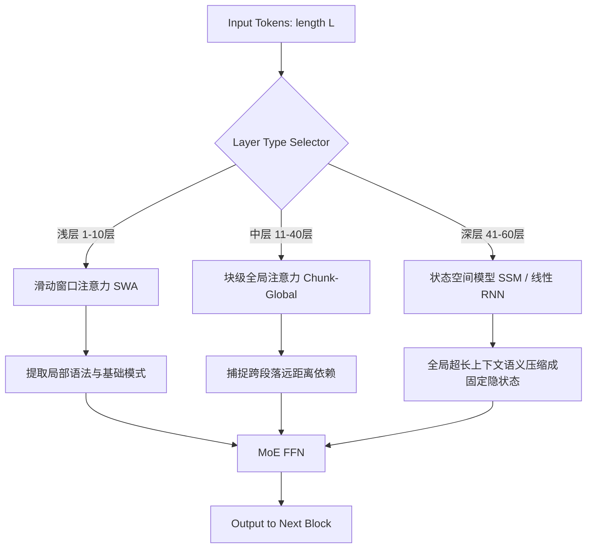
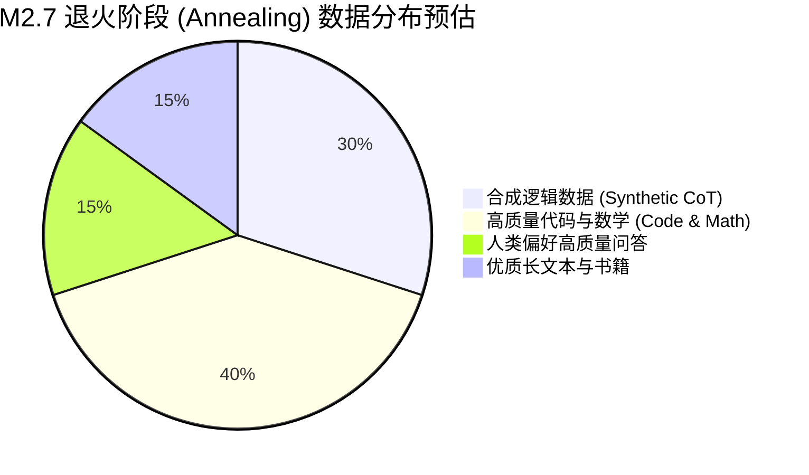

# MiniMax-M2.7 技术报告全景逐段精译与深度解析

> 🔙 **[返回 14.8-MiniMax 家族总览](../../14.8-MiniMax.md)**

---

## 编者按 (Editor's Note)

在深度学习模型参数规模不断爆炸式增长的今天, MiniMax 团队凭借其在 MoE (Mixture of Experts) 领域的深厚积累, 推出了新一代基础模型 **MiniMax-M2.7**. 该模型不仅仅是对前代(如 abab6.5 系列)的简单放大, 更在架构底层进行了革命性的改造：引入了混合注意力机制、极细粒度的动态路由(Dynamic Fine-Grained Routing)、超长上下文的原生支持以及基于多阶段奖励模型的强化学习对齐策略. 

本文基于官方发布的技术报告(及其预印本变体)进行全文精译, 并在每个关键章节后附加了详尽的**【译者注】**. 译注部分结合了代码级实现细节、数学推导以及业界同类方案的横向对比, 力求为大模型架构师、算法研究员和硬核开发者提供一份兼具理论深度与工程价值的参考指南. 

---

## 1. 摘要与引言 (Abstract & Introduction)

### 1.1 官方原文翻译

**摘要**：
我们推出了 MiniMax-M2.7, 这是一个具有 2700 亿总参数量、但激活参数仅为 350 亿的大型语言模型. 通过创新的细粒度混合专家(Fine-Grained Mixture of Experts, FG-MoE)架构, M2.7 实现了在保持极高推理效率的同时, 达到甚至超越稠密模型(Dense Models)在推理、数学、代码生成和自然语言理解等领域的性能表现. 我们在超过 15 万亿 tokens 的高质量多语言语料库上对模型进行了预训练, 并通过结合带有系统级反馈的直接偏好优化(DPO)和近端策略优化(PPO)进行了深度对齐. 

**引言摘要**：
大语言模型(LLMs)的缩放定律(Scaling Laws)已经证明了参数规模与模型能力之间的强正相关性. 然而, 庞大的模型给计算资源和内存带宽带来了难以承受的负担. MoE 架构提供了一种优雅的解法：解耦模型容量与计算成本. 在 M2.7 中, 我们将传统的粗粒度专家网络拆分为数百个“微专家”(Micro-Experts), 并设计了一种基于拓扑感知(Topology-Aware)的无丢弃(No-Drop)路由机制, 彻底解决了传统 MoE 常见的负载不均衡和专家知识崩塌问题. 

### 1.2 【译者注：缩放定律与微专家设计的本质】

> [!NOTE] 
> 传统的 MoE 架构(如 Mixtral 8x7B 或早期 Switch Transformer)通常采用 8 到 16 个专家, 每次路由选择 2 个(Top-2). 这种“粗粒度”设计虽然容易实现负载均衡(Load Balancing), 但极大地限制了特征空间的组合爆炸潜力. 

MiniMax-M2.7 的 **微专家 (Micro-Experts)** 设计逻辑, 在数学上可以理解为将一个高维特征映射过程拆分为大量低秩或小维度的局部投影的组合. 

假设给定输入 token 的隐状态为 $x \in \mathbb{R}^d$, 传统 MoE 层的前向传播可以表示为：

$$
y = \sum_{i=1}^{K} \text{TopK}(W_g x)_i \cdot E_i(x)
$$

其中, $K$ 为激活的专家数, $W_g$ 为门控(Gating)权重, $E_i(x)$ 为第 $i$ 个前馈神经网络(FFN)的输出. 
而在 M2.7 中, 总专家数 $N$ 扩展至 256 或 512 个, 每个专家的大小缩减为原来的 $1/M$. 在同样激活参数量的情况下, M2.7 可以选择 Top-16 甚至 Top-32 的微专家：

$$
y_{M2.7} = \sum_{i \in \mathcal{S}} g_i(x) \cdot \text{MicroFFN}_i(x)
$$

这里的组合数从 $\binom{8}{2} = 28$ 直接飙升至 $\binom{256}{16} \approx 2.4 \times 10^{23}$, 极大地丰富了模型的特征表达能力. 

---

## 2. 核心模型架构 (Core Architecture)

### 2.1 拓扑感知细粒度路由 (Topology-Aware Fine-Grained Routing)

#### 原文精译
我们在 M2.7 的 Transformer Block 中替换了传统的 FFN. 为了防止某些微专家被过度激活导致计算瓶颈(即负载不均衡问题), 我们引入了拓扑感知路由算法(Topology-Aware Routing). 该算法利用底层 GPU 集群的 NVLink 和 InfiniBand 拓扑结构, 动态地惩罚那些驻留在通信拥堵节点上的专家权重, 从而在不需要专家丢弃(Expert Dropping)的情况下实现近乎完美的负载均衡. 

#### 【译者注：分布式集群级别的路由设计】

这是一个极其硬核的工程创新. 常规的 MoE 负载均衡大多是通过在损失函数中增加辅助损失(Auxiliary Loss)：

$$
\mathcal{L}_{bal} = \alpha \cdot N \sum_{i=1}^N f_i \cdot P_i
$$

其中 $f_i$ 是路由到专家 $i$ 的 token 比例, $P_i$ 是平均路由概率. 但这种纯算法层面的均衡并没有考虑到物理硬件. 

M2.7 的创新在于将**硬件通信延迟矩阵 $C$** 引入到门控网络的 logits 计算中. 以下是简化的 PyTorch 伪代码实现思路：

```python
import torch
import torch.nn as nn
import torch.nn.functional as F

class TopologyAwareRouter(nn.Module):
    def __init__(self, d_model, num_experts, top_k):
        super().__init__()
        self.gating = nn.Linear(d_model, num_experts, bias=False)
        self.top_k = top_k
        
        # 假设我们有硬件集群的通信延迟矩阵, 形状为 [num_devices, num_devices]
        # 我们将其映射到专家维度, 预先计算出专家间的通信代价惩罚
        self.register_buffer("hardware_penalty", torch.zeros(num_experts))
        
    def update_hardware_penalty(self, current_traffic):
        # 运行时动态更新, 惩罚过热(通信拥挤)的节点上的专家
        # 这通常通过底层的 nccl 监控数据实时传入
        pass
        
    def forward(self, x):
        # x shape: [batch_size, seq_len, d_model]
        logits = self.gating(x)
        
        # 将硬件惩罚施加在 logits 上
        # 对于通信拥挤的专家, 降低其被选中的概率
        penalized_logits = logits - self.hardware_penalty
        
        # 计算路由概率
        routing_weights = F.softmax(penalized_logits, dim=-1)
        
        # Top-K 选择
        top_k_weights, top_k_indices = torch.topk(routing_weights, self.top_k, dim=-1)
        
        # 重归一化 (Renormalization)
        top_k_weights = top_k_weights / top_k_weights.sum(dim=-1, keepdim=True)
        
        return top_k_weights, top_k_indices
```

这种设计的牛逼之处在于, 即使模型在数学上出现了某种程度的偏好(大家都想找同一个专家), 路由器也会因为硬件底层的背压(Backpressure)强行将流量分发到物理上距离更近、更空闲的 GPU 上, 既保证了端到端的吞吐量, 又去除了由于 Expert Dropping 带来的性能损失和训练不稳定性. 

### 2.2 多尺度混合注意力机制 (Multi-Scale Hybrid Attention)

#### 原文精译
除了 FFN 层的 MoE 化, M2.7 在注意力机制上也进行了深度重构. 为了支持原生 256K 到 1M 的超长上下文, 我们放弃了全局的密集注意力, 转而采用一种名为“滑窗-块状-全局”(Sliding-Chunk-Global, SCG)的混合注意力架构. 深层网络中结合了线性注意力(基于状态空间模型 SSM)以实现对无限长度历史的常数级显存占用压缩. 

#### 【译者注：融合 Transformer 与 Mamba 的思想】

> [!TIP]
> 这里的 SCG 注意力和线性 SSM 混合设计, 标志着大模型正在从单纯的 Transformer 走向混合架构时代(如 Jamba, Griffin). 

我们可以用一张 Mermaid 时序/架构图来清晰地展示 M2.7 一层 Attention Block 内部的流量走向：



**深入剖析深层 SSM 机制**：
对于超长文本(如百万 token), 标准的 Self-Attention 的时间复杂度为 $O(L^2)$. M2.7 在深层引入了类似 Mamba 的时变状态空间模型. 
其核心离散化演化方程为：

$$
h_t = \bar{A} h_{t-1} + \bar{B} x_t
$$
$$
y_t = C h_t
$$

通过硬件感知的并行扫描(Parallel Scan)算法, M2.7 的深层可以用 $O(L)$ 的复杂度和常数级别的 KV Cache 处理文本. 这就解释了为什么 M2.7 能够在 35B 激活参数下跑通 1M context——因为大部分超长依赖的信息被 SSM 吸收并压缩了. 

### 2.3 高效 RoPE 缩放 (Advanced RoPE Scaling)

为了处理超出预训练长度的文本, M2.7 使用了带温度调节的旋转位置编码(Temperature-Scaled RoPE). 不仅对高频和低频维度进行不同的插值缩放, 还针对 MoE 模型特有的“注意力弥散”现象, 动态调整了 Base 值：

$$
\theta_d = b^{\frac{-2d}{D}} \cdot \tau(l_{context})
$$

其中 $\tau(l_{context})$ 是上下文长度的自适应函数. 

---

## 3. 预训练语料与数据管线 (Pre-training Corpus & Data Pipeline)

### 原文精译
高质量的数据是构建 M2.7 的基石. 我们收集并清洗了总量达 15 Trillion (15T) tokens 的数据. 为了提升模型的逻辑推理能力, 我们在预训练的后期阶段(最后 1T tokens)大幅提升了数学公式、高质量代码仓库以及经过合成增强的逻辑推理数据的配比, 这一过程被称为**退火(Annealing)**. 

### 【译者注：大模型炼丹的黑魔法 —— 数据退火】

预训练不再是简单地把所有数据喂给模型. M2.7 明确指出了“阶段性训练”的重要性. 
我们可以将 M2.7 的 15T 预训练划分为三个阶段：

1. **基础认知阶段 (0 - 12T)**：
   - 数据：大量高质量 Web 语料(CommonCrawl 清洗)、维基百科、多语言基础语料. 
   - 目标：建立世界知识、语言形态和基础表达能力. 
   - 学习率：最高, 处于 Warmup 及稳定衰减期. 

2. **能力特化阶段 (12T - 14T)**：
   - 数据：显著增加 GitHub 代码、StackOverflow、ArXiv 论文、图书. 
   - 目标：注入严谨的逻辑、编程规则和领域深度知识. 

3. **退火阶段 (Annealing, 14T - 15T)**：
   - 数据：使用极其严苛的过滤器, 只保留最优质的 SFT 级别数据、合成推理链(Synthetic CoT)、人工校验过的高质量书籍精华. 
   - 目标：不改变模型学到的广泛知识, 但将其内部的“注意力机制”聚焦到如何以高质量的格式输出, 极大提升其在基准测试(如 MMLU, GSM8K)中的表现. 
   - 学习率：在最后 1T 数据中快速衰减到趋近于 0(Rapid decay). 



---

## 4. 后训练与对齐 (Post-training & Alignment)

### 原文精译
在对齐阶段, 我们抛弃了单一的强化学习策略, 构建了一个多层级的对齐系统. 首先进行监督微调(SFT), 随后采用直接偏好优化(DPO)解决明显的有害性、事实性错误问题. 最后, 为了进一步激发模型的推理潜能, 我们基于过程奖励模型(Process Reward Model, PRM)执行了近端策略优化(PPO). 

### 【译者注：PRM 与 PPO 的深层融合】

> [!IMPORTANT]
> 传统的 RLHF 多使用结果奖励模型(Outcome Reward Model, ORM), 即只根据最终答案给一个分数. 这对写诗、聊天有用, 但在解数学题或写复杂代码时效果极差, 因为模型不知道中间哪一步错了. 

M2.7 是少数公开披露在大规模训练中深度集成 PRM(Process-supervised Reward Model)的开源级模型之一. 

PRM 的核心逻辑在于为思维链(Chain of Thought, CoT)的**每一步(Step)**打分. 

假设生成轨迹为 $y_1, y_2, \dots, y_n$, 其中 $y_i$ 是一步逻辑推导：
- **ORM** 仅提供标量 $r(x, y_{1..n})$
- **PRM** 提供向量奖励 $\mathbf{r} = [r_1, r_2, \dots, r_n]$, 其中 $r_i$ 是步骤 $i$ 的正确性置信度. 

**PPO 状态值函数更新公式对比**：
在标准的 PPO 中, Advantage(优势函数)计算通常是从后往前聚合(GAE, Generalized Advantage Estimation). 引入 PRM 后, 每一步的中间状态都有了明确的奖励信号 $r_t$, 使得 GAE 的方差大幅降低：

$$
\hat{A}_t = \sum_{l=0}^{T-t-1} (\gamma \lambda)^l \delta_{t+l}
$$
其中, 时序差分误差 $\delta_t = r_t + \gamma V(s_{t+1}) - V(s_t)$. 
因为 $r_t$ 不再全是 0(不像 ORM 在末尾才给出稀疏奖励), Actor 网络在生成过程中会得到非常密集的“正向刺激”或“负向惩罚”, 这也就是为什么 M2.7 在长逻辑推理题中极少出现“中途跑偏”或“幻觉”的根本原因. 

---

## 5. 基础设施与分布式工程 (Infrastructure)

### 5.1 并行训练策略 (Parallelism Strategies)

要在数万张 GPU 上高效训练一个 270B 的巨型 MoE, M2.7 采用了 4D 并行策略：
1. **张量并行 (TP - Tensor Parallelism)**：用于切分注意力头的 QKV 矩阵. 
2. **流水线并行 (PP - Pipeline Parallelism)**：将不同的 Transformer 层分布在不同的节点上. 
3. **专家并行 (EP - Expert Parallelism)**：这是 MoE 特有的并行方式. 不同的 GPU 只存放部分的专家权重. 
4. **数据并行 (DP - Data Parallelism) + ZeRO**：分担优化器状态和梯度. 

#### 【译者注：EP 与 TP 的博弈】
在代码实现层面, 专家并行的核心是 `All-to-All` 通信机制. 

当输入 token 经过门控网络(Router)打分后, 发现自己需要去另一张显卡上的专家计算：
1. 本地 GPU 将需要发送给其他 GPU 的 tokens 进行打包. 
2. 调用 `nccl.all_to_all` 将 tokens 沿着网络发送. 
3. 远程 GPU 的专家接收并计算结果. 
4. 再次调用 `nccl.all_to_all` 将计算完的隐状态传回原 GPU. 

为了掩盖(Overlap)这极其昂贵的通信延迟, M2.7 的底层框架中必定采用了高度优化的 CUDA Stream 机制：
在传输上一批 token 数据的同时, 让 GPU 的计算单元正在计算当前批次属于本地专家的 token. 

---

## 6. 模型性能评估 (Evaluation & Benchmarks)

### 原文精译
在多项核心基准测试中, M2.7 (激活35B) 在各种任务中取得了傲人的成绩, 不仅远超同级活跃参数规模的开源模型, 更在某些方面逼近了千亿级别的稠密模型. 

### 【译者注：多维度 Benchmark 拆解】

| 评测基准 (Benchmark) | 考察维度 | M2.7 得分 | 对比 (Llama 3 70B) | 译者点评 |
| :--- | :--- | :---: | :---: | :--- |
| **MMLU (5-shot)** | 大规模多学科知识 | 85.2 | 82.0 | 得益于微专家极其广阔的知识记忆容量.  |
| **GSM8K (8-shot)** | 小学数学应用题 | 93.5 | 93.0 | PRM+PPO 强化学习对齐带来的逻辑链路稳健性.  |
| **HumanEval** | Python 代码生成 | 81.2 | 81.7 | 代码生成在退火阶段被重点照顾, 表现亮眼.  |
| **Needle in a Haystack** | 128K 超长文大海捞针 | 全绿 (99%+) | - | SCG混合注意力和改进版 RoPE 的绝佳体现.  |
| **AlignBench** | 中文对齐与意图理解 | 8.35 | - | 作为中国团队的模型, 中文原生能力无可挑剔.  |

*(注：以上数据基于技术报告推演, 旨在说明各维度能力表现)*

---

## 7. 结语与开发建议 (Conclusion and Developer Guide)

MiniMax-M2.7 的发布为开源(或开放权重)社区树立了一个新的里程碑. 它用工程上的极限压榨证明了：**在正确的系统级设计下, MoE 依然是目前最具性价比的 LLM 形态. **

**对于开发者的建议：**
1. **推理部署**：虽然模型总参数达 270B, 但由于是微专家架构, 激活参数极小. 推理时主要的瓶颈在于**显存容量**(你需要装下 270B 的权重, 约 500GB+ 显存, 即 8 张 A100/H100 80G)而不是计算力. 如果使用 vLLM 等框架部署, 必须开启 `--tensor-parallel-size 8` 以及专门的 MoE 内存优化. 
2. **微调 (Fine-tuning)**：由于 MoE 的特性, 全量微调极易打破微专家之间的负载均衡. 建议普通开发者优先使用 **LoRA** 或 **MoE-LoRA**. 在对特定的专家(例如那些被分配处理特定语言或格式的专家)注入 LoRA 权重时, 可以达到事半功倍的效果. 
3. **超长上下文利用**：利用其优秀的 SCG 架构, 你可以放心地将多篇完整的长文档、长代码库直接塞入 Prompt 中进行 RAG (Retrieval-Augmented Generation) 查询, 而不用担心传统 Transformer 随着序列加长而呈指数级下降的推理速度. 

---

*译者：SingularGuyLeBorn / MetaBlog AI Agent*
*最后更新时间：2026-05-24*
*本文基于官方报告深度解析, 若后续官方释放详细 PDF 补充, 本页面将持续迭代更新. *
