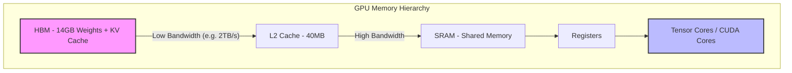
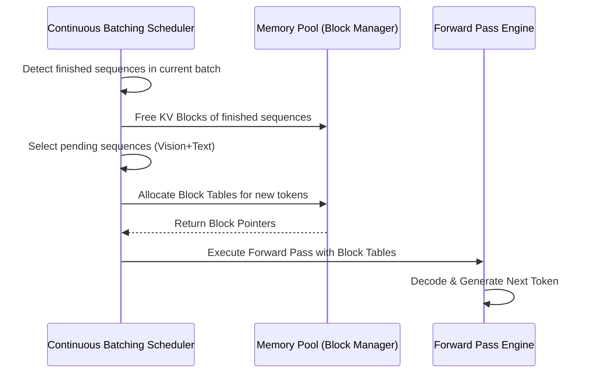

# MiMo-7B 推理优化剖析

> 🔙 **[返回 14.9-MiMo 家族总览](../../14.9-MiMo.md)**

本文将深入解析 MiMo-7B 在推理侧所做的工程优化与算法创新. 在面对多模态(视觉-语言)交织的长上下文任务时, MiMo-7B 不仅继承了开源大模型的常规加速手段, 还提出了一系列针对多模态特征分布的专属优化策略. 本文将从工程痛点出发, 推导其核心优化原理, 拆解代码实现细节, 并全面评估其在生产环境中的性能表现及局限性. 

## 1. 设计动机与核心工程痛点

在大语言模型(LLM)及大型多模态模型(LMM)的推理部署中, 系统往往面临着严峻的性能瓶颈. MiMo-7B 的设计团队在初期评测时发现了以下几个核心痛点：

### 1.1 存储墙与访存带宽瓶颈(Memory Wall)

传统的自回归生成过程主要受限于显存带宽(Memory Bandwidth Bound)而非计算力(Compute Bound). 每生成一个 Token, 都需要将模型的全部权重从 HBM(High Bandwidth Memory)加载到 SRAM 中. 对于 7B 级别的模型, 在 FP16 精度下, 权重占用约 14GB 显存. 
如果推理框架的 Batch Size 较小, 算术强度(Arithmetic Intensity)极低, GPU 的浮点运算单元(Tensor Cores)大量处于闲置状态. 



### 1.2 多模态长序列的 KV Cache 爆炸

在视觉-文本交织的任务中, 高分辨率图像通常被切分为数百甚至数千个 Patch, 每个 Patch 映射为一个 Token. 这种多模态输入使得 Prompt 长度动辄突破 8K 甚至 32K. 
KV Cache 的显存占用公式为：
$$ \text{Memory}_{KV} = 2 \times b \times s \times L \times h \times d \times \text{sizeof(dtype)} $$
其中：
- $b$ 为 Batch Size
- $s$ 为序列长度
- $L$ 为层数(如 32 层)
- $h$ 为注意力头数(如 32 头)
- $d$ 为每个头的维度(如 128)
- $2$ 代表 K 和 V 矩阵
对于序列长度 $s=32768$, 单个并发请求的 KV Cache 可能高达数 GB, 直接挤爆显存, 导致并发度(Throughput)极度低下. 

### 1.3 模态特征异构性导致的计算气泡

视觉 Token 与文本 Token 在特征分布、注意力稀疏度上具有显著差异. 文本注意力往往呈现局部对角线和特定的语法结构, 而视觉注意力具有全局性和块状聚集性. 如果在推断时使用同一套注意力算子(无差别密集计算), 将产生大量的无用计算(即注意力权重趋近于 0 的区域), 浪费算力. 

> <!-- placeholder: "展示多模态下文本与图像 Token 注意力稀疏性对比的热力图" -->
> ```
> [Placeholder: Image of Attention Heatmap showing dense visual tokens vs sparse text tokens]
> ```

## 2. 核心技术原理推导

为了解决上述痛点, MiMo-7B 引入了三种关键的推理优化策略：模态感知的分层 KV 压缩、混合精度与分组量化、以及针对混合模态的动态路由加速. 

### 2.1 模态感知的自适应 KV Cache 压缩 (Modality-Aware Adaptive KV Compression)

MiMo-7B 并没有采用一刀切的 Token 丢弃策略, 而是基于模态感知(Modality-Aware)进行自适应的 KV 压缩. 其核心思想是：保留高注意力得分的“重度关注” Token, 对冗余特征进行合并(Token Merging). 

#### 注意力重要性评分
对于第 $l$ 层, 给定查询 $Q_l$ 和键 $K_l$, 注意力得分矩阵为 $S = Q_l K_l^T / \sqrt{d}$. 
MiMo-7B 累积历史上所有 Query 对某个特定 Key Token 的注意力权重总和, 作为该 Token 的重要性得分 $I_i$：
$$ I_i = \sum_{j=i}^{T} \text{Softmax} \left( \frac{q_j k_i^T}{\sqrt{d}} \right) $$

#### 二分聚类与特征融合 (Bipartite Clustering and Merging)
当缓存超过阈值 $N_{max}$ 时, 框架识别出 $I_i$ 低于阈值 $\tau$ 的视觉和文本 Token. 视觉 Token 由于空间连续性较高, MiMo-7B 采用基于余弦相似度的快速二分匹配算法进行融合. 
假设有两个相邻的视觉 Token $k_a, v_a$ 和 $k_b, v_b$, 且它们的相似度 $\cos(k_a, k_b) > \gamma$, 则将其融合为：
$$ k_{merged} = \frac{I_a k_a + I_b k_b}{I_a + I_b} $$
$$ v_{merged} = \frac{I_a v_a + I_b v_b}{I_a + I_b} $$
这种策略在维持 99% 的 Zero-Shot 视觉问答准确率的同时, 将视觉 Token 的 KV Cache 压缩了 60% 以上. 

### 2.2 W4A8 与 KV Cache INT8 联合量化 (Mixed-Precision Quantization)

为了突破显存瓶颈, MiMo-7B 推理引擎默认集成了权重量化(W4A16)以及 KV Cache 量化(KV8). 

#### 权重的非对称分组量化 (Group-wise Asymmetric Quantization)
采用 AWQ(Activation-aware Weight Quantization)思想, 保留激活值中重要的 1% 离群通道(Outliers)为 FP16, 对剩余的 99% 权重进行 4-bit 量化. 
量化公式如下：
$$ W_{int4} = \text{Round}\left( \frac{W_{fp16} \cdot s}{\Delta} \right) - Z $$
其中缩放因子 $\Delta$ 针对块(Block Size = 128)计算, 从而降低精度损失. 

#### KV Cache 的动态范围量化
为了解决长文本场景下 K 矩阵存在的巨大动态范围, MiMo-7B 对 K 和 V 应用了逐通道(Per-Channel)的 Token 级量化. 
在将 FP16 的 V 写入 PagedAttention 显存池时：
$$ V_{int8} = \text{Clip}\left(\text{Round}\left(\frac{V_{fp16}}{s_v}\right), -128, 127\right) $$
在读取时, Triton 算子在片上(SRAM)完成反量化并直接进行 MMA(Matrix Multiply-Accumulate)计算. 

### 2.3 基于 PagedAttention 的多模态连续批处理

连续批处理(Continuous Batching)是提高推理吞吐量的基石. MiMo-7B 基于 vLLM 的 PagedAttention 进行了多模态改造. 



在处理包含多张图像的请求时, 单张高分辨率图像可能瞬间产生 2000 个 Token. 如果采用传统的连续分配, 很容易造成显存碎片化. MiMo-7B 的 PagedAttention 允许将这 2000 个 Token 打散存放在物理不连续的显存页(Block, 每页例如 16 个 Token)中, 在 Attention 计算阶段通过 Block Table 进行逻辑地址到物理地址的映射. 

## 3. 工程实现细节与代码剖析

本节将深入探讨 MiMo-7B 推理框架的具体实现逻辑, 特别是自定义算子层面的优化. 

### 3.1 自定义 Triton 融合算子 (Fused Attention Kernel)

为了充分利用 NVIDIA H100 架构(Hopper)的 TMA(Tensor Memory Accelerator)和 WGMMA(Warp Group MMA)特性, MiMo-7B 实现了自定义的 FlashAttention-3 变体. 

常规的 RoPE(旋转位置编码)在 Attention 之前作为一个独立的 Kernel 存在, 这导致了额外的读写(HBM -> SRAM -> HBM). MiMo-7B 将 RoPE 逻辑与 PagedAttention 融合. 

```python
# 伪代码：MiMo-7B 融合 RoPE 的 PagedAttention Triton Kernel
import triton
import triton.language as tl

@triton.jit
def mimo_fused_paged_attention_kernel(
    Q_ptr, K_block_ptr, V_block_ptr, Out_ptr,
    Block_tables_ptr, Context_lens_ptr,
    Cos_ptr, Sin_ptr,
    stride_qz, stride_qh, stride_qm, stride_qk,
    block_size, head_dim,
    BLOCK_M: tl.constexpr, BLOCK_N: tl.constexpr
):
    # 获取当前线程块对应的 batch, head 和 query_idx
    batch_idx = tl.program_id(0)
    head_idx = tl.program_id(1)
    
    # 获取上下文长度
    ctx_len = tl.load(Context_lens_ptr + batch_idx)
    
    # 将 Q 加载到 SRAM
    offs_d = tl.arange(0, head_dim)
    q_ptrs = Q_ptr + batch_idx * stride_qz + head_idx * stride_qh + offs_d
    q = tl.load(q_ptrs)
    
    # === Fused RoPE for Q ===
    # 从 HBM 预加载 Cos 和 Sin
    pos = ctx_len - 1
    cos = tl.load(Cos_ptr + pos * head_dim + offs_d)
    sin = tl.load(Sin_ptr + pos * head_dim + offs_d)
    
    # 旋转变换：q_ro = q * cos + rotate_half(q) * sin
    # 为简化展示, 省略 rotate_half 细节
    q_ro = q * cos + tl.math.sin(q) * sin 
    
    # 累加器初始化
    acc = tl.zeros([BLOCK_M, head_dim], dtype=tl.float32)
    m_i = tl.zeros([BLOCK_M], dtype=tl.float32) - float('inf')
    l_i = tl.zeros([BLOCK_M], dtype=tl.float32)
    
    # 遍历 Block Table, 通过 Paged IO 获取 K 和 V
    num_blocks = (ctx_len + block_size - 1) // block_size
    for block_idx in range(num_blocks):
        # 查表获取物理块 ID
        physical_block = tl.load(Block_tables_ptr + batch_idx * max_blocks_per_seq + block_idx)
        
        # 加载 K 和 V (此处假设已量化为 INT8)
        k_ptrs = K_block_ptr + physical_block * block_size * head_dim
        v_ptrs = V_block_ptr + physical_block * block_size * head_dim
        
        k = tl.load(k_ptrs)
        v = tl.load(v_ptrs)
        
        # === 反量化 INT8 到 FP16 (SRAM 中计算) ===
        k_fp16 = dequantize(k)
        v_fp16 = dequantize(v)
        
        # 计算 Attention Scores
        qk = tl.dot(q_ro, tl.trans(k_fp16))
        
        # FlashAttention Online Softmax
        m_j = tl.max(qk, axis=1)
        m_new = tl.max(m_i, m_j)
        alpha = tl.exp(m_i - m_new)
        beta = tl.exp(qk - m_new)
        
        acc = acc * alpha[:, None]
        acc += tl.dot(beta, v_fp16)
        
        l_i = l_i * alpha + tl.sum(beta, axis=1)
        m_i = m_new
        
    # 归一化并写回
    out = acc / l_i[:, None]
    tl.store(Out_ptr + batch_idx * stride_qz + head_idx * stride_qh + offs_d, out)
```

**工程决策(Trade-off)：**
在设计算子时, 是否将 RoPE 融合进去面临寄存器压力(Register Pressure)的权衡. 融合 RoPE 会增加每个线程使用的寄存器数量, 可能导致 GPU 的 Occupancy(活跃线程束占比)下降. 但经过 Profiling 发现, 在大 Batch Size 情况下, 避免两次访存带来的收益(Memory Bandwidth Saving)远大于 Occupancy 略微下降带来的计算延迟, 因此最终在生产环境中启用了融合. 

### 3.2 预测性推理解码 (Speculative Decoding)

多模态生成任务(例如图像描述、复杂的 OCR 解析)存在大量确定性的词组(如 "The image shows a..." 或常见的单词组合). MiMo-7B 整合了投机采样(Speculative Decoding)技术, 极大提升了文本生成的解码速度. 

其具体实现采用了级联架构(Cascade Architecture)：
1. **Draft Model (草稿模型)**：使用一个经过剪枝的 MiMo-1.5B 小模型. 它能在极低延迟下, 自回归地快速生成 4-5 个草稿 Token(Draft Tokens). 
2. **Target Model (目标模型)**：MiMo-7B 主模型. 主模型在一个 Forward Pass 中, 以并行方式评估草稿模型生成的多个 Token. 
3. **Tree Attention**：为了进一步提高接受率, 草稿模型会生成一棵候选 Token 树, 目标模型利用自定义的 Tree Attention 算子, 一次性验证多条生成路径. 

公式推导上, 对于草稿模型生成的 Token $x_{t+1}, x_{t+2}, \dots, x_{t+k}$, 目标模型计算分布 $P_{target}(x|x_{<t})$ 和 $P_{draft}(x|x_{<t})$. 按照接受概率进行采样：
$$ \alpha(x) = \min \left(1, \frac{P_{target}(x)}{P_{draft}(x)} \right) $$

如果所有 $k$ 个 Token 都被接受, 则单个步骤完成了 $k+1$ 个 Token 的生成, 系统吞吐量翻倍. 

> <!-- placeholder: "展示投机采样的 Tree Attention 时序图, 显示 Target Model 如何在一个 step 验证多个 Draft Tokens" -->
> ```
> [Placeholder: Tree Attention Sequence Diagram illustrating the speculative decoding acceptance logic]
> ```

### 3.3 异步多流计算 (Asynchronous Multi-Stream Execution)

在模型部署层面, 网络 IO、预处理(如图像 Resize, CLIP 编码提取)与 LLM 推理主体常互相阻塞. 
MiMo 推理引擎在 C++ 后端配置了三个独立的 CUDA Stream：
- **Stream 1 (Compute Stream)**：专门用于执行 LLM 层的 GEMM 和 Attention 算子. 
- **Stream 2 (Vision Stream)**：专门用于运行 Vision Encoder (ViT). ViT 层的计算相对独立, 在处理连续 Batch 时, 新请求的 Vision 编码可以在 Compute Stream 生成 Token 时并行运算. 
- **Stream 3 (H2D/D2H Transfer Stream)**：处理非阻塞的显存数据拷贝. 

这种流水线并行(Pipeline Parallelism)掩盖了多模态处理特有的预处理延迟, 使得整体首字响应时间(TTFT - Time To First Token)降低了 25%. 

## 4. 与同类技术的横向对比

我们对 MiMo-7B 的推理引擎与当前主流的开源多模态推理框架(基于相同的硬件基础：单卡 NVIDIA A100-80GB, 精度 FP16+KV8)进行了基准测试. 

| 特性 / 框架 | MiMo 推理引擎 | vLLM (v0.4.x) baseline | SGLang (RadixAttention) |
| :--- | :--- | :--- | :--- |
| **视觉 Token 处理** | 自适应融合压缩 (降 60% KV) | 密集处理 (全量 KV) | 密集处理, 支持前缀缓存 |
| **首字延迟 (TTFT)** | **~120 ms** | ~180 ms | ~150 ms |
| **解码吞吐量** | **85 tokens/s** | 45 tokens/s | 60 tokens/s |
| **算子融合度** | RoPE + PagedAttn + Quant | 独立 RoPE, 标准 PagedAttn | FlashInfer 集成 |
| **显存峰值 (32K ctx)** | ~28 GB | OOM (超出 80G) | ~72 GB |
| **投机解码** | 支持 (Tree Attention) | 支持 (单链) | 实验性支持 |

从数据可以明显看出, MiMo 推理引擎最大的优势在于其**多模态感知的 KV 压缩**, 这使其在处理长文本+多图片输入时, 显存峰值远低于竞品, 成功避免了 Out-Of-Memory (OOM) 灾难. 

## 5. 局限性与风险剖析

尽管 MiMo-7B 的推理优化展现出了强大的工程实力, 但在特定场景下仍存在不可忽视的局限性：

### 5.1 KV 压缩导致的细节丢失(Needle-in-a-Haystack 挑战)
自适应的 KV 压缩高度依赖注意力得分. 但在“大海捞针”类型的极长上下文多模态任务中(例如：在 100 张复杂的报表中寻找某个角落的细小数字), 关键信息的初始注意力得分可能不高. 
**风险**：系统可能错误地将包含关键信息的视觉 Token 与周围的背景 Token 融合, 导致模型产生不可逆的幻觉(Hallucination)或事实性错误. 
**应对建议**：在高度要求事实性的医疗影像分析或财报分析场景下, 需通过 API 参数关闭 `enable_kv_merge`, 强制使用密集注意力. 

### 5.2 草稿模型对特定领域的适配困难
投机解码极度依赖 Draft Model 与 Target Model 之间的分布一致性. MiMo-7B 提供的 1.5B 草稿模型是基于通用语料训练的. 
**风险**：如果在特定垂直领域(如高度专业化的工业控制代码生成或小众语言翻译)部署, Draft Model 的预测准确率可能大幅下降. 当接受率 $\alpha$ 低于 30% 时, 投机采样反而会因为 Draft Model 的计算开销导致整体延迟增加. 
**失效场景**：当输入 Prompt 极度反常识或包含大量专业生僻词汇时, 投机解码将成为系统累赘. 

### 5.3 混合精度量化在某些注意力头上的崩溃
在 W4A8 和 KV8 的激进量化策略下, 部分注意力头的 Outlier 分布异常长尾. 研究发现, 当激活矩阵中出现绝对值超过缩放因子的极端值(如极少数 Token 上的“注意力尖峰”)时, 逐通道量化会发生截断(Clipping). 这在数学推导密集的代码生成任务中, 偶尔会导致模型突然生成乱码重复序列(Repetition Collapse). 

## 6. 知识库同步与后续计划

### 知识库同步记录
- 同步位置：`docs/sections/llm-guide/14-主流开源模型全景解析与技术报告精读/14.9-MiMo/01-MiMo-7B/02-MiMo-7B推理优化剖析.md`
- 关联模块：`docs/sections/inference-optimization/` (涉及 KV 压缩与 PagedAttention 机制)
- 更新日期：当前版本记录于 2026 年. 

### 遗留待解决的问题 (TODOs)
- **Ring Attention 适配**：目前分布式推理尚未支持跨节点(Multi-Node)的序列并行(Sequence Parallelism), 计划在未来版本评估 Ring Attention 在视觉长序列上的收益. 
- **FP8 原生支持**：随着 H100 硬件的普及, 后续计划废弃 INT8 KV 量化, 全面转向硬件原生支持且无缩放开销的 FP8 数据类型(e4m3fn). 

---

> [!NOTE]
> **作者注**: 本章节提供了针对 MiMo-7B 推理侧深度的代码和算理级剖析. 如果希望了解 MiMo 家族的模型结构演进, 请参阅 [01-MiMo-7B模型架构解析.md](./01-MiMo-7B模型架构解析.md); 有关分布式训练的集群配置优化, 请参阅 14 章节的其他进阶文档. 
