> [返回 14.9-MiMo 家族总览](../../14.9-MiMo.md)

# MiMo: 解锁语言模型的推理潜能 - 从预训练到后训练

> 原文标题: MiMo: Unlocking the Reasoning Potential of Language Model – From Pretraining to Posttraining
> 原文链接: https://github.com/xiaomimimo/MiMo
> 发布机构: LLM-Core Xiaomi
> 发布日期: 2025-04-30

# Abstract

我们推出 MiMo-7B, 一款为推理任务而生的大型语言模型, 在预训练与后训练两个阶段均进行了针对性优化. 在预训练阶段, 我们优化了数据预处理流程, 采用三阶段数据混合策略以增强基座模型的推理潜能. MiMo-7B-Base 在约 25 万亿 token 上完成预训练, 并额外引入 Multi-Token Prediction(MTP, 多 token 预测)目标函数, 以提升性能并加速推理. 在后训练阶段, 我们精选了 130K 道可验证的数学与编程题目用于 Reinforcement Learning(RL, 强化学习), 引入基于测试难度的代码奖励机制来缓解稀疏奖励问题, 并通过策略性数据重采样稳定训练. 大量评测表明, MiMo-7B-Base 具备出色的推理潜能, 甚至超越了参数量大得多的 32B 模型. 经过 RL 调优的最终模型 MiMo-7B-RL 在数学, 代码与通用推理任务上均取得优异成绩, 超越了 OpenAI o1-mini 的表现. 模型 checkpoint 已开源至 https://github.com/xiaomimimo/MiMo.

> 译者注: MiMo-7B 的核心假设是"推理模型的最终上限取决于基座模型本身的推理潜能". 这与当时主流思路(用 32B 大基座 + RL 蒸馏)不同, 它证明通过预训练阶段的数据工程(提高推理模式密度, 合成推理数据, 三阶段混合), 7B 小模型也能拥有超越 32B 模型的推理潜力. 这提示模型规模并非推理能力的唯一决定因素, 训练数据的"推理密度"同样关键.

line

| Training Steps | MiMo-7B-RL | DeepSeek-Distill-7B-RL | DeepSeek-R1-Zero-32B |
| -------------- | ---------- | ---------------------- | --------------------- |
| 0              | 52.5       | 37.0                   | 33.0                  |
| 500            | 52.0       | 41.0                   | 33.5                  |
| 1000           | 54.5       | 44.0                   | 35.0                  |
| 1500           | 53.0       | 45.0                   | 35.5                  |
| 2000           | 57.0       | 45.5                   | 38.0                  |
| 2500           | 57.8       | 47.0                   | 39.0                  |

line

| Training Steps | MiMo-7B-RL-Zero | Qwen2.5-32B-RL-Zero | DeepSeek-R1-Zero-32B* |
| -------------- | --------------- | ------------------- | --------------------- |
| 0              | 28.5            | 47.0                | 37.0                  |
| 500            | 43.0            | 48.5                | 37.0                  |
| 1000           | 48.0            | 50.0                | 37.0                  |
| 1500           | 49.0            | 51.0                | 37.0                  |
| 2000           | 51.4            | 51.0                | 37.0                  |
| 2500           | 61.8            | 53.0                | 39.0                  |

图 1: MiMo-7B 在代码与数学推理 benchmark 上的表现.

# Contents

# 1 Introduction 3

# 2 Pre-Training 4

2.1 Pre-Training Data . 4   
2.2 Model Architecture 6   
2.3 Hyper-Parameters . . 7   
2.4 Pre-Training Evaluation 7

2.4.1 Evaluation Setup 7   
2.4.2 Upper Bounds of Reasoning Capability 8   
2.4.3 Evaluation Results . . . 8

# 3 Post-Training 10

3.1 Supervised Fine-Tuning 10   
3.2 RL Data Curation 11   
3.3 RL Training Recipe . . . 11

3.3.1 Test Difficulty Driven Reward . . 12   
3.3.2 Easy Data Filter and Re-Sampling 13   
3.3.3 Hyper-Parameters 14

3.4 RL Infrastructures . 14

3.4.1 Seamless Rollout Engine . . . 14   
3.4.2 vLLM-based Inference Engine . . . 16

3.5 Post-Training Evaluation . . . 17

3.5.1 Evaluation Setup 17   
3.5.2 Evaluation Results . 18

3.6 Discussion 18

# 4 Conclusion 20

# A Contributions and Acknowledgments 28

# 1 Introduction

具备高级推理能力的大型语言模型, 例如 OpenAI o 系列(OpenAI, 2024), DeepSeek R1(Guo et al., 2025)和 Claude 3.7(Anthropic, 2025), 已在数学推理和代码生成等复杂任务上取得了显著性能. 通过大规模 RL, 这些模型发展出复杂的推理模式, 包括逐步分析, 自我反思和回溯, 使其能够在多样化领域实现更稳健, 更准确的问题解决能力. 这一新兴范式代表了人工智能应对复杂挑战的重大进步.

目前, 大多数成功的 RL 工作(包括开源研究)都依赖相对较大的基座模型, 例如 32B 模型, 特别是在增强代码推理能力方面. 此外, 业界普遍认为在小型模型中同时实现数学和代码能力的统一提升是困难的. 尽管如此, 我们坚信 RL 训练推理模型的有效性依赖于基座模型固有的推理潜能. 为充分解锁语言模型的推理潜能, 努力必须不仅聚焦于后训练, 还需聚焦于针对推理定制的预训练策略.

在本工作中, 我们推出 MiMo-7B, 一个从头训练, 专为推理任务而生的模型系列. 我们从 MiMo-7B-Base 开展的 RL 实验表明, 该模型具备非凡的推理潜能, 甚至超越了规模大得多的 32B 模型. 此外, 我们在冷启动的 Supervised Fine-Tuning(SFT, 有监督微调)模型上执行 RL 训练, 得到 MiMo-7B-RL, 其在数学和代码推理任务上展现出优越性能, 超越了 OpenAI o1-mini 的表现. 以下是我们的具体贡献:

> 译者注: 小米团队将"基座质量决定 RL 上限"作为第一性原理. 这与 DeepSeek-R1 等先用 32B 基座再做 RL 的路线形成对比. 7B 模型如果基座足够强, RL 阶段可以用更少资源达到甚至超越更大模型的效果. 这同时解释了为什么 MiMo-7B 的预训练数据策略(提升推理密度)被放在与 RL  recipe 同等重要的位置.

# Pre-Training: Base Model Born for Reasoning

- 我们优化了数据预处理流程, 增强文本提取工具, 并应用多维度数据过滤, 以提升预训练数据中的推理模式密度. 我们还采用多种策略生成大规模的多样化合成推理数据.
- 我们采用三阶段数据混合策略进行预训练. 总体而言, MiMo-7B-Base 在约 25 万亿 token 上完成预训练.
- 我们引入 Multi-Token Prediction(MTP)作为额外训练目标, 以提升模型性能并加速推理.

# Post-Training Recipe: Pioneering Reasoning Model

- 我们精选了 130K 道数学与编程题目作为 RL 训练数据, 这些问题均可通过基于规则的验证器进行判定. 每道题目都经过细致的清洗与难度评估, 以确保质量. 我们仅使用基于规则的准确率奖励, 以避免潜在的 reward hacking(奖励作弊).
- 为缓解困难代码题目中的稀疏奖励问题, 我们引入了 test-difficulty driven code reward(基于测试难度的代码奖励). 通过为不同难度级别的测试用例赋予细粒度分数, 策略能够借助更密集的奖励信号进行更有效的优化.
- 我们实现了一种数据重采样策略, 以提升 rollout 采样效率并稳定策略更新, 尤其在 RL 训练的后期阶段.

# RL Infrastructures

- 我们开发了 Seamless Rollout Engine(无缝 rollout 引擎), 以加速 RL 训练与验证. 该设计整合了 continuous rollout(连续 rollout), asynchronous reward computation(异步奖励计算)和 early termination(提前终止), 以最小化 GPU 空闲时间, 实现了 2.29 倍的训练加速和 1.96 倍的验证加速.
- 我们在 vLLM 中支持 MTP, 并增强了 RL 系统中推理引擎的稳定性.

# Summary of Evaluation Results

- MiMo-7B-Base 在通用知识与推理任务上超越了当前最先进的约 7B 参数开源模型, 在通用知识与编程任务上表现优异. 在 BBH 上, 它取得 75.2 分, 展现出优越的推理能力. 其在 SuperGPQA 上的强劲表现进一步凸显了处理复杂研究生级别问题的能力.
- MiMo-7B-RL-Zero 在数学与代码任务上的 RL 训练表现超越了 32B 基座模型. 这凸显了其在 RL 训练中的效率与潜力, 使 MiMo-7B 成为未来 RL 发展的有力候选.
- MiMo-7B-RL 取得了出色的推理性能. 它在 AIME 2025 上得分 55.4, 超过 o1-mini 4.7 分. 在算法代码生成任务中, MiMo-7B-RL 展现出极为亮眼的结果, 在 LiveCodeBench v5 与最新的 v6 上均显著优于 OpenAI o1-mini, 表现出稳健且稳定的能力. MiMo-7B-RL 同时保持了具有竞争力的通用性能.

开源: 我们开源了 MiMo-7B 系列, 包括基座模型, SFT 模型, 从基座直接训练的 RL 模型以及从 SFT 模型训练的 RL 模型的 checkpoint. 我们相信, 本报告与模型将为社区开发更强大的推理 LLM 提供有价值的洞见.

> 译者注: 评估结果中"Base 超越 32B"和"RL 超越 o1-mini"是两个层面的结论. Base 层面的优势来自预训练数据工程; RL 层面的优势来自后训练 recipe 与基础设施. 两者共同说明: 小模型的推理能力可以通过"强基座 + 高效 RL"双轮驱动获得, 而不必盲目扩大参数规模.

# 2 Pre-Training

本节首先详细介绍我们在 MiMo-7B 预训练过程中增强推理能力的策略, 涵盖预训练数据构建, 模型架构设计与超参数设置. 随后展示 MiMo-7B-Base 模型的推理潜能.

# 2.1 Pre-Training Data

MiMo-7B 的预训练语料整合了多样化来源, 包括网页, 学术论文, 书籍, 编程代码和合成数据. 我们相信, 在预训练阶段纳入更多具有高质量推理模式的数据, 可以显著增强所得语言模型的推理潜能. 为实现这一目标, 我们首先优化自然文本预处理流程以提高质量, 最重要的是提升推理数据密度; 其次, 我们利用高级推理模型生成大规模合成推理数据; 最后, 我们实施三阶段数据混合策略, 以最大化模型在各任务和领域中的推理潜能.

**Better Reasoning Data Extraction**

网页天然包含推理模式密度较高的内容, 例如编程教程和数学博客. 然而, 我们发现常用的提取器(Barbaresi, 2021)往往无法保留嵌入网页中的数学公式和代码片段. 为解决这一局限, 我们开发了一款新型 HTML 提取工具, 专门针对数学内容(Liu et al., 2024c; Paster et al., 2024; Zhou et al., 2025), 代码块和论坛网站进行优化. 对于论文和书籍, 我们增强了 PDF 解析工具包, 以更好地处理 STEM 和代码内容. 借助这些优化后的提取工具, 我们成功保留了大量推理模式, 供后续处理阶段使用.

> 译者注: 传统网页提取器(如 Trafilatura)通常以"纯文本干净"为目标, 会丢弃公式, 代码块等格式信息, 而这些恰恰是推理数据的核心. 小米团队针对数学, 代码, 论坛三类内容做专门提取, 本质上是在扩大预训练语料中"可学习推理模式"的保有量. 这一步没有炫技, 但决定了后续数据混合的上限.

**Fast Global Deduplication**

数据去重在提高训练效率和减少过拟合方面发挥着重要作用. 我们在所有网页 dump 上同时采用 URL 去重和 MinHash 去重(Broder, 1997). 通过极致的工程优化, 我们可以在一天内完成这一全局去重过程. 由于去重算法对高质量和低质量文本一视同仁, 不具备内容感知能力, 我们随后根据多维度质量评分调整最终数据分布.

> 译者注: 全局去重一天完成说明去重流程高度工程化. 但去重本身无法区分高质量 STEM 内容与低质量营销文案, 因此必须与后面的"多维度质量过滤"配合. 这体现了一个朴素但重要的数据工程原则: 先消除重复, 再按质量重新分配比例.

**Multi-Dimensional Data Filtering**

高质量且富含推理模式的预训练数据对于开发强推理能力模型至关重要. 我们发现, 常用的启发式规则过滤器(Penedo et al., 2023, 2024)会错误地过滤包含大量数学和代码内容的高质量网页. 为解决这一局限, 我们改为微调小型 LLM 作为数据质量标注器, 执行领域分类和多维度质量评估.

> 译者注: 启发式规则(如 perplexity, 长度, 标点比例)会误杀数学代码网页, 因为这些内容天然符号多, 句子短, 结构特殊. 用小型 LLM 做质量标注, 本质上是把"什么是高质量数据"的判断从人工规则迁移到模型学习, 让标注器学会识别"含大量公式/代码但仍有教学价值"的页面.

**Synthetic Reasoning Data**

推理模式的另一关键来源是由高级推理模型生成的合成数据. 我们采用多种策略生成多样化的合成推理响应. 首先, 我们选择标注为高推理深度的 STEM 内容, 并提示模型基于源材料发展深刻分析和深入思考. 其次, 我们收集数学和代码问题, 并提示推理模型进行求解. 此外, 我们还纳入通用领域查询, 特别是创意写作任务. 值得注意的是, 我们的初步实验揭示, 与非推理数据不同, 合成推理数据可以被训练极多个 epoch 而不过拟合.

> 译者注: "合成推理数据可训练多个 epoch 不过拟合"是一个关键发现. 通常重复训练会让模型记忆具体样本, 但推理模式(如"先分析再计算", "尝试多种解法")具有强泛化性. 这意味着可以用较少的高质量问题反复提炼推理风格, 而不必担心污染测试集.

**Three-Stage Data Mixture**

为优化预训练数据分布, 我们在最终模型训练中采用三阶段数据混合策略:

- Stage 1: 纳入除推理任务查询的合成响应外的所有数据源. 我们对过度代表的内容(如广告, 新闻, 招聘启事)以及知识和推理密度不足的材料进行下采样. 同时, 我们对来自专业领域的高质量数据进行上采样.
- Stage 2: 在 Stage 1 策划分布的基础上, 显著增加数学和代码相关数据至混合的约 70%. 此方法预期增强专项技能, 同时不损害通用语言能力(Zhu et al., 2024). 前两个阶段使用 8,192 token 的上下文长度训练.
- Stage 3: 为提升解决复杂任务的能力, 我们进一步纳入约 10% 的数学, 代码和创意写作查询的合成响应. 同时, 我们将上下文长度从 8,192 扩展到 32,768.

通过这一过程, 我们构建了一个包含约 25 万亿 token 的大型高质量预训练数据集.

> 译者注: Stage 2 将数学代码提升到约 70% 是一个大胆决策. 通常基座预训练中这类内容只占 10-20%, 过高比例可能损害通用语言能力. 小米的取舍说明: 如果目标是释放推理潜能, 可以在预训练后期让模型"沉浸"在推理密集型分布中. Stage 3 再加合成响应, 实际上是把"模仿高级推理模型"作为最后的精修步骤.

```mermaid
graph TD
    A["Transformer Block x N"] -->|h| B["Output Head"]
    B --> C["MTP Block 1"]
    C -->|x2~5| D["MTP Block 2"]
    D -->|x3~6| E["MTP Block 3"]
    E -->|x4~7| F["Embedding Layer"]
    F -->|x1| A
    A -->|x2, x3, x4, x5, x6, x7, x8| G["Output Head"]
    G -->|x2, x3, x4, x5, x6, x7, x8| H["Embedding Layer"]
    H -->|x1, x2, x3, x4| I["Output Head"]
    I -->|x2, x3, x4, x5, x6, x7, x8| J["Embedding Layer"]
    J -->|x1, x2, x3, x4| K["Output Head"]
    K -->|x2, x3, x4, x5, x6, x7, x8| L["Embedding Layer"]
    L -->|x1, x2, x3, x4| M["Output Head"]
    M -->|x2, x3, x4, x5, x6, x7, x8| N["Embedding Layer"]
    N -->|x1, x2, x3, x4| O["Output Head"]
    O -->|x2, x3, x4, x5, x6, x7, x8| P["Embedding Layer"]
    P -->|x1, x2, x3, x4| Q["Output Head"]
    Q -->|x2, x3, x4, x5, x6, x7, x8| R["Embedding Layer"]
    R -->|x1, x2, x3, x4| S["Output Head"]
    S -->|x2, x3, x4, x5, x6, x7, x8| T["Embedding Layer"]
    T -->|x1, x2, x3, x4| U["Output Head"]
    U -->|x2, x3, x4, x5, x6, x7, x8| V["Embedding Layer"]
    V -->|x1, x2, x3, x4| W["Output Head"]
    W -->|x2, x3, x4, x5, x6, x7, x8| X["Embedding Layer"]
    X -->|x1, x2, x3, x4| Y["Output Head"]
    Y -->|x2, x3, x4, x5, x6, x7, x8| Z["Embedding Layer"]
    Z -->|x1, x2, x3, x4| AA["Output Head"]
    AA -->|x2, x3, x4, x5, x6, x7, x8| AB["Embedding Layer"]
    AB -->|x1, x2, x3, x4| AC["Output Head"]
    AC -->|x2, x3, x4, x5, x6, x7, x8| AD["Embedding Layer"]
    AD -->|x1, x2, x3, x4| AE["Output Head"]
    AE -->|x2, x3, x4, x5, x6, x7, x8| AF["Embedding Layer"]
    AF -->|x1, x2, x3, x4| AG["Output Head"]
    AG -->|x2, x3, x4, x5, x6, x7, x8| AH["Embedding Layer"]
    AH -->|x1, x2, x3, x4| AI["Output Head"]
    AI -->|x2, x3, x4, x5, x6, x7, x8| AJ["Embedding Layer"]
    AJ -->|x1, x2, x3, x4| AK["Output Head"]
    AK -->|x2, x3, x4, x5, x6, x7, x8| AL["Embedding Layer"]
    AL -->|x1, x2, x3, x4| AM["Output Head"]
    AM -->|x2, x3, x4, x5, x6, x7, x8| AN["Embedding Layer"]
    AN -->|x1, x2, x3, x4| AO["Output Head"]
    AO -->|x2, x3, x4, x5, x6, x7, x8| AP["Embedding Layer"]
    AP -->|x1, x2, x3, x4| AQ["Output Head"]
    AQ -->|x2, x3, x4, x5, x6, x7, x8| AR["Embedding Layer"]
    AR -->|x1, x2, x3, x4| AS["Output Head"]
    AS -->|x2, x3, x4, x5, x6, x7, x8| AT["Embedding Layer"]
    AT -->|x1, x2, x3, x4| AU["Output Head"]
    AU -->|x2, x3, x4, x5, x6, x7, x8| AV["Embedding Layer"]
    AV -->|x1, x2, x3, x4| AW["Output Head"]
    AW -->|x2, x3, x4, x5, x6, x7, x8| AX["Embedding Layer"]
    AX -->|x1, x2, x3, x4| AY["Output Head"]
    AY -->|x2, x3, x4, x5, x6, x7, x8| AZ["Embedding Layer"]
    AZ -->|x1, x2, x3, x4| BA["Output Head"]
    BA -->|x2, x3, x4, x5, x6, x7, x8| BB["Embedding Layer"]
    BB -->|x1, x2, x3, x4| BC["Output Head"]
    BC -->|x2, x3, x4, x5, x6, x7, x8| BD["Embedding Layer"]
    BD -->|x1, x2, x3, x4| BE["Output Head"]
    BE -->|x2, x3, x4, x5, x6, x7, x8| BF["Embedding Layer"]
    BF -->|x1, x2, x3, x4| BG["Output Head"]
    BG -->|x2, x3, x4, x5, x6, x7, x8| BH["Embedding Layer"]
    BH -->|x1, x2, x3, x4| BI["Output Head"]
    BI -->|x2, x3, x4, x5, x6, x7, x8| BJ["Embedding Layer"]
    BJ -->|x1, x2, x3, x4| BK["Output Head"]
    BK -->|x2, x3, x4, x5, x6, x7, x8| BL["Embedding Layer"]
    BL -->|x1, x2, x3, x4| BM["Output Head"]
    BM -->|x2, x3, x4, x5, x6, x7, x8| BN["Embedding Layer"]
    BN -->|x1, x2, x3, x4| BO["Output Head"]
    BO -->|x2, x3, x4, x5, x6, x7, x8| BP["Embedding Layer"]
    BP -->|x1, x2, x3, x4, x5, x6, x7, x8| BQ["Embedding Layer"]
    BQ -->|x1, x2, x3, x4, x5, x6, x7, x8| BR["Embedding Layer"]
    BR -->|x1, x2, x3, x4, x5, x6, x7, x8| BS["Embedding Layer"]
    BS -->|x1, x2, x3, x4, x5, x6, x7, x8| BT["Embedding Layer"]
    BT -->|x1, x2, x3, x4, x5, x6, x7, x8| BU["Embedding Layer"]
    BU -->|x1, x2, x3, x4, x5, x6, x7, x8| BV["Embedding Layer"]
    BV -->|x1, x2, x3, x4, x5, x6, x7, x8| BW["Embedding Layer"]
    BW -->|x1, x2, x3, x4, x5, x6, x7, x8| BX["Embedding Layer"]
    BX -->|x1, x2, x3, x4, x5, x6, x7, x8| BY["Embedding Layer"]
    BY -->|x1, x2, x3, x4, x5, x6, x7, x8| BZ["Embedding Layer"]
    BZ -->|x1, x2, x3, x4, x5, x6, x7, x8| CA["Embedding Layer"]
    CA -->|x1, x2, x3, x4, x5, x6, x7, x8| CB["Embedding Layer"]
    CB -->|x1, x2, x3, x4, x5, x6, x7, x8| CC["Embedding Layer"]
    CC -->|x1, x2, x3, x4, x5, x6, x7, x8| CD["Embedding Layer"]
    CD -->|x1, x2, x3, x4, x5, x6, x7, x8| CE["Embedding Layer"]
    CE -->|x1, x2, x3, x4, x5, x6, x7, x8| CF["Embedding Layer"]
    CF -->|x1, x2, x3, x4, x5, x6, x7, x8| CG["Embedding Layer"]
    CG -->|x1, x2, x3, x4, x5, x6, x7, x8| DH["Embedding Layer"]
    DH -->|x1, x2, x3, x4, x5, x6, x7, x8| DI["Embedding Layer"]
    DI -->|x1, x2, x3, x4, x5, x6, x7, x8| DJ["Embedding Layer"]
    DJ -->|x1, x2, x3, x4, x5, x6, x7, x8| DK["Embedding Layer"]
    DK -->|x1, x2, x3, x4, x5, x6, x7, x8| BE["Embedding Layer"]
    BE -->|x1, x2, x3, x4, x5, x6, x7, x8| BF["Embedding Layer"]
    BF -->|x1, x2, x3, x4, x5, x6, x7, x8| BG["Embedding Layer"]
    BG -->|x1, x2, x3, x4, x5, x6, x7, x8| BH["Embedding Layer"]
    BH -->|x1, x2, x3, x4, x5, x6, x7, x8| BH
```

flowchart

flowchart

Two MTP blocks (Block 1 and Block i) diagram showing data flow between Transformer, Linear Projection, and Embedding Layers with RMS Norm and Tied with Main components.

图 2: MiMo-7B 中 Multi-Token Prediction 的实现. 预训练阶段使用单个 MTP 层, 而推理阶段可以使用多个 MTP 层进一步加速解码.

# 2.2 Model Architecture

MiMo-7B 遵循通用的 decoder-only Transformer 架构(Radford et al., 2018; Vaswani et al., 2017), 包含 Grouped-Query Attention(GQA, Ainslie et al., 2023), pre-RMSNorm(Zhang and Sennrich, 2019), SwiGLU 激活函数(Dauphin et al., 2017)和 Rotary Positional Embedding(RoPE, Su et al., 2024), 与 Llama(Grattafiori et al., 2024; Touvron et al., 2023)和 Qwen(Yang et al., 2024)类似.

推理模型常常面临推理速度瓶颈, 因为其自回归生成过程非常长, 尽管其推理路径中连续 token 之间存在高度相关性和可预测性.

**MTP Modules**

受 DeepSeek-V3(Liu et al., 2024a)启发, 我们引入 Multi-Token Prediction(MTP)(Gloeckle et al., 2024)作为额外训练目标. 这一方法使模型能够策略性地提前规划并生成表示, 从而促进对未来 token 更准确且可能更快速的预测. 如图 2 所示, 我们为预训练和推理实现了不同的 MTP 配置. 预训练期间, 我们仅使用单个 MTP 层, 因为初步研究表明多个 MTP 层并未带来进一步提升. 相比之下, 我们发现多个并行的 MTP 层可通过 speculative decoding(推测解码)显著加速推理. 具体实现上, 预训练结束后, 我们将预训练好的单个 MTP 层复制为两个完全相同的副本. 随后, 在主模型和第一个 MTP 层冻结的情况下, 对两个新的 MTP 层进行微调, 以加速推理.

> 译者注: MTP 的核心价值在于"一次多看几步". 预训练时只用一个 MTP 层, 说明 MTP 对表示学习的边际收益在单层后迅速递减; 推理时复制并微调多个 MTP 层, 则是把 MTP 当作 speculative decoding 的 draft model. 第一 MTP 层在 AIME24 上接受率约 90%, 第三层仍高于 75%, 说明推理链上的 token 确实高度可预测.

**MTP Inference Speedup**

推理时, 这些 MTP 层可用于 speculative decoding(Leviathan et al., 2023; Xia et al., 2023), 以降低生成延迟. 我们在 AIME24 benchmark 上评估了 MTP 层的表现. 第一个 MTP 层达到了约 90% 的惊人接受率, 而即便第三个 MTP 层也保持 75% 以上的接受率. 如此高的接受率使 MiMo-7B 在需要极长输出的推理场景下能够获得更快的解码速度.

# 2.3 Hyper-Parameters

**Model Hyper-Parameters**

我们将 Transformer 层数设为 36, 隐藏维度设为 4,096. FFN 的中间隐藏维度设为 11,008. 注意力头数为 32, key-value 组数为 8.

**Training Hyper-Parameters**

优化方面, 我们使用 AdamW(Loshchilov and Hutter, 2019), 参数为 $\beta_1 = 0.9$, $\beta_2 = 0.95$, 权重衰减为 0.1. 我们应用梯度裁剪, 最大范数为 1.0.

在前两个预训练阶段, 最大序列长度为 8,192 token, RoPE base 为 10,000. Stage 3 将这些参数分别扩展至 32,768 token 和 640,000.

我们的学习率调度从 Stage 1 开始, 在前 84B token 上线性 warmup 从 0 到 $1.07 \times 10^{-4}$, 随后在 10.2T token 上保持恒定 $1.07 \times 10^{-4}$, 最后在 7.5T token 上按余弦衰减至 $3 \times 10^{-5}$. 该 $3 \times 10^{-5}$ 的学习率贯穿 Stage 2(4T token)以及 Stage 3 的前 1.5T token. 随后, 学习率通过余弦调度在最后的 500B token 上衰减至 $1 \times 10^{-5}$.

我们实现线性 batch size warmup, 在前 168B token 内增至 2,560, 并在 Stage 1 和 Stage 2 的剩余部分保持该值. Stage 3 中 batch size 固定为 640.

MTP loss weight 在前 10.3T token 上设为 0.3, 随后在预训练剩余阶段降至 0.1.

# 2.4 Pre-Training Evaluation

# 2.4.1 Evaluation Setup

我们在一系列 benchmark 上评估 MiMo-7B-Base, 涵盖自然语言理解与推理, 科学问答, 阅读理解, 数学推理, 代码, 中文理解以及长上下文理解能力:

- Language understanding and reasoning: BBH(Suzgun et al., 2023), MMLU(Hendrycks et al., 2021a), MMLU-Redux(Gema et al., 2024), MMLU-Pro(Wang et al., 2024), ARC(Clark et al., 2018), HellaSwag(Zellers et al., 2019), PIQA(Bisk et al., 2020).
- Closed-book question answering: TriviaQA(Joshi et al., 2017), NaturalQuestions(Kwiatkowski et al., 2019).
- Scientific question answering: GPQA(Rein et al., 2024), SuperGPQA(Du et al., 2025).
- Reading comprehension: DROP(Dua et al., 2019), RACE(Lai et al., 2017).
- Mathematics reasoning: AIME(MAA, 2024), GSM8K(Cobbe et al., 2021), MATH(Hendrycks et al., 2021b).
- Coding: LiveCodeBench(Jain et al., 2024), HumanEval(Chen et al., 2021), HumanEval+(Liu et al., 2023), MBPP(Austin et al., 2021), MBPP+(Liu et al., 2023), CRUXEval(Gu et al., 2024).
- Miscellaneous: WinoGrande(Sakaguchi et al., 2020), AGIEval(Zhong et al., 2024a).
- Chinese understanding: C-Eval(Huang et al., 2023), CMMLU(Li et al., 2023).
- Long-Context Comprehension: RULER(Hsieh et al., 2024).

  
MiMo-7B-Base Qwen2.5-32B-Base Qwen2.5-7B-Base Gemma2-9B-Base Lama3.1-8B-Base

图 3: 不同基座模型在多个推理 benchmark 上的 Pass@k 曲线.

我们将 MiMo-7B-Base 与其他同规模开源基座模型进行比较, 包括 Llama-3.1-8B(Grattafiori et al., 2024), Gemma-2-9B(Team, 2024)和 Qwen2.5-7B(Yang et al., 2024). 所有模型的评测均使用相同的评测设置.

# 2.4.2 Upper Bounds of Reasoning Capability

传统评测方法往往通过单遍成功率或多采样平均性能来评估模型, 这会低估模型的真实推理潜能. 遵循 Yue et al. (2025)的做法, 我们采用 pass@k 指标: 只要 k 个采样解中有任意一个正确, 即认为问题被解决. 该指标能更好地评估不同模型的推理能力边界.

如图 3 所示, MiMo-7B-Base 在所有 benchmark 和评估的 k 值上均取得了显著高于所有对比模型(包括 32B 基线)的 pass@k 分数. 值得注意的是, 随着 k 增大, MiMo-7B-Base 与其他基线之间的性能差距稳步扩大, 尤其在 LiveCodeBench 上. 这些结果证明了 MiMo-7B-Base 优越的推理潜能, 为 RL 训练奠定了强大的基座策略.

> 译者注: pass@k 关注的是"模型能否找到正确解", 而不是"首解是否正确". 对于推理任务, 这一指标更能反映模型的探索能力. MiMo-7B-Base 在 k 增大时优势扩大, 意味着它的采样空间中富含正确答案, 这正是后续 RL 可以进一步利用的"推理潜能".

# 2.4.3 Evaluation Results

**General Reasoning**

MiMo-7B-Base 在通用知识与推理方面取得了优越性能, 超越了同规模开源模型. 在评估语言推理能力的 BBH 上, MiMo-7B-Base 得分 75.2, 超过 Qwen2.5-7B 约 5 分. 此外, SuperGPQA 的结果显示了我们模型在解决研究生级别问题上的稳健表现. 在阅读理解 benchmark DROP 上, MiMo-7B-Base 超越了对比模型, 展现了先进的语言理解能力.

| Benchmark | # Shots | Llama-3.1 8B Base | Gemma-2 9B Base | Qwen2.5 7B Base | MiMo-7B Base |
| --------- | ------- | ----------------- | --------------- | --------------- | ------------ |
| **General** |
| BBH (EM) | 3-shot | 64.2 | 69.4 | 70.4 | 75.2 |
| GPQA-Diamond (EM) | 5-shot | 33.3 | 24.2 | 35.4 | 25.8 |
| SuperGPQA (EM) | 5-shot | 19.9* | 22.6* | 24.6* | 25.1 |
| DROP (F1) | 3-shot | 59.5 | 67.9* | 61.5* | 69.2 |
| MMLU (EM) | 5-shot | 65.3 | 71.2 | 74.2 | 71.2 |
| MMLU-Redux (EM) | 5-shot | 58.4* | 67.9 | 71.1 | 65.3 |
| MMLU-Pro (EM) | 5-shot | 37.1 | 44.7 | 45.0 | 41.9 |
| ARC-Easy (EM) | 25-shot | 84.3 | 88.3 | 86.4 | 85.2 |
| ARC-Challenge (EM) | 25-shot | 57.7 | 68.2 | 63.8 | 62.3 |
| HellaSwag (EM) | 10-shot | 82.0 | 81.9 | 80.4 | 80.0 |
| PIQA (EM) | 0-shot | 80.3 | 81.9 | 78.5 | 79.4 |
| WinoGrande (EM) | 5-shot | 60.5 | 73.9* | 75.9 | 78.0 |
| RACE-High (EM) | 5-shot | 44.3 | 48.3 | 46.8 | 44.1 |
| TriviaQA (EM) | 5-shot | 70.6 | 76.5 | 60.0 | 60.8 |
| NaturalQuestions (EM) | 5-shot | 27.7 | 29.2 | 24.1 | 24.5 |
| AGIEval (EM) | 0-shot | 38.2* | 21.6* | 44.4 | 48.3 |
| **Mathematics** |
| AIME 2024 (Pass@1) | 0-shot | 0.3* | 0.0* | 10.1* | 32.9 |
| AIME 2025 (Pass@1) | 0-shot | 0.0* | 0.0* | 4.3* | 24.3 |
| GSM8K (EM) | 8-shot | 48.5* | 70.2* | 80.2* | 75.2 |
| MATH (EM) | 4-shot | 16.9* | 36.4* | 44.3* | 37.4 |
| **Code** |
| LiveCodeBench v5 (Pass@1) | 0-shot | 0.4* | 0.0* | 5.0* | 32.9 |
| HumanEval (Pass@1) | 1-shot | 37.8* | 41.5* | 56.7* | 51.8 |
| HumanEval+ (Pass@1) | 1-shot | 31.7* | 31.1* | 50.0* | 44.5 |
| MBPP (Pass@1) | 3-shot | 58.4 | 63.9 | 76.7 | 69.2 |
| MBPP+ (Pass@1) | 3-shot | 49.9 | 52.9 | 64.2 | 56.6 |
| CRUXEval-I (EM) | 2-shot | 41.5 | 49.8 | 52.4 | 47.6 |
| CRUXEval-O (EM) | 2-shot | 36.8 | 42.4 | 48.5 | 56.3 |
| **Chinese** |
| C-Eval (EM) | 5-shot | 52.2 | 57.0 | 81.8 | 68.7 |
| CMMLU (EM) | 5-shot | 52.1 | 58.4 | 82.7 | 70.9 |

表 1: MiMo-7B-Base 与其他同规模开源基座模型的对比. 标有 * 的结果来自我们的内部评测框架.

> 译者注: 表中打 * 的数据表示由小米内部框架重新评测, 而非直接引用官方报告. 这意味着跨模型对比虽然设置统一, 但仍需警惕评测细节(如 prompt 模板, 解析器, 采样温度)对分数的影响. 此外, MiMo-7B-Base 在部分通用任务(如 MMLU, TriviaQA)上并未全面领先, 说明"推理强化"与"通用知识"之间存在权衡.

  
图 4: MiMo-7B-Base 在 RULER 长上下文理解上的结果. 在支持的 32K 上下文长度内, MiMo-7B-Base 实现了接近完美的 NIAH 检索性能, 并在 Common Words Extraction(CWE), Frequent Words Extraction(FWE)和 Variable Tracking(VT)等强调长上下文推理(而非单纯检索)的任务上表现出色.

**Code and Mathematics Reasoning**

MiMo-7B-Base 在代码与数学任务上展现出强大的能力. 在 LiveCodeBench v5 上, 它得分 32.9, 远超 Llama-3.1-8B 和 Qwen-2.5-7B. 同样, 在 AIME 2024 上, 我们的模型取得 32.9, 显著优于其他同规模基座模型. 这些结果凸显了 MiMo-7B-Base 非凡的解题能力及其在复杂推理任务上的巨大潜力.

**Long-Context Comprehension**

理解和推理长上下文的能力对现代 thinking models(Liu et al., 2025)至关重要, 因为它使模型能够生成长而复杂的推理链.

针对关注长上下文检索的 needle-in-a-haystack(NIAH)任务(包括 Single, Multi-keys, Multi-values 和 Multi-queries NIAH), 我们在不同深度和上下文长度上聚合其准确率, 如图 4 最左面板所示. 我们观察到, MiMo-7B 在 32K 上下文窗口内的所有位置均实现了接近完美的检索性能.

除纯检索外, MiMo-7B 在需要长上下文推理的任务上也表现出色, 包括 Common Words Extraction(CWE), Frequent Words Extraction(FWE)和 Variable Tracking(VT). 它在大多数场景下超越了 Qwen2.5-7B. 这些结果验证了我们在预训练阶段融入多样化, 高质量推理数据策略的有效性.

# 3 Post-Training

预训练阶段结束后, 我们在 MiMo-7B-Base 上实施后训练. 具体而言, 我们通过直接 RL 从 MiMo-7B-Base 训练得到 MiMo-7B-RL-Zero, 并从 MiMo-7B 的 SFT 版本训练得到 MiMo-7B-RL.

# 3.1 Supervised Fine-Tuning

**SFT Data**

SFT 数据由开源数据与专有蒸馏数据组合而成. 为确保最佳质量与多样性, 我们实施了三阶段预处理流程. 首先, 我们剔除所有与评测 benchmark 存在 16-gram 重叠的训练查询, 以防止数据泄漏. 然后, 我们排除语言混杂或响应不完整的样本. 最后, 我们将每个查询的响应数量上限设为 8, 在保留多样性与防止冗余之间取得平衡. 经过预处理后, 我们的最终 SFT 数据集包含约 500K 个样本.

**SFT Hyper-parameters**

我们使用恒定学习率 $3 \times 10^{-5}$ 和 batch size 128 对 MiMo-7B-Base 模型进行微调. 训练时样本被 packing 到最大长度 32,768 token.

# 3.2 RL Data Curation

我们使用两类可验证问题——数学与代码——来构建 RL 训练数据. 我们的初步研究表明, 高质量的问题集对于稳定 RL 训练过程并进一步提升 LLM 的推理能力起着关键作用.

**Mathematical Data**

我们的数学问题集来自多样化来源, 包括开源数据集和专有收集的竞赛级别题目. 为降低 reward hacking 风险, 我们使用 LLM 过滤证明题和选择题. 与近期通过修改题目确保整数答案的做法不同, 我们保留原始题目以最小化 reward hacking. 此外, 我们进行全局 n-gram 去重, 并仔细对我们的问题集与评测 benchmark 进行去污染.

我们进一步使用基于模型的难度评估来提升数据集质量. 首先, 我们过滤掉高级推理模型无法解决的问题, 这些问题要么过难, 要么答案错误. 对于剩余问题, 我们对 MiMo-7B 的 SFT 版本进行 16 次 rollout, 剔除通过率超过 90% 的问题. 值得注意的是, 这一过程去除了原始问题集中约 50% 的简单问题. 数据清洗后, 我们建立了包含 100K 道题目的数学训练集.

> 译者注: "过滤掉高级模型能轻易解出的题目"是为了保证 RL 阶段的问题具有足够梯度. 如果所有 rollout 都答对, 奖励方差为零, 策略无法学习. 去除了 50% 简单题说明原始数据集中存在大量对 RL 无用的"饱和样本". 这种难度筛选本质上是在为 RL 构造一个动态, 有挑战性的课程.

**Code Data**

对于编程问题, 我们策划了一个由开源数据集和新收集问题集组成的高质量训练集. 我们移除没有测试用例的问题. 对于有标准解的问题, 我们排除标准解未能通过所有测试用例的问题. 对于没有标准解的问题, 我们丢弃在高级推理模型 16 次 rollout 中没有任何测试用例通过的问题. 与数学数据类似, 我们使用 MiMo-7B 的 SFT 版本来过滤在所有 16 次 rollout 中都被完美解决的简单问题. 这一严格清洗流程产出 30K 道代码问题.

在每次 RL 迭代中, 我们评估数千道问题以计算奖励, 每道问题可能包含数百个测试用例. 为提高奖励计算效率并消除 GPU 空闲时间, 我们开发了一个在线判题环境, 支持大规模单元测试的并行执行.

**Reward Function**

我们在训练过程中仅使用基于规则的准确率奖励. 对于数学数据, 我们使用基于规则的 Math-Verify 库来评估响应正确性. 对于代码问题, 我们实现了基于测试难度的奖励, 详见第 3.3.1 节. 我们不引入额外奖励, 例如格式奖励或长度惩罚奖励.

# 3.3 RL Training Recipe

我们采用改进版的 Group Relative Policy Optimization(GRPO, Shao et al., 2024), 并整合了研究社区近期提出的改进(Hu et al., 2025; Yu et al., 2025). 对于每个问题 $q$, 算法从旧策略 $\pi_{\theta_{old}}$ 中采样一组响应 $\{o_1, o_2, ..., o_G\}$, 并通过最大化以下目标来更新策略 $\pi_\theta$:

$$
\mathcal{J}_{\mathrm{GRPO}}(\theta) = \mathbb{E}_{q \sim D, \{o_i\}_{i=1}^{G} \sim \pi_\theta(\cdot | q)} \left[ \frac{1}{\sum_{i=1}^{G} |o_i|} \sum_{i=1}^{G} \sum_{j=1}^{|o_i|} \min\left( \frac{\pi_\theta(o_i | q)}{\pi_{\theta_{old}}(o_i | q)} A_{i,j}, \operatorname{clip}\left( \frac{\pi_\theta(o_i | q)}{\pi_{\theta_{old}}(o_i | q)}, 1 - \varepsilon_{\text{low}}, 1 + \varepsilon_{\text{high}} \right) A_{i,j} \right) \right] \tag{1}
$$

其中 $\varepsilon_{\mathrm{low}}$ 和 $\varepsilon_{\mathrm{high}}$ 为超参数. $A_{i,j}$ 是优势值, 由同一组响应的奖励 $\{r_1, r_2, ..., r_G\}$ 计算得到:

$$
A_{i,j} = \frac{r_i - \operatorname{mean}(\{r_i\}_{i=1}^{G})}{\operatorname{std}(\{r_i\}_{i=1}^{G})} \tag{2}
$$

式 (1) 是 GRPO 的 clipped surrogate objective. 它用组内相对奖励估计优势, 避免像 PPO 那样需要额外训练一个价值网络. 式 (2) 将原始奖励标准化为 z-score, 使不同问题之间的梯度尺度保持一致. 这里的关键假设是: 同一组 rollout 的奖励分布足以作为该难度的参考系, 从而省掉了 critic model 的显存与计算开销.

在原始 GRPO 算法基础上, 我们整合了近期研究中的若干改进:

- **Removal of KL Loss**(He et al., 2025; Hu et al., 2025): 简单移除 KL loss 即可有效释放策略模型的全部潜能, 同时不损害训练稳定性.
- **Dynamic Sampling**(Yu et al., 2025): 在 RL rollout 阶段, 我们过采样并过滤掉通过率为 1 或 0 的提示, 使批次中所有提示都具有有效梯度, 同时保持一致的 batch size. 该策略在策略训练过程中自动校准问题难度.
- **Clip-Higher**(Yu et al., 2025): 我们在式 (1) 中提高上界裁剪参数 $\varepsilon_{\mathrm{high}}$, 同时固定下界裁剪参数 $\varepsilon_{\mathrm{low}}$. 这可以缓解熵收敛问题, 并促进策略探索新解法.

训练过程中, 我们识别出两个影响模型性能的关键挑战: 代码问题的稀疏奖励, 以及 dynamic sampling 采样效率的下降. 为此, 我们分别提出了基于测试复杂度的奖励函数和简单数据重采样方法.

# 3.3.1 Test Difficulty Driven Reward

目前, 在算法代码生成任务中, 现有 RL 工作(如 DeepSeek-R1, Guo et al., 2025)采用基于规则的奖励策略: 只有当生成代码通过某问题的所有测试用例时, 才给予奖励. 然而, 对于困难的算法问题, 模型可能永远得不到奖励, 导致无法从这些具有挑战性的样本中学习, 并降低 dynamic sampling 的训练效率.

**Various Test Difficulty in IOI Scoring Rules**

为解决这一局限, 我们提出了一种新的奖励机制: test-difficulty driven reward(基于测试难度的奖励). 该设计借鉴了 International Olympiad in Informatics(IOI, IOI 2024)的计分规则. 在 IOI 比赛中, 每道完整题目被划分为多个子任务, 参赛者每完成一个子任务即可获得相应分数. 每个子任务包含不同难度的测试. 为不同子任务分配不同分数, 更能反映人类解决问题的方式. 对于具有挑战性的问题, 模型仍可通过解决部分子任务获得部分分数, 从而在训练中更好地利用这些困难样本.

> 译者注: 传统"全对才给分"的奖励在代码任务上极其稀疏. IOI 的亚任务评分机制提供了自然启发: 把测试用例按难度分层, 模型即使没做出完整解法, 也能因为通过简单子任务而获得非零奖励. 这种密集信号对 RL 至关重要, 否则策略会在大量零奖励样本上浪费梯度.

**Assigning Difficulty to Tests Based on Pass Rates**

我们提出了一种基于通过率对测试用例进行难度分组的技术. 我们使用多个模型对每道问题进行多次 rollout, 计算每个测试用例在所有模型生成解中的通过率. 然后, 我们根据通过率将测试用例聚类到不同难度级别, 通过率越低表示难度越高. 图 5 左侧展示了某道题目各测试用例的通过率和难度级别. 结果揭示了测试难度的清晰分层, 并表明能力更强的模型具有更高的通过率.

bar

| Model   | Easy   | Medium | Hard   |
| ------- | ------ | ------ | ------ |
| Model-1 | 24.1%  | 9.6%   | 1.2%   |
| Model-2 | 12.0%  | 14.5%  | 6.0%   |
| Model-3 | 85.5%  | 14.5%  | 13.3%  |

line

| Training Steps | Vanilla Reward | Strict Reward | Soft Reward |
| -------------- | -------------- | ------------- | ----------- |
| 0              | 33.5           | 33.5          | 33.5        |
| 100            | 34.5           | 34.0          | 31.5        |
| 200            | 35.0           | 36.5          | 35.5        |
| 300            | 37.0           | 38.0          | 37.0        |
| 400            | 38.0           | 37.5          | 38.0        |
| 500            | 38.5           | 39.5          | 41.0        |
| 600            | 40.0           | 41.0          | 39.5        |
| 700            | 41.0           | 44.5          | 44.0        |
| 800            | 42.0           | 44.5          | 43.0        |
| 900            | 42.5           | 46.0          | 44.0        |
| 1000           | 43.0           | 42.5          | 45.5        |
| 1100           | 43.0           | 46.5          | 48.0        |
| 1200           | 43.0           | 45.5          | 46.0        |

图 5: 基于测试难度奖励的实验.

**Reward Rules**

将测试分类到不同难度级别后, 我们设计了两种基于难度级别的奖励方案: strict scheme(严格方案)和 soft scheme(宽松方案).

1. **Strict Reward**: 在严格奖励方案下, 只有当解法通过某一难度组中的所有测试, 以及所有更低难度组中的所有测试时, 才获得该难度组对应的奖励.
2. **Soft Reward**: 相比之下, 宽松奖励方案将每个难度组的总分平均分配给组内各测试. 最终奖励为所有通过测试的分数之和. 图 5 右侧比较了两种奖励方案与未使用基于测试难度奖励的基线所取得的性能.

> 译者注: Strict 奖励要求"阶梯式通关", 更能保证模型真正掌握从易到难的能力; Soft 奖励则提供更细粒度的部分 credit. 从图 5 看, Soft Reward 在中后期(约 500-1200 步)持续优于 Strict 和 Vanilla, 说明在代码任务上, 细粒度部分奖励确实能更有效地引导策略探索困难子任务. 但 Soft 也可能让模型学到"只攻简单子任务"的投机策略, 因此两者结合使用可能更稳健.

# 3.3.2 Easy Data Filter and Re-Sampling

RL 训练过程中, 随着策略改善, 越来越多的问题达到了完美的通过率 1. 在 dynamic sampling 机制下, 这些问题随后会从策略更新的批次中被过滤掉. 这种过滤导致采样效率急剧下降, 因为需要更多 rollout 才能构造出固定大小的批次. 解决这一效率问题的一个直接方法是将完美通过率的问题完全从训练数据中移除. 然而, 我们的初步研究表明, 这种方法会引入显著的策略更新不稳定性.

为提高采样效率同时避免策略崩溃, 我们开发了一种简单数据重采样策略. 训练过程中, 我们维护一个简单数据池, 用于存储完美通过率的问题. 执行 rollout 时, 以一定概率(实验中设为 10%)从该简单数据池中采样数据. 该策略有效稳定了策略更新, 并提升了采样效率, 尤其在 RL 训练的后期阶段.

> 译者注: 这个设计很像课程学习中的"复习"机制: 难题用于提升能力, 简单题用于稳定梯度. 完全移除简单题会让批次只剩下高难度样本, 导致梯度方差过大; 保留 10% 的简单样本相当于在批次中加入低方差锚点, 防止策略在悬崖边跳舞.

# 3.3.3 Hyper-Parameters

在我们的实验中, 训练 batch size 为 512, actor mini-batch size 为 32. 每个训练迭代执行 16 次梯度更新, 学习率为 1e-6. 最大序列长度设为 32,768 token, 以支持复杂推理任务. 训练阶段, 温度和 top-p 参数均设为 1.0, 以促进输出多样性.

# 3.4 RL Infrastructures

我们开发了 Seamless Rollout Engine, 并增强了 vLLM 的鲁棒性, 以支持高效的基于 dynamic sampling 的 RL 训练. 我们的 RL 系统基于 verl(Sheng et al., 2024), 这是一个开源 RL 训练库. 该库使用 Ray(Moritz et al., 2018)管理计算与通信, 在 Ray Actor 中实现 rollout 和训练阶段, 并通过 Ray Object 交换训练数据. 尽管 verl 支持灵活实现多种 RL 算法, 但它在 rollout 和奖励计算阶段均存在 GPU 空闲时间. 由于响应长度的偏斜, 我们观察到大多数 GPU 在等待少数长序列 rollout worker 完成时处于空闲状态, 导致计算资源浪费和训练速度变慢. 先前多项工作已识别出该问题并提出了系统级解决方案(Seed et al., 2025; Team et al., 2025b; Zhong et al., 2024b). 然而, 这些方案大多依赖异步训练, 会修改底层算法并引入长序列响应的 staleness(陈旧性). 基于规则的奖励计算也非常耗时, 尤其针对代码数据, 导致宝贵 GPU 资源出现空闲期. 我们对 dynamic sampling 的使用虽然提升了样本效率, 却加剧了 GPU 空闲时间, 并在多轮 rollout 中造成样本浪费. 为同时优化 GPU 利用率并减少样本浪费, 我们开发了 Seamless Rollout Engine, 它以机会主义方式将样本批次填入 rollout, 同时执行异步奖励计算. 我们的系统基于 vLLM 推理引擎(Kwon et al., 2023), 并与开源社区合作, 增强了 vLLM 在 verl 框架中 "external launch" 模式的鲁棒性. 此外, 我们在 vLLM 中实现了 MTP, 以同时支持 MiMo-7B 和 MiMo-7B-RL.

> 译者注: RL 训练系统的瓶颈往往不在算法, 而在"调度". 长响应导致 tail latency, 动态采样导致批次不稳定, 奖励计算(尤其是代码判题)又会占用大量 CPU/GPU. Seamless Rollout Engine 的三个组件(continuous rollout, async reward, early termination)本质上都是在做一件事: 用调度手段把 GPU 空闲时间压到最低. 这种系统优化与算法改进同等重要.

# 3.4.1 Seamless Rollout Engine

Seamless Rollout Engine 通过高效的任务调度优化 rollout worker 中的 GPU 利用率, 在连续运行中最小化空闲时间. 该引擎包含以下组件: (a) continuous rollout, (b) asynchronous reward computation, (c) early termination. 它实现了 2.29 倍的训练加速和 1.96 倍的验证加速.

**Continuous Rollout**

Seamless Rollout Engine 的核心在于主动处理已完成的 rollout 任务并启动新的 rollout. 与朴素的 dynamic sampling 实现(直到所有 rollout worker 完成才进行奖励计算)不同, Seamless Rollout Engine 消除了生成阶段与奖励阶段之间的同步屏障. 它主动监控已完成的 worker, 立即计算其奖励, 并按需触发新的 rollout. 计算奖励后, 我们更新有效样本数和当前步的通过率统计, 然后根据这些统计判断: 如果活跃任务不足以满足训练需求, 则启动新的 rollout 任务. 如图 6 所示, Seamless Rollout Engine 在完成 rollout 任务 ③④①⑥ 后立即启动新任务以满足需求, 而在完成任务 ②⑤⑦ 后, 预测当前正在进行的任务已足够, 因此不调度额外任务.

flowchart

Sequential rollout and seamless rollout flowchart showing task status ( idle, abort) and time saved across four workers

图 6: MiMo-7B-RL 的 Seamless Rollout Engine 概览.

**Asynchronous Reward Computation**

数学数据的奖励计算很快, 但代码相关数据的判题开销显著, 导致 GPU 长时间空闲. 此外, 朴素奖励计算的串行特性无法利用现代处理器的多进程能力. 为解决这些问题, 我们使用 Ray 启动异步奖励计算, 便于并发管理 rollout 和奖励任务. 任务完成后, 系统动态将 rollout 输出转发给奖励评估, 或聚合结果以更新样本状态, 如图 6 所示. 我们为代码奖励计算分配专门的服务器, 以防止其成为 rollout 流水线的瓶颈.

**Early Termination**

当有效样本数超过训练所需 batch size 时, 对正在运行任务的精细管理变得至关重要. 粗暴终止正在运行的任务会抑制长序列响应的生成, 从而破坏 RL 训练动态. 一种直接方案是等待所有活跃任务完成, 然后从输出中随机采样所需批次. 然而, 如果某个长序列 rollout 在 dynamic sampling 阶段末尾启动, 这种方法会延长等待时间. 为在缓解延迟的同时保持数据分布完整性, 我们实现了 first-in-first-out 选择策略. 只有当有效样本数满足批次需求, 且所有在已选样本之前启动的任务都已完成时, 我们才终止正在运行的任务. 图 6 中, 最后一个 rollout 被中止, 因为较早的样本已经达到所需 batch size.

**Experimental Analysis**

我们随机选取一段 5 步训练轨迹来评估 Seamless Rollout Engine 的性能. 实验在 256 张 H20 GPU 上进行, 结果如表 2 所示. "Overall Speedup" 衡量端到端 RL 训练效率; "Rollout Speedup" 表示 rollout 与奖励任务的加速; "Normalized GPU Idle Time" 反映总 GPU 空闲小时数. 上述指标均相对于朴素 dynamic sampling 实现进行归一化. "GPU Idle Ratio" 量化 rollout 与奖励计算期间 GPU 空闲的平均比例; "Sample Waste Ratio" 表示生成的超额有效样本相对于所需 batch size 的比例. 在 Seamless Rollout Engine 中, 被中止的任务计入 GPU 空闲时间.

| Method | Overall Speedup ↑ | Rollout Speedup ↑ | Normalized GPU Idle Time ↓ | GPU Idle Ratio ↓ | Sample Waste Ratio ↓ |
| ------ | ----------------- | ----------------- | -------------------------- | ---------------- | -------------------- |
| w/o Dynamic Sampling | 2.45× | 2.82× | 0.36 | 70.8% | / |
| Naive Dynamic Sampling | 1.00× | 1.00× | 1.00 | 69.3% | 22.1% |
| + Continuous Rollout | 1.99× | 2.20× | 0.25 | 38.8% | 13.9% |
| + Async. Reward | 2.09× | 2.34× | 0.21 | 34.0% | 16.4% |
| + Early Termination | 2.29× | 2.61× | 0.15 | 27.7% | 12.9% |

表 2: Seamless Rollout Engine 与基线方法的实验结果对比.

> 译者注: 表 2 揭示了一个反直觉现象: "w/o Dynamic Sampling" 的吞吐最高(2.45×), 但样本效率差, 因为大量零梯度样本浪费了训练步. 端到端 RL 训练不能只看出图速度, 还要看有效梯度比例. 加入全部三项优化后, Seamless Rollout Engine 既保持了接近静态采样的单步速度, 又把样本浪费从 22.1% 降到 12.9%, 实现了效率与样本质量的双重优化.

三个组件均对加速 dynamic sampling 和减少 GPU 空闲时间做出了贡献. 尽管不使用 dynamic sampling 的实验可以获得更高吞吐, 但由于大量零梯度训练样本, 它带来了显著的样本效率低下. 这些零梯度样本不仅削弱了有效训练 batch size, 还可能破坏 RL 算法的训练动态. 在该 5 步实验中, 平均样本通过率约为 41%, 静态采样与朴素 dynamic sampling 的样本效率相似: 后者不训练零梯度数据, 但会产生浪费样本. 配备全部三个组件后, Seamless Rollout Engine 实现了与静态采样相当的单步训练时间, 同时展现出更优的样本效率. 41% 的样本通过率在朴素实现中导致 22% 的样本浪费; 在实践中, 不同情况下这一比例可能更大. 通过 continuous rollout 和动态启动调度, Seamless Rollout Engine 将样本浪费比例降至约 15%.

**Accelerated Validation**

验证阶段, 我们可以直接通过 Seamless Rollout Engine 流式执行 rollout 和奖励任务. 与朴素实现类似, 当前我们将验证 batch size 设为数据集长度, 并同时启动所有 rollout 任务. 我们的实现利用异步奖励计算, 实现了 1.96 倍加速, 同时将 GPU 空闲时间降至 25%, 如表 3 所示. 值得注意的是, 实验结果展示了 Seamless Rollout Engine 在静态采样中的潜力: 静态采样同样是一次性 rollout 和奖励计算. 如果验证数据集足够大, 通过优化验证 batch size 并采用 continuous rollout, 还可以进一步加速.

| Method | Speedup ↑ | Normalized GPU Idle Time ↓ | GPU Idle Ratio ↓ |
| ------ | --------- | -------------------------- | ---------------- |
| Naive Validation | 1× | 1 | 65.8% |
| Seamless Rollout Engine | 1.96× | 0.25 | 32.9% |

表 3: 朴素实现与 Seamless Rollout Engine 的验证加速与 GPU 空闲时间对比. 实验在 256 张 H20 GPU 上使用完整验证数据集进行.

# 3.4.2 vLLM-based Inference Engine

我们的 RL 系统采用 vLLM(Kwon et al., 2023)作为推理引擎. 为适应模型的新特性, 我们对框架进行了扩展.

**MTP Support**

如第 2.2 节所述, 我们的模型集成了 MTP 模块以增强性能. 我们已实现并开源了对这些模型的 MTP 支持, 从而为搭载 MTP 的架构提供高效推理.

**Better Robustness**

在 verl 中, vLLM 通过 external launch 模式部署, 在某些场景下可能表现出不稳定性. 我们增强了引擎鲁棒性以解决这些问题. 我们在 preemption 期间清理 prefix caching 中已计算的 block, 以维持 KV Cache 一致性. 我们在增加 scheduler 步数时禁用异步输出处理, 以确保兼容并优化性能.

# 3.5 Post-Training Evaluation

# 3.5.1 Evaluation Setup

我们在多样化 benchmark 上全面评估推理模型:

- Language understanding and reasoning: MMLU-Pro(Wang et al., 2024).
- Scientific question answering: GPQA Diamond(Rein et al., 2024), 取 8 次重复的平均分; SuperGPQA(Du et al., 2025).
- Instruction following: IFEval(Zhou et al., 2023), 取 8 次重复的平均分.
- Reading comprehension: DROP(Dua et al., 2019).
- Mathematics reasoning: MATH500(Lightman et al., 2024); AIME 2024(MAA, 2024)和 AIME 2025(MAA, 2025), 取 32 次重复的平均分.
- Coding: LiveCodeBench v5(20240801-20250201)(Jain et al., 2024)和 LiveCodeBench v6(20250201-20250501)(Jain et al., 2024), 取 8 次重复的平均分.

评测时, 所有 benchmark 的采样温度设为 0.6, top-p 设为 0.95. 数学推理, 代码和科学问答 benchmark 的最大生成长度设为 32,768 token, 其他 benchmark 设为 8,192 token.

我们将 MiMo-7B-RL 与多个强基线进行比较, 包括两个非推理模型 GPT-4o-0513, Claude-Sonnet-3.5-1022, 以及推理模型 OpenAI-o1-mini, QwQ-32B-Preview, DeepSeek-R1-Distill-Qwen-14B 和 DeepSeek-R1-Distill-Qwen-7B.

# 3.5.2 Evaluation Results

表 4 展示了评测结果. 在数学推理方面, MiMo-7B-RL 在同参数量模型中取得顶尖性能, 仅在 AIME 2024 上略低于 DeepSeek-R1-Distill-Qwen-14B. 在算法代码生成任务中, MiMo-7B-RL 展现出极为亮眼的结果. 在 LiveCodeBench v5 上, 它显著优于 OpenAI o1-mini; 在最新的 LiveCodeBench v6 上, 我们的模型取得 49.3% 的分数, 超过 QwQ-32B-Preview 超过 10 分, 展现出稳健且稳定的能力. 值得注意的是, MiMo-7B-RL 同时保持了强劲的通用性能, 超越 QwQ-32B-Preview 和 DeepSeek-R1-Distill-Qwen-7B, 尽管 RL 训练只使用了数学和代码问题.

| Benchmark | GPT-4o0513 | Claude-3.5-Sonnet-1022 | OpenAIo1-mini | QwQ-32BPreview | R1-Distill-Qwen-14B | R1-Distill-Qwen-7B | MiMo-7B-RL |
| --------- | ---------- | ---------------------- | ------------- | -------------- | ------------------- | ------------------ | ---------- |
| **General** |
| GPQA Diamond (Pass@1) | 49.9 | 65.0 | 60.0 | 54.5 | 59.1 | 49.1 | 54.4 |
| SuperGPQA (Pass@1) | 42.4 | 48.2 | 45.2 | 43.6 | 40.6 | 28.9 | 40.5 |
| DROP (3-shot F1) | 83.7 | 88.3 | 83.9 | 71.2 | 85.5 | 77.0 | 78.7 |
| MMLU-Pro (EM) | 72.6 | 78.0 | 80.3 | 52.0 | 68.8 | 53.5 | 58.6 |
| IF-Eval (Prompt Strict) | 84.3 | 86.5 | 84.8 | 40.4 | 78.3 | 60.5 | 61.0 |
| **Mathematics** |
| MATH500 (Pass@1) | 74.6 | 78.3 | 90.0 | 90.6 | 93.9 | 92.8 | 95.8 |
| AIME 2024 (Pass@1) | 9.3 | 16.0 | 63.6 | 50.0 | 69.7 | 55.5 | 68.2 |
| AIME 2025 (Pass@1) | 11.6 | 7.4 | 50.7 | 32.4 | 48.2 | 38.8 | 55.4 |
| **Code** |
| LiveCodeBench v5 (Pass@1) | 32.9 | 38.9 | 53.8 | 41.9 | 53.1 | 37.6 | 57.8 |
| LiveCodeBench v6 (Pass@1) | 30.9 | 37.2 | 46.8 | 39.1 | 31.9 | 23.9 | 49.3 |

表 4: MiMo-7B-RL 与其他代表性模型的对比.

> 译者注: MiMo-7B-RL 仅用了数学和代码数据做 RL, 却在 DROP, MMLU-Pro, IF-Eval 等通用任务上优于 QwQ-32B-Preview 和 R1-Distill-Qwen-7B. 这说明推理能力的提升可能通过 SFT 阶段的数据泄漏或模型学习到了更通用的"拆解问题"模式, 泛化到了通用任务. 但也不能排除 SFT 数据中包含通用指令数据带来的直接增益.

我们还在表 5 中展示了 MiMo-7B 不同版本的评测结果. MiMo-7B-RL-Zero 从 MiMo-7B-Base 训练得到, 而 MiMo-7B-RL 从 MiMo-7B-SFT 训练得到. 如图所示, 从基座直接进行 RL 表现出更强的增长趋势, 例如在 AIME 2024 上从 32.9% 提升. 尽管如此, 从 SFT 模型进行 RL 训练达到了更高的性能上限, 在所有评估 benchmark 上取得了最佳结果.

| Benchmark | MiMo-7B-Base | MiMo-7B-RL-Zero | MiMo-7B-SFT | MiMo-7B-RL |
| --------- | ------------ | --------------- | ----------- | ---------- |
| **Mathematics** |
| MATH500 | 37.4 | 93.6 | 93.0 | 95.8 |
| AIME 2024 | 32.9 | 56.4 | 58.7 | 68.2 |
| AIME 2025 | 24.3 | 46.3 | 44.3 | 55.4 |
| **Code** |
| LiveCodeBench v5 | 32.9 | 49.1 | 52.3 | 57.8 |
| LiveCodeBench v6 | 29.1 | 42.9 | 45.5 | 49.3 |

表 5: MiMo 系列模型在数学与代码 benchmark 上的评测结果.

> 译者注: 基座 RL-Zero 增长斜率更陡, 说明 MiMo-7B-Base 本身具有很强的探索空间; SFT 版本 RL 起点更高, 终点更高, 说明冷启动 SFT 帮助模型先学会答案格式和基础推理模板, 再把 RL 的优化预算花在更高质量的探索上. 这与 DeepSeek-R1 中"Zero vs SFT-R1"的对比一致.

# 3.6 Discussion

本节分享我们在探索 MiMo-7B 后训练过程中的观察与洞见, 希望对研究社区有所帮助.

**SFT for Format Alignment**

在从 MiMo-7B-Base 初始 RL 训练步骤中, 我们观察到模型主要学习适配答案提取函数, 例如数学问题的 "\boxed{}". 因此, 我们研究了一种 "light-weight" SFT, 帮助基座模型与预期答案格式对齐. 然而, 如图 7 所示, 所得模型 MiMo-7B-RL-LiteSFT 在推理潜力和最终性能上均表现不佳. 虽然 MiMo-7B-RL-LiteSFT 起步性能高于 MiMo-7B-RL-Zero, 但在仅 500 步后就落后于基座模型的训练曲线. 此外, 与经过 "heavier" SFT 的 MiMo-7B-RL 相比, MiMo-7B-RL-LiteSFT 表现出相似的增长趋势, 但由于起始点较差而显著落后, 最终导致更差的结果.

> 译者注: 这个实验直接否定了"格式对齐 SFT 就够了"的假设. 轻量 SFT 虽然让模型更快学会包装答案, 但它也限制了模型探索其他推理策略的空间. 重 SFT 不仅做格式对齐, 还注入了丰富的解题模板和对话能力, 使 RL 起点更高. 这说明 SFT 的质量比 SFT 的数量更关键.

line

| Training Steps | MiMo-7B-RL | MiMo-7B-RL-Zero | MiMo-7B-RL-LiteSFT |
| -------------- | ---------- | --------------- | ------------------ |
| 0              | 58.0       | 33.0            | 41.0               |
| 100            | 60.0       | 36.0            | 41.5               |
| 200            | 61.5       | 38.0            | 42.0               |
| 300            | 62.0       | 39.5            | 43.0               |
| 400            | 63.0       | 41.0            | 45.0               |
| 500            | 61.5       | 43.0            | 45.5               |
| 600            | 65.0       | 47.0            | 44.0               |
| 700            | 61.5       | 43.0            | 44.0               |
| 800            | 62.0       | 46.0            | 44.5               |
| 900            | 63.0       | 49.5            | 45.0               |
| 1000           | 63.0       | 50.0            | 45.5               |

图 7: RL 过程中三种 MiMo 模型变体的性能对比.

**Interference Between Different Domains**

在从 MiMo-7B-Base 进行 RL 训练的后期阶段, 维持数学与代码任务之间的性能平衡颇具挑战. 在训练步 2000 至 2500 之间, 模型在代码问题上持续提升, 而数学推理性能则出现波动和下降. 相比之下, 在冷启动 SFT 模型上进行 RL 训练在两个领域都取得了持续提升. 对模型输出的分析显示, 基座模型具有较强的探索能力, 倾向于对数学问题进行 reward hacking. 然而, 对于代码问题, 基于测试用例的验证器使奖励作弊显著更难. 这凸显了高质量数学问题集对于稳健 RL 训练的关键必要性.

> 译者注: 数学任务比代码更容易被 hack, 因为数学答案验证通常只看最终数值或 \boxed{} 内容, 模型可能通过模式匹配或短路径猜对答案; 代码任务必须过全部测试用例, reward hacking 成本高得多. 这解释了为什么 MiMo-7B 在数学数据上需要更严格的去污染和难度筛选.

**Language Mixing Penalty**

与 DeepSeek-R1-Zero 类似, 我们在 MiMo-7B-Base 的 RL 训练中也观察到语言混杂问题. 为缓解该问题, 我们在奖励函数中引入了语言混杂惩罚. 然而, 我们发现设计这样的惩罚函数颇具挑战. 检测英文响应中的中文字符相对简单, 但反向检测(即中文响应中的英文)则困难得多, 因为数学公式和代码本质上包含英文单词. 因此, 该惩罚不仅未能完全解决语言混杂问题, 还引入了 reward hacking 风险, 例如无论问题语言如何都生成英文响应.

> 译者注: 语言混杂惩罚是一个"看似简单, 实现困难"的设计. 过度惩罚英文会让模型在中文数学题里回避必要的公式符号和代码片段; 惩罚不足又无法抑制中英夹杂. 这说明多语言推理模型的 RL 奖励设计还需要更精细的语言标识机制.

**Impact of SFT Data Scaling**

在初步实验基础上, 我们将 SFT 数据集从约 500K 大幅扩展至 6M 个样本. 我们经验性地观察到, SFT 数据的大幅扩展显著提升了模型的推理能力和通用对话能力, 且未损害其后续 RL 潜力. 如表 6 所示, 使用 6M SFT 样本训练的模型在数学推理, 代码推理, 科学推理和通用对话能力等方面, 较 500K 样本训练的模型取得了显著进步. 重要的是, 经过增强 SFT 阶段后再进行 RL 微调的模型也表现出持续的性能提升.

| Benchmark | MiMo-7B-SFT-500K | MiMo-7B-SFT-6M | MiMo-7B-RL | MiMo-7B-RL-0530 |
| --------- | ---------------- | -------------- | ---------- | --------------- |
| AIME 24 | 58.7 | 68.3 | 68.2 | 80.1 |
| AIME 25 | 44.3 | 50.9 | 55.4 | 70.2 |
| MATH500 | 93.0 | 94.8 | 95.8 | 97.2 |
| GPQA Diamond | 50.7 | 54.1 | 54.4 | 60.6 |
| LiveCodeBench v5 | 52.3 | 53.4 | 57.8 | 60.9 |
| Alignbench v1.1 | 6.7 | 7.1 | 6.9 | 7.4 |

表 6: 不同模型在多个 benchmark 上的性能对比. MiMo-7B-RL-0530 以其 48K 训练上下文长度进行评估, 其他三个模型则以 32K 训练上下文长度进行评估. Alignbench v1.1(Liu et al., 2024b)的评测使用 GPT-4.1 作为裁判.

> 译者注: SFT 数据从 500K 扩展到 6M, 模型在多项推理任务上都有明显提升, 且 RL 后的天花板也更高. 这说明 SFT 不是 RL 前的"简单热身", 而是决定 RL 起点的关键阶段. 不过 Alignbench 分数仅小幅提升, 说明通用对齐能力与推理能力并不完全同步增长.

**On-Policy RL with Extended Generation Budget**

我们先前的经验研究表明, 朴素的 GRPO 实现很容易出现过早性能饱和. 为缓解这一问题, 我们采用了 on-policy RL 算法, 类似于 MiMo-VL-7B-RL(Team et al., 2025a)中的做法. 使用 on-policy RL 训练非常稳定, 同时在训练过程中持续推动模型效果提升. 进一步延伸我们的发现, 我们观察到在 on-policy RL 训练中持续提升生成长度预算能够稳定提升模型性能. 具体而言, 我们的 RL 训练协议系统地增加模型生成长度, 从 32K 到 38K, 再到 48K. 这种逐步扩展生成预算的方式, 对我们 7B 模型最终在数学推理上达到与 DeepSeek-R1 相当的水平起到了关键作用. MiMo-7B-RL-0530 模型已开源并公开发布.

> 译者注: "增加生成长度预算"本质上是让模型拥有更多 Test-time Compute. 7B 模型通过允许自己写更长的推理链, 弥补了参数规模的不足, 最终追上 DeepSeek-R1. 但这也意味着推理时的 token 消耗和延迟显著增加, 是计算换性能的典型 trade-off.

line

| Training Samples | AIME 24 Avg@32 |
| ---------------- | -------------- |
| 0K               | 68.0           |
| 25K              | 73.0           |
| 50K              | 72.0           |
| 75K              | 74.0           |
| 100K             | 75.5           |
| 125K             | 76.0           |
| 150K             | 77.0           |
| 175K             | 79.0           |
| 180K             | 81.0           |

图 8: MiMo-7B-RL-0530 在 AIME24 上的性能曲线.

# 4 Conclusion

本工作推出了 MiMo-7B, 一个通过优化预训练与后训练流程来释放高级推理能力的 LLM 系列. 由于在预训练阶段接触了多样化的推理模式, MiMo-7B-Base 具备非凡的推理潜能, 超越了规模显著更大的模型. 在后训练阶段, 借助稳健且高效的 RL 框架, 我们训练了 MiMo-7B-RL-Zero 和 MiMo-7B-RL, 二者在数学, 代码和通用任务上均展现出优越的推理能力. 我们希望本工作能为开发更强大的推理模型提供洞见.

# References

J. Ainslie, J. Lee-Thorp, M. de Jong, Y. Zemlyanskiy, F. Lebron, and S. Sanghai. GQA: Training generalized multi-query transformer models from multi-head checkpoints. In H. Bouamor, J. Pino, and K. Bali, editors, Proceedings of the 2023 Conference on Empirical Methods in

Natural Language Processing, pages 4895–4901, Singapore, 2023. Association for Computational Linguistics. doi: 10.18653/v1/2023.emnlp-main.298. URL https://aclanthology .org/2023.emnlp-main.298.   
Anthropic. Claude 3.7 sonnet and claude code, 2025. URL https://www.anthropic.com/cl aude/sonnet.   
J. Austin, A. Odena, M. Nye, M. Bosma, H. Michalewski, D. Dohan, E. Jiang, C. Cai, M. Terry, Q. Le, et al. Program synthesis with large language models. ArXiv preprint, abs/2108.07732, 2021. URL https://arxiv.org/abs/2108.07732.   
A. Barbaresi. Trafilatura: A web scraping library and command-line tool for text discovery and extraction. In H. Ji, J. C. Park, and R. Xia, editors, Proceedings of the 59th Annual Meeting of the Association for Computational Linguistics and the 11th International Joint Conference on Natural Language Processing: System Demonstrations, pages 122–131, Online, 2021. Association for Computational Linguistics. doi: 10.18653/v1/2021.acl-demo.15. URL https://aclanthology.org/2021.acl-demo.15.   
Y. Bisk, R. Zellers, R. LeBras, J. Gao, and Y. Choi. PIQA: reasoning about physical commonsense in natural language. In The Thirty-Fourth AAAI Conference on Artificial Intelligence, AAAI 2020, The Thirty-Second Innovative Applications of Artificial Intelligence Conference, IAAI 2020, The Tenth AAAI Symposium on Educational Advances in Artificial Intelligence, EAAI 2020, New York, NY, USA, February 7-12, 2020, pages 7432–7439. AAAI Press, 2020. URL https://aaai.org/ojs/index.php/AAAI/article/view/6239.   
A. Z. Broder. On the resemblance and containment of documents. In Proceedings. Compression and Complexity of SEQUENCES 1997 (Cat. No. 97TB100171), pages 21–29. IEEE, 1997.   
M. Chen, J. Tworek, H. Jun, Q. Yuan, H. P. D. O. Pinto, J. Kaplan, H. Edwards, Y. Burda, N. Joseph, G. Brockman, et al. Evaluating large language models trained on code. ArXiv preprint, abs/2107.03374, 2021. URL https://arxiv.org/abs/2107.03374.   
P. Clark, I. Cowhey, O. Etzioni, T. Khot, A. Sabharwal, C. Schoenick, and O. Tafjord. Think you have solved question answering? try arc, the ai2 reasoning challenge. ArXiv preprint, abs/1803.05457, 2018. URL https://arxiv.org/abs/1803.05457.   
K. Cobbe, V. Kosaraju, M. Bavarian, M. Chen, H. Jun, L. Kaiser, M. Plappert, J. Tworek, J. Hilton, R. Nakano, et al. Training verifiers to solve math word problems. ArXiv preprint, abs/2110.14168, 2021. URL https://arxiv.org/abs/2110.14168.   
Y. N. Dauphin, A. Fan, M. Auli, and D. Grangier. Language modeling with gated convolutional networks. In D. Precup and Y. W. Teh, editors, Proceedings of the 34th International Conference on Machine Learning, ICML 2017, Sydney, NSW, Australia, 6-11 August 2017, volume 70 of Proceedings of Machine Learning Research, pages 933–941. PMLR, 2017. URL http: //proceedings.mlr.press/v70/dauphin17a.html.   
X. Du, Y. Yao, K. Ma, B. Wang, T. Zheng, K. Zhu, M. Liu, Y. Liang, X. Jin, Z. Wei, et al. Supergpqa: Scaling llm evaluation across 285 graduate disciplines. ArXiv preprint, abs/2502.14739, 2025. URL https://arxiv.org/abs/2502.14739.   
D. Dua, Y. Wang, P. Dasigi, G. Stanovsky, S. Singh, and M. Gardner. DROP: A reading comprehension benchmark requiring discrete reasoning over paragraphs. In J. Burstein, C. Doran, and T. Solorio, editors, Proceedings of the 2019 Conference of the North American Chapter of the Association

for Computational Linguistics: Human Language Technologies, Volume 1 (Long and Short Papers), pages 2368–2378, Minneapolis, Minnesota, 2019. Association for Computational Linguistics. doi: 10.18653/v1/N19-1246. URL https://aclanthology.org/N19-1246.   
A. P. Gema, J. O. J. Leang, G. Hong, A. Devoto, A. C. M. Mancino, R. Saxena, X. He, Y. Zhao, X. Du, M. R. G. Madani, et al. Are we done with mmlu? ArXiv preprint, abs/2406.04127, 2024. URL https://arxiv.org/abs/2406.04127.   
F. Gloeckle, B. Y. Idrissi, B. Rozière, D. Lopez-Paz, and G. Synnaeve. Better & faster large language models via multi-token prediction. In Forty-first International Conference on Machine Learning, ICML 2024, Vienna, Austria, July 21-27, 2024. OpenReview.net, 2024. URL https: //openreview.net/forum?id=pEWAcejiU2.   
A. Grattafiori, A. Dubey, A. Jauhri, A. Pandey, A. Kadian, A. Al-Dahle, A. Letman, A. Mathur, A. Schelten, A. Vaughan, et al. The llama 3 herd of models. ArXiv preprint, abs/2407.21783, 2024. URL https://arxiv.org/abs/2407.21783.   
A. Gu, B. Rozière, H. J. Leather, A. Solar-Lezama, G. Synnaeve, and S. Wang. Cruxeval: A benchmark for code reasoning, understanding and execution. In Forty-first International Conference on Machine Learning, ICML 2024, Vienna, Austria, July 21-27, 2024. OpenReview.net, 2024. URL https://openreview.net/forum?id=Ffpg52swvg.   
D. Guo, D. Yang, H. Zhang, J. Song, R. Zhang, R. Xu, Q. Zhu, S. Ma, P. Wang, X. Bi, et al. Deepseek-r1: Incentivizing reasoning capability in llms via reinforcement learning. ArXiv preprint, abs/2501.12948, 2025. URL https://arxiv.org/abs/2501.12948.   
J. He, J. Liu, C. Y. Liu, R. Yan, C. Wang, P. Cheng, X. Zhang, F. Zhang, J. Xu, W. Shen, S. Li, L. Zeng, T. Wei, C. Cheng, B. An, Y. Liu, and Y. Zhou. Skywork open reasoner series. https: //capricious-hydrogen-41c.notion.site/Skywork-Open-Reaonser-Series-1 d0bc9ae823a80459b46c149e4f51680, 2025. Notion Blog.   
D. Hendrycks, C. Burns, S. Basart, A. Zou, M. Mazeika, D. Song, and J. Steinhardt. Measuring massive multitask language understanding. In 9th International Conference on Learning Representations, ICLR 2021, Virtual Event, Austria, May 3-7, 2021. OpenReview.net, 2021a. URL https://openreview.net/forum?id=d7KBjmI3GmQ.   
D. Hendrycks, C. Burns, S. Kadavath, A. Arora, S. Basart, E. Tang, D. Song, and J. Steinhardt. Measuring mathematical problem solving with the math dataset. ArXiv preprint, abs/2103.03874, 2021b. URL https://arxiv.org/abs/2103.03874.   
C.-P. Hsieh, S. Sun, S. Kriman, S. Acharya, D. Rekesh, F. Jia, Y. Zhang, and B. Ginsburg. Ruler: What's the real context size of your long-context language models? ArXiv preprint, abs/2404.06654, 2024. URL https://arxiv.org/abs/2404.06654.   
J. Hu, Y. Zhang, Q. Han, D. Jiang, X. Zhang, and H.-Y. Shum. Open-reasoner-zero: An open source approach to scaling up reinforcement learning on the base model. ArXiv preprint, abs/2503.24290, 2025. URL https://arxiv.org/abs/2503.24290.   
Y. Huang, Y. Bai, Z. Zhu, J. Zhang, J. Zhang, T. Su, J. Liu, C. Lv, Y. Zhang, J. Lei, Y. Fu, M. Sun, and J. He. C-eval: A multi-level multi-discipline chinese evaluation suite for foundation models. In A. Oh, T. Naumann, A. Globerson, K. Saenko, M. Hardt, and S. Levine, editors, Advances in Neural Information Processing Systems 36: Annual Conference on Neural Information Processing Systems 2023, NeurIPS 2023, New Orleans, LA, USA, December 10 -

16, 2023, 2023. URL http://papers.nips.cc/paper\_files/paper/2023/hash/c6e c1844bec96d6d32ae95ae694e23d8-Abstract-Datasets\_and\_Benchmarks.html.   
IOI. International olympiad in informatics, 2024. URL https://ioinformatics.org/.   
N. Jain, K. Han, A. Gu, W.-D. Li, F. Yan, T. Zhang, S. Wang, A. Solar-Lezama, K. Sen, and I. Stoica. Livecodebench: Holistic and contamination free evaluation of large language models for code. ArXiv preprint, abs/2403.07974, 2024. URL https://arxiv.org/abs/2403.07974.   
M. Joshi, E. Choi, D. Weld, and L. Zettlemoyer. TriviaQA: A large scale distantly supervised challenge dataset for reading comprehension. In R. Barzilay and M.-Y. Kan, editors, Proceedings of the 55th Annual Meeting of the Association for Computational Linguistics (Volume 1: Long Papers), pages 1601–1611, Vancouver, Canada, 2017. Association for Computational Linguistics. doi: 10.18653/v1/P17-1147. URL https://aclanthology.org/P17-1147.   
T. Kwiatkowski, J. Palomaki, O. Redfield, M. Collins, A. Parikh, C. Alberti, D. Epstein, I. Polosukhin, J. Devlin, K. Lee, K. Toutanova, L. Jones, M. Kelcey, M.-W. Chang, A. M. Dai, J. Uszkoreit, Q. Le, and S. Petrov. Natural questions: A benchmark for question answering research. Transactions of the Association for Computational Linguistics, 7:452–466, 2019. doi: 10.1162/tacl\_a\_00276. URL https://aclanthology.org/Q19-1026.   
W. Kwon, Z. Li, S. Zhuang, Y. Sheng, L. Zheng, C. H. Yu, J. Gonzalez, H. Zhang, and I. Stoica. Efficient memory management for large language model serving with pagedattention. In Proceedings of the 29th Symposium on Operating Systems Principles, pages 611–626, 2023.   
G. Lai, Q. Xie, H. Liu, Y. Yang, and E. Hovy. RACE: Large-scale ReAding comprehension dataset from examinations. In M. Palmer, R. Hwa, and S. Riedel, editors, Proceedings of the 2017 Conference on Empirical Methods in Natural Language Processing, pages 785–794, Copenhagen, Denmark, 2017. Association for Computational Linguistics. doi: 10.18653/v1/D17-1082. URL https: //aclanthology.org/D17-1082.   
Y. Leviathan, M. Kalman, and Y. Matias. Fast inference from transformers via speculative decoding. In A. Krause, E. Brunskill, K. Cho, B. Engelhardt, S. Sabato, and J. Scarlett, editors, International Conference on Machine Learning, ICML 2023, 23-29 July 2023, Honolulu, Hawaii, USA, volume 202 of Proceedings of Machine Learning Research, pages 19274–19286. PMLR, 2023. URL https://proceedings.mlr.press/v202/leviathan23a.html.   
H. Li, Y. Zhang, F. Koto, Y. Yang, H. Zhao, Y. Gong, N. Duan, and T. Baldwin. Cmmlu: Measuring massive multitask language understanding in chinese. ArXiv preprint, abs/2306.09212, 2023. URL https://arxiv.org/abs/2306.09212.   
H. Lightman, V. Kosaraju, Y. Burda, H. Edwards, B. Baker, T. Lee, J. Leike, J. Schulman, I. Sutskever, and K. Cobbe. Let's verify step by step. In The Twelfth International Conference on Learning Representations, ICLR 2024, Vienna, Austria, May 7-11, 2024. OpenReview.net, 2024. URL https://openreview.net/forum?id=v8L0pN6EOi.   
A. Liu, B. Feng, B. Xue, B. Wang, B. Wu, C. Lu, C. Zhao, C. Deng, C. Zhang, C. Ruan, et al. Deepseek-v3 technical report. ArXiv preprint, abs/2412.19437, 2024a. URL https://arxiv. org/abs/2412.19437.   
J. Liu, C. S. Xia, Y. Wang, and L. Zhang. Is your code generated by chatgpt really correct? rigorous evaluation of large language models for code generation. In A. Oh, T. Naumann, A. Globerson, K. Saenko, M. Hardt, and S. Levine, editors, Advances in Neural Information Processing Systems

36: Annual Conference on Neural Information Processing Systems 2023, NeurIPS 2023, New Orleans, LA, USA, December 10 - 16, 2023, 2023. URL http://papers.nips.cc/paper\_f iles/paper/2023/hash/43e9d647ccd3e4b7b5baab53f0368686-Abstract-Confere nce.html.   
J. Liu, D. Zhu, Z. Bai, Y. He, H. Liao, H. Que, Z. Wang, C. Zhang, G. Zhang, J. Zhang, et al. A comprehensive survey on long context language modeling. ArXiv preprint, abs/2503.17407, 2025. URL https://arxiv.org/abs/2503.17407.   
X. Liu, X. Lei, S. Wang, Y. Huang, Z. Feng, B. Wen, J. Cheng, P. Ke, Y. Xu, W. L. Tam, X. Zhang, L. Sun, X. Gu, H. Wang, J. Zhang, M. Huang, Y. Dong, and J. Tang. Alignbench: Benchmarking chinese alignment of large language models, 2024b. URL https://arxiv.org/abs/2311.18743.   
Y. Liu, R. Jin, L. Shi, Z. Yao, and D. Xiong. Finemath: A fine-grained mathematical evaluation benchmark for chinese large language models. ArXiv preprint, abs/2403.07747, 2024c. URL https://arxiv.org/abs/2403.07747.   
I. Loshchilov and F. Hutter. Decoupled weight decay regularization. In 7th International Conference on Learning Representations, ICLR 2019, New Orleans, LA, USA, May 6-9, 2019. OpenReview.net, 2019. URL https://openreview.net/forum?id=Bkg6RiCqY7.   
MAA. American invitational mathematics examination - aime. In American Invitational Mathematics Examination - AIME, 2024. URL https://maa.org/math-competition s/american-invitational-mathematics-examination-aime.   
MAA. American invitational mathematics examination - aime. In American Invitational Mathematics Examination - AIME, 2025. URL https://maa.org/math-competition s/american-invitational-mathematics-examination-aime.   
P. Moritz, R. Nishihara, S. Wang, A. Tumanov, R. Liaw, E. Liang, M. Elibol, Z. Yang, W. Paul, M. I. Jordan, et al. Ray: A distributed framework for emerging {AI} applications. In 13th USENIX symposium on operating systems design and implementation (OSDI 18), pages 561–577, 2018.   
OpenAI. Learning to reason with llms, 2024. URL https://openai.com/index/learnin g-to-reason-with-llms/.   
K. Paster, M. D. Santos, Z. Azerbayev, and J. Ba. Openwebmath: An open dataset of high-quality mathematical web text. In The Twelfth International Conference on Learning Representations, ICLR 2024, Vienna, Austria, May 7-11, 2024. OpenReview.net, 2024. URL https://openre view.net/forum?id=jKHmjlpViu.   
G. Penedo, Q. Malartic, D. Hesslow, R. Cojocaru, A. Cappelli, H. Alobeidli, B. Pannier, E. Almazrouei, and J. Launay. The refinedweb dataset for falcon llm: outperforming curated corpora with web data, and web data only. ArXiv preprint, abs/2306.01116, 2023. URL https://arxiv.org/ abs/2306.01116.   
G. Penedo, H. Kydlícek, L. B. Allal, A. Lozhkov, M. Mitchell, C. A. Raffel, L. von Werra, and T. Wolf. The fineweb datasets: Decanting the web for the finest text data at scale. In A. Globersons, L. Mackey, D. Belgrave, A. Fan, U. Paquet, J. M. Tomczak, and C. Zhang, editors, Advances in Neural Information Processing Systems 38: Annual Conference on Neural Information Processing Systems 2024, NeurIPS 2024, Vancouver, BC, Canada, December 10 - 15, 2024, 2024. URL http://papers.nips.cc/paper\_files/paper/2024/hash/370df50ccfd f8bde18f8f9c2d9151bda-Abstract-Datasets\_and\_Benchmarks\_Track.html.

A. Radford, K. Narasimhan, T. Salimans, I. Sutskever, et al. Improving language understanding by generative pre-training. OpenAI, 2018.   
D. Rein, B. L. Hou, A. C. Stickland, J. Petty, R. Y. Pang, J. Dirani, J. Michael, and S. R. Bowman. Gpqa: A graduate-level google-proof q&a benchmark. In First Conference on Language Modeling, 2024.   
K. Sakaguchi, R. L. Bras, C. Bhagavatula, and Y. Choi. Winogrande: An adversarial winograd schema challenge at scale. In The Thirty-Fourth AAAI Conference on Artificial Intelligence, AAAI 2020, The Thirty-Second Innovative Applications of Artificial Intelligence Conference, IAAI 2020, The Tenth AAAI Symposium on Educational Advances in Artificial Intelligence, EAAI 2020, New York, NY, USA, February 7-12, 2020, pages 8732–8740. AAAI Press, 2020. URL https://aaai.org/ojs/index.php/AAAI/article/view/6399.   
B. Seed, Y. Yuan, Y. Yue, M. Wang, X. Zuo, J. Chen, L. Yan, W. Xu, C. Zhang, X. Liu, et al. Seed-thinking-v1. 5: Advancing superb reasoning models with reinforcement learning. ArXiv preprint, abs/2504.13914, 2025. URL https://arxiv.org/abs/2504.13914.   
Z. Shao, P. Wang, Q. Zhu, R. Xu, J. Song, X. Bi, H. Zhang, M. Zhang, Y. Li, Y. Wu, et al. Deepseekmath: Pushing the limits of mathematical reasoning in open language models. ArXiv preprint, abs/2402.03300, 2024. URL https://arxiv.org/abs/2402.03300.   
G. Sheng, C. Zhang, Z. Ye, X. Wu, W. Zhang, R. Zhang, Y. Peng, H. Lin, and C. Wu. Hybridflow: A flexible and efficient rlhf framework. ArXiv preprint, abs/2409.19256, 2024. URL https: //arxiv.org/abs/2409.19256.   
J. Su, M. Ahmed, Y. Lu, S. Pan, W. Bo, and Y. Liu. Roformer: Enhanced transformer with rotary position embedding. Neurocomputing, 568:127063, 2024.   
M. Suzgun, N. Scales, N. Schärli, S. Gehrmann, Y. Tay, H. W. Chung, A. Chowdhery, Q. Le, E. Chi, D. Zhou, and J. Wei. Challenging BIG-bench tasks and whether chain-of-thought can solve them. In A. Rogers, J. Boyd-Graber, and N. Okazaki, editors, Findings of the Association for Computational Linguistics: ACL 2023, pages 13003–13051, Toronto, Canada, 2023. Association for Computational Linguistics. doi: 10.18653/v1/2023.findings-acl.824. URL https: //aclanthology.org/2023.findings-acl.824.   
C. Team, Z. Yue, Z. Lin, Y. Song, W. Wang, S. Ren, S. Gu, S. Li, P. Li, L. Zhao, L. Li, K. Bao, H. Tian, H. Zhang, G. Wang, D. Zhu, Cici, C. He, B. Ye, B. Shen, Z. Zhang, Z. Jiang, Z. Zheng, Z. Song, Z. Luo, Y. Yu, Y. Wang, Y. Tian, Y. Tu, Y. Yan, Y. Huang, X. Wang, X. Xu, X. Song, X. Zhang, X. Yong, X. Zhang, X. Deng, W. Yang, W. Ma, W. Lv, W. Zhuang, W. Liu, S. Deng, S. Liu, S. Chen, S. Yu, S. Liu, S. Wang, R. Ma, Q. Wang, P. Wang, N. Chen, M. Zhu, K. Zhou, K. Zhou, K. Fang, J. Shi, J. Dong, J. Xiao, J. Xu, H. Liu, H. Xu, H. Qu, H. Zhao, H. Lv, G. Wang, D. Zhang, D. Zhang, D. Zhang, C. Ma, C. Liu, C. Cai, and B. Xia. Mimo-vl technical report, 2025a. URL https://arxiv.org/abs/2506.03569.   
G. Team. Gemma 2: Improving open language models at a practical size, 2024. URL https: //arxiv.org/abs/2408.00118.   
K. Team, A. Du, B. Gao, B. Xing, C. Jiang, C. Chen, C. Li, C. Xiao, C. Du, C. Liao, et al. Kimi k1. 5: Scaling reinforcement learning with llms. ArXiv preprint, abs/2501.12599, 2025b. URL https://arxiv.org/abs/2501.12599.

H. Touvron, L. Martin, K. Stone, P. Albert, A. Almahairi, Y. Babaei, N. Bashlykov, S. Batra, P. Bhargava, S. Bhosale, et al. Llama 2: Open foundation and fine-tuned chat models. ArXiv preprint, abs/2307.09288, 2023. URL https://arxiv.org/abs/2307.09288.   
A. Vaswani, N. Shazeer, N. Parmar, J. Uszkoreit, L. Jones, A. N. Gomez, L. Kaiser, and I. Polosukhin. Attention is all you need. In I. Guyon, U. von Luxburg, S. Bengio, H. M. Wallach, R. Fergus, S. V. N. Vishwanathan, and R. Garnett, editors, Advances in Neural Information Processing Systems 30: Annual Conference on Neural Information Processing Systems 2017, December 4-9, 2017, Long Beach, CA, USA, pages 5998–6008, 2017. URL https://proceedings.neurips.cc /paper/2017/hash/3f5ee243547dee91fbd053c1c4a845aa-Abstract.html.   
Y. Wang, X. Ma, G. Zhang, Y. Ni, A. Chandra, S. Guo, W. Ren, A. Arulraj, X. He, Z. Jiang, T. Li, M. Ku, K. Wang, A. Zhuang, R. Fan, X. Yue, and W. Chen. Mmlu-pro: A more robust and challenging multi-task language understanding benchmark. In A. Globersons, L. Mackey, D. Belgrave, A. Fan, U. Paquet, J. M. Tomczak, and C. Zhang, editors, Advances in Neural Information Processing Systems 38: Annual Conference on Neural Information Processing Systems 2024, NeurIPS 2024, Vancouver, BC, Canada, December 10 - 15, 2024, 2024. URL http://pape rs.nips.cc/paper\_files/paper/2024/hash/ad236edc564f3e3156e1b2feafb99a2 4-Abstract-Datasets\_and\_Benchmarks\_Track.html.   
H. Xia, T. Ge, P. Wang, S.-Q. Chen, F. Wei, and Z. Sui. Speculative decoding: Exploiting speculative execution for accelerating seq2seq generation. In H. Bouamor, J. Pino, and K. Bali, editors, Findings of the Association for Computational Linguistics: EMNLP 2023, pages 3909–3925, Singapore, 2023. Association for Computational Linguistics. doi: 10.18653/v1/2023.finding s-emnlp.257. URL https://aclanthology.org/2023.findings-emnlp.257.   
A. Yang, B. Yang, B. Zhang, B. Hui, B. Zheng, B. Yu, C. Li, D. Liu, F. Huang, H. Wei, et al. Qwen2. 5 technical report. ArXiv preprint, abs/2412.15115, 2024. URL https://arxiv.org/abs/ 2412.15115.   
Q. Yu, Z. Zhang, R. Zhu, Y. Yuan, X. Zuo, Y. Yue, T. Fan, G. Liu, L. Liu, X. Liu, et al. Dapo: An open-source llm reinforcement learning system at scale. ArXiv preprint, abs/2503.14476, 2025. URL https://arxiv.org/abs/2503.14476.   
Y. Yue, Z. Chen, R. Lu, A. Zhao, Z. Wang, Y. Yue, S. Song, and G. Huang. Does reinforcement learning really incentivize reasoning capacity in llms beyond the base model?, 2025. URL https://arxiv.org/abs/2504.13837.   
R. Zellers, A. Holtzman, Y. Bisk, A. Farhadi, and Y. Choi. HellaSwag: Can a machine really finish your sentence? In A. Korhonen, D. Traum, and L. Màrquez, editors, Proceedings of the 57th Annual Meeting of the Association for Computational Linguistics, pages 4791–4800, Florence, Italy, 2019. Association for Computational Linguistics. doi: 10.18653/v1/P19-1472. URL https://aclanthology.org/P19-1472.   
B. Zhang and R. Sennrich. Root mean square layer normalization. In H. M. Wallach, H. Larochelle, A. Beygelzimer, F. d'Alché-Buc, E. B. Fox, and R. Garnett, editors, Advances in Neural Information Processing Systems 32: Annual Conference on Neural Information Processing Systems 2019, NeurIPS 2019, December 8-14, 2019, Vancouver, BC, Canada, pages 12360– 12371, 2019. URL https://proceedings.neurips.cc/paper/2019/hash/1e8a19426 224ca89e83cef47f1e7f53b-Abstract.html.   
W. Zhong, R. Cui, Y. Guo, Y. Liang, S. Lu, Y. Wang, A. Saied, W. Chen, and N. Duan. AGIEval: A human-centric benchmark for evaluating foundation models. In K. Duh, H. Gomez, and

S. Bethard, editors, Findings of the Association for Computational Linguistics: NAACL 2024, pages 2299–2314, Mexico City, Mexico, 2024a. Association for Computational Linguistics. URL https://aclanthology.org/2024.findings-naacl.149.   
Y. Zhong, Z. Zhang, B. Wu, S. Liu, Y. Chen, C. Wan, H. Hu, L. Xia, R. Ming, Y. Zhu, et al. Rlhfuse: Efficient rlhf training for large language models with inter-and intra-stage fusion. ArXiv preprint, abs/2409.13221, 2024b. URL https://arxiv.org/abs/2409.13221.   
F. Zhou, Z. Wang, N. Ranjan, Z. Cheng, L. Tang, G. He, Z. Liu, and E. P. Xing. Megamath: Pushing the limits of open math corpora. ArXiv preprint, abs/2504.02807, 2025. URL https: //arxiv.org/abs/2504.02807.   
J. Zhou, T. Lu, S. Mishra, S. Brahma, S. Basu, Y. Luan, D. Zhou, and L. Hou. Instruction-following evaluation for large language models, 2023. URL https://arxiv.org/abs/2311.07911.   
Q. Zhu, D. Guo, Z. Shao, D. Yang, P. Wang, R. Xu, Y. Wu, Y. Li, H. Gao, S. Ma, et al. Deepseekcoder-v2: Breaking the barrier of closed-source models in code intelligence. ArXiv preprint, abs/2406.11931, 2024. URL https://arxiv.org/abs/2406.11931.

# A Contributions and Acknowledgments

We would like to express our sincere gratitude to all contributors, including those not listed in the paper, for their invaluable support and efforts. Authors within each role are listed alphabetically by their first name.

Core Contributors 

<table><tr><td>Bingquan Xia</td></tr><tr><td>Bowen Shen</td></tr><tr><td>Cici</td></tr><tr><td>Dawei Zhu</td></tr><tr><td>Di Zhang</td></tr><tr><td>Gang Wang</td></tr><tr><td>Hailin Zhang</td></tr><tr><td>Huaqiu Liu</td></tr><tr><td>Jiebao Xiao</td></tr><tr><td>Jinhao Dong</td></tr><tr><td>Liang Zhao</td></tr><tr><td>Peidian Li</td></tr><tr><td>Peng Wang</td></tr><tr><td>Shihua Yu</td></tr><tr><td>Shimao Chen</td></tr><tr><td>Weikun Wang</td></tr><tr><td>Wenhan Ma</td></tr><tr><td>Xiangwei Deng</td></tr><tr><td>Yi Huang</td></tr><tr><td>Yifan Song</td></tr><tr><td>Zihan Jiang</td></tr></table>

Contributors 

<table><tr><td>Bowen Ye</td></tr><tr><td>Can Cai</td></tr><tr><td>Chenhong He</td></tr><tr><td>Dong Zhang</td></tr><tr><td>Duo Zhang</td></tr><tr><td>Guoan Wang</td></tr><tr><td>Hao Tian</td></tr><tr><td>Haochen Zhao</td></tr><tr><td>Heng Qu</td></tr></table>

Hongshen Xu 

<table><tr><td>Jun Shi</td></tr><tr><td>Kainan Bao</td></tr><tr><td>Kai Fang</td></tr><tr><td>Kang Zhou</td></tr><tr><td>Kangyang Zhou</td></tr><tr><td>Lei Li</td></tr><tr><td>Menghang Zhu</td></tr><tr><td>Nuo Chen</td></tr><tr><td>Qiantong Wang</td></tr><tr><td>Shaohui Liu</td></tr><tr><td>Shicheng Li</td></tr><tr><td>Shuhao Gu</td></tr><tr><td>Shuhuai Ren</td></tr><tr><td>Shuo Liu</td></tr><tr><td>Sirui Deng</td></tr><tr><td>Weiji Zhuang</td></tr><tr><td>Weiwei Lv</td></tr><tr><td>Wenyu Yang</td></tr><tr><td>Xin Zhang</td></tr><tr><td>Xing Yong</td></tr><tr><td>Xing Zhang</td></tr><tr><td>Xingchen Song</td></tr><tr><td>Xinzhe Xu</td></tr><tr><td>Xu Wang</td></tr><tr><td>Yihan Yan</td></tr><tr><td>Yu Tu</td></tr><tr><td>Yuanyuan Tian</td></tr><tr><td>Yudong Wang</td></tr><tr><td>Yue Yu</td></tr><tr><td>Zhenru Lin</td></tr><tr><td>Zhichao Song</td></tr><tr><td>Zihao Yue</td></tr></table>