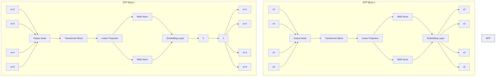

# MiMo: Unlocking the Reasoning Potential of Language Model – From Pretraining to Posttraining

LLM-Core Xiaomi

# Abstract

We present MiMo-7B, a large language model born for reasoning tasks, with optimization across both pre-training and post-training stages. During pre-training, we enhance the data preprocessing pipeline and employ a three-stage data mixing strategy to strengthen the base model’s reasoning potential. MiMo-7B-Base is pre-trained on 25 trillion tokens, with additional Multi-Token Prediction objective for enhanced performance and accelerated inference speed. During post-training, we curate a dataset of 130K verifiable mathematics and programming problems for reinforcement learning, integrating a test-difficulty–driven code-reward scheme to alleviate sparse-reward issues and employing strategic data resampling to stabilize training. Extensive evaluations show that MiMo-7B-Base possesses exceptional reasoning potential, outperforming even much larger 32B models. The final RL-tuned model, MiMo-7B-RL, achieves superior performance on mathematics, code and general reasoning tasks, surpassing the performance of OpenAI o1-mini. The model checkpoints are available at https://github.com/xiaomimimo/MiMo.

  
Figure 1 Performance of MiMo-7B in code and math reasoning benchmark.

# Contents

# 1 Introduction 3

# 2 Pre-Training 4

2.1 Pre-Training Data . . . 4   
2.2 Model Architecture 6   
2.3 Hyper-Parameters . . . 7   
2.4 Pre-Training Evaluation

2.4.1 Evaluation Setup 7   
2.4.2 Upper Bounds of Reasoning Capability . . 8   
2.4.3 Evaluation Results . . . 8

# 3 Post-Training 10

3.1 Supervised Fine-Tuning 10   
3.2 RL Data Curation 11   
3.3 RL Training Recipe . . 11

3.3.1 Test Difficulty Driven Reward . . . 12   
3.3.2 Easy Data Filter and Re-Sampling 13   
3.3.3 Hyper-Parameters 14

3.4 RL Infrastructures 14

3.4.1 Seamless Rollout Engine . . . 14   
3.4.2 vLLM-based Inference Engine . . . 16

3.5 Post-Training Evaluation . . 17

3.5.1 Evaluation Setup 17   
3.5.2 Evaluation Results . 18

3.6 Discussion 18

# 4 Conclusion 20

# A Contributions and Acknowledgments 28

# 1 Introduction

Large language models (LLMs) with advanced reasoning capabilities, such as OpenAI o-series (Ope nAI, 2024), DeepSeek R1 (Guo et al., 2025), and Claude 3.7 (Anthropic, 2025), have achieved remarkable performance in complex tasks like mathematical reasoning and code generation. Through large-scale reinforcement learning (RL), these models develop sophisticated reasoning patterns, including step-by-step analysis, self-reflection and backtracking, enabling more robust and accurate problem solving capabilities across diverse domains. This emerging paradigm represents a significant advancement in artificial intelligence’s approach for tackling intricate challenges.

Currently, most successful RL works, including open-source research, rely on relatively large base models, e.g., 32B models, particularly for enhancing code reasoning capabilities. Moreover, it was widely considered that achieving uniform and simultaneous improvements in both mathematical and code capabilities within a small model is challenging. Nonetheless, we believe that the effectiveness of the RL trained reasoning model relies on the inherent reasoning potential of the base model. To fully unlock the reasoning potential of language models, efforts must focus not only on post-training but also on pre-training strategies tailored to reasoning.

In this work, we present MiMo-7B, a series of models trained from scratch and born for reasoning tasks. Our RL experiments from MiMo-7B-Base show that our model possesses extraordinary reasoning potential, even outperforming much larger 32B models. Additionally, we perform RL training on a cold-started SFT model, resulting in MiMo-7B-RL, which demonstrates superior performance on both mathematics and code reasoning tasks, surpassing the performance of OpenAI o1-mini. Here are our detailed contributions:

# Pre-Training: Base Model Born for Reasoning

• We optimize data preprocessing pipeline, enhancing text extraction toolkits and applying multi-dimensional data filtering to increase reasoning pattern density in pre-training data We also employ multiple strategies to generate massive diverse synthetic reasoning data.   
• We adopt a three-stage data mixture strategy for pre-training. Overall, MiMo-7B-Base is pre-trained on approximately 25 trillion tokens.   
• We incorporate Multiple-Token Prediction as an additional training objective, which enhances model performance and accelerates inference.

# Post-Training Recipe: Pioneering Reasoning Model

• We curate 130K mathematics and code problems as RL training data, which can be verified by rule-based verifiers. Each problem undergoes careful cleaning and difficulty assessment to ensure quality. We employ only rule-based accuracy rewards to avoid potential reward hacking.   
• To mitigate the sparse reward issue for challenging code problems, we introduce a test difficulty driven code reward. By assigning fine-grained scores for test cases with varying difficulty levels, the policy can be more effectively optimized via dense reward signal.   
• We implement a data re-sampling strategy to enhance rollout sampling efficiency and stabilize policy updates, particularly in the later phases of RL training.

# RL Infrastructures

• We develop a Seamless Rollout Engine to accelerate RL training and validation. Our design integrates continuous rollout, asynchronous reward computation, and early termination to minimize GPU idle time, achieving 2.29× faster training and 1.96× faster validation.   
• We support MTP in vLLM and enhance the robustness of the inference engine in RL system.

# Summary of Evaluation Results

• MiMo-7B-Base outperforms SoTA open-source models of approximately 7B parameters, excelling in general knowledge and coding tasks. On BBH, it achieves a score of 75.2, showcasing superior reasoning capabilities. Its strong performance on SuperGPQA further highlights its ability to handle complex graduate-level questions.   
• MiMo-7B-RL-Zero surpasses the RL training performance of the 32B base model on both mathematics and code tasks. This underscore its efficiency and potential in RL training, positioning MiMo-7B as a compelling candidate for future advancements in RL.   
• MiMo-7B-RL achieves excellent reasoning performance. It scores 55.4 on AIME 2025, exceeding o1-mini by 4.7 points. In algorithm code generation tasks, MiMo-7B-RL demonstrates extremely impressive results, significantly outperforming OpenAI o1-mini on both LiveCodeBench v5 and the latest v6, demonstrating robust and stable capabilities. MiMo-7B-RL also maintains competitive general performance.

Open-Source We open-source MiMo-7B series, including checkpoints of the base model, SFT model, RL model trained from base model, and RL model trained from the SFT model. We believe this report along with the models will provides valuable insights to develop powerful reasoning LLM that benefit the larger community.

# 2 Pre-Training

In this section, we first detail our strategies to enhance reasoning capabilities during MiMo-7B pre-training process, encompassing pre-training data construction, model architecture design, and hyper-parameter settings. Then we demonstrate the reasoning potential of MiMo-7B-Base model.

# 2.1 Pre-Training Data

The pre-training corpus for MiMo-7B integrates diverse sources, including web pages, academic papers, books, programming code, and synthetic data. We believe that incorporating more data with high-quality reasoning patterns during pre-training stage can substantially enhance the reasoning potential of the resulting language model. To achieve this goal, we first optimize our natural text preprocessing pipeline to improve quality and most importantly, reasoning data density. Second, we leverage advanced reasoning models to generate extensive synthetic reasoning data. Finally, we implement a three-stage data mixture strategy to maximize our model’s reasoning potential across various tasks and domains.

Better Reasoning Data Extraction Web pages naturally contain content with high density reasoning patterns, such as coding tutorial and mathematics blogs. However, we discover that commonly used extractors (Barbaresi, 2021) often fail to preserve mathematics equations and code snippets embedded in the webpage. To address this limitation, we develop a novel HTMLextraction tool specially optimized for mathematics content (Liu et al., 2024c; Paster et al., 2024; Zhou et al., 2025), code blocks, and forum websites. For papers and books, we enhance PDF parsing toolkits to better handle STEM and code content. With these optimized extraction tools, we successfully preserved massive reasoning patterns for subsequent processing stages.

Fast Global Deduplication Data deduplication plays an important role in improving training efficiency and reducing overfitting. We adopt both URL deduplication and MinHash deduplication (Broder, 1997) across all webpage dumps. Through extreme engineering optimization, we can complete this global deduplication process within a single day. Since deduplication algorithms treat high-quality and low-quality text equally without content awareness, we subsequently adjust the final data distribution according to multi-dimension quality scores.

Multi-Dimensional Data Filtering High-quality pre-training data with rich reasoning patterns is crucial for developing models with strong reasoning capabilities. We find that commonly used heuristic rule-based filters (Penedo et al., 2023, 2024) incorrectly filter high-quality web pages containing substantial mathematical and code content. To address this limitation, we instead fine-tune small LLMs to serve as data quality taggers, performing domain classification and multi-dimensional quality assessment.

Synthetic Reasoning Data Another crucial source for reasoning patterns is synthetic data generated by advanced reasoning models. We employ multiple strategies to generate diverse synthetic reasoning responses. First, we select STEM content tagged with high reasoning depth and prompt models to develop insightful analyses and perform in-depth thinking based on the source materials. Second, we gather mathematics and code problems and prompt reasoning models to solve them. Additionally, we incorporate general domain queries, particularly creative writing tasks. Notably, our preliminary experiments reveal that, unlike non-reasoning data, synthetic reasoning data can be trained for extremely high number of epochs without overfitting risk.

Three-Stage Data Mixture To optimize the pre-training data distribution, we adopt a three-stage data mixture strategy in the final model training:

• Stage 1: We incorporate all data sources except synthetic responses for reasoning task queries. We downsample overrepresented content, such as ads, news, job postings, and materials with insufficient knowledge density and reasoning depth. We also upsample high-value data from professional domains with superior quality.   
• Stage 2: Building on the curated distribution in Stage 1, we significantly increase mathe matics and code related data to ∼70% of the mixture. This approach is expected to enhance specialized skills without compromising general language abilities (Zhu et al., 2024). The first two stages are trained with an 8,192-token context length.   
• Stage 3: To boost the capabilities for solving complex tasks, we further incorporate ∼10% synthetic responses for mathematics, code, and creative writing queries. Simultaneously, we extend the context length from 8,192 to 32,768 in the final stage.

Through this process, we build a large high-quality pre-training dataset comprising approximately 25 trillion tokens.

flowchart

Architecture diagram of a transformer model showing main model layers, MTP blocks, and embedded structure with input/output nodes and connections.

flowchart

Figure 2 Implementation of Multi-Token Prediction with MiMo-7B. During pre-training we use a single MTP layer, while the inference stage can use multiple MTP layers for additional speedup.

# 2.2 Model Architecture

MiMo-7B follows the general decoder-only Transformer architecture (Radford et al., 2018; Vaswani et al., 2017), and consists of Grouped-Query Attention (GQA, Ainslie et al. 2023), pre-RMSNorm (Zhang and Sennrich, 2019), SwiGLU activation (Dauphin et al., 2017) and Rotary Positional Embedding (RoPE, Su et al. 2024), similar to Llama (Grattafiori et al., 2024; Touvron et al., 2023) and Qwen (Yang et al., 2024).

Reasoning models often face an inference speed bottleneck due to their lengthy auto-regressive generation process, despite the high correlation and predictability observed among consecutive tokens in their reasoning paths.

MTP Modules Inspired by DeepSeek-V3 (Liu et al., 2024a), we incorporate Multi-Token Prediction (MTP) (Gloeckle et al., 2024) as an additional training objective. This approach enables the model to strategically pre-plan and generate representations that facilitate more accurate and potentially faster prediction of future tokens. As shown in Figure 2, we implement distinct MTP setups for pre-training and inference. During pre-training, we utilize only a single MTP layer, as our preliminary studies show that multiple MTP layers yield no further improvement. In contrast, we find that multiple parallel MTP layers significantly accelerate inference through speculative decoding. To implement this, after pre-training, we replicate the pre-trained single MTP layer into two identical copies. Then, with the main model and first MTP layer frozen, we fine-tune two new MTP layers for inference speedup.

MTP Inference Speedup During inference, these MTP layers can be utilized for speculative decoding (Leviathan et al., 2023; Xia et al., 2023) to reduce generation latency. We evaluated the performance of the MTP layers on the AIME24 benchmark. The first MTP layer achieves a remarkably high acceptance rate about 90%, while even the third MTP layer maintains an acceptance rate above 75%. This high acceptance rate enables MiMo-7B to deliver enhanced decoding speed, particularly in reasoning scenarios requiring extremely long outputs.

# 2.3 Hyper-Parameters

Model Hyper-Parameters We set the number of Transformer layers to 36 and the hidden dimension to 4,096. The intermediate hidden dimension of FFN is set to 11,008. The number of attention heads is 32 and there are 8 key-value groups.

Training Hyper-Parameters For optimization, we use AdamW (Loshchilov and Hutter, 2019) with $\beta _ { 1 } = 0 . 9 , \beta _ { 2 } = 0 . 9 5$ , and weight decay of 0.1. We apply gradient clipping with a maximum norm of 1.0.

During the first two pre-training stages, the maximum sequence length is 8,192 tokens with the RoPE base of 10,000. Stage 3 expands these parameters to 32,768 tokens and 640,000, respectively.

Our learning rate schedule begins in Stage 1 with a linear warmup from 0 to $1 . 0 7 \times 1 0 ^ { - 4 }$ over the first 84B tokens, followed by a constant phase at $1 . 0 7 \times 1 0 ^ { - 4 }$ for 10.2T tokens, and concludes with a cosine decay to $3 \times 1 0 ^ { - 5 }$ over 7.5T tokens. This rate of $3 \times 1 0 ^ { - 5 }$ is maintained throughout Stage 2 (4T tokens) and for the first 1.5T tokens of Stage 3. Subsequently, the learning rate decays via a cosine schedule to $1 \times 1 0 ^ { - 5 }$ over the final 500B tokens.

We implement a linear batch size warmup to 2,560 over the first 168B tokens and maintain this value throughout the remainder of Stage 1 and Stage 2. In Stage 3, the batch size is fixed at 640.

The MTP loss weight is set to 0.3 for the first 10.3T tokens, then reduced to 0.1 for the remainder of pre-training.

# 2.4 Pre-Training Evaluation

# 2.4.1 Evaluation Setup

We evaluate MiMo-7B-Base on a series of benchmarks, encompassing natural language under standing and reasoning, scientific question answering, reading comprehension, mathematics reasoning, coding, Chinese understanding, and long-context comprehension capabilities:

Language understanding and reasoning: BBH (Suzgun et al., 2023), MMLU Hendrycks et al. (2021a), MMLU-Redux (Gema et al., 2024), MMLU-Pro (Wang et al., 2024), ARC (Clark et al., 2018), HellaSwag (Zellers et al., 2019), PIQA (Bisk et al., 2020).

Closed-book question answering: TriviaQA (Joshi et al., 2017), NaturalQuestions (Kwiatkowski et al., 2019).

Scientific question answering: GPQA (Rein et al., 2024), SuperGPQA (Du et al., 2025).

Reading comprehension: DROP (Dua et al., 2019), RACE (Lai et al., 2017).

Mathematics reasoning: AIME (MAA, 2024), GSM8K (Cobbe et al., 2021), MATH (Hendrycks et al., 2021b).

Coding: LiveCodeBench (Jain et al., 2024), HumanEval (Chen et al., 2021), HumanEval+ (Liu et al., 2023), MBPP (Austin et al., 2021), MBPP+ (Liu et al., 2023), CRUXEval (Gu et al., 2024).

Miscellaneous: WinoGrande (Sakaguchi et al., 2020), AGIEval (Zhong et al., 2024a).

Chinese understanding: C-Eval (Huang et al., 2023), CMMLU (Li et al., 2023).

Long-Context Comprehension: RULER (Hsieh et al., 2024)

  
MiMo-7B-Base Qwen2.5-32B-Base Qwen2.5-7B-Base Gemma2-9B-Base Llama3.1-8B-Base

Figure 3 Pass@k curves of different base models across multiple reasoning benchmarks.

We compare MiMo-7B-Base with other open-source base models of comparable size, including Llama-3.1-8B (Grattafiori et al., 2024), Gemma-2-9B (Team, 2024), and Qwen2.5-7B (Yang et al., 2024). The evaluation of all models shares the same evaluation settings.

# 2.4.2 Upper Bounds of Reasoning Capability

Traditional evaluation methods often underestimate a model’s true reasoning potential by relying on single-pass success rates or average performance across multiple samplings. Following Yue et al. (2025), we adopt the pass@k metric, which considers a problem solved if any of k sampled solution is correct, to better assess the reasoning capacity boundary of different models.

As illustrated in Figure 3, MiMo-7B-Base achieves significantly higher pass@k scores than all compared models, including the 32B baseline, across all benchmarks and evaluated k values. Notably, the performance gap between MiMo-7B-Base and other baselines widens steadily as k increases, particularly on LiveCodeBench. These results demonstrates the superior reasoning potential of MiMo-7B-Base, which establishes a strong base policy for RL training.

# 2.4.3 Evaluation Results

General Reasoning MiMo-7B-Base achieves superior performance in general knowledge and reasoning, outperforming open-source models of comparable size. On BBH, a benchmark evaluating language reasoning abilities, MiMo-7B-Base scores 75.2, surpassing Qwen2.5-7B by about 5 points. Furthermore, SuperGPQA results show our model’s robust performance in solving graduate-level problems. On DROP, a reading comprehension benchmark, MiMo-7B-Base outperforms compared

<table><tr><td>Benchmark</td><td># Shots</td><td>Llama-3.1 8B Base</td><td>Gemma-2 9B Base</td><td>Qwen2.5 7B Base</td><td>MiMo-7B Base</td></tr><tr><td colspan="6">General</td></tr><tr><td>BBH (EM)</td><td>3-shot</td><td>64.2</td><td>69.4</td><td>70.4</td><td>75.2</td></tr><tr><td>GPQA-Diamond (EM)</td><td>5-shot</td><td>33.3</td><td>24.2</td><td>35.4</td><td>25.8</td></tr><tr><td>SuperGPQA (EM)</td><td>5-shot</td><td>19.9*</td><td>22.6*</td><td>24.6*</td><td>25.1</td></tr><tr><td>DROP (F1)</td><td>3-shot</td><td>59.5</td><td>67.9*</td><td>61.5*</td><td>69.2</td></tr><tr><td>MMLU (EM)</td><td>5-shot</td><td>65.3</td><td>71.2</td><td>74.2</td><td>71.2</td></tr><tr><td>MMLU-Redux (EM)</td><td>5-shot</td><td>58.4*</td><td>67.9</td><td>71.1</td><td>65.3</td></tr><tr><td>MMLU-Pro (EM)</td><td>5-shot</td><td>37.1</td><td>44.7</td><td>45.0</td><td>41.9</td></tr><tr><td>ARC-Easy (EM)</td><td>25-shot</td><td>84.3</td><td>88.3</td><td>86.4</td><td>85.2</td></tr><tr><td>ARC-Challenge (EM)</td><td>25-shot</td><td>57.7</td><td>68.2</td><td>63.8</td><td>62.3</td></tr><tr><td>HellaSwag (EM)</td><td>10-shot</td><td>82.0</td><td>81.9</td><td>80.4</td><td>80.0</td></tr><tr><td>PIQA (EM)</td><td>0-shot</td><td>80.3</td><td>81.9</td><td>78.5</td><td>79.4</td></tr><tr><td>WinoGrande (EM)</td><td>5-shot</td><td>60.5</td><td>73.9*</td><td>75.9</td><td>78.0</td></tr><tr><td>RACE-High (EM)</td><td>5-shot</td><td>44.3</td><td>48.3</td><td>46.8</td><td>44.1</td></tr><tr><td>TriviaQA (EM)</td><td>5-shot</td><td>70.6</td><td>76.5</td><td>60.0</td><td>60.8</td></tr><tr><td>NaturalQuestions (EM)</td><td>5-shot</td><td>27.7</td><td>29.2</td><td>24.1</td><td>24.5</td></tr><tr><td>AGIEval (EM)</td><td>0-shot</td><td>38.2*</td><td>21.6*</td><td>44.4</td><td>48.3</td></tr><tr><td colspan="6">Mathematics</td></tr><tr><td>AIME 2024 (Pass@1)</td><td>0-shot</td><td>0.3*</td><td>0.0*</td><td>10.1*</td><td>32.9</td></tr><tr><td>AIME 2025 (Pass@1)</td><td>0-shot</td><td>0.0*</td><td>0.0*</td><td>4.3*</td><td>24.3</td></tr><tr><td>GSM8K (EM)</td><td>8-shot</td><td>48.5*</td><td>70.2*</td><td>80.2*</td><td>75.2</td></tr><tr><td>MATH (EM)</td><td>4-shot</td><td>16.9*</td><td>36.4*</td><td>44.3*</td><td>37.4</td></tr><tr><td colspan="6">Code</td></tr><tr><td>LiveCodeBench v5 (Pass@1)</td><td>0-shot</td><td>0.4*</td><td>0.0*</td><td>5.0*</td><td>32.9</td></tr><tr><td>HumanEval (Pass@1)</td><td>1-shot</td><td>37.8*</td><td>41.5*</td><td>56.7*</td><td>51.8</td></tr><tr><td>HumanEval+ (Pass@1)</td><td>1-shot</td><td>31.7*</td><td>31.1*</td><td>50.0*</td><td>44.5</td></tr><tr><td>MBPP (Pass@1)</td><td>3-shot</td><td>58.4</td><td>63.9</td><td>76.7</td><td>69.2</td></tr><tr><td>MBPP+ (Pass@1)</td><td>3-shot</td><td>49.9</td><td>52.9</td><td>64.2</td><td>56.6</td></tr><tr><td>CRUXEval-I (EM)</td><td>2-shot</td><td>41.5</td><td>49.8</td><td>52.4</td><td>47.6</td></tr><tr><td>CRUXEval-O (EM)</td><td>2-shot</td><td>36.8</td><td>42.4</td><td>48.5</td><td>56.3</td></tr><tr><td colspan="6">Chinese</td></tr><tr><td>C-Eval (EM)</td><td>5-shot</td><td>52.2</td><td>57.0</td><td>81.8</td><td>68.7</td></tr><tr><td>CMMLU (EM)</td><td>5-shot</td><td>52.1</td><td>58.4</td><td>82.7</td><td>70.9</td></tr></table>

Table 1 Comparison among MiMo-7B-Base and other open-source base models of comparable size. Results marked with \* are obtained using our internal evaluation framework.

heatmap

| Needle Depth | 4K   | 8K   | 16K  | 32K  |
| ------------ | ---- | ---- | ---- | ---- |
| 20           | 100  | 100  | 100  | 100  |
| 40           | 100  | 100  | 100  | 100  |
| 60           | 100  | 100  | 100  | 100  |
| 80           | 100  | 100  | 100  | 100  |
| 100          | 100  | 100  | 100  | 100  |

line

| Context Length | Accuracy (Line 1) | Accuracy (Line 2) | Accuracy (Line 3) |
| -------------- | ----------------- | ----------------- | ----------------- |
| 4k             | 100               | 100               | 100               |
| 8k             | 95                | 80                | 95                |
| 16k            | 70                | 65                | 75                |
| 32k            | 30                | 50                | 20                |

line

| Context Length | Line 1 | Line 2 | Line 3 |
| -------------- | ------ | ------ | ------ |
| 4k             | 98     | 95     | 97     |
| 8k             | 94     | 88     | 76     |
| 16k            | 95     | 96     | 89     |
| 32k            | 92     | 94     | 85     |

line

| Context Length | MiMo-7B | Qwen2.5-7B | Llama-3.1-8B |
| -------------- | ------- | ---------- | ------------ |
| 4k             | 100     | 100        | 100          |
| 8k             | 100     | 96         | 100          |
| 16k            | 100     | 92         | 100          |
| 32k            | 98      | 92         | 100          |

Figure 4 Results of long-context comprehension on RULER. Our MiMo-7B-Base achieves nearperfect NIAH retrieval performance within the supported 32K context length, and delivers remarkable performance on Common Words Extraction (CWE), Frequent Words Extraction (FWE), and Variable Tracking (VT) that emphasizes long-context reasoning beyond retrieval.

models, showing advanced language understanding capability.

Code and Mathematics Reasoning MiMo-7B-Base demonstrates strong proficiency in coding and mathematics tasks. On LiveCodeBench v5, it scores 32.9, far surpassing Llama-3.1-8B and Qwen-2.5-7B. Similarly, on AIME 2024, our model achieves 32.9, significantly outperforming other comparably sized base models. These results highlight MiMo-7B-Base’s extraordinary problem-solving abilities and its huge potential for complex reasoning tasks.

Long-Context Comprehension The ability to understand and reason over long contexts is essential for modern thinking models (Liu et al., 2025), as it enables them to produce long and complex reasoning chains.

For the needle-in-a-haystack (NIAH) tasks (Single, Multi-keys, Multi-values, and Multi-queries NIAH) that focus on long-context retrieval, we aggregate their accuracy across varying depths and context lengths, as depicted in the leftmost panel of Figure 4. We observe that MiMo-7B achieves near-perfect retrieval performance across all positions within the 32K context window.

Beyond pure retrieval, MiMo-7B excels in tasks requiring long-context reasoning, including Common Words Extraction (CWE), Frequent Words Extraction (FWE), and Variable Tracking (VT). It delivers remarkable performance and surpasses Qwen2.5-7B in most scenarios. These results validate the efficacy of our strategy to incorporate diverse data with high-quality reasoning patterns during pre-training.

# 3 Post-Training

After the pre-training stage, post-training are implemented on MiMo-7B-Base. Specifically, we develop MiMo-7B-RL-Zero through direct RL from MiMo-7B-Base, and MiMo-7B-RL trained from an SFT version of MiMo-7B.

# 3.1 Supervised Fine-Tuning

SFT Data The SFT data consists of a combination of open-source and proprietary distilled data. To ensure optimal quality and diversity, we implement a three stage preprocessing pipeline. First, we eliminate all training queries that have 16-gram overlap with evaluation benchmarks to prevent data leakage. Then, we exclude samples with mixing language or incomplete response. Finally, we capped the number of responses per query at eight, striking a balance between preserving diversity and preventing redundancy. Following this preprocessing, our final SFT dataset comprises about 500K samples.

SFT Hyper-parameters We fine-tune the MiMo-7B-Base model with a constant learning rate of $3 \times 1 0 ^ { - 5 }$ and batch size of 128. Samples are packed to the maximum length of 32,768 tokens during training.

# 3.2 RL Data Curation

We utilize two categories of verifiable problems, mathematics and code, to formulate our RL training data. Our preliminary studies demonstrate that high-quality problem sets plays a critical role in stabilizing the RL training process and further enhancing the LLM’s reasoning capabilities.

Mathematical Data Our mathematical problem set is drawn from diverse sources, including open-source datasets and proprietary collected competition-level collections. To mitigate the risk of reward hacking, we employ an LLM to filter proof-based and multiple-choice problems. Unlike recent approaches that modify problems to ensure integer answers, we preserve original problems to minimize reward hacking. Additionally, we perform global n-gram deduplication and carefully decontaminate of our problem set with evaluation benchmarks.

Model-based difficulty assessment is used to further improve the quality of our dataset. Initially, we filter out problems that cannot be solved by advanced reasoning models, identifying those that are either too difficult or contain incorrect answers. For the remaining problems, we rollout an SFT version of MiMo-7B 16 times, eliminating problems with a passrate exceeding 90%. Notably, this process removes approximately 50% of easy problems from the original problem set. After data cleaning, we establish a mathematical training set comprising 100K problems.

Code Data For coding problems, we curate a high-quality training set comprising open-source datasets and our newly collected problem set. We remove problems without test cases. For problems with golden solutions, we exclude those where the golden solution failed to pass all test cases. For problems without golden solution, we discard problems where no test case can be solved in 16 rollouts of advanced reasoning models. Similar to math data, we utilize an SFT version of MiMo-7B to filter out easy problems that are perfectly solved in all 16 rollouts. This rigorous cleaning process yields 30K code problems.

During each RL iteration, we evaluate thousands of problems to compute the rewards, with each problem potentially containing hundreds of test cases. To improve reward computing efficiency and eliminate GPU idle time, we developed an online judge environment that enables parallel execution of extremely high-volume unit tests.

Reward Function We employ only rule-based accuracy rewards in our training process. For mathematics data, we use the rule-based Math-Verify library to evaluate response correctness. For code problems, we implement a test difficulty driven reward as detailed in Section 3.3.1. No additional rewards, such as format reward and length penalty reward, is incorporated.

# 3.3 RL Training Recipe

We employ a modified version of Group Relative Policy Optimization (GRPO) (Shao et al., 2024) with recently proposed improvement from the research community (Hu et al., 2025; Yu et al.,

2025). For each problem $q ,$ the algorithm samples a group of responses $\left\{ o 1 , o 2 , . . . , o _ { G } \right\}$ from the old policy $\pi _ { \theta _ { o l d } }$ , and update the policy $\pi _ { \theta }$ by maximizing the following objective:

$$
\mathcal {J} _ {\mathrm{GRPO}} (\theta) = \mathbb {E} _ {q \sim D, \{o _ {i} \} _ {i = 1} ^ {G} \sim \pi_ {\theta} (\cdot | q)}
$$

$$
\left. \right.\left[ \frac {1}{\sum_ {i = 1} ^ {G} \left| o _ {i} \right|} \sum_ {i = 1} ^ {G} \sum_ {j = 1} ^ {\left| o _ {i} \right|} \min \left(\frac {\pi_ {\theta} \left(o _ {i} \mid q\right)}{\pi_ {\theta_ {o l d}} \left(o _ {i} \mid q\right)} A _ {i, j}, \operatorname{clip} \left(\frac {\pi_ {\theta} \left(o _ {i} \mid q\right)}{\pi_ {\theta_ {o l d}} \left(o _ {i} \mid q\right)}, 1 - \varepsilon_ {\text {low}}, 1 + \varepsilon_ {\text {high}}\right) A _ {i, j}\right)\right] \tag {1}
$$

where $\varepsilon _ { \mathrm { l o w } }$ and $\varepsilon _ { \mathrm { h i g h } }$ are hyper-parameters. $A _ { i , j }$ is the advantage, which is computed by the rewards $\{ r _ { 1 } , r _ { 2 } , . . . , r _ { G } \}$ of responses in the same group:

$$
A _ {i, j} = \frac {r _ {i} - \operatorname{mean} \left(\left\{r _ {i} \right\} _ {i = 1} ^ {G}\right)}{\operatorname{std} \left(\left\{r _ {i} \right\} _ {i = 1} ^ {G}\right)} \tag {2}
$$

Upon the original GRPO algorithm, we incorporate several enhancements from recent research:

• Removal of KL Loss (He et al., 2025; Hu et al., 2025): simply removing the KL loss effectively unleashes the full potential of the policy model without compromising training stability.   
• Dynamic Sampling (Yu et al., 2025): in RL rollout phase, we over-sample and filter out prompts with passrate equal to 1 and 0, leaving all prompts in the batch with effective gradients while maintaining a consistent batch size. This strategy automatically calibrates problem difficulty throughout policy training.   
• Clip-Higher (Yu et al., 2025): we increase the upper clip bounds $\varepsilon _ { \mathrm { h i g h } }$ in Eq. 1, with a fixed lower clip bounds $\varepsilon _ { \mathrm { l o w } }$ . It can mitigate the entropy convergence problem and facilitate the policy to explore new solutions.

During training, we identify two key challenges affecting model performance: sparse rewards for code problems and diminishing sampling efficiency of dynamic sampling. Therefore, we propose test complexity driven reward function and easy data re-sampling approach, respectively.

# 3.3.1 Test Difficulty Driven Reward

Currently, for algorithm code generation tasks, existing RL works such as Deepseek-R1 Guo et al. (2025) adopt a rule-based reward strategy, where a solution is rewarded only if the generated code passes all the test cases for a given problem. However, for difficult algorithmic problems, the model might never receive any reward, preventing it from learning from these challenging cases and reducing training efficiency for dynamic sampling.

Various Test Difficulty in IOI Scoring Rules To address this limitation, we propose a new reward mechanism, test difficulty driven reward. The design is inspired by the scoring rule of the International Olympiad in Informatics (IOI, IOI 2024). In IOI contests, each complete problem is divided into multiple subtasks, and participants will obtain points for each subtask they successfully complete. Each subtask will have tests with different difficulty. Assigning different scores to subtasks better reflects how humans solve problems. For challenging problems, the model can still earn partial scores by solving some of the subtasks, which allows better utilization of these difficult examples during training.

Assigning Difficulty to Tests Based on Pass Rates We propose a technique for grouping test cases based on their difficulty. We utilize several models to perform multiple rollouts on each problem, and calculate the pass rate for each test case across all model-generated solutions. We then cluster the test cases into different difficulty levels according to their pass rates, with lower pass rates indicating higher difficulty. The left part of Figure 5 presents the pass rates and difficulty levels for each test case of certain problem. The results reveal a clear stratification of test difficulty, and demonstrate that more capable models achieve higher pass rates.

bar

Difficulty Dist. of Test Cases
| Model | Test Case Pass Rate | Easy (%) | Medium (%) | Hard (%) |
| :--- | :--- | :--- | :--- | :--- |
| Model-1 | 0.0 | 13.3 | 21.7 | 24.1 |
| Model-1 | 0.2 | 1.2 | 24.1 | 1.2 |
| Model-2 | 0.0 | 10.8 | 8.4 | 6.0 |
| Model-2 | 0.4 | 24.1 | 19.3 | 4.8 |
| Model-2 | 0.6 | 14.5 | 14.5 | 12.0 |
| Model-3 | 0.0 | 14.5 | 14.5 | 14.5 |
| Model-3 | 0.8 | 85.5 | 14.5 | 14.5 |

line

| Training Steps | Vanilla Reward | Strict Reward | Soft Reward |
| -------------- | -------------- | ------------- | ----------- |
| 0              | 33.5           | 33.5          | 33.5        |
| 100            | 34.5           | 34.0          | 31.5        |
| 200            | 35.0           | 36.5          | 35.5        |
| 300            | 37.0           | 38.0          | 37.0        |
| 400            | 38.0           | 37.5          | 38.0        |
| 500            | 38.5           | 39.5          | 41.0        |
| 600            | 40.0           | 41.0          | 39.5        |
| 700            | 41.0           | 44.5          | 44.0        |
| 800            | 42.0           | 44.5          | 43.0        |
| 900            | 42.5           | 45.5          | 44.0        |
| 1000           | 43.0           | 42.5          | 45.5        |
| 1100           | 43.0           | 46.5          | 48.0        |
| 1200           | 43.0           | 45.5          | 46.0        |

Figure 5 Experiments with test difficulty driven reward.

Reward Rules After categorizing the tests into different difficulty levels, we design two reward schemes based on these difficulty levels: a strict scheme and a soft scheme. (1) Strict Reward. Under the strict reward scheme, a solution receives the reward corresponding to a difficulty level only if it passes all tests in that group as well as in all lower-difficulty groups. (2) Soft Reward. In contrast, the soft reward scheme distributes the total score of each group equally among its tests. The final reward is the sum of the scores for all passed tests. The right part of Figure 5 compares the performance achieved by two reward schemes against the baseline without test difficulty driven reward.

# 3.3.2 Easy Data Filter and Re-Sampling

During RL training, as the policy improves, an increasing number of problems achieve a perfect pass rate of 1. Under dynamic sampling mechanism, these problems are subsequently filtered from the batch for policy update. This filtration leads to drastic sampling efficiency degradation, as more rollouts are required to construct a batch of fixed size. A straightforward approach to address this efficiency issue would be to entirely remove problems with perfect pass rates from the training data. However, our preliminary studies show that this method introduces significant instability in policy updates.

To improve sampling efficiency without risking policy collapse, we developed an easy data resampling strategy. During the training process, we maintain an easy data pool, where problems with perfect pass rates are stored. When performing rollouts, there is a probability ?? (10% in our experiments) to sample data from this easy data pool. This strategy effectively stabilizes the policy update while improving sampling efficiency, especially in the later phases of RL training.

# 3.3.3 Hyper-Parameters

In our experiment, we employed a training batch size of 512, with an actor mini-batch size of 32. We executed 16 gradient updates per training iteration at a learning rate of 1e-6. The maximum sequence length was set to 32,768 tokens to facilitate complex reasoning tasks. During the training phase, both temperature and top-p parameters were configured at 1.0 to promote output diversity.

# 3.4 RL Infrastructures

We develop the Seamless Rollout Engine and enhance vLLM’s robustness to enable efficient dynamic-sampling-based RL training. We construct our RL system based on verl (Sheng et al., 2024), an open-source RL training library. The library uses Ray (Moritz et al., 2018) to manage computation and communication, implementing the rollout and training phases in Ray Actors and exchanging training data through Ray Objects. Although verl supports flexible implementations of various RL algorithms, it suffers from GPU idle time during both rollout and reward computation phases. Due to the skewness in response lengths, we observe that most GPUs remain idle while waiting for a few long-sequence rollout workers, resulting in wasted computational resources and a slow training process. Several prior works have identified this issue and proposed system-level solutions (Seed et al., 2025; Team et al., 2025b; Zhong et al., 2024b). However, most of these solutions rely on asynchronous training, which modifies the underlying algorithm and introduces staleness in long-sequence responses. Rule-based reward computation is also time-consuming, particularly for code data, leading to idle periods for valuable GPU resources. Our use of dynamic sampling, while improving sample efficiency, exacerbates GPU idle time, and leads to wasted examples during multi-turn rollouts. To simultaneously optimize GPU utilization and reduce sample waste, we develop the Seamless Rollout Engine, opportunistically filling sample batches into rollout while performing asynchronous reward computation. Our system builds on the vLLM inference engine (Kwon et al., 2023), and we collaborate with the open-source community to enhance the robustness of vLLM’s “external launch” mode within the verl framework. Additionally, we implement MTP in vLLM to support both MiMo-7B and MiMo-7B-RL.

# 3.4.1 Seamless Rollout Engine

Seamless Rollout Engine optimizes GPU utilization in rollout workers through efficient task scheduling, minimizing idle time during continuous operation. The engine consists of the following components: (a) continuous rollout, (b) asynchronous reward computation, and (c) early termination. It achieves a 2.29× speedup in training and a 1.96× speedup in validation.

Continuous Rollout The core of Seamless Rollout Engine lies in proactively handling completed rollout tasks and initiating new rollouts. Unlike naive dynamic sampling implementations that delay reward computation until all rollout workers complete, Seamless Rollout Engine eliminates synchronization barriers between generation and reward phases. It actively monitors completed workers, immediately computes their rewards, and triggers new rollouts on demand. After computing rewards, we update the number of valid samples and the current step’s pass-rate statistics, then launch new rollout tasks if active tasks are insufficient to meet training demands based on these statistics. As illustrated in Figure 6, the Seamless Rollout Engine initiates a new task upon completing rollout tasks ③④①⑥ to meet demand, whereas after finishing tasks ②⑤⑦, it predicts that ongoing tasks are sufficient and thus schedules no additional ones.

flowchart

Sequential rollout and seamless rollout flowchart showing task scheduling, idle states, and time saved for four workers

Figure 6 An overview of the Seamless Rollout Engine for MiMo-7B-RL.

Asynchronous Reward Computation While reward computation for math data is rapid, judging code-related data incurs significant overhead, leading to prolonged GPU idle time. Additionally, the sequential nature of naive reward computation fails to utilize the multiprocessing capabilities of modern processing units. To resolve these issues, we employ Ray to launch asynchronous reward computation, which facilitates concurrent management of rollout and reward tasks. Upon task completion, the system dynamically forwards rollout outputs for reward evaluation or aggregates results to update the sample state, as shown in Figure 6. Dedicated servers are allocated for code-specific reward computation to prevent bottlenecks in the rollout pipeline.

Early Termination When the number of valid samples exceeds the required training batch size, careful management of ongoing tasks becomes essential. Abrupt termination of ongoing tasks tends to suppress the generation of long-sequence responses, which could destabilize RL training dynamics. A straightforward solution involves waiting for all active tasks to complete before randomly sampling required batch from the outputs. However, this approach may extend waiting times if a long-sequence rollout initiates near the end of the dynamic sampling phase. To mitigate this delay while preserving data distribution integrity, we implement a first-in-first-out selection strategy. We terminate ongoing tasks only if the valid sample count meets the batch requirement and all tasks initiated prior to these selected samples have completed. In Figure 6, the last rollout is aborted since earlier samples already reach the required batch size.

Experimental Analysis We randomly choose a 5-step training trace to evaluate the performance of Seamless Rollout Engine. The experiment is conducted on 256 H20 GPUs, and the results are presented in Table 2. “Overall Speedup” measures end-to-end RL training efficiency; “Rollout Speedup” shows the acceleration of rollout and reward tasks; “Normalized GPU Idle Time” reflects the total idle GPU hours. The above metrics are normalized with respect to the naive dynamic sampling implementation. “GPU Idle Ratio” quantifies the average proportion of GPU inactivity during rollout and reward computation; “Sample Waste Ratio” represents the ratio of excess valid samples generated relative to the required batch size. In Seamless Rollout Engine, aborted tasks are considered in GPU idle time.

<table><tr><td>Method</td><td>Overall Speedup ↑</td><td>Rollout Speedup ↑</td><td>Normalized GPU Idle Time ↓</td><td>GPU Idle Ratio ↓</td><td>Sample Waste Ratio ↓</td></tr><tr><td>w/o Dynamic Sampling</td><td>2.45×</td><td>2.82×</td><td>0.36</td><td>70.8%</td><td>/</td></tr><tr><td>Naive Dynamic Sampling</td><td>1.00×</td><td>1.00×</td><td>1.00</td><td>69.3%</td><td>22.1%</td></tr><tr><td>+ Continuous Rollout</td><td>1.99×</td><td>2.20×</td><td>0.25</td><td>38.8%</td><td>13.9%</td></tr><tr><td>+ Async. Reward</td><td>2.09×</td><td>2.34×</td><td>0.21</td><td>34.0%</td><td>16.4%</td></tr><tr><td>+ Early Termination</td><td>2.29×</td><td>2.61×</td><td>0.15</td><td>27.7%</td><td>12.9%</td></tr></table>

Table 2 The experimental results of Seamless Rollout Engine compared with baseline methods.

All three components contribute to faster dynamic sampling and smaller GPU idle time. Though the experiment without dynamic sampling can achieve higher throughput, it incurs significant sample inefficiency due to numerous zero-gradient training samples. These zero-gradient samples not only diminishes the effective training batch size, but also risk destabilizing the training dynamics of the RL algorithm. Given an average sample pass rate of 41% within this 5-step experiment, static sampling achieves a sample efficiency similar to naive dynamic sampling; the latter does not train zero-gradient data but incurs wasted samples. Equipped with all three components, Seamless Rollout Engine achieves a comparable one-step training time compared to static sampling while demonstrating superior sample efficiency. The sample pass rate of 41% leads to a sample waste ratio of 22% in the naive implementation; in practice, this ratio can be larger in different situations. Through continous rollout and dynamic launch scheduling, Seamless Rollout Engine reduces the sample waste ratio to around 15%.

Accelerated Validation During validation, we can directly stream the rollout and reward tasks using Seamless Rollout Engine. Similar to the naive implementation, currently we set the validation batch size equal to the dataset length and launch all rollout tasks simultaneously. Our implementation utilizes asynchronous reward computation, achieving a 1.96× speedup while reducing idle GPU time to 25%, as demonstrated in Table 3. Notably, the experimental results demonstrate Seamless Rollout Engine’s potential for static sampling, which also has one-pass rollout and reward computation. If the validation dataset is sufficiently large, further acceleration can be achieved by optimizing the batch size for validation and employing continuous rollout.

<table><tr><td>Method</td><td>Speedup ↑</td><td>Normalized GPU Idle Time ↓</td><td>GPU Idle Ratio ↓</td></tr><tr><td>Naive Validation</td><td>1×</td><td>1</td><td>65.8%</td></tr><tr><td>Seamless Rollout Engine</td><td>1.96×</td><td>0.25</td><td>32.9%</td></tr></table>

Table 3 The validation speedup and GPU idle time of the naive implementation and the Seamless Rollout Engine. The experiment is conducted on 256 H20 GPUs using our full validation dataset.

# 3.4.2 vLLM-based Inference Engine

Our RL system employs vLLM (Kwon et al., 2023) as the inference engine. To accommodate our model’s new features, we have extended the framework with additional functionalities.

MTP Support As described in Section 2.2, our models integrate MTP modules to enhance performance. We have implemented and open-sourced MTP support for our models, enabling efficient inference for MTP-equipped architectures.

<table><tr><td>Benchmark</td><td>GPT-4o 0513</td><td>Claude-3.5-Sonnet-1022</td><td>OpenAI o1-mini</td><td>QwQ-32B Preview</td><td>R1-Distill-Qwen-14B</td><td>R1-Distill-Qwen-7B</td><td>MiMo-7B-RL</td></tr><tr><td colspan="8">General</td></tr><tr><td>GPQA Diamond (Pass@1)</td><td>49.9</td><td>65.0</td><td>60.0</td><td>54.5</td><td>59.1</td><td>49.1</td><td>54.4</td></tr><tr><td>SuperGPQA (Pass@1)</td><td>42.4</td><td>48.2</td><td>45.2</td><td>43.6</td><td>40.6</td><td>28.9</td><td>40.5</td></tr><tr><td>DROP (3-shot F1)</td><td>83.7</td><td>88.3</td><td>83.9</td><td>71.2</td><td>85.5</td><td>77.0</td><td>78.7</td></tr><tr><td>MMLU-Pro (EM)</td><td>72.6</td><td>78.0</td><td>80.3</td><td>52.0</td><td>68.8</td><td>53.5</td><td>58.6</td></tr><tr><td>IF-Eval (Prompt Strict)</td><td>84.3</td><td>86.5</td><td>84.8</td><td>40.4</td><td>78.3</td><td>60.5</td><td>61.0</td></tr><tr><td colspan="8">Mathematics</td></tr><tr><td>MATH500 (Pass@1)</td><td>74.6</td><td>78.3</td><td>90.0</td><td>90.6</td><td>93.9</td><td>92.8</td><td>95.8</td></tr><tr><td>AIME 2024 (Pass@1)</td><td>9.3</td><td>16.0</td><td>63.6</td><td>50.0</td><td>69.7</td><td>55.5</td><td>68.2</td></tr><tr><td>AIME 2025 (Pass@1)</td><td>11.6</td><td>7.4</td><td>50.7</td><td>32.4</td><td>48.2</td><td>38.8</td><td>55.4</td></tr><tr><td colspan="8">Code</td></tr><tr><td>LiveCodeBench v5 (Pass@1)</td><td>32.9</td><td>38.9</td><td>53.8</td><td>41.9</td><td>53.1</td><td>37.6</td><td>57.8</td></tr><tr><td>LiveCodeBench v6 (Pass@1)</td><td>30.9</td><td>37.2</td><td>46.8</td><td>39.1</td><td>31.9</td><td>23.9</td><td>49.3</td></tr></table>

Table 4 Comparison between MiMo-7B-RL and other representative models.

Better Robustness In verl, vLLM is deployed using the external launch mode, which may show instability in some scenarios. We’ve enhanced engine robustness to address these issues. We clear computed blocks in prefix caching during pre-emption to maintain KVCache consistency. We disable asynchronous output processing when increasing the number of scheduler steps to ensure compatibility and optimize performance.

# 3.5 Post-Training Evaluation

# 3.5.1 Evaluation Setup

We comprehensively evaluate reasoning models across a diverse range of benchmarks:

Language understanding and reasoning: MMLU-Pro (Wang et al., 2024).

Scientific question answering: GPQA Diamond (Rein et al., 2024) with averaged score of 8 repetitions; SuperGPQA (Du et al., 2025).

Instruction following: IFEval (Zhou et al., 2023) with averaged score of 8 repetitions.

Reading comprehension: DROP (Dua et al., 2019).

Mathematics reasoning: MATH500 (Lightman et al., 2024); AIME 2024 (MAA, 2024) and AIME 2025 (MAA, 2025) with averaged score of 32 repetitions.

Coding: LiveCodeBench v5 (20240801-20250201) (Jain et al., 2024) and LiveCodeBench v6 (20250201-20250501) (Jain et al., 2024) with averaged score of 8 repetitions.

During evaluation, we set the sampling temperature to 0.6 and top-p to 0.95 for all benchmarks. We set the maximum generation length to 32,768 tokens for mathematics reasoning, coding, and scientific question answering benchmarks, and to 8,192 tokens for other benchmarks.

We compare MiMo-7B-RL against several strong baselines, including two non-reasoning mod els GPT-4o-0513, Claude-Sonnet-3.5-1022, and reasoning models OpenAI-o1-mini, QwQ-32B-Preview, DeepSeek-R1-Distill-Qwen-14B, and DeepSeek-R1-Distill-Qwen-7B.

# 3.5.2 Evaluation Results

Table 4 shows the evaluation results. In mathematics reasoning, MiMo-7B-RL achieves top-tier performance among models of comparable parameter sizes, trailing only slightly behind DeepSeek R1-Distill-Qwen-14B on AIME 2024. For algorithm code generation tasks, MiMo-7B-RL demonstrates extremely impressive results. On LiveCodeBench v5, it significantly outperforms OpenAI o1-mini, while on the latest LiveCodeBench v6, our model achieves a score of 49.3%, surpassing QwQ-32B-Preview by over 10 points, demonstrating its robust and stable capabilities. Notably, MiMo-7B-RL also maintains strong general performance, exceeding both QwQ-32B-Preview and DeepSeek-R1-Distill-Qwen-7B, though we only include mathematics and code problems for RL.

We also presents the evaluation results for different version of MiMo-7B in Table 5. MiMo-7B-RL-Zero is trained from MiMo-7B-Base, while MiMo-7B-RL is trained from MiMo-7B-SFT. As shown, RL from the base model exhibits a stronger growth trend, improving from 32.9% to on AIME 2024 for instance. Nonetheless, RL training from the SFT model achieves a higher performance ceiling, attaining the best results across all evaluated benchmarks.

<table><tr><td>Benchmark</td><td>MiMo-7B-Base</td><td>MiMo-7B-RL-Zero</td><td>MiMo-7B-SFT</td><td>MiMo-7B-RL</td></tr><tr><td colspan="5">Mathematics</td></tr><tr><td>MATH500</td><td>37.4</td><td>93.6</td><td>93.0</td><td>95.8</td></tr><tr><td>AIME 2024</td><td>32.9</td><td>56.4</td><td>58.7</td><td>68.2</td></tr><tr><td>AIME 2025</td><td>24.3</td><td>46.3</td><td>44.3</td><td>55.4</td></tr><tr><td colspan="5">Code</td></tr><tr><td>LiveCodeBench v5</td><td>32.9</td><td>49.1</td><td>52.3</td><td>57.8</td></tr><tr><td>LiveCodeBench v6</td><td>29.1</td><td>42.9</td><td>45.5</td><td>49.3</td></tr></table>

Table 5 Evaluation results of MiMo-Series models on mathematics and coding benchmarks

# 3.6 Discussion

In this section, we share insights and observations from our exploration of MiMo-7B’s post-training process, which we hope will benefit the research community.

SFT for Format Alignment In the initial RL training steps from MiMo-7B-Base, we observe that the model primarily learns to adapt the answer extraction function, e.g., “\boxed{}” for mathematics problems. Therefore, we investigate a “light-weight” SFT to help the base model align with the expected answer format. However, as Figure 7 demonstrates, the resulting MiMo-7B-RL-LiteSFT model fails in both reasoning potential and final performance. While MiMo-7B-RL-LiteSFT begins with a higher performance than MiMo-7B-RL-Zero, it falls behind the base model’s trajectory after just 500 steps. Furthermore, when compared to MiMo-7B-RL, which undergoes “heavier” SFT, MiMo-7B-RL-LiteSFT exhibits a similar growth trend but significantly underperforms due to its inferior starting point, ultimately leading to poorer final results.

line

| Training Steps | MiMo-7B-RL | MiMo-7B-RL-Zero | MiMo-7B-RL-LiteSFT |
| -------------- | ---------- | --------------- | ------------------ |
| 0              | 58.0       | 33.0            | 41.0               |
| 100            | 60.0       | 36.0            | 41.5               |
| 200            | 61.5       | 38.0            | 42.0               |
| 300            | 62.0       | 40.0            | 43.0               |
| 400            | 63.0       | 42.0            | 45.0               |
| 500            | 61.0       | 44.0            | 45.5               |
| 600            | 65.0       | 47.0            | 44.0               |
| 700            | 61.5       | 43.0            | 44.0               |
| 800            | 62.0       | 46.0            | 44.5               |
| 900            | 63.0       | 49.0            | 45.0               |
| 1000           | 63.0       | 50.0            | 45.5               |

Figure 7 Performance comparison of three MiMo model variants during the RL process.

Interference Between Different Domains During the later stages of RL training from MiMo-7B-Base, maintaining a performance balance between mathematics and coding tasks proves challenging. Between training steps 2000 and 2500, the model exhibits continuous improvement on code problems, while its performance on mathematical reasoning tasks fluctuates and declines. In contrast, RL training on the cold-started SFT model shows consistent improvements across both domains. Analysis of the model outputs reveals that the base model, with its strong exploration capabilities, tends to hack the reward for mathematics problems. For code problems, however, the test-case-based verifier makes reward exploitation significantly harder. This highlights the critical need for high-quality mathematical problem sets to ensure robust RL training.

Language Mixing Penalty Like DeepSeek-R1-Zero, we also observe language mixing issues during RL training on MiMo-7B-Base. To mitigate this problem, we introduce a language mixing penalty into the reward function. However, we find designing such a penalty function is challenging. While detecting Chinese characters in English responses is straightforward, the reverse is far more difficult, since mathematical equations and code inherently contain English words. As a result, the penalty not only fails to fully resolve language mixing but also introduces the risk of reward hacking, such as always generating English responses regardless of the question language.

Impact of SFT Data Scaling Building upon preliminary experiments, our study significantly scaled the SFT dataset from approximately 500K to 6M instances. We empirically observed that this substantial expansion of SFT data resulted in marked improvements in the model’s reasoning abilities and its capacity for generalized dialogue, without compromising its potential for subsequent RL. As detailed in Table 6, the model trained with 6M SFT instances exhibited considerable advancements over its counterpart trained with 500K instances in areas such as mathematical reasoning, code reasoning, scientific reasoning and general dialogue capabilities. Importantly, models subsequently fine-tuned with RL following this enhanced SFT stage also demonstrated sustained performance improvements.

<table><tr><td>Benchmark</td><td>MiMo-7B-SFT-500K</td><td>MiMo-7B-SFT-6M</td><td>MiMo-7B-RL</td><td>MiMo-7B-RL-0530</td></tr><tr><td>AIME 24</td><td>58.7</td><td>68.3</td><td>68.2</td><td>80.1</td></tr><tr><td>AIME 25</td><td>44.3</td><td>50.9</td><td>55.4</td><td>70.2</td></tr><tr><td>MATH500</td><td>93.0</td><td>94.8</td><td>95.8</td><td>97.2</td></tr><tr><td>GPQA Diamond</td><td>50.7</td><td>54.1</td><td>54.4</td><td>60.6</td></tr><tr><td>LiveCodeBench v5</td><td>52.3</td><td>53.4</td><td>57.8</td><td>60.9</td></tr><tr><td>Alignbench v1.1</td><td>6.7</td><td>7.1</td><td>6.9</td><td>7.4</td></tr></table>

Table 6 Model Performance Comparison on Various Benchmarks. MiMo-7B-RL-0530 was eval uated at a 48K context length, its training length, while the other three models were assessed at their 32K training context length. Evaluations for Alignbench v1.1 Liu et al. (2024b) were conducted using GPT-4.1 as the judge.

On-Policy RL with Extended Generation Budget Our prior empirical investigations indicated that a vanilla implementation of GRPO was markedly prone to premature performance saturation. To mitigate this, we adopted an on-policy RL algorithm, drawing parallels with the approach used in MiMo-VL-7B-RL Team et al. (2025a). Training with on-policy RL proved to be remarkably stable, while also enabling sustained growth in model efficacy throughout the learning process. Further extending our findings, we observed that continuous elevation of the generation length budget during on-policy RL training consistently boosts model performance. Specifically, our RL training protocol involved systematically increasing the model’s generation length from 32K to 38K, and subsequently to 48K. This progressive extension of the generation budget was instrumental in our 7B model ultimately achieving parity with the Deepseek-R1 performance in mathematical reasoning. The MiMo-7B-RL-0530 model has been open-sourced and is publicly available1.

line

| Training Samples | AIME 24 Avg@32 |
| ---------------- | -------------- |
| 0K               | 68.0           |
| 25K              | 72.0           |
| 50K              | 73.0           |
| 75K              | 74.0           |
| 100K             | 75.0           |
| 125K             | 76.0           |
| 150K             | 77.0           |
| 175K             | 79.0           |
| 180K             | 81.0           |

Figure 8 MiMo-7B-RL-0530 Performance Curves on AIME24.

# 4 Conclusion

This work introduces MiMo-7B, a series of LLMs which unlock advanced reasoning capabilities through optimized pre-training and post-training process. Exposed to diverse reasoning patterns during pre-training, MiMo-7B-Base possesses exceptional reasoning potential, outperforming models of significantly larger scale. For post-training, with our robust and efficient RL frameworks, we trained MiMo-7B-RL-Zero and MiMo-7B-RL which demonstrate superior reasoning capabilities across mathematics, code and general tasks. We hope this work offers insights for developing more powerful reasoning models.

# References

J. Ainslie, J. Lee-Thorp, M. de Jong, Y. Zemlyanskiy, F. Lebron, and S. Sanghai. GQA: Training generalized multi-query transformer models from multi-head checkpoints. In H. Bouamor, J. Pino, and K. Bali, editors, Proceedings of the 2023 Conference on Empirical Methods in

Natural Language Processing, pages 4895–4901, Singapore, 2023. Association for Computa tional Linguistics. doi: 10.18653/v1/2023.emnlp-main.298. URL https://aclanthology .org/2023.emnlp-main.298.   
Anthropic. Claude 3.7 sonnet and claude code, 2025. URL https://www.anthropic.com/cl aude/sonnet.   
J. Austin, A. Odena, M. Nye, M. Bosma, H. Michalewski, D. Dohan, E. Jiang, C. Cai, M. Terry, Q. Le, et al. Program synthesis with large language models. ArXiv preprint, abs/2108.07732, 2021. URL https://arxiv.org/abs/2108.07732.   
A. Barbaresi. Trafilatura: A web scraping library and command-line tool for text discovery and extraction. In H. Ji, J. C. Park, and R. Xia, editors, Proceedings of the 59th Annual Meeting of the Association for Computational Linguistics and the 11th International Joint Conference on Natural Language Processing: System Demonstrations, pages 122–131, Online, 2021. Association for Computational Linguistics. doi: 10.18653/v1/2021.acl-demo.15. URL https://aclanthology.org/2021.acl-demo.15.   
Y. Bisk, R. Zellers, R. LeBras, J. Gao, and Y. Choi. PIQA: reasoning about physical commonsense in natural language. In The Thirty-Fourth AAAI Conference on Artificial Intelligence, AAAI 2020, The Thirty-Second Innovative Applications of Artificial Intelligence Conference, IAAI 2020, The Tenth AAAI Symposium on Educational Advances in Artificial Intelligence, EAAI 2020, New York, NY, USA, February 7-12, 2020, pages 7432–7439. AAAI Press, 2020. URL https://aaai.org/ojs/index.php/AAAI/article/view/6239.   
A. Z. Broder. On the resemblance and containment of documents. In Proceedings. Compression and Complexity of SEQUENCES 1997 (Cat. No. 97TB100171), pages 21–29. IEEE, 1997.   
M. Chen, J. Tworek, H. Jun, Q. Yuan, H. P. D. O. Pinto, J. Kaplan, H. Edwards, Y. Burda, N. Joseph, G. Brockman, et al. Evaluating large language models trained on code. ArXiv preprint, abs/2107.03374, 2021. URL https://arxiv.org/abs/2107.03374.   
P. Clark, I. Cowhey, O. Etzioni, T. Khot, A. Sabharwal, C. Schoenick, and O. Tafjord. Think you have solved question answering? try arc, the ai2 reasoning challenge. ArXiv preprint, abs/1803.05457, 2018. URL https://arxiv.org/abs/1803.05457.   
K. Cobbe, V. Kosaraju, M. Bavarian, M. Chen, H. Jun, L. Kaiser, M. Plappert, J. Tworek, J. Hilton, R. Nakano, et al. Training verifiers to solve math word problems. ArXiv preprint, abs/2110.14168, 2021. URL https://arxiv.org/abs/2110.14168.   
Y. N. Dauphin, A. Fan, M. Auli, and D. Grangier. Language modeling with gated convolutional networks. In D. Precup and Y. W. Teh, editors, Proceedings of the 34th International Conference on Machine Learning, ICML 2017, Sydney, NSW, Australia, 6-11 August 2017, volume 70 of Proceedings of Machine Learning Research, pages 933–941. PMLR, 2017. URL http: //proceedings.mlr.press/v70/dauphin17a.html.   
X. Du, Y. Yao, K. Ma, B. Wang, T. Zheng, K. Zhu, M. Liu, Y. Liang, X. Jin, Z. Wei, et al. Supergpqa: Scaling llm evaluation across 285 graduate disciplines. ArXiv preprint, abs/2502.14739, 2025. URL https://arxiv.org/abs/2502.14739.   
D. Dua, Y. Wang, P. Dasigi, G. Stanovsky, S. Singh, and M. Gardner. DROP: A reading comprehension benchmark requiring discrete reasoning over paragraphs. In J. Burstein, C. Doran, and T. Solorio, editors, Proceedings of the 2019 Conference of the North American Chapter of the Association

for Computational Linguistics: Human Language Technologies, Volume 1 (Long and Short Papers), pages 2368–2378, Minneapolis, Minnesota, 2019. Association for Computational Linguistics. doi: 10.18653/v1/N19-1246. URL https://aclanthology.org/N19-1246.   
A. P. Gema, J. O. J. Leang, G. Hong, A. Devoto, A. C. M. Mancino, R. Saxena, X. He, Y. Zhao, X. Du, M. R. G. Madani, et al. Are we done with mmlu? ArXiv preprint, abs/2406.04127, 2024. URL https://arxiv.org/abs/2406.04127.   
F. Gloeckle, B. Y. Idrissi, B. Rozière, D. Lopez-Paz, and G. Synnaeve. Better & faster large language models via multi-token prediction. In Forty-first International Conference on Machine Learning, ICML 2024, Vienna, Austria, July 21-27, 2024. OpenReview.net, 2024. URL https: //openreview.net/forum?id=pEWAcejiU2.   
A. Grattafiori, A. Dubey, A. Jauhri, A. Pandey, A. Kadian, A. Al-Dahle, A. Letman, A. Mathur, A. Schelten, A. Vaughan, et al. The llama 3 herd of models. ArXiv preprint, abs/2407.21783, 2024. URL https://arxiv.org/abs/2407.21783.   
A. Gu, B. Rozière, H. J. Leather, A. Solar-Lezama, G. Synnaeve, and S. Wang. Cruxeval: A benchmark for code reasoning, understanding and execution. In Forty-first International Conference on Machine Learning, ICML 2024, Vienna, Austria, July 21-27, 2024. OpenReview.net, 2024. URL https://openreview.net/forum?id=Ffpg52swvg.   
D. Guo, D. Yang, H. Zhang, J. Song, R. Zhang, R. Xu, Q. Zhu, S. Ma, P. Wang, X. Bi, et al. Deepseek-r1: Incentivizing reasoning capability in llms via reinforcement learning. ArXiv preprint, abs/2501.12948, 2025. URL https://arxiv.org/abs/2501.12948.   
J. He, J. Liu, C. Y. Liu, R. Yan, C. Wang, P. Cheng, X. Zhang, F. Zhang, J. Xu, W. Shen, S. Li, L. Zeng, T. Wei, C. Cheng, B. An, Y. Liu, and Y. Zhou. Skywork open reasoner series. https: //capricious-hydrogen-41c.notion.site/Skywork-Open-Reaonser-Series-1 d0bc9ae823a80459b46c149e4f51680, 2025. Notion Blog.   
D. Hendrycks, C. Burns, S. Basart, A. Zou, M. Mazeika, D. Song, and J. Steinhardt. Measuring massive multitask language understanding. In 9th International Conference on Learning Representations, ICLR 2021, Virtual Event, Austria, May 3-7, 2021. OpenReview.net, 2021a. URL https://openreview.net/forum?id=d7KBjmI3GmQ.   
D. Hendrycks, C. Burns, S. Kadavath, A. Arora, S. Basart, E. Tang, D. Song, and J. Steinhardt. Measuring mathematical problem solving with the math dataset. ArXiv preprint, abs/2103.03874, 2021b. URL https://arxiv.org/abs/2103.03874.   
C.-P. Hsieh, S. Sun, S. Kriman, S. Acharya, D. Rekesh, F. Jia, Y. Zhang, and B. Ginsburg. Ruler: What’s the real context size of your long-context language models? ArXiv preprint, abs/2404.06654, 2024. URL https://arxiv.org/abs/2404.06654.   
J. Hu, Y. Zhang, Q. Han, D. Jiang, X. Zhang, and H.-Y. Shum. Open-reasoner-zero: An open source approach to scaling up reinforcement learning on the base model. ArXiv preprint, abs/2503.24290, 2025. URL https://arxiv.org/abs/2503.24290.   
Y. Huang, Y. Bai, Z. Zhu, J. Zhang, J. Zhang, T. Su, J. Liu, C. Lv, Y. Zhang, J. Lei, Y. Fu, M. Sun, and J. He. C-eval: A multi-level multi-discipline chinese evaluation suite for foundation models. In A. Oh, T. Naumann, A. Globerson, K. Saenko, M. Hardt, and S. Levine, editors, Advances in Neural Information Processing Systems 36: Annual Conference on Neural Information Processing Systems 2023, NeurIPS 2023, New Orleans, LA, USA, December 10 -

16, 2023, 2023. URL http://papers.nips.cc/paper\_files/paper/2023/hash/c6e c1844bec96d6d32ae95ae694e23d8-Abstract-Datasets\_and\_Benchmarks.html.   
IOI. International olympiad in informatics, 2024. URL https://ioinformatics.org/.   
N. Jain, K. Han, A. Gu, W.-D. Li, F. Yan, T. Zhang, S. Wang, A. Solar-Lezama, K. Sen, and I. Stoica. Livecodebench: Holistic and contamination free evaluation of large language models for code. ArXiv preprint, abs/2403.07974, 2024. URL https://arxiv.org/abs/2403.07974.   
M. Joshi, E. Choi, D. Weld, and L. Zettlemoyer. TriviaQA: A large scale distantly supervised challenge dataset for reading comprehension. In R. Barzilay and M.-Y. Kan, editors, Proceedings of the 55th Annual Meeting of the Association for Computational Linguistics (Volume 1: Long Papers), pages 1601–1611, Vancouver, Canada, 2017. Association for Computational Linguistics. doi: 10.18653/v1/P17-1147. URL https://aclanthology.org/P17-1147.   
T. Kwiatkowski, J. Palomaki, O. Redfield, M. Collins, A. Parikh, C. Alberti, D. Epstein, I. Polosukhin, J. Devlin, K. Lee, K. Toutanova, L. Jones, M. Kelcey, M.-W. Chang, A. M. Dai, J. Uszkoreit, Q. Le, and S. Petrov. Natural questions: A benchmark for question answering research. Transactions of the Association for Computational Linguistics, 7:452–466, 2019. doi: 10.1162/tacl\_a\_00276. URL https://aclanthology.org/Q19-1026.   
W. Kwon, Z. Li, S. Zhuang, Y. Sheng, L. Zheng, C. H. Yu, J. Gonzalez, H. Zhang, and I. Stoica. Efficient memory management for large language model serving with pagedattention. In Proceedings of the 29th Symposium on Operating Systems Principles, pages 611–626, 2023.   
G. Lai, Q. Xie, H. Liu, Y. Yang, and E. Hovy. RACE: Large-scale ReAding comprehension dataset from examinations. In M. Palmer, R. Hwa, and S. Riedel, editors, Proceedings of the 2017 Conference on Empirical Methods in Natural Language Processing, pages 785–794, Copenhagen, Denmark, 2017. Association for Computational Linguistics. doi: 10.18653/v1/D17-1082. URL https: //aclanthology.org/D17-1082.   
Y. Leviathan, M. Kalman, and Y. Matias. Fast inference from transformers via speculative decoding. In A. Krause, E. Brunskill, K. Cho, B. Engelhardt, S. Sabato, and J. Scarlett, editors, International Conference on Machine Learning, ICML 2023, 23-29 July 2023, Honolulu, Hawaii, USA, volume 202 of Proceedings of Machine Learning Research, pages 19274–19286. PMLR, 2023. URL https://proceedings.mlr.press/v202/leviathan23a.html.   
H. Li, Y. Zhang, F. Koto, Y. Yang, H. Zhao, Y. Gong, N. Duan, and T. Baldwin. Cmmlu: Measuring massive multitask language understanding in chinese. ArXiv preprint, abs/2306.09212, 2023. URL https://arxiv.org/abs/2306.09212.   
H. Lightman, V. Kosaraju, Y. Burda, H. Edwards, B. Baker, T. Lee, J. Leike, J. Schulman, I. Sutskever, and K. Cobbe. Let’s verify step by step. In The Twelfth International Conference on Learning Representations, ICLR 2024, Vienna, Austria, May 7-11, 2024. OpenReview.net, 2024. URL https://openreview.net/forum?id=v8L0pN6EOi.   
A. Liu, B. Feng, B. Xue, B. Wang, B. Wu, C. Lu, C. Zhao, C. Deng, C. Zhang, C. Ruan, et al. Deepseek-v3 technical report. ArXiv preprint, abs/2412.19437, 2024a. URL https://arxiv. org/abs/2412.19437.   
J. Liu, C. S. Xia, Y. Wang, and L. Zhang. Is your code generated by chatgpt really correct? rigorous evaluation of large language models for code generation. In A. Oh, T. Naumann, A. Globerson, K. Saenko, M. Hardt, and S. Levine, editors, Advances in Neural Information Processing Systems

36: Annual Conference on Neural Information Processing Systems 2023, NeurIPS 2023, New Orleans, LA, USA, December 10 - 16, 2023, 2023. URL http://papers.nips.cc/paper\_f iles/paper/2023/hash/43e9d647ccd3e4b7b5baab53f0368686-Abstract-Confere nce.html.   
J. Liu, D. Zhu, Z. Bai, Y. He, H. Liao, H. Que, Z. Wang, C. Zhang, G. Zhang, J. Zhang, et al. A comprehensive survey on long context language modeling. ArXiv preprint, abs/2503.17407, 2025. URL https://arxiv.org/abs/2503.17407.   
X. Liu, X. Lei, S. Wang, Y. Huang, Z. Feng, B. Wen, J. Cheng, P. Ke, Y. Xu, W. L. Tam, X. Zhang, L. Sun, X. Gu, H. Wang, J. Zhang, M. Huang, Y. Dong, and J. Tang. Alignbench: Benchmarking chinese alignment of large language models, 2024b. URL https://arxiv.org/abs/2311.18743.   
Y. Liu, R. Jin, L. Shi, Z. Yao, and D. Xiong. Finemath: A fine-grained mathematical evaluation benchmark for chinese large language models. ArXiv preprint, abs/2403.07747, 2024c. URL https://arxiv.org/abs/2403.07747.   
I. Loshchilov and F. Hutter. Decoupled weight decay regularization. In 7th International Conference on Learning Representations, ICLR 2019, New Orleans, LA, USA, May 6-9, 2019. OpenReview.net, 2019. URL https://openreview.net/forum?id=Bkg6RiCqY7.   
MAA. American invitational mathematics examination - aime. In American Invitational Mathematics Examination - AIME, 2024. URL https://maa.org/math-competition s/american-invitational-mathematics-examination-aime.   
MAA. American invitational mathematics examination - aime. In American Invitational Mathematics Examination - AIME, 2025. URL https://maa.org/math-competition s/american-invitational-mathematics-examination-aime.   
P. Moritz, R. Nishihara, S. Wang, A. Tumanov, R. Liaw, E. Liang, M. Elibol, Z. Yang, W. Paul, M. I. Jordan, et al. Ray: A distributed framework for emerging {AI} applications. In 13th USENIX symposium on operating systems design and implementation (OSDI 18), pages 561–577, 2018.   
OpenAI. Learning to reason with llms, 2024. URL https://openai.com/index/learnin g-to-reason-with-llms/.   
K. Paster, M. D. Santos, Z. Azerbayev, and J. Ba. Openwebmath: An open dataset of high-quality mathematical web text. In The Twelfth International Conference on Learning Representations, ICLR 2024, Vienna, Austria, May 7-11, 2024. OpenReview.net, 2024. URL https://openre view.net/forum?id=jKHmjlpViu.   
G. Penedo, Q. Malartic, D. Hesslow, R. Cojocaru, A. Cappelli, H. Alobeidli, B. Pannier, E. Almazrouei, and J. Launay. The refinedweb dataset for falcon llm: outperforming curated corpora with web data, and web data only. ArXiv preprint, abs/2306.01116, 2023. URL https://arxiv.org/ abs/2306.01116.   
G. Penedo, H. Kydlícek, L. B. Allal, A. Lozhkov, M. Mitchell, C. A. Raffel, L. von Werra, and T. Wolf. The fineweb datasets: Decanting the web for the finest text data at scale. In A. Globersons, L. Mackey, D. Belgrave, A. Fan, U. Paquet, J. M. Tomczak, and C. Zhang, editors, Advances in Neural Information Processing Systems 38: Annual Conference on Neural Information Processing Systems 2024, NeurIPS 2024, Vancouver, BC, Canada, December 10 - 15, 2024, 2024. URL http://papers.nips.cc/paper\_files/paper/2024/hash/370df50ccfd f8bde18f8f9c2d9151bda-Abstract-Datasets\_and\_Benchmarks\_Track.html.

A. Radford, K. Narasimhan, T. Salimans, I. Sutskever, et al. Improving language understanding by generative pre-training. OpenAI, 2018.   
D. Rein, B. L. Hou, A. C. Stickland, J. Petty, R. Y. Pang, J. Dirani, J. Michael, and S. R. Bowman. Gpqa: A graduate-level google-proof q&a benchmark. In First Conference on Language Modeling, 2024.   
K. Sakaguchi, R. L. Bras, C. Bhagavatula, and Y. Choi. Winogrande: An adversarial winograd schema challenge at scale. In The Thirty-Fourth AAAI Conference on Artificial Intelligence, AAAI 2020, The Thirty-Second Innovative Applications of Artificial Intelligence Conference, IAAI 2020, The Tenth AAAI Symposium on Educational Advances in Artificial Intelligence, EAAI 2020, New York, NY, USA, February 7-12, 2020, pages 8732–8740. AAAI Press, 2020. URL https://aaai.org/ojs/index.php/AAAI/article/view/6399.   
B. Seed, Y. Yuan, Y. Yue, M. Wang, X. Zuo, J. Chen, L. Yan, W. Xu, C. Zhang, X. Liu, et al. Seed-thinking-v1. 5: Advancing superb reasoning models with reinforcement learning. ArXiv preprint, abs/2504.13914, 2025. URL https://arxiv.org/abs/2504.13914.   
Z. Shao, P. Wang, Q. Zhu, R. Xu, J. Song, X. Bi, H. Zhang, M. Zhang, Y. Li, Y. Wu, et al. Deepseekmath: Pushing the limits of mathematical reasoning in open language models. ArXiv preprint, abs/2402.03300, 2024. URL https://arxiv.org/abs/2402.03300.   
G. Sheng, C. Zhang, Z. Ye, X. Wu, W. Zhang, R. Zhang, Y. Peng, H. Lin, and C. Wu. Hybridflow: A flexible and efficient rlhf framework. ArXiv preprint, abs/2409.19256, 2024. URL https: //arxiv.org/abs/2409.19256.   
J. Su, M. Ahmed, Y. Lu, S. Pan, W. Bo, and Y. Liu. Roformer: Enhanced transformer with rotary position embedding. Neurocomputing, 568:127063, 2024.   
M. Suzgun, N. Scales, N. Schärli, S. Gehrmann, Y. Tay, H. W. Chung, A. Chowdhery, Q. Le, E. Chi, D. Zhou, and J. Wei. Challenging BIG-bench tasks and whether chain-of-thought can solve them. In A. Rogers, J. Boyd-Graber, and N. Okazaki, editors, Findings of the Association for Computational Linguistics: ACL 2023, pages 13003–13051, Toronto, Canada, 2023. Association for Computational Linguistics. doi: 10.18653/v1/2023.findings-acl.824. URL https: //aclanthology.org/2023.findings-acl.824.   
C. Team, Z. Yue, Z. Lin, Y. Song, W. Wang, S. Ren, S. Gu, S. Li, P. Li, L. Zhao, L. Li, K. Bao, H. Tian, H. Zhang, G. Wang, D. Zhu, Cici, C. He, B. Ye, B. Shen, Z. Zhang, Z. Jiang, Z. Zheng, Z. Song, Z. Luo, Y. Yu, Y. Wang, Y. Tian, Y. Tu, Y. Yan, Y. Huang, X. Wang, X. Xu, X. Song, X. Zhang, X. Yong, X. Zhang, X. Deng, W. Yang, W. Ma, W. Lv, W. Zhuang, W. Liu, S. Deng, S. Liu, S. Chen, S. Yu, S. Liu, S. Wang, R. Ma, Q. Wang, P. Wang, N. Chen, M. Zhu, K. Zhou, K. Zhou, K. Fang, J. Shi, J. Dong, J. Xiao, J. Xu, H. Liu, H. Xu, H. Qu, H. Zhao, H. Lv, G. Wang, D. Zhang, D. Zhang, D. Zhang, C. Ma, C. Liu, C. Cai, and B. Xia. Mimo-vl technical report, 2025a. URL https://arxiv.org/abs/2506.03569.   
G. Team. Gemma 2: Improving open language models at a practical size, 2024. URL https: //arxiv.org/abs/2408.00118.   
K. Team, A. Du, B. Gao, B. Xing, C. Jiang, C. Chen, C. Li, C. Xiao, C. Du, C. Liao, et al. Kimi k1. 5: Scaling reinforcement learning with llms. ArXiv preprint, abs/2501.12599, 2025b. URL https://arxiv.org/abs/2501.12599.

H. Touvron, L. Martin, K. Stone, P. Albert, A. Almahairi, Y. Babaei, N. Bashlykov, S. Batra, P. Bhargava, S. Bhosale, et al. Llama 2: Open foundation and fine-tuned chat models. ArXiv preprint, abs/2307.09288, 2023. URL https://arxiv.org/abs/2307.09288.   
A. Vaswani, N. Shazeer, N. Parmar, J. Uszkoreit, L. Jones, A. N. Gomez, L. Kaiser, and I. Polosukhin. Attention is all you need. In I. Guyon, U. von Luxburg, S. Bengio, H. M. Wallach, R. Fergus, S. V. N. Vishwanathan, and R. Garnett, editors, Advances in Neural Information Processing Systems 30: Annual Conference on Neural Information Processing Systems 2017, December 4-9, 2017, Long Beach, CA, USA, pages 5998–6008, 2017. URL https://proceedings.neurips.cc /paper/2017/hash/3f5ee243547dee91fbd053c1c4a845aa-Abstract.html.   
Y. Wang, X. Ma, G. Zhang, Y. Ni, A. Chandra, S. Guo, W. Ren, A. Arulraj, X. He, Z. Jiang, T. Li, M. Ku, K. Wang, A. Zhuang, R. Fan, X. Yue, and W. Chen. Mmlu-pro: A more robust and challenging multi-task language understanding benchmark. In A. Globersons, L. Mackey, D. Belgrave, A. Fan, U. Paquet, J. M. Tomczak, and C. Zhang, editors, Advances in Neural Information Processing Systems 38: Annual Conference on Neural Information Processing Systems 2024, NeurIPS 2024, Vancouver, BC, Canada, December 10 - 15, 2024, 2024. URL http://pape rs.nips.cc/paper\_files/paper/2024/hash/ad236edc564f3e3156e1b2feafb99a2 4-Abstract-Datasets\_and\_Benchmarks\_Track.html.   
H. Xia, T. Ge, P. Wang, S.-Q. Chen, F. Wei, and Z. Sui. Speculative decoding: Exploiting speculative execution for accelerating seq2seq generation. In H. Bouamor, J. Pino, and K. Bali, editors, Findings of the Association for Computational Linguistics: EMNLP 2023, pages 3909–3925, Singapore, 2023. Association for Computational Linguistics. doi: 10.18653/v1/2023.finding s-emnlp.257. URL https://aclanthology.org/2023.findings-emnlp.257.   
A. Yang, B. Yang, B. Zhang, B. Hui, B. Zheng, B. Yu, C. Li, D. Liu, F. Huang, H. Wei, et al. Qwen2. 5 technical report. ArXiv preprint, abs/2412.15115, 2024. URL https://arxiv.org/abs/ 2412.15115.   
Q. Yu, Z. Zhang, R. Zhu, Y. Yuan, X. Zuo, Y. Yue, T. Fan, G. Liu, L. Liu, X. Liu, et al. Dapo: An open-source llm reinforcement learning system at scale. ArXiv preprint, abs/2503.14476, 2025. URL https://arxiv.org/abs/2503.14476.   
Y. Yue, Z. Chen, R. Lu, A. Zhao, Z. Wang, Y. Yue, S. Song, and G. Huang. Does reinforcement learning really incentivize reasoning capacity in llms beyond the base model?, 2025. URL https://arxiv.org/abs/2504.13837.   
R. Zellers, A. Holtzman, Y. Bisk, A. Farhadi, and Y. Choi. HellaSwag: Can a machine really finish your sentence? In A. Korhonen, D. Traum, and L. Màrquez, editors, Proceedings of the 57th Annual Meeting of the Association for Computational Linguistics, pages 4791–4800, Florence, Italy, 2019. Association for Computational Linguistics. doi: 10.18653/v1/P19-1472. URL https://aclanthology.org/P19-1472.   
B. Zhang and R. Sennrich. Root mean square layer normalization. In H. M. Wallach, H. Larochelle, A. Beygelzimer, F. d’Alché-Buc, E. B. Fox, and R. Garnett, editors, Advances in Neural Information Processing Systems 32: Annual Conference on Neural Information Processing Systems 2019, NeurIPS 2019, December 8-14, 2019, Vancouver, BC, Canada, pages 12360– 12371, 2019. URL https://proceedings.neurips.cc/paper/2019/hash/1e8a19426 224ca89e83cef47f1e7f53b-Abstract.html.   
W. Zhong, R. Cui, Y. Guo, Y. Liang, S. Lu, Y. Wang, A. Saied, W. Chen, and N. Duan. AGIEval: A human-centric benchmark for evaluating foundation models. In K. Duh, H. Gomez, and

S. Bethard, editors, Findings of the Association for Computational Linguistics: NAACL 2024, pages 2299–2314, Mexico City, Mexico, 2024a. Association for Computational Linguistics. URL https://aclanthology.org/2024.findings-naacl.149.   
Y. Zhong, Z. Zhang, B. Wu, S. Liu, Y. Chen, C. Wan, H. Hu, L. Xia, R. Ming, Y. Zhu, et al. Rlhfuse: Efficient rlhf training for large language models with inter-and intra-stage fusion. ArXiv preprint, abs/2409.13221, 2024b. URL https://arxiv.org/abs/2409.13221.   
F. Zhou, Z. Wang, N. Ranjan, Z. Cheng, L. Tang, G. He, Z. Liu, and E. P. Xing. Megamath: Pushing the limits of open math corpora. ArXiv preprint, abs/2504.02807, 2025. URL https: //arxiv.org/abs/2504.02807.   
J. Zhou, T. Lu, S. Mishra, S. Brahma, S. Basu, Y. Luan, D. Zhou, and L. Hou. Instruction-following evaluation for large language models, 2023. URL https://arxiv.org/abs/2311.07911.   
Q. Zhu, D. Guo, Z. Shao, D. Yang, P. Wang, R. Xu, Y. Wu, Y. Li, H. Gao, S. Ma, et al. Deepseekcoder-v2: Breaking the barrier of closed-source models in code intelligence. ArXiv preprint, abs/2406.11931, 2024. URL https://arxiv.org/abs/2406.11931.

# A Contributions and Acknowledgments

We would like to express our sincere gratitude to all contributors, including those not listed in the paper, for their invaluable support and efforts. Authors within each role are listed alphabetically by their first name.

Core Contributors 

<table><tr><td>Bingquan Xia</td></tr><tr><td>Bowen Shen</td></tr><tr><td>Cici</td></tr><tr><td>Dawei Zhu</td></tr><tr><td>Di Zhang</td></tr><tr><td>Gang Wang</td></tr><tr><td>Hailin Zhang</td></tr><tr><td>Huaqiu Liu</td></tr><tr><td>Jiebao Xiao</td></tr><tr><td>Jinhao Dong</td></tr><tr><td>Liang Zhao</td></tr><tr><td>Peidian Li</td></tr><tr><td>Peng Wang</td></tr><tr><td>Shihua Yu</td></tr><tr><td>Shimao Chen</td></tr><tr><td>Weikun Wang</td></tr><tr><td>Wenhan Ma</td></tr><tr><td>Xiangwei Deng</td></tr><tr><td>Yi Huang</td></tr><tr><td>Yifan Song</td></tr><tr><td>Zihan Jiang</td></tr></table>

Contributors 

<table><tr><td>Bowen Ye</td></tr><tr><td>Can Cai</td></tr><tr><td>Chenhong He</td></tr><tr><td>Dong Zhang</td></tr><tr><td>Duo Zhang</td></tr><tr><td>Guoan Wang</td></tr><tr><td>Hao Tian</td></tr><tr><td>Haochen Zhao</td></tr><tr><td>Heng Qu</td></tr></table>

<table><tr><td>Hongshen Xu</td></tr><tr><td>Jun Shi</td></tr><tr><td>Kainan Bao</td></tr><tr><td>Kai Fang</td></tr><tr><td>Kang Zhou</td></tr><tr><td>Kangyang Zhou</td></tr><tr><td>Lei Li</td></tr><tr><td>Menghang Zhu</td></tr><tr><td>Nuo Chen</td></tr><tr><td>Qiantong Wang</td></tr><tr><td>Shaohui Liu</td></tr><tr><td>Shicheng Li</td></tr><tr><td>Shuhao Gu</td></tr><tr><td>Shuhuai Ren</td></tr><tr><td>Shuo Liu</td></tr><tr><td>Sirui Deng</td></tr><tr><td>Weiji Zhuang</td></tr><tr><td>Weiwei Lv</td></tr><tr><td>Wenyu Yang</td></tr><tr><td>Xin Zhang</td></tr><tr><td>Xing Yong</td></tr><tr><td>Xing Zhang</td></tr><tr><td>Xingchen Song</td></tr><tr><td>Xinzhe Xu</td></tr><tr><td>Xu Wang</td></tr><tr><td>Yihan Yan</td></tr><tr><td>Yu Tu</td></tr><tr><td>Yuanyuan Tian</td></tr><tr><td>Yudong Wang</td></tr><tr><td>Yue Yu</td></tr><tr><td>Zhenru Lin</td></tr><tr><td>Zhichao Song</td></tr><tr><td>Zihao Yue</td></tr></table>