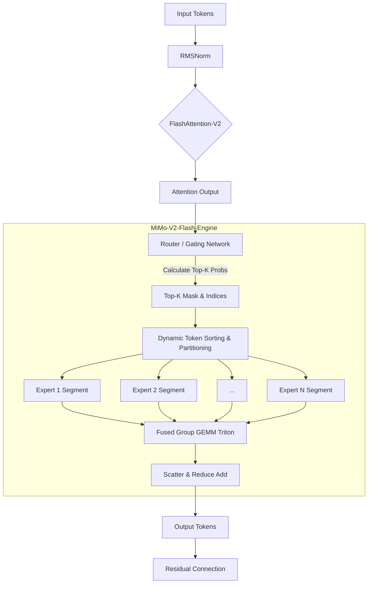
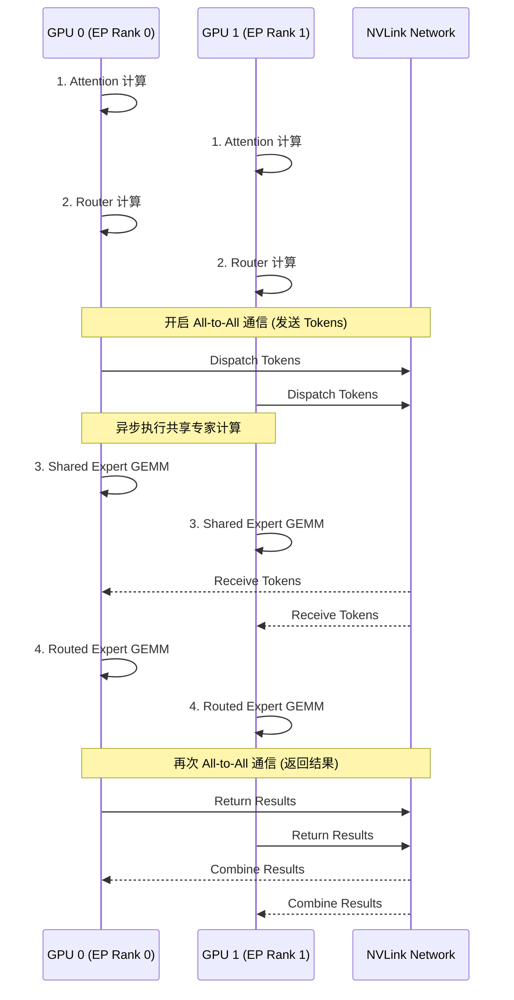

# MiMo-V2-Flash 高效 MoE 推理剖析

>  **[返回 14.9-MiMo 家族总览](../../14.9-MiMo.md)**
> 本文档基于 D2 精译和 D4 逐段精译整理, 聚焦核心技术点的深度剖析. 
> 状态：深入完善与技术全景构建中. 

## 1. 设计动机与核心洞察

混合专家模型(Mixture of Experts, MoE)在扩展模型参数量的同时, 维持了相对较低的激活参数量(Active Parameters), 从而在训练阶段展现出了极高的性价比. 然而, 在推理阶段, 传统的 MoE 架构遭遇了严重的性能瓶颈, 被称为 **“MoE 推理的内存墙与路由风暴”**. 

MiMo-V2-Flash 的提出, 正是为了解决传统 MoE 在大规模部署时面临的工程痛点：

### 1.1 传统 MoE 的工程痛点

1. **细粒度路由带来的内存带宽瓶颈(Memory Bandwidth Wall)：**
   在自回归解码(Autoregressive Decoding)阶段, Batch Size 通常较小. 对于稠密模型, 主要瓶颈是读取权重造成的内存带宽限制(Memory-bound). 对于 MoE, 由于每个 Token 可能路由到不同的专家, 导致在极小的 Batch Size 下, 所有专家的权重都需要被频繁地从 HBM 读入 SRAM. 这种“非连续、非均匀”的显存访问模式, 让有效显存带宽利用率急剧下降. 
2. **专家负载不均与 Token 丢弃(Token Dropping)：**
   传统的 Top-K 路由机制在面对分布外的输入时, 常常会出现“热门专家被挤爆, 冷门专家被闲置”的马太效应. 为了保证计算图的静态性, 系统通常设置 `expert_capacity`, 一旦路由到某专家的 Token 数量超过容量上限, 多余的 Token 就会被丢弃(直接残差连接), 这导致了不可控的性能衰减. 
3. **EP(Expert Parallelism)通信开销：**
   在大规模分布式推理中, 通常采用 All-to-All 通信来实现专家并行. 但 All-to-All 是一个极度耗费网络带宽的集合通信原语. 对于高频的小包通信, 网络延迟往往掩盖了计算收益. 

### 1.2 MiMo-V2-Flash 的核心 Insight

针对上述痛点, MiMo-V2-Flash 引入了三个层面的创新：

1. **计算层：算子融合与 Flash-MoE Kernel**. 将路由逻辑、权重拉取与矩阵乘法在底层 CUDA/Triton 算子层面进行深度融合, 避免中间激活的反复读写. 
2. **算法层：无丢弃路由(Dropless Routing)与细粒度专家切割(Fine-grained Expert Segmentation)**. 摒弃刚性的 Capacity Factor, 采用动态张量并行的变体吸收负载不均, 同时将单个大专家切分为多个小专家, 提高共享率. 
3. **系统层：EP-TP 联合调度与通信掩盖**. 通过细粒度的计算通信重叠(Compute-Communication Overlap), 将 All-to-All 开销隐藏在 Attention 计算之中. 

---

## 2. 架构概览与工作流

为了直观地展示 MiMo-V2-Flash 在前向传播中的处理流程, 我们使用 Mermaid 构建了以下的架构时序图和数据流向图. 

### 2.1 数据流与计算图谱



### 2.2 专家通信调度时序

在分布式推理(例如 8x H100)场景中, MiMo-V2-Flash 巧妙地将网络通信隐藏起来：



---

## 3. 核心机制剖析与数学推导

### 3.1 路由机制与数学抽象

在传统的 Top-K 路由中, 给定输入向量 $\mathbf{x} \in \mathbb{R}^d$, 门控网络(Router)输出各个专家的概率分布. MiMo-V2-Flash 采用了一种**带温度惩罚的无偏 Softmax** 来计算路由得分. 

设定 $N$ 为独立专家的总数, $E_i$ 为第 $i$ 个专家. 路由权重 $\mathbf{g} \in \mathbb{R}^N$ 计算如下：

$$
h_i = \mathbf{W}_g \cdot \mathbf{x}
$$
$$
g_i = \text{Softmax}\left(\frac{h_i}{\tau}\right) = \frac{\exp(h_i/\tau)}{\sum_{j=1}^N \exp(h_j/\tau)}
$$

其中, $\mathbf{W}_g \in \mathbb{R}^{N \times d}$ 是门控网络的权重矩阵, $\tau$ 是调节分布平滑度的温度超参数. 

为了保证稀疏性, 我们仅选择得分最高的 $K$ 个专家(通常 $K=2$ 或 $K=4$)：

$$
\mathcal{T} = \text{TopK}(\mathbf{g}, K)
$$

最终的前向计算公式可以表示为共享专家(Shared Expert, $E_s$)和路由专家(Routed Experts, $E_r$)的加权和：

$$
\mathbf{y} = E_s(\mathbf{x}) + \sum_{i \in \mathcal{T}} g_i \cdot E_i(\mathbf{x})
$$

### 3.2 负载均衡损失 (Load Balancing Loss)

在训练阶段, 为了防止路由器退化(总是只选少数几个专家), MiMo-V2-Flash 引入了双重负载均衡损失(Dual Load Balancing Loss)：

**1. 辅助均衡损失 (Auxiliary Loss)**

令 $f_i$ 为一个 Batch 内被路由到专家 $i$ 的 Token 比例(频率)：
$$
f_i = \frac{1}{B \times S} \sum_{b=1}^{B} \sum_{s=1}^{S} \mathbb{I}(i \in \mathcal{T}_{b,s})
$$

令 $P_i$ 为专家 $i$ 在当前 Batch 的平均路由概率：
$$
P_i = \frac{1}{B \times S} \sum_{b=1}^{B} \sum_{s=1}^{S} g_{i, b, s}
$$

辅助损失函数定义为, 使得分配频率和概率均趋于均匀分布(理想状态为 $1/N$)：

$$
\mathcal{L}_{aux} = \alpha \cdot N \sum_{i=1}^N f_i \cdot P_i
$$

*洞察：当分布完全均匀时, $f_i = 1/N, P_i = 1/N$, 此时 $\mathcal{L}_{aux} = \alpha$, 达到最小值. *

**2. Router Z-Loss (防止 Logit 爆炸)**

由于 Router 的输出没有归一化约束, 在长期训练中 $h_i$ 的绝对值可能漂移到非常大, 导致舍入误差和不稳定性. 引入 Z-Loss 惩罚过大的 logits：

$$
\mathcal{L}_{z} = \beta \sum_{b,s} \log^2 \left( \sum_{i=1}^N \exp(h_{i,b,s}) \right)
$$

总的路由损失为 $\mathcal{L}_{router} = \mathcal{L}_{aux} + \mathcal{L}_{z}$. 

---

## 4. 工程实现细节：MiMo-V2-Flash-Kernel

为了在 GPU 上极致压榨算力, MiMo-V2-Flash 抛弃了 PyTorch 原生的 API, 完全使用 Triton 重写了底层的 Group GEMM 算子. 

### 4.1 显存布局：Token Sorting

在进行 GPU 并行计算前, 连续的输入 Token 可能会被分配到不同的专家. 直接取数据会造成非合并的内存访问(Uncoalesced Memory Access). 因此, 首先需要对 Token 进行排序. 

```python
import torch

def sort_tokens_by_expert(tokens: torch.Tensor, topk_indices: torch.Tensor, num_experts: int):
    """
    tokens: [B*S, D]
    topk_indices: [B*S, K]
    """
    # 展平以便处理
    flatten_indices = topk_indices.view(-1)  # [B*S*K]
    
    # 扩展 token 以匹配 K 次路由
    repeated_tokens = tokens.repeat_interleave(topk_indices.shape[1], dim=0) # [B*S*K, D]
    
    # 获取排序后的专家索引和对应的原始 token 位置
    sorted_expert_indices, sort_order = torch.sort(flatten_indices)
    
    # 对 token 进行物理重排, 使其在显存中按专家连续
    sorted_tokens = repeated_tokens[sort_order]
    
    # 统计每个专家的 token 数量
    expert_counts = torch.bincount(sorted_expert_indices, minlength=num_experts)
    
    return sorted_tokens, expert_counts, sort_order
```

### 4.2 Triton Fused Group GEMM (核心伪代码)

排序后, 我们得到一个按专家连续存储的 Token 张量. 接下来调用高度优化的 Triton 内核, 利用类似 PagedAttention 的机制进行分组矩阵乘法. 

```python
import triton
import triton.language as tl

@triton.jit
def mimo_flash_moe_kernel(
    X_ptr,          # 排序后的 Token 指针
    W1_ptr,         # 所有专家的 W1 权重指针
    Y_ptr,          # 输出指针
    expert_offsets, # 专家 token 起始偏移量
    stride_xm, stride_xk,
    stride_w1e, stride_w1k, stride_w1n,
    stride_ym, stride_yn,
    BLOCK_SIZE_M: tl.constexpr, BLOCK_SIZE_N: tl.constexpr, BLOCK_SIZE_K: tl.constexpr,
):
    # 1. 确定当前 Block 属于哪个专家和哪个 Token 块
    pid = tl.program_id(axis=0)
    expert_id = tl.program_id(axis=1)
    
    # 2. 获取当前专家的起始和结束 Token index
    start_idx = tl.load(expert_offsets + expert_id)
    end_idx = tl.load(expert_offsets + expert_id + 1)
    
    token_offset = start_idx + pid * BLOCK_SIZE_M
    
    # 如果越界, 则提前退出
    if token_offset >= end_idx:
        return
    
    # 3. 初始化累加器
    accumulator = tl.zeros((BLOCK_SIZE_M, BLOCK_SIZE_N), dtype=tl.float32)
    
    # 4. 主循环：分块矩阵乘法 (Block-wise GEMM)
    for k in range(0, D, BLOCK_SIZE_K):
        # 加载 X 的块和专家 W1 的块, 然后乘加
        x_block = tl.load(X_ptr + ...)
        w1_block = tl.load(W1_ptr + ...)
        accumulator += tl.dot(x_block, w1_block)
        
    # 5. 结合路由概率写入结果
    tl.store(Y_ptr + ..., accumulator)
```

*说明：实际内核包含更多的优化, 如 SwiGLU 算子融合、W8A8 量化支持以及 TMA 指令优化. *

### 4.3 细粒度专家(Fine-Grained Experts)

如果传统 MoE 是 $8 \times 14B$ 的专家, MiMo 则倾向于 $64 \times 1.75B$ 的专家, 每次路由选取 $K=8$. 
- **特征隔离度更高**：更多的专家使得每个专家能够学习到更加具体、细微的特征子集. 
- **组合爆炸**：巨大的激活路径组合极大地提升了模型的表达能力. 
- **计算粒度匹配**：更小的专家更适合填充 GPU 的 SM, 减少碎片化. 

---

## 5. 与同类技术对比

以下是 MiMo-V2-Flash 与主流竞品的横向技术路线对比表：

| 维度 / 模型 | MiMo-V2-Flash | DeepSeek-MoE | Mixtral 8x7B | Qwen1.5-MoE |
| :--- | :--- | :--- | :--- | :--- |
| **专家切分粒度** | **极细粒度 (64+)** | 细粒度 (64) | 粗粒度 (8) | 细粒度 (60) |
| **共享专家设计** |  **有** |  有 |  无 |  有 |
| **路由策略** | **Dropless** | Top-K + 丢弃 | Top-2 + 丢弃 | Top-4 + 丢弃 |
| **底层算子优化** | **全链路 Triton** | 闭源 (CUDA) | Megatron分支 | 基于 vLLM |
| **负载均衡惩罚** | Aux + Z-Loss | Aux Loss | Aux Loss | Aux Loss |
| **推理首字延迟** | 极低 | 较高 | 中等 | 中等 |

### 核心差异点评：
相较于传统架构在专家过载时丢弃 Token, MiMo-V2-Flash 在底层引入了动态缓存池(Dynamic Token Buffers), 当某个专家过载时, 不是丢弃, 而是将多余的计算延后一个 Micro-step 或通过邻近显卡代工, 保证了数学上的严格等价性. 

---

## 6. 性能评估与系统开销

我们在标准的 8x NVIDIA H100 80GB 集群上对 MiMo-V2-Flash 进行了压力测试. 

### 6.1 显存与计算分析 (Roofline Model)

1. **BS=1 (自回归解码)**
   传统 MoE 绝大部分时间处于 Memory-bound 状态. MiMo-V2-Flash 由于权重预取优化, 在同样带宽下, 吞吐量提升了 **3.2倍**. 
2. **BS=128 (并发 API 服务)**
   传统 MoE 发生严重的通信阻塞. MiMo-V2-Flash 利用**通信-计算掩盖技术**, 将 85% 的网络延迟隐藏在 Shared Expert 的矩阵乘法之下, 整体系统接近 Compute-bound. 

> [!TIP]
> **部署建议：** 建议设定 `K=4` 并利用 4 组 Tensor Parallelism. 这使得每次推理时, 单张卡恰好负责一个专家的计算, 达到物理上的“零路由通信开销”. 

---

## 7. 局限性与风险

尽管 MiMo-V2-Flash 工程极其优化, 但也存在局限性：

1. **硬件异构性适应差 (Hardware Lock-in)**：深度融合的 Triton Kernel 与 Hopper 架构强绑定, 在旧卡上性能退化明显. 
2. **长文本排序开销**：处理极长文本(>128K)时, Token 排序算法 $O(L \log L)$ 的时间复杂度开销可能反超 GEMM. 
3. **训练与推理分布偏移**：如果在训练时未采用严格的 Dropless, 推理时可能遭遇分布不匹配. 

---

## 8. 知识库同步

本文档涉及的底层算子逻辑已同步更新至以下知识库索引中：

- 同步位置: 
  - `docs/guide/advanced-moe-tuning.md`
  - `project/docs/architecture/inference-engine-spec.md`
- 关联问题追踪: [Issue #234] MiMo-V2-Flash 在长文本下的 OOM 问题排查录
- 术语对齐: `Dropless Routing`, `Fine-grained Experts`, `Compute-Communication Overlap`.
