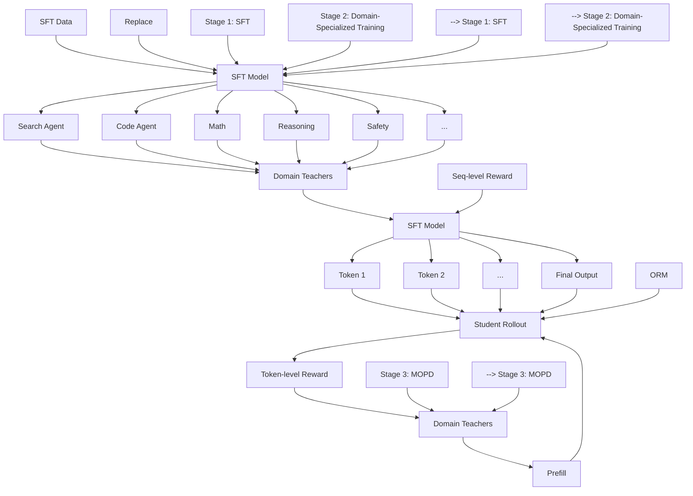

> [返回 14.9-MiMo 家族总览](../../14.9-MiMo.md)

# MiMo-V2-Flash Technical Report

> 原文标题: MiMo-V2-Flash Technical Report
> 原文链接: https://github.com/XiaomiMiMo/MiMo-V2-Flash
> 发布机构: LLM-Core Xiaomi
> 发布日期: 2025-06

# Abstract

我们推出 MiMo-V2-Flash, 一款 Mixture-of-Experts(MoE, 混合专家)模型, 拥有 309B 总参数和 15B 激活参数, 专为快速且强大的推理与 agentic(智能体)能力而设计. MiMo-V2-Flash 采用混合注意力架构, 将 Sliding Window Attention(SWA, 滑动窗口注意力)与全局注意力交错堆叠, 在 5:1 的混合比例下使用 128 token 的滑动窗口. 该模型在 27 万亿 token 上完成预训练, 并引入 Multi-Token Prediction(MTP, 多 token 预测), 原生支持 32K 上下文长度, 并进一步扩展至 256K. 为高效扩展后训练计算, MiMo-V2-Flash 提出了一种新颖的 Multi-Teacher On-Policy Distillation(MOPD, 多教师在线策略蒸馏)范式. 在该框架中, 领域专门化教师模型(例如通过大规模 RL 训练得到)提供密集且 token 级别的奖励, 使学生模型能够充分掌握教师的专业能力. MiMo-V2-Flash 可与 DeepSeek-V3.2, Kimi-K2 等顶尖开源权重模型媲美, 尽管其总参数仅分别为它们的 1/2 和 1/3. 在推理阶段, 通过将 MTP 重新用作 speculative decoding(推测解码)的 draft model(草稿模型), MiMo-V2-Flash 在三层 MTP 下实现了最高 3.6 的接受长度和 2.6 倍的解码加速. 我们同时开源了模型权重与三层 MTP 权重, 以促进开放研究与社区协作.

> 译者注: MiMo-V2-Flash 的核心设计哲学是"用小激活参数(15B)撬动大总参数(309B)的 MoE 规模", 同时用混合注意力把长上下文成本压下来. 这种路线与 Kimi-K2(1043B 总参, 32B 激活)和 DeepSeek-V3.2(671B 总参, 37B 激活)相比, 激活参数量不到对手的一半, 但性能相当, 说明架构效率与训练数据质量可以部分弥补规模差距.

bar

| Category | MiMo-V2-Flash (%) | DeepSeek-V3.2 (%) | K2-Thinking (%) | Claude Sonnet 4.5 (%) | GPT-5 (High) (%) | Gemini 3.0 Pro (%) |
| :--- | :--- | :--- | :--- | :--- | :--- | :--- |
| SWE-Bench Verified (Agentic coding) | 73.4 | 73.1 | 71.3 | 77.2 | 74.9 | 76.2 |
| SWE-Bench Multilingual (Multilingual agentic coding) | 71.7 | 70.2 | 61.1 | 68.0 | 55.3 | |
| Tau2-Bench (Agentic tool use) | 80.3 | 80.3 | 74.3 | 84.7 | 80.2 | 85.4 |
| AIME25 (Mathematics) | 94.1 | 93.1 | 94.5 | 87.0 | 94.6 | 95.0 |
| GPQA-Diamond (Scientific knowledge) | 84.3 | 82.4 | 84.5 | 83.4 | 85.7 | 91.9 |
| HLE (w/o Tool) (Academic reasoning) | 22.1 | 25.1 | 23.9 | 13.7 | 26.3 | 37.5 |
| Arena-Hard (Creative Writing) (General capability) | 86.2 | 88.8 | 80.1 | 76.7 | 92.2 | 93.6 |

图 1: MiMo-V2-Flash 的 benchmark 性能.

# Contents

# 1 Introduction 4

# 2 MiMo-V2-Flash Model Architecture 5

2.1 Overall Architecture 5   
2.2 Hybrid Sliding Window Attention Architecture . . 6

2.2.1 Model Architecture Experiments 7   
2.2.2 Summary and Discussion 8

2.3 Lightweight Multi-Token Prediction (MTP) . . . 9

2.3.1 Motivation of using MTP . . . 9   
2.3.2 Lightweight MTP Design in MiMo-V2-Flash 9

# 3 Pre-Training 9

3.1 Data Scheduler 10   
3.2 Hyper-Parameters . 10   
3.3 Evaluations . . 11

3.3.1 Evaluation Setup . . 11   
3.3.2 Evaluation Results 11

# 4 Post-Training 11

4.1 Multi-Teacher On-Policy Distillation (MOPD): A New Post-Training Paradigm . . . 11   
4.2 Supervised Fine-Tuning (SFT) . . 14   
4.3 Scaling Reinforcement Learning (RL) . . . 15

4.3.1 Non-Agentic RL Training . . . 15   
4.3.2 Agentic RL Training 15

4.4 Technical Formulation of MOPD . 18   
4.5 Evaluations 18

4.5.1 Evaluation Setup . . 18   
4.5.2 Evaluation Results 19

4.6 RL Infrastructures . 19

4.6.1 Stablized Training via Rollout Routing Replay (R3) . . . 19   
4.6.2 Data Scheduler . 20   
4.6.3 Toolbox and Tool Manager . . . 21

# 5 MTP Speedup 21

5.1 MTP Acceptance Length . . 21   
5.2 MTP Inference Speedup . . 21

6 Conclusion, Limitation, and Future Work 2 2

A Contributions and Acknowledgments 2 9

B Reward Hacking of SWE-Bench 31

C Context Management 31

# 1 Introduction

近期, 通用人工智能(AGI)的进展 increasingly 由两个前沿方向推动: 高级推理链和自主 agentic 工作流(Google DeepMind, 2025; Kimi Team, 2025b; Liu et al., 2025), 而它们都建立在大规模 Reinforcement Learning(RL, 强化学习)之上. 然而, 构建可扩展的推理器与智能体面临一个共同的瓶颈: 长上下文建模必须同时做到快速与强大.

在本工作中, 我们推出 MiMo-V2-Flash, 一款高效且具成本效益的大型语言模型(LLM), 在推理与 agentic 性能上表现强劲. MiMo-V2-Flash 是一个 309B 参数的 MoE 模型, 每 token 激活 15B 参数. 为缓解完整注意力的二次复杂度, MiMo-V2-Flash 采用混合注意力机制, 将局部滑动窗口注意力与全局注意力交错. 滑动窗口大小为 128 token, 局部与全局的混合比例为 5:1, 使得长上下文下的 KV Cache 存储与注意力计算几乎降低 6 倍. 借助可学习的 attention sink bias(Agarwal et al., 2025), 尽管使用了激进的滑动窗口大小和混合比例, 该混合架构仍能在长上下文场景中保持强大的建模能力. MiMo-V2-Flash 还引入 Multi-Token Prediction(MTP)以增强训练性能并加速推理解码. 特别是, MTP 在提升 RL rollout 速度方面具有巨大潜力, 有助于将 LLM 推向更高的智能水平. 借助轻量化的稠密 Feed-Forward Network(FFN, 前馈网络)和滑动窗口注意力, 我们的 MTP 模块在实际部署中以高接受率实现了显著的解码加速.

> 译者注: "混合比例 5:1" 意味着每 5 层 SWA 才配 1 层全局注意力. 这比 Gemma 3 等模型的混合比例更激进, 直接换来近 6 倍的 KV Cache 缩减. 但风险是长距离依赖捕获能力受损, 因此需要 attention sink bias 来补偿. 这是显存/速度换模型容量的经典 trade-off, 小米通过工程手段把它拉平了.

MiMo-V2-Flash 的预训练 recipe 大体遵循 MiMo-7B(Xia et al., 2025), 并做了若干增强. 训练采用 FP8 混合精度, 在 27T token 上高效完成大规模训练. 模型最初以原生 32K 上下文预训练, 随后扩展至 256K. 所得的预训练模型 MiMo-V2-Flash-Base 与领先开源基座模型(如 Kimi-K2-Base(Kimi Team, 2025c)和 DeepSeek-V3.2-Exp-Base(Liu et al., 2025))进行了对比评测. MiMo-V2-Flash-Base 在通用 benchmark 上取得有竞争力的性能, 并在推理导向任务上超越同规模模型. 在长上下文检索方面, 我们的混合注意力架构在 32K 到 256K 的上下文长度上均实现接近 100% 的成功率. 在极端长上下文推理 benchmark GSM-Infinite(Zhou et al., 2025)上, MiMo-V2-Flash 表现出稳健性能, 从 16K 扩展到 128K 时退化极小.

在后训练中, 我们聚焦于高效扩展 RL 计算以提升推理与 agentic 能力. 为此, MiMo-V2-Flash 提出了一种新的后训练范式, 称为 Multi-Teacher On-Policy Distillation(MOPD). 该框架通过三个阶段解决学习效率低下与能力失衡问题: (1) 通用 Supervised Fine-Tuning(SFT); (2) 专门的 RL/SFT 以训练领域专用教师模型; (3) MOPD, 学生模型从两种互补信号中学习: 来自跨领域专门教师模型的密集 token 级奖励, 以及可验证的结果级奖励. 通过以这种方式整合多样化的专家知识, MiMo-V2-Flash 同时掌握了各领域教师的峰值能力, 并受益于稳定且高效的学习动态.

> 译者注: MOPD 的关键创新在于"不合并参数, 也不生成静态蒸馏数据集", 而是把多教师知识整合转化为 on-policy RL 问题. 学生从自己的分布中采样, 教师对每个 token 给出 KL 奖励. 这样既能吸收多个专家的峰值能力, 又避免了传统合并或顺序训练带来的"跷跷板"效应.

MiMo-V2-Flash 在大多数推理 benchmark 上取得了与 Kimi-K2-Thinking 和 DeepSeek-V3.2-Thinking 相当的性能. 在 LongBench V2 和 MRCR 等长上下文评测中, MiMo-V2-Flash 持续超越更大的全注意力模型, 验证了其混合 SWA 架构的稳健性. 值得注意的是, 该模型在 SWE-Bench Verified 上达到 73.4%, 在 SWE-Bench Multilingual 上达到 71.7%, 成为软件工程任务上领先的开源模型. 模型权重(含三层 MTP 权重)已开源至 https://github.com/XiaomiMiMo/MiMo-V2-Flash.

```mermaid
graph TD
    subgraph LM Head
        A["×t"] --> B["GA block"]
        B --> C["Sparse MoE"]
        C --> D["RMSNorm"]
        D --> E["Global Attention"]
        E --> F["RMSNorm"]
        F --> G["SWA block"]
        G --> H["Sparse MoE"]
        H --> I["RMSNorm"]
        I --> J["Sliding Window Attention"]
        J --> K["RMSNorm"]
        K --> L["Embedding"]
    end

    subgraph MTP block
        M["×t+1"] --> N["LM Head (tied)"]
        N --> O["×t+2"]
        O --> P["×t+3"]
        P --> Q["Linear"]
        Q --> R["RMSNorm"]
        R --> S["Embedding (tied)"]
        S --> T["×t"]
        T --> U["×t+1"]
        U --> V["×t+2"]
        V --> W["×t+3"]
        W --> X["×t+1"]
        X --> Y["×t+2"]
        Y --> Z["×t+3"]
    end

    subgraph Kx
        AA["×t+1"] --> AB["SLiding Window Attention"]
        AB --> AC["RMSNorm"]
        AC --> AD["Linear"]
        AD --> AE["RMSNorm"]
        AE --> AF["Embedding (tied)"]
        AF --> AG["×t"]
        AG --> AH["×t+1"]
        AH --> AI["×t+2"]
        AI --> AJ["×t+3"]
    end

    C -->|1x| B
    D -->|Mx| B
    E -->|Nx| B
    H -->|Nx| B
    J -->|Nx| B
    K -->|Nx| B
    L -->|Nx| B
    M -->|MTP block| N
    N -->|MTP block| O
    O -->|MTP block| P
    P -->|MTP block| Q
    Q -->|MTP block| R
    R -->|MTP block| S
    S -->|MTP block| T
    T -->|MTP block| U
    U -->|MTP block| V
    V -->|MTP block| W
    W -->|MTP block| X
    X -->|MTP block| Y
    Y -->|MTP block| Z
    Z -->|MTP block| AA
    AA -->|MTP block| AB
    AB -->|MTP block| AC
    AC -->|MTP block| AD
    AD -->|MTP block| AE
    AE -->|MTP block| AF
    AF -->|MTP block| AG
    AG -->|MTP block| AH
    AH -->|MTP block| AI
    AI -->|MTP block| AJ
    AJ -->|MTP block| AK
    AK -->|MTP block| AL
    AL -->|MTP block| AM
    AM -->|MTP block| AN
    AN -->|MTP block| AO
    AO -->|MTP block| AP
    AP -->|MTP block| AQ
    AQ -->|MTP block| AR
    AR -->|MTP block| AS
    AS -->|MTP block| AT
    AT -->|MTP block| AU
    AU -->|MTP block| AV
    AV -->|MTP block| AW
    AW -->|MTP block| AX
    AX -->|MTP block| AY
    AY -->|MTP block| AZ
    AZ -->|MTP block| BA
    BA -->|MTP block| BB
    BB -->|MTP block| BC
    BC -->|MTP block| BD
    BD -->|MTP block| BE
    BE -->|MTP block| BF
    BF -->|MTP block| BG
    BG -->|MTP block| BH
    BH -->|MTP block| BI
    BI -->|MTP block| BJ
    BJ -->|MTP block| BK
    BK -->|MTP block| BL
    BL -->|MTP block| BM
    BM -->|MTP block| BN
    BN -->|MTP block| BO
    BO -->|MTP block| BP
    BP -->|MTP block| BQ
    BQ -->|MTP block| BR
    BR -->|MTP block| BS
    BS -->|MTP block| BT
    BT -->|MTP block| BU
    BU -->|MTP block| BV
    BV -->|MTP block| BW
    BW -->|MTP block| BX
    BX -->|MTP block| BY
    BY -->|MTP block| BQ
    BQ -->|MTP block| BQ
    BQ -->|MTP block| BQ
    BQ -->|MTP block| BQ
    BQ -->|MTP block| BQ
    BQ -->|MTP block| BQ
    BQ -->|MTP block| BQ
    BQ -->|MTP block| BQ
    BQ -->|MPPM| BQ
    BQ -->|MPPM| BQ
    BQ -->|MPPM| BQ
    BQ -->|MPPM| BQ
    BQ -->|MPPM| BQ
    BQ -->|MPPM| BQ
    BQ -->|MPPM| BQ
    BQ -->|MPPM| BQ
    BQ -->|MPPM| BQ

    subgraph LM Head
        A
        B
        C
        D
        E
        F
        G
        H
        I
        J
        K
        L
        M
        N
        O
        P
        Q
        R
        S
        T
        U
        V
        W
        X
        Y
        Z
        AA
        AB
        AC
        AD
        AE
        AF
        AG
        AH
        AI
        AJ
        AK
        AL
        AM
        AN
        AO
        AP
        AQ
        AR
        AS
        AT
        AU
        AV
        AW
        AX
        AY
        AZ
        BA
        BB
        BC
        BD
        BE
        BF
        BG
        BH
        BI
        BJ
        BK
        BL
        BM
        BN
        BO
        BP
        BP
        BP
        BP
        BP
        BP
        BP
        BP
        BP
    end
```

flowchart

图 2: MiMo-V2-Flash 模型架构示意图. 模型包含 ?? = 8 个 Hybrid Block, 每个 Hybrid Block 将 ?? = 5 个 Sliding Window Attention(SWA)块与 1 个 Global Attention(GA)块交错. 两者均配备稀疏 MoE FFN. 唯一例外是第一层, 使用 GA 配合稠密 FFN. MTP 块采用 SWA 和稠密 FFN.

# 2 MiMo-V2-Flash Model Architecture

# 2.1 Overall Architecture

如图 2 所示, MiMo-V2-Flash 遵循标准 Transformer(Vaswani et al., 2017)骨干, 并加入 MoE(Shazeer et al., 2017)和混合注意力(Brown et al., 2020; Gemma Team, 2024, 2025; Kimi Team, 2025a; Li et al., 2025; Qwen Team, 2025). MiMo-V2-Flash 主要由重复的 hybrid block 组成, 将局部 Sliding Window Attention(SWA)与 Global Attention(GA)交错. 它堆叠了 ?? = 8 个 hybrid block, 每个 block 的结构为 ?? = 5 个连续的 SWA 块后跟 1 个 GA 块. 唯一例外是第一个 Transformer 块, 它使用全局注意力配合稠密 Feed-Forward Network(FFN)以稳定早期表示学习. MiMo-V2-Flash 中使用的滑动窗口大小 ?? 为 128. SWA 块与 GA 块均使用稀疏 MoE FFN. 每个 MoE 层共包含 256 个专家, 每 token 激活 8 个, 且没有共享专家.

MiMo-V2-Flash 还集成了 MTP(Gloeckle et al., 2024; Liu et al., 2024; Xia et al., 2025)以提升模型性能(包括质量与效率). 值得注意的是, MTP 块使用稠密 FFN 而非 MoE, 并应用 SWA 而非 GA, 使其在推测解码中保持轻量. 每个 MTP 块的参数量仅为 0.33B.

表 1 汇总了 MiMo-V2-Flash 的详细配置.

| Block | Configuration | Value |
| ----- | ------------- | ----- |
| **Main Block** | Layers (Total/SWA/GA) | 48/39/9 |
| | SWA Heads (Q/KV) | 64/8 |
| | Sliding Window Size | 128 |
| | GA Heads (Q/KV) | 64/4 |
| | Head Dimensions (QK/V) | 192/128 |
| | Experts (Total/Activated) | 256/8 |
| **MTP Block** | SWA Heads (Q/KV) | 64/8 |
| | Sliding Window Size | 128 |
| | Head Dimensions (QK/V) | 192/128 |
| | # Parameters | 0.33B |

表 1: MiMo-V2-Flash 的详细模型配置.

MiMo-V2-Flash 采用 Grouped-Query Attention(GQA, Ainslie et al., 2023). 具体而言, SWA 有 64 个 query 头和 8 个 key-value 头, GA 有 64 个 query 头和 4 个 key-value 头. 每个头的维度对 SWA 和 GA 相同(query/key 为 192, value 为 128). Rotary Positional Embedding(RoPE, Su et al., 2024)仅应用于 query 和 key 的前 64 维. 遵循近期最佳实践, 我们采用类似 DeepSeek-V3(Liu et al., 2024)的 FP8 混合精度框架. 具体而言, 我们对 attention 输出投影, embedding 和输出头参数保留 BF16 精度, 对 MoE router 参数保持 FP32 精度. 该混合精度配置在不显著影响训练效率或内存占用的前提下提升了数值稳定性.

> 译者注: 注意一个关键设计: 第一层使用稠密 FFN 而非 MoE. 这通常是为了在模型早期稳定特征学习, 因为早期层的表示变化剧烈, 稀疏路由容易导致训练不稳定. MTP 块本身也使用 SWA+稠密 FFN, 说明 MTP 被设计为"外挂式"轻量加速器, 不参与主模型的容量竞争.

# 2.2 Hybrid Sliding Window Attention Architecture

Sliding Window Attention(Beltagy et al., 2020)将每个 token 的注意力范围限制在局部窗口内, 而非整个序列, 从而显著降低计算与内存复杂度. 这自然催生了将 SWA 与全局注意力交错的混合注意力架构. 然而, 先前研究表明, 过度激进地使用 SWA(如非常小的滑动窗口或高 SWA:GA 比例)会导致模型性能显著下降(Gemma Team, 2025), 尤其在长上下文任务中. 近期, 可学习 attention sink bias 的引入使模型在需要时可以对 token 分配很少或零注意力, 这显著增强了基于 SWA 架构的建模能力(Agarwal et al., 2025). 虽然 attention sink 机制的精确理论基础仍是活跃研究领域(Gu et al., 2024b; Qiu et al., 2025; Sun et al., 2024; Xiao et al., 2023), 我们经验性地观察到, 可学习 attention sink bias 显著提升了混合 SWA 模型的性能, 使其达到甚至超越全 GA 层基线.

在 MiMo-V2-Flash 中, 我们的实现遵循 gpt-oss(Agarwal et al., 2025)的设计, 对每个注意力头的 softmax 分母施加一个可学习的 attention sink bias $\text{sink}_h \in \mathbb{R}$. 具体而言, 设单个头中 token $i$ 与 token $j$ 之间的注意力 logits 为:

$$
a_{ij} = \frac{q_i k_j^{\top}}{\sqrt{d}}, \tag{1}
$$

其中 $q_i$ 和 $k_j$ 分别表示 token $i$ 的 query 和 token $j$ 的 key, $d$ 为头维度. 注意力权重由下式给出:

$$
s_{ij} = \frac{\exp(a_{ij} - m_i)}{\exp(\text{sink} - m_i) + \sum_{j'} \exp(a_{ij'} - m_i)}, \tag{2}
$$

$$
m_i = \max(\max_j a_{ij}, \text{sink}). \tag{3}
$$

最终, query $i$ 的注意力输出通过对 value 加权求和得到:

$$
o_i = \sum_{j=1}^{n} s_{ij} v_j. \tag{4}
$$

> 译者注: 式 (2)(3) 的核心是在 softmax 分母中额外加入一个 "sink" 项. 这相当于给模型一个"可学习的垃圾桶": 如果某些 token(如长上下文中的远距离噪音)对当前预测无益, 模型可以把注意力"倒"进 sink, 而不是被迫在局部窗口内做硬分配. 这种机制让极小的 128 token 窗口不会成为性能瓶颈.

# 2.2.1 Model Architecture Experiments

为验证我们设计选择的有效性, 我们在一个 32B 稠密模型上进行了探索性与经验性研究, 保持 query-key 维度和 RoPE 配置与上述一致.

| Model | MMLU | BBH | TriviaQA | GSM8K | MATH | CMMLU | MBPP |
| ----- | ---- | --- | -------- | ----- | ---- | ----- | ---- |
| All GA | 57.3 | 54.7 | 53.2 | 34.2 | 9.5 | 50.3 | 54.7 |
| Hybrid SWA($W = 128$, w/o sink) | 54.9 | 52.4 | 52.8 | 36.9 | 8.9 | - | - |
| Hybrid SWA($W = 128$, w/ sink) | 58.3 | 56.1 | 53.7 | 36.9 | 10.3 | 53.3 | 56.3 |
| Hybrid SWA($W = 512$, w/ sink) | 58.3 | 54.9 | 54.9 | 37.9 | 10.0 | 52.3 | 53.2 |

表 2: 不同注意力配置的通用 benchmark 结果.

| Model | GSM-Infinite | NoLiMa | RULER-32k | MRCR |
| ----- | ------------ | ------ | --------- | ---- |
| All GA | 12.3 | 49.7 | 89.4 | 32.5 |
| Hybrid SWA($W = 128$, w/ sink) | 17.3 | 51.2 | 89.4 | 34.4 |
| Hybrid SWA($W = 512$, w/ sink) | 17.2 | 38.5 | 84.7 | 19.6 |

表 3: 不同注意力配置的长上下文 benchmark 结果.

| Model | AIME24/25 | LiveCodebench | GPQA-Diamond | Average |
| ----- | --------- | ------------- | ------------ | ------- |
| All GA | 45.5 | 40.0 | 41.7 | 42.4 |
| Hybrid SWA(W = 128, w/ sink) | 47.1 | 43.9 | 48.1 | 46.3 |

表 4: 不同注意力配置的复杂推理 benchmark 结果.

**Baselines and Benchmarks**

我们在对比设置中评估四种模型架构变体: 全全局注意力(All GA)基线, 无 attention sink bias 的 128 token 窗口混合 SWA 模型, 以及使用 128 和 512 窗口并加入 attention sink bias 的两个混合 SWA 模型. 所有变体共享相同的训练流程: 在 250B token 上预训练, 序列长度 8,192; 额外 40B token 将上下文扩展至 32,768; 随后进行长上下文 SFT 和带思维链监督的推理 SFT. 我们在覆盖通用能力, 长上下文理解和复杂推理的 benchmark 上评估模型变体. 通用领域结果(表 2)来自未做长上下文扩展的预训练基座模型, 评测通用知识与推理, 包括 MMLU(Hendrycks et al., 2021a), BBH(Suzgun et al., 2023), TriviaQA(Joshi et al., 2017), GSM8K(Cobbe et al., 2021), MATH(Hendrycks et al., 2021b), CMMLU(Li et al., 2023)和 MBPP(Austin et al., 2021). 长上下文结果(表 3)在经长上下文扩展的基座模型上评测 GSM-Infinite(Zhou et al., 2025), NoLiMa(Modarressi et al., 2025), RULER-32k(Hsieh et al., 2024), 以及在长上下文 SFT 模型上评测 MRCR(Vodrahalli et al., 2024). 对于 GSM-Infinite 和 NoLiMa, 我们构建内部 few-shot benchmark 以在受控长上下文设置下评估基座模型. 复杂推理结果(表 4)在推理 SFT 模型上评测 AIME24&25(MAA, 2024), LiveCodeBench(Jain et al., 2024)和 GPQA-Diamond(Rein et al., 2024).

我们在下面强调关键经验发现:

**Ablation on Attention Sink Bias**

如表 2 所示, 混合 SWA($W = 128$, w/o sink)在通用 benchmark 上出现明显性能下降, 而引入 attention sink bias 后性能相对全 GA 基线一致地恢复或提升. 因此, 在后续实验中, 我们默认应用 attention sink bias.

**Sliding Window Attention Size**

混合 SWA($W = 128$)与混合 SWA($W = 512$)在通用 benchmark 上表现相似(表 2). 然而, 经过长上下文扩展和长上下文 SFT 后, 混合 SWA($W = 128$)超越了全 GA 基线, 而 SWA($W = 512$)则出现显著下降(表 3).

**Reasoning Ability**

如表 4 所示, 混合 SWA($W = 128$)在不同挑战性推理 benchmark 上超越了全 GA 基线, 显示出复杂推理能力的清晰提升.

# 2.2.2 Summary and Discussion

我们的实验表明, 混合 SWA($W = 128$)不仅优于混合 SWA($W = 512$), 还能超越全 GA 基线, 这可能看起来违反直觉. 我们假设这源于更好的正则化与有效的稀疏性. 更小的窗口迫使模型聚焦局部上下文, 成为一种归纳偏置, 缓解了对虚假模式的过拟合. 此外, 更紧的窗口($W = 128$)促使 SWA 建模局部信息, 同时将长程依赖委托给全局注意力层, 从而形成更清晰的分工, 实现更准确, 更高效的学习. 相比之下, 更大的窗口($W = 512$)会模糊这种区分, 导致 SWA 部分地自己处理长程依赖, 削弱了局部与全局信息之间的分离, 进而导致次优性能.

> 译者注: 这一发现对当前"窗口越大越好"的直觉形成挑战. 小米的观察是: 窗口太大, SWA 和 GA 的职责重叠, 混合架构的优势被稀释; 窗口足够小, 才能强迫 SWA 专注局部, GA 专注全局, 实现真正的功能解耦. 这说明混合注意力的设计不是简单地把 SWA 塞进去, 而是要精确控制窗口大小以形成任务分工.

我们强调, 这些观察和发现都是经验性的, 来自我们特定的实验设置, 包括模型规模, 数据集和训练流程. 尽管如此, 我们希望这些观察能为推理与 agentic AI 时代高效注意力架构的持续讨论提供额外视角, 并激励更广泛的社区进一步研究高效架构.

# 2.3 Lightweight Multi-Token Prediction (MTP)

# 2.3.1 Motivation of using MTP

先前工作表明, MTP 是一种强大的训练目标, 可提升训练效率与模型质量(Gloeckle et al., 2024; Liu et al., 2024; Xia et al., 2025). 除了这些训练收益, 我们更强调将 MTP 作为原生 draft model 用于 self-speculative decoding(自推测解码), 以实现真实部署加速. 下面, 我们从两个角度详细阐述 MTP 如何加速推理: 通用 LLM 解码加速与 RL 训练加速.

**Accelerating LLM Decoding**

LLM 解码由于算术强度低, 本质上是内存受限的. 批处理级并行常用于提升 FFN 算术强度, 但无法惠及注意力计算, 因为每个请求维护自己的 KV Cache. 相比之下, MTP 通过生成多个 draft token, 再由主模型并行验证, 提升了 FFN 和注意力的算术强度. 这种方法在不增加 KV Cache I/O 的前提下实现了 token 级并行.

**Accelerating RL Training**

MTP 加速尤其适合 RL 训练(RadixArk Team, 2025), 其中 rollout 阶段由于推理和解码成本 consistently 成为主导瓶颈. MTP 解决了 RL 训练中的两个关键挑战:

- 它使小批量高效 RL 成为可能. 当前 RL 训练依赖大批量, off-policy 算法来最大化吞吐(Liu et al., 2025; Schulman et al., 2017; Zheng et al., 2025). 然而, on-policy 训练通常更稳定, 更有效, 但其小批量会低估 GPU 利用率. MTP 通过扩展 token 级并行而非 batch size 来缓解这一局限, 使小批量 on-policy RL 训练更具实用性.
- 它缓解长尾 straggler 导致的 GPU 空闲. 随着 rollout 阶段推进, 处理长序列的小批量长尾 straggler(批量大小常接近 1)会造成显著 GPU 空闲(Gao et al., 2025; Zhong et al., 2025). 在这种情况下, MTP 提升了注意力和 FFN 的计算效率, 显著降低整体延迟.

> 译者注: MTP 对 RL 的价值容易被忽视. 在 RL rollout 中, 延迟不仅来自模型前向, 还来自大量短序列请求的排队和长尾. MTP 通过"一次猜多个 token"把单位时间内的有效生成量提高, 相当于在不增加 batch size 的情况下提升吞吐, 这对 on-policy RL(要求小 batch, 低方差)尤为关键.

# 2.3.2 Lightweight MTP Design in MiMo-V2-Flash

在 MiMo-V2-Flash 中, MTP 块被刻意保持轻量, 以防止其成为新的推理瓶颈. 我们使用小的稠密 FFN 而非 MoE 以限制参数量, 并采用 SWA 而非 GA 以降低 KV Cache 和注意力计算成本. 预训练期间, 模型只挂载单个 MTP head, 以避免额外训练开销. 后训练阶段, 该 head 被复制 ?? 次以形成 ?? 步 MTP 模块, 所有 head 被联合训练以进行多步预测. 每个 head 接收主模型的隐藏状态和 token embedding 作为输入, 提供更丰富的预测信息. 尽管设计轻量, MTP 模块仍然非常有效, 实现了高接受率. 详细结果见第 5 节.

# 3 Pre-Training

MiMo-V2-Flash 的预训练语料由 27 万亿 token 组成, 来源多样且高质量, 包括公开网页内容, 书籍, 学术论文, 代码, 数学和更广泛的 STEM 材料. 我们的数据处理流程大体遵循 MiMo-7B(Xia et al., 2025), 并刻意转向具有长程依赖的数据. 特别是, 我们强调长文档网页和精心策划的代码语料, 如仓库级代码, pull request, issue 和提交历史, 以增强模型捕获扩展上下文关系并执行复杂多步推理的能力.

# 3.1 Data Scheduler

MiMo-V2-Flash 的预训练分为三个顺序阶段:

- **Stage 1 (Pre-training, 0 - 22T)**: 模型在多样化, 高质量的通用语料上训练, 使用 32K token 的上下文长度, 以建立强大的基础语言能力.
- **Stage 2 (Mid-training, 22 - 26T)**: 我们修改数据混合, 上采样代码中心数据, 并加入约 5% 的合成推理数据, 以进一步增强逻辑推理和程序合成能力.
- **Stage 3 (Context Extension, 26 - 27T)**: 在 Stage 2 数据分布基础上, 我们将模型上下文窗口扩展至 256K token, 并上采样具有长程依赖的数据, 以实现更有效的扩展上下文建模和长程推理.

> 译者注: 三阶段调度中, Stage 2 加入合成推理数据与代码上采样, 与 MiMo-7B 类似但更克制(仅 5% 合成). Stage 3 才做长上下文扩展, 说明小米走的是"先学好短程推理, 再扩展到长上下文"的路线, 而不是一开始就押注长文本. 这种顺序有助于稳定训练.

# 3.2 Hyper-Parameters

**Model Hyper-Parameters**

我们将 MiMo-V2-Flash 配置为 48 层 Transformer, 包含 39 个滑动窗口注意力层和 9 个全局注意力层. 隐藏维度设为 4096. 除第一层外, 所有层均配备稀疏 MoE. 每个 MoE 层包含 256 个 routed experts, 每 token 激活 8 个专家, 每个专家的中间隐藏维度为 2048. 稠密层的 FFN 中间隐藏维度设为 16384. 所有可学习参数以 0.006 的标准差随机初始化. 模型在预训练期间使用单个 MTP 层. 总体而言, MiMo-V2-Flash 共有 309B 总参数, 其中 15B 为激活参数.

**Training Hyper-Parameters**

我们使用 AdamW 优化器, 参数为 $\beta_1 = 0.9$, $\beta_2 = 0.95$, 权重衰减 0.1. 梯度裁剪最大范数为 1.0. 学习率调度分为两个阶段. Stage 1 中, 学习率在前 50B token 从 0 线性 warmup 至 $3.2 \times 10^{-4}$, 随后在 12T token 上保持恒定 $3.2 \times 10^{-4}$, 最后在 10T token 上按余弦衰减至 $1.0 \times 10^{-4}$. Stage 2 从 $1.0 \times 10^{-4}$ 开始, 在 4T token 上按余弦衰减至 $3.0 \times 10^{-5}$. Batch size 在前 500B token 线性 warmup 至 2,048, 并在两个阶段剩余部分保持恒定. 关于辅助损失, MoE sequence auxiliary loss 系数在所有阶段设为 $1.0 \times 10^{-5}$. Expert bias 更新因子在 Stage 1 和 Stage 2 设为 0.001. MTP loss weight 在 Stage 1 为 0.3, 在 Stage 2 和 Stage 3 为 0.1.

**Long Context Extension**

Stage 1 中, 预训练序列长度设为 32,768, GA 的 RoPE base frequency 为 640,000, SWA 为 10,000. Stage 3 中, 序列长度扩展至 262,144, GA 的 RoPE base frequency 调整为 5,000,000. Stage 3 的学习率从 $3.0 \times 10^{-5}$ 按余弦衰减至 $1.0 \times 10^{-5}$, batch size 固定为 256. Stage 3 的 expert bias 更新因子降至 $1.0 \times 10^{-5}$.

# 3.3 Evaluations

# 3.3.1 Evaluation Setup

我们在一系列 benchmark 上评估 MiMo-V2-Flash-Base, 覆盖多种能力: (1) 通用语言理解与推理, 包括 BBH(Suzgun et al., 2023), MMLU(Hendrycks et al., 2021a), MMLU-Redux(Gema et al., 2024), MMLU-Pro(Wang et al., 2024), DROP(Dua et al., 2019), ARC(Clark et al., 2018), HellaSwag(Zellers et al., 2019), WinoGrande(Sakaguchi et al., 2020), TriviaQA(Joshi et al., 2017), GPQA-Diamond(Rein et al., 2024), SuperGPQA(Du et al., 2025)和 SimpleQA(OpenAI, 2024). (2) 数学推理: GSM8K(Cobbe et al., 2021), MATH(Hendrycks et al., 2021b)和 AIME(MAA, 2024)(2024 & 2025). (3) 代码: HumanEval+(Liu et al., 2023), MBPP+(Liu et al., 2023), CRUXEval(Gu et al., 2024a), MultiPL-E(Cassano et al., 2022), BigCodeBench(Zhuo et al., 2024), LiveCodeBench v6(Jain et al., 2024)和 SWE-Bench(Jimenez et al., 2024a)(few-shot Agentless Repair(Xia et al., 2024)). (4) 中文理解: C-Eval(Huang et al., 2023), CMMLU(Li et al., 2023)和 C-SimpleQA(He et al., 2025). (5) 多语言理解: GlobalMMLU(Singh et al., 2025)和 INCLUDE(Romanou et al., 2024). (6) 长上下文: NIAH-Multi(Hsieh et al., 2024), GSM-Infinite(Zhou et al., 2025)(5-shot, Hard Ops-{2,4,6,8,10}).

# 3.3.2 Evaluation Results

表 5 展示了 MiMo-V2-Flash-Base 与领先开源基座模型(Kimi Team, 2025c; Liu et al., 2024)的全面对比. MiMo-V2-Flash-Base 在大多数 benchmark 上展现出有竞争力的性能, 并在推理任务上持续超越同规模模型. 在 SWE-Bench 上, 它甚至超越了规模大得多的 Kimi-K2-Base, 而使用不到其三分之一的参数, 凸显了我们对真实代码智能体任务方法的优势. 然而, 受限于有限的参数量, 我们观察到 MiMo-V2-Flash 在知识容量上低于更大模型, 这在 SimpleQA 上有所体现.

| Benchmark | # Shots | MiMo-V2-Flash Base | Kimi-K2 Base | DeepSeek-V3.1 Base | DeepSeek-V3.2 Exp Base |
| --------- | ------- | ------------------ | ------------ | ------------------ | ---------------------- |
| #Activated Params | - | 15B | 32B | 37B | 37B |
| #Total Params | - | 309B | 1043B | 671B | 671B |
| **General** |
| BBH | 3-shot | 88.5 | 88.7 | 88.2 | 88.7 |
| MMLU | 5-shot | 86.7 | 87.8 | 87.4 | 87.8 |
| MMLU-Redux | 5-shot | 90.6 | 90.2 | 90.0 | 90.4 |
| MMLU-Pro | 5-shot | 73.2 | 69.2 | 58.8 | 62.1 |
| DROP | 3-shot | 84.7 | 83.6 | 86.3 | 86.6 |
| ARC-Challenge | 25-shot | 95.9 | 96.2 | 95.6 | 95.5 |
| HellaSwag | 10-shot | 88.5 | 94.6 | 89.2 | 89.4 |
| WinoGrande | 5-shot | 83.8 | 85.3 | 85.9 | 85.6 |
| TriviaQA | 5-shot | 80.3 | 85.1 | 83.5 | 83.9 |
| GPQA-Diamond | 5-shot | 55.1 | 48.1 | 51.0 | 52.0 |
| SuperGPQA | 5-shot | 41.1 | 44.7 | 42.3 | 43.6 |
| SimpleQA | 5-shot | 20.6 | 35.3 | 26.3 | 27.0 |
| **Mathematics** |
| GSM8K | 8-shot | 92.3 | 92.1 | 91.4 | 91.1 |
| MATH | 4-shot | 71.0 | 70.2 | 62.6 | 62.5 |
| AIME 24&25 | 2-shot | 35.3 | 31.6 | 21.6 | 24.8 |
| **Code** |
| HumanEval+ | 1-shot | 70.7 | 84.8 | 64.6 | 67.7 |
| MBPP+ | 3-shot | 71.4 | 73.8 | 72.2 | 69.8 |
| CRUXEval-I | 1-shot | 67.5 | 74.0 | 62.1 | 63.9 |
| CRUXEval-O | 1-shot | 79.1 | 83.5 | 76.4 | 74.9 |
| MultiPL-E HumanEval | 0-shot | 59.5 | 60.5 | 45.9 | 45.7 |
| MultiPL-E MBPP | 0-shot | 56.7 | 58.8 | 52.5 | 50.6 |
| BigCodeBench | 0-shot | 70.1 | 61.7 | 63.0 | 62.9 |
| LiveCodeBench v6 | 1-shot | 30.8 | 26.3 | 24.8 | 24.9 |
| SWE-Bench (AgentLess Repair) | 3-shot | 30.8 | 28.2 | 24.8 | 9.4* |
| **Chinese** |
| C-Eval | 5-shot | 87.9 | 92.5 | 90.0 | 91.0 |
| CMMLU | 5-shot | 87.4 | 90.9 | 88.8 | 88.9 |
| C-SimpleQA | 5-shot | 61.5 | 77.6 | 70.9 | 68.0 |
| **Multilingual** |
| GlobalMMLU | 5-shot | 76.6 | 80.7 | 81.9 | 82.0 |
| INCLUDE | 5-shot | 71.4 | 75.3 | 77.2 | 77.2 |

表 5: MiMo-V2-Flash 与其他开源基座模型的对比. 星号(*)表示该模型不遵循 few-shot 示例格式.

我们在表 6 中展示各模型的长上下文能力. 对于长上下文检索, 我们的模型架构在 32K 到 256K 上均实现接近 100% 的成功率. 在极端压力长上下文推理 benchmark GSM-Infinite 上, MiMo-V2-Flash 也表现出强劲性能, 从 16K 到 128K 退化极小. 相比之下, DeepSeek-V3.2-Exp 作为一款稀疏注意力 LLM, 在 32K 下得分最高, 但在 64K 和 128K 显著退化, 表明其在噪声输入下的长上下文推理存在固有劣势. 这些结果强有力地证明了我们的混合 SWA 架构, 朴素 32K 预训练和上下文扩展训练的有效性与可扩展性.

| Benchmark | Length | MiMo-V2-Flash Base | Kimi-K2 Base | DeepSeek-V3.1 Base | DeepSeek-V3.2 Exp Base |
| --------- | ------ | ------------------ | ------------ | ------------------ | ---------------------- |
| #Activated Params | - | 15B | 32B | 37B | 37B |
| #Total Params | - | 309B | 1043B | 671B | 671B |
| NIAH-Multi | 32K | 99.3 | 99.8 | 99.7 | 85.6* |
| | 64K | 99.9 | 100.0 | 98.6 | 85.9* |
| | 128K | 98.6 | 99.5 | 97.2 | 94.3* |
| | 256K | 96.7 | - | - | - |
| GSM-Infinite Hard | 16K | 37.7 | 34.6 | 41.5 | 50.4 |
| | 32K | 33.7 | 26.1 | 38.8 | 45.2 |
| | 64K | 31.5 | 16.0 | 34.7 | 32.6 |
| | 128K | 29.0 | 8.8 | 28.7 | 25.7 |

表 6: MiMo-V2-Flash 与其他开源基座模型的长上下文性能对比. 星号(*)表示该模型可能无法遵循 prompt. 所有基线模型的最大上下文长度均短于 256K.

> 译者注: 在基座层面, MiMo-V2-Flash-Base 以 15B 激活参数在 MMLU-Pro, GPQA-Diamond, AIME 等推理任务上超过 37B 激活的 DeepSeek-V3.2 Exp. 这再次印证: 架构效率(混合 SWA+MTP)和数据质量可以在一定程度上弥补激活参数量差距. 但 SimpleQA 等知识密集型任务仍落后, 说明小知识库是 MoE 小激活模型的天然短板.

# 4 Post-Training

# 4.1 Multi-Teacher On-Policy Distillation (MOPD): A New Post-Training Paradigm

现代语言模型越来越依赖大量后训练来提升智能与能力. 然而, 当前后训练流程面临根本性挑战: 能力失衡, 即提升某一项技能会导致其他技能退化("跷跷板"效应); 以及学习效率低下, 即现有方法在整合多个专门模型知识时未能充分利用训练信号.

我们提出 Multi-Teacher On-Policy Distillation(MOPD), 一种统一的后训练范式, 通过如图 3 所示的三阶段框架解决这些挑战:

- **Stage 1: Supervised Fine-Tuning (SFT)**: 通过在高质量指令-响应对上进行监督学习, 建立基础的指令遵循能力, 使模型能够理解和执行跨领域用户请求.
- **Stage 2: Domain-Specialized Training**: 通过在聚焦任务上进行独立 RL 优化, 训练一组领域专用教师模型, 包括 agentic 能力(搜索, 编码, 通用工具使用)和非 agentic 任务(数学推理, 通用推理, 安全对齐). 每个教师通过领域特定奖励信号进行针对性优化, 在其各自领域达到卓越性能.
- **Stage 3: Multi-Teacher On-Policy Distillation**: 不同于合并模型参数或从专家生成静态离线数据集, 我们将多教师知识整合形式化为 on-policy RL 过程. 学生模型从自身不断演化的分布中采样, 并通过 KL 散度奖励从领域专用教师获得 token 级监督(Agarwal et al., 2023; Gu et al., 2024c; Lu and Lab, 2025), 在有效整合专业能力的同时避免传统 trade-off(表 7).

flowchart

图 3: MiMo-V2-Flash 后训练阶段概览.

| Benchmark | Student Before MOPD | Best Teacher | Student After MOPD | Delta(Student-Teacher) |
| --------- | ------------------- | ------------ | ------------------ | ---------------------- |
| AIME 2025 | 89.3 | 93.9 (RL) | 94.1 | +0.2 |
| HMMT Feb. 2025 | 76.9 | 82.6 (RL) | 84.4 | +1.8 |
| LiveCodeBench | 77.5 | 82.6 (RL) | 83.2 | +0.6 |
| MMLU-Pro | 84.7 | 84.7 (Self) | 84.9 | +0.2 |
| GPQA-Diamond | 84.9 | 84.9 (Self) | 84.3 | -0.6 |
| HLE (w/o Tool) | 21.2 | 21.2 (Self) | 22.1 | +0.9 |
| Arena-Hard (Hard Prompt) | 50.0 | 50.0 (Self) | 54.1 | +4.1 |
| Arena-Hard (Creative Writing) | 90.1 | 90.1 (Self) | 86.2 | -3.9 |
| SWE-Bench Verified | 67.8 | 74.2 (RL) | 73.4 | -0.8 |
| Tau2-Bench | 75.9 | 79.6 (RL) | 80.3 | +0.7 |
| Tau2-Bench (Telecom) | 92.7 | 95.0 (RL) | 95.3 | +0.3 |
| BrowseComp | 42.5 | 51.7 (SFT) | 45.4 | -6.3 |

表 7: MOPD 的 benchmark 结果. 最佳教师模型的类型已标注, 包括 RL, SFT 和学生模型自身.

> 译者注: MOPD 的魔力在于"学生可以超过教师". 表 7 中 HMMT 2025 学生(84.4)超过最佳教师(82.6), 说明多教师整合产生了协同效应. 但 GPQA-Diamond, SWE-Bench Verified, BrowseComp 等任务上学生略低于对应教师, 说明知识蒸馏存在上限, 并非所有领域都能无损迁移. 这与传统模型融合/蒸馏的 trade-off 一致.

这一统一框架相比传统后训练方法具有几个关键优势:

- **Effective and Efficient**: 与参数合并或顺序训练(常需 trade-off 能力)不同, MOPD 保留了所有领域中最强教师的峰值性能. 此外, 使用来自教师 logits 的密集 token 级奖励进行 on-policy 蒸馏, 确保了稳定的信用分配和快速收敛. 通过从自身分布中学习, 学生避免了 off-policy 方法在静态数据集上训练时常见的 exposure bias 和分布不匹配.
- **Modular and Scalable**: 教师模型的选择高度灵活: 可以是具有强能力的专门 RL 模型, 不同的 SFT 模型, 甚至学生模型自身. 解耦设计使新增教师无需重构整个流程. 此外, 该框架可与现有 Outcome Reward Models(ORMs)无缝协作, 对复杂 agentic 任务尤为有利, 因为否则为这些任务建立独立训练流程会非常繁琐.
- **Iterative Co-Evolution**: MOPD 天然支持教师-学生共同进化循环. 蒸馏后的学生模型可重新进入专门 RL 阶段以产生更强的教师, 这些教师反过来为下一代学生提供更高质量的监督, 形成自我增强的改进循环, 实现持续的能力扩展.

在以下小节中, 我们详细阐述 MOPD 范式的每个阶段, 从 SFT(§4.2)开始, 随后是 agentic 与非 agentic 任务的专门 RL(§4.3), 最后是多教师蒸馏机制的技术形式化(§4.4).

# 4.2 Supervised Fine-Tuning (SFT)

SFT 阶段是我们后训练流程的基础, 它将基座模型转化为能够遵循指令并在各领域任务上有效响应的有用助手. 这一阶段对于激活模型在预训练阶段获得的潜在能力, 并将其输出与期望格式和风格对齐至关重要.

为此, 我们策划了数百万训练样本, 覆盖通用对话, 推理, 代码和 agent 任务等多样化领域. 这些样本包含思考模式与非思考模式, 响应由我们内部的领域专门化模型 checkpoint 生成. 这种多样化的训练混合确保了模型在预期用例上的全面能力激活.

通过初步实验, 我们识别出一个对 MoE SFT 训练稳定性的关键指标: 零梯度参数数量(num-zeros). 该指标为训练不稳定提供早期预警: num-zeros 增加表明专家间负载平衡恶化, 而减少则表明模型显著过拟合训练数据. 因此, 在整个训练过程中保持稳定的 num-zeros 对成功 SFT 至关重要. 此外, 这种稳定性对于确保后续 RL 阶段的鲁棒性和收敛性也至关重要.

我们的实验揭示, num-zeros 的稳定性关键取决于两个超参数: expert bias 更新率和 AdamW 优化器中的 $\beta_2$ 参数. 基于这些发现, 我们配置训练如下. 我们使用从 $5.0 \times 10^{-5}$ 到 $5.0 \times 10^{-6}$ 的余弦衰减学习率调度, batch size 为 128, AdamW $\beta_2$ 设为 $1.0 \times 10^{-8}$. MoE expert bias 更新率设为 $1.0 \times 10^{-4}$, sequence auxiliary loss 系数设为 $1.0 \times 10^{-6}$.

> 译者注: MoE 的 SFT 稳定性比稠密模型更敏感, 因为 router 的负载平衡容易被 SFT 数据分布打破. num-zeros 作为一个早期信号, 相当于给训练过程装了一个"烟雾报警器". 小米把 $\beta_2$ 压到 $1e-8$ 极低位, 是为了让二阶矩估计更激进地遗忘旧梯度, 防止专家被某类数据长期占据.

# 4.3 Scaling Reinforcement Learning (RL)

RL 将模型能力推向 SFT 单独无法达到的高度. 我们根据任务是否涉及 agentic 行为采用不同的 RL 策略, 同时扩展非 agentic 和 agentic RL 训练, 以在多样化领域中最大化性能.

# 4.3.1 Non-Agentic RL Training

非 agentic RL 训练专注于提升模型在单轮任务上的性能, 模型无需交互反馈或多步执行即可生成完整响应. 主要目标是增强模型在可验证领域(如数学, 代码, 逻辑)的推理准确性, 同时使其在开放对话中的有用性和安全性对齐.

我们生成奖励信号的方法因任务特性而异. 对于结果可验证的领域, 我们采用结合程序化工具与 LLM 裁判的混合验证系统, 自动根据策划的问题-答案对评估正确性. 对于有用性, 安全性等主观质量, 我们实现基于 rubric 的框架, 由高级 LLM 裁判根据详细评分标准和参考答案评估响应, 生成细粒度奖励信号以引导模型朝向期望行为.

# 4.3.2 Agentic RL Training

非 agentic RL 专注于单轮推理与生成, 而 agentic RL 训练模型在交互式, 多轮环境中运行, 需要规划, 动作执行和基于反馈的适应. 我们沿两个关键维度扩展 agentic RL: 环境多样性和计算资源.

**Scaling Agentic Environment Diversity**

我们构建了一套多样化的 agentic 训练环境, 涵盖代码调试, 终端操作, 网页开发和通用工具使用(表 8). 每个环境针对不同能力, 同时共享多步推理与执行的共同要求. 下面我们详细说明 agentic 环境.

| Agent Type | Number of Tasks | Environment | Prompt Source |
| ---------- | --------------- | ----------- | ------------- |
| Code Agent | 90K | Real | Real |
| Code Agent | 30K | Real | Synthesized |
| Search Agent | 150K | Real | Synthesized |
| General Agent | 50K | Synthesized | Synthesized |

表 8: 不同 agent 类型的训练数据构成汇总. 我们同时利用真实世界数据和合成数据, 为各种环境中的 agent 训练创建多样化任务集.

**Code Agent**

我们在大规模代码 agentic 任务上训练, 这些任务源自真实 GitHub issue, 模型在 agentic 循环中读取和编辑文件, 执行命令, 并根据可验证的单元测试获得奖励. 我们的核心洞见是, 持续扩展可用任务会推动代码智能的持续增长. 为在超过 10 万道代码任务上实现高效 RL 训练, 我们开发了两个基础设施组件. 首先, 我们构建了自动化环境搭建流程, 从仓库快照配置开发环境并打包为容器化镜像, 在 8 种编程语言上实现 70% 成功率, 并由运行超过 10,000 个并发 pod 的大规模 Kubernetes 集群支持. 其次, 我们实现了一个轻量 agent scaffold, 可无缝集成 Kubernetes, Docker 或本地后端, 仅暴露三个原子工具(bash, str_replace, finish), 通过 shell 命令与执行后端交互. 该设计消除了基于服务器的工具实现, 使用最小系统提示而不预定义工作流, 使模型能够在训练中发现最佳实践.

> 译者注: Code Agent 的设计刻意保持"最小原语": 只有 bash, str_replace, finish. 这与 SWE-agent 等复杂 scaffold 不同, 小米选择让模型自己学习如何组合工具, 而不是把人类工作流硬编码进系统提示. 这种设计更接近 "bare-metal" agent, 对模型能力要求更高, 但也更难 reward hack.

**Terminal Agent**

除 GitHub issue 外, 我们还使用来自 Stack Overflow 和 Stack Exchange 的任务来强化基于终端的问题解决能力. 我们选择需要高级技术 expertise 的材料, 将其转化为具有相应查询, Dockerfile 和测试用例的计算任务. 在验证环境安装并按难度和可靠性过滤后, 我们获得约 30,000 个具有验证执行环境的查询. 基于通过率的额外过滤移除了正确性判断不可靠或复杂度不足以支持有效 RL 训练的任务.

**Web Development Agent**

为提升网页开发代码生成, 我们构建了一个基于真实世界网页的合成数据集, 并配备多模态验证器. 我们收集高质量用户编写的网页, 使用 Playwright 执行生成代码以获取渲染视频, 并应用多模态视觉判别器仅保留高质量样本, 其中视频评估相比静态截图可减少视觉幻觉. 我们从策划页面反向工程用户查询作为种子提示, 合成覆盖八个网页类别的大规模 RL 数据, 以贴近真实使用. 我们的视觉验证器根据录制的视频对 rollout 执行打分, 联合评估视觉质量, 功能正确性和可执行性, 确保奖励同时反映外观与行为.

**General Agent**

我们开发两种通用 agentic 能力. 我们的搜索 agent 采用提供三个核心工具(search, open, find)的 scaffold 进行自主网页探索. 我们通过从种子实体进行递归事实图扩展来构造查询, 难度随关系链深度和细节模糊程度增加, 从而自动生成具有可验证答案的挑战性搜索问题. 我们的 function-calling agent 在具有自定义工具集合成应用环境上训练, 这些工具集通过基于显式数据依赖(直接输入-输出关系)和隐式逻辑依赖(推理隐藏系统状态)生成工具调用图构建, 要求同时具备数据传播和状态推断能力.

line

| # Environments Trained | Resolved (%) |
| ---------------------- | ------------ |
| 0                      | 66.0         |
| 10k                    | 62.5         |
| 20k                    | 70.0         |
| 30k                    | 68.5         |
| 40k                    | 70.0         |
| 50k                    | 68.0         |
| 60k                    | 71.5         |
| 70k                    | 70.0         |
| 80k                    | 73.5         |
| 90k                    | 72.0         |
| 100k                   | 73.5         |
| 110k                   | 72.5         |
| 120k                   | 74.5         |

line

| # Environments Trained | Resolved (%) |
| ---------------------- | ------------ |
| 0                      | 56           |
| 10k                    | 52           |
| 20k                    | 60           |
| 30k                    | 58           |
| 40k                    | 62           |
| 50k                    | 63           |
| 60k                    | 67           |
| 70k                    | 65           |
| 80k                    | 68           |
| 90k                    | 73           |
| 100k                   | 70           |
| 110k                   | 74           |
| 120k                   | 71           |

图 4: Code-agentic RL 扩展曲线. X 轴表示 on-policy RL rollout 期间消耗的总交互环境数; Y 轴为 SWE-Bench-Verified 和 SWE-Bench-Multilingual 上的解决率.

line

| # Environments Trained | Accuracy (%) |
| ---------------------- | ------------ |
| 0k                     | 71.0         |
| 20k                    | 72.5         |
| 40k                    | 72.0         |
| 60k                    | 76.0         |
| 80k                    | 74.0         |
| 100k                   | 75.5         |

line

| # Environments Trained | Accuracy (%) |
| ---------------------- | ------------ |
| 20k                    | 81.0         |
| 40k                    | 81.8         |
| 60k                    | 81.5         |
| 80k                    | 82.8         |
| 100k                   | 83.5         |
| 120k                   | 82.5         |

line

| # Environments Trained | Accuracy (%) |
| ---------------------- | ------------ |
| 20k                    | 75.0         |
| 40k                    | 77.2         |
| 60k                    | 76.2         |
| 80k                    | 76.4         |
| 100k                   | 77.0         |

line

| # Environments Trained | Accuracy (%) |
| ---------------------- | ------------ |
| 0k                     | 72.5         |
| 20k                    | 72.8         |
| 40k                    | 72.0         |
| 60k                    | 73.7         |
| 80k                    | 72.5         |
| 100k                   | 73.3         |

line

| # Environments Trained | Accuracy (%) |
| ---------------------- | ------------ |
| 0k                     | 49.0         |
| 20k                    | 51.0         |
| 40k                    | 47.0         |
| 60k                    | 54.0         |
| 80k                    | 54.0         |
| 100k                   | 52.0         |

line

| # Environments Trained | Accuracy (%) |
| ---------------------- | ------------ |
| 0k                     | 63.5         |
| 20k                    | 63.0         |
| 40k                    | 63.0         |
| 60k                    | 67.5         |
| 80k                    | 68.0         |
| 100k                   | 68.0         |

图 5: Code-agentic RL 训练向其他任务领域的泛化.

**Scaling Agentic Compute**

在前述多样化 agentic 环境(表 8)上训练, 我们发现扩展 agentic RL 计算不仅提升 code-agentic 性能, 还能有效泛化到其他任务类型. 图 4 展示了我们 code agent 的 RL 训练曲线, 模型在约 120K 个环境上执行 on-policy rollout 和更新. 这一扩展显著提升了 SFT 基座模型在 SWE-Bench-Verified 和 SWE-Bench-Multilingual 上的表现. 此外, 图 5 表明, 大规模 code-agentic RL 训练能有效泛化到其他 agentic 任务, 以及数学, 代码和通用推理 benchmark, 说明 agentic 训练培养了广泛可迁移的问题解决能力.

> 译者注: Code agent 的 RL 规模达到 120K 环境, 这已经超过了许多现有工作的数据量. 更有趣的是, 这种训练带来的提升不仅限于 SWE-Bench, 还泛化到数学, 代码, 通用推理. 这提示 agentic 训练不只是学"怎么用工具", 而是在学习一种通用的"试错-反馈-修正"元能力, 这种能力可以迁移到任何需要多步探索的任务.

# 4.4 Technical Formulation of MOPD

在通过 SFT 奠定基础并通过领域专用 RL 训练专门教师后, 我们现在将多教师 on-policy 蒸馏机制形式化, 以将这些专业能力整合到统一的学生模型中.

具体而言, 我们将多教师蒸馏转化为 on-policy RL 目标. 设 $\pi_\theta$ 为训练引擎中优化的目标学生策略, $\mu_\theta$ 为推理引擎中采用的学生采样策略, $\pi_{\mathrm{domain}_x}$ 为针对 prompt $x$ 所在领域专门化的教师策略, $x$ 从分布 $\mathcal{D}$ 中采样. 令 $\mathrm{sg}[\cdot]$ 表示 stop-gradient 算子. 学生与教师之间的 reverse KL 散度损失定义为:

$$
\mathcal{L}_{\text{reverse-KL}}(\theta) = - \mathbb{E}_{x \sim \mathcal{D}, y_t \sim \pi_\theta(\cdot | x, y_{<t})} \log \frac{\pi_{\text{domain}_x}(y_t | x, y_{<t})}{\pi_\theta(y_t | x, y_{<t})}. \tag{5}
$$

其梯度为:

$$
\nabla_\theta \mathcal{L}_{\mathrm{reverse-KL}}(\theta) = - \mathbb{E}_{x \sim \mathcal{D}, y_t \sim \pi_\theta(\cdot | x, y_{<t})} \left[ \log \frac{\pi_{\mathrm{domain}_x}(y_t | x, y_{<t})}{\pi_\theta(y_t | x, y_{<t})} \nabla_\theta \log \pi_\theta(y_t | x, y_{<t}) \right]. \qquad (6)
$$

遵循 Zhao et al. (2025), 我们应用训练-推理重要性采样, 并丢弃差异较大的 token. 然后定义 MOPD 的 surrogate loss:

$$
\mathcal{L}_{\mathrm{MOPD}}(\theta) = - \mathbb{E}_{x \sim \mathcal{D}, y \sim \mu_\theta(\cdot | x)} \left[ \frac{1}{|y|} \sum_{t=1}^{|y|} w_t \hat{A}_{\mathrm{MOPD}, t} \log \pi_\theta(y_t | x, y_{<t}) \right], \tag{7}
$$

其中

$$
w_t(\theta) = \left\{ \begin{array}{ll} \mathrm{sg}\left[ \frac{\pi_\theta(y_t | x, y_{<t})}{\mu_\theta(y_t | x, y_{<t})} \right], & \epsilon_{\text{low}} \leq \frac{\pi_\theta(y_t | x, y_{<t})}{\mu_\theta(y_t | x, y_{<t})} \leq \epsilon_{\text{high}}, \\ 0, & \text{otherwise}, \end{array} \quad \hat{A}_{\mathrm{MOPD}, t} = \mathrm{sg}\left[ \log \frac{\pi_{\text{domain}_x}(y_t | x, y_{<t})}{\pi_\theta(y_t | x, y_{<t})} \right]. \right. \tag{8}
$$

默认情况下, 我们将 MOPD 的优势与其他类型优势结合, 例如使用 Outcome Reward Models(ORMs)(包括 GRPO(Shao et al., 2024))计算的优势. 令 $\hat{A}_{\mathrm{ORM}}$ 表示 ORM 计算的优势, 最终优势为:

$$
\hat{A}_{\mathrm{MOPD}, t} = \mathrm{sg}\left[ \log \frac{\pi_{\mathrm{domain}_x}(y_t | x, y_{<t})}{\pi_\theta(y_t | x, y_{<t})} \right] + \alpha \hat{A}_{\mathrm{ORM}}. \tag{9}
$$

> 译者注: MOPD 的损失可以拆解为"重要性加权 + 教师优势 + 裁剪". 式 (8) 中的 $w_t$ 用训练策略与采样策略的比值做重要性采样, 并裁剪到 $[\epsilon_{\text{low}}, \epsilon_{\text{high}}]$, 避免学生偏离采样分布太远. 教师优势 $\hat{A}_{\mathrm{MOPD}, t}$ 是教师与学生 logit 比的对数, 本质上是 token 级的"教师认为这里应该怎么走"信号. 式 (9) 再把 ORM 优势加进来, 保证可验证任务上不丢失结果信号.

图 6 展示了 MOPD 与传统后训练方法相比的有效性. 在数学推理(AIME 2025)和代码(LiveCodeBench)benchmark 上, MOPD 成功保留并整合了来自多个教师的专业能力, 在大多数领域达到或超过最强教师的性能.

# 4.5 Evaluations

# 4.5.1 Evaluation Setup

我们在 MMLU-Pro(Wang et al., 2024), GPQA-Diamond(Rein et al., 2024), HLE Text-only(Phan et al., 2025), AIME 2025(MAA, 2024), LiveCodeBench(2024.08-2025.04)(Jain et al., 2024), HMMT Feb. 2025(Balunović et al., 2025), Arena-Hard(Li et al., 2024), LongBench V2(Bai et al., 2025), MRCR(Vodrahalli et al., 2024)({2,4,8}-needles, 最大 128K), SWE-Bench Verified(Jimenez et al., 2024b), SWE-Bench Multilingual(Yang et al., 2025), Terminal-Bench, BrowseComp(Wei et al., 2025), $\tau^2$-Bench(Barres et al., 2025)上评估 MiMo-V2-Flash.

line

| Training step | ORM   | MOPD w/o ORM | MOPD  | Teacher model |
| ------------- | ----- | ------------ | ----- | ------------- |
| 0             | 86.0  | 86.0         | 86.0  | 94.0          |
| 5             | 85.5  | 86.5         | 85.5  | 94.0          |
| 10            | 85.0  | 87.5         | 88.0  | 94.0          |
| 15            | 85.5  | 90.0         | 90.0  | 94.0          |
| 20            | 84.5  | 93.0         | 92.0  | 94.0          |
| 25            | 85.0  | 93.0         | 93.0  | 94.0          |
| 30            | 85.0  | 92.5         | 93.0  | 94.0          |
| 35            | 85.0  | 92.0         | 93.5  | 94.0          |
| 40            | 86.0  | 93.0         | 93.0  | 94.0          |
| 45            | 87.0  | 92.5         | 93.0  | 94.0          |
| 50            | 86.0  | 93.5         | 92.0  | 94.0          |

line

| Training step | ORM  | MOPD w/o ORM | MOPD | Teacher model |
| ------------- | ---- | ------------ | ---- | ------------- |
| 0             | 72.0 | 72.0         | 71.0 | 82.0          |
| 10            | 73.0 | 75.0         | 73.0 | 82.0          |
| 20            | 74.0 | 78.0         | 76.0 | 82.0          |
| 30            | 74.0 | 82.0         | 78.0 | 82.0          |
| 40            | 74.0 | 80.0         | 83.0 | 82.0          |
| 50            | 73.0 | 81.0         | 84.0 | 82.0          |

图 6: 不同后训练方法在数学和代码任务上的对比. 三条线分别代表使用 ORM 训练 RL, 不使用结果奖励的 MOPD(MOPD w/o ORM)和 MOPD.

# 4.5.2 Evaluation Results

我们在表 9 中展示评测结果. MiMo-V2-Flash 在大多数推理 benchmark 上取得与 Kimi-K2-Thinking 和 DeepSeek-V3.2-Thinking 相当的性能. 模型同时保持有竞争力的通用写作能力, 能够在开放任务上生成高质量响应. 在长上下文评测中, 我们的模型超越了 Kimi-K2-Thinking, 这是一款规模大得多的全全局注意力 LLM, 凸显了我们混合 SWA 架构的强大长上下文能力.

| Benchmark | MiMo-V2 Flash | Kimi-K2 Thinking | DeepSeek-V3.2 Thinking | Gemini-3.0 Pro | Claude Sonnet 4.5 | GPT-5 High |
| --------- | ------------- | ---------------- | ---------------------- | -------------- | ----------------- | ---------- |
| **Reasoning** |
| MMLU-Pro | 84.9 | 84.6 | 85.0 | 90.1 | 88.2 | 87.5 |
| GPQA-Diamond | 84.3 | 84.5 | 82.4 | 91.9 | 83.4 | 85.7 |
| HLE (no tools) | 22.1 | 23.9 | 25.1 | 37.5 | 13.7 | 26.3 |
| AIME 2025 | 94.1 | 94.5 | 93.1 | 95.0 | 87.0 | 94.6 |
| HMMT Feb. 2025 | 84.4 | 89.4 | 92.5 | 97.5 | 79.2 | 88.3 |
| LiveCodeBench-v6 | 85.1 | 83.1 | 83.3 | 90.7 | 64.0 | 84.5 |
| **General Writing** |
| Arena-Hard (Hard Prompt) | 54.1 | 71.9 | 53.4 | 72.6 | 63.3 | 71.9 |
| Arena-Hard (Creative Writing) | 86.2 | 80.1 | 88.8 | 93.6 | 76.7 | 92.2 |
| **Long Context** |
| LongBench V2 | 60.6 | 48.1 | 58.4 | 65.6 | 61.8 | - |
| MRCR | 45.7 | 44.2 | 55.5 | 89.7 | 55.4 | - |
| **Code Agent** |
| SWE-Bench Verified | 73.4 | 71.3 | 73.1 | 76.2 | 77.2 | 74.9 |
| SWE-Bench Multilingual | 71.7 | 61.1 | 70.2 | - | 68.0 | 55.3 |
| Terminal-Bench Hard | 30.5 | 30.6 | 35.4 | 39.0 | 33.3 | 30.5 |
| Terminal Bench 2.0 | 38.5 | 35.7 | 46.4 | 54.2 | 42.8 | 35.2 |
| **General Agent** |
| BrowseComp | 45.4 | - | 51.4 | - | 24.1 | 54.9 |
| BrowseComp (w/ Context Manage) | 58.3 | 60.2 | 67.6 | 59.2 | - | - |
| $\tau^2$-Bench | 80.3 | 74.3 | 80.3 | 85.4 | 84.7 | 80.2 |

表 9: MiMo-V2-Flash 与开源/闭源模型的对比.

> 译者注: 表 9 中最亮眼的是 SWE-Bench Verified 73.4% 和 SWE-Bench Multilingual 71.7%, 超过所有开源对手并接近 GPT-5 High. 这验证了 MiMo-V2-Flash 在 agentic 代码任务上的规模化 RL 训练非常有效. 但 Arena-Hard (Hard Prompt) 仅 54.1, 明显低于 Kimi-K2 和 GPT-5 High, 说明在开放域写作/指令遵循上仍有较大提升空间. 这是能力 trade-off 的体现: 强化代码 agent 能力可能以通用对话质量为代价.

值得注意的是, MiMo-V2-Flash 在 SWE-Bench Verified 上达到 73.4%, 超越所有开源竞争者并接近 GPT-5-High 的性能. 在 SWE-Bench Multilingual 上, 我们的模型解决了 71.7% 的问题, 使其成为软件工程任务上最有能力的开源 LLM. 这些结果凸显了我们超大规模 agentic RL 训练的有效性. 在 Terminal Bench 上, 模型也取得了有竞争力的分数.

在搜索 agent 评测中, MiMo-V2-Flash 在 BrowseComp 上得分 45.4, 而采用附录 C 所述的上下文管理方法后进一步提升至 58.3. 对于通用工具使用的 $\tau^2$-Bench, 我们使用 DeepSeek-V3.2 作为用户 agent, 取得分类分数 95.3(Telecom), 79.5(Retail), 66.0(Airline).

综合来看, 这些结果验证了我们在 MOPD 后训练范式内进行超大规模 RL 训练的有效性, 并凸显了模型在真实世界编码, 推理和 agentic 工作流中的强大潜力.

# 4.6 RL Infrastructures

我们的 RL(以及 MOPD)基础设施使用 SGLang(Zheng et al., 2024)作为推理引擎, Megatron-LM(Shoeybi et al., 2019)作为训练引擎. 我们对训练和推理均采用 FP8. 为支持稳定, 高效且灵活的 RL 训练, 我们实现了三个扩展模块: Rollout Routing Replay(Ma et al., 2025)(§4.6.1), Data Scheduler(§4.6.2)以及 Toolbox 与 Tool Manager(§4.6.3).

# 4.6.1 Stablized Training via Rollout Routing Replay (R3)

MoE 模型在 rollout 和训练之间由于数值精度问题, 存在专家路由不一致的(He and Lab, 2025; Yao et al., 2025). 我们提出 Rollout Routing Replay(R3)(Ma et al., 2025), 在 RL 训练中使用 rollout 阶段相同的路由专家, 并通过优化的数据类型和通信重叠使其开销可忽略. 对于多轮 agent 训练, 我们在 rollout 期间采用请求级 prefix cache. 该缓存存储先前轮次的 KV Cache 和 MoE 路由专家, 可在同一请求的后续生成步骤中复用. 与当前推理引擎中常用的 radix cache 不同, 我们的请求级 prefix cache 避免重新 prefill 或跨请求共享输出缓存, 确保路由专家的采样一致性.

> 译者注: MoE 在 RL 中的一个隐藏坑是: 训练时的 router 决策与推理 rollout 时的 router 决策可能因精度差异而不一致, 导致梯度更新用错专家. R3 把 rollout 的路由结果直接带到训练, 消除了这一不一致. 请求级 prefix cache 则针对多轮 agent 场景, 避免重复计算历史上下文, 是长交互 agent 训练的关键优化.

# 4.6.2 Data Scheduler

对于 MiMo-V2-Flash, 我们扩展了 Seamless Rollout Engine(Xia et al., 2025)并实现 Data Scheduler, 以无缝调度细粒度序列而非 micro-batch, 解决分布式 MoE 训练中的 GPU 空闲问题. 在 dynamic sampling 中, 当序列返回进行奖励计算时, 我们参考历史通过率, 并在必要时进行负载均衡地分配新提示到 GPU. 我们集成 partial rollout(Fu et al., 2025; Kimi Team, 2025b)以将超长轨迹跨步切分, 同时限制 staleness 和每批中 partial sample 的比例. 通过采用 staleness-aware truncated importance sampling 处理 partial rollout, 我们在不牺牲模型质量的前提下显著加速 RL 训练.

Data Scheduler 支持数据源特定的配置(样本配额, 调度优先级, 长度限制, 温度)并按配置的比率拟合通过率来接受样本. 基于优先级的调度在不同时间模式的数据源间重叠奖励计算与推理, 确保高 GPU 利用率.

scatter

| Dataset       | Accept Length | Next-token Prediction Entropy |
| ------------- | ------------- | ----------------------------- |
| WebDev        | 3.6           | 0.05                          |
| AIME25        | 3.28          | 0.14                          |
| SciCode       | 3.23          | 0.16                          |
| LiveCodeBench | 3.18          | 0.17                          |
| GPQA          | 3.0           | 0.23                          |
| MMLU Pro      | 2.95          | 0.27                          |

图 7: 不同数据集上 next token 交叉熵与平均接受长度之间的相关性. 橙色虚线代表最佳拟合曲线($R^2 = 0.995$).

# 4.6.3 Toolbox and Tool Manager

我们实现 Toolbox 和 Tool Manager 以应对 RL agent 训练中的全局资源竞争和局部低效问题. 这些模块利用 Ray(Moritz et al., 2018)进行高效调度. Toolbox 作为中心化资源分配器, 对跨并发任务的工具强制执行资源配额和 QPS 限制. 它采用容错的 Ray actor pool, 消除冷启动延迟. 与 rollout 引擎集成后, Tool Manager 与 Toolbox 协调, 通过环境预热和序列级异步奖励计算加速训练. 它通过超时恢复和实时监控维持训练稳定性. 通过将工具管理与 rollout 工作流解耦, Toolbox 将任务特定逻辑与系统级策略隔离, 在不损害稳定性的前提下实现模块化可扩展性.

# 5 MTP Speedup

# 5.1 MTP Acceptance Length

我们分析了模型预测不确定性(以 next token 交叉熵衡量)与 Multi-Token Prediction(MTP)模块效率之间的关系. 如图 7 所示, 我们在多个 benchmark 上评估了三层 MTP 的平均接受长度, 涵盖代码生成(如 WebDev, LiveCodeBench)到复杂推理任务(如 AIME25, MMLU Pro).

结果揭示了强烈的负相关性: 熵更低的上下文(如 WebDev)允许显著更长的接受序列, 达到约 3.6 个 token. 相反, 具有更高内在不确定性的任务(如 MMLU Pro)由于预测分歧增加, 接受长度更短. 这一行为可通过 log 变换拟合 $(y = 4(1 - 0.58x^{0.58}))$ 精确建模, $R^2$ 为 0.995, 表明 next token 交叉熵是 MTP 吞吐量的主要决定因素.

> 译者注: MTP 接受长度与任务确定性高度相关. 网页开发代码(low entropy)因为模式固定, MTP 能一次猜 3.6 个 token; 知识问答(high entropy)因为候选多, 接受长度降至 2.95. 这说明 MTP 的收益不是恒定的, 部署时需要针对具体任务评估加速比, 不能直接用"2.6x"一概而论.

# 5.2 MTP Inference Speedup

我们测量了 MiMo-V2-Flash 在 16K 输入和 1K 输出长度下, 使用 3 层 MTP 在不同 batch size(每节点)和接受长度上的解码加速. 表 10 的结果表明, MTP 在不增加额外硬件成本的情况下始终优于基线. 值得注意的是, 加速比随接受长度线性增长. 在不同 batch size 下, MTP 表现出不同的加速比, 这取决于相应的计算与 I/O 需求以及 kernel 效率. 实践中, 研究人员和工程师应基于硬件 roofline 模型同时调优 batch size 和 MTP 层数, 以优化速度-成本权衡.

| Batch Size | w/o MTP | Acceptance Length | | | | | |
| ---------- | ------- | ----------------- | - | - | - | - | - |
| | | 2.8 | 3.0 | 3.2 | 3.4 | 3.6 | 3.8 |
| 32 | 1.00× | 1.86× | 1.99× | 2.12× | 2.25× | 2.39× | 2.52× |
| 48 | 1.00× | 1.82× | 1.95× | 2.08× | 2.21× | 2.34× | 2.47× |
| 64 | 1.00× | 1.97× | 2.11× | 2.25× | 2.39× | 2.53× | 2.67× |
| 96 | 1.00× | 1.99× | 2.13× | 2.28× | 2.42× | 2.56× | 2.70× |
| 128 | 1.00× | 1.82× | 1.94× | 2.07× | 2.20× | 2.33× | 2.46× |

表 10: 在不同 batch size(每节点)和接受长度下, MiMo-V2-Flash 使用 3 层 MTP 与未使用 MTP 的解码加速对比, 输入长度 16K, 输出长度 1K.

> 译者注: 表 10 显示 batch size 96 时加速比最高(接受长度 3.8 时 2.70×), 而 batch size 128 反而下降. 这说明 MTP 加速受内存带宽与计算平衡点影响, 并非 batch 越大越好. 工程落地时需要针对目标硬件做 roofline 分析, 选择合适的 batch-MTP 组合.

# 6 Conclusion, Limitation, and Future Work

MiMo-V2-Flash 通过混合 Sliding Window Attention 架构, 轻量 Multi-Token Prediction 和 MOPD 后训练范式, 实现了强劲的推理与 agentic 能力以及快速的推理速度. 凭借这些优势, MiMo-V2-Flash 可与更大的开源权重模型(如 DeepSeek-V3.2 和 Kimi-K2)媲美. 然而, 与最强闭源权重模型之间仍存在明显差距, 我们计划通过扩大模型规模和训练计算来缩小这一差距. 此外, 我们当前的架构探索仍处于初步阶段, 对设计 trade-off 的分析有限. 未来工作将聚焦于设计更鲁棒, 更高效的面向 agentic 的模型架构. 此外, 我们计划扩展 MOPD 中教师与学生迭代共同进化的计算规模, 以充分释放其潜力.

# References

R. Agarwal, N. Vieillard, Y. Zhou, P. Stańczyk, S. Ramos, M. Geist, and O. Bachem. On-policy distillation of language models: Learning from self-generated mistakes. In International Conference on Learning Representations, 2023. URL https://api.semanticscholar.org/CorpusID: 263610088.   
S. Agarwal, L. Ahmad, J. Ai, S. Altman, A. Applebaum, E. Arbus, R. K. Arora, Y. Bai, B. Baker, H. Bao, et al. gpt-oss-120b & gpt-oss-20b model card. arXiv preprint arXiv:2508.10925, 2025.   
J. Ainslie, J. Lee-Thorp, M. De Jong, Y. Zemlyanskiy, F. Lebrón, and S. Sanghai. Gqa: Training generalized multi-query transformer models from multi-head checkpoints. arXiv preprint arXiv:2305.13245, 2023.   
J. Austin, A. Odena, M. Nye, M. Bosma, H. Michalewski, D. Dohan, E. Jiang, C. Cai, M. Terry, Q. Le, et al. Program synthesis with large language models. ArXiv preprint, abs/2108.07732, 2021. URL https://arxiv.org/abs/2108.07732.   
Y. Bai, S. Tu, J. Zhang, H. Peng, X. Wang, X. Lv, S. Cao, J. Xu, L. Hou, Y. Dong, et al. Longbench v2: Towards deeper understanding and reasoning on realistic long-context multitasks.

In Proceedings of the 63rd Annual Meeting of the Association for Computational Linguistics (Volume 1: Long Papers), pages 3639–3664, 2025.   
M. Balunović, J. Dekoninck, I. Petrov, N. Jovanović, and M. Vechev. Matharena: Evaluating llms on uncontaminated math competitions. arXiv preprint arXiv:2505.23281, 2025.   
V. Barres, H. Dong, S. Ray, X. Si, and K. Narasimhan. ??2-bench: Evaluating conversational agents in a dual-control environment. arXiv preprint arXiv:2506.07982, 2025.   
I. Beltagy, M. E. Peters, and A. Cohan. Longformer: The long-document transformer. arXiv preprint arXiv:2004.05150, 2020.   
T. Brown, B. Mann, N. Ryder, M. Subbiah, J. D. Kaplan, P. Dhariwal, A. Neelakantan, P. Shyam, G. Sastry, A. Askell, et al. Language models are few-shot learners. Advances in neural information processing systems, 33:1877–1901, 2020.   
F. Cassano, J. Gouwar, D. Nguyen, S. Nguyen, L. Phipps-Costin, D. Pinckney, M.-H. Yee, Y. Zi, C. J. Anderson, M. Q. Feldman, et al. Multipl-e: A scalable and extensible approach to benchmarking neural code generation. arXiv preprint arXiv:2208.08227, 2022.   
P. Clark, I. Cowhey, O. Etzioni, T. Khot, A. Sabharwal, C. Schoenick, and O. Tafjord. Think you have solved question answering? try arc, the ai2 reasoning challenge. ArXiv preprint, abs/1803.05457, 2018. URL https://arxiv.org/abs/1803.05457.   
K. Cobbe, V. Kosaraju, M. Bavarian, M. Chen, H. Jun, L. Kaiser, M. Plappert, J. Tworek, J. Hilton, R. Nakano, et al. Training verifiers to solve math word problems. ArXiv preprint, abs/2110.14168, 2021. URL https://arxiv.org/abs/2110.14168.   
X. Du, Y. Yao, K. Ma, B. Wang, T. Zheng, K. Zhu, M. Liu, Y. Liang, X. Jin, Z. Wei, et al. Supergpqa: Scaling llm evaluation across 285 graduate disciplines. ArXiv preprint, abs/2502.14739, 2025. URL https://arxiv.org/abs/2502.14739.   
D. Dua, Y. Wang, P. Dasigi, G. Stanovsky, S. Singh, and M. Gardner. DROP: A reading comprehension benchmark requiring discrete reasoning over paragraphs. In J. Burstein, C. Doran, and T. Solorio, editors, Proceedings of the 2019 Conference of the North American Chapter of the Association for Computational Linguistics: Human Language Technologies, Volume 1 (Long and Short Papers), pages 2368–2378, Minneapolis, Minnesota, 2019. Association for Computational Linguistics. doi: 10.18653/v1/N19-1246. URL https://aclanthology.org/N19-1246.   
W. Fu, J. Gao, X. Shen, C. Zhu, Z. Mei, C. He, S. Xu, G. Wei, J. Mei, J. Wang, et al. Areal: A large-scale asynchronous reinforcement learning system for language reasoning. arXiv preprint arXiv:2505.24298, 2025.   
W. Gao, Y. Zhao, D. An, T. Wu, L. Cao, S. Xiong, J. Huang, W. Wang, S. Yang, W. Su, et al. Rollpacker: Mitigating long-tail rollouts for fast, synchronous rl post-training. arXiv preprint arXiv:2509.21009, 2025.   
A. P. Gema, J. O. J. Leang, G. Hong, A. Devoto, A. C. M. Mancino, R. Saxena, X. He, Y. Zhao, X. Du, M. R. G. Madani, et al. Are we done with mmlu? ArXiv preprint, abs/2406.04127, 2024. URL https://arxiv.org/abs/2406.04127.   
Gemma Team. Gemma 2: Improving open language models at a practical size. arXiv preprint arXiv:2408.00118, 2024.   
Gemma Team. Gemma 3 technical report. arXiv preprint arXiv:2503.19786, 2025.

F. Gloeckle, B. Y. Idrissi, B. Rozière, D. Lopez-Paz, and G. Synnaeve. Better & faster large language models via multi-token prediction. arXiv preprint arXiv:2404.19737, 2024.   
Google DeepMind. Gemini 3 pro model card. https://storage.googleapis.com/deepmin d-media/Model-Cards/Gemini-3-Pro-Model-Card.pdf, Nov. 2025.   
A. Gu, B. Rozière, H. J. Leather, A. Solar-Lezama, G. Synnaeve, and S. Wang. Cruxeval: A benchmark for code reasoning, understanding and execution. In Forty-first International Conference on Machine Learning, ICML 2024, Vienna, Austria, July 21-27, 2024. OpenReview.net, 2024a. URL https://openreview.net/forum?id=Ffpg52swvg.   
X. Gu, T. Pang, C. Du, Q. Liu, F. Zhang, C. Du, Y. Wang, and M. Lin. When attention sink emerges in language models: An empirical view. arXiv preprint arXiv:2410.10781, 2024b.   
Y. Gu, L. Dong, F. Wei, and M. Huang. Minillm: Knowledge distillation of large language models. In Proceedings of ICLR, 2024c.   
H. He and T. M. Lab. Defeating nondeterminism in llm inference. Thinking Machines Lab: Connectionism, 2025. doi: 1 0 . 6 4 4 3 4 / t m l . 2 0 2 5 0 9 1 0. https://thinkingmachines.ai/blog/defeating-nondeterminism-in-llm-inference/.   
Y. He, S. Li, J. Liu, Y. Tan, W. Wang, H. Huang, X. Bu, H. Guo, C. Hu, B. Zheng, et al. Chinese simpleqa: A chinese factuality evaluation for large language models. In Proceedings of the 63rd Annual Meeting of the Association for Computational Linguistics (Volume 1: Long Papers), pages 19182–19208, 2025.   
D. Hendrycks, C. Burns, S. Basart, A. Zou, M. Mazeika, D. Song, and J. Steinhardt. Measuring massive multitask language understanding. In 9th International Conference on Learning Representations, ICLR 2021, Virtual Event, Austria, May 3-7, 2021. OpenReview.net, 2021a. URL https://openreview.net/forum?id=d7KBjmI3GmQ.   
D. Hendrycks, C. Burns, S. Kadavath, A. Arora, S. Basart, E. Tang, D. Song, and J. Steinhardt. Measuring mathematical problem solving with the math dataset. ArXiv preprint, abs/2103.03874, 2021b. URL https://arxiv.org/abs/2103.03874.   
C.-P. Hsieh, S. Sun, S. Kriman, S. Acharya, D. Rekesh, F. Jia, Y. Zhang, and B. Ginsburg. Ruler: What's the real context size of your long-context language models? arXiv preprint arXiv:2404.06654, 2024.   
Y. Huang, Y. Bai, Z. Zhu, J. Zhang, J. Zhang, T. Su, J. Liu, C. Lv, Y. Zhang, J. Lei, Y. Fu, M. Sun, and J. He. C-eval: A multi-level multi-discipline chinese evaluation suite for foundation models. In A. Oh, T. Naumann, A. Globerson, K. Saenko, M. Hardt, and S. Levine, editors, Advances in Neural Information Processing Systems 36: Annual Conference on Neural Information Processing Systems 2023, NeurIPS 2023, New Orleans, LA, USA, December 10 - 16, 2023, 2023. URL http://papers.nips.cc/paper\_files/paper/2023/hash/c6e c1844bec96d6d32ae95ae694e23d8-Abstract-Datasets\_and\_Benchmarks.html.   
N. Jain, K. Han, A. Gu, W.-D. Li, F. Yan, T. Zhang, S. Wang, A. Solar-Lezama, K. Sen, and I. Stoica. Livecodebench: Holistic and contamination free evaluation of large language models for code. ArXiv preprint, abs/2403.07974, 2024. URL https://arxiv.org/abs/2403.07974.   
C. E. Jimenez, J. Yang, A. Wettig, S. Yao, K. Pei, O. Press, and K. R. Narasimhan. Swe-bench: Can language models resolve real-world github issues? In The Twelfth International Conference on Learning Representations, ICLR 2024, Vienna, Austria, May 7-11, 2024. OpenReview.net, 2024a. URL https://openreview.net/forum?id=VTF8yNQM66.

C. E. Jimenez, J. Yang, A. Wettig, S. Yao, K. Pei, O. Press, and K. R. Narasimhan. SWE-bench: Can language models resolve real-world github issues? In The Twelfth International Conference on Learning Representations, 2024b. URL https://openreview.net/forum?id=VTF8yNQM 66.   
M. Joshi, E. Choi, D. Weld, and L. Zettlemoyer. TriviaQA: A large scale distantly supervised challenge dataset for reading comprehension. In R. Barzilay and M.-Y. Kan, editors, Proceedings of the 55th Annual Meeting of the Association for Computational Linguistics (Volume 1: Long Papers), pages 1601–1611, Vancouver, Canada, 2017. Association for Computational Linguistics. doi: 10.18653/v1/P17-1147. URL https://aclanthology.org/P17-1147.   
Kimi Team. Kimi linear: An expressive, efficient attention architecture. arXiv preprint arXiv:2510.26692, 2025a.   
Kimi Team. Kimi k1. 5: Scaling reinforcement learning with llms. arXiv preprint arXiv:2501.12599, 2025b.   
Kimi Team. Kimi k2: Open agentic intelligence. arXiv preprint arXiv:2507.20534, 2025c.   
A. Li, B. Gong, B. Yang, B. Shan, C. Liu, C. Zhu, C. Zhang, C. Guo, D. Chen, D. Li, et al. Minimax-01: Scaling foundation models with lightning attention. arXiv preprint arXiv:2501.08313, 2025.   
H. Li, Y. Zhang, F. Koto, Y. Yang, H. Zhao, Y. Gong, N. Duan, and T. Baldwin. Cmmlu: Measuring massive multitask language understanding in chinese. ArXiv preprint, abs/2306.09212, 2023. URL https://arxiv.org/abs/2306.09212.   
T. Li, W.-L. Chiang, E. Frick, L. Dunlap, B. Zhu, J. E. Gonzalez, and I. Stoica. From live data to high-quality benchmarks: The arena-hard pipeline, April 2024. URL https://lmsys.org/ blog/2024-04-19-arena-hard/.   
A. Liu, B. Feng, B. Xue, B. Wang, B. Wu, C. Lu, C. Zhao, C. Deng, C. Zhang, C. Ruan, et al. Deepseek-v3 technical report. arXiv preprint arXiv:2412.19437, 2024.   
A. Liu, A. Mei, B. Lin, B. Xue, B. Wang, B. Xu, B. Wu, B. Zhang, C. Lin, C. Dong, et al. Deepseek-v3. 2: Pushing the frontier of open large language models. arXiv preprint arXiv:2512.02556, 2025.   
J. Liu, C. S. Xia, Y. Wang, and L. Zhang. Is your code generated by chatgpt really correct? rigorous evaluation of large language models for code generation. In A. Oh, T. Naumann, A. Globerson, K. Saenko, M. Hardt, and S. Levine, editors, Advances in Neural Information Processing Systems 36: Annual Conference on Neural Information Processing Systems 2023, NeurIPS 2023, New Orleans, LA, USA, December 10 - 16, 2023, 2023. URL http://papers.nips.cc/paper\_f iles/paper/2023/hash/43e9d647ccd3e4b7b5baab53f0368686-Abstract-Confere nce.html.   
K. Lu and T. M. Lab. On-policy distillation. Thinking Machines Lab: Connectionism, 2025. doi: 10.64434/tml.20251026. https://thinkingmachines.ai/blog/on-policy-distillation.   
W. Ma, H. Zhang, L. Zhao, Y. Song, Y. Wang, Z. Sui, and F. Luo. Stabilizing moe reinforcement learning by aligning training and inference routers. arXiv preprint arXiv:2510.11370, 2025.   
MAA. American invitational mathematics examination - aime. In American Invitational Mathematics Examination - AIME, 2024. URL https://maa.org/math-competition s/american-invitational-mathematics-examination-aime.

A. Modarressi, H. Deilamsalehy, F. Dernoncourt, T. Bui, R. A. Rossi, S. Yoon, and H. Schütze. Nolima: Long-context evaluation beyond literal matching. arXiv preprint arXiv:2502.05167, 2025.   
P. Moritz, R. Nishihara, S. Wang, A. Tumanov, R. Liaw, E. Liang, M. Elibol, Z. Yang, W. Paul, M. I. Jordan, et al. Ray: A distributed framework for emerging {AI} applications. In 13th USENIX symposium on operating systems design and implementation (OSDI 18), pages 561–577, 2018.   
OpenAI. Introducing simpleqa. https://openai.com/index/introducing-simpleqa/, 2024.   
L. Phan, A. Gatti, Z. Han, N. Li, J. Hu, H. Zhang, C. B. C. Zhang, M. Shaaban, J. Ling, S. Shi, et al. Humanity's last exam. arXiv preprint arXiv:2501.14249, 2025.   
Z. Qiu, Z. Wang, B. Zheng, Z. Huang, K. Wen, S. Yang, R. Men, L. Yu, F. Huang, S. Huang, et al. Gated attention for large language models: Non-linearity, sparsity, and attention-sink-free. arXiv preprint arXiv:2505.06708, 2025.   
Qwen Team. Qwen3-next: Towards ultimate training & inference efficiency. https://qwen.a i/blog?id=4074cca80393150c248e508aa62983f9cb7d27cd&from=research.lates t-advancements-list, Sept. 2025.   
RadixArk Team. Introducing miles — rl framework to fire up large-scale moe training. https: //lmsys.org/blog/2025-11-19-miles/, Nov. 2025.   
D. Rein, B. L. Hou, A. C. Stickland, J. Petty, R. Y. Pang, J. Dirani, J. Michael, and S. R. Bowman. Gpqa: A graduate-level google-proof q&a benchmark. In First Conference on Language Modeling, 2024.   
A. Romanou, N. Foroutan, A. Sotnikova, Z. Chen, S. H. Nelaturu, S. Singh, R. Maheshwary, M. Altomare, M. A. Haggag, A. Amayuelas, et al. Include: Evaluating multilingual language understanding with regional knowledge. arXiv preprint arXiv:2411.19799, 2024.   
K. Sakaguchi, R. L. Bras, C. Bhagavatula, and Y. Choi. Winogrande: An adversarial winograd schema challenge at scale. In The Thirty-Fourth AAAI Conference on Artificial Intelligence, AAAI 2020, The Thirty-Second Innovative Applications of Artificial Intelligence Conference, IAAI 2020, The Tenth AAAI Symposium on Educational Advances in Artificial Intelligence, EAAI 2020, New York, NY, USA, February 7-12, 2020, pages 8732–8740. AAAI Press, 2020. URL https://aaai.org/ojs/index.php/AAAI/article/view/6399.   
J. Schulman, F. Wolski, P. Dhariwal, A. Radford, and O. Klimov. Proximal policy optimization algorithms. arXiv preprint arXiv:1707.06347, 2017.   
Z. Shao, P. Wang, Q. Zhu, R. Xu, J. Song, X. Bi, H. Zhang, M. Zhang, Y. K. Li, Y. Wu, and D. Guo. Deepseekmath: Pushing the limits of mathematical reasoning in open language models, 2024. URL https://arxiv.org/abs/2402.03300.   
N. Shazeer, A. Mirhoseini, K. Maziarz, A. Davis, Q. Le, G. Hinton, and J. Dean. Outrageously large neural networks: The sparsely-gated mixture-of-experts layer. arXiv preprint arXiv:1701.06538, 2017.   
M. Shoeybi, M. Patwary, R. Puri, P. LeGresley, J. Casper, and B. Catanzaro. Megatron-lm: Training multi-billion parameter language models using model parallelism. arXiv preprint arXiv:1909.08053, 2019.

S. Singh, A. Romanou, C. Fourrier, D. I. Adelani, J. G. Ngui, D. Vila-Suero, P. Limkonchotiwat, K. Marchisio, W. Q. Leong, Y. Susanto, et al. Global mmlu: Understanding and addressing cultural and linguistic biases in multilingual evaluation. In Proceedings of the 63rd Annual Meeting of the Association for Computational Linguistics (Volume 1: Long Papers), pages 18761–18799, 2025.   
J. Su, M. Ahmed, Y. Lu, S. Pan, W. Bo, and Y. Liu. Roformer: Enhanced transformer with rotary position embedding. Neurocomputing, 568:127063, 2024.   
M. Sun, X. Chen, J. Z. Kolter, and Z. Liu. Massive activations in large language models. arXiv preprint arXiv:2402.17762, 2024.   
M. Suzgun, N. Scales, N. Schärli, S. Gehrmann, Y. Tay, H. W. Chung, A. Chowdhery, Q. Le, E. Chi, D. Zhou, and J. Wei. Challenging BIG-bench tasks and whether chain-of-thought can solve them. In A. Rogers, J. Boyd-Graber, and N. Okazaki, editors, Findings of the Association for Computational Linguistics: ACL 2023, pages 13003–13051, Toronto, Canada, 2023. Association for Computational Linguistics. doi: 10.18653/v1/2023.findings-acl.824. URL https: //aclanthology.org/2023.findings-acl.824.   
A. Vaswani, N. Shazeer, N. Parmar, J. Uszkoreit, L. Jones, A. N. Gomez, Ł. Kaiser, and I. Polosukhin. Attention is all you need. Advances in neural information processing systems, 30, 2017.   
K. Vodrahalli, S. Ontanon, N. Tripuraneni, K. Xu, S. Jain, R. Shivanna, J. Hui, N. Dikkala, M. Kazemi, B. Fatemi, et al. Michelangelo: Long context evaluations beyond haystacks via latent structure queries. arXiv preprint arXiv:2409.12640, 2024.   
Y. Wang, X. Ma, G. Zhang, Y. Ni, A. Chandra, S. Guo, W. Ren, A. Arulraj, X. He, Z. Jiang, T. Li, M. Ku, K. Wang, A. Zhuang, R. Fan, X. Yue, and W. Chen. Mmlu-pro: A more robust and challenging multi-task language understanding benchmark. In A. Globersons, L. Mackey, D. Belgrave, A. Fan, U. Paquet, J. M. Tomczak, and C. Zhang, editors, Advances in Neural Information Processing Systems 38: Annual Conference on Neural Information Processing Systems 2024, NeurIPS 2024, Vancouver, BC, Canada, December 10 - 15, 2024, 2024. URL http://pape rs.nips.cc/paper\_files/paper/2024/hash/ad236edc564f3e3156e1b2feafb99a2 4-Abstract-Datasets\_and\_Benchmarks\_Track.html.   
J. Wei, Z. Sun, S. Papay, S. McKinney, J. Han, I. Fulford, H. W. Chung, A. T. Passos, W. Fedus, and A. Glaese. Browsecomp: A simple yet challenging benchmark for browsing agents. arXiv preprint arXiv:2504.12516, 2025.   
B. Xia, B. Shen, D. Zhu, D. Zhang, G. Wang, H. Zhang, H. Liu, J. Xiao, J. Dong, L. Zhao, et al. Mimo: Unlocking the reasoning potential of language model–from pretraining to posttraining. arXiv preprint arXiv:2505.07608, 2025.   
C. S. Xia, Y. Deng, S. Dunn, and L. Zhang. Agentless: Demystifying llm-based software engineering agents. arXiv preprint arXiv:2407.01489, 2024.   
G. Xiao, Y. Tian, B. Chen, S. Han, and M. Lewis. Efficient streaming language models with attention sinks. arXiv preprint arXiv:2309.17453, 2023.   
J. Yang, K. Lieret, C. E. Jimenez, A. Wettig, K. Khandpur, Y. Zhang, B. Hui, O. Press, L. Schmidt, and D. Yang. Swe-smith: Scaling data for software engineering agents, 2025. URL https: //arxiv.org/abs/2504.21798.

F. Yao, L. Liu, D. Zhang, C. Dong, J. Shang, and J. Gao. Your efficient rl framework secretly brings you off-policy rl training, Aug. 2025. URL https://fengyao.notion.site/off-polic y-rl.   
R. Zellers, A. Holtzman, Y. Bisk, A. Farhadi, and Y. Choi. HellaSwag: Can a machine really finish your sentence? In A. Korhonen, D. Traum, and L. Màrquez, editors, Proceedings of the 57th Annual Meeting of the Association for Computational Linguistics, pages 4791–4800, Florence, Italy, 2019. Association for Computational Linguistics. doi: 10.18653/v1/P19-1472. URL https://aclanthology.org/P19-1472.   
X. Zhao, Y. Liu, K. Xu, J. Guo, Z. Wang, Y. Sun, X. Kong, Q. Cao, L. Jiang, Z. Wen, Z. Zhang, and J. Zhou. Small leak can sink a great ship–boost rl training on moe with icepop!, Sep 2025. URL https://ringtech.notion.site/icepop.   
C. Zheng, S. Liu, M. Li, X.-H. Chen, B. Yu, C. Gao, K. Dang, Y. Liu, R. Men, A. Yang, et al. Group sequence policy optimization. arXiv preprint arXiv:2507.18071, 2025.   
L. Zheng, L. Yin, Z. Xie, C. L. Sun, J. Huang, C. H. Yu, S. Cao, C. Kozyrakis, I. Stoica, J. E. Gonzalez, et al. Sglang: Efficient execution of structured language model programs. Advances in neural information processing systems, 37:62557–62583, 2024.   
Y. Zhong, Z. Zhang, B. Wu, S. Liu, Y. Chen, C. Wan, H. Hu, L. Xia, R. Ming, Y. Zhu, et al. Optimizing {RLHF} training for large language models with stage fusion. In 22nd USENIX Symposium on Networked Systems Design and Implementation (NSDI 25), pages 489–503, 2025.   
Y. Zhou, H. Liu, Z. Chen, Y. Tian, and B. Chen. Gsm-infinite: How do your llms behave over infinitely increasing context length and reasoning complexity? arXiv preprint arXiv:2502.05252, 2025.   
T. Y. Zhuo, M. C. Vu, J. Chim, H. Hu, W. Yu, R. Widyasari, I. N. B. Yusuf, H. Zhan, J. He, I. Paul, et al. Bigcodebench: Benchmarking code generation with diverse function calls and complex instructions. arXiv preprint arXiv:2406.15877, 2024.

# A Contributions and Acknowledgments

We would like to express our sincere gratitude to all contributors for their invaluable support and efforts, including the Xiaomi Data Platform, CloudML, NGK, MiChat, Mify, MiKS and LLM-Plus teams, as well as those not explicitly listed in this paper. Authors within each role are listed alphabetically by their first name.

Core Contributors 

<table><tr><td>Bangjun Xiao</td></tr><tr><td>Bingquan Xia</td></tr><tr><td>Bo Yang</td></tr><tr><td>Bofei Gao</td></tr><tr><td>Bowen Shen</td></tr><tr><td>Chen Zhang</td></tr><tr><td>Chenhong He</td></tr><tr><td>Chiheng Lou</td></tr><tr><td>Fuli Luo $^{\dagger}$ </td></tr><tr><td>Gang Wang</td></tr><tr><td>Gang Xie</td></tr><tr><td>Hailin Zhang</td></tr><tr><td>Hanglong Lv</td></tr><tr><td>Hanyu Li</td></tr><tr><td>Heyu Chen</td></tr><tr><td>Hongshen Xu</td></tr><tr><td>Houbin Zhang</td></tr><tr><td>Huaqiu Liu</td></tr><tr><td>Jiangshan Du</td></tr><tr><td>Jianyu Wei</td></tr><tr><td>Jiebao Xiao</td></tr><tr><td>Jinhao Dong</td></tr><tr><td>Jun Shi</td></tr><tr><td>Junhao Hu</td></tr><tr><td>Kainan Bao</td></tr><tr><td>Kang Zhou</td></tr><tr><td>Lei Li</td></tr><tr><td>Liang Zhao</td></tr><tr><td>Linghao Zhan</td></tr><tr><td>Peidian Li</td></tr><tr><td>Qianli Chen</td></tr><tr><td>Shaohui Liu</td></tr><tr><td>Shihua Yu</td></tr><tr><td>Shijie Cao</td></tr><tr><td>Shimao Chen</td></tr><tr><td>Shouqiu Yu</td></tr><tr><td>Shuo Liu</td></tr><tr><td>Tianling Zhou</td></tr><tr><td>Weijiang Su</td></tr><tr><td>Weikun Wang</td></tr></table>

Wenhan Ma 

<table><tr><td>Xiangwei Deng</td></tr><tr><td>Xing Zhang</td></tr><tr><td>Yifan Song</td></tr><tr><td>Yihan Yan</td></tr><tr><td>Yihao Zhao</td></tr><tr><td>Yingchun Lai</td></tr><tr><td>Yizhao Gao</td></tr><tr><td>Yu Cheng</td></tr><tr><td>Yuanyuan Tian</td></tr><tr><td>Yudong Wang</td></tr><tr><td>Zhen Tang</td></tr><tr><td>Zhengju Tang</td></tr><tr><td>Zhengtao Wen</td></tr><tr><td>Zhichao Song</td></tr><tr><td>Zhixian Zheng</td></tr><tr><td>Zihan Jiang</td></tr></table>

Contributors 

<table><tr><td>Bohan Mao</td></tr><tr><td>Bowen Ye</td></tr><tr><td>Can Cai</td></tr><tr><td>Chenghua Wang</td></tr><tr><td>Chengxuan Zhu</td></tr><tr><td>Chong Ma</td></tr><tr><td>Chun Chen</td></tr><tr><td>Chunan Li</td></tr><tr><td>Dawei Zhu</td></tr><tr><td>Deshan Xiao</td></tr><tr><td>Dong Zhang</td></tr><tr><td>Duo Zhang</td></tr><tr><td>Fangyue Liu</td></tr><tr><td>Feiyu Yang</td></tr><tr><td>Fengyuan Shi</td></tr><tr><td>Guoan Wang</td></tr><tr><td>Hao Tian</td></tr><tr><td>Hao Wu</td></tr><tr><td>Heng Qu</td></tr><tr><td>Hongfei Yi</td></tr><tr><td>Hongxu An</td></tr><tr><td>Hongyi Guan</td></tr></table>

Jian Wen

Jiarui Sun

Jiawei Li

Jinlong Xue

Jun Xia

Kai Fang

Menghang Zhu

Nuo Chen

Qian Tu

Qihao Zhang

Qiying Wang

Rang Li

Rui Ma

Shaolei Zhang

Shengfan Wang

Shicheng Li

Shuhao Gu

Shuhuai Ren

Sirui Deng

Tao Guo

Tianyang Lu

Weiji Zhuang

Weikang Zhang

Weimin Xiong

Wenshan Huang

Wenyu Yang

Xin Zhang

Xing Yong

Xu Wang

Xueyang Xie

Yilin Jiang

Yixin Yang

Yongzhe He

Yu Tu

Yuanliang Dong

Yuchen Liu

Yue Ma

Yue Yu

Yuxing Xiang

Zhaojun Huang

Zhenru Lin

Zhipeng Xu

Zhiyang Chen

Zhonghua Deng

Zihan Zhang

Zihao Yue

# B Reward Hacking of SWE-Bench

Consistent with recent findings within the SWE-Bench community, we similarly identify the bug in the official SWE-Bench images where the ground truth commits are not properly deleted. During the RL training, this could lead to reward hacking and inflated evaluation, where the model tends to obtain rewards by peeking at future commits, as shown in Figure 8. To fix this, we update to the newest SWE-Bench image for evaluation. For our self-built training images, we also follow the official SWE-Bench resolution on git hacking, and repeatedly confirm that our model does not exhibit any reward hacking.

line

| Step | # Git Hack Attempts | Resolved (%) |
| ---- | ------------------- | ------------ |
| 0    | 0                   | 52           |
| 50   | 0                   | 56           |
| 100  | 0                   | 58           |
| 150  | 0                   | 56           |
| 200  | 0                   | 58           |
| 250  | 0                   | 60           |
| 300  | 0                   | 58           |
| 350  | 0                   | 62           |
| 375  | 400                 | 66           |

Figure 8 The tendency of our experiment on Qwen3-32B to exhibit reward hacking during RL training within unprocessed images. We quantify the model's git hacking attempts by counting a set of keywords, such as $" \mathrm { g i t }$ log –-all", within the model's rollout trajectories.

# C Context Management

While fine-tuning and reinforcement learning optimize model parameters $\theta ,$ context management strategically refines the conditioning context C in $P ( y \mid C , \theta )$ . Our approach addresses two complementary challenges. For context augmentation, we adopt a Unix-inspired abstraction: tools, documents, and databases are uniformly exposed as files, enabling the model to retrieve information via Bash commands—leveraging its native code-generation capabilities. For context consolidation, we combat the "Lost in the Middle" phenomenon by enforcing aggressive memory compression. When context utilization exceeds a threshold (as low as 30%), the system prompts the model to summarize, archives the full history to a retrievable memory file, and replaces active context with the summary. Empirically, this yields 5–10% accuracy gains on Deep Research tasks. Our results align with DeepSeek V3's finding that discarding tool-call history outperforms retention strategies; replicating their aggressive reset protocol, we achieve 58.3 on comparable benchmarks. The core insight is counterintuitive: less context, strategically managed, produces more focused and accurate generation.