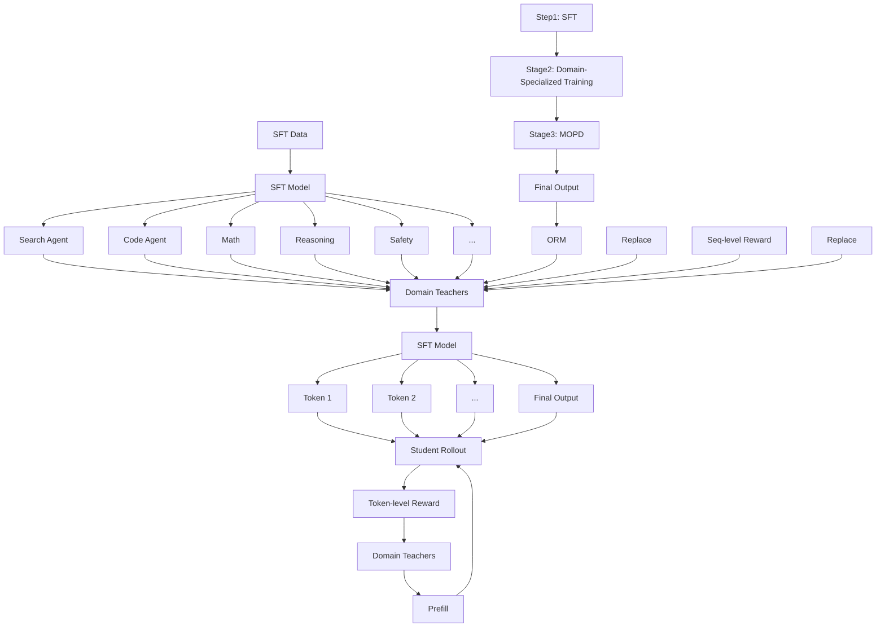

# MiMo-V2-Flash Technical Report

LLM-Core Xiaomi

# Abstract

We present MiMo-V2-Flash, a Mixture-of-Experts (MoE) model with 309B total parameters and 15B active parameters, designed for fast, strong reasoning and agentic capabilities. MiMo-V2- Flash adopts a hybrid attention architecture that interleaves Sliding Window Attention (SWA) with global attention, with a 128-token sliding window under a 5:1 hybrid ratio. The model is pre-trained on 27 trillion tokens with Multi-Token Prediction (MTP), employing a native 32k context length and subsequently extended to 256k. To efficiently scale post-training compute, MiMo-V2-Flash introduces a novel Multi-Teacher On-Policy Distillation (MOPD) paradigm. In this framework, domain-specialized teachers (e.g., trained via large-scale reinforcement learning) provide dense and token-level reward, enabling the student model to perfectly master teacher expertise. MiMo-V2-Flash rivals top-tier open-weight models such as DeepSeek-V3.2 and Kimi-K2, despite using only 1/2 and 1/3 of their total parameters, respectively. During inference, by repurposing MTP as a draft model for speculative decoding, MiMo-V2-Flash achieves up to 3.6 acceptance length and 2.6× decoding speedup with three MTP layers. We open-source both the model weights and the three-layer MTP weights to foster open research and community collaboration.

bar

| Category | MiMo-V2-Flash (%) | DeepSeek-V3.2 (%) | K2-Thinking (%) | Claude Sonnet 4.5 (%) | GPT-5 (High) (%) | Gemini 3.0 Pro (%) |
| :--- | :--- | :--- | :--- | :--- | :--- | :--- |
| SWE-Bench Verified | 73.4 | 73.1 | 71.3 | 77.2 | 74.9 | 76.2 |
| SWE-Bench Multilingual | 71.7 | 70.2 | 61.1 | 68.0 | 55.3 | |
| Tau2-Bench | 80.3 | 80.3 | 74.3 | 84.7 | 80.2 | 85.4 |
| AIME25 | 94.1 | 93.1 | 94.5 | 87.0 | 94.6 | 95.0 |
| GPQA-Diamond | 84.3 | 82.4 | 84.5 | 83.4 | 85.7 | 91.9 |
| HLE (w/o Tool) | 22.1 | 25.1 | 23.9 | 13.7 | 26.3 | 37.5 |
| Arena-Hard (Creative Writing) | 86.2 | 88.8 | 80.1 | 76.7 | 92.2 | 93.6 |
General capability

Figure 1 Benchmark performance of MiMo-V2-Flash.

# Contents

# 1 Introduction 4

# 2 MiMo-V2-Flash Model Architecture 5

2.1 Overall Architecture 5   
2.2 Hybrid Sliding Window Attention Architecture . . 6

2.2.1 Model Architecture Experiments 7   
2.2.2 Summary and Discussion 8

2.3 Lightweight Multi-Token Prediction (MTP) . . 9

2.3.1 Motivation of using MTP . . . 9   
2.3.2 Lightweight MTP Design in MiMo-V2-Flash 9

# 3 Pre-Training 9

3.1 Data Scheduler 10   
3.2 Hyper-Parameters . 10   
3.3 Evaluations 11

3.3.1 Evaluation Setup 11   
3.3.2 Evaluation Results 11

# 4 Post-Training 11

4.1 Multi-Teacher On-Policy Distillation (MOPD): A New Post-Training Paradigm . . . 11   
4.2 Supervised Fine-Tuning (SFT) . . 14   
4.3 Scaling Reinforcement Learning (RL) . . . 15

4.3.1 Non-Agentic RL Training . . 15   
4.3.2 Agentic RL Training 15

4.4 Technical Formulation of MOPD 18   
4.5 Evaluations 18

4.5.1 Evaluation Setup 18   
4.5.2 Evaluation Results 19

4.6 RL Infrastructures . 19

4.6.1 Stablized Training via Rollout Routing Replay (R3) . . 19   
4.6.2 Data Scheduler . 20   
4.6.3 Toolbox and Tool Manager . . 21

# 5 MTP Speedup 21

5.1 MTP Acceptance Length . . 21

5.2 MTP Inference Speedup . . 21

6 Conclusion, Limitation, and Future Work 22

A Contributions and Acknowledgments 29

B Reward Hacking of SWE-Bench 31

C Context Management 31

# 1 Introduction

Recent progress towards Artificial General Intelligence (AGI) is increasingly propelled by two frontiers: advanced reasoning chains and autonomous agentic workflows (Google DeepMind, 2025; Kimi Team, 2025b; Liu et al., 2025), grounded in large-scale Reinforcement Learning (RL). Yet building scalable reasoners and agents hits a common critical bottleneck, where long-context modeling must be simultaneously fast and strong.

In this work, we introduce MiMo-V2-Flash, an efficient and cost-effective Large Language Model (LLM) that delivers strong reasoning and agentic performance. MiMo-V2-Flash is a 309B-parameter MoE with 15B activated per token. To alleviate the quadratic complexity of full attention, MiMo-V2-Flash adopts a hybrid attention mechanism that interleaves local sliding window and global attention. The sliding window size is 128-token and the hybrid local:global ratio is 5:1, yielding nearly a 6× reduction in KV-cache storage and attention computation for long contexts. With the help of learnable attention sink bias (Agarwal et al., 2025), the hybrid architecture maintains strong modeling capability even in long-context scenarios, despite the aggressive sliding window size and hybrid ratio. MiMo-V2-Flash also incorporates Multi-Token Prediction (MTP) to enhance training performance and accelerate inference decoding. In particular, MTP has strong potential to boost RL rollout speed, which helps to scale LLMs towards greater intelligence. With a lightweight dense Feed-Forward Network (FFN) and sliding window attention, our MTP block delivers substantial decoding speedups in practice at high acceptance rates.

The pre-training recipe of MiMo-V2-Flash largely follows that of MiMo-7B (Xia et al., 2025), with several enhancements. Training is conducted using FP8 mixed-precision, enabling efficient large scale training over 27T tokens. The model is initially pre-trained with a native 32K context and later extended to 256K. The resulting pretrained model, MiMo-V2-Flash-Base, has been evaluated against leading open-source base models such as Kimi-K2-Base (Kimi Team, 2025c) and DeepSeek V3.2-Exp-Base (Liu et al., 2025). MiMo-V2-Flash-Base achieves competitive performance across general benchmarks and surpasses peer models on reasoning-focused tasks. For long-context retrieval, our hybrid attention architecture achieves nearly 100% success rates across context lengths from 32K to 256K. On the extreme long-context reasoning benchmark GSM-Infinite (Zhou et al., 2025), MiMo-V2-Flash demonstrates robust performance with minimal degradation when scaling from 16K to 128K.

In post-training, we focus on efficiently scaling RL compute to improve reasoning and agentic capabilities. To this end, MiMo-V2-Flash introduces a novel post-training paradigm termed Multi-Teacher On-Policy Distillation (MOPD). This framework addresses both learning inefficiency and capability imbalance through a three-stage process: (1) general Supervised Fine-Tuning (SFT); (2) specialized RL/SFT to train domain-specific teacher models; (3) MOPD, wherein the student model learns from two complementary signals: dense, token-level rewards from specialized teachers trained across diverse domains, and a verifiable, outcome-based reward. By integrating diverse expert knowledge in this manner, MiMo-V2-Flash simultaneously masters the peak capabilities of domain teachers while benefiting from stable and efficient learning dynamics.

MiMo-V2-Flash achieves performance comparable to that of Kimi-K2-Thinking and DeepSeek V3.2-Thinking on most reasoning benchmarks. In long-context evaluations such as LongBench V2 and MRCR, MiMo-V2-Flash consistently surpasses larger full-attention models, confirming the robustness of its hybrid SWA architecture. Notably, the model attains 73.4% on SWE-Bench Verified and 71.7% on SWE-Bench Multilingual, establishing it as the leading open-source model for software engineering tasks. The model weights (with 3-layer MTP weights) are available at https://github.com/XiaomiMiMo/MiMo-V2-Flash.

```mermaid
graph TD
    subgraph Mx
        A["Global Attention"] --> B["Sparse MoE"]
        B --> C["RMSNorm"]
        C --> D["GA block"]
        D --> E["Embedding"]
        E --> F["x_{t-1}"]
    end
    subgraph Nx
        G["Sliding Window Attention"] --> H["Sparse MoE"]
        H --> I["RMSNorm"]
        I --> J["SWA block"]
        J --> K["Embedding"]
        K --> L["x_{t-1}"]
    end
    subgraph Kx
        M["Linear"] --> N["RMSNorm"]
        N --> O["Embedding (tied)"]
        O --> P["x_{t+1}"]
        O --> Q["x_{t+2}"]
        P --> R["x_{t+1}"]
        P --> S["x_{t+2}"]
        R --> T["LM Head (tied)"]
        S --> U["LM Head"]
        T --> V["ML Head (tied)"]
        U --> W["ML Head (tied)"]
        V --> X["ML Head (tied)"]
        W --> Y["ML Head (tied)"]
    end
    style Mx fill:#f9f,stroke:#333
    style N fill:#f9f,stroke:#333
    style O fill:#f9f,stroke:#333
    style V fill:#f9f,stroke:#333
    style X fill:#f9f,stroke:#333
    style Y fill:#f9f,stroke:#333
```

flowchart

Figure 2 An illustration of MiMo-V2-Flash model architecture. The model comprises ?? = 8 Hybrid Blocks, where each Hybrid Block interleaves ?? = 5 Sliding Window Attention (SWA) blocks with one Global Attention (GA) block. Both are equipped with a sparse MoE FFN. The only exception is the first block, which uses GA with a dense FFN. The MTP blocks employ SWA and a dense FFN.

# 2 MiMo-V2-Flash Model Architecture

# 2.1 Overall Architecture

As illustrated in Figure 2, MiMo-V2-Flash follows a standard Transformer (Vaswani et al., 2017) backbone augmented with MoE (Shazeer et al., 2017) and hybrid attention (Brown et al., 2020; Gemma Team, 2024, 2025; Kimi Team, 2025a; Li et al., 2025; Qwen Team, 2025). MiMo-V2-Flash is mainly composed of repeated hybrid blocks that interleave Local Sliding Window Attention (SWA) and Global Attention (GA). It stacks ?? = 8 hybrid blocks, each structured with ?? = 5 consecutive SWA blocks followed by an GA block. The only exception is the very first Transformer block, which uses global attention with a dense Feed-Forward Network (FFN) to stabilize early representation learning. The sliding window size ?? used in MiMo-V2-Flash is 128. Both the SWA block and the GA block utilize the sparse MoE FFN. Each MoE layer comprises 256 experts in total, with 8 activated per token, and contains no shared experts.

MiMo-V2-Flash also integrates MTP (Gloeckle et al., 2024; Liu et al., 2024; Xia et al., 2025) to improve model performance (both quality and efficiency). Worth noting, the MTP block uses dense FFN instead of MoE and applies SWA rather than GA, making it lightweight for speculative decoding. The number of parameters for each MTP block is only 0.33B.

Table 1 summarizes detailed configurations of MiMo-V2-Flash. The model consists of 39 SWA layers and 9 GA layers. Both SWA and GA utilize Grouped-Query Attention (GQA) (Ainslie et al.,

<table><tr><td>Block</td><td>Configuration</td><td>Value</td></tr><tr><td rowspan="6">Main Block</td><td>Layers (Total/SWA/GA)</td><td>48/39/9</td></tr><tr><td>SWA Heads (Q/KV)</td><td>64/8</td></tr><tr><td>Sliding Window Size</td><td>128</td></tr><tr><td>GA Heads (Q/KV)</td><td>64/4</td></tr><tr><td>Head Dimensions (QK/V)</td><td>192/128</td></tr><tr><td>Experts (Total/Activated)</td><td>256/8</td></tr><tr><td rowspan="4">MTP Block</td><td>SWA Heads (Q/KV)</td><td>64/8</td></tr><tr><td>Sliding Window Size</td><td>128</td></tr><tr><td>Head Dimensions (QK/V)</td><td>192/128</td></tr><tr><td># Parameters</td><td>0.33B</td></tr></table>

Table 1 Detailed model configuration of MiMo-V2-Flash.

2023). Specifically, SWA has 64 query heads and 8 key-value heads, while GA has 64 query heads and 4 key-value heads. The per-head dimensions are the same for SWA and GA (192 for queries and keys, and 128 for values). Rotary Positional Embedding (RoPE, Su et al. (2024)) is partially applied to the first 64 dimensions query and key. Following recent best practices, we adopt an FP8 mixed-precision framework similar to DeepSeek-V3 (Liu et al., 2024). Specifically, we retain BF16 precision for the attention output projections, as well as for the embedding and output head parameters, while maintaining FP32 precision for the MoE router parameters. This mixed-precision configuration improves numerical stability without materially impacting training efficiency or memory footprint.

# 2.2 Hybrid Sliding Window Attention Architecture

Sliding window attention (Beltagy et al., 2020) restricts each token’s attention scope to a local window rather than the entire sequence, thereby reducing both computational and memory complexity dramatically. This naturally motivates hybrid attention architectures that interleave sliding window attention with global attention. However, prior work has shown that overly aggressive use of SWA, such as very small sliding window sizes or high SWA:GA ratios, can lead to substantial degradation in model performance (Gemma Team, 2025), especially in long-context tasks. Recently, the introduction of learnable attention sink bias, which allows the model to assign little or no attention to tokens when needed, has substantially enhanced the modeling capacity of SWA-based architectures (Agarwal et al., 2025). While the precise theoretical underpinnings of the attention sink mechanism remain an active research area (Gu et al., 2024b; Qiu et al., 2025; Sun et al., 2024; Xiao et al., 2023), we empirically observed that learnable attention sinks bias dramatically enhance the performance of hybrid SWA models, matching or even surpassing baselines with fully GA layers.

In MiMo-V2-Flash, our implementation follows the design used in gpt-oss (Agarwal et al., 2025), where a learnable attention sink bias ???????? ∈ R is applied to the denominator of softmax for each attention head. Specifically, let the attention logits between token ?? and ?? of one single head be:

$$
a _ {i j} = \frac {q _ {i} k _ {j} ^ {\top}}{\sqrt {d}}, \tag {1}
$$

where $q _ { i }$ and $k _ { j }$ denote the query of token ?? and key of token $j ,$ respectively, and ?? is the head dimension. The attention weights are then given by:

$$
s _ {i j} = \frac {\exp \left(a _ {i j} - m _ {i}\right)}{\exp \left(s i n k - m _ {i}\right) + \sum_ {j ^ {\prime}} \exp \left(a _ {i j ^ {\prime}} - m _ {i}\right)}, \tag {2}
$$

$$
m _ {i} = \max \left(\max _ {j} a _ {i j}, \text {   sink   }\right). \tag {3}
$$

Finally, the attention output for query ?? is obtained as a weighted sum over the values:

$$
o _ {i} = \sum_ {j = 1} ^ {n} s _ {i j} v _ {j}. \tag {4}
$$

# 2.2.1 Model Architecture Experiments

To validate the effectiveness of our design choice, we conduct exploratory and empirical studies on a 32B dense model, maintaining the query–key dimensions and rotary embedding configurations consistent with those described above.

<table><tr><td>Model</td><td>MMLU</td><td>BBH</td><td>TriviaQA</td><td>GSM8K</td><td>MATH</td><td>CMMLU</td><td>MBPP</td></tr><tr><td>All GA</td><td>57.3</td><td>54.7</td><td>53.2</td><td>34.2</td><td>9.5</td><td>50.3</td><td>54.7</td></tr><tr><td>Hybrid SWA(W = 128, w/o sink)</td><td>54.9</td><td>52.4</td><td>52.8</td><td>36.9</td><td>8.9</td><td>-</td><td>-</td></tr><tr><td>Hybrid SWA(W = 128, w/ sink)</td><td>58.3</td><td>56.1</td><td>53.7</td><td>36.9</td><td>10.3</td><td>53.3</td><td>56.3</td></tr><tr><td>Hybrid SWA(W = 512, w/ sink)</td><td>58.3</td><td>54.9</td><td>54.9</td><td>37.9</td><td>10.0</td><td>52.3</td><td>53.2</td></tr></table>

Table 2 General benchmark results for different attention configurations.

<table><tr><td>Model</td><td>GSM-Infinite</td><td>NoLiMa</td><td>RULER-32k</td><td>MRCR</td></tr><tr><td>All GA</td><td>12.3</td><td>49.7</td><td>89.4</td><td>32.5</td></tr><tr><td>Hybrid SWA(W = 128, w/ sink)</td><td>17.3</td><td>51.2</td><td>89.4</td><td>34.4</td></tr><tr><td>Hybrid SWA(W = 512, w/ sink)</td><td>17.2</td><td>38.5</td><td>84.7</td><td>19.6</td></tr></table>

Table 3 Long-context benchmark results for different attention configurations.

<table><tr><td>Model</td><td>AIME24/25</td><td>LiveCodebench</td><td>GPQA-Diamond</td><td>Average</td></tr><tr><td>All GA</td><td>45.5</td><td>40.0</td><td>41.7</td><td>42.4</td></tr><tr><td>Hybrid SWA(W = 128, w/ sink)</td><td>47.1</td><td>43.9</td><td>48.1</td><td>46.3</td></tr></table>

Table 4 Complex reasoning benchmark results for different attention configurations.

Baselines and Benchmarks We evaluate four model architecture variants in a comparative setting. These include an all global attention (All GA) baseline, a hybrid SWA model with a 128-token window without attention sinks bias, and two hybrid SWA models augmented with attention sinks bias using window sizes of 128 and 512, respectively. All variants share the same training pipeline: pre-training on 250B tokens with an 8,192 sequence length, long context extension to 32,768 over an additional 40B tokens, followed by long-context SFT and reasoning SFT with chain-of-thought supervision. We evaluate model variants across benchmarks covering general capability, long context understanding, and complex reasoning. General-domain results (Table 2) are obtained from pre-trained base models without long-context extension, evaluating general knowledge and reasoning on MMLU Hendrycks et al. (2021a), BBH (Suzgun et al., 2023), TriviaQA (Joshi et al., 2017), GSM8K (Cobbe et al., 2021), MATH (Hendrycks et al., 2021b), CMMLU (Li et al., 2023), and MBPP (Austin et al., 2021). Long-context results (Table 3) evaluate long-context–extended base models on GSM-Infinite (Zhou et al., 2025), NoLiMa (Modarressi et al., 2025), and RULER-32k (Hsieh et al., 2024), and long-context SFT models on MRCR (Vodrahalli et al., 2024). For GSM-Infinite and Nolima, we construct internal few-shot benchmarks to assess base models under controlled long-context settings. Complex reasoning results (Table 4) evaluate the reasoning SFT models on AIME24&25 (MAA, 2024), LiveCodeBench (Jain et al., 2024), and GPQA-Diamond (Rein et al., 2024).

We highlight our key empirical findings below:

Ablation on Attention Sink Bias As shown in Table 2, hybrid SWA (?? = 128, w/o sink) suffers noticeable performance degradation across general benchmarks, whereas introducing attention sink bias consistently recovers or improves performance relative to the all-GA baseline. Thus, in our further experiments, we assume that the attention sink bias is applied by default.

Sliding Window Attention Size Hybrid SWA (?? = 128) and Hybrid SWA (?? = 512) appear to perform similarly on general benchmarks (Table 2). However, after long-context extension and long-context SFT, hybrid SWA (?? = 128) surpasses the all-GA baseline, whereas SWA (?? = 512) experiences significant degradation (Table 3).

Reasoning Ability As shown in Table 4, hybrid SWA (?? = 128) surpasses the all-GA baseline across different challenging reasoning benchmarks, showing clear improvements on complex reasoning abilities.

# 2.2.2 Summary and Discussion

Our experiments show that hybrid SWA (?? = 128) not only outperforms hybrid SWA (?? = 512) but can also surpass the all-GA baseline, which may seem counterintuitive. We hypothesize that this arises from a combination of better regularization and effective sparsity. Smaller windows force the model to focus on local context, serving as an inductive bias that mitigates overfitting on spurious patterns. Moreover, a tighter window (?? = 128) compels SWA to model local information while delegating long-range dependencies to the global attention layers, resulting in a clearer division of labor with more accurate and efficient learning. In contrast, a larger window (?? = 512) can blur this distinction, causing SWA to partially handle long-range dependencies itself, which dilutes the separation between local and global information and leads to suboptimal performance.

We emphasize that these observations and findings are empirical and derived from our specific experimental settings, including model scale, datasets, and training procedures. Nonetheless, we hope these observations contribute an additional perspective to the ongoing discussion of efficient attention architectures in the era of reasoning and agentic AI models, and motivate further community-wide investigation into efficient architecture.

# 2.3 Lightweight Multi-Token Prediction (MTP)

# 2.3.1 Motivation of using MTP

Prior work demonstrates that MTP is a powerful training objective that enhances training efficiency and model quality (Gloeckle et al., 2024; Liu et al., 2024; Xia et al., 2025). Beyond these training benefits, we place stronger emphasis on exploiting MTP as a native draft model for self-speculative decoding to deliver real-deployment speedup. In the following, we elaborate on how MTP accelerates inference from two perspectives: general LLM decoding speedup and RL training acceleration.

Accelerating LLM Decoding LLM decoding is inherently memory-bound due to low arithmetic intensity. Batch-level parallelism is commonly used to increase FFN arithmetic intensity but does not benefit attention computation, as each request maintains its own KV cache. In contrast, MTP lifts the arithmetic intensity of both FFN and attention by generating multiple draft tokens, which the main model then verifies in parallel. This approach enables token-level parallelism without increasing KV cache I/O.

Accelerating RL Training MTP acceleration is particularly well-suited for RL training (RadixArk Team, 2025), where the rollout phase consistently emerges as the dominant bottleneck due to the inference and decoding costs. MTP addresses two key challenges in RL training:

• It enables efficient and effective RL with small batches. Current RL training relies on largebatch, off-policy algorithms to maximize throughput (Liu et al., 2025; Schulman et al., 2017; Zheng et al., 2025). However, on-policy training is generally more stable and effective, yet its small batches underutilize GPU resources. MTP mitigates this limitation by scaling token-level parallelism instead of batch size, making small-batch, on-policy RL training more practical.   
• It mitigates GPU idleness from long-tail stragglers. As the rollout phase progresses, long-tail stragglers that process long sequences with small batch sizes (often approaching 1) can cause significant GPU idleness (Gao et al., 2025; Zhong et al., 2025). In such scenarios, MTP enhances the computational efficiency of both attention and FFN, substantially reducing overall latency.

# 2.3.2 Lightweight MTP Design in MiMo-V2-Flash

In MiMo-V2-Flash, the MTP block is deliberately kept lightweight to prevent it from becoming a new inference bottleneck. We use a small dense FFN rather than MoE to limit parameter count, and employ SWA instead of Global Attention (GA) to reduce KV cache and attention computation costs. During pre-training, only a single MTP head is attached to the model to avoid extra training overhead. In post-training, this head is replicated ?? times to form a ??-step MTP module, and all heads are jointly trained for multi-step prediction. Each head receives the main-model hidden state and token embedding as input, providing richer predictive information. Despite its lightweight design, the MTP module remains highly effective and achieves a high acceptance rate. Detailed results are presented in Section 5.

# 3 Pre-Training

The MiMo-V2-Flash pre-training corpus consists of 27 trillion tokens drawn from a diverse collection of high-quality sources, including public web content, books, academic papers, code, mathematics, and broader STEM materials. Our data processing pipeline largely follows that of MiMo-7B (Xia et al., 2025), with a deliberate shift toward data exhibiting long-range dependencies. In particular, we emphasize long-form web documents and carefully curated code corpora such as repositorylevel code, pull requests, issues, and commit histories to strengthen the model’s ability to capture extended contextual relationships and perform complex, multi-step reasoning.

# 3.1 Data Scheduler

The pre-training of MiMo-V2-Flash is organized into three sequential stages:

• Stage 1 (Pre-training, 0 – 22T). The model is trained on a diverse, high-quality general purpose corpus using a context length of 32K tokens to establish strong foundational language capabilities.   
• Stage 2 (Mid-training, 22 – 26T). We modify the data mixture by upsampling code-centric data and incorporating approximately 5% synthetic reasoning data to further enhance logical reasoning and program synthesis abilities.   
• Stage 3 (Context Extension, 26 – 27T). Following the Stage 2 data distribution, we extend the model’s context window to 256K tokens and upsample data with long-range dependencies, enabling more effective modeling of extended contexts and long-horizon reasoning.

# 3.2 Hyper-Parameters

Model Hyper-Parameters We configure MiMo-V2-Flash with 48 Transformer layers, comprising 39 sliding window attention layers and 9 global attention layers. The hidden dimension is set to 4096. All layers except the first are equipped with sparse MoE. Each MoE layer contains 256 routed experts, with 8 experts activated per token, and an intermediate hidden dimension of 2048 for each expert. The intermediate hidden dimension of the FFN of dense layers is set to 16384. All learnable parameters are randomly initialized with a standard deviation of 0.006. The model uses a single MTP layer during pre-training. Overall, MiMo-V2-Flash has 309B total parameters, of which 15B are active.

Training Hyper-Parameters We employ the AdamW optimizer with $\beta _ { 1 } = 0 . 9 , \beta _ { 2 } = 0 . 9 5$ , and a weight decay of 0.1. Gradient clipping is applied with a maximum norm of 1.0. The learning rate schedule operates in two stages. In Stage 1, the learning rate starts with a linear warm-up from 0 to $3 . 2 \times 1 0 ^ { - 4 }$ over the first 50B tokens, followed by a constant phase at $3 . 2 \times 1 0 ^ { - 4 }$ for 12T tokens, and concludes with a cosine decay to $1 . 0 \times 1 0 ^ { - 4 }$ over 10T tokens. Stage 2 begins at $1 . 0 \times 1 0 ^ { - 4 }$ and follows a cosine decay down to $3 . 0 \times 1 0 ^ { - 5 }$ over 4T tokens. The batch size warms up linearly to 2,048 over the initial 500B tokens and remains constant for the remainder of both stages. Regarding auxiliary losses, the MoE sequence auxiliary loss coefficient is set to $1 . 0 \times 1 0 ^ { - 5 }$ for all stages. The expert bias update factor is set to 0.001 during Stage 1 and Stage 2. The MTP loss weight is set to 0.3 for Stage 1 and 0.1 for Stage 2 and 3.

Long Context Extension In Stage 1, we set the pre-training sequence length to 32,768 with a RoPE base frequency of 640,000 for GA and 10,000 for SWA. In Stage 3, the sequence length is extended to 262,144, and the RoPE base frequency of GA is adjusted to 5,000,000. The learning rate in Stage 3 decays from $3 . 0 \times 1 0 ^ { - 5 } \mathrm { ~ t o ~ } 1 . 0 \times 1 0 ^ { - 5 }$ following a cosine schedule, with a fixed batch size of 256. The expert bias update factor is reduced to $1 . 0 \times 1 0 ^ { - 5 }$ in Stage 3.

# 3.3 Evaluations

# 3.3.1 Evaluation Setup

We evaluate MiMo-V2-Flash-Base on a series of benchmarks, encompassing various capabilities: (1) General language understanding and reasoning, including BBH (Suzgun et al., 2023), MMLU (Hendrycks et al., 2021a), MMLU-Redux (Gema et al., 2024), MMLU-Pro (Wang et al., 2024), DROP (Dua et al., 2019), ARC (Clark et al., 2018), HellaSwag (Zellers et al., 2019), WinoGrande (Sakaguchi et al., 2020), TriviaQA (Joshi et al., 2017), GPQA-Diamond (Rein et al., 2024), SuperGPQA (Du et al., 2025), and SimpleQA (OpenAI, 2024). (2) Mathematics reasoning. GSM8K (Cobbe et al., 2021), MATH (Hendrycks et al., 2021b), and AIME (MAA, 2024) (2024 & 2025). (3) Coding. HumanEval+ (Liu et al., 2023), MBPP+ (Liu et al., 2023), CRUXEval (Gu et al., 2024a), MultiPL-E (Cassano et al., 2022), BigCodeBench (Zhuo et al., 2024), LiveCodeBenchv6 (Jain et al., 2024), and SWE-Bench (Jimenez et al., 2024a) (few-shot Agentless Repair (Xia et al., 2024)). (4) Chinese understanding. C-Eval (Huang et al., 2023), CMMLU (Li et al., 2023), and C-SimpleQA (He et al., 2025). (5) Multilingual understanding. GlobalMMLU (Singh et al., 2025), and INCLUDE (Romanou et al., 2024). (6) Long context. NIAH-Multi (Hsieh et al., 2024), GSM-Infinite (Zhou et al., 2025) (5-shot, Hard Ops-{2,4,6,8,10}).

# 3.3.2 Evaluation Results

Table 5 presents a comprehensive comparison of MiMo-V2-Flash-Base against leading open-source base models (Kimi Team, 2025c; Liu et al., 2024). MiMo-V2-Flash-Base delivers competitive performance across most benchmarks and consistently outperforms peers on reasoning tasks (MMLU-Pro, GPQA-Diamond, AIME). On SWE-Bench, it even surpasses the substantially larger Kimi-K2-Base while using less than one-third the parameters, underscoring the strength of our approach for realistic code-agent tasks. However, constrained by its limited parameter count, we observe MiMo-V2-Flash exhibits lower knowledge capacity compared to larger models, as reflected in SimpleQA.

We illustrate the long context capabilities of each model in Table 6. For long-context retrieval, our model architecture achieves a near 100% success rate from 32K to 256K. On the extreme stress long context reasoning benchmark GSM-Infinite, MiMo-V2-Flash also shows strong performance, with minimal performance degradation from 16K to 128K. In contrast, DeepSeek-V3.2-Exp, a sparse attention LLM, attains the highest score under 32K but degrades substantially at 64K and 128K, suggesting an intrinsic disadvantage in long-context reasoning with noisy inputs. These results strongly demonstrate the effectiveness and scalability of our hybrid SWA architecture, vanilla 32K pretraining, and context extension training.

# 4 Post-Training

# 4.1 Multi-Teacher On-Policy Distillation (MOPD): A New Post-Training Paradigm

Modern language models increasingly rely on extensive post-training to enhance their intelligence and capabilities. However, current post-training pipelines face fundamental challenges: capa bility imbalance, where improving one skill causes regressions in others (the “see-saw” effect), and learning inefficiency, where existing approaches fail to fully leverage training signals when combining knowledge from multiple specialized models.

We propose Multi-Teacher On-Policy Distillation (MOPD), a unified post-training paradigm that addresses these challenges through a three-stage framework, as illustrated in Figure 3:

<table><tr><td>Benchmark</td><td># Shots</td><td>MiMo-V2-Flash Base</td><td>Kimi-K2 Base</td><td>DeepSeek-V3.1 Base</td><td>DeepSeek-V3.2 Exp Base</td></tr><tr><td>#Activated Params</td><td>-</td><td>15B</td><td>32B</td><td>37B</td><td>37B</td></tr><tr><td>#Total Params</td><td>-</td><td>309B</td><td>1043B</td><td>671B</td><td>671B</td></tr><tr><td colspan="6">General</td></tr><tr><td>BBH</td><td>3-shot</td><td>88.5</td><td>88.7</td><td>88.2</td><td>88.7</td></tr><tr><td>MMLU</td><td>5-shot</td><td>86.7</td><td>87.8</td><td>87.4</td><td>87.8</td></tr><tr><td>MMLU-Redux</td><td>5-shot</td><td>90.6</td><td>90.2</td><td>90.0</td><td>90.4</td></tr><tr><td>MMLU-Pro</td><td>5-shot</td><td>73.2</td><td>69.2</td><td>58.8</td><td>62.1</td></tr><tr><td>DROP</td><td>3-shot</td><td>84.7</td><td>83.6</td><td>86.3</td><td>86.6</td></tr><tr><td>ARC-Challenge</td><td>25-shot</td><td>95.9</td><td>96.2</td><td>95.6</td><td>95.5</td></tr><tr><td>HellaSwag</td><td>10-shot</td><td>88.5</td><td>94.6</td><td>89.2</td><td>89.4</td></tr><tr><td>WinoGrande</td><td>5-shot</td><td>83.8</td><td>85.3</td><td>85.9</td><td>85.6</td></tr><tr><td>TriviaQA</td><td>5-shot</td><td>80.3</td><td>85.1</td><td>83.5</td><td>83.9</td></tr><tr><td>GPQA-Diamond</td><td>5-shot</td><td>55.1</td><td>48.1</td><td>51.0</td><td>52.0</td></tr><tr><td>SuperGPQA</td><td>5-shot</td><td>41.1</td><td>44.7</td><td>42.3</td><td>43.6</td></tr><tr><td>SimpleQA</td><td>5-shot</td><td>20.6</td><td>35.3</td><td>26.3</td><td>27.0</td></tr><tr><td colspan="6">Mathematics</td></tr><tr><td>GSM8K</td><td>8-shot</td><td>92.3</td><td>92.1</td><td>91.4</td><td>91.1</td></tr><tr><td>MATH</td><td>4-shot</td><td>71.0</td><td>70.2</td><td>62.6</td><td>62.5</td></tr><tr><td>AIME 24&amp;25</td><td>2-shot</td><td>35.3</td><td>31.6</td><td>21.6</td><td>24.8</td></tr><tr><td colspan="6">Code</td></tr><tr><td>HumanEval+</td><td>1-shot</td><td>70.7</td><td>84.8</td><td>64.6</td><td>67.7</td></tr><tr><td>MBPP+</td><td>3-shot</td><td>71.4</td><td>73.8</td><td>72.2</td><td>69.8</td></tr><tr><td>CRUXEval-I</td><td>1-shot</td><td>67.5</td><td>74.0</td><td>62.1</td><td>63.9</td></tr><tr><td>CRUXEval-O</td><td>1-shot</td><td>79.1</td><td>83.5</td><td>76.4</td><td>74.9</td></tr><tr><td>MultiPL-E HumanEval</td><td>0-shot</td><td>59.5</td><td>60.5</td><td>45.9</td><td>45.7</td></tr><tr><td>MultiPL-E MBPP</td><td>0-shot</td><td>56.7</td><td>58.8</td><td>52.5</td><td>50.6</td></tr><tr><td>BigCodeBench</td><td>0-shot</td><td>70.1</td><td>61.7</td><td>63.0</td><td>62.9</td></tr><tr><td>LiveCodeBench v6</td><td>1-shot</td><td>30.8</td><td>26.3</td><td>24.8</td><td>24.9</td></tr><tr><td>SWE-Bench (AgentLess Repair)</td><td>3-shot</td><td>30.8</td><td>28.2</td><td>24.8</td><td>9.4*</td></tr><tr><td colspan="6">Chinese</td></tr><tr><td>C-Eval</td><td>5-shot</td><td>87.9</td><td>92.5</td><td>90.0</td><td>91.0</td></tr><tr><td>CMMLU</td><td>5-shot</td><td>87.4</td><td>90.9</td><td>88.8</td><td>88.9</td></tr><tr><td>C-SimpleQA</td><td>5-shot</td><td>61.5</td><td>77.6</td><td>70.9</td><td>68.0</td></tr><tr><td colspan="6">Multilingual</td></tr><tr><td>GlobalMMLU</td><td>5-shot</td><td>76.6</td><td>80.7</td><td>81.9</td><td>82.0</td></tr><tr><td>INCLUDE</td><td>5-shot</td><td>71.4</td><td>75.3</td><td>77.2</td><td>77.2</td></tr><tr><td>Benchmark</td><td>Length</td><td>MiMo-V2-Flash Base</td><td>Kimi-K2 Base</td><td>DeepSeek-V3.1 Base</td><td>DeepSeek-V3.2 Exp Base</td></tr><tr><td>#Activated Params</td><td>-</td><td>15B</td><td>32B</td><td>37B</td><td>37B</td></tr><tr><td>#Total Params</td><td>-</td><td>309B</td><td>1043B</td><td>671B</td><td>671B</td></tr><tr><td rowspan="4">NIAH-Multi</td><td>32K</td><td>99.3</td><td>99.8</td><td>99.7</td><td>85.6*</td></tr><tr><td>64K</td><td>99.9</td><td>100.0</td><td>98.6</td><td>85.9*</td></tr><tr><td>128K</td><td>98.6</td><td>99.5</td><td>97.2</td><td>94.3*</td></tr><tr><td>256K</td><td>96.7</td><td>-</td><td>-</td><td>-</td></tr><tr><td rowspan="4">GSM-Infinite Hard</td><td>16K</td><td>37.7</td><td>34.6</td><td>41.5</td><td>50.4</td></tr><tr><td>32K</td><td>33.7</td><td>26.1</td><td>38.8</td><td>45.2</td></tr><tr><td>64K</td><td>31.5</td><td>16.0</td><td>34.7</td><td>32.6</td></tr><tr><td>128K</td><td>29.0</td><td>8.8</td><td>28.7</td><td>25.7</td></tr></table>

Table 5 Comparison among MiMo-V2-Flash and other open-source base models. An asterisk (\*) denotes that the model does not follow the format of few-shot examples.

Table 6 Long context performance of MiMo-V2-Flash and other open-source base models. An asterisk (\*) indicates the model may fail to follow the prompt. All baseline models have maximum model lengths shorter than 256K.

flowchart

Figure 3 Overview of MiMo-V2-Flash post-training stages.

Stage 1: Supervised Fine-Tuning (SFT) We establish foundational instruction-following capabilities through supervised learning on high-quality instruction-response pairs, enabling the model to understand and execute user requests across diverse domains.

Stage 2: Domain-Specialized Training We train a suite of domain-specialized teacher models through independent RL optimization on focused tasks including agentic capabilities (search, coding, general tool use) and non-agentic tasks (mathematical reasoning, general reasoning, safety alignment). Each teacher achieves superior performance in its respective domain through targeted optimization with domain-specific reward signals.

Stage 3: Multi-Teacher On-Policy Distillation Rather than merging model parameters or generating static offline datasets from experts, we formulate multi-teacher knowledge integration as an on-policy reinforcement learning process. The student model samples from its own evolving distribution and receives token-level supervision from domain-specific teachers through KL divergence rewards (Agarwal et al., 2023; Gu et al., 2024c; Lu and Lab, 2025), effectively combining specialized capabilities without the traditional trade-offs (Table 7).

<table><tr><td>Benchmark</td><td>Student Before MOPD</td><td>Best Teacher</td><td>Student After MOPD</td><td>Δ(Student-Teacher)</td></tr><tr><td>AIME 2025</td><td>89.3</td><td>93.9 (RL)</td><td>94.1</td><td>+0.2</td></tr><tr><td>HMMT Feb. 2025</td><td>76.9</td><td>82.6 (RL)</td><td>84.4</td><td>+1.8</td></tr><tr><td>LiveCodeBench</td><td>77.5</td><td>82.6 (RL)</td><td>83.2</td><td>+0.6</td></tr><tr><td>MMLU-Pro</td><td>84.7</td><td>84.7 (Self)</td><td>84.9</td><td>+0.2</td></tr><tr><td>GPQA-Diamond</td><td>84.9</td><td>84.9 (Self)</td><td>84.3</td><td>-0.6</td></tr><tr><td>HLE (w/o Tool)</td><td>21.2</td><td>21.2 (Self)</td><td>22.1</td><td>+0.9</td></tr><tr><td>Arena-Hard (Hard Prompt)</td><td>50.0</td><td>50.0 (Self)</td><td>54.1</td><td>+4.1</td></tr><tr><td>Arena-Hard (Creative Writing)</td><td>90.1</td><td>90.1 (Self)</td><td>86.2</td><td>-3.9</td></tr><tr><td>SWE-Bench Verified</td><td>67.8</td><td>74.2 (RL)</td><td>73.4</td><td>-0.8</td></tr><tr><td>Tau2-Bench</td><td>75.9</td><td>79.6 (RL)</td><td>80.3</td><td>+0.7</td></tr><tr><td>Tau2-Bench (Telecom)</td><td>92.7</td><td>95.0 (RL)</td><td>95.3</td><td>+0.3</td></tr><tr><td>BrowseComp</td><td>42.5</td><td>51.7 (SFT)</td><td>45.4</td><td>-6.3</td></tr></table>

Table 7 Benchmark results of MOPD. The model types of best teachers are tagged, including RL, SFT, and the student model itself.

This unified framework offers several critical advantages over traditional post-training approaches:

• Effective and Efficient. Unlike parameter merging or sequential training, which often trade off capabilities, MOPD preserves peak performance of the strongest teacher across all domains. Furthermore, on-policy distillation using dense, token-level rewards from teacher logits ensures stable credit assignment and rapid convergence. By learning from its own distribution, the student avoids the exposure bias and distribution mismatch common in off-policy methods trained on static datasets.   
• Modular and Scalable. The choice of teacher model is highly flexible: it can be a specialized RL-derived model with strong capabilities, a different SFT model, or even the student model itself. The decoupled design enables easy integration of new teachers without restructuring the entire pipeline. Moreover, the framework works seamlessly with existing outcome reward models (ORMs) and is especially advantageous for complex agentic tasks, where setting up independent training pipelines would otherwise be cumbersome.   
• Iterative Co-Evolution. MOPD naturally supports a teacher-student co-evolution cycle. Distilled student models can re-enter the specialized RL stage to produce stronger teachers, which in turn provide higher-quality supervision for the next generation of students, forming a self-reinforcing improvement cycle that enables sustained capability scaling.

In the following subsections, we detail each stage of the MOPD paradigm, beginning with supervised fine-tuning (§4.2), followed by specialized RL for both agentic and non-agentic tasks (§4.3), and conclude with the technical formulation of the multi-teacher distillation mechanism (§4.4).

# 4.2 Supervised Fine-Tuning (SFT)

The SFT stage serves as the foundation of our post-training pipeline, transforming the base model into a helpful assistant capable of following instructions and responding effectively across diverse tasks. This stage is crucial for activating the model’s latent capabilities acquired during pre-training and aligning its outputs with desired formats and styles.

To achieve this, we curated millions of training samples spanning diverse domains, including general conversation, reasoning, coding, and agent tasks. These samples cover both thinking and non-thinking modes, with responses generated by our in-house domain-specialized model checkpoints. This diverse training mixture ensures comprehensive capability activation across the model’s intended use cases.

Through preliminary experiments, we identified a critical stability metric for MoE SFT training: the number of parameters with zero gradients (num-zeros). This metric provides early warning signals for training instability: an increasing num-zeros indicates deteriorating load balance among experts, while a decreasing num-zeros suggests the model is significantly overfitting to the training data. Maintaining stable num-zeros throughout training is therefore essential for successful SFT. Furthermore, this stability is paramount for ensuring the robustness and convergence of the subsequent RL phase.

Our experiments reveal that num-zeros stability critically depends on two hyperparameters: the expert bias update rate and the ?? parameter in the AdamW optimizer. Based on these findings, we configure our training with the following hyperparameters. We employ a cosine decay learning rate scheduler from $5 . 0 \times 1 0 ^ { - 5 } \mathrm { ~ t o ~ } 5 . 0 \times 1 0 ^ { - 6 }$ , with a batch size of 128 and AdamW ?? set to $1 . 0 \times 1 0 ^ { - 8 }$ . The MoE expert bias update rate is set to $1 . 0 \times 1 0 ^ { - 4 }$ , and the sequence auxiliary loss coefficient to 1.0 × 10−6. $1 . 0 \times 1 0 ^ { - 6 }$

# 4.3 Scaling Reinforcement Learning (RL)

Reinforcement learning pushes model capabilities beyond what supervised fine-tuning alone can achieve. We employ different RL strategies depending on whether tasks involve agentic behavior, scaling both non-agentic and agentic RL training to maximize performance across diverse domains.

# 4.3.1 Non-Agentic RL Training

Non-agentic RL training focuses on improving the model’s performance on single-turn tasks, where the model generates a complete response without requiring interactive feedback or multi-step execution. The primary objective is to enhance the model’s reasoning accuracy in verifiable domains (e.g., mathematics, coding, logic) while simultaneously aligning its outputs for helpfulness and safety in open-ended conversations.

Our approach to generating reward signals varies based on task characteristics. For domains with verifiable outcomes, we employ a hybrid verification system combining programmatic tools with an LLM judge to automatically assess correctness against curated problem-solution pairs. For subjective qualities such as helpfulness and safety, we implement a rubric-based framework where an advanced LLM judge evaluates responses against detailed rubrics and reference answers, producing granular reward signals that guide the model toward desired behaviors.

# 4.3.2 Agentic RL Training

While non-agentic RL focuses on single-turn reasoning and generation, agentic RL trains the model to operate in interactive, multi-turn environments requiring planning, action execution, and adaptation based on feedback. We scale agentic RL along two critical dimensions: environment diversity and compute resources.

Scaling Agentic Environment Diversity We construct a diverse suite of agentic training environ ments spanning code debugging, terminal operations, web development, and general tool use (Table 8). Each environment targets distinct capabilities while sharing the common requirement of multi-step reasoning and execution. Below, we elaborate on the details for agentic environments.

<table><tr><td>Agent Type</td><td>Number of Tasks</td><td>Environment</td><td>Prompt Source</td></tr><tr><td>Code Agent</td><td>90K</td><td>Real</td><td>Real</td></tr><tr><td>Code Agent</td><td>30K</td><td>Real</td><td>Synthesized</td></tr><tr><td>Search Agent</td><td>150K</td><td>Real</td><td>Synthesized</td></tr><tr><td>General Agent</td><td>50K</td><td>Synthesized</td><td>Synthesized</td></tr></table>

Table 8 A summary of our training data composition across different agent types. We leverage both real-world and synthetically generated data to create a diverse set of tasks for training agents in various environments.

Code Agent We train on large-scale code agentic tasks derived from real-world GitHub issues, where the model operates in an agentic loop to read and edit files, execute commands, and receive rewards based on verifiable unit tests. Our key insight is that continuously scaling available tasks drives sustained improvements in code intelligence. To enable efficient RL training on over 100,000 code tasks, we develop two infrastructure components. First, we build an automated environment setup pipeline that provisions development environments from repository snapshots and packages them into containerized images, achieving 70% success rate across 8 programming languages and supported by a large-scale Kubernetes cluster running over 10,000 concurrent pods. Second, we implement a lightweight agent scaffold that integrates seamlessly with Kubernetes, Docker, or local backends, exposing three atomic tools (bash, str\_replace, finish) that interact with execution backends solely via shell commands. This design eliminates server-based tool implementations and employs a minimal system prompt without predefined workflows, allowing the model to discover best practices during training.

Terminal Agent Beyond GitHub issues, we strengthen terminal-based problem-solving capabilities using tasks sourced from Stack Overflow and Stack Exchange. We select materials requiring advanced technical expertise and transform them into computational tasks with corresponding queries, Dockerfiles, and test cases. After verifying environment installation and filtering by difficulty and reliability, we obtain approximately 30,000 queries with validated execution environments. Additional filtering based on pass rates removes tasks with unreliable correctness judgments or insufficient complexity for effective RL training.

Web Development Agent To improve web development code generation, we build a real-world grounded synthetic dataset paired with a multimodal verifier. We collect high-quality user-written web pages, execute generated code using Playwright to obtain rendered videos, and apply a multimodal visual discriminator to retain only high-quality samples, where video-based evaluation reduces visual hallucination compared to static screenshots. We reverse-engineer user queries from curated pages as seed prompts to synthesize large-scale RL data covering eight web categories that closely match real-world usage. Our vision-based verifier scores rollout executions from recorded videos, jointly evaluating visual quality, functional correctness, and executability to ensure rewards reflect both appearance and behavior.

General Agent We develop two general agentic capabilities. Our search agent adopts a scaffold providing three core tools (search, open, find) for autonomous web exploration. We construct queries through recursive fact-graph expansion from seed entities, where difficulty scales with relation chain depth and detail obfuscation, enabling automated generation of challenging search problems with verifiable answers. Our function-calling agent trains on synthetic application environments with custom toolsets constructed by generating tool-call graphs based on explicit data dependencies (direct input-output relationships) and implicit logical dependencies (reasoning about hidden system states), requiring both data propagation and state inference capabilities.

line

| # Environments Trained | Resolved (%) |
| ---------------------- | ------------ |
| 0                      | 66.0         |
| 10k                    | 63.0         |
| 20k                    | 70.0         |
| 30k                    | 68.0         |
| 40k                    | 70.0         |
| 50k                    | 68.0         |
| 60k                    | 71.0         |
| 70k                    | 70.0         |
| 80k                    | 73.0         |
| 90k                    | 72.0         |
| 100k                   | 73.0         |
| 110k                   | 72.0         |
| 120k                   | 74.0         |

line

| # Environments Trained | Resolved (%) |
| ---------------------- | ------------ |
| 0                      | 56           |
| 10k                    | 52           |
| 20k                    | 60           |
| 30k                    | 58           |
| 40k                    | 62           |
| 50k                    | 64           |
| 60k                    | 68           |
| 70k                    | 66           |
| 80k                    | 67           |
| 90k                    | 73           |
| 100k                   | 70           |
| 110k                   | 74           |
| 120k                   | 71           |

Figure 4 Code-agentic RL scaling curves. The X-axis represents total interactive environments consumed during on-policy RL rollouts; the Y-axis shows resolved rates on SWE-Bench-Verified and SWE-Bench-Multilingual.

line

| # Environments Trained | Accuracy (%) |
| ---------------------- | ------------ |
| 0k                     | 71.0         |
| 20k                    | 72.5         |
| 40k                    | 72.0         |
| 60k                    | 76.0         |
| 80k                    | 74.0         |
| 100k                   | 75.5         |

line

| # Environments Trained | Accuracy (%) |
| ---------------------- | ------------ |
| 10k                    | 80.8         |
| 20k                    | 82.1         |
| 30k                    | 81.8         |
| 40k                    | 81.9         |
| 50k                    | 81.8         |
| 60k                    | 81.6         |
| 70k                    | 82.9         |
| 80k                    | 82.9         |
| 90k                    | 82.9         |
| 100k                   | 83.5         |
| 110k                   | 83.3         |
| 120k                   | 82.6         |

line

| # Environments Trained | Accuracy (%) |
| ---------------------- | ------------ |
| 20k                    | 75.0         |
| 40k                    | 77.0         |
| 60k                    | 76.0         |
| 80k                    | 76.5         |
| 100k                   | 77.0         |

line

| # Environments Trained | Accuracy (%) |
| ---------------------- | ------------ |
| 0k                     | 72.5         |
| 20k                    | 72.8         |
| 40k                    | 72.0         |
| 60k                    | 73.7         |
| 80k                    | 72.5         |
| 100k                   | 73.4         |

line

| # Environments Trained | Accuracy (%) |
| ---------------------- | ------------ |
| 0k                     | 49.0         |
| 20k                    | 51.0         |
| 40k                    | 47.0         |
| 60k                    | 54.0         |
| 80k                    | 54.0         |
| 100k                   | 52.0         |

line

| # Environments Trained | Accuracy (%) |
| ---------------------- | ------------ |
| 0k                     | 63.5         |
| 20k                    | 63.0         |
| 40k                    | 66.5         |
| 60k                    | 63.0         |
| 80k                    | 67.5         |
| 100k                   | 68.0         |

Figure 5 Generalization of code-agentic RL training to other task domains.

Scaling Agentic Compute Training on the previous diverse set of agentic environments (Table 8), we find that scaling agentic RL compute not only boosts code-agentic performance but also generalizes effectively to other task types. Figure 4 shows the RL training curve for our codeagent, where the model performed on-policy rollouts and updates across approximately 120K environments. This scaling significantly improves upon the SFT base model’s performance on SWE-Bench-Verified and SWE-Bench-Multilingual. Moreover, Figure 5 demonstrates that largescale code-agentic RL training generalizes effectively to other agentic tasks, as well as math, code, and general reasoning benchmarks, suggesting that agentic training develops broadly transferable problem-solving capabilities.

# 4.4 Technical Formulation of MOPD

Having established the foundation through SFT and trained specialized teachers through domain specific RL, we now formalize the multi-teacher on-policy distillation mechanism that integrates these specialized capabilities into a unified student model.

Specifically, we cast multi-teacher distillation as an on-policy reinforcement learning objective. Let $\pi _ { \theta }$ denote the target student policy optimized in the training engine, $\mu _ { \theta }$ denote the student sampling policy adopted in the inference engine, and $\pi _ { \mathrm { d o m a i n } }$ ?? denote the teacher policy specialized for the domain of prompt ?? sampled from distribution D. Let sg[·] denote the stop-gradient operator. The reverse KL divergence loss between student and teacher is defined as:

$$
\mathcal {L} _ {\text { reverse - KL }} (\theta) = - \mathbb {E} _ {x \sim \mathcal {D}, y _ {t} \sim \pi_ {\theta} (\cdot | x, y _ {<   t})} \log \frac {\pi_ {\text { domain } _ {x}} (y _ {t} | x , y _ {<   t})}{\pi_ {\theta} (y _ {t} | x , y _ {<   t})}. \tag {5}
$$

The gradient is:

$$
\nabla_ {\theta} \mathcal {L} _ {\text {reverse - KL}} (\theta) = - \mathbb {E} _ {x \sim \mathcal {D}, y _ {t} \sim \pi_ {\theta} (\cdot | x, y _ {<   t})} \left[ \log \frac {\pi_ {\text {domain} _ {x}} (y _ {t} | x , y _ {<   t})}{\pi_ {\theta} (y _ {t} | x , y _ {<   t})} \nabla_ {\theta} \log \pi_ {\theta} (y _ {t} | x, y _ {<   t}) \right]. \tag {6}
$$

Following Zhao et al. (2025), we apply training-inference importance sampling and discard tokens that exhibit large discrepancies. We then define the surrogate loss of MOPD as:

$$
\mathcal {L} _ {\mathrm{MOPD}} (\theta) = - \mathbb {E} _ {x \sim \mathcal {D}, y \sim \mu_ {\theta} (\cdot | x)} \left[ \frac {1}{| y |} \sum_ {t = 1} ^ {| y |} w _ {t} \hat {A} _ {\mathrm{MOPD}, t} \log \pi_ {\theta} (y _ {t} | x, y _ {<   t}) \right], \tag {7}
$$

where

$$
w _ {t} (\theta) = \left\{ \begin{array}{l l} \operatorname{sg} \left[ \frac {\pi_ {\theta} \left(y _ {t} \mid x , y _ {<   t}\right)}{\mu_ {\theta} \left(y _ {t} \mid x , y _ {<   t}\right)} \right], & \epsilon_ {\text {low}} \leq \frac {\pi_ {\theta} \left(y _ {t} \mid x , y _ {<   t}\right)}{\mu_ {\theta} \left(y _ {t} \mid x , y _ {<   t}\right)} \leq \epsilon_ {\text {high}}, \\ 0, & \text {other}, \end{array} \quad \hat {A} _ {\mathrm{MOPD}, t} = \operatorname{sg} \left[ \log \frac {\pi_ {\text {domain} _ {x}} \left(y _ {t} \mid x , y _ {<   t}\right)}{\pi_ {\theta} \left(y _ {t} \mid x , y _ {<   t}\right)} \right]. \right. \tag {8}
$$

By default, we combine the advantages of MOPD with other types of advantages, such as those computed using Outcome Reward Models (ORMs), including GRPO (Shao et al., 2024). Let ??ˆORM denote the advantages computed by the ORMs; the final advantages are given by:

$$
\hat {A} _ {\mathrm{MOPD}, t} = \mathrm{sg} \left[ \log \frac {\pi_ {\mathrm{domain} _ {x}} \left(y _ {t} \mid x , y _ {<   t}\right)}{\pi_ {\theta} \left(y _ {t} \mid x , y _ {<   t}\right)} \right] + \alpha \hat {A} _ {\mathrm{ORM}}. \tag {9}
$$

Figure 6 demonstrates the effectiveness of MOPD compared to traditional post-training approaches. On mathematical reasoning (AIME 2025) and coding (LiveCodeBench) benchmarks, MOPD successfully preserves and combines specialized capabilities from multiple teachers, achieving performance that matches or exceeds the strongest teacher in most domains.

# 4.5 Evaluations

# 4.5.1 Evaluation Setup

We evaluate MiMo-V2-Flash on MMLU-Pro (Wang et al., 2024), GPQA-Diamond (Rein et al., 2024), HLE Text-only (Phan et al., 2025), AIME 2025 (MAA, 2024), LiveCodeBench (2024.08- 2025.04) (Jain et al., 2024), HMMT Feb. 2025 (Balunović et al., 2025), Arena-Hard (Li et al., 2024), LongBench V2 (Bai et al., 2025), MRCR (Vodrahalli et al., 2024) ({2,4,8}-needles, maximum 128K), SWE-Bench Verified (Jimenez et al., 2024b), SWE-Bench Multilingual (Yang et al., 2025), Terminal-Bench, BrowseComp (Wei et al., 2025), ??2-Bench (Barres et al., 2025).

line

| Training step | ORM   | MOPD w/o ORM | MOPD  | Teacher model |
| ------------- | ----- | ------------ | ----- | ------------- |
| 0             | 86.0  | 86.0         | 86.0  | 94.0          |
| 5             | 85.5  | 87.0         | 85.5  | 94.0          |
| 10            | 85.0  | 88.0         | 88.0  | 94.0          |
| 15            | 85.5  | 90.0         | 90.0  | 94.0          |
| 20            | 84.5  | 93.0         | 92.0  | 94.0          |
| 25            | 85.0  | 93.0         | 93.0  | 94.0          |
| 30            | 85.0  | 92.5         | 93.0  | 94.0          |
| 35            | 85.0  | 92.0         | 94.0  | 94.0          |
| 40            | 86.0  | 93.0         | 93.0  | 94.0          |
| 45            | 87.0  | 92.5         | 93.0  | 94.0          |
| 50            | 86.0  | 93.5         | 92.0  | 94.0          |

line

| Training step | ORM  | MOPD w/o ORM | MOPD  |
| ------------- | ---- | ------------ | ----- |
| 0             | 72.0 | 72.0         | 71.0  |
| 10            | 73.0 | 75.0         | 73.0  |
| 20            | 74.0 | 78.0         | 76.0  |
| 30            | 74.0 | 82.0         | 78.0  |
| 40            | 74.0 | 80.0         | 83.0  |
| 50            | 73.0 | 81.0         | 84.0  |

Figure 6 Comparison of different post-training methods on math and code tasks. Three lines represent training RL with ORM, MOPD without outcome rewards (MOPD w/o ORM), and MOPD.

# 4.5.2 Evaluation Results

We illustrate the evalution results in Table 9. MiMo-V2-Flash achieves performance comparable to that of Kimi-K2-Thinking and DeepSeek-V3.2-Thinking on most reasoning benchmarks. The model also maintains competitive general writing capabilities, enabling it to generate high-quality responses on open-ended tasks. In long context evaluations, our model surpasses Kimi-K2-Thinking, a significantly larger full global attention LLM, highlighting the strong long-context capabilities of our hybrid SWA architecture.

Notably, MiMo-V2-Flash achieves 73.4% on SWE-Bench Verified, outperforming all open-source competitors and approaching the performance of GPT-5-High. On SWE-Bench Multilingual, our model resolves 71.7% issues, establishing it as the most capable open-source LLM for software engineering tasks. These results underscore the effectiveness of our ultra-scaled agentic RL training. On Terminal Bench, the model also delivers a competitive score.

In search agent evaluation, MiMo-V2-Flash scores 45.4 on BrowseComp, and is further boosted to 58.3 with the context management method outlined in Appendix C. For general tool-use on ??2-Bench, we employ DeepSeek-V3.2 as the user agent, achieving category scores of 95.3 (Telecom), 79.5 (Retail), 66.0 (Airline).

Taken together, these results validate the effectiveness of our ultra-large-scale RL training within the MOPD post-training paradigm, and highlight the models strong potential for real-world coding, reasoning, and agentic workflows.

# 4.6 RL Infrastructures

Our RL (and MOPD) infrastructure uses SGLang (Zheng et al., 2024) as the inference engine and Megatron-LM (Shoeybi et al., 2019) as the training engine. We adopt FP8 for both training and inference. To enable stable, efficient, and flexible RL training, we implement three extended modules: Rollout Routing Replay (Ma et al., 2025) (Sec 4.6.1), Data Scheduler (Sec 4.6.2), and Tool Manager combined with Toolbox (Sec 4.6.3).

# 4.6.1 Stablized Training via Rollout Routing Replay (R3)

MoE models suffer from inconsistent expert routing across rollout and training due to numerical precision issues (He and Lab, 2025; Yao et al., 2025). We propose Rollout Routing Replay (R3) (Ma et al., 2025) to train RL using the same routed experts from rollout, making its overhead negligible through optimized data types and communication overlapping. For multi-turn agent training, we employ a request-level prefix cache during rollout. This cache stores KVCache and MoE routed experts from prior turns, allowing them to be reused for subsequent generation steps of the same request. Unlike the commonly-used radix cache in current inference engines, our request-level prefix cache avoids re-prefilling or inter-request output cache sharing, ensuring sampling consistency for routed experts.

<table><tr><td>Benchmark</td><td>MiMo-V2 Flash</td><td>Kimi-K2 Thinking</td><td>DeepSeek-V3.2 Thinking</td><td>Gemini-3.0 Pro</td><td>Claude Sonnet 4.5</td><td>GPT-5 High</td></tr><tr><td colspan="7">Reasoning</td></tr><tr><td>MMLU-Pro</td><td>84.9</td><td>84.6</td><td>85.0</td><td>90.1</td><td>88.2</td><td>87.5</td></tr><tr><td>GPQA-Diamond</td><td>84.3</td><td>84.5</td><td>82.4</td><td>91.9</td><td>83.4</td><td>85.7</td></tr><tr><td>HLE (no tools)</td><td>22.1</td><td>23.9</td><td>25.1</td><td>37.5</td><td>13.7</td><td>26.3</td></tr><tr><td>AIME 2025</td><td>94.1</td><td>94.5</td><td>93.1</td><td>95.0</td><td>87.0</td><td>94.6</td></tr><tr><td>HMMT Feb. 2025</td><td>84.4</td><td>89.4</td><td>92.5</td><td>97.5</td><td>79.2</td><td>88.3</td></tr><tr><td>LiveCodeBench-v6</td><td>85.1</td><td>83.1</td><td>83.3</td><td>90.7</td><td>64.0</td><td>84.5</td></tr><tr><td colspan="7">General Writing</td></tr><tr><td>Arena-Hard (Hard Prompt)</td><td>54.1</td><td>71.9</td><td>53.4</td><td>72.6</td><td>63.3</td><td>71.9</td></tr><tr><td>Arena-Hard (Creative Writing)</td><td>86.2</td><td>80.1</td><td>88.8</td><td>93.6</td><td>76.7</td><td>92.2</td></tr><tr><td colspan="7">Long Context</td></tr><tr><td>LongBench V2</td><td>60.6</td><td>48.1</td><td>58.4</td><td>65.6</td><td>61.8</td><td>-</td></tr><tr><td>MRCR</td><td>45.7</td><td>44.2</td><td>55.5</td><td>89.7</td><td>55.4</td><td>-</td></tr><tr><td colspan="7">Code Agent</td></tr><tr><td>SWE-Bench Verified</td><td>73.4</td><td>71.3</td><td>73.1</td><td>76.2</td><td>77.2</td><td>74.9</td></tr><tr><td>SWE-Bench Multilingual</td><td>71.7</td><td>61.1</td><td>70.2</td><td>-</td><td>68.0</td><td>55.3</td></tr><tr><td>Terminal-Bench Hard</td><td>30.5</td><td>30.6</td><td>35.4</td><td>39.0</td><td>33.3</td><td>30.5</td></tr><tr><td>Terminal Bench 2.0</td><td>38.5</td><td>35.7</td><td>46.4</td><td>54.2</td><td>42.8</td><td>35.2</td></tr><tr><td colspan="7">General Agent</td></tr><tr><td>BrowseComp</td><td>45.4</td><td>-</td><td>51.4</td><td>-</td><td>24.1</td><td>54.9</td></tr><tr><td>BrowseComp (w/ Context Manage)</td><td>58.3</td><td>60.2</td><td>67.6</td><td>59.2</td><td>-</td><td>-</td></tr><tr><td> $\tau^2$ -Bench</td><td>80.3</td><td>74.3</td><td>80.3</td><td>85.4</td><td>84.7</td><td>80.2</td></tr></table>

Table 9 Comparison between MiMo-V2-Flash and open/closed models.

# 4.6.2 Data Scheduler

For MiMo-V2-Flash, we extend the Seamless Rollout Engine (Xia et al., 2025) and implement a Data Scheduler to seamlessly schedule fine-grained sequences instead of micro-batches, addressing GPU idleness in distributed MoE training. In dynamic sampling, as sequences return for reward computation, we reference historical pass rates and, if necessary, assign new prompts to GPUs with load balancing. We integrate partial rollout (Fu et al., 2025; Kimi Team, 2025b) to partition overlong trajectories across steps, while limiting staleness and the proportion of partial samples in each batch. By employing staleness-aware truncated importance sampling for partial rollout, we significantly accelerate RL training without sacrificing model quality.

The Data Scheduler supports data source-specific configurations (sample quota, scheduling priority, length limits, temperature) and fits pass rates to accept samples by configured ratios. Prioritybased scheduling overlaps reward computation and inference across data sources with different time patterns, ensuring high GPU utilization.

scatter

| Dataset       | Accept Length | Next-token Prediction Entropy |
| ------------- | ------------- | ----------------------------- |
| WebDev        | 3.6           | 0.05                          |
| AIME25        | 3.28          | 0.14                          |
| SciCode       | 3.23          | 0.16                          |
| LiveCodeBench | 3.18          | 0.17                          |
| GPQA          | 3.0           | 0.23                          |
| MMLU Pro      | 2.95          | 0.27                          |

Figure 7 The correlation between next token cross-entropy and Average Accept Length across different datasets. The orange dashed line represents the best-fit curve $\textstyle ( R ^ { 2 } = 0 . 9 9 5 )$ .

# 4.6.3 Toolbox and Tool Manager

We implement Toolbox and Tool Manager to tackle global resource contention and local inefficiency in RL agent training. These modules leverage Ray (Moritz et al., 2018) for efficient scheduling. Toolbox acts as the centralized resource allocator, enforcing resource quota and QPS limits for tools across concurrent tasks. It adopts fault-tolerant Ray actor pools, which eliminate cold-start delays. Integrated with the rollout engine, Tool Manager coordinates with Toolbox to accelerate training through environment pre-warming and sequence-level asynchronous reward computation. It maintains training stability through timeout recovery and real-time monitoring. By disaggregating the tool management and rollout workflow, Toolbox isolates task-specific logic from system-wide policies, enabling modular extensibility without compromising stability.

# 5 MTP Speedup

# 5.1 MTP Acceptance Length

We analyze the relationship between the model’s predictive uncertainty measured by next token cross-entropy and the efficiency of the Multi-Token Prediction (MTP) module. As illustrated in Figure 7, we evaluate the average acceptance length with 3 MTP layers across diverse benchmarks, ranging from code generation (e.g., WebDev, LiveCodeBench) to complex reasoning tasks (e.g., AIME25, MMLU Pro).

The results reveal a strong inverse correlation: lower entropy contexts (such as WebDev) allow for significantly longer acceptance sequences, reaching approximately 3.6 tokens. Conversely, tasks with higher intrinsic uncertainty (e.g., MMLU Pro) exhibit shorter acceptance lengths due to increased prediction divergence. This behavior is accurately modeled by a log-transformed fit $( y = 4 ( 1 - 0 . 5 8 x ^ { 0 . 5 8 } ) )$ ) with an $R ^ { 2 }$ of 0.995, suggesting that next token cross-entropy is a primary determinant of MTP throughput.

# 5.2 MTP Inference Speedup

We measure the decoding speedup of MiMo-V2-Flash with 3-layer MTP across varying batch sizes (per node) and accept lengths, using 16K input and 1K output lengths. The results in Table 10 demonstrate that MTP consistently outperforms the baseline without additional hardware costs. Notably, the speedup scales linearly with accept length. Under different batch sizes, MTP exhibits varying speedup, which depends on the corresponding computation and I/O demands as well as kernel efficiency. In practice, researchers and engineers should tune both batch size and MTP layers based on hardware roofline models to optimize the speed-cost trade-off.

<table><tr><td rowspan="2">Batch Size</td><td rowspan="2">w/o MTP</td><td colspan="6">Acceptance Length</td></tr><tr><td>2.8</td><td>3.0</td><td>3.2</td><td>3.4</td><td>3.6</td><td>3.8</td></tr><tr><td>32</td><td>1.00×</td><td>1.86×</td><td>1.99×</td><td>2.12×</td><td>2.25×</td><td>2.39×</td><td>2.52×</td></tr><tr><td>48</td><td>1.00×</td><td>1.82×</td><td>1.95×</td><td>2.08×</td><td>2.21×</td><td>2.34×</td><td>2.47×</td></tr><tr><td>64</td><td>1.00×</td><td>1.97×</td><td>2.11×</td><td>2.25×</td><td>2.39×</td><td>2.53×</td><td>2.67×</td></tr><tr><td>96</td><td>1.00×</td><td>1.99×</td><td>2.13×</td><td>2.28×</td><td>2.42×</td><td>2.56×</td><td>2.70×</td></tr><tr><td>128</td><td>1.00×</td><td>1.82×</td><td>1.94×</td><td>2.07×</td><td>2.20×</td><td>2.33×</td><td>2.46×</td></tr></table>

Table 10 Decoding speedup of MiMo-V2-Flash with 3-layer MTP v.s. without MTP across batch sizes (per node) and acceptance lengths, under 16K input and 1K output lengths.

# 6 Conclusion, Limitation, and Future Work

MiMo-V2-Flash achieves strong reasoning and agentic capabilities, along with fast inference speed, through its hybrid Sliding Window Attention architecture, lightweight Multi-Token Prediction, and the MOPD post-training paradigm. With these strengths, MiMo-V2-Flash rivals larger openweight models like DeepSeek-V3.2 and Kimi-K2. However, a clear gap remains to the strongest closed-weight models, which we aim to narrow by scaling model size and training compute. Additionally, our current architectural exploration remains preliminary, with limited analysis of design trade-offs. Future work will focus on designing more robust and efficient, agentic-oriented model architectures. Furthermore, we plan to scale the compute for the iterative co-evolution of teachers and students in MOPD to fully unlock its potential.

# References

R. Agarwal, N. Vieillard, Y. Zhou, P. Stańczyk, S. Ramos, M. Geist, and O. Bachem. On-policy distillation of language models: Learning from self-generated mistakes. In International Conference on Learning Representations, 2023. URL https://api.semanticscholar.org/CorpusID: 263610088.   
S. Agarwal, L. Ahmad, J. Ai, S. Altman, A. Applebaum, E. Arbus, R. K. Arora, Y. Bai, B. Baker, H. Bao, et al. gpt-oss-120b & gpt-oss-20b model card. arXiv preprint arXiv:2508.10925, 2025.   
J. Ainslie, J. Lee-Thorp, M. De Jong, Y. Zemlyanskiy, F. Lebrón, and S. Sanghai. Gqa: Training generalized multi-query transformer models from multi-head checkpoints. arXiv preprint arXiv:2305.13245, 2023.   
J. Austin, A. Odena, M. Nye, M. Bosma, H. Michalewski, D. Dohan, E. Jiang, C. Cai, M. Terry, Q. Le, et al. Program synthesis with large language models. ArXiv preprint, abs/2108.07732, 2021. URL https://arxiv.org/abs/2108.07732.   
Y. Bai, S. Tu, J. Zhang, H. Peng, X. Wang, X. Lv, S. Cao, J. Xu, L. Hou, Y. Dong, et al. Longbench v2: Towards deeper understanding and reasoning on realistic long-context multitasks.

In Proceedings of the 63rd Annual Meeting of the Association for Computational Linguistics (Volume 1: Long Papers), pages 3639–3664, 2025.   
M. Balunović, J. Dekoninck, I. Petrov, N. Jovanović, and M. Vechev. Matharena: Evaluating llms on uncontaminated math competitions. arXiv preprint arXiv:2505.23281, 2025.   
V. Barres, H. Dong, S. Ray, X. Si, and K. Narasimhan. ??2-bench: Evaluating conversational agents in a dual-control environment. arXiv preprint arXiv:2506.07982, 2025.   
I. Beltagy, M. E. Peters, and A. Cohan. Longformer: The long-document transformer. arXiv preprint arXiv:2004.05150, 2020.   
T. Brown, B. Mann, N. Ryder, M. Subbiah, J. D. Kaplan, P. Dhariwal, A. Neelakantan, P. Shyam, G. Sastry, A. Askell, et al. Language models are few-shot learners. Advances in neural information processing systems, 33:1877–1901, 2020.   
F. Cassano, J. Gouwar, D. Nguyen, S. Nguyen, L. Phipps-Costin, D. Pinckney, M.-H. Yee, Y. Zi, C. J. Anderson, M. Q. Feldman, et al. Multipl-e: A scalable and extensible approach to benchmarking neural code generation. arXiv preprint arXiv:2208.08227, 2022.   
P. Clark, I. Cowhey, O. Etzioni, T. Khot, A. Sabharwal, C. Schoenick, and O. Tafjord. Think you have solved question answering? try arc, the ai2 reasoning challenge. ArXiv preprint, abs/1803.05457, 2018. URL https://arxiv.org/abs/1803.05457.   
K. Cobbe, V. Kosaraju, M. Bavarian, M. Chen, H. Jun, L. Kaiser, M. Plappert, J. Tworek, J. Hilton, R. Nakano, et al. Training verifiers to solve math word problems. ArXiv preprint, abs/2110.14168, 2021. URL https://arxiv.org/abs/2110.14168.   
X. Du, Y. Yao, K. Ma, B. Wang, T. Zheng, K. Zhu, M. Liu, Y. Liang, X. Jin, Z. Wei, et al. Supergpqa: Scaling llm evaluation across 285 graduate disciplines. ArXiv preprint, abs/2502.14739, 2025. URL https://arxiv.org/abs/2502.14739.   
D. Dua, Y. Wang, P. Dasigi, G. Stanovsky, S. Singh, and M. Gardner. DROP: A reading comprehension benchmark requiring discrete reasoning over paragraphs. In J. Burstein, C. Doran, and T. Solorio, editors, Proceedings of the 2019 Conference of the North American Chapter of the Association for Computational Linguistics: Human Language Technologies, Volume 1 (Long and Short Papers), pages 2368–2378, Minneapolis, Minnesota, 2019. Association for Computational Linguistics. doi: 10.18653/v1/N19-1246. URL https://aclanthology.org/N19-1246.   
W. Fu, J. Gao, X. Shen, C. Zhu, Z. Mei, C. He, S. Xu, G. Wei, J. Mei, J. Wang, et al. Areal: A large-scale asynchronous reinforcement learning system for language reasoning. arXiv preprint arXiv:2505.24298, 2025.   
W. Gao, Y. Zhao, D. An, T. Wu, L. Cao, S. Xiong, J. Huang, W. Wang, S. Yang, W. Su, et al. Rollpacker: Mitigating long-tail rollouts for fast, synchronous rl post-training. arXiv preprint arXiv:2509.21009, 2025.   
A. P. Gema, J. O. J. Leang, G. Hong, A. Devoto, A. C. M. Mancino, R. Saxena, X. He, Y. Zhao, X. Du, M. R. G. Madani, et al. Are we done with mmlu? ArXiv preprint, abs/2406.04127, 2024. URL https://arxiv.org/abs/2406.04127.   
Gemma Team. Gemma 2: Improving open language models at a practical size. arXiv preprint arXiv:2408.00118, 2024.   
Gemma Team. Gemma 3 technical report. arXiv preprint arXiv:2503.19786, 2025.

F. Gloeckle, B. Y. Idrissi, B. Rozière, D. Lopez-Paz, and G. Synnaeve. Better & faster large language models via multi-token prediction. arXiv preprint arXiv:2404.19737, 2024.   
Google DeepMind. Gemini 3 pro model card. https://storage.googleapis.com/deepmin d-media/Model-Cards/Gemini-3-Pro-Model-Card.pdf, Nov. 2025.   
A. Gu, B. Rozière, H. J. Leather, A. Solar-Lezama, G. Synnaeve, and S. Wang. Cruxeval: A bench mark for code reasoning, understanding and execution. In Forty-first International Conference on Machine Learning, ICML 2024, Vienna, Austria, July 21-27, 2024. OpenReview.net, 2024a. URL https://openreview.net/forum?id=Ffpg52swvg.   
X. Gu, T. Pang, C. Du, Q. Liu, F. Zhang, C. Du, Y. Wang, and M. Lin. When attention sink emerges in language models: An empirical view. arXiv preprint arXiv:2410.10781, 2024b.   
Y. Gu, L. Dong, F. Wei, and M. Huang. Minillm: Knowledge distillation of large language models. In Proceedings of ICLR, 2024c.   
H. He and T. M. Lab. Defeating nondeterminism in llm inference. Thinking Machines Lab: Connectionism, 2025. doi: 1 0 . 6 4 4 3 4 / t m l . 2 0 2 5 0 9 1 0. https://thinkingmachines.ai/blog/defeating-nondeterminism-in-llm-inference/.   
Y. He, S. Li, J. Liu, Y. Tan, W. Wang, H. Huang, X. Bu, H. Guo, C. Hu, B. Zheng, et al. Chinese simpleqa: A chinese factuality evaluation for large language models. In Proceedings of the 63rd Annual Meeting of the Association for Computational Linguistics (Volume 1: Long Papers), pages 19182–19208, 2025.   
D. Hendrycks, C. Burns, S. Basart, A. Zou, M. Mazeika, D. Song, and J. Steinhardt. Measuring massive multitask language understanding. In 9th International Conference on Learning Representations, ICLR 2021, Virtual Event, Austria, May 3-7, 2021. OpenReview.net, 2021a. URL https://openreview.net/forum?id=d7KBjmI3GmQ.   
D. Hendrycks, C. Burns, S. Kadavath, A. Arora, S. Basart, E. Tang, D. Song, and J. Steinhardt. Measuring mathematical problem solving with the math dataset. ArXiv preprint, abs/2103.03874, 2021b. URL https://arxiv.org/abs/2103.03874.   
C.-P. Hsieh, S. Sun, S. Kriman, S. Acharya, D. Rekesh, F. Jia, Y. Zhang, and B. Ginsburg. Ruler: What’s the real context size of your long-context language models? arXiv preprint arXiv:2404.06654, 2024.   
Y. Huang, Y. Bai, Z. Zhu, J. Zhang, J. Zhang, T. Su, J. Liu, C. Lv, Y. Zhang, J. Lei, Y. Fu, M. Sun, and J. He. C-eval: A multi-level multi-discipline chinese evaluation suite for foundation models. In A. Oh, T. Naumann, A. Globerson, K. Saenko, M. Hardt, and S. Levine, editors, Advances in Neural Information Processing Systems 36: Annual Conference on Neural Information Processing Systems 2023, NeurIPS 2023, New Orleans, LA, USA, December 10 - 16, 2023, 2023. URL http://papers.nips.cc/paper\_files/paper/2023/hash/c6e c1844bec96d6d32ae95ae694e23d8-Abstract-Datasets\_and\_Benchmarks.html.   
N. Jain, K. Han, A. Gu, W.-D. Li, F. Yan, T. Zhang, S. Wang, A. Solar-Lezama, K. Sen, and I. Stoica. Livecodebench: Holistic and contamination free evaluation of large language models for code. ArXiv preprint, abs/2403.07974, 2024. URL https://arxiv.org/abs/2403.07974.   
C. E. Jimenez, J. Yang, A. Wettig, S. Yao, K. Pei, O. Press, and K. R. Narasimhan. Swe-bench: Can language models resolve real-world github issues? In The Twelfth International Conference on Learning Representations, ICLR 2024, Vienna, Austria, May 7-11, 2024. OpenReview.net, 2024a. URL https://openreview.net/forum?id=VTF8yNQM66.

C. E. Jimenez, J. Yang, A. Wettig, S. Yao, K. Pei, O. Press, and K. R. Narasimhan. SWE-bench: Can language models resolve real-world github issues? In The Twelfth International Conference on Learning Representations, 2024b. URL https://openreview.net/forum?id=VTF8yNQM 66.   
M. Joshi, E. Choi, D. Weld, and L. Zettlemoyer. TriviaQA: A large scale distantly supervised challenge dataset for reading comprehension. In R. Barzilay and M.-Y. Kan, editors, Proceedings of the 55th Annual Meeting of the Association for Computational Linguistics (Volume 1: Long Papers), pages 1601–1611, Vancouver, Canada, 2017. Association for Computational Linguistics. doi: 10.18653/v1/P17-1147. URL https://aclanthology.org/P17-1147.   
Kimi Team. Kimi linear: An expressive, efficient attention architecture. arXiv preprint arXiv:2510.26692, 2025a.   
Kimi Team. Kimi k1. 5: Scaling reinforcement learning with llms. arXiv preprint arXiv:2501.12599, 2025b.   
Kimi Team. Kimi k2: Open agentic intelligence. arXiv preprint arXiv:2507.20534, 2025c.   
A. Li, B. Gong, B. Yang, B. Shan, C. Liu, C. Zhu, C. Zhang, C. Guo, D. Chen, D. Li, et al. Minimax-01: Scaling foundation models with lightning attention. arXiv preprint arXiv:2501.08313, 2025.   
H. Li, Y. Zhang, F. Koto, Y. Yang, H. Zhao, Y. Gong, N. Duan, and T. Baldwin. Cmmlu: Measuring massive multitask language understanding in chinese. ArXiv preprint, abs/2306.09212, 2023. URL https://arxiv.org/abs/2306.09212.   
T. Li, W.-L. Chiang, E. Frick, L. Dunlap, B. Zhu, J. E. Gonzalez, and I. Stoica. From live data to high-quality benchmarks: The arena-hard pipeline, April 2024. URL https://lmsys.org/ blog/2024-04-19-arena-hard/.   
A. Liu, B. Feng, B. Xue, B. Wang, B. Wu, C. Lu, C. Zhao, C. Deng, C. Zhang, C. Ruan, et al. Deepseek-v3 technical report. arXiv preprint arXiv:2412.19437, 2024.   
A. Liu, A. Mei, B. Lin, B. Xue, B. Wang, B. Xu, B. Wu, B. Zhang, C. Lin, C. Dong, et al. Deepseek-v3. 2: Pushing the frontier of open large language models. arXiv preprint arXiv:2512.02556, 2025.   
J. Liu, C. S. Xia, Y. Wang, and L. Zhang. Is your code generated by chatgpt really correct? rigorous evaluation of large language models for code generation. In A. Oh, T. Naumann, A. Globerson, K. Saenko, M. Hardt, and S. Levine, editors, Advances in Neural Information Processing Systems 36: Annual Conference on Neural Information Processing Systems 2023, NeurIPS 2023, New Orleans, LA, USA, December 10 - 16, 2023, 2023. URL http://papers.nips.cc/paper\_f iles/paper/2023/hash/43e9d647ccd3e4b7b5baab53f0368686-Abstract-Confere nce.html.   
K. Lu and T. M. Lab. On-policy distillation. Thinking Machines Lab: Connectionism, 2025. doi: 10.64434/tml.20251026. https://thinkingmachines.ai/blog/on-policy-distillation.   
W. Ma, H. Zhang, L. Zhao, Y. Song, Y. Wang, Z. Sui, and F. Luo. Stabilizing moe reinforcement learning by aligning training and inference routers. arXiv preprint arXiv:2510.11370, 2025.   
MAA. American invitational mathematics examination - aime. In American Invitational Mathematics Examination - AIME, 2024. URL https://maa.org/math-competition s/american-invitational-mathematics-examination-aime.

A. Modarressi, H. Deilamsalehy, F. Dernoncourt, T. Bui, R. A. Rossi, S. Yoon, and H. Schütze. Nolima: Long-context evaluation beyond literal matching. arXiv preprint arXiv:2502.05167, 2025.   
P. Moritz, R. Nishihara, S. Wang, A. Tumanov, R. Liaw, E. Liang, M. Elibol, Z. Yang, W. Paul, M. I. Jordan, et al. Ray: A distributed framework for emerging {AI} applications. In 13th USENIX symposium on operating systems design and implementation (OSDI 18), pages 561–577, 2018.   
OpenAI. Introducing simpleqa. https://openai.com/index/introducing-simpleqa/, 2024.   
L. Phan, A. Gatti, Z. Han, N. Li, J. Hu, H. Zhang, C. B. C. Zhang, M. Shaaban, J. Ling, S. Shi, et al. Humanity’s last exam. arXiv preprint arXiv:2501.14249, 2025.   
Z. Qiu, Z. Wang, B. Zheng, Z. Huang, K. Wen, S. Yang, R. Men, L. Yu, F. Huang, S. Huang, et al. Gated attention for large language models: Non-linearity, sparsity, and attention-sink-free. arXiv preprint arXiv:2505.06708, 2025.   
Qwen Team. Qwen3-next: Towards ultimate training & inference efficiency. https://qwen.a i/blog?id=4074cca80393150c248e508aa62983f9cb7d27cd&from=research.lates t-advancements-list, Sept. 2025.   
RadixArk Team. Introducing miles — rl framework to fire up large-scale moe training. https: //lmsys.org/blog/2025-11-19-miles/, Nov. 2025.   
D. Rein, B. L. Hou, A. C. Stickland, J. Petty, R. Y. Pang, J. Dirani, J. Michael, and S. R. Bowman. Gpqa: A graduate-level google-proof q&a benchmark. In First Conference on Language Modeling, 2024.   
A. Romanou, N. Foroutan, A. Sotnikova, Z. Chen, S. H. Nelaturu, S. Singh, R. Maheshwary, M. Altomare, M. A. Haggag, A. Amayuelas, et al. Include: Evaluating multilingual language understanding with regional knowledge. arXiv preprint arXiv:2411.19799, 2024.   
K. Sakaguchi, R. L. Bras, C. Bhagavatula, and Y. Choi. Winogrande: An adversarial winograd schema challenge at scale. In The Thirty-Fourth AAAI Conference on Artificial Intelligence, AAAI 2020, The Thirty-Second Innovative Applications of Artificial Intelligence Conference, IAAI 2020, The Tenth AAAI Symposium on Educational Advances in Artificial Intelligence, EAAI 2020, New York, NY, USA, February 7-12, 2020, pages 8732–8740. AAAI Press, 2020. URL https://aaai.org/ojs/index.php/AAAI/article/view/6399.   
J. Schulman, F. Wolski, P. Dhariwal, A. Radford, and O. Klimov. Proximal policy optimization algorithms. arXiv preprint arXiv:1707.06347, 2017.   
Z. Shao, P. Wang, Q. Zhu, R. Xu, J. Song, X. Bi, H. Zhang, M. Zhang, Y. K. Li, Y. Wu, and D. Guo. Deepseekmath: Pushing the limits of mathematical reasoning in open language models, 2024. URL https://arxiv.org/abs/2402.03300.   
N. Shazeer, A. Mirhoseini, K. Maziarz, A. Davis, Q. Le, G. Hinton, and J. Dean. Outrageously large neural networks: The sparsely-gated mixture-of-experts layer. arXiv preprint arXiv:1701.06538, 2017.   
M. Shoeybi, M. Patwary, R. Puri, P. LeGresley, J. Casper, and B. Catanzaro. Megatron-lm: Training multi-billion parameter language models using model parallelism. arXiv preprint arXiv:1909.08053, 2019.

S. Singh, A. Romanou, C. Fourrier, D. I. Adelani, J. G. Ngui, D. Vila-Suero, P. Limkonchotiwat, K. Marchisio, W. Q. Leong, Y. Susanto, et al. Global mmlu: Understanding and addressing cultural and linguistic biases in multilingual evaluation. In Proceedings of the 63rd Annual Meeting of the Association for Computational Linguistics (Volume 1: Long Papers), pages 18761–18799, 2025.   
J. Su, M. Ahmed, Y. Lu, S. Pan, W. Bo, and Y. Liu. Roformer: Enhanced transformer with rotary position embedding. Neurocomputing, 568:127063, 2024.   
M. Sun, X. Chen, J. Z. Kolter, and Z. Liu. Massive activations in large language models. arXiv preprint arXiv:2402.17762, 2024.   
M. Suzgun, N. Scales, N. Schärli, S. Gehrmann, Y. Tay, H. W. Chung, A. Chowdhery, Q. Le, E. Chi, D. Zhou, and J. Wei. Challenging BIG-bench tasks and whether chain-of-thought can solve them. In A. Rogers, J. Boyd-Graber, and N. Okazaki, editors, Findings of the Association for Computational Linguistics: ACL 2023, pages 13003–13051, Toronto, Canada, 2023. Association for Computational Linguistics. doi: 10.18653/v1/2023.findings-acl.824. URL https: //aclanthology.org/2023.findings-acl.824.   
A. Vaswani, N. Shazeer, N. Parmar, J. Uszkoreit, L. Jones, A. N. Gomez, Ł. Kaiser, and I. Polosukhin. Attention is all you need. Advances in neural information processing systems, 30, 2017.   
K. Vodrahalli, S. Ontanon, N. Tripuraneni, K. Xu, S. Jain, R. Shivanna, J. Hui, N. Dikkala, M. Kazemi, B. Fatemi, et al. Michelangelo: Long context evaluations beyond haystacks via latent structure queries. arXiv preprint arXiv:2409.12640, 2024.   
Y. Wang, X. Ma, G. Zhang, Y. Ni, A. Chandra, S. Guo, W. Ren, A. Arulraj, X. He, Z. Jiang, T. Li, M. Ku, K. Wang, A. Zhuang, R. Fan, X. Yue, and W. Chen. Mmlu-pro: A more robust and challenging multi-task language understanding benchmark. In A. Globersons, L. Mackey, D. Belgrave, A. Fan, U. Paquet, J. M. Tomczak, and C. Zhang, editors, Advances in Neural Information Processing Systems 38: Annual Conference on Neural Information Processing Systems 2024, NeurIPS 2024, Vancouver, BC, Canada, December 10 - 15, 2024, 2024. URL http://pape rs.nips.cc/paper\_files/paper/2024/hash/ad236edc564f3e3156e1b2feafb99a2 4-Abstract-Datasets\_and\_Benchmarks\_Track.html.   
J. Wei, Z. Sun, S. Papay, S. McKinney, J. Han, I. Fulford, H. W. Chung, A. T. Passos, W. Fedus, and A. Glaese. Browsecomp: A simple yet challenging benchmark for browsing agents. arXiv preprint arXiv:2504.12516, 2025.   
B. Xia, B. Shen, D. Zhu, D. Zhang, G. Wang, H. Zhang, H. Liu, J. Xiao, J. Dong, L. Zhao, et al. Mimo: Unlocking the reasoning potential of language model–from pretraining to posttraining. arXiv preprint arXiv:2505.07608, 2025.   
C. S. Xia, Y. Deng, S. Dunn, and L. Zhang. Agentless: Demystifying llm-based software engineering agents. arXiv preprint arXiv:2407.01489, 2024.   
G. Xiao, Y. Tian, B. Chen, S. Han, and M. Lewis. Efficient streaming language models with attention sinks. arXiv preprint arXiv:2309.17453, 2023.   
J. Yang, K. Lieret, C. E. Jimenez, A. Wettig, K. Khandpur, Y. Zhang, B. Hui, O. Press, L. Schmidt, and D. Yang. Swe-smith: Scaling data for software engineering agents, 2025. URL https: //arxiv.org/abs/2504.21798.

F. Yao, L. Liu, D. Zhang, C. Dong, J. Shang, and J. Gao. Your efficient rl framework secretly brings you off-policy rl training, Aug. 2025. URL https://fengyao.notion.site/off-polic y-rl.   
R. Zellers, A. Holtzman, Y. Bisk, A. Farhadi, and Y. Choi. HellaSwag: Can a machine really finish your sentence? In A. Korhonen, D. Traum, and L. Màrquez, editors, Proceedings of the 57th Annual Meeting of the Association for Computational Linguistics, pages 4791–4800, Florence, Italy, 2019. Association for Computational Linguistics. doi: 10.18653/v1/P19-1472. URL https://aclanthology.org/P19-1472.   
X. Zhao, Y. Liu, K. Xu, J. Guo, Z. Wang, Y. Sun, X. Kong, Q. Cao, L. Jiang, Z. Wen, Z. Zhang, and J. Zhou. Small leak can sink a great ship–boost rl training on moe with icepop!, Sep 2025. URL https://ringtech.notion.site/icepop.   
C. Zheng, S. Liu, M. Li, X.-H. Chen, B. Yu, C. Gao, K. Dang, Y. Liu, R. Men, A. Yang, et al. Group sequence policy optimization. arXiv preprint arXiv:2507.18071, 2025.   
L. Zheng, L. Yin, Z. Xie, C. L. Sun, J. Huang, C. H. Yu, S. Cao, C. Kozyrakis, I. Stoica, J. E. Gonzalez, et al. Sglang: Efficient execution of structured language model programs. Advances in neural information processing systems, 37:62557–62583, 2024.   
Y. Zhong, Z. Zhang, B. Wu, S. Liu, Y. Chen, C. Wan, H. Hu, L. Xia, R. Ming, Y. Zhu, et al. Optimizing {RLHF} training for large language models with stage fusion. In 22nd USENIX Symposium on Networked Systems Design and Implementation (NSDI 25), pages 489–503, 2025.   
Y. Zhou, H. Liu, Z. Chen, Y. Tian, and B. Chen. Gsm-infinite: How do your llms behave over infinitely increasing context length and reasoning complexity? arXiv preprint arXiv:2502.05252, 2025.   
T. Y. Zhuo, M. C. Vu, J. Chim, H. Hu, W. Yu, R. Widyasari, I. N. B. Yusuf, H. Zhan, J. He, I. Paul, et al. Bigcodebench: Benchmarking code generation with diverse function calls and complex instructions. arXiv preprint arXiv:2406.15877, 2024.

# A Contributions and Acknowledgments

We would like to express our sincere gratitude to all contributors for their invaluable support and efforts, including the Xiaomi Data Platform, CloudML, NGK, MiChat, Mify, MiKS and LLM-Plus teams, as well as those not explicitly listed in this paper. Authors within each role are listed alphabetically by their first name.

Core Contributors 

<table><tr><td>Bangjun Xiao</td></tr><tr><td>Bingquan Xia</td></tr><tr><td>Bo Yang</td></tr><tr><td>Bofei Gao</td></tr><tr><td>Bowen Shen</td></tr><tr><td>Chen Zhang</td></tr><tr><td>Chenhong He</td></tr><tr><td>Chiheng Lou</td></tr><tr><td>Fuli Luo†</td></tr><tr><td>Gang Wang</td></tr><tr><td>Gang Xie</td></tr><tr><td>Hailin Zhang</td></tr><tr><td>Hanglong Lv</td></tr><tr><td>Hanyu Li</td></tr><tr><td>Heyu Chen</td></tr><tr><td>Hongshen Xu</td></tr><tr><td>Houbin Zhang</td></tr><tr><td>Huaqiu Liu</td></tr><tr><td>Jiangshan Du</td></tr><tr><td>Jianyu Wei</td></tr><tr><td>Jiebao Xiao</td></tr><tr><td>Jinhao Dong</td></tr><tr><td>Jun Shi</td></tr><tr><td>Junhao Hu</td></tr><tr><td>Kainan Bao</td></tr><tr><td>Kang Zhou</td></tr><tr><td>Lei Li</td></tr><tr><td>Liang Zhao</td></tr><tr><td>Linghao Zhan</td></tr><tr><td>Peidian Li</td></tr><tr><td>Qianli Chen</td></tr><tr><td>Shaohui Liu</td></tr><tr><td>Shihua Yu</td></tr><tr><td>Shijie Cao</td></tr><tr><td>Shimao Chen</td></tr><tr><td>Shouqiu Yu</td></tr><tr><td>Shuo Liu</td></tr><tr><td>Tianling Zhou</td></tr><tr><td>Weijiang Su</td></tr><tr><td>Weikun Wang</td></tr></table>

Wenhan Ma 

<table><tr><td>Xiangwei Deng</td></tr><tr><td>Xing Zhang</td></tr><tr><td>Yifan Song</td></tr><tr><td>Yihan Yan</td></tr><tr><td>Yihao Zhao</td></tr><tr><td>Yingchun Lai</td></tr><tr><td>Yizhao Gao</td></tr><tr><td>Yu Cheng</td></tr><tr><td>Yuanyuan Tian</td></tr><tr><td>Yudong Wang</td></tr><tr><td>Zhen Tang</td></tr><tr><td>Zhengju Tang</td></tr><tr><td>Zhengtao Wen</td></tr><tr><td>Zhichao Song</td></tr><tr><td>Zhixian Zheng</td></tr><tr><td>Zihan Jiang</td></tr></table>

Contributors 

<table><tr><td>Bohan Mao</td></tr><tr><td>Bowen Ye</td></tr><tr><td>Can Cai</td></tr><tr><td>Chenghua Wang</td></tr><tr><td>Chengxuan Zhu</td></tr><tr><td>Chong Ma</td></tr><tr><td>Chun Chen</td></tr><tr><td>Chunan Li</td></tr><tr><td>Dawei Zhu</td></tr><tr><td>Deshan Xiao</td></tr><tr><td>Dong Zhang</td></tr><tr><td>Duo Zhang</td></tr><tr><td>Fangyue Liu</td></tr><tr><td>Feiyu Yang</td></tr><tr><td>Fengyuan Shi</td></tr><tr><td>Guoan Wang</td></tr><tr><td>Hao Tian</td></tr><tr><td>Hao Wu</td></tr><tr><td>Heng Qu</td></tr><tr><td>Hongfei Yi</td></tr><tr><td>Hongxu An</td></tr><tr><td>Hongyi Guan</td></tr></table>

Jian Wen

Jiarui Sun

Jiawei Li

Jinlong Xue

Jun Xia

Kai Fang

Menghang Zhu

Nuo Chen

Qian Tu

Qihao Zhang

Qiying Wang

Rang Li

Rui Ma

Shaolei Zhang

Shengfan Wang

Shicheng Li

Shuhao Gu

Shuhuai Ren

Sirui Deng

Tao Guo

Tianyang Lu

Weiji Zhuang

Weikang Zhang

Weimin Xiong

Wenshan Huang

Wenyu Yang

Xin Zhang

Xing Yong

Xu Wang

Xueyang Xie

Yilin Jiang

Yixin Yang

Yongzhe He

Yu Tu

Yuanliang Dong

Yuchen Liu

Yue Ma

Yue Yu

Yuxing Xiang

Zhaojun Huang

Zhenru Lin

Zhipeng Xu

Zhiyang Chen

Zhonghua Deng

Zihan Zhang

Zihao Yue

# B Reward Hacking of SWE-Bench

Consistent with recent findings within the SWE-Bench community, we similarly identify the bug in the official SWE-Bench images where the ground truth commits are not properly deleted. During the RL training, this could lead to reward hacking and inflated evaluation, where the model tends to obtain rewards by peeking at future commits, as shown in Figure 8. To fix this, we update to the newest SWE-Bench image for evaluation. For our self-built training images, we also follow the official SWE-Bench resolution on git hacking, and repeatedly confirm that our model does not exhibit any reward hacking.

line

| Step | # Git Hack Attempts | Resolved (%) |
| ---- | ------------------- | ------------ |
| 0    | 0                   | 52           |
| 50   | 0                   | 56           |
| 100  | 0                   | 58           |
| 150  | 0                   | 56           |
| 200  | 0                   | 58           |
| 250  | 0                   | 60           |
| 300  | 0                   | 58           |
| 350  | 200                 | 62           |
| 370  | 400                 | 66           |

Figure 8 The tendency of our experiment on Qwen3-32B to exhibit reward hacking during RL training within unprocessed images. We quantify the model’s git hacking attempts by counting a set of keywords, such as $" \mathrm { g i t }$ log –-all", within the model’s rollout trajectories.

# C Context Management

While fine-tuning and reinforcement learning optimize model parameters $\theta ,$ context management strategically refines the conditioning context C in $P ( y \mid C , \theta )$ . Our approach addresses two complementary challenges. For context augmentation, we adopt a Unix-inspired abstraction: tools, documents, and databases are uniformly exposed as files, enabling the model to retrieve information via Bash commands—leveraging its native code-generation capabilities. For context consolidation, we combat the "Lost in the Middle" phenomenon by enforcing aggressive memory compression. When context utilization exceeds a threshold (as low as 30%), the system prompts the model to summarize, archives the full history to a retrievable memory file, and replaces active context with the summary. Empirically, this yields 5–10% accuracy gains on Deep Research tasks. Our results align with DeepSeek V3’s finding that discarding tool-call history outperforms retention strategies; replicating their aggressive reset protocol, we achieve 58.3 on comparable benchmarks. The core insight is counterintuitive: less context, strategically managed, produces more focused and accurate generation.