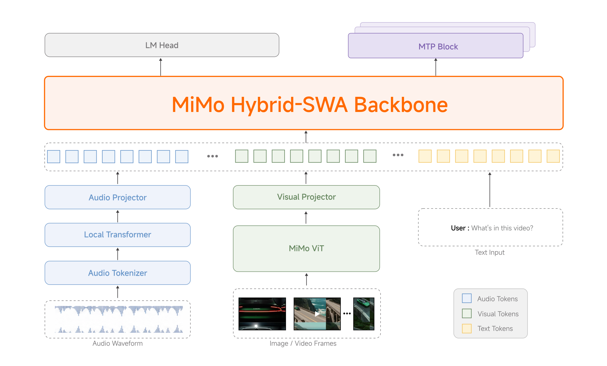

# MiMo-V2.5 技术博客精译

>  **[返回 14.9-MiMo 家族总览](../../14.9-MiMo.md)**

> 原文标题: MiMo-V2.5 / MiMo-V2.5-Pro
> 原文链接: https://mimo.xiaomi.com/mimo-v2-5/ (Standard), https://mimo.xiaomi.com/mimo-v2-5-pro/ (Pro)
> 发布日期: 2026-04-22 (V2.5 Standard) / 2026-04-27 (V2.5-Pro)
> 发布机构: Xiaomi AI Lab
> 许可协议: MIT License (开源权重)

## MiMo-V2.5: Agentic 能力与多模态理解的重大跃升

2026 年 4 月 22 日,我们发布 MiMo-V2.5,这是 agentic 能力和多模态理解方面的一次重大进步. 凭借原生的视觉和音频理解能力,MiMo-V2.5 能够跨模态无缝推理,在 agentic 性能上超越 MiMo-V2-Pro,并支持最高 100 万 token 的上下文. 

MiMo-V2.5 是一个 310B 参数的 Sparse MoE 模型(每 pass 激活 15B 参数),在 48T tokens 上训练. 其语言 backbone 继承自 MiMo-V2-Flash 的 hybrid sliding-window attention 架构,并增加了专用的视觉Encoder 和音频Encoder (均为内部预训练),通过轻量 projector 连接. 

> 图 1: MiMo-V2.5 架构示意,展示语言 backbone、自研视觉/音频Encoder 及轻量 projector 的连接方式. 

> 译者注: 310B 总参数 / 15B 激活参数的比例意味着约 4.8% 的稀疏度,这在当前 MoE 模型中属于中等偏高的稀疏水平. 作为对比,Kimi K2.6 是 1T/32B(3.2% 稀疏),GLM-5.1 是 754B/40B(5.3% 稀疏). MiMo-V2.5 的 48T 训练数据量也非常可观——DeepSeek-V3 的训练数据约为 14.8T,这意味着 MiMo-V2.5 的预训练数据量约为 V3 的 3.2 倍. 但数据量的绝对值并不直接等同于质量,数据构成、去污染策略和课程学习设计同样关键. 原文未披露 48T 的具体来源分布,这是一个信息缺口. 

### 五阶段训练流程

训练经历五个阶段:

**第一阶段, text pre-training**: 在多样化的语料库上构建 LLM backbone. 

**第二阶段, projector warmup**: 对齐音频和视觉 projector 与语言模型. 

**第三阶段, multimodal pre-training**: 在大规模高质量跨模态数据上进行多模态预训练. 

**第四阶段, supervised fine-tuning and agentic post-training**: 在此阶段,上下文窗口从 32K 逐步扩展至 256K 再到 1M. 

**第五阶段, RL and MOPD**: 进一步强化的感知、推理和 agentic 能力. 

这些阶段共同产出一个能够看见、听见并对其感知采取行动的统一模型——一个理解一切并完成任务的模型. 

> 译者注: 上下文窗口的三阶段扩展(32K → 256K → 1M)是一个值得关注的工程细节. 大多数模型的长上下文扩展采用两阶段方法(如预训练阶段固定上下文,后训练阶段通过 YaRN 或类似技术扩展). MiMo-V2.5 在 SFT + agentic post-training 阶段就进行渐进式扩展,意味着模型在学会遵循指令和使用工具的同时,也在学习如何利用越来越长的上下文. 这种「能力并行培养」策略可能带来更好的长程 agentic 表现——因为 agentic 任务天然需要长上下文(多轮 tool call 的轨迹累积),而模型在训练时就已经习惯了在百万级上下文中工作. 不过,渐进式扩展也增加了训练复杂度,每个阶段都需要重新调整位置编码和注意力机制. 

### Agentic 性能

在对于真实世界部署最重要的 agentic benchmark 上,MiMo-V2.5 展现出最佳性能. 

在我们内部的 **MiMo Coding Bench** 中,MiMo-V2.5 在日常编码任务上表现出色,缩小了与前沿模型的差距,并以一半的成本达到了 MiMo-V2.5-Pro 的水平. 

在 **Claw-Eval** 这一日常 agentic 任务 benchmark 上,MiMo-V2.5 在通用子集上达到 62.3,处于性能和效率的 Pareto 前沿. 

这些结果凸显了 MiMo-V2.5 的独特之处:前沿级别的 agentic 能力与高 token 效率的结合. 

### 更锐利的感知,更长的视野

MiMo-V2.5 为精确视觉推理、复杂图表分析和深度多模态理解提供更锐利的感知,原生支持最高 100 万 token 的上下文. 

在图像、视频和多模态 agentic 任务中,MiMo-V2.5 与前沿闭源模型保持同一水平——在视频任务上追平 Gemini 3 Pro,在多模态 agentic 工作上追平 Claude Sonnet 4.6,在图像和文档理解方面保持竞争力. 所有这些都来自一个统一的模型. 

### 开源

MiMo-V2.5 系列已完全开源. 权重、tokenizer 和完整模型卡可在 Hugging Face 获取. 

| Model | Total Params | Active Params | Context | Precision | Download |
|-------|-------------|---------------|---------|-----------|----------|
| MiMo-V2.5-Base | 310B | 15B | 256K | FP8 (E4M3) Mixed | Hugging Face |
| MiMo-V2.5 | 310B | 15B | 1M | FP8 (E4M3) Mixed | Hugging Face |

### Token Plan 定价

- **MiMo-V2.5** — 1x 倍率(1 token = 1 credit)
- **MiMo-V2.5-Pro** — 2x 倍率(1 token = 2 credits)

从今天起,Token Plan 对 100 万 token 上下文窗口不再收取倍率乘数. 

> 译者注: 1M 上下文不加收额外费用是一个非常有竞争力的定价策略. 作为对比,GLM-5.1 的 200K 上下文在长文本场景下已经需要显著更高的成本,而 MiMo-V2.5 将 1M 上下文与标准定价对齐,这大大降低了长程 agentic 任务的运行成本. 但需要注意「不加收倍率乘数」不等于「成本不增加」——1M token 的推理本身就需要更多的 KV Cache 存储和计算,只是 Xiaomi 选择不将这部分成本转嫁给用户. 这可能是小米作为新进入者的一种市场渗透策略. 

## MiMo-V2.5-Pro: 为更困难的目标而生

2026 年 4 月 27 日,我们发布并开源 MiMo-V2.5-Pro. 这是我们迄今为止最强的模型,在通用 agentic 能力、复杂软件工程和长程任务方面较前代 MiMo-V2-Pro 有显著提升. MiMo-V2.5-Pro 是一个 1.02T 参数的 Mixture-of-Experts 模型,每 pass 激活 42B 参数,基于 hybrid-attention 架构构建,拥有 100 万 token 的上下文窗口. 

> 译者注: 1.02T / 42B 的参数比例意味着约 4.1% 的激活率,比 Standard 版本的 4.8% 略低. 更大的总参数规模和更多的激活参数(42B vs 15B)使 Pro 版本在推理时消耗更多的计算资源,但也带来了更强的表达能力. 值得注意的是,Pro 版本的预训练数据量为 27T tokens,反而少于 Standard 的 48T. 这个差异可能反映了两种训练策略:Standard 版本可能采用了更广泛的通用数据预训练,而 Pro 版本可能使用了更高质量、更精选的数据,或者在 27T 之后通过其他方式(如后训练蒸馏)来获取能力. 原文没有解释这个数据量差异的原因. 

### 完整 Benchmark 横向对比

以下表格汇总了 MiMo-V2.5-Pro 在 General Agent 和 Coding Agent 两大类 benchmark 上的表现,并与 MiMo-V2-Pro, DeepSeek V4 Pro, Kimi K2.6, GLM 5.1, Gemini 3.1 Pro, GPT-5.4 和 Claude Opus 4.6 进行了横向对比. 

| Benchmark | MiMo-V2.5-Pro 1.02T / 42B | MiMo-V2-Pro 1.02T / 42B | DeepSeek V4 Pro 1.6T / 49B | Kimi K2.6 1T / 32B | GLM 5.1 744B / 40B | Gemini 3.1 Pro | GPT-5.4 | Claude Opus 4.6 |
|:---|:---:|:---:|:---:|:---:|:---:|:---:|:---:|:---:|
| **General Agent** |
| GDPVal-AA (Elo) | 1581 | 1426 | 1554 | 1480 | 1535 | 1317 | 1674 | 1606 |
| tau^3-bench | 72.9 | 64.5 | 71.8 | 71.0 | 70.6 | 67.1 | 72.9 | 72.4 |
| Claw-Eval (pass^3) | 63.8 | 57.8 | 59.8 | 62.3 | 62.7 | 57.8 | 60.3 | 70.4 |
| Humanity's Last Exam | 48.0 w.o. tools 34.0 | 40.0 w.o. tools 28.0 | 48.2 w.o. tools 37.7 | 54.0 w.o. tools 34.7 | 52.3 w.o. tools 31.0 | 51.4 w.o. tools 44.4 | 58.7 w.o. tools 42.7 | 53.0 w.o. tools 40.0 |
| **Coding Agent** |
| SWE-Bench Pro | 57.2 | 55.0 | 55.4 | 58.6 | 58.4 | 54.2 | 57.7 | 57.3 |
| SWE-bench Verified | 78.9 | 78.0 | 80.6 | 80.2 | — | 76.2 | — | 80.8 |
| Terminal-Bench 2.0 | 68.4 | 57.1 | 67.9 | 66.7 | 69.0 | 68.5 | 75.1 | 65.4 |
| FrontierSWE (Impl., rank) | #3.4 | #5.0 | — | — | — | #3.9 | #1.9 | #2.0 |

> 注: 分数越高越好,除非标注为排名(rank). "—" 表示未评测. DeepSeek V4 Pro 的数据使用其 `max` effort 设置. 

> 译者注: 这张表格的信息密度极高,值得逐行分析. 在 General Agent 类别中,MiMo-V2.5-Pro 的 GDPVal-AA ELO 1581 比前代 V2-Pro(1426) 提升了 155 分,这是一个显著的跃升,甚至超过了 GLM 5.1(1535) 和 Kimi K2.6(1480). 但 GPT-5.4(1674) 和 Claude Opus 4.6(1606) 仍然领先. 在 Coding Agent 类别中,SWE-Bench Pro 57.2% 与 Claude Opus 4.6(57.3%) 几乎持平,仅差 0.1 个百分点——这在统计噪声范围内. Terminal-Bench 2.0 68.4% 超过了 Claude Opus 4.6(65.4%) 和 GLM 5.1(63.5%,但 GLM 5.1 的数据来自不同 harness). 一个引人注目的数据点是 Humanity's Last Exam:MiMo-V2.5-Pro 的 48.0%(无工具)超过了 Claude Opus 4.6(53.0%?)——等等,让我重新核对. 表格中 HLE 的数据排列是:MiMo-V2.5-Pro 48.0 / 34.0(w.o. tools),Claude Opus 4.6 53.0 / 40.0(w.o. tools). 所以 Claude Opus 4.6 在 HLE 上仍然领先. 但 MiMo-V2.5-Pro 在 HLE with tools 上(34.0)比 V2-Pro(28.0)有显著进步,接近 GLM 5.1(31.0)和 Kimi K2.6(34.7). 

在内部测试中,V2.5-Pro 展现出一种新的智能水平,这反过来推动我们的研究者重新思考如何与它协作. 当与合适的 harness 配对时,V2.5-Pro 能够维持跨越超过一千次 tool call 的复杂长程任务. 我们还在 agentic 场景中的指令遵循方面看到了实质性改进. 它能够可靠地遵守嵌入在上下文中的细微要求,并在超长上下文中保持强连贯性. 

### 长程任务案例研究

MiMo-V2.5-Pro 为更困难的目标而构建. 我们给它分配了通常需要人类专家数天或数周才能完成的任务,并让它自主运行. 以下是它交付的成果:

#### 案例一: Rust 实现 SysY 编译器

任务源自北京大学《编译原理》课程项目,要求模型从零开始用 Rust 实现一个完整的 SysY 编译器:lexer, parser, AST, Koopa IR codegen, RISC-V assembly backend, 以及性能优化. 参考项目通常需要一名北大 CS 专业学生数周时间完成. MiMo-V2.5-Pro 在 4.3 小时内完成了任务,跨越 672 次 tool call,在课程的隐藏测试套件中取得了满分 233/233. 

模型并非通过试错 thrashing 来完成,而是逐层构建编译器:首先搭建完整的 pipeline scaffold,然后完善 Koopa IR(110/110),接着是 RISC-V backend(103/103),最后是性能优化(20/20). 首次编译就通过了 137/233 个测试,59% 的冷启动通过率表明架构在运行任何测试之前就被正确设计了. 在第 512 轮,一次重构导致 lv9/riscv 回归了两个测试;模型诊断了失败原因,恢复后继续推进. 长程工作奖励这种结构化、自我纠正的纪律. 

> 译者注: 这个案例是 MiMo-V2.5-Pro 最有说服力的演示之一,原因有三. 第一,它有明确的评分标准(233/233)和明确的时间限制(4.3 小时),这比开放性的「构建一个应用」更易于评估. 第二,59% 的冷启动通过率是一个关键信号——它表明模型在写第一行代码之前就已经对编译器的整体架构有了清晰的设计,而不是边写边改. 这与人类专家的「先设计后实现」的工程实践一致. 第三,第 512 轮的回归-恢复循环展示了模型的自我诊断能力:它不仅能够检测到自己的错误,还能定位错误原因并修复. 但需要注意一个细节:这个任务是在课程项目的 constrained 环境下完成的,有明确的测试套件作为反馈信号. 在缺乏自动化测试的真实工程场景中,模型的表现可能会有所不同. 

#### 案例二: 全功能视频编辑器

仅凭几个简单的 prompt,MiMo-V2.5-Pro 交付了一个可用的桌面应用:多轨时间线、片段裁剪、交叉淡入淡出、音频混音和导出 pipeline. 最终构建包含 **8,192 行代码**,在 **11.5 小时** 的自主工作中跨越 **1,868 次 tool call** 产生. 

> 译者注: 这个案例的规模令人印象深刻,但评估标准比编译器案例更模糊. 「可用的桌面应用」没有明确的测试套件来定义「可用」的边界. 8,192 行代码和 1,868 次 tool call 是过程指标,不是质量指标. 一个小而有用的工具可能比一个大而 buggy 的系统更有价值. 此外,11.5 小时的运行时间意味着大量的 token 消耗——按照 MiMo-V2.5-Pro 的 $3/1M output tokens 定价,1,868 次 tool call 的完整运行可能需要数百美元的 API 费用. 如果这是一个单次演示,成本尚可接受;但如果要在生产环境中常规运行,这个成本结构需要优化. 

#### 案例三: 模拟 EDA: FVF-LDO 设计与优化

一个研究生级别的模拟电路 EDA 任务:在 TSMC 180nm CMOS 工艺中从零开始设计并优化一个完整的 FVF-LDO(Flipped-Voltage-Follower low-dropout regulator). 模型需要确定功率晶体管的尺寸、调整补偿网络、选择偏置电压,使六个指标同时达到规格:相位裕度、线性调整率、负载调整率、静态电流、PSRR 和瞬态响应. 一名受过训练的模拟设计师通常需要数天时间来完成这种规模的项目. 

我们将 MiMo-V2.5-Pro 接入一个以 Claude Code 为 harness 的 ngspice 仿真闭环中. 在大约一小时的闭环迭代中——调用仿真器、读取波形、微调参数——模型产生了一个所有目标指标都达标的设计,且以下四个指标相比其初始尝试提升了一个数量级:

| 指标 | 初始值 | 最终值 | 提升倍数 |
|------|--------|--------|---------|
| Line Regulation | 0.65 mV/V | 0.03 mV/V | 22x |
| Load Regulation | 0.51 mV/mA | 0.03 mV/mA | 17x |
| Quiescent Current | 536 uA | 59 uA | 9x |
| Undershoot | 20.4 mV | 1.52 mV | 13x |

在这些实验中,V2.5-Pro 展现出一种显著的「harness awareness」:它充分利用其 harness 环境的 affordances,管理自己的记忆,并塑造自身上下文的填充方式以服务于最终目标. 

> 译者注: 「harness awareness」是 MiMo-V2.5-Pro 的一个独特卖点,值得深入分析. 传统的 agent 模型通常将 harness 视为被动容器——模型只关心生成正确的 tool call,而不关心 harness 如何管理状态、如何组织上下文. MiMo-V2.5-Pro 的「harness awareness」意味着它能够主动利用 harness 的功能来优化自己的执行效率:例如,主动请求特定的上下文格式、利用 harness 的记忆机制来避免重复计算、或者调整自己的工作流以适应 harness 的约束. 这种能力本质上是对「模型-环境接口」的元认知——模型不仅知道如何完成任务,还知道如何最优地利用完成任务的「工具箱」. 如果这一能力被验证为可靠,它可能改变 agent 系统的设计范式:不再是为固定模型设计最优 harness,而是让模型自适应地利用 harness 的能力. 

### 前沿编码智能

我们通过扩大后训练计算量来进一步提升模型的编码智能. 

MiMo Coding Bench 是我们内部的评测套件,用于评估模型在 Claude Code 等 agentic 框架中处理多样化编码任务的能力. 它涵盖仓库理解、项目构建、代码审查、结构化产物生成、规划、SWE 等. MiMo-V2.5-Pro 在真实世界的编码场景中进一步提升了用户体验,更好地处理广泛的开发需求. 

在 MiMo Coding Bench 上,MiMo-V2.5-Pro 达到 73.7,超过 MiMo-V2-Pro(71.5)和 Gemini 3.1 Pro(67.8),接近 Claude Opus 4.6(77.1). 

> 译者注: MiMo Coding Bench 是 Xiaomi 内部的 benchmark,这意味着其任务分布、难度曲线和评测标准由 Xiaomi 自行定义. 内部 benchmark 的一个常见风险是「评测集与训练集重叠」——如果后训练数据包含了与 MiMo Coding Bench 相似的任务,那么 benchmark 分数就不能完全反映泛化能力. 不过,考虑到 MiMo-V2.5-Pro 在 SWE-Bench Pro(第三方 benchmark)上也取得了 57.2% 的强劲成绩,内部 benchmark 的高分至少部分反映了真实能力. 从谱系角度看,MiMo Coding Bench 的命名和评测范围与 GLM-5.1  blog 中提到的内部评测有相似之处,这暗示了 2026 年的前沿模型厂商普遍开始构建「私有 agentic benchmark」来补充公开 benchmark 的不足. 

### Token 效率

更高的智能不仅仅是更高的分数——而是如何用更少的 token 达到目标. MiMo-V2.5-Pro 在达到前沿级别能力的同时,每条轨迹的 token 消耗显著更低. 在 ClawEval 上,V2.5-Pro 以仅约 70K tokens per trajectory 达到 64% Pass^3——比 Claude Opus 4.6, Gemini 3.1 Pro 和 GPT-5.4 在可比能力水平下少消耗约 **40-60% 的 token**. 图表的左上角是你想要的位置:以更低的成本获得更高的分数. 

> 译者注: Token 效率是 2026 年 agentic 模型竞争的一个关键维度,但它的重要性容易被低估. 在单次调用的场景中,40-60% 的 token 节省意味着成比例的成本降低;但在长程 agentic 任务中,这种节省是复合的——每次 tool call 都需要重新生成上下文,token 消耗随步骤数线性增长. 如果一条轨迹包含 100 次 tool call,每次节省 40% 的 token,总节省可能达到数十万美元(在大规模部署时). 但这里有一个重要的 caveat:ClawEval 的「per trajectory」token 计数是否包含了 tool call 的输入和输出?如果只计算模型输出而忽略 tool call 返回的大型上下文(如代码文件、日志内容),那么「70K tokens」可能低估了真实的成本. 此外,不同 harness 的上下文管理策略差异很大——一个高效的 harness 可能通过 prompt caching 和选择性上下文压缩来降低 token 消耗,而这种优化与模型本身的能力无关. 

### 架构与训练细节

MiMo-V2.5-Pro 继承自 MiMo-V2-Flash 的 **hybrid attention** 和 **Multi-Token Prediction(MTP)** 设计. Local Sliding Window Attention(SWA)和 Global Attention(GA)以 6:1 的比例交错,使用 128-token 窗口,通过可学习的 attention-sink bias 在长上下文中将 KV Cache 存储降低近 7 倍,同时保持性能. 一个配备 dense FFNs 的轻量 MTP 模块原生集成于训练和推理中,大致将输出吞吐量提升 3 倍,并加速 RL rollout. 

预训练在 **27T tokens** 上运行,使用 **FP8 混合精度**,原生序列长度为 32K,上下文扩展至 1M. 后训练遵循 MiMo-V2-Flash 引入的三阶段范式:

**(1) Supervised Fine-Tuning**: 在精选的数据对上建立基础指令遵循能力. 

**(2) Domain-Specialized Training**: 通过特定领域的 RL 分别优化多个教师模型,涵盖数学、安全、agentic tool-use 等领域. 

**(3) Multi-Teacher On-Policy Distillation(MOPD)**: 单一学生模型在自身的 rollout 下向每个专家教师学习,在 token 级别接受每位专家教师的指导,将他们的能力融合到一个统一模型中. 

> 译者注: MOPD 是 MiMo-V2.5-Pro 后训练阶段的核心创新,值得详细解析. 传统的多教师蒸馏通常采用「离线」方式:每个学生从每个教师的静态输出中学习. MOPD 的「on-policy」意味着学生模型先生成自己的输出,然后教师模型对这些输出进行评分和指导——这与 RLHF 中的 reward model 机制类似,但区别在于有多个领域专家同时提供反馈. 从工程角度看,MOPD 的挑战在于多个教师的反馈信号可能存在冲突(例如,安全教师可能倾向于保守回答,而数学教师可能鼓励精确推理). 原文没有披露如何处理这些冲突,但 token 级别的指导暗示了一种细粒度的融合机制. 另外,6:1 的 Local:Global attention 比例是一个有趣的工程选择:大部分注意力层使用高效的局部窗口,只有少部分层需要全局视野. 这种「大部分廉价 + 少部分昂贵」的设计在降低 KV Cache 的同时,通过 attention-sink bias 来缓解长距离信息丢失——bias 的作用是强制少数 token(通常是序列开头的几个)始终参与全局注意力,作为信息的「锚点」. 

### 开源规格

MiMo-V2.5-Pro 现已完全开源,采用 permissive license. 权重、tokenizer 和完整模型卡可在 Hugging Face 获取. 

| Model | Total Params | Active Params | Context | Precision | Download |
|-------|-------------|---------------|---------|-----------|----------|
| MiMo-V2.5-Pro-Base | 1.02T | 42B | 256K | FP8 (E4M3) Mixed | Hugging Face |
| MiMo-V2.5-Pro | 1.02T | 42B | 1M | FP8 (E4M3) Mixed | Hugging Face |

完整的 benchmark 结果、架构细节和 SGLang / vLLM 部署指南请参阅 Hugging Face 上的模型卡. 

## 附录

### A. 术语表

| 英文术语 | 中文译名 | 首次出现位置 | 简要解释 |
|---------|---------|------------|---------|
| Sparse MoE | 稀疏混合专家模型 | 引言 | 仅激活部分专家网络处理每个 token 的 Transformer 架构,通过路由机制动态选择专家 |
| Hybrid sliding-window attention | 混合滑动窗口注意力 | 架构概览 | 结合局部滑动窗口注意力和全局注意力的混合注意力机制,降低长序列的 KV Cache 存储 |
| Projector | 投影器 | 架构概览 | 轻量神经网络,将视觉/音频特征映射到语言模型的嵌入空间,实现跨模态对齐 |
| Projector warmup | Projector 预热 | 五阶段训练 | 在多模态预训练前,先对 projector 进行轻量对齐训练,稳定跨模态表示 |
| MOPD | 多教师在线策略蒸馏 | 五阶段训练 | Multi-Teacher On-Policy Distillation,学生模型在自己的 rollout 下从多个领域专家教师学习 |
| Agentic post-training | Agentic 后训练 | 五阶段训练 | 针对 agentic 任务(tool use,多轮推理,规划)进行的后训练,通常包含 SFT 和 RL |
| Claw-Eval | Claw 评估 | Agentic 性能 | 基于 OpenClaw harness 框架的 agentic 任务 benchmark,测量多步骤自主任务完成能力 |
| GDPval-AA | GDPval-Agent Arena | Benchmark 表格 | 评估模型在 Office 套件和文档自动化中完成复杂任务的 benchmark,以 ELO 评分 |
| tau^3-bench | tau-立方基准 | Benchmark 表格 | 多领域对话代理 benchmark,评估模型在多轮交互中完成复杂任务(如银行业务、旅行预订)的能力 |
| HLE | Humanity's Last Exam | Benchmark 表格 | 高难度跨学科推理 benchmark,包含极难题目,分 text-only 和 with-tools 两种评测模式 |
| SWE-Bench Pro | 软件工程基准专业版 | Benchmark 表格 | 基于真实 GitHub issue 的代码修复 benchmark,难度高于 SWE-Bench Verified |
| FrontierSWE | 前沿 SWE | Benchmark 表格 | 评估模型实现复杂软件功能的 benchmark,以排名形式报告结果 |
| Harness awareness | Harness 感知 | 案例三 | 模型主动理解并利用其执行环境的 affordances,优化上下文管理和任务执行策略 |
| Affordance | 功能可供性 | Harness awareness | 环境或工具提供的潜在功能,模型识别并利用这些功能来完成目标 |
| Attention-sink bias | 注意力汇聚偏置 | 架构细节 | 强制序列开头少数 token 始终参与全局注意力的可学习偏置项,作为长距离信息的锚点 |
| Local SWA | 局部滑动窗口注意力 | 架构细节 | 仅关注固定窗口内邻近 token 的注意力机制,计算复杂度 O(n) 而非 O(n^2) |
| Global Attention | 全局注意力 | 架构细节 | 标准自注意力机制,关注序列中所有 token,计算复杂度 O(n^2) |
| MTP | 多 token 预测 | 架构细节 | Multi-Token Prediction,模型一次性预测多个未来 token,提升训练效率和推理吞吐量 |
| On-policy distillation | 在线策略蒸馏 | 架构细节 | 学生模型基于自己的输出分布(而非教师的静态输出)进行学习的蒸馏方法 |
| Token-level guidance | Token 级别指导 | 架构细节 | 教师在每个生成 token 的位置提供细粒度反馈,而非仅在序列级别评分 |
| SysY | SysY 语言 | 案例一 | 一种简化版 C 语言,常用于编译原理教学,支持基本类型、数组、函数和控制流 |
| Koopa IR | Koopa 中间表示 | 案例一 | 一种面向教学的 LLVM-like 中间表示,用于编译器后端代码生成 |
| FVF-LDO | 翻转电压跟随器低压差稳压器 | 案例三 | Flipped-Voltage-Follower Low-Dropout Regulator,一种模拟电路设计 |
| ngspice | ngspice 仿真器 | 案例三 | 开源 SPICE 电路仿真器,用于模拟和混合信号电路的仿真分析 |
| Line regulation | 线性调整率 | 案例三 | 衡量稳压器在输入电压变化时维持输出电压稳定能力的指标 |
| Load regulation | 负载调整率 | 案例三 | 衡量稳压器在负载电流变化时维持输出电压稳定能力的指标 |
| PSRR | 电源抑制比 | 案例三 | Power Supply Rejection Ratio,衡量稳压器抑制输入电源纹波的能力 |
| FP8 (E4M3) | FP8 E4M3 精度 | 开源规格 | 8-bit 浮点格式,4 bit 指数位 + 3 bit 尾数位,用于混合精度训练以降低显存占用 |

### B. 核心实验数据汇总

#### B.1 MiMo-V2.5 Standard 规格

| 属性 | 数值 |
|------|------|
| 总参数 | 310B |
| 激活参数 | 15B |
| 预训练数据 | 48T tokens |
| 上下文窗口 | 1M tokens |
| 精度 | FP8 (E4M3) Mixed |
| 许可 | MIT |
| API 倍率 | 1x |

#### B.2 MiMo-V2.5-Pro 规格

| 属性 | 数值 |
|------|------|
| 总参数 | 1.02T |
| 激活参数 | 42B |
| 预训练数据 | 27T tokens |
| 上下文窗口 | 1M tokens |
| 注意力比例 | Local SWA : Global Attention = 6 : 1 |
| 滑动窗口大小 | 128 tokens |
| 精度 | FP8 (E4M3) Mixed |
| 许可 | MIT |
| API 倍率 | 2x |

#### B.3 关键 Benchmark 汇总

| Benchmark | MiMo-V2.5-Pro | 最佳竞品 | 差距分析 |
|-----------|--------------|---------|---------|
| SWE-Bench Pro | 57.2% | Kimi K2.6 58.6% | -1.4pp,处于第一梯队 |
| Terminal-Bench 2.0 | 68.4% | GPT-5.4 75.1% | -6.7pp,超过 Claude Opus 4.6(65.4%) |
| GDPVal-AA (Elo) | 1581 | GPT-5.4 1674 | -93 分,超过 GLM 5.1(1535) |
| tau^3-bench | 72.9 | GPT-5.4 / Claude Opus 4.6 72.9/72.4 | 与 GPT-5.4 持平 |
| Claw-Eval (pass^3) | 63.8 | Claude Opus 4.6 70.4 | -6.6pp |
| HLE (w.o. tools) | 34.0 | GPT-5.4 42.7 | -8.7pp |
| HLE (with tools) | 48.0 | GPT-5.4 58.7 | -10.7pp |
| MiMo Coding Bench | 73.7 | Claude Opus 4.6 77.1 | -3.4pp |

#### B.4 长程任务案例数据

| 案例 | 任务描述 | 耗时 | Tool calls | 结果 |
|------|---------|------|-----------|------|
| SysY 编译器 | Rust 实现完整编译器(lexer/parser/AST/IR/backend) | 4.3h | 672 | 233/233 (100%) |
| 视频编辑器 | 桌面应用(多轨时间线/裁剪/混音/导出) | 11.5h | 1,868 | 8,192 行代码 |
| FVF-LDO 设计 | 模拟电路设计与优化(TSMC 180nm) | ~1h | 未披露 | 全部 6 项指标达标,4 项提升 9-22x |

### C. 模型谱系定位

- **直接继承自**: MiMo-V2-Flash(语言 backbone, hybrid attention, MTP)和 MiMo-V2-Pro(1.02T/42B MoE 架构). MiMo-V2.5 Standard 继承 V2-Flash 的架构并增加多模态能力;Pro 版本在 V2-Pro 基础上通过后训练优化提升 agentic 和编码能力. 
- **核心创新**:
  1. **统一多模态架构**: 原生视觉+音频理解集成于单一模型,通过自研Encoder 和轻量 projector 实现,而非外挂 encoder 的「拼接」方案. 
  2. **渐进式上下文扩展**: 在 SFT + agentic post-training 阶段从 32K → 256K → 1M 逐步扩展,使模型在学习 agentic 技能的同时适应长上下文. 
  3. **MOPD 多教师在线策略蒸馏**: 多个领域专家教师(数学/安全/agentic)在 token 级别为学生模型提供 on-policy 指导,实现能力的统一融合. 
  4. **Harness awareness**: 模型主动利用执行环境的 affordances,管理上下文填充方式,优化长程任务执行效率. 
- **被后续工作引用**: 截至 2026-05-18,尚无公开学术引用. 但其开源权重(MIT License)和详细模型卡为社区复现和扩展研究提供了基础. 
- **技术谱系中的位置**: MiMo-V2.5 系列代表了国产开源模型在「全模态 + 长上下文 + Agentic」三条路线上的同时推进. 与 GLM-5.1(纯文本长程优化)、MiniMax M2.7(纯文本自我进化)、Kimi K2.6(纯文本 Agent Swarm)相比,MiMo-V2.5 的独特之处在于其「全模态统一架构」——视觉、音频和文本能力不是分别训练后拼接,而是从底层共享同一个语言 backbone. 这种设计在工程上更复杂,但在用户体验上更统一. 然而,全模态也带来了新的挑战:不同模态的数据质量差异、跨模态注意力竞争的平衡、以及多模态 agentic 任务的评测标准尚未成熟. MiMo-V2.5 的 1M 上下文和 MIT 开源许可使其在生态建设上具有潜在优势,但其相对较新的发布(2026-04)意味着社区验证和第三方复现仍在进行中. 

> 译者注: MiMo-V2.5 系列的发布节奏(4 月 22 日 Standard,4 月 27 日 Pro,间隔仅 5 天)暗示了两个版本可能是并行开发的,或者 Pro 版本是 Standard 的一个快速增强版. 这种快速迭代模式在 2026 年的国产模型厂商中越来越常见(Z.ai 的 GLM-5→5-Turbo→5.1 六周三发,Moonshot 的 K2.5→K2.6 快速跟进),反映了激烈竞争下的「发布时间优先」策略. 但对用户而言,这种快速迭代也可能带来选择困惑:Standard 和 Pro 的定位差异是否足够清晰?对于需要多模态能力但预算有限的用户,Standard 版本可能是更好的选择;对于需要最强编码和 agentic 能力的用户,Pro 版本更合适. 但两者之间 2 倍的 API 倍率差异是否能完全反映能力差距,还需要更多独立评测来验证. 
