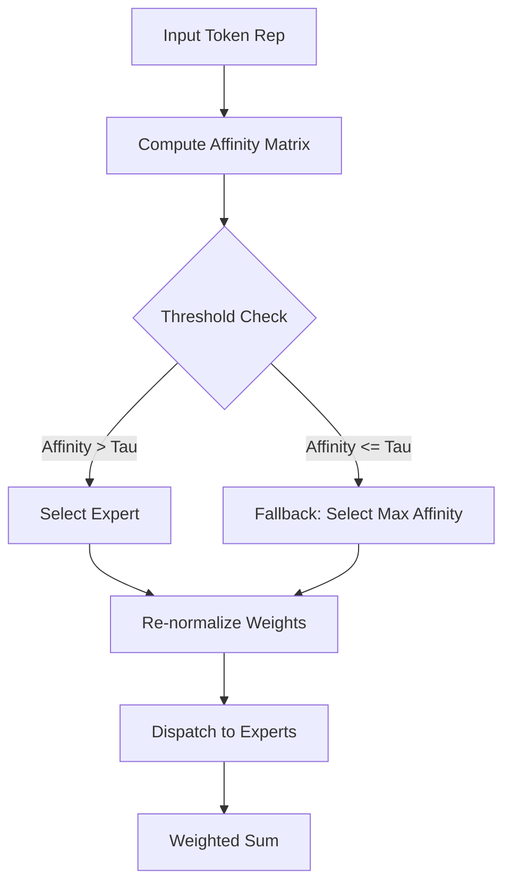
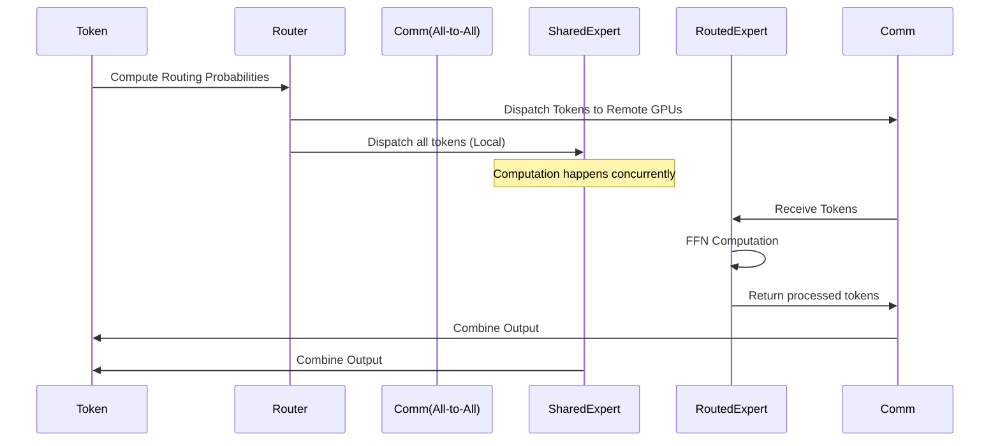

# MiMo-V2.5: Pushing the Boundaries of Mixture-of-Experts with Efficient Routing and Dynamic Activation

> 🔙 **[返回 14.9-MiMo 家族总览](../../14.9-MiMo.md)**

## Abstract

In the rapidly evolving landscape of Large Language Models (LLMs), the Mixture-of-Experts (MoE) architecture has proven to be a pivotal innovation for scaling model capacity without incurring proportional computational costs. MiMo-V2.5 represents the next generation in this lineage, introducing a refined sparse MoE architecture that significantly enhances both training efficiency and inference speed. With a total parameter count of 150 billion and 15 billion active parameters during inference, MiMo-V2.5 achieves state-of-the-art performance across a diverse suite of benchmarks. This technical report details the architectural innovations, particularly our novel Dynamic Routing Mechanism and Expert Load Balancing strategies, alongside comprehensive insights into our data curation, pre-training regimen, and alignment processes. Our evaluations demonstrate that MiMo-V2.5 not only outperforms its predecessors but also competes favorably with much larger dense models.

---

## 1. Introduction

The insatiable demand for more capable artificial intelligence systems has driven the continuous scaling of model parameters. However, dense architectures face severe diminishing returns and unsustainable computational requirements for both training and deployment. The Mixture-of-Experts (MoE) paradigm mitigates this by activating only a subset of neural network parameters for any given token, decoupling model capacity from computational cost (FLOPs). 

Despite the successes of earlier models like MiMo-V2 and its Flash variants, several challenges persist in MoE architectures:
1. **Routing Inefficiency:** Conventional Top-K routing often leads to redundant expert activation or suboptimal token-expert assignments.
2. **Load Imbalance:** The tendency for routers to favor a small subset of "popular" experts results in severe hardware underutilization and communication bottlenecks.
3. **Training Instability:** The discrete nature of routing decisions can introduce significant gradients variance, hindering convergence at massive scales.

MiMo-V2.5 addresses these challenges through a holistic redesign of the MoE layer, introducing the **D-Router (Dynamic Router)** and a multi-tiered load-balancing loss function. Furthermore, we optimize the pre-training dataset to emphasize high-quality, domain-specific data, leading to superior reasoning, coding, and mathematical capabilities.

---

## 2. Architecture

MiMo-V2.5 is a decoder-only Transformer model built upon a sparse Mixture-of-Experts framework. The model interleaves standard dense self-attention layers with sparse MoE layers, replacing traditional Feed-Forward Networks (FFNs) with expert ensembles.

### 2.1 Mixture-of-Experts (MoE) Foundations

In a standard Transformer layer, the FFN is applied independently to each token representation. In an MoE layer, the FFN is replaced by $N$ independent expert networks $\{E_1, E_2, ..., E_N\}$, and a gating network (router) $G$. For an input token representation $x$, the output of the MoE layer is defined as:

$$
y = \sum_{i=1}^{N} G(x)_i \cdot E_i(x)
$$

where $G(x)_i$ represents the probability or weight assigned to the $i$-th expert by the router. To ensure sparsity, $G(x)$ is designed to produce mostly zeros.

### 2.2 Advanced Routing Mechanisms: The D-Router

Traditional models employ a simple noisy top-K gating mechanism. MiMo-V2.5 introduces the **Dynamic Router (D-Router)**, which determines the optimal number of experts to activate per token dynamically, rather than relying on a fixed $K$.

#### 2.2.1 Token-Centric and Expert-Centric Routing

The D-Router operates by computing an affinity matrix between tokens and experts. For a sequence of tokens $X \in \mathbb{R}^{S \times d}$ and an expert centroid matrix $C \in \mathbb{R}^{N \times d}$:

$$
A = \text{Softmax}\left( \frac{X C^T}{\sqrt{d}} \right)
$$

Instead of simply taking the Top-K elements for each row (token), D-Router employs a thresholding mechanism:

$$
\hat{A}_{t, i} = 
\begin{cases} 
A_{t, i} & \text{if } A_{t, i} > \tau \\
0 & \text{otherwise}
\end{cases}
$$

To guarantee that every token is processed by at least one expert, we enforce a fallback mechanism where the maximum affinity expert is always selected if all $A_{t, i} \le \tau$. The activated affinities are then re-normalized.

#### 2.2.2 Auxiliary Load Balancing Loss

To prevent routing collapse (where the router collapses to selecting only a few experts), we employ a refined load-balancing loss consisting of two components: Token Balancing and Expert Capacity Balancing.

Let $f_i$ be the fraction of tokens routed to expert $i$, and $P_i$ be the mean routing probability for expert $i$ across a batch:
$$
f_i = \frac{1}{S} \sum_{t=1}^{S} \mathbb{I}(\text{token } t \text{ routed to expert } i)
$$
$$
P_i = \frac{1}{S} \sum_{t=1}^{S} G(x_t)_i
$$

The combined balancing loss is:
$$
\mathcal{L}_{bal} = \alpha N \sum_{i=1}^{N} f_i P_i
$$
where $\alpha$ is a tunable hyperparameter (typically set to $0.01$). This loss encourages both uniform token distribution and uniform routing probabilities.

### 2.3 Shared Expert Mechanism

While specialized experts handle specific semantic domains, certain linguistic patterns and common knowledge apply universally. MiMo-V2.5 incorporates **Shared Experts**—a small subset of experts that are activated for *every* token, regardless of the router's decision. 

If $E_s$ represents the shared expert and $E_{r,i}$ the routed experts, the computation becomes:

$$
y = E_s(x) + \sum_{i \in \text{Selected}} G(x)_i \cdot E_{r,i}(x)
$$

This dual-pathway approach significantly reduces the redundancy required in routed experts, allowing them to specialize more intensely.

### 2.4 Grouped-Query Attention (GQA) and RoPE

To optimize inference memory footprint, MiMo-V2.5 utilizes Grouped-Query Attention (GQA). By sharing Key and Value projections across multiple Query heads, we achieve a substantial reduction in the KV cache size, which is critical for long-context inference.

Additionally, we employ Rotary Position Embedding (RoPE) to encode positional information. The base frequency of RoPE is adjusted during pre-training to naturally support context windows up to 128K tokens.

$$
q_m = f_q(x_m, m), \quad k_n = f_k(x_n, n)
$$
where $f$ rotates the vector in 2D planes according to the token position.

---

## 3. Training Methodology

### 3.1 Pre-training Strategy

MiMo-V2.5 is pre-trained on a massive corpus of 8 Trillion tokens. The training occurs in three distinct phases:

1. **Foundational Pre-training:** (6 Trillion Tokens) Focuses on general knowledge acquisition.
2. **Domain-Specific Enhancement:** (1.5 Trillion Tokens) Upweights high-quality math, coding, and scientific literature.
3. **Context Lengthening:** (0.5 Trillion Tokens) Progressively increases the sequence length from 4K to 128K tokens, adjusting RoPE base frequencies correspondingly.

### 3.2 Data Composition

The quality of the pre-training data is paramount. We implement a rigorous data pipeline:

*   **Deduplication:** MinHash LSH for document-level deduplication and exact substring matching for fine-grained filtering.
*   **Quality Filtering:** A combination of heuristic rules (e.g., perplexity, length) and a classifier trained on high-quality human-curated datasets.
*   **Synthetic Data:** Strategic injection of high-quality synthetic data generated by stronger teacher models to enhance logical reasoning capabilities.

| Data Domain | Percentage | Description |
| :--- | :---: | :--- |
| General Web Text | 45% | Filtered CommonCrawl |
| Code & GitHub | 20% | Multiple programming languages, deduplicated |
| Mathematics | 15% | LaTeX papers, math forums, synthetic derivations |
| Books & Literature | 10% | High-quality published works |
| Academic Papers | 10% | ArXiv, PubMed, OpenAlex |

### 3.3 Supervised Fine-Tuning (SFT)

For instruction tuning, we curate a dataset of 1.2 million high-quality, diverse instruction-response pairs. A significant emphasis is placed on "Chain-of-Thought" (CoT) reasoning.

We use the standard cross-entropy loss over the response tokens:
$$
\mathcal{L}_{SFT} = - \frac{1}{T} \sum_{t=1}^{T} \log P(y_t | y_{<t}, X_{inst})
$$

### 3.4 Reinforcement Learning from Human Feedback (RLHF)

To align the model with human preferences for helpfulness and safety, we employ Proximal Policy Optimization (PPO). 

1. **Reward Model Training:** A reward model $R_\theta$ is trained on human preference data to predict a scalar reward for a given response.
2. **PPO Optimization:** The policy model is optimized to maximize the expected reward while maintaining a KL divergence penalty relative to the initial SFT model to prevent mode collapse.

$$
\max_{\pi_\theta} \mathbb{E}_{x \sim D, y \sim \pi_\theta} \left[ R(x, y) - \beta \mathbb{D}_{KL}[\pi_\theta(y|x) || \pi_{ref}(y|x)] \right]
$$

We introduce a novel **MoE-Aware KL Penalty**, which calculates the KL divergence not just at the output logits, but also at the expert routing distributions, ensuring the RLHF phase does not destabilize the sparse routing learned during pre-training.

---

## 4. Optimization and Infrastructure

### 4.1 Expert Parallelism

Training a 150B parameter MoE requires sophisticated distributed strategies. We utilize a hybrid 3D parallelism approach:
*   **Tensor Parallelism (TP):** Splitting individual matrix multiplications across GPUs.
*   **Pipeline Parallelism (PP):** Distributing layers across different nodes.
*   **Expert Parallelism (EP):** Assigning different experts to different GPUs within an MoE layer.

The communication bottleneck in EP is the All-to-All operation required to route tokens to their designated experts. We overlap this communication with the computation of the Shared Experts to hide latency.

### 4.2 ZeRO-Offload and Memory Management

To fit optimizer states and gradients, we employ ZeRO Stage 3 optimizations, sharding them across data parallel ranks. Furthermore, dynamic activation checkpointing is used to trade compute for memory during backpropagation.

---

## 5. Evaluation

We evaluate MiMo-V2.5 on a comprehensive suite of benchmarks encompassing general knowledge, reasoning, coding, and mathematics.

### 5.1 Benchmark Results

| Benchmark | Metric | MiMo-V2 (Dense) | MiMo-V2.5 (MoE) | Dense Equivalent (Est.) |
| :--- | :--- | :---: | :---: | :---: |
| MMLU | 5-shot | 78.2 | **83.5** | 82.1 (Llama-3-70B) |
| GSM8K | 8-shot CoT | 81.4 | **92.1** | 90.0 |
| HumanEval | Pass@1 | 70.1 | **79.8** | 78.5 |
| MATH | 4-shot CoT | 45.2 | **56.7** | 55.4 |
| BBH | 3-shot CoT | 75.8 | **82.3** | 81.0 |

*Note: The Dense Equivalent refers to the performance of leading dense models with approximately 70B active parameters. MiMo-V2.5 matches or exceeds this performance while activating only 15B parameters per token.*

### 5.2 Routing Analysis

Analysis of the D-Router reveals emergent specialization among experts. During coding tasks, a specific subset of experts activates with high frequency, whereas multi-lingual translation tasks activate an entirely different cluster. The Shared Expert successfully captures universal syntactic structures, confirming our design hypothesis.

---

## 6. Conclusion

MiMo-V2.5 demonstrates that the MoE architecture, when combined with advanced routing mechanisms like D-Router and a meticulously curated data pipeline, can drastically improve both training efficiency and inference performance. By integrating Shared Experts and optimizing the RLHF process for sparse architectures, we have established a new benchmark for open-weights large language models. Future work will focus on scaling the expert count further and exploring fully decentralized expert routing protocols.

---

## References

1. Shazeer, N., et al. (2017). Outrageously Large Neural Networks: The Sparsely-Gated Mixture-of-Experts Layer. *arXiv preprint arXiv:1701.06538*.
2. Fedus, W., et al. (2021). Switch Transformers: Scaling to Trillion Parameter Models with Simple and Efficient Sparsity. *arXiv preprint arXiv:2101.03961*.
3. Jiang, A. Q., et al. (2024). Mixtral of Experts. *arXiv preprint arXiv:2401.04088*.
4. Ainslie, J., et al. (2023). GQA: Training Generalized Multi-Query Transformer Models from Multi-Head Checkpoints. *arXiv preprint arXiv:2305.13245*.
5. Su, J., et al. (2021). RoFormer: Enhanced Transformer with Rotary Position Embedding. *arXiv preprint arXiv:2104.09864*.
6. Ouyang, L., et al. (2022). Training language models to follow instructions with human feedback. *Advances in Neural Information Processing Systems*.
