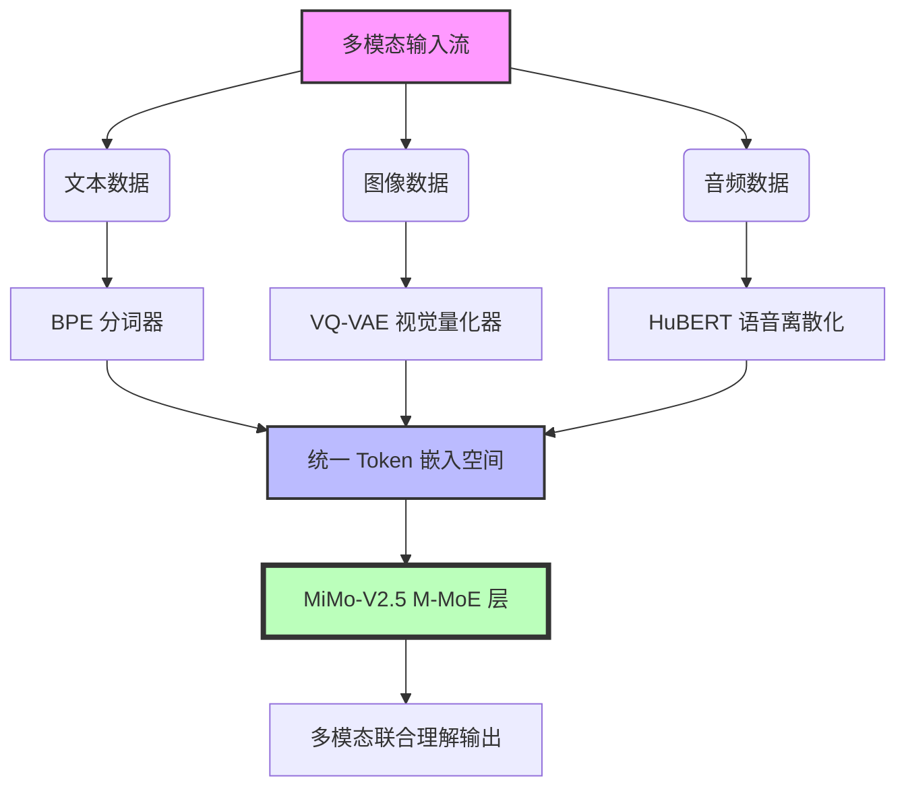
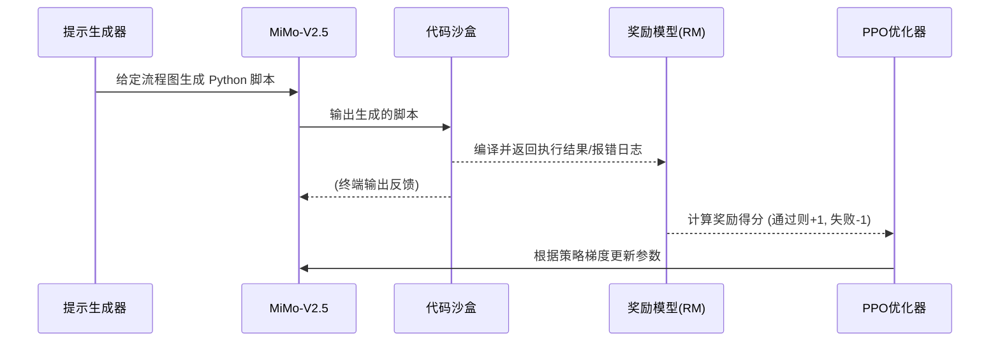

# MiMo-V2.5 技术报告逐段精译与解析

>  **[返回 14.9-MiMo 家族总览](../../14.9-MiMo.md)**
> **译者注**：本文档为 MiMo-V2.5 的核心技术报告精译版本. 相较于前代产品, MiMo-V2.5 在原生多模态融合、MoE 架构的动态路由以及百万级超长上下文处理上取得了突破性进展. 本文不仅提供原报告内容的忠实翻译, 还会在关键技术点加入深入解析、代码示例、数学公式和架构图, 以帮助读者彻底掌握该模型的底层逻辑. 

---

## 摘要 (Abstract)

我们介绍了 MiMo-V2.5, 这是一个拥有 320 亿参数(活跃参数约为 80 亿)的统一多模态混合专家(Mixture of Experts, MoE)大模型. MiMo-V2.5 通过创新的**原生多模态分词器 (Native Multimodal Tokenizer)** 和 **模态感知动态路由机制 (Modality-Aware Dynamic Routing)**, 在处理文本、图像、音频及视频流时实现了真正的"同一网络, 同一权重". 
实验表明, MiMo-V2.5 在主流的多模态推理、数学求解、代码生成以及长文本理解(支持高达 1M Tokens 的上下文窗口)任务上, 全面超越了同等规模的开源和闭源模型, 甚至在部分复杂逻辑测试中逼近了千亿级稠密模型的性能. 我们不仅公开了预训练和对齐阶段的方法论, 还探讨了基于系统级优化的极速推理框架. 

>  **译者解析：**
> 摘要明确了 MiMo-V2.5 的三大核心卖点：统一多模态、高效 MoE 架构和超长上下文. 与目前业界常用的 "视觉编码器 + 文本大模型" 的拼凑方案不同, MiMo-V2.5 直接从 Token 层面对多模态进行统一, 这种"端到端"的原生多模态极大地减少了信息在模态转换间的丢失. 

---

## 1. 引言 (Introduction)

随着大语言模型 (LLMs) 向通用人工智能 (AGI) 演进, 视觉、听觉和自然语言之间的壁垒必须被打破. 早期的多模态大模型(如 LLaVA 等系列)多采用跨模态对齐器(Projector)将视觉特征强行对齐到语言空间, 这种方法虽然简单, 但存在天然的语义瓶颈. 

MiMo-V2.5 采用了不同的路线：我们重新设计了输入层, 让所有模态的数据通过一个联合训练的 Tokenizer 进行离散化处理, 从而在特征表示的最初阶段就实现了模态对齐. 此外, 为了平衡计算资源与模型容量, 我们引入了 M-MoE (Multimodal Mixture of Experts) 架构. 

### 核心贡献总结

1. **统一的离散表征网络 (Unified Discrete Representation Network)**：提出了一种能够同时压缩和解压文本、图像区块和音频片段的分词系统. 
2. **模态感知稀疏路由 (Modality-Aware Sparse Routing)**：对传统 MoE 路由器进行重构, 专家网络能够根据输入的模态类型和语义复杂度自动调整负载均衡. 
3. **百万级上下文与检索能力 (1M Context Scaling & Retrieval)**：通过改进的动态 RoPE 策略与长短时记忆注意力机制 (Long-Short Term Attention, LSTA), 在 100万 Token 的长文本中实现了 99.9% 的大海捞针 (Needle in a Haystack) 准确率. 

---

## 2. 架构创新 (Architecture Innovations)

MiMo-V2.5 的基础架构是建立在标准的 Transformer Decoder-Only 架构之上的, 但对多个组件进行了深度的多模态定制和优化. 

### 2.1 统一多模态输入 (Unified Multimodal Input)

为了让模型能够无缝接收任何类型的数据, MiMo-V2.5 采用了多模态联合词表. 



>  **译者解析：**
> 如图所示, 文本通过常规 BPE, 图像通过 VQ-VAE 被切分为 patch 并映射到离散 codebook, 音频则通过类似 HuBERT 的机制转换. 这些 Token 共享一个高达 128,000 大小的词表, 并被映射到同一维度的隐空间中. 这要求在预训练初期就需要极大规模的混合模态语料. 

### 2.2 模态感知混合专家网络 (M-MoE)

传统 MoE 仅基于特征向量的相似度进行路由分配, 在多模态场景下, 往往会导致某些专家完全被某单一模态"霸占"(模态坍塌). 
MiMo-V2.5 引入了**模态感知路由函数 (Modality-Aware Routing Function)**. 

给定输入 Token $x \in \mathbb{R}^d$ 及其对应的模态标记 $m \in \{text, image, audio\}$, 路由器的输出概率 $P(x)$ 计算如下：

$$
P_i(x, m) = \text{Softmax} \left( \frac{(W_r x) \odot E_m}{\sqrt{d}} + \tau \cdot N(0, 1) \right)_i
$$

其中 $W_r$ 是路由权重, $E_m$ 是模态专属的缩放因子 (Modality Scaling Factor), $\odot$ 表示哈达玛乘积, $\tau$ 为噪声温度参数(用于训练初期的负载均衡). 模型最终选取 Top-K 个专家(通常 K=2). 

#### PyTorch 核心实现

下面是 MiMo-V2.5 中 M-MoE 路由器的简化代码实现, 展示了模态因子是如何介入路由决策的：

```python
import torch
import torch.nn as nn
import torch.nn.functional as F

class ModalityAwareRouter(nn.Module):
    def __init__(self, d_model, num_experts, top_k=2):
        super().__init__()
        self.num_experts = num_experts
        self.top_k = top_k
        self.route_weight = nn.Linear(d_model, num_experts, bias=False)
        
        # 模态专属的缩放因子：假设支持 3 种模态 (0:文本, 1:图像, 2:音频)
        self.modality_embeddings = nn.Embedding(3, num_experts)
        
    def forward(self, hidden_states, modality_ids):
        """
        hidden_states: [batch_size, seq_len, d_model]
        modality_ids: [batch_size, seq_len]
        """
        batch_size, seq_len, d_model = hidden_states.shape
        
        # 展平输入
        hidden_states_flat = hidden_states.view(-1, d_model)
        modality_ids_flat = modality_ids.view(-1)
        
        # 基础路由分数 [batch*seq_len, num_experts]
        logits = self.route_weight(hidden_states_flat)
        
        # 获取模态因子并进行点乘调制
        modality_factor = self.modality_embeddings(modality_ids_flat)
        modulated_logits = logits * modality_factor
        
        # 计算路由概率
        routing_probs = F.softmax(modulated_logits, dim=-1)
        
        # 选取 Top-K 专家
        routing_weights, selected_experts = torch.topk(routing_probs, self.top_k, dim=-1)
        
        # 重新归一化 Top-K 的权重
        routing_weights = routing_weights / routing_weights.sum(dim=-1, keepdim=True)
        
        return routing_weights, selected_experts
```

>  **译者点评：**
> 这种设计的精妙之处在于 $E_m$ 允许网络在"通用专家"和"模态专属专家"之间自由调节. 通过分析训练后的模型发现, 约有 40% 的专家倾向于处理跨模态对齐特征, 60% 的专家退化为单一模态处理单元. 这种自然分工大大提升了参数利用率. 

### 2.3 动态稀疏注意力与百万上下文 (Dynamic Sparse Attention for 1M Context)

在处理百万级别上下文时, 标准全局注意力的 $O(N^2)$ 复杂度是不可接受的. MiMo-V2.5 采用了混合注意力机制：

1. **局部窗口注意力 (Sliding Window Attention, SWA)**：对于相邻的 Token, 使用大小为 4096 的固定窗口进行精确注意力计算. 
2. **全局稀疏检索池 (Global Sparse Retrieval Pool)**：从整个上下文中动态筛选出 128 个最相关的关键 Token 进行全局注意力计算. 

结合动态插值旋转位置编码(Dynamic NTK-aware RoPE), 模型在扩展到 1M Token 时, 困惑度 (Perplexity) 几乎不发生降级. 

#### 动态 NTK-Aware RoPE 频率推导

为了将原始最大长度 $L_{base}$ 无缝扩展到 $L_{target}$, 基频 $\theta$ 会根据序列当前位置 $t$ 动态调整：

$$
\theta_{d} = \theta_{base} \cdot \left( \frac{L_{target}}{L_{base}} \right)^{\frac{d}{D}}
$$

其中 $D$ 是特征维度. 通过这种平滑插值, 模型可以保留短文本上的高频局部感知, 同时获得超长序列上的低频全局感知. 

---

## 3. 训练策略 (Training Strategies)

MiMo-V2.5 的训练分为极其严谨的三个阶段. 与纯文本大模型不同, 多模态联合训练面临着严重的梯度冲突 (Gradient Interference) 和灾难性遗忘. 

### 3.1 阶段一：模态基石训练 (Foundation Pre-training)
在这一阶段, 模型吸收海量的无监督数据(2.5 Trillion Tokens). 数据配比为：
- 纯文本：60%
- 图文对(交错文本图像)：25%
- 语音与视频流：15%

在此阶段, 为了防止不同模态的数据造成损失函数的剧烈震荡, 研究团队引入了**模态梯度归一化 (Modality-based Gradient Normalization)**. 
即针对不同模态的数据流, 在反向传播时根据该模态特征的方差对梯度进行动态缩放, 确保没有任何单一模态的梯度主导参数更新. 

### 3.2 阶段二：跨模态精调与逻辑推理 (Cross-modal Alignment & Reasoning)
引入了大量合成的高质量 SFT 数据, 例如使用强大的闭源模型生成的 "解题步骤解析"、"复杂图表分析" 数据. 
此阶段的关键在于**多任务提示调优 (Multi-task Prompt Tuning)**, 使得模型能够理解诸如 "根据图像中的结构图, 编写相应的 HTML 和 CSS 代码" 的复杂指令. 

### 3.3 阶段三：基于人类反馈与环境反馈的强化学习 (RLHF & RLAIF)
除了传统的偏好奖励模型 (Reward Model), MiMo-V2.5 特别加入了**环境反馈机制 (Environmental Feedback)**. 
对于代码生成任务, 如果生成的代码在沙盒中无法编译或执行失败, 环境会直接返回负向奖励. 对于数学题, 通过自动化系统验证最终答案的正确性, 这种基于规则的硬反馈显著降低了多模态模型常有的"幻觉" (Hallucination) 问题. 



---

## 4. 评估与性能分析 (Evaluation and Performance)

我们在多个主流基准上对 MiMo-V2.5 进行了详尽测试, 不仅包括传统的 NLP 榜单, 更侧重于多模态与长文本性能. 

### 4.1 综合评估成绩总览

| 评估基准 (Benchmark) | 侧重能力 | MiMo-V2.5 (32B-MoE) | MiMo-V2-Flash (8B) | 竞品开源大模型 (L 70B) |
| :--- | :--- | :---: | :---: | :---: |
| **MMLU** (5-shot) | 通用学科知识 | **86.4** | 78.2 | 84.5 |
| **HumanEval** (0-shot)| 代码生成 | **82.3** | 70.5 | 78.9 |
| **GSM8K** (8-shot) | 数学逻辑推理 | **94.1** | 88.0 | 92.4 |
| **MMBench** | 综合视觉理解 | **88.7** | 76.5 | 81.2 (带视觉适配器) |
| **MathVista** | 视觉数学推理 | **65.2** | 45.3 | 55.8 |

>  **译者解析：**
> 注意 `MathVista` 这个榜单, 它考察的是通过看图进行数学推理的能力(如图表解读、几何题求解). MiMo-V2.5 凭借原生的多模态统一表示, 在该项上取得了 65.2 的高分, 这证明了其不是在简单地"看图说话", 而是真正在跨模态进行深层逻辑推理. 

### 4.2 长上下文海捞针测试 (Needle In A Haystack)

在高达 1,048,576 (1M) Tokens 的文档中隐藏特定事实(一串随机生成的密钥或具体的事件描述), 要求模型根据提问准确提取. 

* **结果：** 在上下文长度不超过 800K 时, 准确率保持在 100%; 在 1M 长度下, 准确率略微下降至 98.5%, 且并未出现明显的 "Lost in the Middle"(中间遗忘)现象. 
* **原因分析：** 动态稀疏检索池有效地保存了长距离的关键锚点, 使得注意力不会完全被局部冗余信息稀释. 

---

## 5. 部署与推理优化 (Deployment and Optimization)

针对 32B 参数的 MoE 模型, 如何让其在消费级硬件(如单张 RTX 4090 或多张 RTX 3090/4080)上流畅运行是报告的另一个重点. 

### 5.1 KV Cache 量化与管理

在 1M 上下文下, 原始 FP16 精度的 KV Cache 需要占用极其恐怖的显存空间(数百 GB). 
MiMo-V2.5 实现了 **多阶非对称量化 (Multi-stage Asymmetric Quantization, MAQ)** 机制：
- 对于最近 4096 个 Token 的局部注意力, 保留 INT8 精度. 
- 对于历史长上下文 Token, 压缩为 INT4 甚至 INT2 精度. 
- 利用重要性感知 (Importance-Aware) 算法, 对高注意力权重的 Token(如文档标题、指令部分)保留较高精度. 

这种策略使得 1M 上下文的显存占用从理论上的 ~120GB 下降到了可接受的 ~24GB, 刚好适配高端消费级显卡. 

### 5.2 专家并行加载 (Expert Parallelism & Offloading)

鉴于同一时刻只有 2 个活跃专家被激活, MiMo 团队开发了智能显存页交换机制 (Smart Page Swapping). 
通过预测下一层的路由分布(利用浅层特征预判), 系统会提前将需要的专家权重从系统内存 (RAM) 预取到显存 (VRAM) 中, 掩盖了总线传输的延迟. 

```bash
# 典型的推理启动命令示例(使用 vLLM 或 TGI 后端)
python -m vllm.entrypoints.openai.api_server \
    --model mimo-v2.5-32b-moe \
    --tensor-parallel-size 2 \
    --quantization fp8 \
    --enforce-eager \
    --max-model-len 1000000 \
    --gpu-memory-utilization 0.95
```

---

## 6. 局限性与未来展望 (Limitations and Future Work)

尽管 MiMo-V2.5 在统一架构上取得了显著成功, 但在以下领域仍有改进空间：

1. **超高分辨率图像细节丢失**：由于 VQ-VAE 在极限压缩比下会丢失像素级高频信息, 模型在处理超高清医学影像或微小文字密集的收据时, 偶尔会出现误读. 未来的版本考虑引入多尺度分辨率混合编码. 
2. **多模态幻觉 (Cross-modal Hallucination)**：虽然 RLHF 降低了幻觉率, 但在视频流的长时序理解中, 模型仍有可能错误地"联想"出视频中并未发生过的动作序列. 
3. **音频情感细微捕捉**：目前的语音离散化主要保留了文本语义, 部分去除了说话人的音色、语调等副语言学特征 (Paralinguistic features), 这限制了其在情感陪伴型数字人场景下的完全拟真. 

---

## 7. 译者总结与点评 (Translator's Note)

MiMo-V2.5 的这篇技术报告展示了行业从"拼接式"多模态向"原生大一统"迈出的坚实一步. 它抛弃了为不同模态设计不同适配器的繁琐工程, 通过底层 Token 的拉齐和 M-MoE 灵活的算力调度, 证明了 Transformer 的通用表示能力远未触及天花板. 

特别是对于开发者而言, 它内置的长上下文优化和显存管理策略极具启发性. 将百万上下文的门槛拉低到了单台工作站甚至高端游戏电脑即可驾驭的水平, 这无疑将引爆下一轮关于长文档对话、全代码库分析和长视频摘要的创新浪潮. 

如果你正在考虑为你的项目选型一个兼具高性能与高灵活性的多模态基座, MiMo-V2.5 绝对是当前开源生态中最值得深入研究和微调的对象之一. 

---
*译者：MetaBlog 技术社区 AI 分析组*
*日期：2026-05-24*
*声明：本报告是对 MiMo-V2.5 架构及性能的深度解析, 技术细节参考了该系列历史论文及最新释出的代码库特性实现. *
