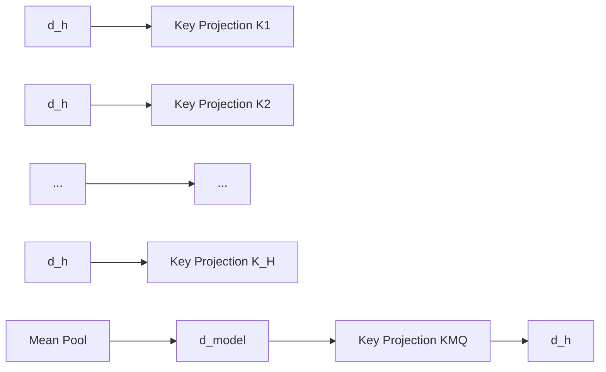
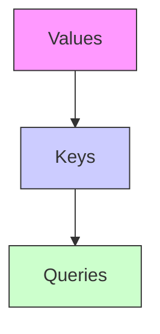
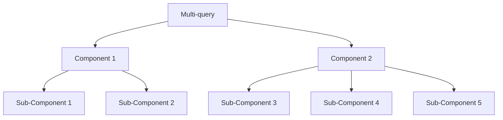

```mermaid
graph TD
    A["Yellow Block"] --> B["Red Block"]
    B --> C["Blue Block"]
    C --> D["Red Block"]
    D --> E["Blue Block"]
    E --> F["Red Block"]
    F --> G["Blue Block"]
    G --> H["Red Block"]
    H --> I["Blue Block"]
    I --> J["Red Block"]
    J --> K["Blue Block"]
    K --> L["Red Block"]
    L --> M["Blue Block"]
    M --> N["Red Block"]
    N --> O["Blue Block"]
    O --> P["Red Block"]
    P --> Q["Blue Block"]
    Q --> R["Red Block"]
    R --> S["Blue Block"]
    S --> T["Red Block"]
    T --> U["Blue Block"]
    U --> V["Red Block"]
    V --> W["Blue Block"]
    W --> X["Red Block"]
    X --> Y["Blue Block"]
    Y --> Z["Red Block"]
    Z --> AA["Blue Block"]
```

# GQA: Training Generalized Multi-Query Transformer Models from Multi-Head Checkpoints

Joshua Ainslie∗, James Lee-Thorp∗, Michiel de Jong∗ † Yury Zemlyanskiy, Federico Lebrón, Sumit Sanghai

Google Research

# Abstract

Multi-query attention (MQA), which only uses a single key-value head, drastically speeds up decoder inference. However, MQA can lead to quality degradation, and moreover it may not be desirable to train a separate model just for faster inference. We (1) propose a recipe for uptraining existing multi-head language model checkpoints into models with MQA using 5% of original pre-training compute, and (2) introduce grouped-query attention (GQA), a generalization of multi-query attention which uses an intermediate (more than one, less than number of query heads) number of key-value heads. We show that uptrained GQA achieves quality close to multi-head attention with comparable speed to MQA.

# 1 Introduction

Autoregressive decoder inference is a severe bottleneck for Transformer models due to the memory bandwidth overhead from loading decoder weights and all attention keys and values at every decoding step (Shazeer, 2019; Pope et al., 2022; de Jong et al., 2022). The memory bandwidth from loading keys and values can be sharply reduced through multi-query attention (Shazeer, 2019), which uses multiple query heads but single key and value heads.

However, multi-query attention (MQA) can lead to quality degradation and training instability, and it may not be feasible to train separate models optimized for quality and inference. Moreover, while some language models already use multiquery attention, such as PaLM (Chowdhery et al., 2022), many do not, including publicly available language models such as T5 (Raffel et al., 2020) and LLaMA (Touvron et al., 2023).

This work contains two contributions for faster inference with large language models. First, we show that language model checkpoints with multihead attention (MHA) can be uptrained (Komatsuzaki et al., 2022) to use MQA with a small fraction of original training compute. This presents a cost-effective method to obtain fast multi-query as well as high-quality MHA checkpoints.

Second, we propose grouped-query attention (GQA), an interpolation between multi-head and multi-query attention with single key and value heads per subgroup of query heads. We show that uptrained GQA achieves quality close to multihead attention while being almost as fast as multiquery attention.

# 2 Method

# 2.1 Uptraining

Generating a multi-query model from a multi-head model takes place in two steps: first, converting the checkpoint, and second, additional pre-training to allow the model to adapt to its new structure. Figure 1 shows the process for converting a multi-head checkpoint into a multi-query checkpoint. The projection matrices for key and value heads are mean pooled into single projection matrices, which we find works better than selecting a single key and value head or randomly initializing new key and value heads from scratch.

flowchart

Figure 1: Overview of conversion from multi-head to multi-query attention. Key and value projection matrices from all heads are mean pooled into a single head.

flowchart

flowchart

flowchart

Figure 2: Overview of grouped-query method. Multi-head attention has H query, key, and value heads. Multi-query attention shares single key and value heads across all query heads. Grouped-query attention instead shares single key and value heads for each group of query heads, interpolating between multi-head and multi-query attention.

a small proportion α of its original training steps on the same pre-training recipe.

# 2.2 Grouped-query attention

Grouped-query attention divides query heads into G groups, each of which shares a single key head and value head. GQA-G refers to grouped-query with G groups. GQA-1, with a single group and therefore single key and value head, is equivalent to MQA, while GQA-H, with groups equal to number of heads, is equivalent to MHA. Figure 2 shows a comparison of grouped-query attention and multihead/multi-query attention. When converting a multi-head checkpoint to a GQA checkpoint, we construct each group key and value head by meanpooling all the original heads within that group.

An intermediate number of groups leads to an interpolated model that is higher quality than MQA but faster than MHA, and, as we will show, represents a favorable trade-off. Going from MHA to MQA reduces H key and value heads to a single key and value head, reducing the size of the key-value cache and therefore amount of data that needs to be loaded by a factor of H. However, larger models generally scale the number of heads, such that multi-query attention represents a more aggressive cut in both memory bandwidth and capacity. GQA lets us keep the same proportional decrease in bandwidth and capacity as model size increases.

Moreover, larger models suffer relatively less from memory bandwidth overhead from attention, as the KV-cache scales with model dimension while model FLOPs and parameters scale with the square of model dimension. Finally, standard sharding for large models replicates the single key and value head by the number of model partitions (Pope et al., 2022); GQA removes the waste from such partitioning. Therefore, we expect GQA to present a particularly good trade-off for larger models.

We note that GQA is not applied to the encoder self-attention layers; encoder representations are computed in parallel, and memory bandwidth is therefore generally not the primary bottleneck.

# 3 Experiments

# 3.1 Experimental setup

Configurations All models are based on the T5.1.1 architecture (Raffel et al., 2020), implemented with JAX (Bradbury et al., 2018), Flax (Heek et al., 2020), and Flaxformer1. For our main experiments we consider T5 Large and XXL with multi-head attention, as well as uptrained versions of T5 XXL with multi-query and grouped-query attention. We use the Adafactor optimizer with the same hyperparameters and learning rate schedule as T5 (Raffel et al., 2020). We apply MQA and GQA to decoder self-attention and cross-attention, but not encoder self-attention.

Uptraining Uptrained models are initialized from public T5.1.1 checkpoints. The key and value heads are mean-pooled to the appropriate MQA or GQA structure, and then pre-trained for a further α proportion of original pre-training steps with the original pre-training setup and dataset from (Raffel et al., 2020). For α = 0.05, training took approximately 600 TPUv3 chip-days.

Data We evaluate on summarization datasets CNN/Daily Mail (Nallapati et al., 2016), arXiv and PubMed (Cohan et al., 2018), MediaSum (Zhu et al., 2021), and Multi-News (Fabbri et al., 2019);

<table><tr><td>Model</td><td>Tinfer</td><td>Average</td><td>CNN</td><td>arXiv</td><td>PubMed</td><td>MediaSum</td><td>MultiNews</td><td>WMT</td><td>TriviaQA</td></tr><tr><td></td><td>s</td><td></td><td>R1</td><td>R1</td><td>R1</td><td>R1</td><td>R1</td><td>BLEU</td><td>F1</td></tr><tr><td>MHA-Large</td><td>0.37</td><td>46.0</td><td>42.9</td><td>44.6</td><td>46.2</td><td>35.5</td><td>46.6</td><td>27.7</td><td>78.2</td></tr><tr><td>MHA-XXL</td><td>1.51</td><td>47.2</td><td>43.8</td><td>45.6</td><td>47.5</td><td>36.4</td><td>46.9</td><td>28.4</td><td>81.9</td></tr><tr><td>MQA-XXL</td><td>0.24</td><td>46.6</td><td>43.0</td><td>45.0</td><td>46.9</td><td>36.1</td><td>46.5</td><td>28.5</td><td>81.3</td></tr><tr><td>GQA-8-XXL</td><td>0.28</td><td>47.1</td><td>43.5</td><td>45.4</td><td>47.7</td><td>36.3</td><td>47.2</td><td>28.4</td><td>81.6</td></tr></table>

Table 1: Inference time and average dev set performance comparison of T5 Large and XXL models with multi-head attention, and 5% uptrained T5-XXL models with multi-query and grouped-query attention on summarization datasets CNN/Daily Mail, arXiv, PubMed, MediaSum, and MultiNews, translation dataset WMT, and questionanswering dataset TriviaQA.

translation dataset WMT 2014 English-to-German; and question answering dataset TriviaQA (Joshi et al., 2017). We do not evaluate on popular classification benchmarks such as GLUE (Wang et al., 2019) as autoregressive inference is less applicable for those tasks.

Fine-tuning For fine-tuning, we use a constant learning rate of 0.001, batch size 128, and dropout rate 0.1 for all tasks. CNN/Daily Mail and WMT use input length of 512 and output length 256. Other summarization datasets use input length 2048 and output length 512. Finally, TriviaQA uses input length 2048 and output length 32. We train until convergence and select the checkpoint with the highest dev performance. We use greedy decoding for inference.

Timing We report time per sample per TPUv4 chip, as measured by xprof (Google, 2020). For timing experiments we use 8 TPUs with the largest batch size that fits up to 32 per TPU, and parallelization optimized separately for each model.

# 3.2 Main results

Figure 3 shows average performance over all datasets as a function of average inference time for MHA T5-Large and T5-XXL, and uptrained MQA and GQA-8 XXL models with uptraining proportion $\alpha \ : = \ : 0 . 0 5$ . We see that a larger uptrained MQA model provides a favorable tradeoff relative to MHA models, with higher quality and faster inference than MHA-Large. Moreover, GQA achieves significant additional quality gains, achieving performance close to MHA-XXL with speed close to MQA. Table 1 contains full results for all datasets.

# 3.3 Ablations

This section presents experiments to investigate the effect of different modeling choices. We evaluate performance on a representive subsample of tasks: CNN/Daily Mail, (short-form summarization), MultiNews (long-form summarization), and TriviaQA (question-answering).

scatter

| Method     | Time per sample (ms) | Performance |
| ---------- | --------------------- | ----------- |
| GQA-XXL    | 0.2                   | 47.0        |
| MQA-XXL    | 0.2                   | 46.5        |
| MHA-XXL    | 1.5                   | 47.2        |
| MHA-Large  | 0.4                   | 45.9        |

Figure 3: Uptrained MQA yields a favorable tradeoff compared to MHA with higher quality and faster speed than MHA-Large, and GQA achieves even better performance with similar speed gains and comparable quality to MHA-XXL. Average performance on all tasks as a function of average inference time per sample for T5-Large and T5-XXL with multihead attention, and 5% uptrained T5-XXL with MQA and GQA-8 attention.

Checkpoint conversion Figure 4 compares the performance of different methods for checkpoint conversion. Mean pooling appears to work best, followed by selecting a single head and then random initialization. Intuitively, results are ordered by the degree to which information is preserved from the pre-trained model.

Uptraining steps Figure 5 shows how performance varies with uptraining proportion for T5 XXL with MQA and GQA. First, we note that GQA already achieves reasonable performance after conversion while MQA requires uptraining to be useful. Both MQA and GQA gain from 5% uptraining with diminishing returns from 10%.

bar

| Category | Value |
|---|---|
| Mean | 55.5 |
| First | 55.4 |
| Random | 55.2 |

Figure 4: Performance comparison of different checkpoint conversion methods for T5-Large uptrained to MQA with proportion $\alpha = 0 . 0 5$ . ‘Mean’ mean-pools key and value heads, ‘First’ selects the first head and ‘Random’ initializes heads from scratch.

line

| Uptraining proportion α | MHA  | GQA  | MQA  |
| ----------------------- | ---- | ---- | ---- |
| 0                       | 57.5 | 56.8 | 54.0 |
| 0.05                    | 57.5 | 57.3 | 56.9 |
| 0.1                     | 57.5 | 57.5 | 57.2 |

Figure 5: Performance as a function of uptraining proportion for T5 XXL models with MQA and GQA-8.

Number of groups Figure 6 demonstrates the effect of the number of GQA groups on inference speed. For larger models the memory bandwidth overhead from the KV cache is less constraining (Shazeer, 2019), while the reduction in key-value size is sharper due to the increased number of heads. As a result, increasing the number of groups from MQA only results in modest slowdowns initially, with increasing cost as we move closer to MHA. We selected 8 groups as a favorable middle ground.

# 4 Related Work

This work is focused on achieving a better tradeoff between decoder quality and inference time through reducing the memory bandwidth overhead (Williams et al., 2009) from loading keys and values. Shazeer (2019) first proposed reducing this overhead through multi-query attention. Follow-up work showed that multi-query attention is especially helpful for long inputs (Pope et al., 2022; de Jong et al., 2022). Rabe (2023) independently developed GQA with public implementation. Other works have explored grouping attention heads for computational efficiency (Park et al., 2020; Luo et al., 2022; Ni et al., 2023) without focusing specifically on key-value heads, which determine memory bandwidth overhead.

line

| GQA groups | MHA  | GQA  | MQA  |
| ---------- | ---- | ---- | ---- |
| 1          | 2.5  | 0.5  | 0.5  |
| 4          | 2.5  | 0.5  | 0.5  |
| 8          | 2.5  | 0.5  | 0.5  |
| 16         | 2.5  | 0.5  | 0.5  |
| 32         | 2.5  | 0.7  | 0.5  |
| 64         | 2.5  | 2.5  | 0.5  |

Figure 6: Time per sample for GQA-XXL as a function of the number of GQA groups with input length 2048 and output length 512. Going from 1 (MQA) to 8 groups adds modest inference overhead, with increasing cost to adding more groups.

A number of other methods have been proposed to reduce memory bandwidth overhead from keys and values, as well as parameters. Flash attention (Dao et al., 2022) structures the attention computation to avoid materializing the quadratic attention scores, reducing memory and speeding up training. Quantization (Dettmers et al., 2022; Frantar et al., 2022) reduces the size of weights and activations, including keys and values, by lowering precision. Model distillation (Hinton et al., 2015; Gou et al., 2021) instead reduces model size at a given precision, using data generated from the larger model to finetune the smaller model. Layersparse cross-attention (de Jong et al., 2022) eliminates most cross-attention layers which make up the primary expense for longer inputs. Speculative sampling (Chen et al., 2023; Leviathan et al., 2022) ameliorates the memory bandwidth bottleneck by proposing multiple tokens with a smaller model which are then scored in parallel by a larger model.

Finally, the uptraining procedure we propose is inspired by Komatsuzaki et al. (2022), which uptrains standard T5 checkpoints into sparsely activated Mixture-of-Experts models.

# 5 Conclusion

Language models are expensive for inference primarily due to the memory bandwidth overhead from loading keys and values. Multi-query attention reduces this overhead at the cost of decreased model capacity and quality. We propose to convert multi-head attention models to multi-query models with a small fraction of original pre-training compute. Moreover, we introduce grouped-query attention, an interpolation of multi-query and multi-head attention that achieves quality close to multi-head at comparable speed to multi-query attention.

# Limitations

This paper focuses on ameliorating the memory bandwidth overhead from loading keys and values. This overhead is most important when generating longer sequences, for which quality is inherently difficult to evaluate. For summarization we employ Rouge score, which we know is a flawed evaluation that does not tell the whole story; for that reason, it is difficult to be certain our trade-offs are correct. Due to limited computation, we also do not compare our XXL GQA model to a comparitive model trained from scratch, so we do not know the relative performance of uptraining vs training from scratch. Finally, we evaluate the impact of uptraining and GQA only on encoder-decoder models. Recently, decoder-only models are extremely popular, and since these models do not have separate self-attention and cross-attention, we expect GQA to have a stronger advantage over MQA.

# Acknowlegements

We thank Santiago Ontañón, Afroz Mohiuddin, William Cohen and others at Google Research for insightful advice and discussion.

# References

James Bradbury, Roy Frostig, Peter Hawkins, Matthew James Johnson, Chris Leary, Dougal Maclaurin, George Necula, Adam Paszke, Jake VanderPlas, Skye Wanderman-Milne, and Qiao Zhang. 2018. JAX: composable transformations of Python+NumPy programs.   
Charlie Chen, Sebastian Borgeaud, Geoffrey Irving, Jean-Baptiste Lespiau, Laurent Sifre, and John Jumper. 2023. Accelerating large language model decoding with speculative sampling. CoRR, abs/2302.01318.

Aakanksha Chowdhery, Sharan Narang, Jacob Devlin, Maarten Bosma, Gaurav Mishra, Adam Roberts, Paul Barham, Hyung Won Chung, Charles Sutton, Sebastian Gehrmann, Parker Schuh, Kensen Shi, Sasha Tsvyashchenko, Joshua Maynez, Abhishek Rao, Parker Barnes, Yi Tay, Noam Shazeer, Vinodkumar Prabhakaran, Emily Reif, Nan Du, Ben Hutchinson, Reiner Pope, James Bradbury, Jacob Austin, Michael Isard, Guy Gur-Ari, Pengcheng Yin, Toju Duke, Anselm Levskaya, Sanjay Ghemawat, Sunipa Dev, Henryk Michalewski, Xavier Garcia, Vedant Misra, Kevin Robinson, Liam Fedus, Denny Zhou, Daphne Ippolito, David Luan, Hyeontaek Lim, Barret Zoph, Alexander Spiridonov, Ryan Sepassi, David Dohan, Shivani Agrawal, Mark Omernick, Andrew M. Dai, Thanumalayan Sankaranarayana Pillai, Marie Pellat, Aitor Lewkowycz, Erica Moreira, Rewon Child, Oleksandr Polozov, Katherine Lee, Zongwei Zhou, Xuezhi Wang, Brennan Saeta, Mark Diaz, Orhan Firat, Michele Catasta, Jason Wei, Kathy Meier-Hellstern, Douglas Eck, Jeff Dean, Slav Petrov, and Noah Fiedel. 2022. Palm: Scaling language modeling with pathways.   
Arman Cohan, Franck Dernoncourt, Doo Soon Kim, Trung Bui, Seokhwan Kim, Walter Chang, and Nazli Goharian. 2018. A discourse-aware attention model for abstractive summarization of long documents. In Proceedings of the 2018 Conference of the North American Chapter of the Association for Computational Linguistics: Human Language Technologies, Volume 2 (Short Papers), pages 615–621, New Orleans, Louisiana. Association for Computational Linguistics.   
Tri Dao, Daniel Y. Fu, Stefano Ermon, Atri Rudra, and Christopher Ré. 2022. Flashattention: Fast and memory-efficient exact attention with io-awareness. CoRR, abs/2205.14135.   
Michiel de Jong, Yury Zemlyanskiy, Joshua Ainslie, Nicholas FitzGerald, Sumit Sanghai, Fei Sha, and William Cohen. 2022. FiDO: Fusion-in-decoder optimized for stronger performance and faster inference. arXiv preprint arXiv:2212.08153.   
Tim Dettmers, Mike Lewis, Younes Belkada, and Luke Zettlemoyer. 2022. Llm.int8(): 8-bit matrix multiplication for transformers at scale. CoRR, abs/2208.07339.   
Alexander R. Fabbri, Irene Li, Tianwei She, Suyi Li, and Dragomir R. Radev. 2019. Multi-news: A large-scale multi-document summarization dataset and abstractive hierarchical model. In Proceedings of the 57th Conference of the Association for Computational Linguistics, ACL 2019, Florence, Italy, July 28- August 2, 2019, Volume 1: Long Papers, pages 1074–1084. Association for Computational Linguistics.   
Elias Frantar, Saleh Ashkboos, Torsten Hoefler, and Dan Alistarh. 2022. GPTQ: accurate post-training quantization for generative pre-trained transformers. CoRR, abs/2210.17323.

Google. 2020. Profile your model with cloud tpu tools. https://cloud.google.com/tpu/docs/ cloud-tpu-tools. Accessed: 2022-11-11.   
Jianping Gou, Baosheng Yu, Stephen J. Maybank, and Dacheng Tao. 2021. Knowledge distillation: A survey. Int. J. Comput. Vis., 129(6):1789–1819.   
Jonathan Heek, Anselm Levskaya, Avital Oliver, Marvin Ritter, Bertrand Rondepierre, Andreas Steiner, and Marc van Zee. 2020. Flax: A neural network library and ecosystem for JAX.   
Geoffrey E. Hinton, Oriol Vinyals, and Jeffrey Dean. 2015. Distilling the knowledge in a neural network. CoRR, abs/1503.02531.   
Mandar Joshi, Eunsol Choi, Daniel S. Weld, and Luke Zettlemoyer. 2017. Triviaqa: A large scale distantly supervised challenge dataset for reading comprehension. In Proceedings of the 55th Annual Meeting of the Association for Computational Linguistics, Vancouver, Canada. Association for Computational Linguistics.   
Aran Komatsuzaki, Joan Puigcerver, James Lee-Thorp, Carlos Riquelme Ruiz, Basil Mustafa, Joshua Ainslie, Yi Tay, Mostafa Dehghani, and Neil Houlsby. 2022. Sparse upcycling: Training mixture-of-experts from dense checkpoints.   
Yaniv Leviathan, Matan Kalman, and Yossi Matias. 2022. Fast inference from transformers via speculative decoding. CoRR, abs/2211.17192.   
Gen Luo, Yiyi Zhou, Xiaoshuai Sun, Yan Wang, Liujuan Cao, Yongjian Wu, Feiyue Huang, and Rongrong Ji. 2022. Towards lightweight transformer via groupwise transformation for vision-and-language tasks. IEEE Trans. Image Process., 31:3386–3398.   
Ramesh Nallapati, Bowen Zhou, Cícero Nogueira dos Santos, Çaglar Gülçehre, and Bing Xiang. 2016. Abstractive text summarization using sequence-tosequence rnns and beyond. In Proceedings of the 20th SIGNLL Conference on Computational Natural Language Learning, CoNLL 2016, Berlin, Germany, August 11-12, 2016, pages 280–290. ACL.   
Jinjie Ni, Rui Mao, Zonglin Yang, Han Lei, and Erik Cambria. 2023. Finding the pillars of strength for multi-head attention. In Proceedings of the 61st Annual Meeting of the Association for Computational Linguistics (Volume 1: Long Papers), ACL 2023, Toronto, Canada, July 9-14, 2023, pages 14526– 14540. Association for Computational Linguistics.   
Sungrae Park, Geewook Kim, Junyeop Lee, Junbum Cha, Ji-Hoon Kim, and Hwalsuk Lee. 2020. Scale down transformer by grouping features for a lightweight character-level language model. In Proceedings of the 28th International Conference on Computational Linguistics, COLING 2020, Barcelona, Spain (Online), December 8-13, 2020, pages 6883–6893. International Committee on Computational Linguistics.

Reiner Pope, Sholto Douglas, Aakanksha Chowdhery, Jacob Devlin, James Bradbury, Anselm Levskaya, Jonathan Heek, Kefan Xiao, Shivani Agrawal, and Jeff Dean. 2022. Efficiently scaling transformer inference. arXiv preprint arXiv:2211.05102.   
Markus Rabe. 2023. Memory-efficient attention. https://github.com/google/flaxformer/ blob/main/flaxformer/components/ attention/memory\_efficient\_attention.py. Accessed: 2023-05-23.   
Colin Raffel, Noam Shazeer, Adam Roberts, Katherine Lee, Sharan Narang, Michael Matena, Yanqi Zhou, Wei Li, and Peter J. Liu. 2020. Exploring the limits of transfer learning with a unified text-to-text transformer. J. Mach. Learn. Res., 21:140:1–140:67.   
Noam Shazeer. 2019. Fast transformer decoding: One write-head is all you need. arXiv preprint arXiv:1911.02150.   
Hugo Touvron, Thibaut Lavril, Gautier Izacard, Xavier Martinet, Marie-Anne Lachaux, Timothée Lacroix, Baptiste Rozière, Naman Goyal, Eric Hambro, Faisal Azhar, Aurelien Rodriguez, Armand Joulin, Edouard Grave, and Guillaume Lample. 2023. Llama: Open and efficient foundation language models.   
Alex Wang, Amanpreet Singh, Julian Michael, Felix Hill, Omer Levy, and Samuel R. Bowman. 2019. GLUE: A multi-task benchmark and analysis platform for natural language understanding. In 7th International Conference on Learning Representations, ICLR 2019, New Orleans, LA, USA, May 6-9, 2019. OpenReview.net.   
Samuel Williams, Andrew Waterman, and David A. Patterson. 2009. Roofline: an insightful visual performance model for multicore architectures. Commun. ACM, 52(4):65–76.   
Chenguang Zhu, Yang Liu, Jie Mei, and Michael Zeng. 2021. Mediasum: A large-scale media interview dataset for dialogue summarization. In Proceedings of the 2021 Conference of the North American Chapter of the Association for Computational Linguistics: Human Language Technologies, NAACL-HLT 2021, Online, June 6-11, 2021, pages 5927–5934. Association for Computational Linguistics.

# A Training Stability

We find that multi-query attention can lead to training instability during fine-tuning, in particular combined with long input tasks. We trained multiple T5-Large models with multi-query attention from scratch. In each case, pre-training suffered from frequent loss spikes and the final models diverged immediately when fine-tuning on long-input tasks. Uptrained multi-query attention models are more stable but still display high variance, so for multiquery models on unstable tasks we report average performance over three fine-tuning runs. Uptrained grouped-query attention models, however, appear to be stable, so we did not investigate futher on the root causes of multi-query instability.