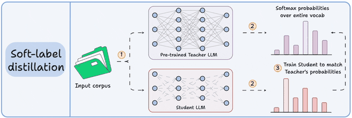
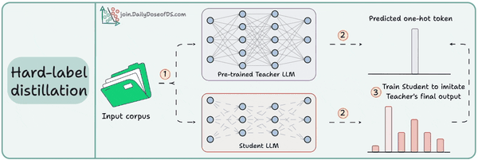
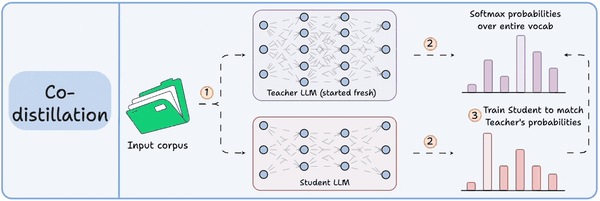

# 3.1.2 知识炼金术: 大语言模型蒸馏技术终极指南

## 1. 蒸馏的哲学 —— 知识的三种形态

知识蒸馏的核心思想源于一个简单的比喻: 一位经验丰富的 **教师模型 (Teacher Model)** , 将其毕生所学传授给一个敏而好学的 **学生模型 (Student Model)** . 学生模型通常结构更简单, 参数量更小. 但要理解这个过程, 我们必须首先定义, 什么是 "知识"? 在模型的世界里, 知识主要以三种形态存在.

### 2.1 基于响应的知识 (Response-Based Knowledge)

这是最直观的知识形态, 指的是教师模型对一个输入给出的最终预测结果.

**类比: 学习菜谱的最终成品.**
教师是一位特级厨师, 他做了一道佛跳墙 (最终预测). 基于响应的知识, 就是让学生厨师去模仿这道菜的最终味道, 摆盘和形态.

这种知识又可细分为两种:

- **硬标签 (Hard Labels):** 教师给出的确定性答案. 例如, 对一张猫的图片, 教师输出的标签就是 "猫" (一个 one-hot 向量).

- **软标签 (Soft Labels):** 教师给出的带有概率分布的答案. 例如, 对同一张图片, 教师可能认为它有 95% 的概率是 "猫", 4% 的概率是 "小老虎", 1% 的概率是 "狗". 这个概率分布 (logits) 蕴含了更丰富的信息, 即不同类别之间的相似性. 学生通过学习这个软标签, 不仅知道答案是猫, 还知道了猫和小老虎在某种程度上是相似的.

图 1: 软标签蒸馏示意图. 学生模型学习匹配教师模型的完整输出概率分布.

### 2.2 基于特征的知识 (Feature-Based Knowledge)

这种知识更加深入, 指的是教师模型在其中间层 (hidden layers) 产生的特征表示.

**类比: 学习菜谱的中间步骤.**
学生厨师不仅要模仿最终的菜品, 还要学习特级厨师处理食材的每一个步骤: 如何吊高汤, 如何发制海参, 如何控制火候. 这些中间步骤就是教师模型的内部特征表示.

通过模仿这些中间特征, 学生模型可以学习到教师模型是如何一步步从原始输入中提取信息, 并进行抽象和推理的. 这对于训练一个更深但更窄的学生网络尤其有效.

图 2: 特征蒸馏示意图. 学生模型学习匹配教师模型中间层的特征图 (Feature Map).

### 2.3 基于关系的知识 (Relation-Based Knowledge)

这是最高阶的知识形态, 它不关注单个样本的输出, 而是关注不同样本或不同特征之间的关系.

**类比: 学习菜谱的底层烹饪哲学.**
学生厨师不再局限于模仿一道菜, 而是开始理解不同食材之间的搭配关系 (如鱼和姜), 不同烹饪技巧之间的关联 (如爆炒和勾芡). 这种关系型知识, 是厨艺能否升华的关键.

在模型中, 这可以表现为学习特征图激活值之间的相关性矩阵, 或不同数据样本输出之间的关系. 这种方法能帮助学生模型掌握教师模型更深层次的 "直觉".

## 2. 核心技术手册 —— 三大蒸馏范式

根据教师和学生模型的训练方式, 知识蒸馏可以分为三种主流范式.

图 3: 三种蒸馏方案对比. 红色表示模型已预训练, 黄色表示模型在蒸馏中学习.

### 2.1 离线蒸馏 (Offline Distillation)

这是最经典和最常见的范式. 教师模型首先被完全训练好并固定, 然后其知识被单向传递给一个从零开始训练的学生模型.

#### 2.1.1 硬标签蒸馏 (数据蒸馏)

这是离线蒸馏中最简单直接的方法.

- **流程:**

1. 使用强大的教师模型 (如 DeepSeek-R1), 对大量的提示 (prompts) 生成高质量的回答.2. 将这些 `<prompt, 教师生成的回答>` 对组成一个新的数据集.3. 使用这个新数据集, 对一个基础的学生模型 (如 Qwen 或 Llama) 进行标准的监督微调 (SFT).

- **优点:** 简单高效, 无需访问教师模型的内部权重或 logits, 仅需调用其 API 即可. 这是蒸馏闭源模型 (如 GPT-4) 的唯一可行方法.

- **缺点:** 知识传递的信息量相对较少, 仅限于最终的输出文本.

图 4: 硬标签蒸馏示意图. 学生模型学习匹配教师模型的 one-hot 输出.

#### 2.1.2 软标签蒸馏 (Logits 蒸馏)

这是 Hinton 等人提出的经典方法, 旨在传递更丰富的知识.

- **流程:**

1. 将输入同时喂给固定的教师模型和待训练的学生模型.2. 获取教师模型的完整 logits 输出 (软标签). 通常会使用一个 **温度 (Temperature, T)** 参数来平滑这个概率分布, $p_i = \frac{\exp(z_i/T)}{\sum_j \exp(z_j/T)}$. 更高的 T 值使分布更 "软", 暴露更多类别间的相似性信息.3. 训练学生模型,使其输出的 logits 分布与教师模型的软标签尽可能接近. 损失函数通常使用 **KL 散度 (Kullback-Leibler Divergence)** .

- **优点:** 传递的知识比硬标签丰富得多, 能有效提升学生模型的性能.

- **缺点:**

1. **访问限制:** 必须能访问教师模型的权重和 logits 输出, 对闭源模型不可行.

2. **存储噩梦:** 存储软标签的成本极高. 假设词汇表大小为 10 万, 语料库有 5 万亿 tokens, 在 float8 精度下, 存储所有软标签将需要约 **500 万 GB** 的空间, 这在工程上几乎是不现实的.

### 2.2 在线蒸馏 (Online Distillation)

与离线蒸馏不同, 在线蒸馏中, 教师和学生模型是同时被训练和更新的, 它们相互学习, 共同进步. 这适用于没有一个强大的预训练教师模型的场景.

#### 2.2.1 协同蒸馏 (Co-distillation)

这是一种典型的在线蒸馏方法, Llama 4 的训练就采用了此策略.

- **流程:**

1. 教师和学生模型都从零开始训练.2. 对于同一个批次的数据, 教师模型依据真实的硬标签进行常规训练.3. 同时, 学生模型不仅学习真实的硬标签, 还学习匹配教师模型在该批次上输出的 **动态软标签**.

- **优点:** 避免了对大型预训练教师的依赖, 整个框架端到端可训练.

- **缺点:** 训练过程更复杂, 需要精心设计的训练策略来平衡教师和学生的学习进度.

图 5: 协同蒸馏示意图. 教师和学生同时训练, 学生学习教师的软标签和数据的硬标签.

### 2.3 自蒸馏 (Self-Distillation)

这是一种特殊的在线蒸馏, 即 "我教我自己". 在同一个网络中, 较深层的知识被用来指导较浅层的学习. 这种方法可以看作是一种隐式的模型正则化, 能有效提升模型的性能和泛化能力, 而无需引入额外的教师模型.

**引导性问题:** 假设你是一家初创公司的 AI 负责人, 预算有限. 你的目标是为特定领域 (如法律文书) 构建一个高性能模型. 你会选择哪种蒸馏范式? 如果你的领域需要一个超大模型 (如 GPT-4) 的知识, 但你无法访问其权重, 你又该如何选择?

## 3. 前沿蒸馏策略

除了三大基本范式, 研究者们还发展出了更多样的蒸馏策略, 以应对更复杂的场景.

- **对抗性蒸馏:** 借鉴生成对抗网络 (GAN) 的思想, 引入一个判别器. 学生模型 (作为生成器) 的目标是生成让判别器无法区分其来源 (是来自学生还是教师) 的特征表示. 这种博弈过程能迫使学生模型学习到更逼真的特征分布.

- **多教师蒸馏:** 与其向一位老师学习, 不如博采众长. 学生模型可以同时从多个不同架构或专长的教师模型中学习, 综合它们的优势. 知识的融合可以通过对教师们输出的 logits 进行加权平均等方式实现.

- **神经架构搜索 (NAS) 中的蒸馏:** 知识蒸馏不仅可以训练一个固定的学生模型, 还可以用来 **寻找最佳的学生架构**. 在 NAS 过程中, 知识蒸馏可以作为一种高效的训练技巧, 帮助评估和筛选海量候选子网络的性能, 从而加速搜索过程, 并找到与教师模型更 "匹配" 的学生. 这就是 "寻找更好的学生来学习" 的思想.

## 4. 案例全景解析 —— DeepSeek-R1 的炼金之路

DeepSeek-R1 的成功及其蒸馏模型的高性能, 为我们提供了一个绝佳的现实世界案例.

### 4.1 DeepSeek 的蒸馏方法论

综合分析可知, DeepSeek 主要采用了 **离线蒸馏** 范式下的 **硬标签蒸馏 (数据蒸馏)** 策略.

- **证据:**

1. **API 调用:** DeepSeek 团队公开的中文蒸馏数据集是通过调用 "企业版满血 R1 API" 生成的. 这表明他们无法访问模型的内部 logits, 只能获取最终生成的文本.

2. **SFT 过程:** DeepSeek 的技术报告明确指出, 他们对学生模型 (如 Qwen, Llama 3.1) 仅进行了监督微调 (SFT), 而没有涉及更复杂的 RL 阶段. 这与硬标签蒸馏的流程完全吻合.

3. **开源数据集:** 发布的 Chinese-DeepSeek-R1-Distill-data-110k 数据集, 其格式就是 `<prompt, response>` 对, 完美适用于 SFT. 该数据集涵盖了数学, 考试, STEM 和通用等多个领域, 体现了数据蒸馏对多样性的要求.

### 4.2 解答: DeepSeek 是否蒸馏了 GPT?

这个问题可以从技术可行性上进行逻辑推理:

- **不是特征蒸馏或 logits 蒸馏:** OpenAI 从未开放 GPT 系列模型的内部权重或 logits 接口, 因此从技术上无法进行基于特征或软标签的蒸馏.

- **可能是数据蒸馏:** 从理论上讲, 任何人都可以调用 GPT 的 API 生成大量的 `<prompt, answer>` 数据, 然后用这些数据去微调自己的模型. DeepSeek 是否这么做过, 外界无法证实. 但这种 "数据蒸馏" 的方式是完全可行的, 也是业界在无法访问模型权重时利用强模型能力的常用手段.

因此, 虽然我们无法断言, 但可以确定的是, 如果存在任何形式的 "蒸馏", 那最有可能也只能是数据蒸馏.

## 5. 参考文献 (References)

- Liu, C. (2024). *Chinese-DeepSeek-R1-Distill-data-110k Dataset*. Hugging Face & ModelScope
- Gou, J., et al. (2021). *Knowledge Distillation: A Survey*. arXiv:2006.05525
- Hinton, G., Vinyals, O., & Dean, J. (2015). *Distilling the Knowledge in a Neural Network*. arXiv:1503.02531
- DeepSeek-AI. (2024). *DeepSeek-R1 Technical Report*
- Panda, Giant. (2022). *一文带你了解知识蒸馏与NAS的那些事*. CSDN Blog
- Multiple authors from Zhihu and WeChat Official Accounts providing analyses on DeepSeek and distillation techniques.
