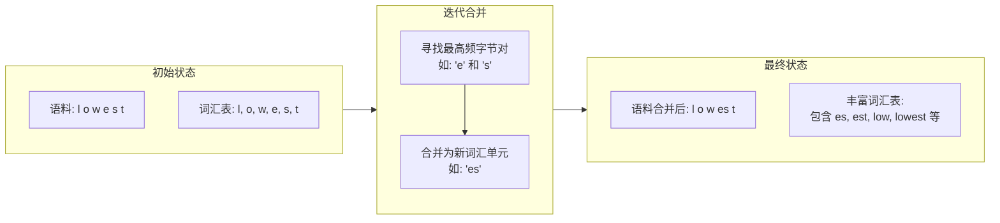
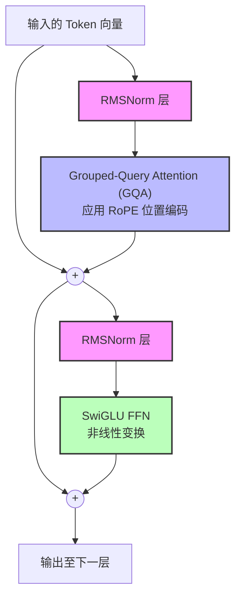
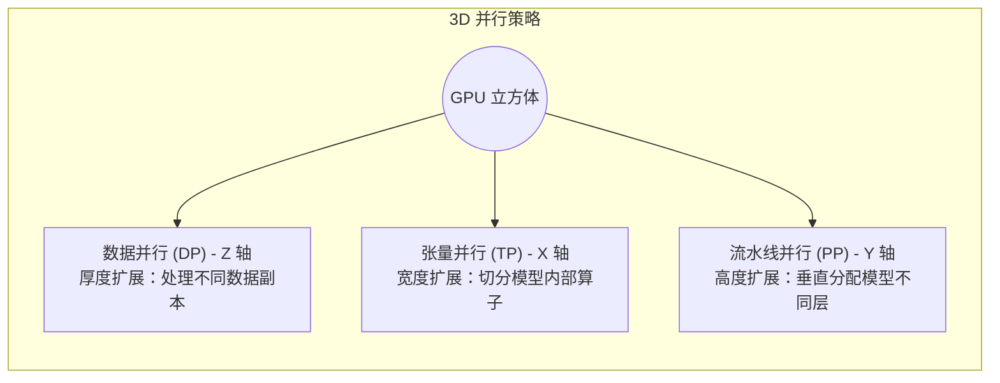
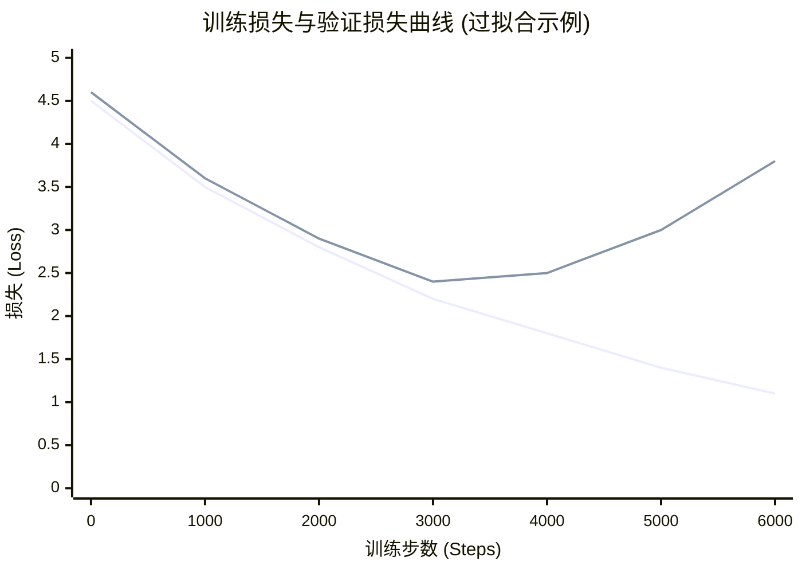
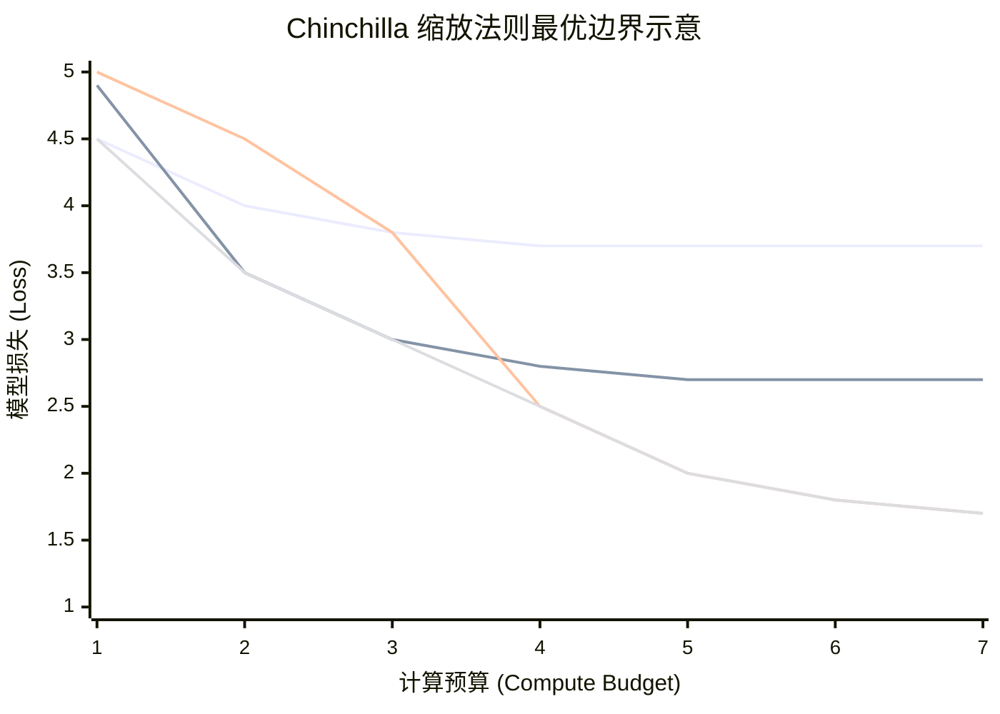

# 3.2 预训练全流程

预训练是一个系统工程, 环环相扣. 以下我们将按照从数据到模型的顺序, 详细阐述其核心步骤.

## 1. 语言的数字化：训练分词器

在模型开始学习之前, 我们必须先教会它如何“阅读”人类的语言. 计算机无法直接理解文本, 必须将其转换为数字序列, 这个过程就是**分词 (Tokenization)** , 而执行这个任务的工具就是**分词器 (Tokenizer)** .

- **核心目标**: 创建一个高效的词汇表 (Vocabulary), 将任意文本无损地映射为一串数字 ID (Token ID), 并能完美地反向还原.

- **主流算法**: **字节对编码 (Byte-Pair Encoding, BPE)** 是当前最主流的算法之一.

- **精妙类比**: 想象 BPE 是一个“造词”的过程. 它开始时只认识最基本的字符 (比如 a, b, c). 然后, 它会反复扫描海量文本, 找出最高频的字符组合 (比如 th), 将其合并成一个新的“词根” (_th). 接着, 它会继续寻找, 发现 _th 和 e 经常一起出现, 就再造一个新词 _the. 这个过程不断重复, 直到词汇表达到预设的大小 (例如 Llama 3 的 128k). 这样, 常见词可以直接用一个 Token 表示, 而生僻词则可以由多个子词 Token 组合而成, 实现了效率与覆盖范围的完美平衡.

**图 1**: BPE 分词器训练过程的视觉化描述. 左侧是初始状态, 词汇表仅包含单个字符. 中间展示了迭代合并的过程, 框出文本中最高频的字节对 (如 'e' 和 's') 并将其合并为新的词汇单元 ('es'). 右侧展示了经过多次合并后的最终状态, 形成了包含 'es', 'est', 'low', 'lowest' 等更长子词的丰富词汇表.

- **实践流程**:

1. **数据准备**: 收集数 GB 到数十 GB 的代表性原始文本语料.

2. **算法训练**: 使用 Hugging Face 的 tokenizers 库或 SentencePiece 等工具, 基于 BPE 算法训练语料, 生成词汇表文件 (e.g., vocab.json) 和合并规则文件 (e.g., merges.txt).

3. **验证**: 测试分词器对各类文本 (包括多语言、特殊符号、代码) 的编码和解码能力, 确保其鲁棒性.

## 2. 奠定基础：模型结构与参数定义

分词器解决了“读”的问题, 接下来我们需要设计模型的“大脑”——它的神经网络结构. 当前, **Decoder-Only Transformer** 架构已成为事实标准.

**图 2**: 一个典型的 Decoder-Only Transformer 模块的简化结构图. 输入的 Token 向量首先经过 **RMSNorm** 层, 然后进入 **Grouped-Query Attention (GQA)** 模块 (其中应用了 RoPE). 其输出与原始输入通过残差连接相加. 结果再次经过一个 **RMSNorm** 层, 送入 **SwiGLU FFN** 模块进行非线性变换. 最后, FFN 的输出再次与输入进行残差连接, 形成该模块的最终输出, 传递给下一个同样的模块.

- **核心组件**:

- **注意力机制 (Attention)** : 这是模型的核心. 为了在保证性能的同时降低推理时的显存开销 (KV Cache), **GQA (Grouped-Query Attention)** 成为了主流选择. 它介于多头注意力 (MHA) 和多查询注意力 (MQA) 之间, 将多个查询头 (Query Head) 分成一组, 共享同一份键 (Key) 和值 (Value).

- **前馈网络 (Feed-Forward Network, FFN)** : 在注意力层之后, 每个 Token 的表示会经过一个 FFN 进行非线性变换. Llama 系列模型中普遍采用 **SwiGLU** 激活函数, 相比传统的 ReLU, 能够提供更好的性能.

- **归一化层 (Normalization)** : 为了保证训练的稳定性, 模型在关键位置会使用归一化. **RMSNorm (Root Mean Square Normalization)** 因其计算效率高于传统的 LayerNorm 而被广泛采用.

- **位置编码 (Positional Encoding)** : Transformer 架构本身不感知顺序, 因此需要引入位置信息. **旋转位置编码 (Rotary Positional Embedding, RoPE)** 是当前最先进的技术, 它通过在注意力计算中对 Query 和 Key 向量进行旋转来巧妙地注入绝对和相对位置信息.

- **参数定义**: 在确定结构后, 需定义模型的具体尺寸, 包括:

- n_layers: Transformer 层的数量 (深度)
- n_heads: 注意力头的数量
- hidden_dim: 模型内部表示的维度 (宽度)
- vocab_size: 由分词器决定.

## 3. 选择工具：训练框架与并行策略

一个数百亿甚至数千亿参数的模型, 远超任何单张 GPU 的显存容量. 因此, 分布式训练是唯一的选择. 这需要强大的训练框架和精妙的并行策略.

- **训练框架**: Megatron-LM, DeepSpeed, PyTorch FSDP 等是业界主流选择. 它们封装了复杂的分布式通信和内存优化技术.

**图 3**: 3D 并行策略的立体示意图. 想象一个由 GPU 组成的立方体. **数据并行 (DP)** 沿 Z 轴扩展, 表示立方体的厚度, 每层都是一个完整的模型副本处理不同数据. **张量并行 (TP)** 沿 X 轴扩展, 表示立方体的宽度, 将模型内部的算子切分到一行 GPU 上. **流水线并行 (PP)** 沿 Y 轴扩展, 表示立方体的高度, 将模型的不同层垂直分配到一列 GPU 上. 任何一个 GPU 都在这个三维坐标系中拥有唯一的位置.

- **核心并行策略**:

- **数据并行 (Data Parallelism, DP)** : 最简单直接的策略. 将多台机器组成一个小组, 每台机器都拥有一份完整的模型副本, 但处理不同批次的数据.

- **优化: ZeRO (Zero Redundancy Optimizer)** : DeepSpeed 提出的革命性优化. 传统的 DP 浪费了大量显存, ZeRO 通过将模型参数、梯度和优化器状态分片 (Shard) 到不同的 GPU 上, 极大地降低了单个 GPU 的显存占用.

- **张量并行 (Tensor Parallelism, TP)** : 将模型内部的巨大权重矩阵切分到不同的 GPU 上. TP 会引入额外的通信, 通常限制在节点内 (通过高速 NVLink) 进行.

- **流水线并行 (Pipeline Parallelism, PP)** : 将模型的不同层 (Layers) 放置在不同的 GPU 上. 为了减少 GPU 等待的“气泡时间”, 实际训练中会将一个批次 (Batch) 切分成多个微批次 (Micro-batches) 进行流水线作业.

## 4. 保驾护航：训练容灾与监控

大规模训练动辄持续数周甚至数月, 期间任何一个 GPU 或服务器的故障都可能导致灾难性的后果.

- **容灾 (Resilience)** :

- **Checkpointing**: 定期 (例如每隔几百或几千步) 保存模型的完整状态 (权重、优化器状态、学习率等) 到持久化存储.

- **故障检测与自动恢复**: 训练集群需要有强大的监控系统, 能够实时检测硬件故障, 自动剔除问题节点, 并从最新的 Checkpoint 启动恢复训练任务.

- **监控 (Monitoring)** :

- **核心指标**: 必须实时监控 Loss (损失函数) 的变化曲线, 确保其平稳下降.

- **性能指标**: 监控训练吞吐量 (TFLOPs/s/GPU) 和硬件利用率.

- **WandB/TensorBoard**: 使用这类工具对训练过程中的各项指标进行可视化, 是分析和调试训练过程的标准实践.

**图 4**: 一个理想的训练监控仪表板截图. 主图表显示了训练损失 (蓝线) 和验证损失 (橙线) 随训练步数 (Steps) 的变化. 两条曲线都应稳步下降. 如果验证损失开始上升而训练损失持续下降, 则表明模型出现了过拟合.

## 5. 科学炼丹：缩放法则的应用

在有限的计算预算下, 是应该训练一个更大的模型, 还是用更多的数据训练一个稍小的模型? **缩放法则 (Scaling Laws)** 为这个问题提供了科学的指导.

- **Chinchilla 法则**: DeepMind 的研究发现, 为了达到最佳性能, 模型大小 (参数量 N) 和训练数据量 (Token 数 D) 之间存在一个最优比例. Chinchilla 论文指出: **每 1 个模型参数, 对应约 20 个 Token 的训练数据**.

- **实践意义**: 在规划预训练时, 不应盲目追求更大的模型尺寸, 而应优先确保有足够的高质量数据与之匹配.

**图 5**: Chinchilla 缩放法则的示意图. X 轴为计算预算 (Compute Budget), Y 轴为模型损失 (Loss). 图中有多条曲线, 每条代表一个固定模型大小. 曲线显示, 对于相同的计算预算, 并非模型越大越好. 存在一条“最优边界线” (图中虚线), 在这条线上, 模型大小和数据量的配比达到了最佳, 能够以最低的计算成本实现最低的损失.

## 6. 知识注入：继续预训练

在一个通用的基础模型 (Base Model) 训练完成后, 如果希望它在某一垂直领域 (如医疗、法律、金融) 表现更出色, 可以进行**继续预训练 (Continual Pre-training)** .

- **目标**: 向通用模型中注入特定领域的知识和术语体系.

- **方法**: 使用高质量的领域专属语料 (例如医学文献、法律文书), 在基础模型之上继续进行预训练任务. 这个过程的训练量远小于从零开始的预训练, 但能显著提升模型在目标领域的专业能力.
