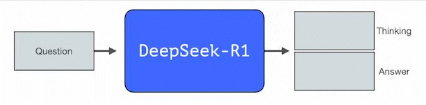

# 19 图解 DeepSeek-R1

**作者: 北方的郎**

**原文: **[https://zhuanlan.zhihu.com/p/22763932130](https://zhuanlan.zhihu.com/p/22763932130)

**原文的原文: **[https://newsletter.languagemodels.co/p/the-illustrated-deepseek-r1](https://link.zhihu.com/?target=https%3A//newsletter.languagemodels.co/p/the-illustrated-deepseek-r1)

本文翻译自Jay Alammar的”[https://newsletter.languagemodels.co/p/the-illustrated-deepseek-r1](https://link.zhihu.com/?target=https%3A//newsletter.languagemodels.co/p/the-illustrated-deepseek-r1)“

原文地址：[The Illustrated DeepSeek-R1](https://link.zhihu.com/?target=https%3A//newsletter.languagemodels.co/p/the-illustrated-deepseek-r1)

译者：[@北方的郎](https://www.zhihu.com/people/7af62e4119791a452e88718cb5ccc0be)

以下是译文，我翻译的时候会有一些词句上的小调整及优化。

DeepSeek-R1 是 AI 稳步发展的最新响亮节拍。对于ML研发社区来说，这是一个主要版本，原因包括：

1. 它是一个开放的权重模型，具有较小的蒸馏版本2. 它分享了一种重现 OpenAI O1 等推理模型的训练方法。

在这篇文章中，我们将了解它是如何构建的。

## 1. **回顾：LLM是如何训练的**

就像大多数现有的LLM一样，DeepSeek-R1每次生成一个token，不同之处在于，它擅长解决数学和推理问题，因为它能够花更多时间通过生成思考token来处理问题，解释其思维链。

下图显示了通过三个步骤创建高质量 LLM 的一般方法：

- **语言建模步骤**：我们训练模型预测下一个词，使用大量的网页数据。这一步产生了一个基础模型。

- **监督微调步骤**：这一步使模型在遵循指令和回答问题时更加有效。这个步骤结果是一个经过指令微调的模型，或称为监督微调(SFT)模型。

- **偏好调优步骤**：最后一步进一步优化模型的行为，使其符合人类偏好，最终形成我们在playground和应用中交互的偏好调优LLM。

## 2. **DeepSeek-R1训练配方**

DeepSeek-R1遵循这一一般配方。第一步的细节来自于先前的DeepSeek-V3模型的论文。R1使用的是该论文中的基础模型(而非最终的DeepSeek-V3模型)，并且仍然经过了SFT和偏好调优步骤，但它执行这些步骤的方式有所不同。

在 R1 创建过程中，有三个特殊事项需要强调。

## 3. **1 长链推理SFT数据(Long chains of reasoning SFT Data)** 

这是一大批长链推理示例(600,000个)。这些示例非常难以获得，而且在这一规模下由人工标注也非常昂贵。因此，创建这些数据的过程是第二个需要强调的特别之处。

2 **一个中间的高质量推理LLM(但在非推理任务上表现较差)** An interim high-quality reasoning LLM (but worse at non-reasoning tasks).

---

这些数据由R1的前身——一个专门进行推理的无名兄弟模型生成。这个兄弟模型受到第三个模型R1-Zero的启发(稍后将讨论)。它之所以重要，并不是因为它是一个非常适合使用的LLM，而是因为它的创建只需要很少的标注数据，通过大规模强化学习生成一个在解决推理问题上表现出色的模型。

这个无名的专门推理模型的输出可以用来训练一个更通用的模型，后者不仅可以解决推理任务，还能完成其他非推理任务，达到用户对LLM的期望。

3 **使用大规模强化学习(RL)创建推理模型 (Creating reasoning models with large-scale reinforcement learning (RL))** 

---

这一过程分为两个步骤：

### 3.1 ​

3.1 **大规模推理导向的强化学习(R1-Zero)** 

在这一阶段，RL用于创建中间推理模型。该模型随后用于生成SFT推理示例。创建这一模型的关键在于之前的一个实验——创建名为DeepSeek-R1-Zero的前身模型。

R1-Zero之所以特别，是因为它能在没有标注SFT训练集的情况下，擅长推理任务。它的训练直接从一个预训练基础模型开始，通过RL训练过程(没有SFT步骤)。它做得非常好，甚至能与O1竞争。

这一点很重要，因为数据一直是机器学习模型能力的燃料。这个模型是如何突破这一历史的？这表明两个方面：

1. 现代基础模型已经跨越了质量和能力的某个门槛(这个基础模型训练了14.8万亿个高质量的token)。2. 与一般聊天或写作请求不同，推理问题可以被自动验证或标注。我们可以通过一个例子来说明。

**例子：推理问题的自动验证**

这可以是RL训练步骤中的一个问题或提示：

编写一个Python代码，接受一个数字列表，将其按顺序排列，同时在开头添加42。

像这样的问题很容易进行自动验证。比如我们将其提交给正在训练的模型，看看它生成的完成：

- 软件分析工具可以检查生成的内容是否是正确的Python代码。- 我们可以执行这段Python代码，看它是否能运行。- 其他现代编码LLM可以生成单元测试来验证所期望的行为(即使它们本身不是推理专家)。- 我们甚至可以进一步测量执行时间，并让训练过程偏好更高效的解决方案，即使它们是正确的Python程序。

我们可以在训练步骤中向模型提出这样的问题，生成多个可能的解决方案。

我们可以自动检查(无需人工干预)，发现第一个完成并不是代码，第二个是代码但不是Python代码，第三个可能的解决方案通过了单元测试，而第四个是正确的解决方案。

这些都是可以直接用来改善模型的信号，当然，这一过程会在许多示例(小批量)和连续的训练步骤中进行。

这些奖励信号和模型更新就是模型在RL训练过程中不断提高任务解决能力的方式。

与能力提升相对应的是生成响应的长度，模型生成更多的思考token来处理问题。

这个过程是有用的，但R1-Zero模型尽管在推理问题上得分很高，但它也面临其他问题，使其不如预期的那样可用。

虽然DeepSeek-R1-Zero展示了强大的推理能力，并能自主地发展出意想不到的强大推理行为，但它面临着一些问题，比如可读性差、语言混合等。

R1旨在成为一个更易用的模型。因此，R1并没有完全依赖RL过程，而是在我们之前提到的两个地方使用它：

1. 创建一个中间的推理模型来生成SFT数据点2. 训练R1模型以改进推理和非推理问题(使用其他类型的验证器)

### 3.2 ​

3.2 **使用中间推理模型创建SFT推理数据**

为了让中间推理模型更有用，它经过监督微调(SFT)训练，使用几千个推理问题示例(其中一些是从R1-Zero生成和过滤的)。论文中将其称为“冷启动数据”。

**2.3.1 冷启动** 
与DeepSeek-R1-Zero不同，为了避免RL训练的早期不稳定的冷启动阶段，DeepSeek-R1通过收集一些长链推理数据来微调模型作为初始RL行为者。为了收集这些数据，我们探索了几种方法：使用少量提示来生成长链推理示例、直接提示模型生成带有反思和验证的详细答案、收集DeepSeek-R1-Zero输出并进行后处理等。

但等一下，如果我们已经有了这些数据，为什么还要依赖RL过程呢？这是因为数据的规模。这个数据集可能有5000个示例(这是可以收集到的)，但要训练R1，需要600,000个示例。这个中间模型弥补了这个差距，并允许合成地生成这些极为宝贵的数据。

如果您对监督微调(SFT)的概念不太熟悉，那就是通过将训练示例(提示和正确完成)提供给模型来训练它的过程。

### 3.3 ​

**3.3 一般RL训练阶段**

这一阶段使得R1能够在推理和非推理任务上都表现出色。该过程类似于我们之前看到的RL过程，但由于它扩展到非推理应用，它利用了有用性和安全奖励模型(与Llama模型类似)来处理这些应用的提示。

**架构**

---

就像GPT2和GPT3早期模型一样，DeepSeek-R1是一个TransformerDecoder  模块堆栈。它由61个Decoder  模块组成。前三个是密集层，其他则是专家混合层(参见 [A Visual Guide to Mixture of Experts (MoE)](https://link.zhihu.com/?target=https%3A//substack.com/home/post/p-148217245))。

就模型维度大小和其他超参数而言，它们如下所示：

有关模型架构的更多详细信息，请参见他们之前的两篇论文：

- [DeepSeek-V3 Technical Report](https://link.zhihu.com/?target=https%3A//arxiv.org/pdf/2412.19437v1)- [DeepSeekMoE: Towards Ultimate Expert Specialization inMixture-of-Experts Language Models](https://link.zhihu.com/?target=https%3A//arxiv.org/pdf/2401.06066)

## 4. 结论

有了这个，您现在应该对 DeepSeek-R1 模型有了整体的了解。

