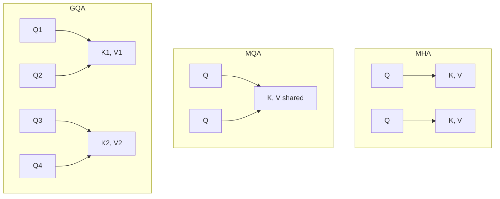

# Mistral AI 全面解析：从小杯到超大杯的技术演进

## 1. Mistral AI 概览

### 1.1 背景介绍
Mistral AI 成立于 2023 年，总部位于法国巴黎，由前 DeepMind 和 Meta 的顶级研究人员(如 Arthur Mensch、Timothée Lacroix 和 Guillaume Lample)创立. 它在极短的时间内成为全球领先的开源和商业闭源模型提供商之一. 

### 1.2 核心理念
Mistral AI 的核心哲学是在保证高性能的前提下，极度压缩模型体积与推理成本. 其标志性技术是 Grouped-Query Attention (GQA)、Sliding Window Attention (SWA) 和 Sparse Mixture of Experts (SMoE). 

<!-- 
[IMAGE PLACEHOLDER]
Prompt: A timeline visualization showing the releases of Mistral models: Mistral 7B (Sep 2023) -> Mixtral 8x7B (Dec 2023) -> Mistral Large (Feb 2024) -> Mixtral 8x22B (Apr 2024) -> Mistral NeMo / Codestral (Mid 2024). Design in a sleek, modern corporate style.
-->

## 2. Mistral 7B：开启小模型逆袭之路

### 2.1 架构创新

Mistral 7B 是基于 Transformer 的自回归语言模型. 虽然只有 70 亿参数，但其在多项基准测试中超越了 LLaMA 1 34B 甚至 LLaMA 2 13B. 

#### 2.1.1 Grouped-Query Attention (GQA)

GQA 是 Multi-Head Attention (MHA) 和 Multi-Query Attention (MQA) 之间的折中方案. 它显著降低了推理时 KV Cache 的显存占用. 



#### 2.1.2 Sliding Window Attention (SWA)

滑动窗口注意力机制(SWA)允许模型处理超出其训练序列长度的上下文，并在解码时降低计算复杂度. SWA 利用局部注意力，每个 token 只能关注其前 $W$ 个 token(窗口大小). 

**数学原理：**
在标准注意力机制中，注意力矩阵是满的下三角矩阵，复杂度为 $O(N^2)$. 而在 SWA 中：

$$ \text{Attention}(Q, K, V) = \text{softmax}\left(\frac{Q K^T}{\sqrt{d}}\right) V $$

但计算 $Q_i \cdot K_j$ 时，仅当 $i - W \le j \le i$ 时才计算，否则掩码为 $-\infty$. 这使得计算和显存复杂度降至 $O(N \cdot W)$. 

```python
import torch
import torch.nn as nn
import math

def sliding_window_attention(q, k, v, window_size=4096):
    """
    简化的 SWA 实现
    q, k, v: [batch, seq_len, num_heads, head_dim]
    """
    seq_len = q.size(1)
    # 计算点积注意力
    scores = torch.einsum("bqhd,bkhd->bqhk", q, k) / math.sqrt(q.size(-1))
    
    # 构建 SWA mask
    mask = torch.ones(seq_len, seq_len, dtype=torch.bool, device=q.device)
    mask = torch.tril(mask) # 下三角
    # 将超出 window_size 的部分设为 False
    mask = torch.triu(mask, diagonal=-window_size + 1)
    
    scores.masked_fill_(~mask.unsqueeze(0).unsqueeze(2), float("-inf"))
    attn_weights = torch.softmax(scores, dim=-1)
    
    output = torch.einsum("bqhk,bkhd->bqhd", attn_weights, v)
    return output
```

### 2.2 Rolling Buffer Cache (滚动缓存)

配合 SWA，Mistral 实现了 Rolling Buffer Cache. KV Cache 的大小固定为 $W$，当序列长度超过 $W$ 时，新的 Token 会覆盖最旧的 Token. 这使得模型在极低的显存下处理长达 128k 甚至更长的文本. 

## 3. Mixtral 8x7B & 8x22B：稀疏混合专家网络 (SMoE)

### 3.1 什么是 Mixtral？

Mixtral 是 Mistral AI 推出的稀疏混合专家网络(Sparse Mixture of Experts, SMoE). Mixtral 8x7B 拥有 46.7B 的总参数量，但在推理时每个 token 只激活两个专家，即仅使用 12.9B 活跃参数. 

<!-- 
[IMAGE PLACEHOLDER]
Prompt: A detailed architectural diagram of a Mixture of Experts (MoE) block. Show a token entering a router network, which then dispatches the token to Top-2 experts out of 8 Feed-Forward Networks (FFNs). Finally, the outputs are linearly combined.
-->

### 3.2 MoE 路由机制原理

在 Transformer 层中，Mixtral 用 MoE 层替换了标准的 FFN (Feed-Forward Network) 层. 

**路由计算公式：**

假设有 $N$ 个专家网络 $\{E_1, E_2, \dots, E_N\}$，对于输入 token $x$，路由器网络(Router)计算对各个专家的门控权重：

$$ G(x) = \text{Softmax}(\text{TopK}(x \cdot W_g, k)) $$

其中 $W_g$ 是路由器的权重矩阵，$\text{TopK}$ 操作仅保留分数最高的 $k$ 个专家(在 Mixtral 中 $k=2$)，其余强制置为 0. 

MoE 层的最终输出为：

$$ \text{MoE}(x) = \sum_{i=1}^N G(x)_i \cdot E_i(x) $$

因为 $G(x)$ 极其稀疏，大部分 $E_i(x)$ 无需计算，从而极大地节省了计算力. 

```python
class MixtralMoE(nn.Module):
    def __init__(self, hidden_dim, num_experts=8, top_k=2):
        super().__init__()
        self.num_experts = num_experts
        self.top_k = top_k
        self.gate = nn.Linear(hidden_dim, num_experts, bias=False)
        self.experts = nn.ModuleList([FFN(hidden_dim) for _ in range(num_experts)])

    def forward(self, x):
        # x: [batch_size, seq_len, hidden_dim]
        batch_size, seq_len, hidden_dim = x.shape
        x_flat = x.view(-1, hidden_dim)
        
        # 计算路由分数
        router_logits = self.gate(x_flat)
        routing_weights = torch.softmax(router_logits, dim=-1)
        
        # 选出 Top-K 专家
        routing_weights, selected_experts = torch.topk(routing_weights, self.top_k, dim=-1)
        routing_weights = routing_weights / routing_weights.sum(dim=-1, keepdim=True) # 归一化
        
        final_output = torch.zeros_like(x_flat)
        
        # 专家分发计算 (这里使用简化的循环表示)
        for expert_idx in range(self.num_experts):
            # 找到哪些 token 被分配给了当前专家
            expert_mask = (selected_experts == expert_idx)
            token_indices = expert_mask.any(dim=-1).nonzero(as_tuple=True)[0]
            
            if token_indices.numel() > 0:
                expert_inputs = x_flat[token_indices]
                expert_outputs = self.experts[expert_idx](expert_inputs)
                
                # 获取对应的权重
                weight_indices = (selected_experts[token_indices] == expert_idx).nonzero(as_tuple=True)[1]
                weights = routing_weights[token_indices, weight_indices].unsqueeze(-1)
                
                final_output[token_indices] += expert_outputs * weights
                
        return final_output.view(batch_size, seq_len, hidden_dim)
```

### 3.3 训练挑战与负载均衡

MoE 模型训练极易出现 "表示崩溃"(Representation Collapse)或 "路由崩溃"(Routing Collapse)问题：即所有 token 都倾向于发送给少数几个专家，导致其他专家被闲置，失去了 MoE 的意义. 

为了解决这个问题，Mixtral 在损失函数中引入了**负载均衡损失 (Load Balancing Loss)**：

$$ L_{balance} = \alpha \cdot N \sum_{i=1}^N f_i \cdot P_i $$

其中 $f_i$ 是分配给专家 $i$ 的 token 比例，$P_i$ 是路由到专家 $i$ 的平均概率，$\alpha$ 是权重超参数. 这种设计迫使模型将任务均匀分布给所有专家. 

### 3.4 Mixtral 8x22B
作为后继者，Mixtral 8x22B 将参数规模提升至 141B，活跃参数 39B，上下文长度提升至 65k. 它具备强大的多语言能力(法语、德语、西班牙语、意大利语)和极强的代码/数学推理能力. 

## 4. Mistral Large 旗舰级商业模型

Mistral Large 是 Mistral AI 的闭源商业旗舰模型，直接对标 GPT-4 和 Claude 3 Opus. 

### 4.1 核心特性
1. **母语级多语种支持**：由于团队位于欧洲，Mistral 对欧洲语言(法语、德语、西班牙语、意大利语)的支持达到了原生级别，甚至在某些评估中超越了 GPT-4. 
2. **极强的函数调用(Function Calling)能力**：Mistral Large 被设计为 Agentic 系统的理想底座，能够极其精确地输出 JSON 并调用外部 API. 
3. **超长上下文**：原生支持 32k 甚至 128k 上下文窗口，配合出色的信息检索能力，在 RAG 场景表现卓越. 

### 4.2 性能对比 (MMLU)

| 模型 | MMLU | HumanEval | GSM8K |
|------|------|-----------|-------|
| Mistral Large | 81.2% | 81.0% | 91.2% |
| GPT-4 (早期) | 86.4% | 67.0% | 92.0% |
| Claude 3 Sonnet | 79.0% | 73.0% | 92.3% |
| Mixtral 8x22B | 77.3% | 45.1% | 88.6% |

## 5. 垂直领域模型：Codestral 与 Mathstral

为了满足专业领域的需求，Mistral 推出了垂直微调模型. 

### 5.1 Codestral (22B)
专为代码生成设计的模型. 它采用类似于 Mixtral 的部分架构经验，但针对超过 80 种编程语言的代码库进行了深度训练. 

- **Fill-in-the-Middle (FIM)**：Codestral 特别优化了 FIM 任务，允许开发者在代码片段的中间插入代码. 这对于 IDE 补全工具(如 Copilot 替代品)至关重要. 

```json
// FIM Prompt Example
{
  "prompt": "def calculate_fibonacci(n):\n    if n <= 0:\n        return 0\n    elif n == 1:\n        return 1\n    <FILL_HERE>\n    return calculate_fibonacci(n-1) + calculate_fibonacci(n-2)",
  "suffix": "    return calculate_fibonacci(n-1) + calculate_fibonacci(n-2)"
}
```

### 5.2 Mathstral (7B)
Mathstral 是基于 Mistral 7B 微调的纯数学推理模型. 它通过大量的高质量数学数据(如竞赛题、定理证明等)进行训练. 它鼓励使用 **Chain-of-Thought (CoT)** 和 **Scratchpad** 范式来解题. 

## 6. Mistral NeMo (与 Nvidia 联合开发)

Mistral NeMo 12B 是 Mistral AI 与 Nvidia 合作的结晶，专门针对单个 GPU 推理和边缘设备优化. 

### 6.1 核心亮点
- **12B 黄金参数量**：120 亿参数，刚好可以无量化放入单张 24GB 显存显卡(如 RTX 3090/4090)或通过 INT4/INT8 量化塞入 8GB/12GB 显存设备. 
- **Tekken 分词器**：放弃了传统的 Llama BPE 分词器，转而使用全新的 Tekken 分词器. 
  - **效率提升**：在源代码和多语言文本上，Tekken 的压缩率比 Llama 3 分词器高 30%. 
  - **支持超过 100 种语言**. 

<!-- 
[IMAGE PLACEHOLDER]
Prompt: A bar chart comparing token compression efficiency between Mistral Tekken Tokenizer, LLaMA 3 Tokenizer, and GPT-4 Tokenizer across different languages (English, French, Chinese, Python code). Tekken should show visibly shorter bars representing fewer tokens required.
-->

## 7. 部署与微调实践

### 7.1 vLLM 部署

Mistral 系列(特别是 MoE)对 vLLM 等高性能推理框架支持极佳. 由于 GQA 的存在，vLLM 配合 PagedAttention 可以支持非常大的并发数. 

```bash
# 部署 Mixtral 8x7B (需要多卡或量化)
python -m vllm.entrypoints.openai.api_server \
    --model mistralai/Mixtral-8x7B-Instruct-v0.1 \
    --tensor-parallel-size 4 \
    --max-model-len 32768
```

### 7.2 量化与边缘端部署
通过 llama.cpp，可以在普通的 Mac 或 PC 上运行 GGUF 格式的 Mistral 7B 或 Mixtral 8x7B. 对于 MoE，量化显得尤为重要，因为虽然活跃参数少，但整个模型都需要加载到内存中. 

```bash
# 使用 llama.cpp 运行量化版的 Mixtral
./main -m ./models/mixtral-8x7b-instruct-v0.1.Q4_K_M.gguf \
       -p "Write a rust macro to implement a trait" \
       -n 512 -c 4096 --temp 0.7 -t 8
```

### 7.3 QLoRA 微调指南

微调 Mistral 7B 非常简单，使用 Hugging Face 的 `peft` 和 `trl` 库. 

```python
from peft import LoraConfig, get_peft_model, prepare_model_for_kbit_training
from transformers import AutoModelForCausalLM, AutoTokenizer, BitsAndBytesConfig
import torch

# 1. 4-bit 量化配置
bnb_config = BitsAndBytesConfig(
    load_in_4bit=True,
    bnb_4bit_use_double_quant=True,
    bnb_4bit_quant_type="nf4",
    bnb_4bit_compute_dtype=torch.bfloat16
)

# 2. 加载模型
model_id = "mistralai/Mistral-7B-v0.1"
model = AutoModelForCausalLM.from_pretrained(
    model_id, quantization_config=bnb_config, device_map="auto"
)
model = prepare_model_for_kbit_training(model)

# 3. LoRA 配置 (Target Modules 应该包含所有 Q, K, V, O, Gate, Up, Down)
config = LoraConfig(
    r=16,
    lora_alpha=32,
    target_modules=["q_proj", "k_proj", "v_proj", "o_proj", "gate_proj", "up_proj", "down_proj"],
    lora_dropout=0.05,
    bias="none",
    task_type="CAUSAL_LM"
)

# 4. 获取 PEFT 模型
model = get_peft_model(model, config)
model.print_trainable_parameters()
```

## 8. 总结与展望

Mistral AI 通过极其硬核的工程能力，在一年内走出了一条"以小博大"的路线. 
- **GQA + SWA** 让小模型支持超长上下文; 
- **MoE 架构** 让中等规模模型在推理成本不变的情况下获得巨大的容量提升; 
- **定制化分词器和垂直领域模型** (NeMo, Codestral) 则展现了对实际开发者生态的关注. 

在未来，我们可以期待 Mistral 推出更多端侧微型模型、多模态模型(如 Pixtral)，以及对 MoE 架构更深入的挖掘. 它证明了即使不依赖万卡集群暴力美学，依靠优雅的算法设计与极具巧思的架构折中，依然可以训练出撼动巨头的顶尖大模型. 
