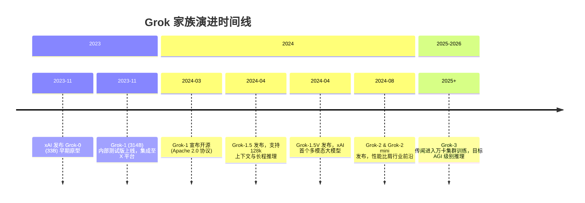
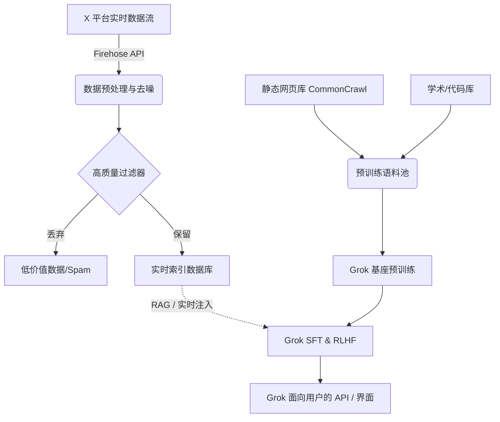

# xAI-Grok: 突破边界的实时认知巨兽

> **摘要**：由 Elon Musk 创立的 xAI 所推出的 Grok 系列模型，不仅以“幽默、不羁”的个性著称，更在技术底层采用了激进的架构设计与超大规模的算力堆叠. 本文将全面深入解析 Grok 家族(从 Grok-1 到最新的 Grok 迭代版本)，深度剖析其 3140亿 参数的混合专家(MoE)架构、独一无二的 X(前 Twitter)实时数据流融合技术、定制化训练基础设施，以及其在开源社区所产生的深远影响. 

<!-- [IMAGE PROMPT: 一张富有科幻色彩的概念图，展现一个名为 "Grok" 的超现实AI大脑，它通过无数发光的数据链路连接着一个类似地球的实时信息网络，背景是庞大的 GPU 算力集群. ] -->

---

## 1. 引言：打破常规的 AI 探索

2023年，在人工智能领域“百模大战”如火如荼之际，Elon Musk 宣布成立 xAI，并随后推出了其首款大语言模型——Grok. Grok 的设计初衷是为了解决标准 LLM 过于拘谨、难以处理实时信息以及缺乏“幽默感”的问题. 

然而，在这些引人注目的产品特性背后，Grok 是一系列硬核技术的结晶. 从开源具有 314B 参数的 Grok-1，到后续支持长上下文的 Grok-1.5，再到视觉能力融入的 Grok-1.5V，以及对标 GPT-4 和 Claude 3.5 的 Grok-2，xAI 展现了惊人的模型迭代速度与工程落地能力. 

---

## 2. Grok 模型家族演进史

Grok 的发展是一条高速迭代的曲线. 以下是 Grok 系列核心版本的演化时间线：



### 2.1 Grok-0：原型探索
在正式推出 Grok-1 之前，xAI 训练了一个拥有 330 亿参数的早期模型 Grok-0. 它主要被用来验证 xAI 定制的训练框架(基于 JAX 和 Rust)和算力集群的稳定性. 尽管参数量不大，但 Grok-0 在标准的 LLM 基准测试中已经展现出接近 LLaMA-2 70B 的水平. 

### 2.2 Grok-1：开源界的核弹
Grok-1 是真正让 xAI 名声大噪的模型. 它是一个拥有 3140 亿参数的混合专家(MoE)模型. 2024 年 3 月，xAI 出人意料地将 Grok-1 的权重完全开源(Apache 2.0)，使其成为当时开源界参数量最大的大语言模型，极大地推动了开源社区对超大 MoE 架构的微调和部署研究. 

### 2.3 Grok-1.5 与 1.5V：长文本与多模态
Grok-1.5 主要在上下文长度上进行了突破，将上下文窗口从 8k 扩展到了 128k 级别，并且在“大海捞针”测试中取得了近乎完美的召回率. 紧接着的 Grok-1.5V 则引入了视觉编码器，使 Grok 能够理解复杂的文档、图表、照片，补齐了多模态能力的短板. 

### 2.4 Grok-2 系列：冲击第一梯队
Grok-2 以及轻量版的 Grok-2 mini 标志着 xAI 在纯模型能力上正式与 OpenAI 的 GPT-4o、Anthropic 的 Claude 3.5 展开正面交锋. Grok-2 不仅在代码生成(HumanEval)、数学推理(MATH)上取得了顶尖成绩，还直接集成到了 X 平台中，提供了基于 Flux 架构的高质量图像生成功能. 

---

## 3. Grok-1 核心技术架构深度剖析

Grok-1 之所以具有里程碑意义，在于它是当时最详尽公开参数结构的稀疏混合专家(Sparse MoE)模型之一. 

### 3.1 架构级规格参数

以下是 Grok-1 官方公布的底层架构细节，这为我们理解超大规模 MoE 提供了绝佳的参考：

| 参数项 | 规格说明 |
| --- | --- |
| **总参数量** | 314 Billion (3140 亿) |
| **激活参数量** | 约 39 Billion (390 亿) |
| **MoE 专家总数** | 8 |
| **单次激活专家数** | 2 |
| **网络层数 (Layers)** | 64 |
| **注意力头数 (Q / KV)**| 48 / 8 (采用了 GQA 分组查询注意力) |
| **嵌入维度 (Hidden)**| 6144 |
| **词表大小 (Vocab)** | 131,072 (支持多语言与高压缩率) |
| **位置编码** | RoPE (旋转位置编码) |
| **激活函数** | GeGLU |

### 3.2 混合专家网络 (MoE) 详解

Grok-1 每一层的 Feed-Forward Network (FFN) 都被替换成了 8 个并行的“专家”网络. 对于任何一个输入 Token，门控网络(Router)会计算它与各个专家的匹配度，并将其分配给得分最高的 2 个专家进行处理. 

这种机制的数学表达如下：

给定输入 token 的隐藏状态 $x$，门控权重矩阵 $W_g$：

$$
 \text{Router\_Logits} = x \cdot W_g
$$
$$
 \text{Gate\_Scores} = \text{TopK}(\text{Softmax}(\text{Router\_Logits}), k=2)
$$

通过只激活 $k=2$ 个专家，Grok-1 在保持 314B 总参数量(庞大的知识容量)的同时，每次推理只带来了大约 39B 参数的计算量. 这极大地提高了计算效率，降低了推理时的算力瓶颈，但在分布式训练时却带来了巨大的显存与通信带宽挑战. 

#### 3.2.1 门控路由代码示例(伪代码)

```python
import torch
import torch.nn as nn
import torch.nn.functional as F

class GrokMoERouter(nn.Module):
    def __init__(self, hidden_dim, num_experts=8, top_k=2):
        super().__init__()
        self.num_experts = num_experts
        self.top_k = top_k
        self.gate = nn.Linear(hidden_dim, num_experts, bias=False)
        
    def forward(self, x):
        # x shape: [batch_size, seq_len, hidden_dim]
        # 计算每个专家的路由分数
        logits = self.gate(x) # [batch_size, seq_len, num_experts]
        
        # Softmax 获取概率
        probs = F.softmax(logits, dim=-1)
        
        # 选取 Top-K
        topk_probs, topk_indices = torch.topk(probs, self.top_k, dim=-1)
        
        # 归一化选中的概率，使其和为 1
        topk_probs = topk_probs / topk_probs.sum(dim=-1, keepdim=True)
        
        return topk_probs, topk_indices

# 注意：在实际的分布式环境中，还需要配合 Expert Parallelism(专家并行)，
# 以及 All-to-All 通信原语，将不同设备上的 Token 发送给对应的物理专家节点. 
```

<!-- [IMAGE PROMPT: 一个详细的系统架构图，展示 8 个专家模型的神经网络块. 一个数据 Token 经过 Router 节点，被高亮地分配到第 2 和第 5 个专家节点上，其余节点处于暗淡的待机状态. 带有数据流向的箭头. ] -->

### 3.3 负载均衡损失 (Load Balancing Loss)

在 MoE 训练中，一个常见的问题是“专家崩溃(Expert Collapse)”，即网络倾向于将所有的 tokens 都分配给少数几个已经训练得较好的专家，导致其他专家被闲置. 
为了解决这个问题，Grok 在损失函数中引入了辅助负载均衡损失(Auxiliary Loss)：

$$
 L_{aux} = \alpha \cdot N \sum_{i=1}^{N} f_i \cdot P_i
$$

其中：
*   $N$ 是专家总数(8). 
*   $f_i$ 是当前批次中分配给专家 $i$ 的 token 比例. 
*   $P_i$ 是门控网络对专家 $i$ 输出的平均概率. 
*   $\alpha$ 是一个调节系数，用于平衡主语言模型损失和负载均衡损失. 

通过最小化 $L_{aux}$，迫使模型将 token 均匀地分配给所有专家. 

### 3.4 旋转位置编码 (RoPE) 与长上下文

Grok 采用了 RoPE(Rotary Position Embedding). 在 Grok-1.5 及其后续版本中，为了将上下文扩展到 128k，xAI 团队很可能采用了类似 YaRN 或线性插值(Linear Interpolation)的 RoPE 缩放技术. 

RoPE 的核心思想是在复数空间中对向量进行旋转：
$f_q(x_m, m) = (W_q x_m) e^{im\theta}$

在扩展上下文时，通过缩小 $\theta$ 的基础频率(Base Frequency)，使得模型能够容纳更长距离的位置差异，而不破坏预训练期间学到的相对位置关系. 

---

## 4. 训练基础设施：极致的工程堆叠

xAI 能够在极短的时间内(数个月)完成数百亿、数千亿参数模型的预训练，归功于其世界顶级的超算集群和深度的底层软件优化. 

### 4.1 Memphis Supercluster (孟菲斯超级集群)

> [!IMPORTANT]
> 算力是 xAI 最大的壁垒之一. 在 Elon Musk 的推动下，xAI 在孟菲斯构建了可能是世界上最强大的单一 AI 训练集群. 

*   **节点规模**：包含高达 **100,000 张 NVIDIA H100 GPU**. 
*   **网络拓扑**：采用了特制的液冷系统和高度优化的 InfiniBand / RoCE 网络，以支撑 MoE 训练中极度夸张的 All-to-All 节点间通信. 
*   **电力供应**：如此规模的集群需要数以百兆瓦计的稳定电力供应，这在现代 AI 基础设施建设中是一项极大的挑战. 

<!-- [IMAGE PROMPT: 一张令人震撼的机房照片视角：一排排望不到尽头的服务器机架，液冷管道交织，红蓝色LED指示灯闪烁. 上方悬挂着巨大的 "Memphis Supercluster - 100k H100" 标语，展现极致的工业力量感. ] -->

### 4.2 自研 Rust/JAX 训练框架

不同于大多数公司直接使用基于 PyTorch 的 Megatron-LM，xAI 构建了一套深度定制的底层框架：
1.  **JAX 作为核心编译器**：JAX 强大的 XLA 编译器使得计算图能够在分布式集群上获得极致的算子融合和显存优化. 
2.  **Rust 编写的控制平面**：xAI 使用 Rust 编写了大量的网络通信、数据加载和集群监控代码，利用 Rust 的内存安全和极高的并发性能，大大减少了大规模集群中常见的“挂节点”问题. 
3.  **多维并行策略**：为了训练 Grok，xAI 综合使用了：
    *   **张量并行 (Tensor Parallelism)**：切分单个权重矩阵. 
    *   **流水线并行 (Pipeline Parallelism)**：将网络层切分到不同节点. 
    *   **数据并行 (Data Parallelism / FSDP)**：分发不同的数据 batch. 
    *   **专家并行 (Expert Parallelism)**：将不同的 MoE 专家放置在不同的 GPU 上. 

---

## 5. 数据：X 平台的实时知识库

Grok 相较于 ChatGPT、Claude 的最大差异化优势在于 **数据源**. 

### 5.1 实时推文接入
通过与 X(前 Twitter)的独家数据协议，Grok 可以以极低的延迟访问全球数以亿计的用户产生的实时文本、新闻、图片和视频. 这使得 Grok 在回答“当前正在发生什么？”(What's happening right now?)类的问题时，具有降维打击的优势. 

### 5.2 数据的“去噪”与价值观
X 上的数据充满了噪音、极度主观的观点和非正规语言. xAI 在数据清洗流线中：
*   构建了强大的质量过滤分类器. 
*   赋予了模型一定的“反叛”与“幽默”基因(Grok's Fun Mode). 
*   致力于“反觉醒”(Anti-Woke)和极致的言论自由，旨在提供中立、未经过度安全对齐阉割的回答. 



---

## 6. 开源策略与社区影响

2024 年 3 月，xAI 以 Apache 2.0 许可证发布了 Grok-1 的权重和网络架构代码(总计约 300GB 的 checkpoint). 

> [!TIP]
> Grok-1 的开源是 AI 发展史上的一个重要里程碑. 它打破了顶级模型完全封闭的局面，尽管 Grok-1 由于体积过大(需要 8 张 80G A100/H100 才能勉强进行推理)，普通开发者难以直接运行，但它极大地促进了以下领域的研究：

1.  **MoE 模型量化压缩**：社区迅速开发了针对 314B 模型的 4-bit 量化方案(如 GGUF/AWQ)，将显存需求压到了 100GB 左右. 
2.  **分布式推理引擎优化**：vLLM, SGLang 等推理框架为了适配 Grok-1，大幅优化了其对混合专家模型的内存分配和显存管理机制. 
3.  **微调基准测试**：大型研究机构得以基于 Grok-1 探索超大规模 MoE 的持续预训练(Continual Pre-training)和监督微调(SFT)机制. 

---

## 7. 挑战与未来展望

尽管 xAI 凭借极其生猛的算力堆叠和工程能力快速崛起了，但 Grok 家族依然面临一系列挑战：

### 7.1 "幻觉" 与实时数据的双刃剑
X 平台数据的时效性虽然强，但也充斥着假新闻和未经验证的谣言. Grok 在实时模式下，极易受网络情绪的引导产生幻觉，如何增强模型内部的事实核查(Fact-Checking)机制是一个难题. 

### 7.2 安全与伦理对齐
Musk 强调 Grok 需要“追求最大真理(Maximum Truth-Seeking)”，这使得它在回答敏感政治问题、生成黑客代码、或者创建具有争议性的图片(通过集成 Flux)时，缺乏像 OpenAI 那样严密的护栏(Guardrails). 这种自由度在吸引特定用户群体的同时，也带来了潜在的公关和法律风险. 

### 7.3 迈向 AGI 的 Grok-3
据公开信息透露，xAI 正在使用 100,000 张 H100 训练下一代 Grok-3. 
*   **目标**：在复杂的多步逻辑推理、自主 Agent 任务执行、甚至是长期记忆上全面超越现有的前沿模型. 
*   **架构演进**：预计将采用更深层次的多模态融合(原生支持视频流输入与生成)，以及更细粒度的 MoE 路由架构(例如类似 DeepSeek-V2 的细粒度专家和共享专家机制). 

---

## 8. 总结

xAI-Grok 不是一个循规蹈矩的跟随者. 从 314B 破天荒的开源，到建立人类历史上最庞大的单体 GPU 训练集群，Grok 正在用极致的工程暴力学与特立独行的产品理念，强行撕开大模型格局的防线. 它既是马斯克商业帝国(Tesla, X, SpaceX)的“通用 AI 大脑”，也是全球开源技术发展不可忽视的巨大推动力. 

---
*本文档为 MetaBlog LLM Guide 系列的一部分. 有关本地部署 Grok 的量化方案教程，请参阅开源部署相关章节. *
