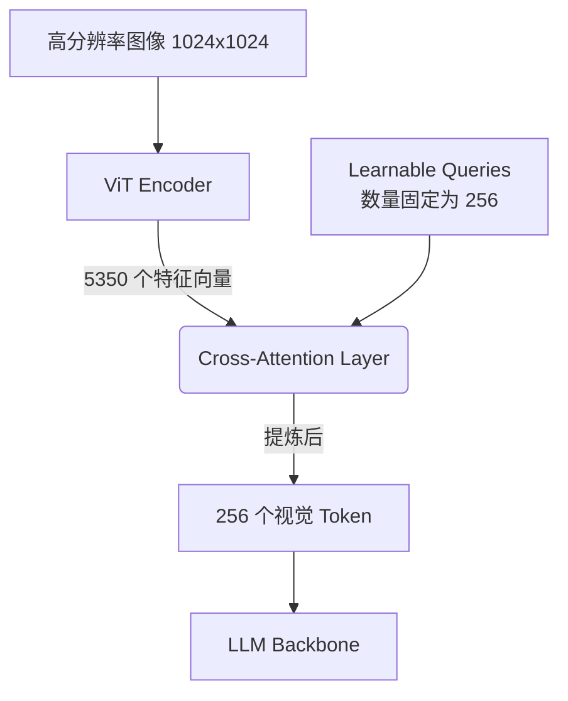
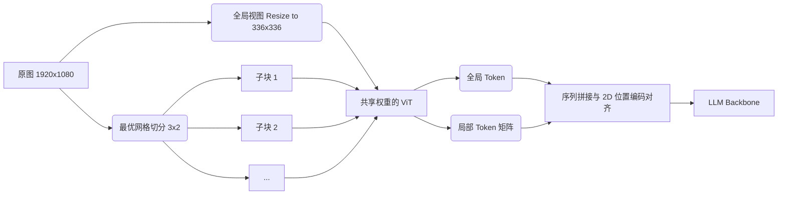

# 8.2.4 · 高分辨率 VLM 的技术挑战

在视觉语言模型(VLM, Vision-Language Models)的演进历程中, 图像分辨率的提升标志着模型感知能力的根本性飞跃. 早期的 VLM(如 CLIP、BLIP 等)通常将输入图像缩放至 $224 \times 224$ 或 $336 \times 336$ 的低分辨率. 这种设计虽然在计算效率和全局语义理解上取得了平衡, 但在处理密集文本(如文档问答 DocVQA)、细粒度目标检测、复杂图表分析等需要局部极高清晰度的任务时, 往往表现出严重的“近视”问题. 

当我们将图像分辨率从 $224^2$ 提升至 $1024^2$ 甚至 $4K$ 级别时, 模型面临的不仅是计算量和显存占用的线性增长, 更是模型架构、特征对齐、长上下文建模等多方面的系统性挑战. 本章节将深入探讨高分辨率 VLM 面临的核心技术壁垒, 以及学术界和工业界为主流方案所做出的各类创新性架构设计. 

<!-- IMAGE PROMPT: A comparative high-resolution visual of a document at 224x224 (blurry, unreadable text) vs 1024x1024 (clear text), illustrating the absolute necessity of high resolution in DocVQA tasks. -->

## 1. 视觉 Token 爆炸 (Visual Token Explosion)

### 1.1 灾难性的复杂度增长

在目前主流的 VLM 架构中, 视觉编码器大多采用基于 Transformer 的架构, 例如 Vision Transformer (ViT). ViT 将输入图像划分为固定大小的图块(Patch), 每个 Patch 被展平并映射为一个视觉 Token. 

假设输入图像的尺寸为 $H \times W$, Patch 的大小为 $P \times P$. 那么, 产生的视觉 Token 数量 $N$ 可以由以下公式得出：

$$ N = \frac{H \times W}{P^2} $$

对于标准的 ViT-L/14 模型, Patch 大小 $P = 14$. 
- 当分辨率为 $224 \times 224$ 时：
  $$ N = \frac{224 \times 224}{14^2} = 256 $$
  256 个 Token 对于目前动辄支持数万上下文的 LLM 而言微不足道. 
- 当分辨率提升至 $1024 \times 1024$ 时：
  $$ N = \frac{1024 \times 1024}{14^2} \approx 5350 $$
- 如果进一步提升到 $2048 \times 2048$：
  $$ N = \frac{2048 \times 2048}{14^2} \approx 21400 $$

由于 LLM 骨干网络中的自注意力机制(Self-Attention)的时间和空间复杂度随序列长度 $N$ 呈平方级增长($\mathcal{O}(N^2)$), 视觉 Token 数量的膨胀(Token Explosion)将导致：
1. **显存溢出 (OOM, Out of Memory)**：KV Cache 的显存占用随视觉 Token 数量线性甚至二次方增长, 导致设备无法容纳. 
2. **推理延迟极剧上升 (Latency Spike)**：Prefill 阶段的计算量急剧增加, 用户的首字响应时间(TTFT, Time To First Token)无法忍受. 
3. **“淹没”文本指令 (Attention Dilution)**：当 Prompt 中包含 20,000 个视觉 Token 却只有几十个文本 Token 时, 模型的注意力可能被视觉噪声主导, 降低对文本指令的遵循度. 

### 1.2 缓解策略：Token 压缩与抽象

为了在保留高分辨率信息的同时限制 Token 数量, 研究者们提出了多种 **视觉 Token 压缩 (Visual Token Compression)** 技术：

#### A. 抽象查询池化 (Query-based Pooling)
以 Flamingo 的 Perceiver Resampler 和 BLIP-2 的 Q-Former 为代表. 这两种技术利用一组数量固定的可学习查询向量(Learnable Queries, 例如 64 或 256 个), 通过交叉注意力机制(Cross-Attention)从海量的高分辨率视觉特征中主动“抽取”信息. 



**数学表达：**
$$ \text{Compressed\_Tokens} = \text{Softmax}\left(\frac{Q \cdot K^T}{\sqrt{d_k}}\right) V $$
其中, $Q$ 是固定长度的学习查询, $K$ 和 $V$ 来自庞大的视觉特征图. 无论输入分辨率多高, 输出的 Token 数量始终等于 $Q$ 的长度. 这种方法虽然有效控制了长度, 但在极端密集文本场景下, 由于过度压缩会丢失关键细节. 

#### B. 动态 Token 融合 (Token Merging)
Token Merging (ToMe) 是一种无需训练的策略, 通过度量 Token 之间的相似度(例如计算 Key 的余弦相似度), 将语义相近的背景 Token(如大片空白、纯色天空)进行聚合, 保留前景主体或高频细节(如文字)的独立 Token. 

---

## 2. 动态分块与切片策略 (Tiling & Chunking Strategies)

仅仅依赖压缩无法完美解决超高分辨率下“细粒度特征丢失”的问题. 目前 SOTA 的高分辨率 VLM(如 GPT-4V、LLaVA-NeXT / LLaVA-UHD、Qwen-VL 等)不约而同地采用了一种更为自然且高效的策略：**图像分块 (Tiling)**. 

### 2.1 核心思想：全局与局部的结合

与其使用单一超大模型去强行吞下 $2048 \times 2048$ 的整图, 不如将高分辨率图像切分为多个 ViT 能够原生处理的低分辨率子图(如 $336 \times 336$), 然后分别编码. 为了不丢失宏观位置关系, 同时需要输入一张缩放后的“全局缩略图”. 

<!-- IMAGE PROMPT: Diagram showing a high-res image being downsampled to a global thumbnail, and simultaneously sliced into a 3x2 grid of local high-res patches, feeding into identical ViT encoders. -->

### 2.2 动态分辨率机制 (AnyRes)

真实世界中的图像具有多样的长宽比(Aspect Ratio). 如果强制缩放至正方形(如 $336 \times 336$), 会导致严重的形变(Distortion), 而如果直接 Padding, 则会浪费大量计算在无意义的黑边上. 
因此, 现代 VLM 引入了 **AnyRes (动态分辨率匹配)** 算法. 

**切分算法流程示例(类似于 LLaVA-NeXT / U-HD)：**
1. **获取原始分辨率** $H_0 \times W_0$. 
2. **定义目标网格**：根据模型显存上限, 设定最大切块数 $N_{max}$. 系统预设一系列长宽比网格排列(如 $1\times1, 1\times2, 2\times1, 2\times2, 3\times2, \dots$). 
3. **匹配最优长宽比**：计算原始图像长宽比, 从预设网格中寻找最接近的排列组合, 将图像动态切分为 $r \times c$ 个块. 
4. **ViT 分别编码**：将每个子块 $C_{i,j}$ resize 到 ViT 的标准输入尺寸(如 336x336)并编码. 
5. **全局视图补充**：将整张原始图像强行 resize 到 $336 \times 336$, 作为全局语义视图. 



### 2.3 分块带来的新挑战：缝隙效应 (Seam Artifacts)

图像被物理切割后, 如果一个物体正好位于边界上, 它将被割裂在两个不同的子图中. 这会导致：
- **特征断裂**：ViT 内部的自注意力机制无法跨越子图(Cross-patch)生效. 
- **语义不连贯**：LLM 在阅读拼接后的 Token 序列时, 可能无法理解被截断的文本单词. 

**解决方案**包括：
1. **Overlapping 切片**：在切割子图时引入一定的重叠区域(Overlap), 例如使用步长(Stride)小于 Patch 尺寸的切分方式, 确保边界特征在两个相邻块中都存在. 
2. **跨块注意力 (Cross-Patch Attention)**：在特定层级, 允许不同分块的 Token 进行信息交互, 但这会破坏并行计算的独立性. 

---

## 3. 坐标对齐与 2D 位置编码 (Coordinate Alignment)

在大语言模型中, 1D 的绝对或相对位置编码(如 RoPE)用于指示词语的先后顺序. 而在 VLM 中, 图像的拓扑结构是 2D 的. 当采用了复杂的 AnyRes 动态切块策略后, 如何让 LLM 理解“块 1 在左上, 块 4 在右下”？

### 3.1 序列拼接与换行符 (Newline Tokens)

最基础的做法是使用特殊 Token(如 `<|newline|>`)来表示空间的换行换列. 
假设一张图被切分为 $2 \times 2$ 的网格, 在送入 LLM 之前, Token 序列会按照如下方式拼接：

```text
[Global Image Tokens]
[Local Image Chunk 1,1] [Local Image Chunk 1,2] <|newline|>
[Local Image Chunk 2,1] [Local Image Chunk 2,2] <|newline|>
```
这种朴素的 1D 展平策略能够工作, 很大程度上得益于 LLM 强大的模式识别能力, 但其内在的空间直觉依然较弱. 

### 3.2 2D 旋转位置编码 (2D RoPE)

为了提供更强的几何偏置, 研究人员将一维的旋转位置编码(RoPE)扩展到二维空间(2D-RoPE). 
在一维 RoPE 中, 我们根据 Token 在序列中的索引 $m$ 旋转特征向量. 在 2D-RoPE 中, 我们分离特征的维度, 将前一半维度用于编码纵坐标 $h$, 后一半维度用于编码横坐标 $w$. 

**2D RoPE 数学推导：**
设特征向量为 $\mathbf{x} = [x_1, x_2, \dots, x_d]^T$. 
图像中的空间坐标为 $(h, w)$. 
将向量平分为两部分：$\mathbf{x}^{(h)}$ 和 $\mathbf{x}^{(w)}$, 每一部分的维度为 $d/2$. 

对于 $h$ 的旋转矩阵 $R_h$ 和 $w$ 的旋转矩阵 $R_w$, 应用：
$$ \mathbf{\tilde{x}} = \text{Concat}\left( R_h \mathbf{x}^{(h)}, \, R_w \mathbf{x}^{(w)} \right) $$

通过在切块后的 Token 矩阵上重新分配全局连续的 $(h, w)$ 坐标, 并注入 2D-RoPE, LLM 在计算 Attention 时可以无缝感知到 Token 之间的相对物理距离, 无论它们是否被切分到不同的子图(Chunk)中. 

<!-- IMAGE PROMPT: A heatmap demonstrating attention weights across different image patches. Showing that with 2D-RoPE, attention gracefully decays with geometric distance across chunk boundaries, whereas without it, attention hits a rigid wall at the chunk edge. -->

---

## 4. 长图与长文档建模 (Long-image and Document Modeling)

除了高分辨率的正方形图像, 实际业务中大量存在着长宽比极端的图像, 如手机截取的超长滚动网页、超长的超市购物小票、由多页 PDF 拼接而成的垂类长图. 

### 4.1 纵向延伸带来的灾难
对于 $1024 \times 8192$ 这种极端长宽比的图像, 如果按照前述的分块策略, 可能会被切分为 $1 \times 24$ 个网格. 这将产生极长的序列(Token 数过万). 不仅加重 LLM 负担, 而且首尾信息距离过远, 容易触发 LLM 的“Lost in the Middle”(中间信息丢失)现象. 

### 4.2 层级式架构 (Hierarchical Encoding)
为解决长图/多图处理问题, 模型开始向**层级式序列压缩**方向进化, 如 UReader 和 Qwen-VL-Max 的设计：
1. **行级压缩**：每处理完长图的一行子块(Row), 通过一个轻量级的 Transformer 或 Pooling 机制, 将该行的所有 Token 压缩为少数几个 Row-Level Summary Token. 
2. **文档级注意力**：引入全局的 Document-Level Attention, 不仅关注单个字词, 更能快速跳跃到包含目标信息的特定“长图页面”或“区块”, 实现类似人类“先快速粗览, 再聚焦细读”的机制. 

### 4.3 扫描线与滑动窗口感知 (Sliding Window Attention)
在视觉大模型内部, 针对极长的图像特征序列, 采用类似于 Longformer 的 Sliding Window Attention：限制大多数 Token 只能与自己空间上的邻居(上下左右几百像素内)进行自注意力交互, 仅保留少数 Global Token 作为信息汇总的锚点. 这种稀疏注意力模式极大降低了长图推理时的 KV Cache 压力. 

## 5. 总结与权衡

高分辨率 VLM 的发展本质上是在 **感知精度(Resolution)**、**序列长度(Token Count)** 和 **计算成本(Compute & Memory)** 这“不可能三角”中寻找最优解：

| 技术流派 | 核心机制 | 优点 | 缺点 | 典型模型代表 |
| :--- | :--- | :--- | :--- | :--- |
| **重度压缩** | Q-Former / Perceiver 强行压缩视觉序列 | 显存极省, 推理极快, LLM无负担 | 细粒度信息严重丢失, 无法做 OCR | Flamingo, BLIP-2, InstructBLIP |
| **原生大图** | 训练极大分辨率的 ViT, 不做切分 | 全局视野连贯, 无拼接缝隙 | 预训练成本极高, 推理极耗显存 | 早期实验性版本 |
| **动态分块** | AnyRes 切片 + 局部高分辨 + 全局低分辨 | 平衡了显存与细粒度, 任意长宽比适应极好 | Token数量仍然庞大, 边界割裂感需后处理弥补 | GPT-4V, LLaVA-NeXT, Qwen-VL |

随着硬件和底层算子的进化, 未来的 VLM 必将向原生支持 4K 甚至更高分辨率迈进. 而通过 Mamba、RWKV 等具有线性复杂度的新型架构替代传统的 Transformer, 可能将从根本上解除视觉 Token 爆炸带来的束缚, 开启像素级全量感知的新时代. 
