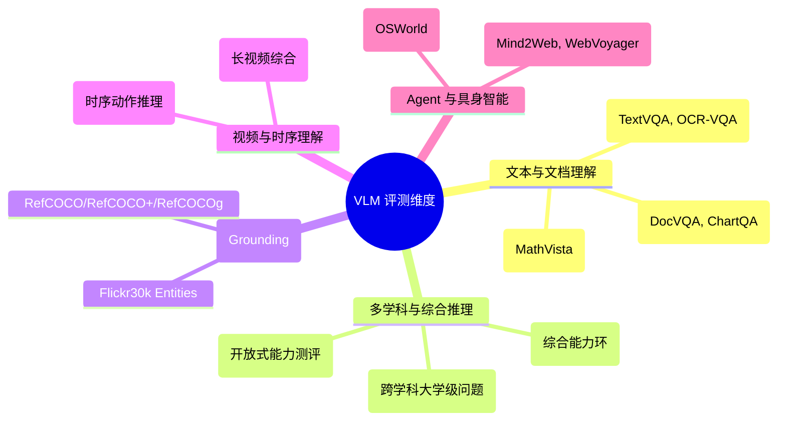
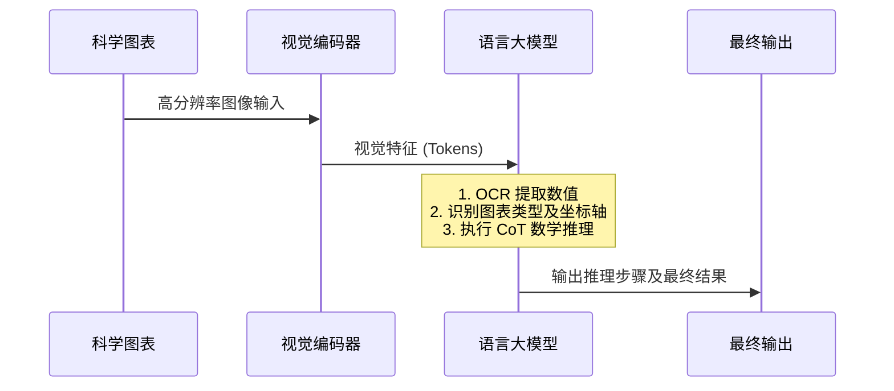
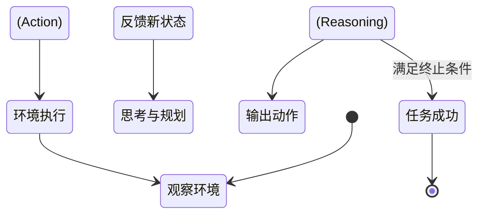

# 8.2.5 · VLM 的评测与基准

随着视觉语言模型(Vision-Language Models, VLMs)能力的飞速发展, 传统的图像分类或简单的视觉问答(VQA)已经无法全面衡量现代 VLM 的真实水平. 当下的 VLM 被要求能够理解复杂的科学图表、解析数百页的文档、执行精准的像素级 Grounding, 甚至作为多模态 Agent 在真实操作系统或网页中完成长序列任务. 

为了全面、客观地评估这些能力, 学术界和工业界提出了大量的评测基准(Benchmarks). 本节将深度剖析 VLM 的核心评测体系, 覆盖 OCR、DocVQA、多学科推理(MMMU)、视频理解、Grounding 以及 Agent 基准, 并探讨当前评测范式所面临的严峻挑战与局限性. 

<!-- placeholder: 插入一张概览图, 展示 VLM 评测基准的演进历史(从传统的 VQA v2 到如今的 MMMU 和 Agent 评测集), 横轴为时间, 纵轴为任务复杂度.  -->

## 1. 评测范式的演进与分类

VLM 的评测范式大致经历了三个阶段：
1. **感知为主**：以 ImageNet(分类)、COCO(检测/分割)、VQA v2 为代表, 侧重于模型对图像中基础物体、属性及简单关系的识别. 
2. **认知与推理**：以 ScienceQA、MathVista、MMMU 为代表, 要求模型具备专业知识、跨模态对齐能力以及复杂的逻辑推理能力. 
3. **交互与动作(Agentic)**：以 WebVoyager、OSWorld 为代表, 将 VLM 置于动态环境中, 评测其规划、决策及操作能力. 

下面是一个 VLM 能力评测维度的分类导图：



## 2. 文本密集型与文档理解(OCR & DocVQA)

在许多实际应用中(如财务发票分析、历史文档数字化、自动阅卷), 图像中包含大量密集的文本. 模型不仅需要“看”到文字(OCR), 还需要理解文字在文档排版中的结构关系, 并结合自然语言进行推理. 

### 2.1 OCR-centric 评测：TextVQA 与 OCR-VQA

**TextVQA** 和 **OCR-VQA** 侧重于测试模型提取和理解图像中自然存在文本的能力(如路牌、书籍封面、商品标签). 

- **TextVQA**: 要求模型回答必须依靠图像中读取文本才能解答的问题. 例如, 图片是一块写着“Speed Limit 55”的牌子, 问题是“最高限速是多少？”
- **评估指标**: 通常使用 VQA Accuracy(准确率), 如果模型的预测与人类标注者的答案高度匹配(经过特定的归一化处理), 则得分. 

**技术难点**:
传统方法采用外部的 OCR 引擎(如 Tesseract, PaddleOCR)提取文字, 再送入 LLM. 但现代原生 VLM(如 Qwen-VL, GPT-4V)则强调整体端到端训练. 评测集极大地考验了 Vision Encoder 的分辨率. 如果分辨率低于 448x448, 极易导致文字模糊而产生幻觉(Hallucination). 

### 2.2 DocVQA：文档视觉问答

**DocVQA** 聚焦于由扫描文档或 PDF 渲染而成的图像, 不仅包含文字, 还包含表格、印章、表单线框等复杂的排版结构(Layout). 

- **数据集特征**: 包含海量的发票、公文、学术论文. 
- **任务形式**: 抽取式问答(Extractive QA)和推理问答. 
- **ANLS 指标 (Average Normalized Levenshtein Similarity)**: 
  由于文档文字可能存在轻微的识别错误, DocVQA 引入了基于编辑距离的 ANLS 指标来评估答案. 
  $$ ANLS = \frac{1}{N} \sum_{i=1}^{N} \left( \max_{j} \left( 1 - \frac{L(a_i, g_{ij})}{\max(|a_i|, |g_{ij}|)} \right) \right) $$
  其中 $L$ 为 Levenshtein 距离, $a_i$ 为预测答案, $g_{ij}$ 为真实标注(多个标注中的最优匹配). 如果相似度低于 0.5, 则该项得分为 0. 

### 2.3 图表与数学：ChartQA 与 MathVista

科学文献往往包含高度抽象的信息表达形式, 如柱状图、折线图、几何图形. 

- **ChartQA**: 要求模型读取图表并回答问题. 难点在于数值提取和数学计算(如“2023年的销量比2022年增长了百分之几？”). 
- **MathVista**: 一个综合性评测基准, 集成了几何、代数、科学图表等多种数学相关视觉任务. 该基准高度依赖于 VLM 内部的逻辑链条(Chain-of-Thought, CoT)能力. 



## 3. 多学科与复杂推理(MMMU, MMBench, MM-Vet)

随着模型的感知能力逐渐饱和(在简单 VQA 任务上接近人类水平), 学术界提出了“博士级”或“大学级”难度的基准, 用以压测模型的认知天花板. 

### 3.1 MMMU (Massive Multi-discipline Multimodal Understanding)

**MMMU** 是目前最具挑战性的 VLM 评测集之一. 它涵盖了大学水平的六大核心学科(艺术与设计、商业、科学、健康与医学、人文与社会科学、技术与工程), 细分为几十个子学科. 

- **题型特点**: 包含极其罕见的专业图像(如医学 X 光片、地质地层图、复杂的微观化学结构图、乐谱等). 
- **评测意义**: 测试 VLM 的世界知识储备以及将多模态信息与专家级领域知识对齐的能力. 许多开源模型在 MMMU 上的准确率仅有 30-40%, 甚至部分题目的表现接近随机猜测. 

<!-- placeholder: 插入一个包含 MMMU 题目示例的对比图, 左侧是化学结构图, 右侧是乐谱, 展示评测任务的多样性.  -->

### 3.2 MMBench：细粒度能力雷达图

**MMBench** 不仅仅提供一个总分, 而是建立了一套细粒度的能力评估体系(如：目标定位、逻辑推理、空间关系、属性识别等). 

- **CircularEval (循环评估)**: 为了防止模型通过“盲猜”多选题(例如偏好选 C)获得高分, MMBench 引入了循环评估策略. 对于一个包含 A、B、C、D 选项的问题, 评测系统会对选项顺序进行圆周移位(Shift), 模型必须在所有排列组合下都能选中正确的语义答案, 才算真正答对. 这极大降低了偶然猜对的概率. 
- **输出格式化**: 使用 ChatGPT 作为一个辅助法官(Judge), 将 VLM 自由形式的回答映射回具体的选项, 保证了评测的自动化和公平性. 

### 3.3 MM-Vet：评估大模型的“木桶短板”

**MM-Vet** 考察 VLM 在解决复杂任务时综合运用多种能力(如 OCR、常识、空间、颜色等)的表现. 它的理论基础是：在解决综合问题时, VLM 的表现取决于其最弱的单项能力(短板效应). 

## 4. 定位与 Grounding 评测

除了回答“是什么”(What), VLM 还需要回答“在哪里”(Where). 这种将自然语言与图像像素/区域进行绑定对齐的能力被称为 **Grounding**. 

### 4.1 经典 Grounding 基准

- **RefCOCO / RefCOCO+ / RefCOCOg**: 引用表达理解(Referring Expression Comprehension, REC). 给定一段描述(如“穿着红衣服在最左边奔跑的男孩”), 模型需要输出该目标在图像中的边界框(Bounding Box, Bbox). 
- **Flickr30k Entities**: 测试模型能否将一句话中的多个名词短语分别对应到图像的不同区域. 

### 4.2 评估指标：IoU 与 准确率

Grounding 任务最核心的指标是 **IoU (Intersection over Union)**. 
$$ IoU = \frac{Area(B_{pred} \cap B_{gt})}{Area(B_{pred} \cup B_{gt})} $$
通常规定 $IoU \ge 0.5$ 即视为定位准确(Accuracy @ 0.5). 

### 4.3 新型生成式 Grounding 评测

针对现代能够输出 Bbox 坐标的自回归 VLM(如 Shikra, Qwen-VL, Ferret), 评测不再局限于传统的检测数据集. 
- **G-LLaVA / Ferret Bench**: 测试模型在多轮对话中, 能否自然地输出带有坐标的文本, 或者在输入中接受用户提供的坐标进行精确回答(Point-to-Text). 

```json
// Grounding 输出示例
{
  "user": "这张图里有什么危险物品吗？",
  "vlm_response": "是的, 在图像右下角有一个 [尖锐的玻璃碎片]<box_2d>[750, 800, 850, 920]</box_2d>. "
}
```

## 5. 视频理解基准(Video VLM)

视频引入了**时间维度(Temporal Dimension)**, 要求模型能够理解帧与帧之间的因果关系、动作发生的前后顺序以及长视频中的剧情发展. 

### 5.1 MVBench

**MVBench (Multimodal Video Benchmark)** 专门为了测试模型的时间推理能力而设计. 由于传统的视频问答往往可以通过单帧图像(如抽帧)猜出答案, MVBench 刻意设计了那些**必须依赖时序信息**才能解答的问题. 

- 涵盖任务：动作预测、动作顺序判断、细粒度动作识别、因果关系分析. 

### 5.2 Video-MME

随着模型支持的上下文长度增加(如 Gemini 1.5 Pro 支持数百万 Tokens, 可以输入几小时的视频), **Video-MME** 应运而生, 旨在全面评估超长视频的理解能力. 

- **维度设计**: 包含短视频(<1分钟)、中长视频(1-5分钟)和长视频(>5分钟). 
- **模态融合**: 强调对视频流、音频流和字幕(Subtitles)的联合理解. 

## 6. Agent 与具身智能基准

VLM 正在从“旁观者”进化为能够执行操作的“行动派”(Agent). 在此类基准中, VLM 作为驱动引擎, 需要在 GUI 界面、网页或 3D 环境中执行多步任务. 

### 6.1 GUI 与网页操作导航

- **Mind2Web & WebVoyager**: 给定一个指令(如“在亚马逊上帮我找一款 100 美元以下的红色机械键盘”), 模型需要观察当前的网页截图, 解析 DOM 树, 并输出具体的动作(Click, Type, Scroll). 
- **评估方式**: 
  - 任务成功率(Success Rate, SR)：是否最终达成了用户目标. 
  - 轨迹匹配度(Trajectory Match)：模型的动作序列与人类专家轨迹的重合程度. 

### 6.2 OSWorld：操作系统级代理

**OSWorld** 是一个交互式的计算机环境(支持 Ubuntu 等), VLM 可以控制鼠标和键盘. 评测要求模型完成诸如“打开终端, 配置环境变量, 然后启动服务器并用浏览器访问”这样的复杂工作流. 

- **挑战**: 在 OS 级别, 操作的反馈是实时的、高度不确定的. 模型必须具备自我纠错(Self-Correction)和闭环反馈能力. 如果点错了一个窗口, 必须能识别并退回上一步. 



## 7. 当前评测基准的局限性与危机

尽管 VLM 评测基准层出不穷, 但整个评测生态正面临着前所未有的危机. 

### 7.1 数据污染(Data Contamination)

这是大模型时代最严峻的问题. 由于许多 VLM 在预训练或指令微调阶段无差别地爬取了互联网数据, 很多评测集(如 COCO, VQA v2, 甚至最新的 MMMU)的题目和答案可能已经存在于模型的训练集中. 
- **后果**: 评测分数虚高, 无法反映模型真实的泛化能力. 
- **应对策略**: 引入动态基准(定期更新题目, 如使用每日新闻或最新发表的论文生成问题). 

### 7.2 指标的脆弱性：LLM-as-a-Judge 的偏差

对于开放式生成任务, 传统指标(BLEU, ROUGE)失效. 学术界广泛使用 GPT-4 作为裁判(LLM-as-a-Judge)给模型的回答打分. 但 LLM 裁判存在以下偏见：
- **位置偏见(Position Bias)**: 倾向于给选项A或者放在前面的答案打高分. 
- **长度偏见(Verbosity Bias)**: 倾向于认为长篇大论的回答质量更高, 即使其中包含废话. 
- **自吹自擂偏见(Self-Enhancement Bias)**: 比如 GPT-4 倾向于给自身生成的文本打更高分. 

### 7.3 视觉幻觉的隐蔽性

现有的评测集很难全面评估 VLM 的幻觉问题. 传统的 POPE(Object Hallucination Benchmark)只能测试简单的物体是否存在, 但模型在描述复杂场景、推理关系时产生的逻辑幻觉, 缺乏规模化的自动化评测手段. 

### 7.4 静态到动态的脱节

绝大多数静态测试集(看图说话)无法代表动态环境(Agent 交互)中的真实能力. 一个在 MMMU 上拿高分的模型, 在 OSWorld 中可能连最基础的“点击关闭按钮”都会因为视觉分辨率不够或规划能力差而失败. 

## 8. 未来发展方向

1. **统一评测工具链的标准化**: 社区正在推动如 VLMEvalKit、LMMS-Eval 这样的框架, 确保不同模型在完全相同的 Prompt 模板和后处理逻辑下进行对比. 
2. **生成对抗式评测**: 使用其他 VLM 专门生成“对抗性样本”(Adversarial Examples)来攻击被测模型, 寻找其弱点边界. 
3. **真实世界人类盲测(Chatbot Arena)**: 类似于 LMSYS 推出的 Vision Arena, 通过人类用户的真实对话输入进行双盲 A/B 测试, 是目前被认为最贴近真实体验的终极评测方式. 

<!-- placeholder: 插入一张 Vision Arena 盲测界面的截图模拟, 展示两个模型回答结果的并排对比及用户的投票按钮.  -->

---
*编者注：VLM 的评测是一个快速迭代的领域, 新的基准几乎每个月都在发布. 在实际工程落地时, 开发者切忌唯榜单论(Leaderboard Chasing), 必须构建贴合自身业务场景的私有评测集(Private Benchmark). *
