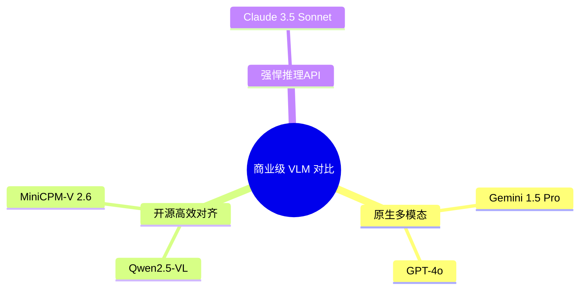
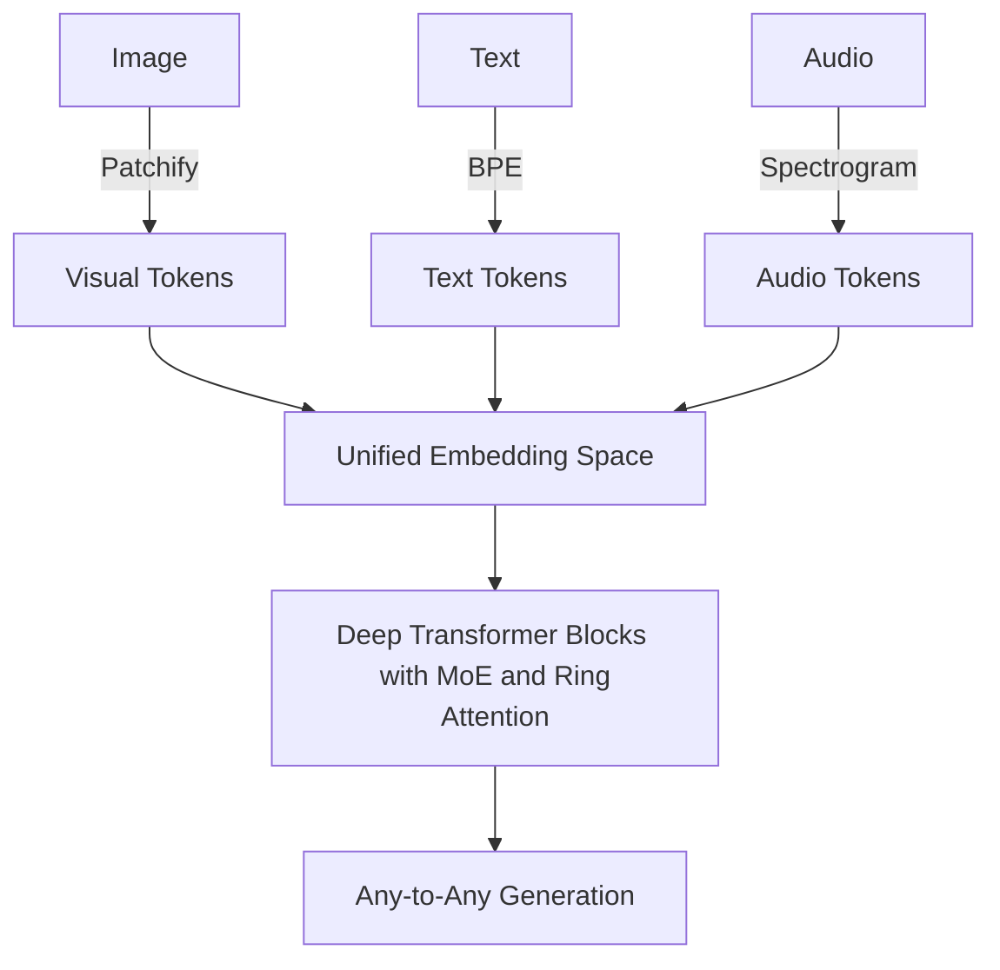
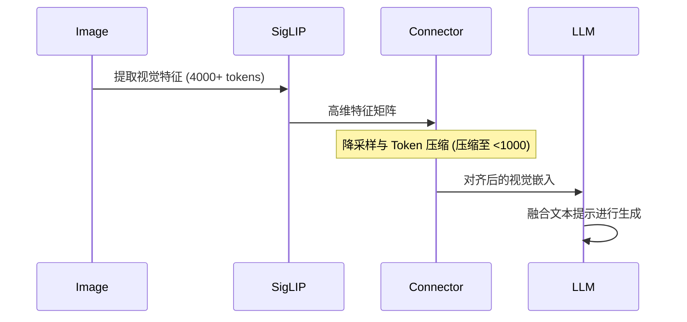

# 8.2.6 · 商业级 VLM 深度对比分析

> 本文针对当前最主流的几款顶级视觉语言模型(Vision-Language Models, VLM)进行深度剖析. 覆盖的模型包括 Google 的 **Gemini** 系列、OpenAI 的 **GPT-4o**、通义千问的 **Qwen2.5-VL**、面壁智能的 **MiniCPM-V**, 以及 Anthropic 的 **Claude-Vision** (Claude 3.5 系列). 通过架构选择、训练策略、位置编码、以及推理部署层面的综合对比, 探究各家 VLM 技术的护城河与未来演进方向. 

<!-- [IMAGE_PLACEHOLDER]: A highly detailed futuristic digital artwork illustrating five distinct artificial intelligence cores (representing Gemini, GPT-4o, Qwen, MiniCPM, and Claude) interconnected by glowing data streams carrying visual and textual information, set against a dark cyberpunk aesthetic background. -->

## 1. 行业格局与演进脉络

在过去的迭代中, 视觉大模型经历了从**外挂式视觉编码器**(如 CLIP + LLM 的拼接架构)向**原生多模态**(Native Multimodal)架构的演进. 当前的商业级 VLM 阵营, 根据其底层架构的设计哲学, 大致可划分为以下几个流派：

1. **原生端到端统一架构**：以 GPT-4o 和 Gemini 1.5 为代表, 从头开始将多模态数据混合训练, 网络内不显式区分视觉与文本的独立 Backbone. 
2. **高效视觉对齐架构**：以 Qwen2.5-VL 和 MiniCPM-V 为代表, 依托强大的开源纯文本 LLM, 结合先进的视觉编码器(如 SigLIP, ViT), 通过复杂的 Connector 与创新的位置编码(如 M-RoPE)实现深度对齐. 
3. **黑盒但极简的 API 派**：以 Claude 3/3.5 的视觉能力为代表, 外部调用极其简单, 重点在于强大的跨模态逻辑推理. 



## 2. 核心架构设计深度剖析

### 2.1 Gemini: 原生多模态 Any-to-Any 架构

Gemini 的设计从第一天起就摈弃了“拼接”的思路. 传统的拼接模型通常是将图像通过一个预训练的 ViT(Vision Transformer)提取特征 $f_v \in \mathbb{R}^{N \times D}$, 然后通过一个线性层或 Q-Former 投影到文本嵌入空间中. 这种方式不可避免地会丢失视觉的细粒度信息. 

Gemini 采用的是一种更原生的方式, 多模态 Token 在进入 Transformer 块之前, 就已经被统一到一个隐空间中：
$$
 H_0 = [E_{text}(x_{text}) ; E_{vision}(x_{image}) ; E_{audio}(x_{audio})]
$$
其中, 各个模态经过特定模态的浅层 Patchifier 后, 被映射到维度为 $d_{model}$ 的空间. 
Gemini 1.5 更引入了稀疏混合专家架构 (MoE) 和 Ring Attention 技术, 使其支持高达 2M tokens 的超长上下文. 



### 2.2 GPT-4o: 全模态统一(Omni)

GPT-4o 中的 "o" 代表 "omni". 与之前 GPT-4V 依赖外部模型(如 Whisper)处理音频、再由文本模型处理视觉特征的级联架构不同, GPT-4o 是第一个真正意义上在一个单一神经网络内原生处理音频、视觉、文本的模型. 

对于视觉特征的处理, GPT-4o 在底层极其精细. 它不再是简单的固定分辨率 Patch, 而是支持动态分辨率处理. 针对高分辨率图像, 模型会将其切分为多个小的 Crop(通常是 512x512), 外加一个全局降采样图(Global Context). 
设输入图像为 $I$, 经过动态切片后得到局部 Patch $P_i$ 和全局图 $G$, 视觉特征的计算可以近似表示为：
$$
 F_{vision} = \text{Transformer}\left([E(G) ; E(P_1) ; E(P_2) ; \dots ; E(P_k)]\right)
$$

**代码示例：GPT-4o 的高分辨率视觉请求**
```python
import base64
import requests
import os

# 读取本地图像并转码
def encode_image(image_path):
    with open(image_path, "rb") as image_file:
        return base64.b64encode(image_file.read()).decode('utf-8')

base64_image = encode_image("high_res_sample.jpg")

headers = {
  "Content-Type": "application/json",
  "Authorization": f"Bearer {os.environ['OPENAI_API_KEY']}"
}

payload = {
  "model": "gpt-4o",
  "messages": [
    {
      "role": "user",
      "content": [
        {
          "type": "text",
          "text": "详细描述图片中的各个细节, 并提取出其中的公式. "
        },
        {
          "type": "image_url",
          "image_url": {
            "url": f"data:image/jpeg;base64,{base64_image}",
            "detail": "high" # 启用高分辨率切片模式
          }
        }
      ]
    }
  ],
  "max_tokens": 800
}

response = requests.post("https://api.openai.com/v1/chat/completions", headers=headers, json=payload)
print(response.json())
```

### 2.3 Qwen2.5-VL: M-RoPE 与动态分辨率的突破

Qwen2.5-VL 是近期开源社区的标杆. 其最核心的技术突破在于**多模态旋转位置编码(Multimodal Rotary Positional Embedding, M-RoPE)**. 

传统 LLM 中的 RoPE 是基于一维的序列索引设计的. 而对于视觉, 图像具有二维空间结构(高度和宽度), 视频则具有三维结构(时间、高度、宽度). M-RoPE 通过将一维位置编码扩展为多维, 从而完美保持了视觉信息的空间与时序关系. 

**M-RoPE 的数学表达：**
在标准的 RoPE 中, 对于位置 $m$, 其编码为矩阵 $R_{\Theta, m}$：
$$
 R_{\Theta, m} = \text{diag}(\dots, \begin{pmatrix} \cos m\theta_i & -\sin m\theta_i \\ \sin m\theta_i & \cos m\theta_i \end{pmatrix}, \dots)
$$
在 Qwen2.5-VL 中, 由于 Token 既有时间维度 $t$, 又有空间维度 $h$(高度)和 $w$(宽度), 旋转矩阵被分解为：
$$
 R_{\Theta, (t,h,w)} = R^{(T)}_{\Theta_1, t} \otimes R^{(H)}_{\Theta_2, h} \otimes R^{(W)}_{\Theta_3, w}
$$
这意味着模型不仅知道“当前是哪个 Token”, 还准确知道“这是第几帧的第几行第几列的 Token”. 

此外, Qwen2.5-VL 实现了 **ViT 的动态分辨率** (Dynamic Resolution), 摒弃了绝对的 224x224 或 336x336 的固定输入. 它可以根据图像的实际宽高比将其动态切块, 极大提高了对文档、发票、长图的 OCR 识别准确率. 

### 2.4 MiniCPM-V: 端云协同与极致的参数效率

面壁智能推出的 MiniCPM-V 2.6 是典型的“以小博大”架构. 其主要针对端侧设备(如手机、边缘计算节点)进行优化, 模型总参数量控制在 8B 级别, 却在多个榜单上比肩 70B+ 的大型模型. 

**架构特点：**
- **SigLIP 视觉编码器**：使用 SigLIP 替代传统的 CLIP-ViT, SigLIP 采用 sigmoid 损失替代 softmax, 在细粒度特征对齐上表现更优. 
- **LDP (Layer-wise Dropping of Tokens)**：为了降低计算量, 在 Connector 层采用了动态 Token 丢弃策略, 只保留最具信息量的视觉 Token 传递给 LLM. 
- **DPO (Direct Preference Optimization) for VLM**：在 RLHF 阶段, MiniCPM-V 大量使用了视觉偏好对齐, 解决幻觉 (Hallucination) 问题. 



### 2.5 Claude-Vision (Claude 3.5 Sonnet)

Anthropic 的 Claude 3.5 Sonnet 在视觉基准测试中经常展现出惊人的“常识推理”与“代码逆向生成”能力. 尽管底层架构未完全开源, 但其表现出的技术特点包括：
- **极强的图表理解能力**：能够精确提取复杂数学图表、甘特图中的数据关系. 
- **视觉防幻觉机制**：Claude 3.5 在生成文本描述前, 疑似引入了类似于 Chain-of-Thought (CoT) 的视觉验证步骤. 在给出最终结论前, 模型会隐式地输出关于图像各个区域的“观察结果”. 
- **UI 到代码的转换**：对于前端开发者, Claude 3.5 提供的 Artifacts 功能可以根据 UI 截图直接输出精准的 React + Tailwind 代码, 这要求其视觉编码器具备像素级的结构理解能力. 

---

## 3. 后训练策略 (Post-Training) 对比

当前的商业 VLM 已经跨越了单纯的“看图说话”, 进入了“看图执行复杂任务”的阶段. 这就对后训练(特别是 SFT 和 RLHF)提出了极高要求. 

### 3.1 Visual Instruction Tuning
在指令微调阶段, 各家都构建了极其复杂的混合数据集：
- **交错图文数据 (Interleaved Image-Text)**：类似网页结构, 图文混排. 
- **密集描述 (Dense Captioning)**：对图片每一处细节提供精确的边界框与描述. 
- **视觉数学与推理**：结合 Geometry3K 等几何数据集, 强迫模型不仅“看”, 还要“算”. 

### 3.2 偏好对齐与幻觉抑制
**幻觉(Hallucination)**是 VLM 的致命弱点. 例如, 图里明明没有“红色汽车”, 模型却言之凿凿地说有. 
通过构建对比数据集进行 DPO, 损失函数设计为：
$$
 \mathcal{L}_{DPO} = - \mathbb{E}_{(x, y_w, y_l) \sim \mathcal{D}} \left[ \log \sigma \left( \beta \log \frac{\pi_\theta(y_w|x)}{\pi_{ref}(y_w|x)} - \beta \log \frac{\pi_\theta(y_l|x)}{\pi_{ref}(y_l|x)} \right) \right]
$$
其中, $x$ 为(图像, 提示)对, $y_w$ 是正确且忠实于图像的回答, $y_l$ 是产生幻觉的回答. 

---

## 4. 性能基准与综合评价

下表总结了五款顶级 VLM 在典型任务中的相对表现与适用场景. 

| 模型 | OCR与文档理解 | 空间与逻辑推理 | 端侧部署可行性 | 长视频理解 | 核心优势 |
| :--- | :---: | :---: | :---: | :---: | :--- |
| **GPT-4o** | S | S+ | 低 (仅API) | A (需抽帧) | 最强的常识推理, 最快的多模态响应速度 |
| **Gemini 1.5 Pro** | A+ | S | 极低 (仅API) | **S+** (原生支持长视频) | 超长上下文窗口 (2M tokens), 原生长视频 |
| **Claude 3.5 Sonnet**| S | S+ | 极低 (仅API) | B | UI 转代码能力顶级, 极少幻觉 |
| **Qwen2.5-VL** | **S+** (动态分辨率) | A+ | 中 (开源权重) | S (支持长时序) | 中文 OCR 无敌, 结构化输出能力强, 开源 |
| **MiniCPM-V** | A | A | **S+** (8B级别) | B | 端侧性能王者, 资源占用极小, 高性价比 |

<!-- [IMAGE_PLACEHOLDER]: A highly detailed radar chart comparing GPT-4o, Gemini 1.5, Claude 3.5, Qwen2.5-VL, and MiniCPM-V across dimensions: OCR, Code Generation, Hallucination Resistance, Deployment Flexibility, and Video Understanding. Use sleek, modern dashboard design styles. -->

### 4.1 细分领域王者分析

**1. 复杂文档与发票识别：首选 Qwen2.5-VL**
得益于其动态分辨率切片和优异的中英文语料库, Qwen2.5-VL 在处理混排了表格、印章、手写体的 PDF/发票时, 能够保持极低的漏字率. 

**2. 前端开发与设计辅助：首选 Claude 3.5 Sonnet**
在根据 Mockup 或草图生成 React 组件方面, Claude 的表现断崖式领先. 它不仅能捕捉布局, 还能准确推断出合理的色彩搭配与 CSS class. 

**3. 大规模视频理解：首选 Gemini 1.5 Pro**
1.5 Pro 强大的 200万 Token 上下文, 使其可以直接吞下长达一小时的视频内容. 无论是寻找视频中的特定事件帧, 还是总结长篇电影, 其多模态 Ring Attention 都展现了无可匹敌的优势. 

---

## 5. Qwen2.5-VL 部署与实战代码分享

不同于闭源 API, 开源的 Qwen2.5-VL 允许我们在本地 GPU 上实现强大的视觉理解. 以下是一个使用 `transformers` 与 `vLLM` 进行高效推理的实战示例：

```python
import torch
from PIL import Image
from transformers import AutoProcessor, Qwen2VLForConditionalGeneration

# 1. 加载模型与处理器 (需开启 Flash Attention 2)
model_id = "Qwen/Qwen2.5-VL-7B-Instruct"
processor = AutoProcessor.from_pretrained(model_id)
model = Qwen2VLForConditionalGeneration.from_pretrained(
    model_id,
    torch_dtype=torch.bfloat16,
    attn_implementation="flash_attention_2",
    device_map="auto"
)

# 2. 准备图像与提示
image_path = "financial_report.png"
image = Image.open(image_path)

messages = [
    {
        "role": "user",
        "content": [
            {"type": "image", "image": image},
            {"type": "text", "text": "请提取这张财务报表中的核心数据, 并以 Markdown 表格的形式输出. "},
        ],
    }
]

# 3. 模板化并进行特征处理
text = processor.apply_chat_template(messages, tokenize=False, add_generation_prompt=True)
inputs = processor(
    text=[text],
    images=[image],
    padding=True,
    return_tensors="pt"
).to(model.device)

# 4. 生成回复
generated_ids = model.generate(**inputs, max_new_tokens=1024)
generated_ids_trimmed = [
    out_ids[len(in_ids):] for in_ids, out_ids in zip(inputs.input_ids, generated_ids)
]
output_text = processor.batch_decode(generated_ids_trimmed, skip_special_tokens=True, clean_up_tokenization_spaces=False)

print(output_text[0])
```

> **[!TIP]**
> 在本地部署时, 如果遇到 OOM (Out Of Memory) 错误, 可以通过调整 `max_dynamic_patch` 参数来限制输入图像的最大切片数量, 从而平衡显存消耗与图像理解精度. 

## 6. 总结与展望

商业级 VLM 的竞争已经进入白热化阶段. 从技术路线上看, “原生多模态”与“融合架构”各有千秋. API 驱动的模型(GPT-4o, Claude 3.5, Gemini)正在追求**更低的延迟**与**全双工的人机交互**(如实时音视频通话); 而开源阵营(Qwen, MiniCPM)则在大力推进**端侧化**与**高性价比推理**. 

未来的 VLM 不再仅仅是被动回答问题的模型, 它们正在进化为能够自主操作电脑、浏览网页、使用软件的 **Visual Agents (视觉智能体)**. 随着底层位置编码、端到端生成架构的进一步完善, 跨模态的智能护城河将被持续拓宽. 
