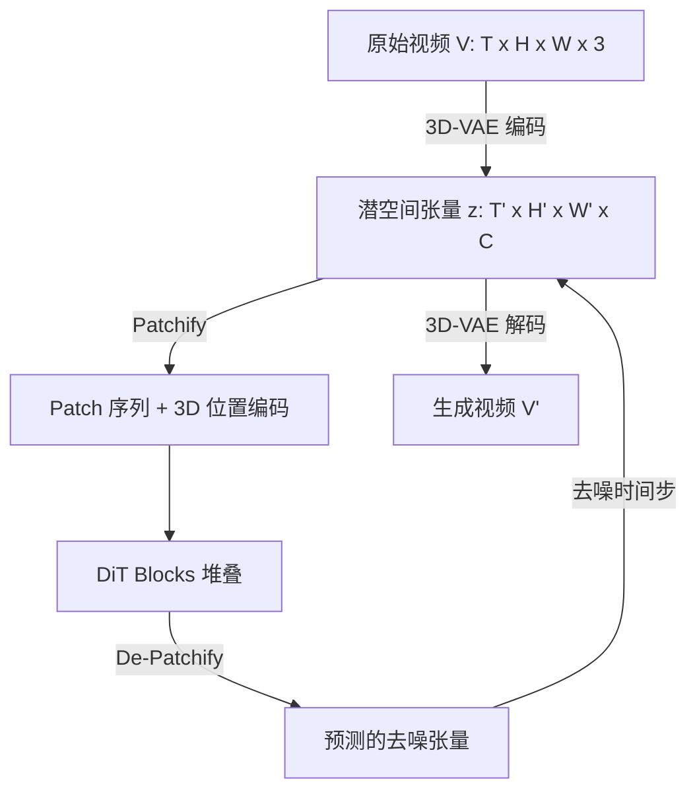
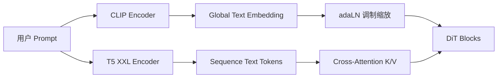
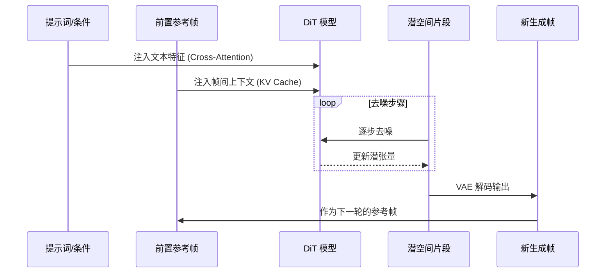

# 8.6 视频生成模型 (Video Generation Models)

视频生成是多模态人工智能领域最具挑战性的任务之一. 相较于静态图像生成, 视频不仅需要保持每一帧的空间结构(Spatial Structure)高质量和合理性, 还需要在时间维度(Temporal Dimension)上维持高度的时序一致性和物理规律连贯性. 随着 Sora 等闭源巨作的问世以及开源社区(如 Stable Video Diffusion, Open-Sora 等)的不断演进, 视频生成架构已经发生了一次深刻的范式转移：从早期的 U-Net 架构转向了 **Diffusion Transformer (DiT)** 架构, 并且在时空联合建模、生成控制和系统工程上取得了质的突破. 

本文将从深度技术原理出发, 详细剖析当前最前沿的视频生成模型架构、数学基础、代码实现思路及其关键工程技术. 

---

## 1. 视频生成的演进与基础架构

视频生成领域经历了基于 GAN(生成对抗网络)、自回归(Autoregressive Models)以及扩散模型(Diffusion Models)的多个阶段. 当前主流已被扩散模型统治. 

### 1.1 扩散模型基础理论回顾与推导

现代视频生成绝大多数基于连续时间或离散时间的扩散模型. 对于数据分布 $x_0 \sim q(x_0)$, 前向加噪过程可以通过随机微分方程(SDE)来描述：

$$
dx_t = f(x_t, t)dt + g(t)dw
$$

其中, $w$ 是标准维纳过程. 对应的逆向去噪过程同样是一个 SDE：

$$
dx_t = [f(x_t, t) - g(t)^2 \nabla_{x_t} \log p_t(x_t)]dt + g(t)d\bar{w}
$$

模型的核心任务是通过神经网络去近似这个得分函数(Score Function)：$s_\theta(x_t, t) \approx \nabla_{x_t} \log p_t(x_t)$. 

在常用的 DDPM(Denoising Diffusion Probabilistic Models)离散时间设定下, 前向过程被定义为一个马尔可夫链：
$$
q(x_t | x_{t-1}) = \mathcal{N}(x_t; \sqrt{1 - \beta_t} x_{t-1}, \beta_t I)
$$

借助于重参数化技巧, 我们可以直接从 $x_0$ 采样出任意步数 $t$ 的 $x_t$：
$$
q(x_t | x_0) = \mathcal{N}(x_t; \sqrt{\bar{\alpha}_t} x_0, (1 - \bar{\alpha}_t) I)
$$
其中 $\alpha_t = 1 - \beta_t$, $\bar{\alpha}_t = \prod_{s=1}^t \alpha_s$. 这表明我们可以将输入数据加上特定方差的噪声. 

在视频生成中, 常用的目标函数不再仅仅是预测噪声 $\epsilon$, 而是预测速度 $v$($v$-prediction)以获得更好的数值稳定性, 特别是对于高分辨率长视频：
$$
v_t = \sqrt{\bar{\alpha}_t} \epsilon - \sqrt{1 - \bar{\alpha}_t} x_0
$$
目标是最小化均方误差：
$$
\mathcal{L}_{v} = \mathbb{E}_{x_0, \epsilon, t} \left[ \| v_\theta(x_t, t) - v_t \|_2^2 \right]
$$

### 1.2 从 U-Net 到 DiT (Diffusion Transformer) 的范式转移

早期的视频扩散模型(如 Imagen Video, Make-A-Video)主要沿用图像生成中的 U-Net 架构, 通过插入 1D 时间卷积(Temporal Convolution)和时间注意力(Temporal Attention)层将 2D U-Net 升级为 3D U-Net. 
然而, 随着算力和数据规模的指数级增加, U-Net 在跨模态对齐和长期依赖建模上的天花板逐渐显现. U-Net 的下采样和上采样操作在时间维度上极易丢失高频细节. 

**Diffusion Transformer (DiT)** 由此崛起. DiT 摒弃了传统卷积网络中的跨层连接, 直接在潜空间(Latent Space)对输入进行 Patch 化操作. 



#### 1.2.1 DiT Block 的代码级理解

DiT 的核心在于其 Transformer Block, 其中结合了自适应层归一化(adaLN), 用于注入时间步 $t$ 和文本条件 $c$. 以下是简化的 PyTorch 伪代码：

```python
import torch
import torch.nn as nn

class DiTBlock(nn.Module):
    def __init__(self, hidden_size, num_heads):
        super().__init__()
        self.norm1 = nn.LayerNorm(hidden_size, elementwise_affine=False)
        self.attn = nn.MultiheadAttention(hidden_size, num_heads, batch_first=True)
        self.norm2 = nn.LayerNorm(hidden_size, elementwise_affine=False)
        self.mlp = nn.Sequential(
            nn.Linear(hidden_size, hidden_size * 4),
            nn.GELU(),
            nn.Linear(hidden_size * 4, hidden_size)
        )
        # 用于将条件(t, c)映射为缩放和偏移的MLP
        self.adaLN_modulation = nn.Sequential(
            nn.SiLU(),
            nn.Linear(hidden_size, 6 * hidden_size, bias=True)
        )

    def forward(self, x, cond):
        # cond: [batch_size, hidden_size]
        shift_msa, scale_msa, gate_msa, shift_mlp, scale_mlp, gate_mlp = self.adaLN_modulation(cond).chunk(6, dim=1)
        
        # 带有adaLN的自注意力
        norm_x1 = self.norm1(x) * (1 + scale_msa.unsqueeze(1)) + shift_msa.unsqueeze(1)
        attn_out, _ = self.attn(norm_x1, norm_x1, norm_x1)
        x = x + gate_msa.unsqueeze(1) * attn_out
        
        # 带有adaLN的MLP
        norm_x2 = self.norm2(x) * (1 + scale_mlp.unsqueeze(1)) + shift_mlp.unsqueeze(1)
        mlp_out = self.mlp(norm_x2)
        x = x + gate_mlp.unsqueeze(1) * mlp_out
        
        return x
```

这种架构的优雅之处在于, 所有时空交互都在 Attention 机制内完成, 而所有条件注入都在 adaLN 调制内完成. 

---

## 2. DiT 核心技术：时空建模 (Spatiotemporal Modeling)

在视频生成中, 如何在巨大的时空维度中捕捉相关性是核心难点. 模型需要既能理解单帧画面的“长什么样”(空间属性), 也要理解“怎么动”(时间属性). 

### 2.1 3D-VAE：潜空间的时空压缩

视频数据存在极大的空间冗余和时间冗余. 传统的 2D-VAE 逐帧压缩虽然能减小空间尺寸, 但忽视了时间连续性. 
现代视频 DiT(例如 Sora 使用的架构)普遍采用 **3D-VAE (Spatiotemporal Autoencoder)**. 

3D-VAE 在编码器和解码器中都使用 3D 卷积(如 $3\times3\times3$ Conv). 假设输入分辨率为 $(T, H, W)$, 典型的下采样率为 $(4, 8, 8)$：
- 时间维下采样：将 $T$ 帧压缩为 $T/4$. 
- 空间维下采样：将 $H, W$ 压缩为 $H/8, W/8$. 

举例来说, 一个 $16 \times 256 \times 256 \times 3$ 的视频片段, 经过下采样后变为 $4 \times 32 \times 32 \times C$. 张量元素数量从 3,145,728 降至 $4096 \times C$. 

<!-- [Image Placeholder: 3D-VAE 架构原理图. 展示原始多帧视频流输入, 经过多层3D ResNet Blocks不断在时间和空间维度下采样, 映射到高度压缩的Latent Space, 随后再对称上采样解码回RGB视频的过程. ] -->

### 2.2 时空注意力机制的因式分解与全局建模

一旦数据被压缩并 Patch 化为长度为 $N$ 的序列, Transformer 就需要对其进行注意力计算. 但如果直接进行全注意力(Full 3D Attention), 复杂度是 $\mathcal{O}(N^2)$. 假设一个 Patch 序列长度为 100K, 计算量将是毁灭性的. 

#### 2.2.1 Factorized Spatial-Temporal Attention (因式分解时空注意力)

这是最常见的高效策略. 将联合注意力拆分为先做空间注意力, 再做时间注意力. 
对于张量 $z \in \mathbb{R}^{B \times T \times (H \times W) \times D}$：

1. **空间注意力**：重塑为 $(B \times T) \times (H \times W) \times D$, 在此维度计算 Self-Attention. 
2. **时间注意力**：重塑为 $(B \times (H \times W)) \times T \times D$, 在此维度计算 Self-Attention. 

```python
# 简化的空间-时间因式分解注意力伪代码
def factorized_attention(x, B, T, H, W, D):
    # x shape: [B, T, H*W, D]
    
    # 1. 空间注意力
    x_spatial = x.view(B * T, H * W, D)
    x_spatial = spatial_attention(x_spatial) # O((H*W)^2)
    x = x_spatial.view(B, T, H * W, D) + x
    
    # 2. 时间注意力
    x_temporal = x.transpose(1, 2).contiguous().view(B * (H * W), T, D)
    x_temporal = temporal_attention(x_temporal) # O(T^2)
    x = x_temporal.view(B, H * W, T, D).transpose(1, 2).contiguous() + x
    
    return x
```

这种设计极大降低了计算开销, 但在处理剧烈相机运动或物体快速横跨屏幕时, 解耦的空间和时间注意力可能无法完美捕捉复杂的时空交织特征. 

#### 2.2.2 Full 3D Attention与位置编码

为了解决因式分解的瓶颈, 像 Sora 一样的模型趋向于使用 **Full 3D Attention**. 为了使其可行, 位置编码至关重要. 
通常采用 **3D RoPE (Rotary Position Embedding)**, 分别沿着时间 $T$、高度 $H$、宽度 $W$ 计算旋转矩阵, 并将它们逐元素应用到 Query 和 Key 上, 从而使得模型理解不同 Patch 的绝对和相对 3D 距离. 

### 2.3 动态序列与长宽比 (Variable Resolution & Aspect Ratio)

DiT 的另一大优势是其作为“基于 Patch 的 Transformer”, 天生可以适应任何输入序列长度. 只需保证位置编码能够正确覆盖对应的时空坐标, 模型就能进行 Variable Resolution 的联合训练. 
例如, 可以将 $1920\times1080$ 的视频与 $1080\times1920$ 的视频一起送入同一个 Batch, 只要在注意力掩码(Attention Mask)中做好序列长度的对齐或使用打包(Packing)策略. 

---

## 3. 视频生成控制 (Generation Control)

单纯依靠文本提示(Prompt)进行视频生成是“开盲盒”. 在实际工业应用中, 对视频的**可控性**要求极高. 这涉及到跨模态对齐和运动控制. 

### 3.1 跨模态对齐 (Text-to-Video Alignment)

视频模型不仅要理解简短的名词, 还要理解动作的先后顺序(如“先...然后...”)、物体的空间关系及运镜方式. 
通常使用双重文本编码器：
- **CLIP (Contrastive Language-Image Pre-training)**：提供深度的语义特征, 擅长捕捉主体和风格. 
- **T5 (Text-to-Text Transfer Transformer)**：提供稠密的 token 级表征, 极其擅长理解复杂的句法、长文本描述及动作细节. 

文本特征通过交叉注意力(Cross-Attention)注入到 DiT Block 中. 



### 3.2 结构与运动控制 (ControlNet & Trajectory Guidance)

想要精准控制视频(比如让一个人按特定路线走, 或保留特定背景), 需要引入控制机制. 

1. **逐帧空间控制 (Spatial Control per frame)**：例如深度图 (Depth)、边缘图 (Canny) 或人体骨架 (OpenPose). 可以通过引入一个额外的 3D 零卷积分支(Zero-initialized 3D Convolution Layer), 将这些空间控制信号叠加进模型的中间特征中. 
   $$
   H_{out} = DiTBlock(H_{in}) + \mathcal{Z}(ControlFeature)

$$
   其中 $\mathcal{Z}$ 初始化为 0, 确保训练初期不干扰预训练模型. 

2. **运动轨迹控制 (Motion Trajectory Control)**：用户在屏幕上画一条线或指定光流(Optical Flow)方向. 这类控制通常在去噪过程的 Score 预测中加入显式的引导项(Guidance), 或在 Cross-Attention 图上进行局部遮罩(Attention Masking), 迫使特定物体的隐层特征随时间沿特定轨迹移动. 

### 3.3 视频续写与编辑 (Inpainting & Autoregressive Extension)

无限长视频生成的关键在于**首尾条件自回归(Autoregressive Condition)**. 
给定前 $k$ 帧, 生成接下来的 $m$ 帧. 在 DiT 中, 前 $k$ 帧可以通过 3D-VAE 编码为潜特征, 并在时间注意力计算时, 作为 KV 缓存(Key-Value Cache)固定提供给后续帧的 Query. 



在数学上, 视频生成被建模为条件概率：
$$
p(x_{t+1 \to t+m} | x_{1 \to t}, c)
$$
通过在模型的输入中拼接条件帧(带有特定掩码), 可以无缝实现视频的向前续写、向后插帧, 甚至视频内元素的无痕编辑. 

---

## 4. 评估体系与指标 (Evaluation Metrics)

视频生成评估由于多了时间维度, 比图像生成复杂得多. 目前尚无完美的单一指标, 通常依赖多维度的综合打分. 

### 4.1 生成质量评估
- **FVD (Fréchet Video Distance)**：计算真实视频集与生成视频集在使用预训练 I3D(Inflated 3D ConvNets)提取特征后的多元高斯分布差异. 
  $$
  FVD = \| \mu_r - \mu_g \|^2 + Tr(\Sigma_r + \Sigma_g - 2(\Sigma_r \Sigma_g)^{1/2})

$$
  FVD 越低, 表明生成的视频在空间和动作特征上与真实分布越接近. 
- **IS (Inception Score)**：衡量生成视频的多样性和清晰度. 

### 4.2 时序一致性评估 (Temporal Consistency)
- **光流误差 (Optical Flow Error/Warping Error)**：计算相邻帧之间的光流, 通过前一帧和光流场 warp 出后一帧, 与实际生成的后一帧进行像素级对比(如 PSNR / SSIM). 误差越低代表运动连贯性越好. 
- **主体连贯性 (Subject Consistency)**：利用 Re-ID(行人重识别)或 CLIP 提取每一帧主体特征, 计算帧间余弦相似度. 

### 4.3 文本与动作对齐评估
- **CLIPScore-vid**：将视频按帧提取, 与文本 Prompt 计算 CLIP 相似度并取平均值. 
- **Video-BLIP/VQA 评估**：使用现成的视频大语言模型(如 Video-LLaVA), 针对生成的视频自动进行问答, 验证视频是否包含了 Prompt 要求的元素(例如“狗是否在跑？”). 

---

## 5. 工程挑战与极致优化 (Engineering Challenges)

在实际工程落地中, 视频生成的算力墙是阻碍普及的最大障碍. 一个 1080P、60FPS、10秒的视频, 其数据量是单张 1080P 图片的 600 倍. 

### 5.1 显存与计算墙：Attention 优化
当序列长度达到 100K 甚至 1M token 时, 标准 Attention 的 $O(N^2)$ 显存占用直接导致 OOM. 
必须引入各种底层优化技术：

- **FlashAttention-2 / FlashAttention-3**：在 GPU SRAM 中进行平铺(Tiling)计算, 避免将庞大的注意力矩阵 $QK^T$ 写入 HBM. 极大提升计算速度并减少显存. 
- **Ring Attention**：针对跨多张 GPU 甚至多个节点的超长序列计算. 将长序列切片分发到设备环(Ring topology)中, 设备之间仅传递键值(K, V)块进行分布式计算, 彻底打破单卡显存天花板. 

<!-- [Image Placeholder: Ring Attention分布式计算示意图. 展示多张GPU组成环形网络, 每张卡处理部分Query序列, 同时将Key/Value序列在环形网络中流水线式传递计算的全过程. ] -->

### 5.2 极致的训练数据工程
“Garbage In, Garbage Out”. 视频模型的上限极大程度由数据决定. 

- **Video Captioning (高密度打标)**：原始互联网视频往往缺乏描述. 训练管道中需引入强大的 VLM(如 LLaVA-NeXT-Video), 不仅标注视频主体, 还需详尽标注运镜(Pan, Tilt, Zoom)、光线、物理动态及随时间变化的情节. 这产生了几千字的长描述(Dense Captions). 
- **镜头切换检测 (Cut Detection)**：如果一个训练视频片段中存在剪辑点(Cut), 模型会误将“跳切”学习为一种自然现象, 导致生成的视频频频“闪烁”或“瞬移”. 必须在预处理阶段切碎视频, 确保每个片段是一镜到底(Single Shot). 通常利用直方图差异或专门的 PySceneDetect 库进行处理. 
- **动态筛选流水线 (Dynamic Filtering Pipeline)**：利用光学流估计算法(如 RAFT)剔除完全静止的视频(防止模型退化为图片生成模型), 利用美学打分模型(Aesthetic Scorer)剔除低质量视频. 

### 5.3 推理加速与蒸馏 (Inference Speedup)
标准扩散模型需要几十步到上百步去噪才能出图. 对于视频而言, 每一帧的每一步都需要完整前向传播. 

- **无分类器引导 (CFG) 优化**：无分类器引导(CFG)需要每次前向执行两次(一次有条件, 一次无条件). 在早期步数可以执行完整的 CFG, 在后期步数逐渐减弱甚至关闭无条件分支(CFG Rescale / Negative Prompt Caching). 
- **一致性模型 (Consistency Models) / 视频蒸馏**：如 LCM (Latent Consistency Models) 扩展到视频领域, 或采用对抗扩散蒸馏(ADD), 将 50 步的视频去噪压缩到 1-4 步内, 从而实现近乎实时的视频生成体验. 通过让模型学习直接从任意时间步映射到 $x_0$, 极大地减少了采样步数. 

---

## 结语

从最早的粗糙 GIF 生成到如今可以逼真模拟物理世界运行规律的高清长视频, **DiT 架构**和**大规模数据工程**成为了驱动这股视频生成浪潮的双核. 
随着潜空间压缩技术的进化(更高压缩率的 3D-VAE)、序列处理的突破(Ring Attention / 线性注意力)以及与大语言模型的深度融合(Autoregressive Diffusion), 未来的视频生成模型将逐渐具备真正的“世界模型(World Model)”特性, 理解物理法则并创造无尽的数字平行宇宙. 

> **参考资料与扩展阅读**
> - Peebles, W., & Xie, S. (2022). *Scalable Diffusion Models with Transformers (DiT)*. 
> - OpenAI Sora Technical Report (2024). *Video generation models as world simulators*.
> - Blattmann, A., et al. (2023). *Align your Latents: High-Resolution Video Synthesis with Latent Diffusion Models (SVD)*.
> - Dao, T., et al. (2022). *FlashAttention: Fast and Memory-Efficient Exact Attention with IO-Awareness*.
> - Rombach, R., et al. (2022). *High-Resolution Image Synthesis with Latent Diffusion Models*.
