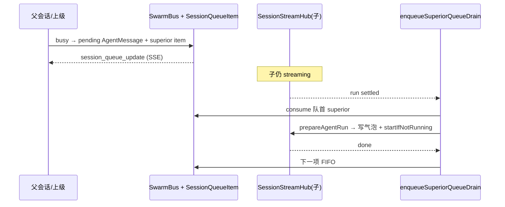
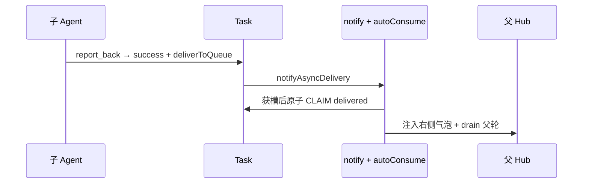
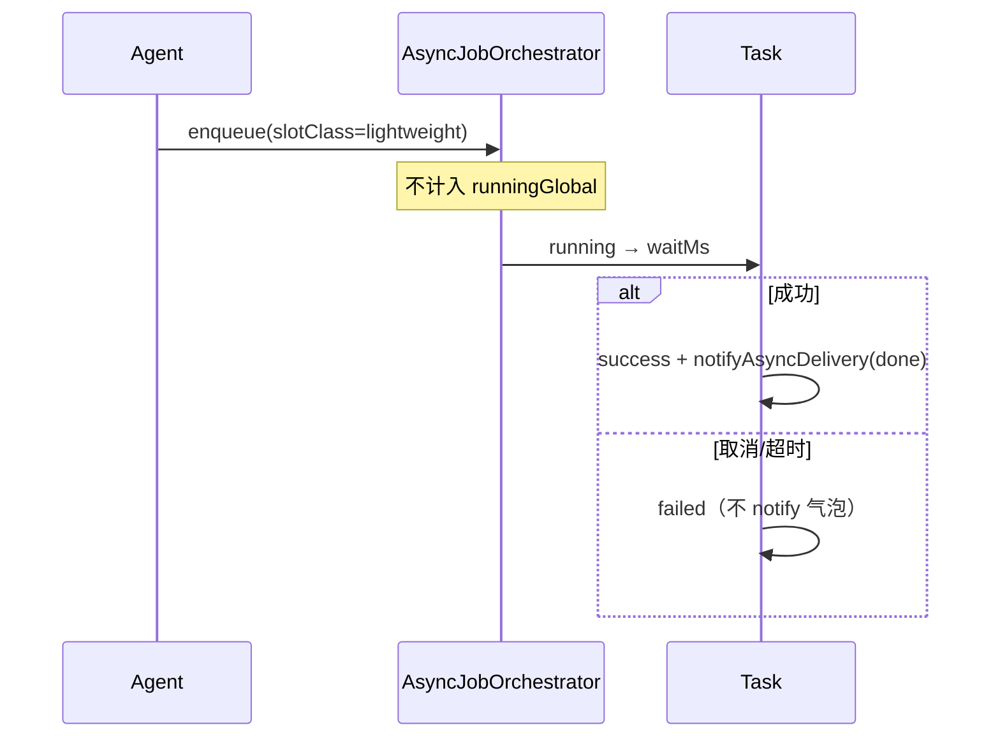

# 父子 Agent 异步通道 · 时序 · 并发槽位

> 状态：已落地（2026-07-18）。与 `concurrency.md`「全局任务池」、`async-tools-semantics.md`、`design-decisions.md` 配套。
> 目标：把「父→子消息 / 子→父结果 / 过程通知 / 槽位」收成一份可读的期望语义，避免再靠 UI 时序猜。

---

## 1. 设计目标（一句话）

- **父→子**：空闲直接变气泡起流；忙则进子会话发送队列（`SessionQueueItem.kind=superior`），空闲后 **FIFO 一条一条** 消费。
- **子→父正式结果**：只走 `agent_report_back` → Task 异步队列 → 父右栏「异步结果」→ 认领后注入父会话气泡并触发 drain。
- **子→父过程通知**：只走 `agent_notify_parent` → 父发送队列 `child_notify`（与用户待发同队列、同 FIFO），**不进**右栏异步结果。
- **右栏**：任务看板（进行中 / 待消费 / 已消费），不是流水账聊天区。
- **槽位**：烧 LLM 的后台任务占全局槽；`sleep` / 纯工具短任务走 **lightweight**，不堵 LLM。

---

## 2. 通道矩阵（勿混用）

| 方向 | 工具 / 载体 | 落点 | 是否起父流 | 典型用途 |
|---|---|---|---|---|
| 父 → 子 | `agent_send_message` / superior 队列 | 子会话气泡或 `SessionQueueItem(superior)` | 子空闲时由**服务端** drain 起流 | 派活、催进度 |
| 子 → 父（正式） | `agent_report_back` | `Task` + 父右栏异步队列 | 认领后父会话 drain | 最终交付 |
| 子 → 父（过程） | `agent_notify_parent` | 父 `SessionQueueItem(child_notify)` | 父空闲 FIFO 消费 | 阶段性汇报 |
| 父本地定时 | `sleep(async=true)` | `Task(sourceType=sleep)` → 成功才投递 | 成功认领后起流 | 延时续跑 |
| 父纯工具后台 | `async_task_run(toolCall=…)` | `Task(sourceType=async_task_tool)` | 成功认领后起流 | 无 LLM 的后台 shell 等 |

**禁止**：把子 Agent 整段 ReAct 流水账镜像进父会话；把失败的 sleep/纯工具错误当「用户气泡」灌进父对话（会诱发 LLM 重试风暴）。

---

## 3. 期望场景

### S1：父派子（异步，不阻塞父）

1. 父调 `spawn_subagent(waitForResult=false, task=…)`。
2. 创建子 Agent + 子会话；任务入子会话并起流（新会话必闲）。
3. 父继续对话；右栏出现进行中任务。
4. 子完成后 `agent_report_back` → 父右栏待消费 → 认领注入父气泡 → 父 drain 新一轮。

### S2：父在子忙时再发消息

1. 子正在 streaming。
2. 父（或上级）再发 → **不写**子 ChatMessage，写 `SessionQueueItem(superior)` + SSE `session_queue_update`。
3. 子结束后服务端 superior drain：**一条** consume → 写气泡 → 起流 → 再下一条（FIFO）。
4. 前端对 superior **不起第二路流**（只服务端起流），避免双 drain。

### S3：子过程通知

1. 子调 `agent_notify_parent(content=…)`。
2. 父发送队列出现 `child_notify`（可展开看正文）。
3. 父空闲时与用户待发一样 FIFO 消费；消费后 remove，不连发。

### S4：sleep 延时续跑

1. Agent 调 `sleep(async=true, seconds=10)`。
2. 立刻返回 jobId；Task 在右栏「进行中」，**不占 LLM 槽**。
3. 到时成功 → 结果进异步队列 → 认领后父续跑。
4. 取消/超时失败 → Task 标 failed，**不注入对话气泡**。

### S5：槽位打满时的用户感知

1. `maxConcurrent=2` 且已有 2 路后台 LLM / 交互占用。
2. 新的 `spawn_subagent` / `async_task_run(mode=llm)` → Task `queued`，右栏显示「第 N 位 · 因 global 上限排队」。
3. 同时再开多个 `sleep` / 纯工具 → **仍立即 running**（lightweight），不挤占上述 2 槽。

---

## 4. 时序（关键路径）

### 4.1 父→子 superior 队列

### 4.2 子→父 report_back

### 4.3 sleep（lightweight）

---

## 5. 并发槽位设计

### 5.1 两类槽

| slotClass | 谁用 | 是否计入 `maxConcurrent` | 取消 / 超时 |
|---|---|---|---|
| `llm`（默认） | `spawn_subagent`、后台 LLM、`async_task_run(mode=llm)`、heartbeat/trigger 等 | ✅ 全局占用 = 池内 llm running + hub 交互 running | ✅ |
| `lightweight` | `sleep(async)`、`async_task_run(mode=tool)` | ❌ 不堵 LLM | ✅（同一套 cancel / AbortSignal.reason） |

配置锚点：`config.yaml` → `asyncJobs.maxConcurrent`（只约束 llm 类）。

### 5.2 为什么要拆

旧实现把 sleep 也塞进全局池 → 两个 sleep 就能占满 `maxConcurrent=2` → 真正的子 Agent / 后台推理排队或被池 abort → 错误文案还写成「用户中断」→ 父会话被失败气泡灌爆并诱发重试。

根治：

1. **容量口径**：lightweight 不进 `runningGlobal`。
2. **文案口径**：`AbortSignal.reason` = `user | timeout | cancel | pool | session_stop`，见 `infra/abortReason.ts`。
3. **投递口径**：sleep / 纯工具 **失败不注入**父会话气泡（`autoConsumeAsyncDelivery` 跳过）。

### 5.3 与 Workspace 配额的关系（已落地）

- **全局硬顶**：`asyncJobs.maxConcurrent` 仍是烧钱上限（llm 槽）。
- **行级配额**：`Workspace.asyncSlotQuota`（默认业务空间 `2`；Root `0`=本空间不限）。
- **准入**：`global` AND `workspaceSlotQuota`（及 `maxPerSession`）；lightweight 两边都不计。
- 详见 `design-decisions.md`「Workspace 层级 + 超级 Agent」（已拍板）。

### 5.4 Abort 原因码

| reason | 文案 | 典型来源 |
|---|---|---|
| `user` | 流式输出已被用户中断 | 用户点停止 / `hub.stop(id,"user")` |
| `timeout` | 任务执行超时被中止 | 池 taskTimeout |
| `cancel` | 任务已被主动取消 | `cancelAsyncJob` / 池 cancel |
| `pool` | 任务被调度层中止… | 预留 |
| `session_stop` | 会话已停止，关联任务被中止 | hub.clear / stopSubagent |

---

## 6. UI 不变量（前端）

1. 发送队列：`user` / `superior` / `child_notify` 同源 merge；展开可见正文。
2. superior：**仅服务端起流**；前端队首是 superior 时停 drain，避免双跑。
3. `child_notify`：与 user 一样 consume 后移除。
4. 右栏进行中任务耗时本地 1s tick；队列变更靠 SSE + 短轮询兜底。

---

## 7. 自检清单（改队列 / 池之前）

- [ ] 这条路径是正式结果、过程通知，还是本地定时？通道有没有串？
- [ ] 失败会不会灌进父气泡诱发重试？
- [ ] 新任务是 llm 还是 lightweight？会不会误占 `maxConcurrent`？
- [ ] abort 文案是否按 `signal.reason`，而不是一律「用户中断」？
- [ ] superior 是否仍只有服务端一条 drain 链？

---

## 8. 相关代码锚点

| 模块 | 路径 |
|---|---|
| 槽位 / abort reason | `apps/server/src/infra/asyncJobOrchestrator.ts`、`abortReason.ts` |
| 投递 / sleep / 纯工具 | `apps/server/src/infra/asyncJobManager.ts` |
| 父子通知工具 | `apps/server/src/infra/tools/native/notify.ts`、`swarm.ts` |
| 前端队列 drain | `apps/web/lib/useChatQueueDrain.ts` |
| 配置 | `config.yaml` → `asyncJobs` |
